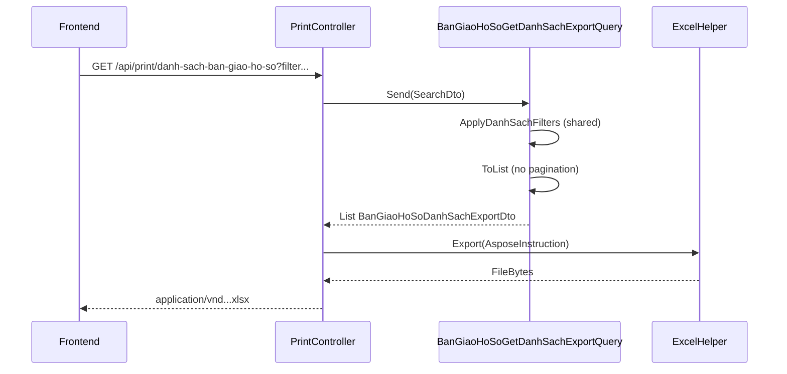
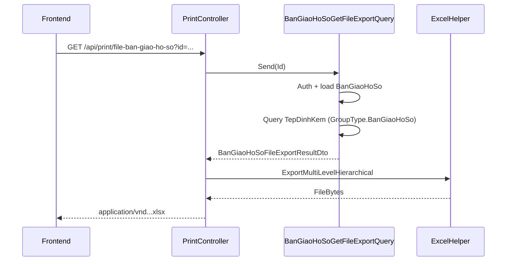

# Task – Export Excel cho màn hình Bàn giao hồ sơ

**Ngày tạo:** 25/06/2026  
**Cập nhật:** 25/06/2026  
**Trạng thái:** ✅ **IMPLEMENTED**  
**Module:** `BanGiaoHoSo`  
**Pattern tham chiếu:**
- Danh sách + filter: `BanGiaoHoSoGetDanhSachQuery`, `BanGiaoHoSoSearchDto`
- Export danh sách (Aspose flat): `PhanKhaiKinhPhiGetDanhSachExportQuery` + `PrintController.InDanhSachPhanKhaiKinhPhi`
- Export danh sách (reuse filter): `DuAnGetDanhSachExportQuery` (comment *"Reuse filter set from DuAnGetDanhSachQuery"*)
- Export file hierarchical: `ExportMultiLevelHierarchical` (`ExcelHelper`, `MultiLevelHierarchicalInstruction`)
- Print Word hiện có: `GET /api/print/bien-ban-ban-giao-ho-so` + `BanGiaoHoSoPrintQuery`

---

## Executive Summary

Bổ sung **2 API export Excel** cho module **Bàn giao hồ sơ**:

| # | Mục đích | Trigger UI | Route |
|---|----------|------------|-------|
| 1 | Export **toàn bộ danh sách** (theo filter grid, không phân trang) | Nút **In excel** trên toolbar | `GET /api/print/danh-sach-ban-giao-ho-so` |
| 2 | Export **danh sách file đính kèm** của **một** bản ghi | Icon file (📎) trên từng dòng | `GET /api/print/file-ban-giao-ho-so?id={banGiaoHoSoId}` |

**Không sửa migration.** **Không tạo model/DTO trong WebApi** — DTO export đặt trong `QLDA.Application/BanGiaoHoSos/DTOs/`.

---

## 1. Hiện trạng source

### 1.1 API danh sách đang có

```
GET /api/ban-giao-ho-so/danh-sach
  ?trangThai=
  &duAnId=
  &buocId=
  &globalFilter=
  &pageIndex=
  &pageSize=
```

| Thành phần | File |
|------------|------|
| Controller | `QLDA.WebApi/Controllers/BanGiaoHoSoController.cs` |
| Search DTO | `QLDA.Application/BanGiaoHoSos/DTOs/BanGiaoHoSoSearchDto.cs` |
| Query handler | `QLDA.Application/BanGiaoHoSos/Queries/BanGiaoHoSoGetDanhSachQuery.cs` |
| Response DTO | `QLDA.Application/BanGiaoHoSos/DTOs/BanGiaoHoSoDto.cs` |

### 1.2 Logic filter dùng chung (`ApplyDanhSachFilters`)

Cả **danh sách** và **export** gọi `BanGiaoHoSoQueryableExtensions.ApplyDanhSachFilters`:

```
FilterVisibleChildEntities (auth theo BuocId)
  → Where CreatedBy == current user (_authContext.UserId)
  → WhereIf TrangThai / DuAnId / BuocId
  → WhereGlobalFilter(searchDto, e => e.Ma, e => e.TenHoSo, e => e.GhiChu)   ← trước join
  → LeftOuterJoin UserMaster (TenNguoiTao)
  → LeftOuterJoin DmDonVi × 2 (TenPhongBan, TenPhongBanNhan)
  → OrderByDescending CreatedAt
  → Select BanGiaoHoSoDanhSachJoinedRow { E, User, DonViChuTri, DonViNhan }
```

**`globalFilter`** — convention project (`WhereGlobalFilter`):

| Trường search | Ghi chú |
|---------------|---------|
| `Ma` | Mã hồ sơ |
| `TenHoSo` | Tên hồ sơ |
| `GhiChu` | Ghi chú |

**Không** search qua join (tên dự án, bước, phòng ban, người tạo, text trạng thái).

Sau extension:
- **Danh sách:** `Select` → `BanGiaoHoSoDto` (kèm subquery tệp) → `PaginatedListAsync`
- **Export:** `ToListAsync` → map in-memory → `BanGiaoHoSoDanhSachExportDto`

### 1.3 Cột hiển thị trên UI (picture 1)

| Cột UI | Field nguồn trong `BanGiaoHoSoDto` | Export? |
|--------|-------------------------------------|---------|
| STT | (index + 1) | ✅ |
| Mã hồ sơ | `Ma` | ✅ |
| Tên hồ sơ | `TenHoSo` | ✅ |
| Phòng ban chủ trì | `TenPhongBan` | ✅ |
| Ngày tạo | `CreatedAt` (format `dd/MM/yyyy`) | ✅ |
| Trạng thái | `TenTrangThai` | ✅ |
| Icon file / số tệp | `DanhSachTepHSBanGiao` | ❌ |
| Icon menu `...` / sửa / xóa | — | ❌ |

**Không export:** `DanhSachTepHSBanGiao`, `DanhSachBienBanBanGiao`, `Id`, `DuAnId`, `BuocId`, …

### 1.4 Tệp đính kèm

Mỗi `BanGiaoHoSo` có **2 loại** tệp qua `TepDinhKem`:

| GroupType | Thời điểm gắn | Hiển thị trên grid |
|-----------|-----------------|-------------------|
| `EGroupType.BanGiaoHoSo` | Insert / Update | Icon 📎 + count |
| `EGroupType.BienBanBanGiao` | Endpoint `ban-giao` | Không hiện trên cột file grid |

**API export file (task 2)** chỉ lấy `EGroupType.BanGiaoHoSo` — khớp icon file trên từng dòng danh sách.

Query pattern (đã có trong `GetDanhSachQuery`):

```csharp
_tepDinhKemRepository.GetQueryableSet()
    .Where(f => f.GroupId == banGiaoHoSoId.ToString()
             && f.GroupType == nameof(EGroupType.BanGiaoHoSo))
```

### 1.5 Print API hiện có (Word)

```
GET /api/print/bien-ban-ban-giao-ho-so?id={guid}
```

- Template: `PrintTemplates/Word/BienBanBanGiao.docx`
- Query: `BanGiaoHoSoPrintQuery` → `BanGiaoHoSoPrintDto`
- **Khác** với 2 API Excel mới — không sửa endpoint này.

---

## 2. API 1 – In Excel danh sách Bàn giao hồ sơ

### 2.1 Endpoint

```http
GET /api/print/danh-sach-ban-giao-ho-so
```

**Query params** — reuse `BanGiaoHoSoSearchDto` (bind trực tiếp, không cần WebApi model):

| Param | Kiểu | Mô tả |
|-------|------|-------|
| `trangThai` | `int?` | `1` = Khởi tạo, `2` = Đã bàn giao |
| `duAnId` | `Guid?` | Lọc theo dự án |
| `buocId` | `int?` | Lọc theo bước |
| `globalFilter` | `string?` | Tìm trong `Ma`, `TenHoSo`, `GhiChu` (OR, không phân biệt hoa thường) |

**Không nhận** `pageIndex` / `pageSize` — export toàn bộ kết quả sau filter.

**Ví dụ:**

```http
GET /api/print/danh-sach-ban-giao-ho-so?trangThai=2&duAnId=08deab16-...&buocId=4827&globalFilter=54444
```

### 2.2 Response

- `Content-Type`: `application/vnd.openxmlformats-officedocument.spreadsheetml.sheet`
- `Content-Disposition`: attachment
- Tên file: `DanhSachBanGiaoHoSo_ddMMyyyy_HHmmss.xlsx` (theo `GetDownloadFileName`)

### 2.3 Yêu cầu nghiệp vụ

1. Dữ liệu export **phải khớp** danh sách đang hiển thị trên UI (cùng filter).
2. **Không** kèm danh sách file đính kèm.
3. **Không** phụ thuộc phân trang.
4. Nếu không có dữ liệu: theo convention project → `ManagedException` với message `"Không có dữ liệu để xuất"` (tham chiếu `KeHoachTrienKhaiHangMucGetExportQuery`).

### 2.4 Thiết kế kỹ thuật

#### A. Filter dùng chung ✅

**File:** `QLDA.Application/BanGiaoHoSos/Queries/BanGiaoHoSoQueryableExtensions.cs`

- `ApplyDanhSachFilters` → `IQueryable<BanGiaoHoSoDanhSachJoinedRow>`
- `GetTrangThaiText` — map enum → text hiển thị
- `OrderByDescending(CreatedAt)` nằm **trong** extension, **trước** `Select` joined row (EF Core không translate `OrderBy` sau projection phức tạp)
- `BanGiaoHoSoDanhSachJoinedRow` dùng **class** (property `E`), không dùng record

#### B. Export Query ✅

**File:** `QLDA.Application/BanGiaoHoSos/Queries/BanGiaoHoSoGetDanhSachExportQuery.cs`

```csharp
public record BanGiaoHoSoGetDanhSachExportQuery : IRequest<List<BanGiaoHoSoDanhSachExportDto>>
{
    public BanGiaoHoSoSearchDto SearchDto { get; set; } = new();
}
```

Handler:
1. Gọi `ApplyDanhSachFilters(...)` → `ToListAsync`
2. `ManagedException.ThrowIf(rows.Count == 0, "Không có dữ liệu để xuất")` — check trong handler, không ở `PrintController`
3. Map in-memory sang `BanGiaoHoSoDanhSachExportDto` — **không** subquery tệp đính kèm
4. `Stt = index + 1`, `NgayTao = CreatedAt.LocalDateTime.ToString("dd/MM/yyyy")`

#### C. Export DTO ✅

**File:** `QLDA.Application/BanGiaoHoSos/DTOs/BanGiaoHoSoDanhSachExportDto.cs`

Property name **khớp placeholder** template Excel (`$Field`):

| Property | Placeholder template | Nguồn |
|----------|---------------------|-------|
| `Stt` | `$Stt` | index + 1 |
| `Ma` | `$Ma` | `BanGiaoHoSo.Ma` |
| `TenHoSo` | `$TenHoSo` | `BanGiaoHoSo.TenHoSo` |
| `TenPhongBan` | `$TenPhongBan` | `DmDonVi.TenDonVi` (phòng chủ trì) |
| `NgayTao` | `$NgayTao` | `CreatedAt` → `dd/MM/yyyy` |
| `TenTrangThai` | `$TenTrangThai` | enum → text ("Khởi tạo" / "Đã bàn giao") |

#### D. PrintController endpoint ✅

**File:** `QLDA.WebApi/Controllers/PrintController.cs` — `#region DanhSachBanGiaoHoSo` → `InDanhSachBanGiaoHoSo`

#### E. Excel template ✅

**File:** `QLDA.WebApi/PrintTemplates/DanhSachBanGiaoHoSo.xlsx`

- Layout: `LetterheadExport` (giống `DanhSachPhanKhaiKinhPhi`)
- Hàng mẫu: **R5** — marker `$Stt`, `$Ma`, `$TenHoSo`, `$TenPhongBan`, `$NgayTao`, `$TenTrangThai`
- Sinh bằng **QLDA.Gen** — descriptor `DanhSachBanGiaoHoSoExportDescriptor`

```powershell
dotnet run --project e:\SER\QLDA.Gen\QLDA.Gen.csproj -- danh-sach-ban-giao-ho-so --force e:\SER\QLDA.WebApi\PrintTemplates
```

---

## 3. API 2 – Xuất danh sách file theo bàn giao hồ sơ

### 3.1 Endpoint

```http
GET /api/print/file-ban-giao-ho-so?id={banGiaoHoSoId}
```

| Param | Kiểu | Bắt buộc | Mô tả |
|-------|------|----------|-------|
| `id` | `Guid` | ✅ | Id bản ghi `BanGiaoHoSo` |

**Ví dụ:**

```http
GET /api/print/file-ban-giao-ho-so?id=08deb170-f677-d039-687a-7b356802b551
```

### 3.2 Response

- Excel file danh sách file đính kèm của **đúng** bản ghi truyền vào
- Tên file: `DanhSachFileBanGiaoHoSo_ddMMyyyy_HHmmss.xlsx`

### 3.3 Cột export (picture 2)

| Cột UI mẫu | Property | Nguồn dữ liệu |
|------------|----------|---------------|
| STT | `Stt` | Auto-number trong nhóm dự án |
| Dự án | `TenDuAn` | `BanGiaoHoSo.DuAn.TenDuAn` |
| Tên file | `TenFile` | `TepDinhKem.OriginalName ?? FileName` |
| Thời gian đính kèm | `ThoiGianDinhKem` | `TepDinhKem.CreatedAt` (format `dd/MM/yyyy` hoặc `M/d/yyyy` theo mẫu) |

**Layout mẫu (hierarchical):** Một dự án có nhiều file → cột **STT** và **Dự án** merge dọc (vertical merge). Dùng `ExportMultiLevelHierarchical`.

```
| STT | Dự án      | Tên file          | Thời gian đính kèm |
|-----|------------|-------------------|--------------------|
|  1  | Tên dự án  | QD-12-2024.pdf    | 15/02/2024         |
|     | (merged)   | QD-13-2024.pdf    | 15/02/2024         |
|     |            | QD-14-2024.pdf    | 15/02/2024         |
```

### 3.4 Phạm vi file

| Loại | GroupType | Export? |
|------|-----------|---------|
| Tệp HS bàn giao | `BanGiaoHoSo` | ✅ |
| Biên bản bàn giao | `BienBanBanGiao` | ❌ |

Filter:

```csharp
GroupId == banGiaoHoSoId.ToString()
&& GroupType == nameof(EGroupType.BanGiaoHoSo)
```

**Không** query file toàn hệ thống / toàn dự án (`DuAnGetDanhSachTepDinhKemQuery` là pattern khác).

### 3.5 Authorization

Export file phải kiểm tra user **có quyền xem** bản ghi đó:

```
1. Load BanGiaoHoSo by id (Include DuAn)
2. FilterVisibleChildEntities — record phải visible theo BuocId
3. CreatedBy == current user (cùng rule danh sách)
4. Nếu không thỏa → ManagedException "Không tìm thấy bản ghi" hoặc 403
```

### 3.6 Thiết kế kỹ thuật

#### A. Export Query ✅

**File:** `QLDA.Application/BanGiaoHoSos/Queries/BanGiaoHoSoGetFileExportQuery.cs`

```csharp
public record BanGiaoHoSoGetFileExportQuery(Guid Id)
    : IRequest<BanGiaoHoSoFileExportResultDto>;
```

**File:** `QLDA.Application/BanGiaoHoSos/DTOs/BanGiaoHoSoFileExportResultDto.cs`

```csharp
public class BanGiaoHoSoFileExportResultDto
{
    public string? TenDuAn { get; set; }
    public List<BanGiaoHoSoFileExportItemDto> Files { get; set; } = [];
}

public class BanGiaoHoSoFileExportItemDto
{
    public string? TenFile { get; set; }
    public DateTimeOffset ThoiGianDinhKem { get; set; }
}
```

Handler logic:
1. Auth + load `BanGiaoHoSo` + `TenDuAn`
2. Query `TepDinhKem` theo `GroupId` + `GroupType.BanGiaoHoSo`
3. `OrderBy(f => f.CreatedAt)`
4. `ManagedException.ThrowIf(files.Count == 0, "Không có dữ liệu để xuất")`

#### B. Build rows cho `ExportMultiLevelHierarchical` ✅

**File:** `PrintController.InFileBanGiaoHoSo` — file đầu tiên trong QLDA dùng `ExportMultiLevelHierarchical`.

```csharp
for (var i = 0; i < result.Files.Count; i++)
{
    var file = result.Files[i];
    rows.Add(new Dictionary<string, object?>
    {
        ["Level"] = i == 0 ? 1 : 2,
        ["TenDuAn"] = i == 0 ? result.TenDuAn : null,
        ["TenFile"] = file.TenFile,
        ["ThoiGianDinhKem"] = file.ThoiGianDinhKem.LocalDateTime.ToString("dd/MM/yyyy"),
    });
}

_excelExporter.ExportMultiLevelHierarchical(new MultiLevelHierarchicalInstruction
{
    TemplatePath = templatePath,
    Rows = rows,
    RootLevel = 1,
    MergedColumnIndices = [0, 1],   // STT + Dự án
    SttPropertyName = "Stt",
    SttColumnIndex = 0,
});
```

#### C. PrintController endpoint ✅

`#region FileBanGiaoHoSo` → `InFileBanGiaoHoSo`

#### D. Excel template ✅

**File:** `QLDA.WebApi/PrintTemplates/DanhSachFileBanGiaoHoSo.xlsx`

- Layout: `LetterheadExport`, hàng mẫu **R5**
- Marker: `$Stt`, `$TenDuAn`, `$TenFile`, `$ThoiGianDinhKem`
- Descriptor: `DanhSachFileBanGiaoHoSoExportDescriptor`

```powershell
dotnet run --project e:\SER\QLDA.Gen\QLDA.Gen.csproj -- danh-sach-file-ban-giao-ho-so --force e:\SER\QLDA.WebApi\PrintTemplates
```

---

## 4. Sơ đồ luồng

### 4.1 Export danh sách



### 4.2 Export file theo dòng



---

## 5. Checklist implement

### Application layer

- [x] `BanGiaoHoSoQueryableExtensions.cs` — `ApplyDanhSachFilters` + `WhereGlobalFilter`
- [x] Refactor `BanGiaoHoSoGetDanhSachQueryHandler` dùng extension
- [x] `BanGiaoHoSoDanhSachExportDto.cs`
- [x] `BanGiaoHoSoGetDanhSachExportQuery.cs` + Handler
- [x] `BanGiaoHoSoFileExportItemDto` + `BanGiaoHoSoFileExportResultDto` (cùng file)
- [x] `BanGiaoHoSoGetFileExportQuery.cs` + Handler (auth + file query)

### WebApi layer

- [x] `PrintController` — `InDanhSachBanGiaoHoSo`
- [x] `PrintController` — `InFileBanGiaoHoSo`
- [x] `PrintTemplates/DanhSachBanGiaoHoSo.xlsx`
- [x] `PrintTemplates/DanhSachFileBanGiaoHoSo.xlsx`
- [x] Template copy vào output (cùng pattern `QLDA.WebApi.csproj` với template khác)

### QLDA.Gen

- [x] `DanhSachBanGiaoHoSoExportDescriptor.cs`
- [x] `DanhSachFileBanGiaoHoSoExportDescriptor.cs`
- [x] Đăng ký slug trong `Program.cs`: `danh-sach-ban-giao-ho-so`, `danh-sach-file-ban-giao-ho-so`

### Không sửa (đã tuân thủ)

- [x] Migration / `AppDbContextModelSnapshot.cs`
- [x] `BanGiaoHoSoController` (export nằm ở `PrintController`)
- [x] Model/DTO trong `QLDA.WebApi/Models/BanGiaoHoSos/`

### Verify

- [x] `dotnet build` — Application + WebApi pass
- [ ] Test Postman 2 endpoint (cần restart WebApi sau deploy)
- [ ] So sánh số dòng export vs `totalRows` của `/danh-sach` (cùng filter, bỏ paging)

---

## 6. Test plan

### 6.1 Export danh sách

**Setup:** Có ≥ 3 bản ghi, filter `globalFilter` thu hẹp còn 1.

| # | Request | Kỳ vọng |
|---|---------|---------|
| 1 | Không filter | Số dòng Excel = `totalRows` của `/danh-sach` (cùng user) |
| 2 | `globalFilter` match `Ma`/`TenHoSo`/`GhiChu` + `trangThai` + `duAnId` + `buocId` | Chỉ record match filter |
| 3 | `globalFilter=xyz` không match 3 trường text | HTTP 400, `"Không có dữ liệu để xuất"` |
| 3b | `globalFilter` = tên dự án / phòng ban | **Không** match (by design) |
| 4 | Kiểm tra cột | Có đủ 6 cột; **không** có cột file/thao tác |
| 5 | `NgayTao` | Format `dd/MM/yyyy` khớp grid |

### 6.2 Export file

| # | Request | Kỳ vọng |
|---|---------|---------|
| 1 | `id` hợp lệ, có file HS bàn giao | Excel có đúng số file = count icon 📎 trên dòng |
| 2 | `id` hợp lệ, không có file | HTTP 400, `"Không có dữ liệu để xuất"` |
| 3 | `id` không tồn tại | `"Không tìm thấy bản ghi"` |
| 4 | `id` của user khác | Không trả file (404/403) |
| 5 | File chỉ có `BienBanBanGiao` | Không xuất (count grid = 0 cho HS bàn giao) |
| 6 | Layout | STT + Dự án merge khi nhiều file |

### 6.3 Regression

- [ ] `GET /api/ban-giao-ho-so/danh-sach` — behavior không đổi sau refactor filter
- [ ] `GET /api/print/bien-ban-ban-giao-ho-so` — Word export vẫn hoạt động

---

## 7. Rủi ro & quyết định mở

| # | Chủ đề | Quyết định | Trạng thái |
|---|--------|------------|------------|
| 1 | Filter list vs export | `ApplyDanhSachFilters` dùng chung | ✅ Done |
| 2 | `globalFilter` scope | Chỉ `Ma`, `TenHoSo`, `GhiChu` qua `WhereGlobalFilter` | ✅ Done |
| 3 | Ngày tạo vs Ngày bàn giao | Export **Ngày tạo** (`CreatedAt`, `dd/MM/yyyy`) | ✅ |
| 4 | File export scope | Chỉ `EGroupType.BanGiaoHoSo` | ✅ |
| 5 | Layout file export | `ExportMultiLevelHierarchical`, merge cột STT + Dự án | ✅ |
| 6 | Role-based auth | `[Authorize]` + `FilterVisibleChildEntities` + `CreatedBy` | ✅ |
| 7 | Empty export | Handler throw `"Không có dữ liệu để xuất"` | ✅ |

---

## 8. Files đã tạo / sửa

| File | Hành động |
|------|-----------|
| `QLDA.Application/BanGiaoHoSos/Queries/BanGiaoHoSoQueryableExtensions.cs` | Tạo |
| `QLDA.Application/BanGiaoHoSos/Queries/BanGiaoHoSoGetDanhSachQuery.cs` | Sửa — dùng extension |
| `QLDA.Application/BanGiaoHoSos/Queries/BanGiaoHoSoGetDanhSachExportQuery.cs` | Tạo |
| `QLDA.Application/BanGiaoHoSos/Queries/BanGiaoHoSoGetFileExportQuery.cs` | Tạo |
| `QLDA.Application/BanGiaoHoSos/DTOs/BanGiaoHoSoDanhSachExportDto.cs` | Tạo |
| `QLDA.Application/BanGiaoHoSos/DTOs/BanGiaoHoSoFileExportResultDto.cs` | Tạo (kèm `BanGiaoHoSoFileExportItemDto`) |
| `QLDA.WebApi/Controllers/PrintController.cs` | Sửa — 2 endpoint |
| `QLDA.WebApi/PrintTemplates/DanhSachBanGiaoHoSo.xlsx` | Tạo (QLDA.Gen) |
| `QLDA.WebApi/PrintTemplates/DanhSachFileBanGiaoHoSo.xlsx` | Tạo (QLDA.Gen) |
| `QLDA.Gen/Descriptors/DanhSachBanGiaoHoSoExportDescriptor.cs` | Tạo |
| `QLDA.Gen/Descriptors/DanhSachFileBanGiaoHoSoExportDescriptor.cs` | Tạo |
| `QLDA.Gen/Program.cs` | Sửa — đăng ký 2 slug |

**Tổng:** 12 file

---

## 9. Tham chiếu source

```
QLDA.Application/BanGiaoHoSos/Queries/BanGiaoHoSoQueryableExtensions.cs   → filter dùng chung
QLDA.Application/BanGiaoHoSos/Queries/BanGiaoHoSoGetDanhSachQuery.cs
QLDA.Application/BanGiaoHoSos/Queries/BanGiaoHoSoGetDanhSachExportQuery.cs
QLDA.Application/BanGiaoHoSos/Queries/BanGiaoHoSoGetFileExportQuery.cs
QLDA.Application/BanGiaoHoSos/DTOs/BanGiaoHoSoSearchDto.cs
QLDA.WebApi/Controllers/BanGiaoHoSoController.cs
QLDA.WebApi/Controllers/PrintController.cs
QLDA.Gen/Descriptors/DanhSachBanGiaoHoSoExportDescriptor.cs
QLDA.Gen/Descriptors/DanhSachFileBanGiaoHoSoExportDescriptor.cs
QLDA.Application/PhanKhaiKinhPhis/Queries/PhanKhaiKinhPhiGetDanhSachExportQuery.cs
BuildingBlocks.Infrastructure/Offices/ExcelHelper.cs
BuildingBlocks.CrossCutting/ExtensionMethods/GlobalFilterExtensions.cs   → WhereGlobalFilter
BuildingBlocks.CrossCutting/Offices/MultiLevelHierarchicalInstruction.cs
```

---

## 10. Ghi chú triển khai

### Bug đã xử lý khi test

Export danh sách trả **400** (`Lỗi hệ thống`) do EF Core không translate `OrderByDescending` sau `Select` sang `BanGiaoHoSoDanhSachJoinedRow`.

**Fix:** `OrderByDescending` trong `ApplyDanhSachFilters` trước `Select`; export map DTO in-memory sau `ToListAsync`.

### Regenerate cả 2 template

```powershell
dotnet run --project e:\SER\QLDA.Gen\QLDA.Gen.csproj -- danh-sach-ban-giao-ho-so danh-sach-file-ban-giao-ho-so --force e:\SER\QLDA.WebApi\PrintTemplates
```

### Convention cho module sau

- Filter list/export: tách `*QueryableExtensions.Apply*Filters`
- `globalFilter`: `WhereGlobalFilter` trên **text field của entity gốc**, trước join — tránh chuỗi `||` dài sau join
- Export empty: `ManagedException` trong query handler

---

**Version:** 2.0  
**Next step:** Test Postman 2 endpoint sau restart WebApi; so sánh `totalRows` list vs số dòng Excel
