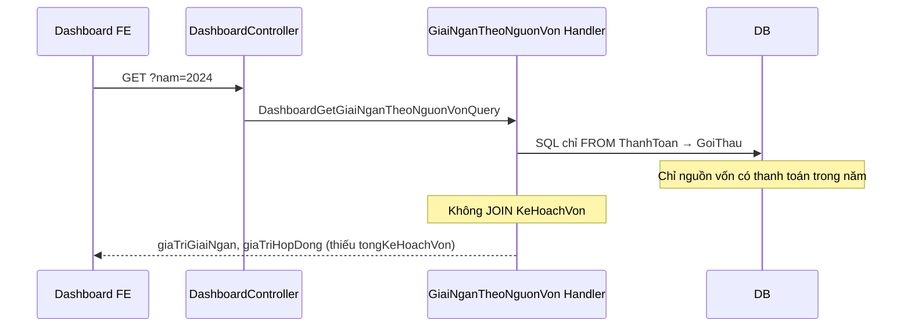

# Issue: API giải ngân theo nguồn vốn thiếu `tongKeHoachVon`

## Tóm tắt

Khi gọi **GET** `/api/thong-ke/giai-ngan-theo-nguon-von?nam={year}`, API trả về đúng `giaTriGiaiNgan` và `giaTriHopDong` theo từng nguồn vốn, nhưng **không lấy kế hoạch vốn năm** từ bảng `dbo.KeHoachVon`. Dashboard UC7 (#9450) cần field này để hiển thị tổng KHV và tính tỷ lệ % giải ngân so với kế hoạch.

**Nguyên nhân gốc:** handler Dapper chỉ query chuỗi `ThanhToan` → `GoiThau`; danh sách nguồn vốn suy ra khi **có thanh toán** trong năm → nguồn vốn **chỉ có kế hoạch, chưa giải ngân** không xuất hiện. DTO response cũng không có property map `TongKeHoachVon`.

> **Liên quan:** Issue #9450 — UC7 Dashboard giải ngân theo nguồn vốn (`docs/issues/9450/report.md`).

---

## Hiện trạng (reproduce)

### API bị ảnh hưởng

| Method | Endpoint | Ghi chú |
| ------ | -------- | ------- |
| GET | `/api/thong-ke/giai-ngan-theo-nguon-von?nam={year}` | Thống kê tổng hợp theo nguồn vốn |

**Không ảnh hưởng:** `chi-tiet-giai-ngan`, `tien-do-giai-ngan-nguon-von`.

### Request mẫu

```
GET /api/thong-ke/giai-ngan-theo-nguon-von?nam=2024
Authorization: Bearer {token}
Accept: application/json
```

### Response trước khi fix

```json
{
  "result": true,
  "errorMessage": "",
  "dataResult": [
    {
      "nguonVonId": 1,
      "tenNguonVon": "Vốn sự nghiệp",
      "giaTriGiaiNgan": 5022000000,
      "giaTriHopDong": 3822222222
    }
  ]
}
```

| Field | Kỳ vọng (UC7) | Thực tế (trước fix) |
| ----- | ------------- | ------------------- |
| `giaTriGiaiNgan` | SUM `ThanhToan.GiaTri` theo nguồn vốn | OK |
| `giaTriHopDong` | SUM `HopDong.GiaTri` theo nguồn vốn | OK |
| `tongKeHoachVon` | SUM kế hoạch vốn từ `KeHoachVon` theo `NguonVonId` + `Nam` | **Thiếu field** |
| Nguồn chỉ có KHV, chưa giải ngân | Xuất hiện với `giaTriGiaiNgan = 0` | **Không có trong response** |

### Kết quả DB (nguồn dữ liệu KHV)

Bảng `dbo.KeHoachVon` **đã có dữ liệu** theo `NguonVonId`, `Nam`, `SoVon`, `SoVonDieuChinh` — nhưng API không đọc:

| Bảng | Kỳ vọng | Thực tế (trước fix) |
| ---- | ------- | ------------------- |
| `KeHoachVon` | Aggregate SUM theo `NguonVonId` → trả về API | **Không được query** |
| `ThanhToan` + `GoiThau` | SUM giải ngân theo nguồn vốn | OK (nguồn duy nhất của danh sách) |

---

## Mô hình dữ liệu

### Bảng kế hoạch vốn

Entity: `QLDA.Domain/Entities/KeHoachVon.cs`  
Table: `dbo.KeHoachVon` (schema đã có — **không cần migration**)

| Cột | Kiểu | Ghi chú |
| --- | ---- | ------- |
| `NguonVonId` | `int?` | FK → `DmNguonVon` — **key group** |
| `Nam` | `int` | Năm kế hoạch — filter `@Nam` |
| `SoVon` | `decimal(18,2)` | Số vốn gốc |
| `SoVonDieuChinh` | `decimal(18,2)?` | Số vốn điều chỉnh |
| `DuAnId` | `Guid` | Một dự án có thể có nhiều dòng KHV |
| `IsDeleted` | `bit` | Soft delete — filter `IsDeleted = 0` |

### Rule chọn số vốn từng dòng (nghiệp vụ)

> Nếu có số vốn điều chỉnh hợp lệ (> 0) thì lấy cột `SoVonDieuChinh`, còn không lấy `SoVon`.

```sql
CASE
    WHEN ISNULL(SoVonDieuChinh, 0) <= 0 THEN SoVon
    ELSE SoVonDieuChinh
END
```

Một dự án có **nhiều dòng** KHV cùng `NguonVonId` + `Nam` → cần **SUM** khi group theo `NguonVonId`.

### Response DTO (trước fix)

`DashboardGiaiNganTheoNguonVonDto` — file `QLDA.Domain/DTOs/DashboardGiaiNganDto.cs`:

| Field | Có trước fix |
| ----- | ------------ |
| `NguonVonId`, `TenNguonVon` | Có |
| `GiaTriGiaiNgan`, `GiaTriHopDong` | Có |
| `TongKeHoachVon` | **Không** |

---

## Luồng hiện tại (vì sao lỗi)



### 1. SQL handler — chỉ nguồn giải ngân

**File:** `QLDA.Application/Dashboard/Queries/DashboardGetGiaiNganTheoNguonVonQuery.cs`

SQL cũ:

```sql
SELECT gt.NguonVonId, nv.Ten AS TenNguonVon,
    SUM(tt.GiaTri) AS GiaTriGiaiNgan,
    SUM(hd.GiaTri) AS GiaTriHopDong
FROM dbo.ThanhToan tt
JOIN dbo.NghiemThu nt ON nt.Id = tt.NghiemThuId
JOIN dbo.HopDong hd ON hd.Id = nt.HopDongId
JOIN dbo.GoiThau gt ON gt.Id = hd.GoiThauId
JOIN dbo.DmNguonVon nv ON nv.Id = gt.NguonVonId
WHERE tt.IsDeleted = 0 AND hd.IsDeleted = 0
  AND YEAR(tt.NgayHoaDon) = @Nam
GROUP BY gt.NguonVonId, nv.Ten
```

**Hệ quả:**

- Không đọc `KeHoachVon` → không có `tongKeHoachVon`.
- Nguồn vốn có KHV trong DB nhưng chưa có `ThanhToan` năm đó → **không xuất hiện** trong response.

### 2. DTO — thiếu property

**File:** `QLDA.Domain/DTOs/DashboardGiaiNganDto.cs`

Không có field map cột `TongKeHoachVon` từ SQL → dù có query cũng không serialize ra JSON.

### 3. Controller — không cần sửa

**File:** `QLDA.WebApi/Controllers/DashboardController.cs`

Endpoint `GetGiaiNganTheoNguonVon` chỉ Mediator → handler. Signature đúng; lỗi nằm ở query layer.

---

## Yêu cầu UC7 (từ #9450)

Dashboard cần theo từng nguồn vốn:

1. Tổng hợp **kế hoạch vốn năm** ← **thiếu**
2. Tổng **giải ngân** thực hiện ← đã có
3. **Tỷ lệ %** so với kế hoach ← FE tính `giaTriGiaiNgan / tongKeHoachVon * 100` khi `tongKeHoachVon > 0`

---

## Phạm vi sửa đề xuất

### Bắt buộc (fix issue)

| # | File | Việc cần làm |
| - | ---- | ------------- |
| 1 | `QLDA.Domain/DTOs/DashboardGiaiNganDto.cs` | Thêm `TongKeHoachVon` (decimal) vào `DashboardGiaiNganTheoNguonVonDto` |
| 2 | `DashboardGetGiaiNganTheoNguonVonQuery.cs` | Thay SQL: 2 CTE (`GiaiNganTheoNguonVon` + `KeHoachVonTheoNguonVon`) + `FULL OUTER JOIN` theo `NguonVonId` |

**Chiến lược JOIN:**

| Trường hợp | Sau fix |
| ---------- | ------- |
| Có giải ngân + có KHV | Đủ cả 3 số |
| Chỉ có KHV, chưa giải ngân | `giaTriGiaiNgan = 0`, `tongKeHoachVon > 0` |
| Chỉ có giải ngân, chưa KHV | `tongKeHoachVon = 0` |

### Không cần

- Migration / sửa `AppDbContextModelSnapshot` — schema `KeHoachVon` đã tồn tại.
- Sửa `DashboardController.cs` — endpoint không đổi.
- Tính `TyLeGiaiNgan` ở BE — để FE hoặc task riêng.
- Sửa `chi-tiet-giai-ngan`, `tien-do-giai-ngan-nguon-von`.

---

## Checklist verify sau khi fix

1. **GET** `?nam=2024` (hoặc năm có data KHV):
   - Response có field `tongKeHoachVon` trên mỗi object.
2. So sánh `tongKeHoachVon` với SQL golden reference (SUM `KeHoachVon` theo `NguonVonId`):
   - Khớp từng nguồn vốn.
3. `giaTriGiaiNgan`, `giaTriHopDong` **không đổi** so với response trước fix (cùng năm).
4. Nguồn vốn **chỉ có kế hoạch**, chưa giải ngân trong năm → vẫn xuất hiện (`giaTriGiaiNgan = 0`).
5. Restart API sau build — process cũ có thể trả response thiếu field mới.

### Response mẫu sau fix

```json
{
  "result": true,
  "errorMessage": "",
  "dataResult": [
    {
      "nguonVonId": 1,
      "tenNguonVon": "Vốn sự nghiệp",
      "giaTriGiaiNgan": 5022000000,
      "giaTriHopDong": 3822222222,
      "tongKeHoachVon": 2100000000
    },
    {
      "nguonVonId": 2,
      "tenNguonVon": "Ngân sách sự nghiệp TP (Chi thường xuyên)",
      "giaTriGiaiNgan": 120000001,
      "giaTriHopDong": 100000000,
      "tongKeHoachVon": 300000001
    }
  ]
}
```

### SQL golden reference

```sql
SELECT
    NguonVonId,
    SUM(
        CASE
            WHEN ISNULL(SoVonDieuChinh, 0) <= 0 THEN SoVon
            ELSE SoVonDieuChinh
        END
    ) AS TongKeHoachVonDung
FROM dbo.KeHoachVon
WHERE Nam = 2024
  AND IsDeleted = 0
  AND NguonVonId IS NOT NULL
GROUP BY NguonVonId;
```

---

## Files liên quan (inventory)

| Vai trò | Đường dẫn |
| ------- | --------- |
| Controller | `QLDA.WebApi/Controllers/DashboardController.cs` |
| Query + Handler | `QLDA.Application/Dashboard/Queries/DashboardGetGiaiNganTheoNguonVonQuery.cs` |
| Response DTO | `QLDA.Domain/DTOs/DashboardGiaiNganDto.cs` |
| Entity KHV | `QLDA.Domain/Entities/KeHoachVon.cs` |
| EF config | `QLDA.Persistence/Configurations/KeHoachVonConfiguration.cs` |
| Issue gốc | `docs/issues/9450/report.md` |

---

## Kết luận một dòng

**Đây là gap thiếu aggregate kế hoạch vốn từ `KeHoachVon` trên API dashboard giải ngân theo nguồn vốn**, không phải lỗi DB/migration — cần bổ sung field `tongKeHoachVon` + SQL `FULL OUTER JOIN` để UC7 hiển thị đủ KHV và nguồn vốn chưa giải ngân.

> Chi tiết implement — xem [`task-fix-ke-hoach-von-giai-ngan-theo-nguon-von.md`](./task-fix-ke-hoach-von-giai-ngan-theo-nguon-von.md).
