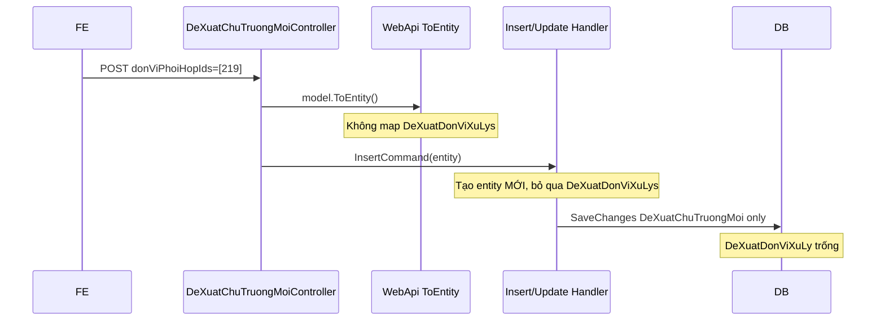

# Issue: `donViPhoiHopIds` không lưu vào `DeXuatDonViXuLy`

## Tóm tắt

Khi gọi **POST** `/api/de-xuat-chu-truong-moi/them-moi` hoặc **PUT** `/api/de-xuat-chu-truong-moi/cap-nhat` với payload có `donViPhoiHopIds` (ví dụ `[219]`), bản ghi chính **`DeXuatChuTruongMoi`** được insert/update thành công, nhưng bảng junction **`DeXuatDonViXuLy`** vẫn trống.

**Nguyên nhân gốc:** thiếu logic đồng bộ collection `DeXuatDonViXuLys` ở tầng mapping + command handler (insert/update). Mapping Application đã có sẵn nhưng **không được dùng**; handler tự tạo entity mới và bỏ qua navigation collection.

---

## Hiện trạng (reproduce)

### API bị ảnh hưởng

| Method | Endpoint | Ghi chú |
| ------ | -------- | ------- |
| POST | `/api/de-xuat-chu-truong-moi/them-moi` | Tạo mới |
| PUT | `/api/de-xuat-chu-truong-moi/cap-nhat` | Cập nhật |
| GET | `/api/de-xuat-chu-truong-moi/{id}/chi-tiet` | Đọc lại cũng không thấy đơn vị phối hợp (phụ) |

### Payload mẫu (Swagger)

```json
{
  "buocId": 0,
  "duAnId": "1690F8E4-3352-48D2-8D48-1D6196B2E74F6",
  "tomTatNoiDung": "string",
  "tongMucDauTu": 1000,
  "ngayBatDauDuKien": "2026-05-22T03:59:11.991Z",
  "hinhThucDauTuId": 3,
  "lanhDaoPhuTrachId": 4,
  "donViPhuTrachChinhId": 220,
  "nguoiXuLyChinhId": 4,
  "trangThaiId": 0,
  "donViPhoiHopIds": [219],
  "danhSachTepDinhKem": []
}
```

### Kết quả DB

| Bảng | Kỳ vọng | Thực tế |
| ---- | ------- | ------- |
| `DeXuatChuTruongMoi` | 1 row mới/cập nhật | OK |
| `DeXuatDonViXuLy` | 1 row `(DuAnId=<DeXuat.Id>, DonViId=219)` | **Không có dữ liệu** |

> Lưu ý: cột FK trong DB là `DuAnId` / `DonViId` (map từ `LeftId` / `RightId` của junction entity), không phải `DuAnId` của dự án.

---

## Mô hình dữ liệu

### Entity chính

`DeXuatChuTruongMoi` có navigation:

```csharp
public ICollection<DeXuatDonViXuLy>? DeXuatDonViXuLys { get; set; } = [];
```

### Junction — đơn vị phối hợp

`DeXuatDonViXuLy` (`IJunctionEntity<Guid, long>`):

| Property | Ý nghĩa | Cột DB |
| -------- | ------- | ------ |
| `LeftId` | Id đề xuất (`DeXuatChuTruongMoi.Id`) | `DuAnId` |
| `RightId` | Id đơn vị (`DanhMucDonVi.Id`) | `DonViId` |

EF config: `QLDA.Persistence/Configurations/DeXuatDonViXuLyConfiguration.cs` — composite PK, cascade delete khi xóa đề xuất.

### API field

| Layer | Field |
| ----- | ----- |
| WebApi model | `DeXuatChuTruongMoiModel.DonViPhoiHopIds` |
| Application DTO | `DeXuatChuTruongMoiInsertDto.DonViPhoiHopIds` |
| Response list (đã có) | `DeXuatChuTruongMoiDto.DanhSachDonViPhoiHop` — join từ `DeXuatDonViXuLys` trong query danh sách |

---

## Luồng hiện tại (vì sao lỗi)



### 1. WebApi mapping — thiếu map junction

**File:** `QLDA.WebApi/Models/DeXuatChuTruongMois/DeXuatChuTruongMoiMappingConfiguration.cs`

`ToEntity()` chỉ map scalar fields, **không** set `DeXuatDonViXuLys` từ `DonViPhoiHopIds`.

`ToModel()` khi GET chi tiết cũng **không** trả `DonViPhoiHopIds` / danh sách phối hợp.

### 2. Insert handler — bỏ qua entity từ controller

**File:** `QLDA.Application/DeXuatChuTruongMoi/Commands/DeXuatChuTruongMoiInsertCommand.cs`

Handler nhận `request.Dto` (entity đã map từ WebApi) nhưng **tạo lại** `DeXuatChuTruongMoi` thủ công, không copy `DeXuatDonViXuLys`:

```csharp
var entity = new DeXuatChuTruongMoi {
    DuAnId = request.Dto.DuAnId,
    // ... các field scalar ...
    // THIẾU: DeXuatDonViXuLys = ...
};
await _repo.AddAsync(entity, cancellationToken);
```

EF chỉ insert parent; children không được attach.

### 3. Update handler — không đồng bộ junction

**File:** `QLDA.Application/DeXuatChuTruongMoi/Commands/DeXuatChuTruongMoiUpdateCommand.cs`

- Chỉ cập nhật scalar trên `DeXuatChuTruongMoi`.
- Không `.Include(e => e.DeXuatDonViXuLys)`.
- Không clear/re-add theo `DonViPhoiHopIds`.

### 4. Controller Update — không truyền `donViPhoiHopIds`

**File:** `QLDA.WebApi/Controllers/DeXuatChuTruongMoiController.cs`

`cap-nhat` build `DeXuatChuTruongMoiInsertDto` **không có** `DonViPhoiHopIds`. Đồng thời có map sai (cần sửa khi làm task):

```csharp
DonViPhuTrachChinhId = model.BuocId,      // sai — phải model.DonViPhuTrachChinhId
LanhDaoPhuTrachId = model.BuocId,           // sai — phải model.LanhDaoPhuTrachId
```

### 5. Application mapping — có code nhưng không dùng

**File:** `QLDA.Application/DeXuatChuTruongMoi/DeXuatChuTruongMoiMappings.cs`

`ToEntity(DeXuatChuTruongMoiInsertDto)` **đã** map đúng:

```csharp
DeXuatDonViXuLys = [.. dto.DonViPhoiHopIds?.Select(dvPhoiHops => new DeXuatDonViXuLy {
    LeftId = id,
    RightId = dvPhoiHops
}) ?? []]
```

Luồng hiện tại **không gọi** extension này (controller dùng WebApi `ToEntity`, handler không dùng DTO mapping).

### 6. GET chi tiết — không load junction

**File:** `QLDA.Application/DeXuatChuTruongMoi/Queries/DeXuatChuTruongMoiGetQuery.cs`

Query không `.Include(e => e.DeXuatDonViXuLys)`. WebApi `ToModel` không map ra `DonViPhoiHopIds`.

> Query **danh sách tiến độ** (`DeXuatChuTruongMoiGetDanhSachQuery`) đã join `DeXuatDonViXuLys` → `DanhSachDonViPhoiHop` — chứng tỏ read path list OK nếu DB có dữ liệu.

---

## Pattern tham chiếu (đã làm đúng trong codebase)

Module **DuAnBuoc** + `DuAnBuocPhongBanPhoiHop` — cùng pattern junction many-to-many:

| Thao tác | File | Cách làm |
| -------- | ---- | -------- |
| Create | `DuAnBuocCreateCommand.cs` | Gán `DuAnBuocPhongBanPhoiHops` khi `AddAsync` |
| Update | `DuAnBuocUpdateCommand.cs` | `.Include`, `Clear()`, add lại từ `DanhSachPhongBanPhoiHopIds` |

Áp dụng tương tự cho `DeXuatDonViXuLys` + `DonViPhoiHopIds`.

**DuAn** (phối hợp ở cấp dự án): `DuAnMappings` + update command gán `DuAnChiuTrachNhiemXuLys` với `Loai = DonViPhoiHop` — khác bảng nhưng cùng ý tưởng sync collection.

---

## Phạm vi sửa đề xuất

### Bắt buộc (fix issue)

| # | File | Việc cần làm |
| - | ---- | ------------- |
| 1 | `DeXuatChuTruongMoiInsertCommand.cs` | Khi insert: gán `DeXuatDonViXuLys` từ `DonViPhoiHopIds` (dùng entity từ request hoặc `DeXuatChuTruongMoiMappings.ToEntity`) |
| 2 | `DeXuatChuTruongMoiUpdateCommand.cs` | `.Include(DeXuatDonViXuLys)`, sync clear + add theo `DonViPhoiHopIds` (giống `DuAnBuocUpdateCommand`) |
| 3 | `DeXuatChuTruongMoiController.cs` (cap-nhat) | Truyền đủ field DTO gồm `DonViPhoiHopIds`, `NguoiXuLyChinhId`, `LanhDaoPhuTrachId`, `DonViPhuTrachChinhId` (sửa map sai `BuocId`) |
| 4 | `DeXuatChuTruongMoiMappingConfiguration.cs` (WebApi) | `ToEntity` / `Update` / `ToModel`: map `DonViPhoiHopIds` ↔ `DeXuatDonViXuLys` |

**Khuyến nghị:** thống nhất mapping ở **Application** (`DeXuatChuTruongMoiMappings`) theo rule DTO ↔ Entity; WebApi chỉ map Model ↔ DTO hoặc gọi Application mapping — tránh duplicate logic.

### Nên làm (trải nghiệm API đầy đủ)

| # | File | Việc cần làm |
| - | ---- | ------------- |
| 5 | `DeXuatChuTruongMoiGetQuery.cs` + `ToModel` | Include/load junction; GET chi tiết trả `donViPhoiHopIds` hoặc `danhSachDonViPhoiHop` |
| 6 | (Tùy chọn) `DeXuatChuTruongMoiMappings.ToDto` | `TenDonVi` đang `string.Empty` — join `DanhMucDonVi` nếu cần tên đầy đủ |

### Không cần (trừ khi đổi schema)

- Migration mới — bảng `DeXuatDonViXuLy` và FK đã có trong `Init`.
- Sửa `AppDbContextModelSnapshot` / migration cũ.

---

## Checklist verify sau khi fix

1. **POST** `them-moi` với `donViPhoiHopIds: [219]`:
   - Có row `DeXuatChuTruongMoi`.
   - Có row `DeXuatDonViXuLy` với `DuAnId = <Id đề xuất>`, `DonViId = 219`.
2. **PUT** `cap-nhat` đổi `[219]` → `[220, 221]`:
   - Junction cũ bị thay thế (clear + insert mới), không duplicate PK.
3. **PUT** với `donViPhoiHopIds: []`:
   - Xóa hết junction (nếu product cho phép list rỗng).
4. **GET** `chi-tiet` / `danh-sach-tien-do` hiển thị đúng đơn vị phối hợp.
5. **DELETE** đề xuất → junction cascade (theo config).

---

## Files liên quan (inventory)

| Vai trò | Đường dẫn |
| ------- | --------- |
| Controller | `QLDA.WebApi/Controllers/DeXuatChuTruongMoiController.cs` |
| WebApi model | `QLDA.WebApi/Models/DeXuatChuTruongMois/DeXuatChuTruongMoiModel.cs` |
| WebApi mapping | `QLDA.WebApi/Models/DeXuatChuTruongMois/DeXuatChuTruongMoiMappingConfiguration.cs` |
| Insert command | `QLDA.Application/DeXuatChuTruongMoi/Commands/DeXuatChuTruongMoiInsertCommand.cs` |
| Update command | `QLDA.Application/DeXuatChuTruongMoi/Commands/DeXuatChuTruongMoiUpdateCommand.cs` |
| App mapping (chưa wired) | `QLDA.Application/DeXuatChuTruongMoi/DeXuatChuTruongMoiMappings.cs` |
| DTO | `QLDA.Application/DeXuatChuTruongMoi/DTOs/DeXuatChuTruongMoiInsertDto.cs` |
| Entity | `QLDA.Domain/Entities/DeXuatChuTruongMoi.cs`, `DeXuatDonViXuLy.cs` |
| EF config | `QLDA.Persistence/Configurations/DeXuatDonViXuLyConfiguration.cs` |
| List query (read OK) | `QLDA.Application/DeXuatChuTruongMoi/Queries/DeXuatChuTruongMoiGetDanhSachQuery.cs` |
| Reference pattern | `QLDA.Application/DuAnBuocs/Commands/DuAnBuocCreateCommand.cs`, `DuAnBuocUpdateCommand.cs` |

---

## Kết luận một dòng

**Đây là bug thiếu persist navigation collection `DeXuatDonViXuLys` khi save `DeXuatChuTruongMoi`**, không phải lỗi DB/migration. API đã nhận `donViPhoiHopIds` nhưng insert/update handler và WebApi mapping chưa đẩy dữ liệu xuống bảng junction; cần bổ sung logic sync giống `DuAnBuocPhongBanPhoiHop`.
