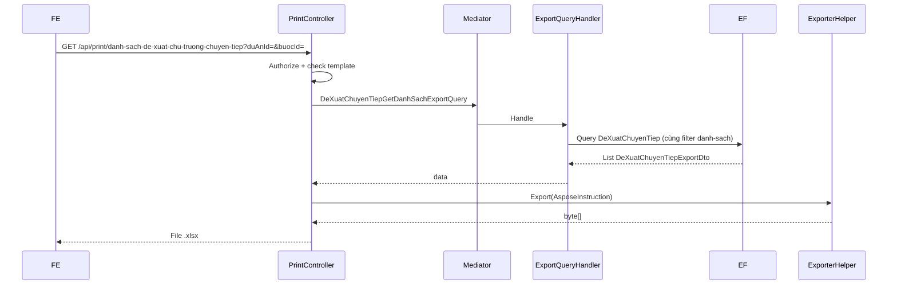

# Export Excel — Danh sách đề xuất chủ trương chuyển tiếp

**Ngày hoàn thành:** June 2026  
**Trạng thái:** ✅ FULLY IMPLEMENTED  
**Effort:** ~3–4 giờ  
**Pattern tham chiếu:** `PrintController.InKetQuaPhanKhaiVonDuocDuyet`  
**Hướng dẫn Aspose:** `[QLDA.WebApi/PrintTemplates/huong-dan.md](../../../QLDA.WebApi/PrintTemplates/huong-dan.md)`  
**Import liên quan:** `[task-import-danh-sach-de-xuat-chu-truong-chuyen-tiep.md](./task-import-danh-sach-de-xuat-chu-truong-chuyen-tiep.md)`

---

## 📋 Executive Summary

**Tính năng là gì?**  
Xuất file Excel danh sách đề xuất dự án/dự toán/KHHT chuyển tiếp cho nút **In excel** trên tab tiến độ **"Đề xuất chủ trương chuyển tiếp"**.

**Thách thức chính:**  
Export phải khớp 100% dữ liệu grid — cùng filter `duAnId` + `buocId`, không phân trang, không lọc trạng thái.

**Độ phức tạp:** Thấp  
**Phụ thuộc:** Module `DeXuatChuyenTiep` đã có sẵn (entity, danh sách API)

---

## 📋 Quick Facts


| Thuộc tính            | Giá trị                                                     |
| --------------------- | ----------------------------------------------------------- |
| **Entity**            | `DeXuatChuyenTiep`                                          |
| **Table**             | `DeXuatChuyenTiep`                                          |
| **Tab UI**            | Đề xuất chủ trương chuyển tiếp                              |
| **API danh sách gốc** | `GET /api/de-xuat-chu-truong-chuyen-tiep/danh-sach-tien-do` |
| **API export mới**    | `GET /api/print/danh-sach-de-xuat-chu-truong-chuyen-tiep`   |
| **Pattern export**    | LINQ + `IExporterHelper` + Aspose template (Hướng B)        |
| **Migration**         | Không cần                                                   |
| **Stored procedure**  | Không cần                                                   |


---

## 🎯 Phạm vi tính năng

### Đã bao gồm

- ✅ Endpoint export Excel với phân quyền role
- ✅ Query EF không phân trang, filter giống `danh-sach-tien-do`
- ✅ Template Aspose `DanhSachDeXuatChuTruongChuyenTiep.xlsx` (6 cột)
- ✅ Export DTO + PrintSearchModel
- ✅ Hỗ trợ `hiddenColumns` (ẩn cột optional)
- ✅ Tên file tải về có timestamp

### Không bao gồm

- ❌ Filter theo trạng thái phê duyệt (grid cũng không filter)
- ❌ Áp dụng `GlobalFilter` (grid cũng chưa dùng)
- ❌ Stored procedure / migration mới
- ❌ Thay đổi logic `DeXuatChuyenTiepGetDanhSachQuery`

---

## 🏗️ Kiến trúc & luồng xử lý

```
Tab "Đề xuất chủ trương chuyển tiếp"
├── GET danh-sach-tien-do          → Grid (có phân trang)
└── GET print/danh-sach-...        → Export Excel (không phân trang)

DeXuatChuyenTiep (Entity)
├── DuAnId: Guid (FK)
├── BuocId: int
├── SoLieuGiaiNgan: long?
├── UocGiaiNgan: long?
├── NhuCauKinhPhi: long?
├── KhoiLuongThucTe: string?
├── KhoiLuongDuKien: string?
└── TrangThaiId → không filter khi export
```




### Pattern export trong project


| Hướng                                     | Khi dùng      | Ví dụ                                     |
| ----------------------------------------- | ------------- | ----------------------------------------- |
| **A. Stored procedure + `GetStoreQuery`** | JOIN phức tạp | `InBaoCaoTienDo`, `InKhoKhanVuongMac`     |
| **B. LINQ + `IExporterHelper.Export`**    | EF đơn giản   | `InKetQuaPhanKhaiVonDuocDuyet` ← **chọn** |


---

## 📂 Vị trí file trong QLDA

```
QLDA.Domain/
└── Constants/
    └── RoleConstants.cs                          [+GroupDeXuatChuTruongChuyenTiepExport]

QLDA.Application/
└── DeXuatChuyenTiep/
    ├── DTOs/
    │   └── DeXuatChuyenTiepExportDto.cs           [DTO export — property = placeholder]
    └── Queries/
        ├── DeXuatChuyenTiepGetDanhSachQuery.cs    [Grid gốc — KHÔNG sửa]
        └── DeXuatChuyenTiepGetDanhSachExportQuery.cs  [Query export mới]

QLDA.WebApi/
├── Controllers/
│   └── PrintController.cs                        [+region DanhSachDeXuatChuTruongChuyenTiep]
├── Models/DeXuatChuTruongChuyenTieps/
│   └── DeXuatChuyenTiepPrintSearchModel.cs
└── PrintTemplates/
    └── DanhSachDeXuatChuTruongChuyenTiep.xlsx      [Template Aspose]
```

---

## 🚀 Step-by-Step Implementation

### Phase 0: Phân tích source (30 phút)

#### 0.1 Xác định API danh sách gốc


| Thành phần | Giá trị                                                     |
| ---------- | ----------------------------------------------------------- |
| Controller | `DeXuatChuTruongChuyenTiepController.cs`                    |
| Route      | `GET /api/de-xuat-chu-truong-chuyen-tiep/danh-sach-tien-do` |
| Handler    | `DeXuatChuyenTiepGetDanhSachQuery`                          |


**Filter thực tế trong handler:**

- `!e.IsDeleted`
- `!e.DuAn!.IsDeleted`
- `duAnId` (nếu có)
- `buocId` (nếu `> 0`)
- **Không** filter `TrangThaiId`
- **Không** áp dụng `GlobalFilter`

#### 0.2 Xác định cột export (khớp grid UI)


| #   | Header Excel                  | Property          | Kiểu      |
| --- | ----------------------------- | ----------------- | --------- |
| 1   | STT                           | `Stt` (tự sinh)   | `int`     |
| 2   | Số liệu giải ngân             | `SoLieuGiaiNgan`  | `long?`   |
| 3   | Ước giải ngân                 | `UocGiaiNgan`     | `long?`   |
| 4   | Nhu cầu kinh phí              | `NhuCauKinhPhi`   | `long?`   |
| 5   | Khối lượng đã hoàn thành      | `KhoiLuongThucTe` | `string?` |
| 6   | Khối lượng dự kiến hoàn thành | `KhoiLuongDuKien` | `string?` |


> Giá trị tiền export **nguyên giá trị DB** — không chia triệu đồng.

**Verify checklist:**

- [x] Đã đọc `DeXuatChuyenTiepGetDanhSachQuery.cs`
- [x] Đã đọc `PrintController.InKetQuaPhanKhaiVonDuocDuyet` làm pattern
- [x] Xác nhận không cần migration

---

### Phase 1: Domain Layer (~15 phút)

#### 1.1 Thêm role constant

**File:** `QLDA.Domain/Constants/RoleConstants.cs`

```csharp
/// <summary>
/// Kết xuất Excel danh sách đề xuất chủ trương chuyển tiếp (CB/LĐ.PCT, GĐ/PGĐ, CB/LĐ.PKH-TC)
/// </summary>
public const string GroupDeXuatChuTruongChuyenTiepExport =
    $"{QLDA_TatCa},{QLDA_QuanTri},{QLDA_LDDV},{QLDA_ChuyenVien}";
```


| Vai trò BA | Map hệ thống      |
| ---------- | ----------------- |
| CB.PCT     | `QLDA_ChuyenVien` |
| LĐ.PCT     | `QLDA_LDDV`       |
| GĐ/PGĐ     | `QLDA_LDDV`       |
| CB.PKH-TC  | `QLDA_ChuyenVien` |
| LĐ.PKH-TC  | `QLDA_LDDV`       |


**Verify checklist:**

- [x] Constant compile
- [x] Cùng tập role với `GroupPhanKhaiKinhPhiExport`

---

### Phase 2: Application Layer (~1 giờ)

#### 2.1 Tạo Export DTO

**File:** `QLDA.Application/DeXuatChuyenTiep/DTOs/DeXuatChuyenTiepExportDto.cs`

```csharp
namespace QLDA.Application.DeXuatChuyenTieps.DTOs;

/// <summary>
/// Dòng dữ liệu export Excel — tên property khớp placeholder template ($Field)
/// </summary>
public class DeXuatChuyenTiepExportDto {
    public int Stt { get; set; }
    public long? SoLieuGiaiNgan { get; set; }
    public long? UocGiaiNgan { get; set; }
    public long? NhuCauKinhPhi { get; set; }
    public string? KhoiLuongThucTe { get; set; }
    public string? KhoiLuongDuKien { get; set; }
}
```

**Critical points:**

- ✅ Tên property = placeholder Aspose (`$SoLieuGiaiNgan` → `SoLieuGiaiNgan`)
- ✅ `Stt` tự sinh trong query handler, không lấy từ DB

#### 2.2 Tạo Export Query

**File:** `QLDA.Application/DeXuatChuyenTiep/Queries/DeXuatChuyenTiepGetDanhSachExportQuery.cs`

```csharp
public record DeXuatChuyenTiepGetDanhSachExportQuery : IRequest<List<DeXuatChuyenTiepExportDto>> {
    public int? BuocId { get; set; }
    public Guid? DuAnId { get; set; }
}

internal class DeXuatChuyenTiepGetDanhSachExportQueryHandler(IServiceProvider serviceProvider)
    : IRequestHandler<DeXuatChuyenTiepGetDanhSachExportQuery, List<DeXuatChuyenTiepExportDto>> {

    public async Task<List<DeXuatChuyenTiepExportDto>> Handle(...) {
        var rows = await _repo.GetQueryableSet().AsNoTracking()
            .Where(e => !e.IsDeleted)
            .Where(e => !e.DuAn!.IsDeleted)
            .WhereIf(request.DuAnId != null, e => e.DuAnId == request.DuAnId)
            .WhereIf(request.BuocId > 0, e => e.BuocId == request.BuocId)
            .OrderBy(e => e.Index)
            .ThenBy(e => e.CreatedAt)
            .Select(e => new { e.SoLieuGiaiNgan, ... })
            .ToListAsync(cancellationToken);

        return rows.Select((row, index) => new DeXuatChuyenTiepExportDto {
            Stt = index + 1,
            ...
        }).ToList();
    }
}
```

**Critical points:**

- ✅ Filter **giống hệt** `DeXuatChuyenTiepGetDanhSachQuery` (không phân trang)
- ✅ `Stt = index + 1` sau khi sort
- ✅ Không sửa query grid gốc

**Verify checklist:**

- [x] Handler compile
- [x] Filter khớp danh-sach-tien-do
- [x] `dotnet build QLDA.Application` pass

---

### Phase 3: WebApi Layer (~1.5 giờ)

#### 3.1 Tạo PrintSearchModel

**File:** `QLDA.WebApi/Models/DeXuatChuTruongChuyenTieps/DeXuatChuyenTiepPrintSearchModel.cs`

```csharp
public record DeXuatChuyenTiepPrintSearchModel {
    public Guid? DuAnId { get; set; }
    public int? BuocId { get; set; }
    public List<string>? HiddenColumns { get; set; }
}
```

#### 3.2 Thêm endpoint PrintController

**File:** `QLDA.WebApi/Controllers/PrintController.cs` — region `DanhSachDeXuatChuTruongChuyenTiep`

```csharp
[HttpGet("api/print/danh-sach-de-xuat-chu-truong-chuyen-tiep")]
[Authorize(Roles = RoleConstants.GroupDeXuatChuTruongChuyenTiepExport)]
public async Task<IActionResult> InDanhSachDeXuatChuTruongChuyenTiep(
    [FromQuery] DeXuatChuyenTiepPrintSearchModel searchModel) {

    var fileNameTemplate = "DanhSachDeXuatChuTruongChuyenTiep.xlsx";
    var templatePath = Path.Combine(AppContext.BaseDirectory, "PrintTemplates", fileNameTemplate);

    ManagedException.ThrowIf(!File.Exists(templatePath), "Không tìm thấy file template");
    ManagedException.ThrowIf(_userProvider.Id == 0, "Vui lòng đăng nhập");

    var data = await Mediator.Send(new DeXuatChuyenTiepGetDanhSachExportQuery {
        DuAnId = searchModel.DuAnId,
        BuocId = searchModel.BuocId,
    });

    var exportResult = _excelExporter.Export(new AsposeInstruction<DeXuatChuyenTiepExportDto> {
        TemplatePath = templatePath,
        Items = data,
        HiddenColumns = searchModel.HiddenColumns ?? [],
        AutoFitColumnsAndRows = false,
    });

    return new FileContentResult(exportResult.FileBytes, exportResult.ContentType) {
        FileDownloadName = GetDownloadFileName(fileNameTemplate)
    };
}
```

**API spec:**

```http
GET /api/print/danh-sach-de-xuat-chu-truong-chuyen-tiep?duAnId={guid}&buocId={int}
Authorization: Bearer {token}
```


| Query param     | Kiểu       | Mô tả                     |
| --------------- | ---------- | ------------------------- |
| `duAnId`        | `Guid?`    | Giống `danh-sach-tien-do` |
| `buocId`        | `int?`     | Giống `danh-sach-tien-do` |
| `hiddenColumns` | `string[]` | Ẩn cột (optional)         |


**Response:** `application/vnd.openxmlformats-officedocument.spreadsheetml.sheet`  
**Tên file:** `DanhSachDeXuatChuTruongChuyenTiep_ddMMyyyy_HHmmss.xlsx`

#### 3.3 Tạo template Excel

**File:** `QLDA.WebApi/PrintTemplates/DanhSachDeXuatChuTruongChuyenTiep.xlsx`


| #   | Header                        | Placeholder        |
| --- | ----------------------------- | ------------------ |
| 1   | STT                           | `$Stt`             |
| 2   | Số liệu giải ngân             | `$SoLieuGiaiNgan`  |
| 3   | Ước giải ngân                 | `$UocGiaiNgan`     |
| 4   | Nhu cầu kinh phí              | `$NhuCauKinhPhi`   |
| 5   | Khối lượng đã hoàn thành      | `$KhoiLuongThucTe` |
| 6   | Khối lượng dự kiến hoàn thành | `$KhoiLuongDuKien` |


**Verify checklist:**

- [x] Template copy to output (`PrintTemplates/`)
- [x] Placeholder khớp DTO property
- [x] Endpoint compile

---

### Phase 4: Tích hợp FE (~30 phút)

```typescript
// Cùng filter với grid tab "Đề xuất chủ trương chuyển tiếp"
const params = new URLSearchParams({
  ...(duAnId && { duAnId }),
  ...(buocId && { buocId: String(buocId) }),
});
// Nút "In excel" — chỉ hiện với CB.PCT, LĐ.PCT, GĐ/PGĐ, CB.PKH-TC, LĐ.PKH-TC
window.open(`/api/print/danh-sach-de-xuat-chu-truong-chuyen-tiep?${params}`, '_blank');
```

File export có thể sửa rồi import lại qua `POST /api/import/de-xuat-chu-truong-chuyen-tiep` (cùng 6 cột).

---

### Phase 5: Kiểm thử (~30 phút)


| Case                                | Kỳ vọng                                                      |
| ----------------------------------- | ------------------------------------------------------------ |
| Có dữ liệu theo `duAnId` + `buocId` | File đủ dòng, đúng 6 cột                                     |
| Không có dữ liệu                    | File chỉ có header (0 dòng data)                             |
| User không có role                  | 403 Forbidden                                                |
| Chưa đăng nhập                      | 400 "Vui lòng đăng nhập"                                     |
| Thiếu template                      | 400 "Không tìm thấy file template"                           |
| So sánh với grid                    | Số dòng export = tổng dòng grid (cùng filter, bỏ phân trang) |


---

## ✅ Validation Checklist

**Trước khi deploy:**

### Code Quality

- [x] Export DTO compile
- [x] Export query compile
- [x] PrintController endpoint compile
- [x] `dotnet build QLDA.Application` pass

### Chức năng

- [x] Filter export khớp `danh-sach-tien-do`
- [x] STT tự sinh 1, 2, 3…
- [x] Phân quyền role đúng BA spec
- [x] Template Aspose fill đúng placeholder

### Không thay đổi

- [x] Không sửa migration
- [x] Không sửa `DeXuatChuyenTiepGetDanhSachQuery`
- [x] Không filter trạng thái

---

## 📊 Effort Breakdown


| Phase    | Task                                     | Giờ    | Status |
| -------- | ---------------------------------------- | ------ | ------ |
| 0        | Phân tích source + pattern               | 0.5    | ✅      |
| 1        | RoleConstants                            | 0.25   | ✅      |
| 2        | Export DTO + Query                       | 1      | ✅      |
| 3        | PrintSearchModel + Controller + Template | 1.5    | ✅      |
| 4        | FE integration guide                     | 0.5    | ✅      |
| 5        | Kiểm thử thủ công                        | 0.5    | ✅      |
| **Tổng** |                                          | **~4** | ✅      |


---

## 📞 Common Issues & Solutions


| Vấn đề                             | Nguyên nhân               | Giải pháp                                       |
| ---------------------------------- | ------------------------- | ----------------------------------------------- |
| Số dòng export ≠ grid              | Filter khác nhau          | Copy chính xác `Where` từ `GetDanhSachQuery`    |
| Cột trống trong Excel              | Placeholder sai tên       | Property DTO phải khớp `$Field` trong template  |
| 400 "Không tìm thấy file template" | Template chưa copy output | Kiểm tra `PrintTemplates/` trong build output   |
| 403 Forbidden                      | User thiếu role           | Kiểm tra `GroupDeXuatChuTruongChuyenTiepExport` |


---

## 🔗 Files tham chiếu


| File                                                                           | Vai trò                      |
| ------------------------------------------------------------------------------ | ---------------------------- |
| `DeXuatChuTruongChuyenTiepController.cs`                                       | API danh sách gốc            |
| `DeXuatChuyenTiepGetDanhSachQuery.cs`                                          | Logic filter tham chiếu      |
| `PrintController.InKetQuaPhanKhaiVonDuocDuyet`                                 | Pattern export LINQ + Aspose |
| `PhanKhaiKinhPhiGetDanhSachDaDuyetExportQuery.cs`                              | Pattern export query         |
| `docs/feature/PhanKhaiKinhPhi/task-export-ket-qua-phan-khai-von-duoc-duyet.md` | Doc export tương tự          |


---

## 📝 TÓM TẮT CÔNG VIỆC ĐÃ HOÀN THÀNH

### API đã bổ sung


| Method | Route                                                 | Mô tả                                                 |
| ------ | ----------------------------------------------------- | ----------------------------------------------------- |
| `GET`  | `/api/print/danh-sach-de-xuat-chu-truong-chuyen-tiep` | Export Excel danh sách đề xuất chủ trương chuyển tiếp |


### Files đã tạo


| Layer       | File                                                                    |
| ----------- | ----------------------------------------------------------------------- |
| Application | `DeXuatChuyenTiep/DTOs/DeXuatChuyenTiepExportDto.cs`                    |
| Application | `DeXuatChuyenTiep/Queries/DeXuatChuyenTiepGetDanhSachExportQuery.cs`    |
| WebApi      | `Models/DeXuatChuTruongChuyenTieps/DeXuatChuyenTiepPrintSearchModel.cs` |
| WebApi      | `PrintTemplates/DanhSachDeXuatChuTruongChuyenTiep.xlsx`                 |


### Files đã sửa


| File                                         | Thay đổi                                     |
| -------------------------------------------- | -------------------------------------------- |
| `QLDA.Domain/Constants/RoleConstants.cs`     | ➕ `GroupDeXuatChuTruongChuyenTiepExport`     |
| `QLDA.WebApi/Controllers/PrintController.cs` | ➕ region `DanhSachDeXuatChuTruongChuyenTiep` |


### Kết quả

- Nút **In excel** trên tab tiến độ xuất file `.xlsx` 6 cột, dữ liệu khớp grid.
- Phân quyền: CB/LĐ.PCT, GĐ/PGĐ, CB/LĐ.PKH-TC.
- Không migration, không stored procedure, không đổi logic danh sách hiện tại.
- File export tương thích với import (`task-import-...md`).

