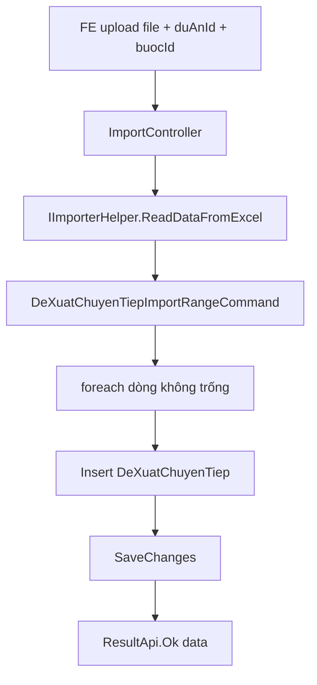

# Import Excel — Danh sách đề xuất chủ trương chuyển tiếp

**Ngày hoàn thành:** June 2026  
**Trạng thái:** ✅ FULLY IMPLEMENTED  
**Effort:** ~5–6 giờ  
**Pattern tham chiếu:** `ImportController` + `IImporterHelper` + `*ImportRangeCommand`  
**Module tham chiếu:** [`BaoCaoTienDos`](../../../QLDA.Application/BaoCaoTienDos), [`GoiThaus`](../../../QLDA.Application/GoiThaus)  
**Export liên quan:** [`task-export-danh-sach-de-xuat-chu-truong-chuyen-tiep.md`](./task-export-danh-sach-de-xuat-chu-truong-chuyen-tiep.md)

---

## 📋 Executive Summary

**Tính năng là gì?**  
Import file Excel danh sách đề xuất dự án/dự toán/KHHT chuyển tiếp cho tab tiến độ **"Đề xuất chủ trương chuyển tiếp"** — đọc Excel, insert bản ghi mới vào `DeXuatChuyenTiep`.

**Pattern:** Giống `import/goi-thau` và `import/bao-cao-tien-do` — `ReadDataFromExcel` → `ImportRangeCommand` → `ResultApi.Ok(data)`.

**Khác biệt duy nhất so với GoiThau/BaoCaoTienDo:**  
Context `duAnId` + `buocId` gửi thêm qua form (tab tiến độ luôn biết dự án/bước hiện tại; Excel không có 2 field này).

**Độ phức tạp:** Thấp–Trung bình  
**Phụ thuộc:** Module `DeXuatChuyenTiep` đã có sẵn (entity, CRUD, danh sách API)

---

## 📋 Quick Facts

| Thuộc tính | Giá trị |
|------------|---------|
| **Entity** | `DeXuatChuyenTiep` |
| **Table** | `DeXuatChuyenTiep` |
| **Tab UI** | Đề xuất chủ trương chuyển tiếp |
| **API import** | `POST /api/import/de-xuat-chu-truong-chuyen-tiep` |
| **API template** | `GET /api/template/import-de-xuat-chu-truong-chuyen-tiep` |
| **Pattern import** | `IImporterHelper.ReadDataFromExcel` + `ImportRangeCommand` |
| **Response** | `ResultApi.Ok(data)` — trả lại list đã đọc từ Excel |
| **Migration** | Không cần |

---

## 🎯 Phạm vi tính năng

### Đã bao gồm

- ✅ API import Excel (`multipart/form-data`: `file`, `duAnId`, `buocId`)
- ✅ API tải template import
- ✅ Đọc Excel qua `IImporterHelper` (Aspose.Cells, Excel Table bắt buộc)
- ✅ `ImportRangeCommand` pattern giống GoiThau/BaoCaoTienDo (`IRequest`, không return DTO riêng)
- ✅ Template qua `_excelImporter.GetTemplate` + combo DuAn/DuAnBuoc (giống `import-bao-cao-tien-do`)
- ✅ Template 6 cột (khớp export/grid), có cột STT
- ✅ `duAnId` + `buocId` qua form (bổ sung so với GoiThau — context tab tiến độ)

### Không bao gồm

- ❌ Import tệp đính kèm qua Excel
- ❌ Import `duAnId`/`buocId` từ Excel (luôn qua form)
- ❌ Lưu `Stt` vào DB (chỉ đọc để khớp file export)
- ❌ Migration / thay đổi schema
- ❌ Thay đổi logic `DeXuatChuyenTiepGetDanhSachQuery`

---

## 🏗️ Kiến trúc & luồng xử lý

```
Tab "Đề xuất chủ trương chuyển tiếp"
├── GET template/import-de-xuat-...     → Tải template mẫu
├── POST import/de-xuat-...           → Upload + import
└── GET danh-sach-tien-do             → Reload grid sau import

DeXuatChuyenTiep (Entity) — field import
├── DuAnId          ← Form (bắt buộc)
├── BuocId          ← Form (bắt buộc)
├── SoLieuGiaiNgan  ← Excel
├── UocGiaiNgan     ← Excel
├── NhuCauKinhPhi   ← Excel
├── KhoiLuongThucTe ← Excel
├── KhoiLuongDuKien ← Excel
├── TrangThaiId     ← Auto Dự thảo (DT)
├── NamDeXuat       ← DateTime.Now.Year
└── Id              ← Guid.NewGuid()
```



### So sánh với BaoCaoTienDo / GoiThau

| Tiêu chí | BaoCaoTienDo / GoiThau | DeXuatChuyenTiep |
|----------|------------------------|------------------|
| Controller pattern | `ReadForm` → `ReadDataFromExcel` → `Send` → `Ok(data)` | **Giống** |
| Command | `IRequest` (void) | **Giống** |
| `[Authorize]` | Không | **Không** |
| Response | `ResultApi.Ok(data)` | **Giống** |
| Context dự án | Trong Excel (tên dự án / KH LCNT) | **Form** `duAnId` + `buocId` |
| Template endpoint | `GetTemplate` + combo | **Giống** |

---

## 📂 Vị trí file trong QLDA

```
QLDA.Application/
└── DeXuatChuyenTiep/
    ├── DTOs/
    │   └── DeXuatChuyenTiepImportDto.cs          [Map cột Excel]
    └── Commands/
        └── DeXuatChuyenTiepImportRangeCommand.cs   [foreach insert + SaveChanges]

QLDA.WebApi/
├── Controllers/
│   ├── ImportController.cs                       [+ImportDeXuatChuTruongChuyenTiep]
│   └── TemplateController.cs                     [+GetImportDeXuatChuTruongChuyenTiep]
└── PrintTemplates/
    └── Import_DeXuatChuTruongChuyenTiep.xlsx       [Template import — Excel Table]
```

---

## 🚀 Step-by-Step Implementation

### Phase 0: Phân tích source (45 phút)

#### 0.1 Xác định pattern import có sẵn

| Thành phần | Vị trí |
|------------|--------|
| `ImportController` | `QLDA.WebApi/Controllers/ImportController.cs` |
| `IImporterHelper` | `BuildingBlocks.Infrastructure/Offices/ExcelImporter.cs` |
| `*ImportRangeCommand` | `BaoCaoTienDo`, `GoiThau` |
| `TemplateController` | Download template import |

#### 0.2 Cơ chế đọc Excel (`IImporterHelper`)

| Quy ước | Chi tiết |
|---------|----------|
| Sheet | Index `0` |
| Bảng | **Excel Table** (`ListObject`) bắt buộc |
| Header | Dòng 1 trong table |
| Mô tả | Dòng 2 (bỏ qua khi đọc) |
| Dữ liệu | Từ `startRow + 2` |
| Map cột | Thứ tự property trong class = thứ tự cột |

#### 0.3 Cột Excel import (khớp export / grid)

| # | Header Excel | `[Description]` | Property DTO | Lưu DB? | Kiểu |
|---|--------------|-------------------|--------------|---------|------|
| 1 | STT | `STT` | `Stt` | **Không** | `int?` |
| 2 | Số liệu giải ngân | `Số liệu giải ngân` | `SoLieuGiaiNgan` | Có | `long?` |
| 3 | Ước giải ngân | `Ước giải ngân` | `UocGiaiNgan` | Có | `long?` |
| 4 | Nhu cầu kinh phí | `Nhu cầu kinh phí` | `NhuCauKinhPhi` | Có | `long?` |
| 5 | Khối lượng đã hoàn thành | `Khối lượng đã hoàn thành` | `KhoiLuongThucTe` | Có | `string?` max 4000 |
| 6 | Khối lượng dự kiến hoàn thành | `Khối lượng dự kiến hoàn thành` | `KhoiLuongDuKien` | Có | `string?` max 4000 |

#### 0.4 Field không có trong Excel

| Field | Nguồn khi import |
|-------|------------------|
| `Id` | `Guid.NewGuid()` khi insert |
| `DuAnId` | **Form** `duAnId` — bắt buộc, DB `NOT NULL` |
| `BuocId` | **Form** `buocId` — bắt buộc theo nghiệp vụ tab |
| `TrangThaiId` | Auto **Dự thảo** (`Ma = DT`) |
| `NamDeXuat` | `DateTime.Now.Year` |
| `DanhSachTepDinhKem` | Không import qua Excel |

**Verify checklist:**
- [x] Đã đọc `GoiThauImportRangeCommand` / `BaoCaoTienDoImportRangeCommand`
- [x] Xác nhận không cần migration
- [x] Xác nhận `duAnId`/`buocId` bắt buộc qua form

---

### Phase 1: Application Layer — DTOs (~30 phút)

#### 2.1 Tạo Import DTO

**File:** `QLDA.Application/DeXuatChuyenTiep/DTOs/DeXuatChuyenTiepImportDto.cs`

```csharp
public class DeXuatChuyenTiepImportDto {
    [Description("STT")]
    public int? Stt { get; set; }

    [Description("Số liệu giải ngân")]
    public long? SoLieuGiaiNgan { get; set; }

    [Description("Ước giải ngân")]
    public long? UocGiaiNgan { get; set; }

    [Description("Nhu cầu kinh phí")]
    public long? NhuCauKinhPhi { get; set; }

    [Description("Khối lượng đã hoàn thành")]
    public string? KhoiLuongThucTe { get; set; }

    [Description("Khối lượng dự kiến hoàn thành")]
    public string? KhoiLuongDuKien { get; set; }
}
```

**Critical points:**
- ✅ `[Description]` khớp header Excel
- ✅ Thứ tự property = thứ tự cột trong Excel Table
- ✅ `Stt` đọc nhưng **không lưu DB**

**Verify checklist:**
- [x] DTO compile
- [x] 6 property khớp 6 cột template

---

### Phase 2: Application Layer — Command (~1 giờ)

#### 2.1 Tạo `DeXuatChuyenTiepImportRangeCommand` (giống `GoiThauImportRangeCommand`)

**File:** `QLDA.Application/DeXuatChuyenTiep/Commands/DeXuatChuyenTiepImportRangeCommand.cs`

```csharp
public record DeXuatChuyenTiepImportRangeCommand(List<DeXuatChuyenTiepImportDto> Imports) : IRequest {
    public Guid DuAnId { get; init; }
    public int BuocId { get; init; }
}
```

**Luồng handler:**

1. Nếu `DuAnId` rỗng hoặc `BuocId <= 0` → return (không insert)
2. Lấy trạng thái Dự thảo
3. `foreach` dòng không trống → `AddAsync`
4. `SaveChangesAsync`

**Critical points:**
- ✅ `IRequest` void — **không** return `ImportResultDto`
- ✅ Không transaction, không soft-delete draft (giống GoiThau/BaoCaoTienDo)
- ✅ Dòng trống bỏ qua qua `IsEmptyRow`

**Verify checklist:**
- [x] Handler compile
- [x] `dotnet build QLDA.Application` pass

---

### Phase 3: WebApi Layer (~1 giờ)

#### 3.1 Thêm endpoint ImportController (giống `ImportGoiThau`)

**File:** `QLDA.WebApi/Controllers/ImportController.cs`

```csharp
[HttpPost("de-xuat-chu-truong-chuyen-tiep")]
[Consumes("multipart/form-data")]
public async Task<ResultApi> ImportDeXuatChuTruongChuyenTiep()
{
    var formFile = await Request.ReadFormAsync();
    var file = formFile.Files.FirstOrDefault();

    if (file == null || file.Length == 0)
        return ResultApi.Fail("File không hợp lệ");

    _ = Guid.TryParse(formFile["duAnId"].FirstOrDefault(), out var duAnId);
    _ = int.TryParse(formFile["buocId"].FirstOrDefault(), out var buocId);

    var data = _excelImporter.ReadDataFromExcel<DeXuatChuyenTiepImportDto>(file.OpenReadStream());

    var importQuery = new DeXuatChuyenTiepImportRangeCommand(data) {
        DuAnId = duAnId,
        BuocId = buocId,
    };

    await Mediator.Send(importQuery);

    return ResultApi.Ok(data);
}
```

**Vì sao `duAnId` + `buocId` qua form?**

- Excel không chứa 2 field này (khác BaoCaoTienDo có `TenDuAn` trong file)
- Tab tiến độ luôn biết context dự án + bước
- Controller vẫn giống GoiThau — chỉ thêm đọc 2 field từ form

#### 3.2 Thêm endpoint TemplateController (giống `GetBaoCaoTienDo`)

**File:** `QLDA.WebApi/Controllers/TemplateController.cs`

```csharp
[HttpGet("import-de-xuat-chu-truong-chuyen-tiep")]
public async Task<FileContentResult> GetImportDeXuatChuTruongChuyenTiep() {
    // _excelImporter.GetTemplate(templatePath, comboData)
    // comboData: danhSachTenDuAn, danhSachTenBuoc
}
```

#### 4.3 Tạo template Excel

**File:** `QLDA.WebApi/PrintTemplates/Import_DeXuatChuTruongChuyenTiep.xlsx`

| Thành phần | Yêu cầu |
|------------|---------|
| Excel Table | `DeXuatChuyenTiepImport`, ref `A6:F8` (mở rộng khi thêm dòng) |
| Header row 6 | STT + 5 cột nghiệp vụ |
| Description row 7 | Hướng dẫn nhập |
| Data từ row 8 | Dòng dữ liệu người dùng |

> Khi thêm dòng: **kéo mở rộng bảng** trong Excel (giống `Import_GoiThau`).

**Verify checklist:**
- [x] Template có Excel Table
- [x] Endpoint compile
- [x] Template copy to output (`PrintTemplates/`)

---

### Phase 5: Tích hợp FE & kiểm thử (~1 giờ)

#### 5.1 API contract

**Import — Request:**

```http
POST /api/import/de-xuat-chu-truong-chuyen-tiep
Content-Type: multipart/form-data

file: (binary .xlsx)
duAnId: {guid}
buocId: {int}
```

**Import — Response thành công (giống GoiThau):**

```json
{
  "result": true,
  "dataResult": [
    { "stt": 1, "soLieuGiaiNgan": 100, "uocGiaiNgan": 200, ... }
  ]
}
```

**Import — File không hợp lệ:**

```json
{ "result": false, "errorMessage": "File không hợp lệ" }
```

**Template — Request:**

```http
GET /api/template/import-de-xuat-chu-truong-chuyen-tiep
```

#### 5.2 Gợi ý tích hợp FE

```typescript
// Tải template
window.open('/api/template/import-de-xuat-chu-truong-chuyen-tiep', '_blank');

// Import
const formData = new FormData();
formData.append('file', selectedFile);
formData.append('duAnId', duAnId);
formData.append('buocId', String(buocId));

const res = await fetch('/api/import/de-xuat-chu-truong-chuyen-tiep', {
  method: 'POST',
  headers: { Authorization: `Bearer ${token}` },
  body: formData,
});
const json = await res.json();

// Sau import OK → reload grid
// GET /api/de-xuat-chu-truong-chuyen-tiep/danh-sach-tien-do?duAnId=&buocId=
```

#### 5.3 Luồng Export → Sửa → Import

1. Export: `GET /api/print/danh-sach-de-xuat-chu-truong-chuyen-tiep`
2. Sửa file Excel (giữ cấu trúc 6 cột)
3. Import: `POST /api/import/de-xuat-chu-truong-chuyen-tiep` + cùng `duAnId`, `buocId`

#### 5.4 Case kiểm thử

| Case | Kỳ vọng |
|------|---------|
| File hợp lệ, 3 dòng | `result = true`, DB có 3 bản ghi mới |
| Thiếu `duAnId` / `buocId` | `result = true` nhưng không insert (handler return sớm) |
| Import lại cùng file | Thêm bản ghi mới (giống GoiThau — không replace draft) |
| File không có Excel Table | Exception khi đọc file |
| Thiếu file | `File không hợp lệ` |

---

## ✅ Validation Checklist

**Trước khi deploy:**

### Code Quality
- [x] Import DTOs compile
- [x] ImportRangeCommand compile
- [x] ImportController + TemplateController compile
- [x] `dotnet build QLDA.Application` pass

### Chức năng
- [x] Pattern controller/command giống GoiThau/BaoCaoTienDo
- [x] `ResultApi.Ok(data)` response
- [x] `duAnId`/`buocId` qua form
- [x] `Stt` không lưu DB
- [x] Template qua `GetTemplate` + combo

### Không thay đổi
- [x] Không sửa migration
- [x] Không sửa `DeXuatChuyenTiepGetDanhSachQuery`
- [x] Không ảnh hưởng import BaoCaoTienDo/GoiThau

---

## 📊 Effort Breakdown

| Phase | Task | Giờ | Status |
|-------|------|-----|--------|
| 0 | Phân tích pattern GoiThau/BaoCaoTienDo | 0.5 | ✅ |
| 1 | Import DTO | 0.5 | ✅ |
| 2 | ImportRangeCommand | 1 | ✅ |
| 3 | ImportController + TemplateController + Template | 1.5 | ✅ |
| 4 | FE contract + kiểm thử thủ công | 1 | ✅ |
| **Tổng** | | **~4.5** | ✅ |

---

## 📞 Common Issues & Solutions

| Vấn đề | Nguyên nhân | Giải pháp |
|--------|-------------|-----------|
| Import thất bại, không đọc được file | Thiếu Excel Table | Tạo ListObject trong template, kéo mở rộng bảng |
| Template lỗi "Lỗi hệ thống" | `GetContentType` gọi sai path | Dùng `_excelImporter.GetTemplate(templatePath, comboData)` |
| Import OK nhưng không có dữ liệu | Thiếu `duAnId`/`buocId` trong form | FE phải gửi cùng context tab |
| Import OK nhưng grid không đổi | Chưa reload hoặc `buocId` khác | Reload `danh-sach-tien-do` cùng `duAnId`+`buocId` |
| Import lại tạo duplicate | Không có replace draft (giống GoiThau) | Xóa draft thủ công trước khi import nếu cần |

---

## 🔗 Files tham chiếu

| File | Vai trò |
|------|---------|
| `DeXuatChuTruongChuyenTiepController.cs` | API CRUD + danh sách gốc |
| `DeXuatChuyenTiepInsertCommand.cs` | Tham chiếu auto Dự thảo |
| `GoiThauImportRangeCommand.cs` | Pattern import chuẩn |
| `BaoCaoTienDoImportRangeCommand.cs` | Pattern import cơ bản |
| `ImportController.ImportGoiThau` | Pattern controller |
| `task-export-danh-sach-de-xuat-chu-truong-chuyen-tiep.md` | Export cùng 6 cột |

---

## 📝 TÓM TẮT CÔNG VIỆC ĐÃ HOÀN THÀNH

### API đã bổ sung

| Method | Route | Mô tả |
|--------|-------|-------|
| `POST` | `/api/import/de-xuat-chu-truong-chuyen-tiep` | Upload + import Excel |
| `GET` | `/api/template/import-de-xuat-chu-truong-chuyen-tiep` | Tải template mẫu |

### Files đã tạo

| Layer | File |
|-------|------|
| Application | `DeXuatChuyenTiep/DTOs/DeXuatChuyenTiepImportDto.cs` |
| Application | `DeXuatChuyenTiep/Commands/DeXuatChuyenTiepImportRangeCommand.cs` |
| WebApi | `PrintTemplates/Import_DeXuatChuTruongChuyenTiep.xlsx` |

### Files đã sửa

| File | Thay đổi |
|------|----------|
| `QLDA.WebApi/Controllers/ImportController.cs` | ➕ `ImportDeXuatChuTruongChuyenTiep` |
| `QLDA.WebApi/Controllers/TemplateController.cs` | ➕ `GetImportDeXuatChuTruongChuyenTiep` |

### Kết quả

- Pattern **giống** `import/goi-thau` và `import/bao-cao-tien-do`.
- `ResultApi.Ok(data)` — trả lại dữ liệu đọc từ Excel.
- Template qua `GetTemplate` + combo DuAn/DuAnBuoc.
- `duAnId`/`buocId` qua form (khác biệt duy nhất so với GoiThau).
- Không migration, không đổi logic danh sách hiện tại.

### Dữ liệu lưu sau POST

| Đích | Nguồn |
|------|-------|
| Bảng `DeXuatChuyenTiep` | 5 cột Excel + `duAnId`/`buocId` form |
| Xem lại | `GET .../danh-sach-tien-do?duAnId=&buocId=` |
