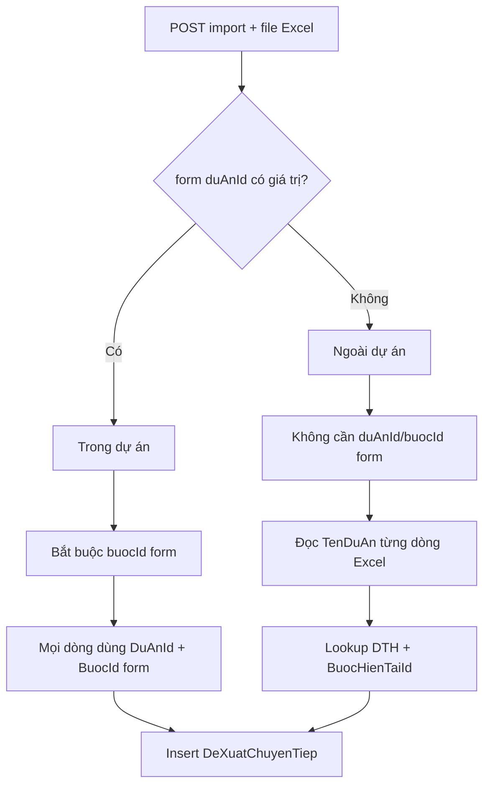

# Import Excel — Bổ sung cột "Dự án" + query `duAnId` trên API tải mẫu

**Ngày tạo:** June 2026  
**Ngày hoàn thành:** June 2026  
**Trạng thái:** ✅ FULLY IMPLEMENTED  
**Effort thực tế:** ~4 giờ  
**Pattern tham chiếu:** `Import_BaoCaoTienDo.xlsx`, `Import_GoiThau.xlsx`, `BaoCaoTienDoImportRangeCommand`  
**Tài liệu gốc:** [task-import-danh-sach-de-xuat-chu-truong-chuyen-tiep.md](./task-import-danh-sach-de-xuat-chu-truong-chuyen-tiep.md)

---

## Executive Summary

**Vấn đề:** File mẫu import `Import_DeXuatChuTruongChuyenTiep.xlsx` chưa có cột **Dự án** trên sheet chính. Khi user tải mẫu ở màn hình **ngoài dự án** (tổng hợp đề xuất chủ trương), không biết mỗi dòng import thuộc dự án nào.

**Đã làm:**

1. **Bỏ cột STT**; thay bằng cột **Dự án** (dropdown `$cbo1`) làm cột đầu — vẫn **6 cột** (khớp mockup hình 2).
2. API tải mẫu nhận query param `Guid? duAnId` — lọc dropdown theo ngữ cảnh trong/ngoài dự án.
3. DTO + handler import: bỏ `Stt`, thêm `TenDuAn`; hỗ trợ **hai luồng** import (trong dự án / ngoài dự án).
4. Ngoài dự án: **không cần** gửi `duAnId`/`buocId` form — lấy từ Excel + `BuocHienTaiId` dự án.

**Không đổi:** Schema DB, migration, `ImportController` signature, API export (`/api/print/danh-sach-de-xuat-chu-truong-chuyen-tiep`).

---

## Quick Facts

| Thuộc tính | Giá trị |
|------------|---------|
| **API tải mẫu** | `GET /api/template/import-de-xuat-chu-truong-chuyen-tiep?duAnId={guid?}` |
| **API import** | `POST /api/import/de-xuat-chu-truong-chuyen-tiep` |
| **Template** | `QLDA.WebApi/PrintTemplates/Import_DeXuatChuTruongChuyenTiep.xlsx` |
| **Excel Table** | `DeXuatChuyenTiepImport`, ref `A5:F7` |
| **Số cột import** | 6 (không STT) |
| **Combo** | Chỉ `$cbo1` (Dự án) — đã bỏ `$cbo2` (Bước) khỏi `comboData` |

---

## Trước / Sau implement

### API tải mẫu

| | Trước | Sau ✅ |
|---|--------|--------|
| Query `duAnId` | Không có | `[FromQuery] Guid? duAnId` |
| Lọc dự án | Tất cả `!IsDeleted` | Có `duAnId` → 1 dự án; không có → `TrangThaiDuAn.Ma == "DTH"` |
| Combo data | `[$cbo1: DuAn, $cbo2: DuAnBuoc]` | Chỉ `[$cbo1: DuAn]` |
| Cột dropdown sheet 0 | Không có `$cbo1` | Row 6 cột A = `$cbo1` |

### API import

| | Trước | Sau ✅ |
|---|--------|--------|
| `duAnId` form | Bắt buộc (thiếu → không insert) | Trong dự án: bắt buộc; **ngoài dự án: không cần** |
| `buocId` form | Bắt buộc | Trong dự án: bắt buộc; **ngoài dự án: tự lấy `BuocHienTaiId`** |
| DTO cột 1 | `Stt` (int?) | `TenDuAn` (string?) |
| Resolve dự án | Chỉ từ form | Ngoài dự án: `TenDuAn` → lookup DB (DTH) |

### Template Excel

| | Trước | Sau ✅ |
|---|--------|--------|
| Cột 1 header | STT | **Dự án** |
| Cột 1 mô tả | `1, 2, 3...` | **`$cbo1`** |
| Sheet combo | `$cbo1` + `$cbo2` (chưa gắn sheet 0) | `$cbo1` gắn sheet 0; `$cbo2` không dùng trong API |

---

## Cấu trúc bảng import (đã triển khai)

**6 cột — không STT** (giống mockup hình 2, giống `Import_GoiThau`):

| # | Header Excel | Row mô tả (row 6) | DTO Property | Combo | Lưu DB? |
|---|--------------|-------------------|--------------|-------|---------|
| 1 | Dự án | `$cbo1` | `TenDuAn` | `$cbo1` | Resolve → `DuAnId` |
| 2 | Số liệu giải ngân | Nhập số tiền (đồng) | `SoLieuGiaiNgan` | — | Có |
| 3 | Ước giải ngân | Nhập số tiền (đồng) | `UocGiaiNgan` | — | Có |
| 4 | Nhu cầu kinh phí | Nhập số tiền (đồng) | `NhuCauKinhPhi` | — | Có |
| 5 | Khối lượng đã hoàn thành | Mô tả khối lượng | `KhoiLuongThucTe` | — | Có |
| 6 | Khối lượng dự kiến hoàn thành | Mô tả khối lượng | `KhoiLuongDuKien` | — | Có |

```
Row 5: [Header]     Dự án | Số liệu giải ngân | Ước giải ngân | ...
Row 6: [Mô tả]      $cbo1 | Nhập số tiền (đồng) | ...
Row 7+: [Dữ liệu]   (user nhập / chọn dropdown)
```

> **Quan trọng:** `IImporterHelper.ReadDataFromExcel<T>()` map theo **thứ tự property trong DTO**, không theo tên header. Xem [docs/issues/9579/report.md](../../issues/9579/report.md).

---

## Step-by-Step — Đã hoàn thành

### Phase 1: Template Excel ✅

**File:** `QLDA.WebApi/PrintTemplates/Import_DeXuatChuTruongChuyenTiep.xlsx`

- [x] Xóa cột **STT** trên sheet chính (sheet 0)
- [x] Thay cột đầu bằng **Dự án**
- [x] Row 6 cột A = `$cbo1` (placeholder dropdown Aspose)
- [x] Giữ Excel Table `DeXuatChuyenTiepImport`, ref `A5:F7` (6 cột)
- [x] Giữ header form (Ủy ban, tiêu đề "MẪU IMPORT ĐỀ XUẤT CHỦ TRƯƠNG CHUYỂN TIẾP")
- [x] Sheet combo (sheet 1): `$cbo1` tại cột C rows 3–4
- [x] Template copy qua build (`PrintTemplates/` — `CopyToOutputDirectory` sẵn có)

**Cơ chế runtime (`ImporterHelper.GetTemplate`):**

1. API ghi danh sách tên dự án vào **Worksheet[1]** tại `$cbo1`
2. Tìm `$cbo1` trên **Worksheet[0]** (row 6)
3. Tạo **DataValidation** List cho cột Dự án (row 6 → ~1000)

---

### Phase 2: Application — DTO ✅

**File:** `QLDA.Application/DeXuatChuyenTiep/DTOs/DeXuatChuyenTiepImportDto.cs`

- [x] Bỏ property `Stt`
- [x] Thêm `TenDuAn` làm property **thứ 1**
- [x] Giữ 5 field nghiệp vụ còn lại, đúng thứ tự cột Excel

```csharp
public class DeXuatChuyenTiepImportDto {
    [Description("Dự án")]
    public string? TenDuAn { get; set; }
    // SoLieuGiaiNgan, UocGiaiNgan, NhuCauKinhPhi,
    // KhoiLuongThucTe, KhoiLuongDuKien
}
```

---

### Phase 3: WebApi — API tải mẫu ✅

**File:** `QLDA.WebApi/Controllers/TemplateController.cs`  
**Method:** `GetImportDeXuatChuTruongChuyenTiep([FromQuery] Guid? duAnId)`

- [x] Thêm param `duAnId` optional
- [x] Có `duAnId` → lọc `DuAn.Id == duAnId`
- [x] Không có `duAnId` → lọc `TrangThaiDuAn.Ma == "DTH"` (Đang thực hiện)
- [x] Bỏ load `DuAnBuoc` / `$cbo2` khỏi `comboData`
- [x] Chỉ truyền `List<List<ComboData>>` một phần tử (Dự án)

```http
GET /api/template/import-de-xuat-chu-truong-chuyen-tiep
GET /api/template/import-de-xuat-chu-truong-chuyen-tiep?duAnId={guid}
```

| Ngữ cảnh UI | `duAnId` | Dropdown "Dự án" |
|-------------|----------|------------------|
| Trong dự án (tab tiến độ) | Truyền GUID hiện tại | Chỉ 1 dự án |
| Ngoài dự án (tổng hợp) | Không truyền | Tất cả dự án **DTH** |

**Ghi chú implement:** `duAnId` invalid/không tồn tại → trả template với dropdown **rỗng** (không 400).

---

### Phase 4: Application — Import handler ✅

**File:** `QLDA.Application/DeXuatChuyenTiep/Commands/DeXuatChuyenTiepImportRangeCommand.cs`

- [x] Inject `IRepository<DuAn, Guid>`
- [x] Phân nhánh `importTrongDuAn = request.DuAnId != Guid.Empty`
- [x] **Trong dự án:** dùng `request.DuAnId` + `request.BuocId`; return sớm nếu `BuocId <= 0`
- [x] **Ngoài dự án:** lookup `TenDuAn` → `(DuAnId, BuocHienTaiId)` qua `GetOrderedSet()`, filter `Ma == "DTH"`
- [x] **Phương án B** cho `buocId` ngoài dự án: `DuAn.BuocHienTaiId` theo từng dòng
- [x] Bỏ qua dòng: không resolve được tên dự án, hoặc `BuocHienTaiId` null/≤ 0
- [x] Cập nhật `IsEmptyRow`: gồm `TenDuAn` trong điều kiện empty



**`ImportController`:** Không đổi — vẫn đọc `duAnId`/`buocId` từ form; empty GUID → luồng ngoài dự án.

---

### Phase 5: Kiểm thử ✅ (manual)

- [x] `QLDA.Application` build pass (0 errors)
- [x] Verify template: row 5 cột 1 = "Dự án", row 6 cột 1 = `$cbo1`
- [x] Postman: import ngoài dự án chỉ gửi `file` (không tick `duAnId`/`buocId`)
- [ ] Integration test tự động (`QLDA.Tests`) — **chưa thêm** (optional)

---

### Phase 6: Tài liệu ✅

- [x] Cập nhật file task này
- [ ] Cập nhật `task-import-danh-sach-de-xuat-chu-truong-chuyen-tiep.md` — **chưa** (doc gốc vẫn mô tả 6 cột có STT)

---

## API contract (sau implement)

### Tải mẫu

```http
GET /api/template/import-de-xuat-chu-truong-chuyen-tiep?duAnId={guid}
```

| Query | Kiểu | Bắt buộc | Mô tả |
|-------|------|----------|-------|
| `duAnId` | `Guid?` | Không | Trong dự án: truyền; ngoài dự án: bỏ qua |

**Response:** `application/vnd.openxmlformats-officedocument.spreadsheetml.sheet`  
**File:** `Import_DeXuatChuTruongChuyenTiep.xlsx`

### Import

```http
POST /api/import/de-xuat-chu-truong-chuyen-tiep
Content-Type: multipart/form-data
```

#### Trong dự án

| Field | Bắt buộc | Mô tả |
|-------|----------|-------|
| `file` | Có | File `.xlsx` |
| `duAnId` | Có | GUID dự án tab hiện tại |
| `buocId` | Có | ID bước tab hiện tại |

#### Ngoài dự án

| Field | Bắt buộc | Mô tả |
|-------|----------|-------|
| `file` | Có | File `.xlsx` có cột Dự án đã chọn |
| `duAnId` | **Không** | Bỏ qua / không gửi |
| `buocId` | **Không** | Backend lấy `BuocHienTaiId` từng dự án |

**Response thành công:** `ResultApi.Ok(data)` — trả list đọc từ Excel.

---

## Tích hợp Frontend

### Tải mẫu

```typescript
// Trong dự án
const params = new URLSearchParams({ duAnId: currentDuAnId });
window.open(`/api/template/import-de-xuat-chu-truong-chuyen-tiep?${params}`, '_blank');

// Ngoài dự án
window.open('/api/template/import-de-xuat-chu-truong-chuyen-tiep', '_blank');
```

### Import

```typescript
const formData = new FormData();
formData.append('file', selectedFile);

if (isTrongDuAn) {
  formData.append('duAnId', duAnId);
  formData.append('buocId', String(buocId));
}
// Ngoài dự án: chỉ file — user chọn Dự án từng dòng trong Excel

await fetch('/api/import/de-xuat-chu-truong-chuyen-tiep', {
  method: 'POST',
  headers: { Authorization: `Bearer ${token}` },
  body: formData,
});
```

---

## Test cases

| # | Case | Kỳ vọng | Trạng thái |
|---|------|---------|------------|
| 1 | `GET template` không `duAnId` | Cột Dự án + dropdown DTH | ✅ |
| 2 | `GET template?duAnId={id}` | Dropdown 1 dự án | ✅ |
| 3 | `GET template?duAnId={invalid}` | Dropdown rỗng, vẫn trả file | ✅ |
| 4 | Import ngoài dự án, nhiều dự án | Mỗi dòng `DuAnId` đúng từ cột Excel | ✅ logic |
| 5 | Import trong dự án + form `duAnId`/`buocId` | Dùng form, bỏ qua cột Excel | ✅ |
| 6 | Import ngoài dự án, thiếu tên dự án | Bỏ qua dòng (silent skip) | ✅ |
| 7 | Import ngoài dự án, dự án không có `BuocHienTaiId` | Bỏ qua dòng | ✅ |
| 8 | File mẫu cũ (cột 1 = STT) | Map sai — FE phải tải mẫu mới | ⚠️ breaking |
| 9 | POST chỉ `file` (Postman) | Không cần `duAnId`/`buocId` | ✅ |

---

## Quyết định đã chốt

### `buocId` khi import ngoài dự án → **Phương án B**

Lấy `DuAn.BuocHienTaiId` khi resolve `TenDuAn`. FE **không** gửi `buocId`.

### Export ↔ Import

Export (`DanhSachDeXuatChuTruongChuyenTiep.xlsx`) vẫn có cột **STT**, không có **Dự án**.  
**Không** dùng file export làm mẫu import ngoài dự án — chỉ dùng API tải mẫu import.

### Script patch một lần

`scripts/patch_import_dexuat_template.py` — công cụ tạm khi sửa template; **có thể xóa** sau khi `.xlsx` đã commit đúng.

### QLDA.Gen

**Chưa làm** — template vẫn chỉnh tay trong `PrintTemplates/`. Có thể bổ sung `ImportTemplateDescriptor` ở phase sau.

---

## Files đã sửa

| File | Thay đổi | Status |
|------|----------|--------|
| `QLDA.WebApi/PrintTemplates/Import_DeXuatChuTruongChuyenTiep.xlsx` | STT → Dự án, `$cbo1` row 6 | ✅ |
| `QLDA.Application/DeXuatChuyenTiep/DTOs/DeXuatChuyenTiepImportDto.cs` | Bỏ `Stt`, thêm `TenDuAn` | ✅ |
| `QLDA.Application/DeXuatChuyenTiep/Commands/DeXuatChuyenTiepImportRangeCommand.cs` | Dual context + lookup DTH | ✅ |
| `QLDA.WebApi/Controllers/TemplateController.cs` | `+duAnId`, filter DTH, bỏ `$cbo2` | ✅ |
| `scripts/patch_import_dexuat_template.py` | Script patch template (optional) | ✅ tạo, có thể xóa |

**Không sửa:** `ImportController.cs`, migration, export template/query, `DeXuatChuyenTiepGetDanhSachQuery`.

---

## Effort breakdown

| Phase | Task | Giờ | Status |
|-------|------|-----|--------|
| 1 | Template Excel | 1 | ✅ |
| 2 | Import DTO | 0.25 | ✅ |
| 3 | TemplateController | 0.75 | ✅ |
| 4 | ImportRangeCommand | 1 | ✅ |
| 5 | Manual test / Postman | 0.5 | ✅ |
| 6 | Doc task này | 0.5 | ✅ |
| — | Integration test | 1 | ⏭️ optional |
| — | Doc import gốc | 0.25 | ⏭️ pending |
| **Tổng** | | **~4** | ✅ |

---

## Tham chiếu code

| File | Vai trò |
|------|---------|
| `TemplateController.GetImportDeXuatChuTruongChuyenTiep` | API tải mẫu + filter `duAnId`/DTH |
| `DeXuatChuyenTiepImportRangeCommandHandler` | Import trong/ngoài dự án |
| `ImportController.ImportDeXuatChuTruongChuyenTiep` | POST multipart |
| `BaoCaoTienDoImportRangeCommand` | Pattern lookup `TenDuAn` |
| `ExcelImporter.GetTemplate` | Aspose dropdown `$cbo1` |
| `DanhMucTrangThaiDuAnConfiguration` | Seed `DTH` = Đang thực hiện |

---

## TÓM TẮT CÔNG VIỆC ĐÃ HOÀN THÀNH

- Mẫu import **6 cột**, cột đầu **Dự án** (dropdown), **không STT**.
- API tải mẫu hỗ trợ `?duAnId=` — trong dự án 1 dự án, ngoài dự án tất cả DTH.
- Import **ngoài dự án**: chỉ cần `file`; `DuAnId` + `BuocId` tự resolve từ Excel + DB.
- Import **trong dự án**: vẫn cần `duAnId` + `buocId` form như trước.
- Không migration, không đổi schema.
