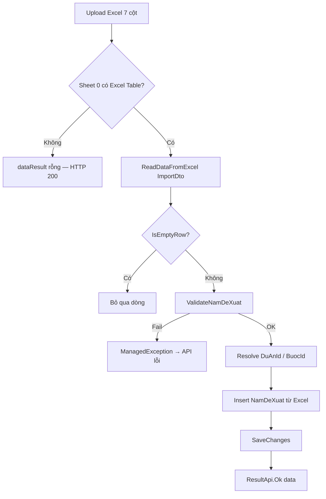

# Fix import Excel — Bổ sung cột "Năm" (NamDeXuat)

**Ngày tạo:** June 2026  
**Ngày hoàn thành:** June 2026  
**Trạng thái:** ✅ FULLY IMPLEMENTED  
**Effort thực tế:** ~3 giờ  
**Tài liệu liên quan:**
- [task-import-danh-sach-de-xuat-chu-truong-chuyen-tiep.md](./task-import-danh-sach-de-xuat-chu-truong-chuyen-tiep.md)
- [task-import-them-cot-du-an.md](./task-import-them-cot-du-an.md)
- [task-export-danh-sach-de-xuat-chu-truong-chuyen-tiep.md](./task-export-danh-sach-de-xuat-chu-truong-chuyen-tiep.md)
- [import-goi-thau-debug-dataresult-empty.md](../../issues/import-goi-thau-debug-dataresult-empty.md) — cùng pattern `dataResult: []`

---

## Executive Summary

**Vấn đề:** CB.PCT / LĐ.PCT import danh sách đề xuất dự án/dự toán/KHT chuyển tiếp từ file Excel (mẫu đã kết xuất) nhưng **import không lưu đúng năm đề xuất** sau khi nghiệp vụ thêm mới bổ sung trường `NamDeXuat`.

**Nguyên nhân gốc (trước khi sửa):**

1. Excel có thêm cột **"Năm"** (7 cột) nhưng `DeXuatChuyenTiepImportDto` chỉ có **6 property** → lệch map / lỗi đọc.
2. Handler hardcode `NamDeXuat = DateTime.Now.Year` thay vì đọc từ file.
3. Export chưa có cột Năm → luồng **Export → Sửa → Import** không đồng bộ.

**Đã làm:**

1. Thêm `NamDeXuat` vào Import DTO (property thứ 2), Export DTO + export query.
2. Handler: validate Năm (bắt buộc, int > 0) + gán `item.NamDeXuat` khi insert.
3. Template import/export: 7 cột, **Năm ở cột 2** (sau STT / Dự án).
4. Khôi phục Excel Table `DeXuatChuyenTiepImport` ref `A5:G7` trên template import (bắt buộc cho `ReadDataFromExcel`).

**Không đổi:** Migration, entity, `ImportController`, logic trong/ngoài dự án (`duAnId` form, lookup `TenDuAn`).

---

## Quick Facts

| Thuộc tính | Giá trị |
|------------|---------|
| **API import** | `POST /api/import/de-xuat-chu-truong-chuyen-tiep` |
| **API export** | `GET /api/print/danh-sach-de-xuat-chu-truong-chuyen-tiep` |
| **API template** | `GET /api/template/import-de-xuat-chu-truong-chuyen-tiep` |
| **Số cột Excel** | **7** (thêm Năm ở cột 2) |
| **DB field** | `DeXuatChuyenTiep.NamDeXuat` (`int?`) — đã có sẵn |
| **Excel Table import** | `DeXuatChuyenTiepImport` ref `A5:G7` — **bắt buộc** |

---

## Trạng thái sau implement

| Thành phần | File | Trạng thái |
|------------|------|------------|
| Entity | `QLDA.Domain/Entities/DeXuatChuyenTiep.cs` | ✅ Có `NamDeXuat` (không sửa) |
| Import DTO | `DeXuatChuyenTiepImportDto.cs` | ✅ +`NamDeXuat` property #2 |
| Import handler | `DeXuatChuyenTiepImportRangeCommand.cs` | ✅ Validate + gán từ Excel |
| Export DTO | `DeXuatChuyenTiepExportDto.cs` | ✅ +`NamDeXuat` property #2 |
| Export query | `DeXuatChuyenTiepGetDanhSachExportQuery.cs` | ✅ Select `NamDeXuat` |
| Template export | `DanhSachDeXuatChuTruongChuyenTiep.xlsx` | ✅ 7 cột, `$NamDeXuat` |
| Template import | `Import_DeXuatChuTruongChuyenTiep.xlsx` | ✅ 7 cột, table `A5:G7` |
| ImportController | `ImportController.cs` | ✅ Không đổi |
| Migration | — | ✅ Không sửa |

---

## Layout cột (đã chốt — Năm ở cột 2)

### Export (trong dự án — In excel)

| # | Header | Placeholder |
|---|--------|-------------|
| 1 | STT | `$Stt` |
| 2 | **Năm** | `$NamDeXuat` |
| 3 | Số liệu giải ngân | `$SoLieuGiaiNgan` |
| 4 | Ước giải ngân | `$UocGiaiNgan` |
| 5 | Nhu cầu kinh phí | `$NhuCauKinhPhi` |
| 6 | Khối lượng đã hoàn thành | `$KhoiLuongThucTe` |
| 7 | Khối lượng dự kiến hoàn thành | `$KhoiLuongDuKien` |

### Import (tải mẫu / ngoài dự án)

| # | Header row 5 | Row mô tả (row 6) |
|---|--------------|-------------------|
| 1 | Dự án | `$cbo1` (row 7) |
| 2 | **Năm** | `Nhập năm (VD: 2026)` |
| 3–7 | 5 cột nghiệp vụ | giữ nguyên, dịch sang phải 1 cột |

```
Row 5:  Dự án | Năm | Số liệu giải ngân | Ước giải ngân | ...
Row 6:  Chọn từ danh sách | Nhập năm (VD: 2026) | Nhập số tiền (đồng) | ...
Row 7+: (dữ liệu user — phải nằm trong Excel Table)
```

### Mapping DTO ↔ Excel

| Index | Export header | Import header | DTO Property | DB | Lưu? |
|-------|---------------|---------------|--------------|-----|------|
| 0 | STT | Dự án | `TenDuAn` | → `DuAnId` | Resolve / form |
| 1 | **Năm** | **Năm** | `NamDeXuat` | `NamDeXuat` | **Có** |
| 2 | Số liệu giải ngân | Số liệu giải ngân | `SoLieuGiaiNgan` | `SoLieuGiaiNgan` | Có |
| 3 | Ước giải ngân | Ước giải ngân | `UocGiaiNgan` | `UocGiaiNgan` | Có |
| 4 | Nhu cầu kinh phí | Nhu cầu kinh phí | `NhuCauKinhPhi` | `NhuCauKinhPhi` | Có |
| 5 | Khối lượng đã hoàn thành | Khối lượng đã hoàn thành | `KhoiLuongThucTe` | `KhoiLuongThucTe` | Có |
| 6 | Khối lượng dự kiến hoàn thành | Khối lượng dự kiến hoàn thành | `KhoiLuongDuKien` | `KhoiLuongDuKien` | Có |

> `ReadDataFromExcel` map theo **thứ tự property**, không theo tên header. Xem [docs/issues/9579/report.md](../../issues/9579/report.md).

---

## Chi tiết thay đổi code

### 1. Import DTO ✅

**File:** `QLDA.Application/DeXuatChuyenTiep/DTOs/DeXuatChuyenTiepImportDto.cs`

- Thêm `int? NamDeXuat` với `[Description("Năm")]` làm **property thứ 2**.
- Tổng **7 property**, khớp 7 cột Excel.

### 2. Import handler ✅

**File:** `QLDA.Application/DeXuatChuyenTiep/Commands/DeXuatChuyenTiepImportRangeCommand.cs`

- Thêm `ValidateNamDeXuat()`:
  - `NamDeXuat` null → *"Trường Năm (dòng X) không được để trống hoặc không parse được số nguyên."*
  - `NamDeXuat <= 0` → *"Trường Năm (dòng X) không hợp lệ. Năm phải lớn hơn 0."*
- Gọi validate sau khi xác nhận có dòng không trống, trước insert.
- Insert: `NamDeXuat = item.NamDeXuat` (bỏ `DateTime.Now.Year`).
- `IsEmptyRow` **không** đổi — không gồm `NamDeXuat` (validate bắt buộc khi có dòng dữ liệu).
- Logic trong/ngoài dự án giữ nguyên.

### 3. Export DTO + query ✅

**Files:**
- `DeXuatChuyenTiepExportDto.cs` — +`NamDeXuat` property thứ 2
- `DeXuatChuyenTiepGetDanhSachExportQuery.cs` — select + map `NamDeXuat`

### 4. Template Excel ✅

| File | Thay đổi |
|------|----------|
| `Import_DeXuatChuTruongChuyenTiep.xlsx` | Chèn cột Năm (B); table `DeXuatChuyenTiepImport` ref **`A5:G7`** |
| `DanhSachDeXuatChuTruongChuyenTiep.xlsx` | Chèn cột Năm (B); placeholder `$NamDeXuat` |

**Lưu ý khi chỉnh template bằng openpyxl:** lưu file có thể **mất Excel Table** trên sheet chính → `ReadDataFromExcel` trả `[]`. Phải giữ / tạo lại `ListObject` tên `DeXuatChuyenTiepImport`.

### 5. WebApi ✅

`ImportController.ImportDeXuatChuTruongChuyenTiep` — **không đổi**. Validation lỗi Năm từ handler → middleware trả `result: false` + `errorMessage`.

---

## Luồng xử lý sau fix



---

## Test cases

| # | Case | Kỳ vọng | Trạng thái |
|---|------|---------|------------|
| 1 | Export → import lại (trong dự án) + `duAnId`/`buocId` | DB `NamDeXuat` đúng từng dòng | ✅ logic |
| 2 | Tải mẫu → điền → import ngoài dự án (chỉ `file`) | `DuAnId` + `NamDeXuat` đúng | ✅ logic |
| 3 | Năm trống | Lỗi validate rõ | ✅ logic |
| 4 | Năm = `abc` | Lỗi parse (null) | ✅ logic |
| 5 | Năm ≤ 0 | Lỗi không hợp lệ | ✅ logic |
| 6 | Năm = `2026` | Lưu `NamDeXuat = 2026` | ✅ logic |
| 7 | File cũ 6 cột | Map sai — phải tải mẫu mới | ⚠️ breaking |
| 8 | File không có Excel Table | `dataResult: []` dù HTTP 200 | ✅ đã gặp & fix template |
| 9 | Thêm dòng ngoài vùng Table | Dòng không đọc được | ⚠️ user phải kéo mở rộng bảng |

### Postman — import trong dự án

```http
POST /api/import/de-xuat-chu-truong-chuyen-tiep
Content-Type: multipart/form-data

file: (file 7 cột)
duAnId: {guid}
buocId: {int}
```

### Postman — import ngoài dự án

```http
POST /api/import/de-xuat-chu-truong-chuyen-tiep
Content-Type: multipart/form-data

file: (chỉ file — cột Dự án + Năm đã điền)
```

---

## Common Issues & Solutions

| Vấn đề | Nguyên nhân | Giải pháp |
|--------|-------------|-----------|
| `dataResult: []` dù `result: true` | Sheet **Danh sach** không có Excel Table `DeXuatChuyenTiepImport` | Tải lại mẫu từ API template; hoặc tạo Table bao phủ vùng dữ liệu `A5:G{n}` |
| Import OK nhưng không insert DB (ngoài dự án) | Tên dự án không khớp DTH / thiếu `BuocHienTaiId` | Kiểm tra cột Dự án + trạng thái dự án |
| Map sai cột | File 6 cột cũ | Tải mẫu mới 7 cột |
| Thêm dòng không import được | Dòng nằm **ngoài** Excel Table | Kéo góc bảng mở rộng `DeXuatChuyenTiepImport` |
| Năm lưu sai | Trước fix: hardcode `DateTime.Now.Year` | Đã fix — đọc từ cột Năm |

---

## Files đã sửa

| Layer | File | Thay đổi |
|-------|------|----------|
| Application | `DeXuatChuyenTiep/DTOs/DeXuatChuyenTiepImportDto.cs` | +`NamDeXuat` |
| Application | `DeXuatChuyenTiep/Commands/DeXuatChuyenTiepImportRangeCommand.cs` | Validate + gán từ Excel |
| Application | `DeXuatChuyenTiep/DTOs/DeXuatChuyenTiepExportDto.cs` | +`NamDeXuat` |
| Application | `DeXuatChuyenTiep/Queries/DeXuatChuyenTiepGetDanhSachExportQuery.cs` | Select `NamDeXuat` |
| WebApi | `PrintTemplates/Import_DeXuatChuTruongChuyenTiep.xlsx` | 7 cột + table `A5:G7` |
| WebApi | `PrintTemplates/DanhSachDeXuatChuTruongChuyenTiep.xlsx` | 7 cột + `$NamDeXuat` |

**Không sửa:** Migration, Entity, `ImportController`, `TemplateController`, `DeXuatChuyenTiepGetDanhSachQuery`.

---

## Effort breakdown

| Phase | Task | Giờ | Status |
|-------|------|-----|--------|
| 1 | Import DTO + handler | 0.75 | ✅ |
| 2 | Export DTO + query + template | 0.75 | ✅ |
| 3 | Import template + khôi phục Excel Table | 0.75 | ✅ |
| 4 | Debug `dataResult: []` + manual test | 0.75 | ✅ |
| **Tổng** | | **~3** | ✅ |

---

## TÓM TẮT CÔNG VIỆC ĐÃ HOÀN THÀNH

- Import/export **7 cột**, cột **Năm** ở vị trí **2** (sau STT / Dự án).
- `NamDeXuat` đọc từ Excel, validate bắt buộc (int > 0), lưu đúng vào DB.
- Export đồng bộ cột Năm — luồng **Export → Sửa → Import** dùng cùng layout DTO.
- Template import giữ Excel Table `DeXuatChuyenTiepImport` (`A5:G7`) — bắt buộc cho engine đọc file.
- Không migration, không đổi logic nghiệp vụ import trong/ngoài dự án.
