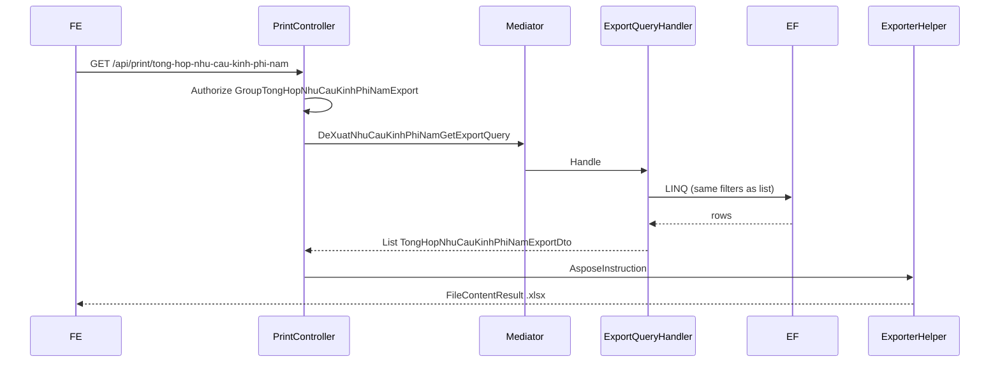

# Export Excel — Tổng hợp nhu cầu kinh phí năm

**Ngày tạo:** June 2026  
**Cập nhật:** June 2026  
**Trạng thái:** ✅ **IMPLEMENTED** (backend) — FE chưa gắn nút  
**Pattern tham chiếu:** `PrintController.InDanhSachPhanKhaiKinhPhi` (LINQ + `IExporterHelper` + Aspose + `LetterheadExport`)  
**Doc export tương tự:** [`task-export-danh-muc-xin-chu-truong-dau-tu.md`](../DeXuatNhuCauKinhPhi/task-export-danh-muc-xin-chu-truong-dau-tu.md)  
**Hướng dẫn Aspose:** [`QLDA.WebApi/PrintTemplates/huong-dan.md`](../../../QLDA.WebApi/PrintTemplates/huong-dan.md)  
**Codegen template:** [`QLDA.Gen`](../../../QLDA.Gen/) — slug `tong-hop-nhu-cau-kinh-phi-nam`

---

## ⚠️ Phân biệt màn hình

| Màn hình | FE route | API list | Entity | Export |
|----------|----------|----------|--------|--------|
| **Tổng hợp nhu cầu kinh phí năm** *(task này)* | `/quan-ly-du-an/tong-hop-nhu-cau-kinh-phi` | `GET /api/tong-hop-kinh-phi/danh-sach-tien-do` | `DeXuatNhuCauKinhPhiNam` | ✅ `GET /api/print/tong-hop-nhu-cau-kinh-phi-nam` |
| Tình hình đề xuất kinh phí | `/quan-ly-du-an/tinh-hinh-de-xuat-kinh-phi` | `GET /api/de-xuat-nhu-cau-kinh-phi/theo-doi-tinh-hinh` | `DeXuatNhuCauKinhPhi` | ✅ `GET /api/print/tinh-hinh-de-xuat-nhu-cau` |

> **Lịch sử:** Commit `0446472` từng đặt tên `tong-hop-nhu-cau-kinh-phi-nam` nhưng query sai entity (`DeXuatNhuCauKinhPhi`). PR #97 rename thành `tinh-hinh-de-xuat-nhu-cau`. Task này implement lại **đúng entity** `DeXuatNhuCauKinhPhiNam`.

---

## 📋 Executive Summary

**Tính năng:** User bấm **Xuất Excel** trên màn **Tổng hợp nhu cầu kinh phí năm**, tải file `.xlsx` đúng dữ liệu grid sau filter (không phân trang).

| Khía cạnh | Giá trị |
|-----------|---------|
| Tên nghiệp vụ / UI | Tổng hợp nhu cầu kinh phí năm |
| Entity nguồn grid/export | `DeXuatNhuCauKinhPhiNam` — không có `DuAnId` |
| Controller danh sách | `DeXuatNhuCauKinhPhiNamController` |
| API danh sách grid | `GET /api/tong-hop-kinh-phi/danh-sach-tien-do` |
| **API export** | `GET /api/print/tong-hop-nhu-cau-kinh-phi-nam` |
| Query list | `DeXuatNhuCauKinhPhiNamQuery` |
| Query export | `DeXuatNhuCauKinhPhiNamGetExportQuery` |
| DTO grid | `DeXuatNhuCauKinhPhiNamDto` |
| DTO export | `TongHopNhuCauKinhPhiNamExportDto` |
| Search DTO | `DeXuatNhuCauKinhPhiNamSearchDto` |
| PrintSearchModel | `DeXuatNhuCauKinhPhiNamPrintSearchModel` |
| Template | `QLDA.WebApi/PrintTemplates/TongHopNhuCauKinhPhiNam.xlsx` |
| Phân quyền | `RoleConstants.GroupTongHopNhuCauKinhPhiNamExport` |

**Migration:** Không cần  
**Stored procedure:** Không (LINQ + Aspose)

---

## 🖼️ Mapping cột UI → Excel (đã implement)

| # | Cột UI | Field grid | Property export DTO | Ghi chú |
|---|--------|------------|---------------------|---------|
| 1 | STT | — | `Stt` | `index + 1` |
| 2 | Số kế hoạch | `So` | `SoKeHoach` | |
| 3 | Trích yếu | `TrichYeu` | `TrichYeu` | Wrap text, căn trái |
| 4 | Tổng hợp chi phí | `TongKinhPhiDeXuat` | `TongHopChiPhi` | `#,##0`, căn phải |
| 5 | Ngày | `NgayKeHoach` | `Ngay` | `dd/MM/yyyy`, căn phải |
| 6 | Trạng thái | `TenTrangThai` | `TrangThai` | Căn trái |
| 7 | Đính kèm `(n)` | `DanhSachTepDinhKem` | `SoLuongTepDinhKem` | `Count`, căn phải |
| — | Thao tác `...` | — | — | Không export |

**Logic trạng thái (copy từ list handler):**

```csharp
TenTrangThai = e.TrangThai != null && e.TrangThai.Ma != "LEG"
    ? e.TrangThai.Ten
    : string.Empty
```

---

## 🔍 Khảo sát source

### API & route

| Thành phần | Giá trị |
|------------|---------|
| URL màn hình | `/quan-ly-du-an/tong-hop-nhu-cau-kinh-phi` |
| API list | `GET /api/tong-hop-kinh-phi/danh-sach-tien-do` |
| API export | `GET /api/print/tong-hop-nhu-cau-kinh-phi-nam` |
| Swagger tag list | `Đề xuất kế hoạch kinh phí năm` |
| Swagger tag export | `In ấn` |

### Filter params (list ↔ export đồng bộ)

| Query param | Handler list | Handler export |
|-------------|--------------|----------------|
| `so` | ✅ `e.So.Contains` | ✅ |
| `trichYeu` | ✅ `e.So.Contains(trichYeu)` *(không phải `e.TrichYeu`)* | ✅ |
| `trangThaiId` | ✅ | ✅ |
| `tuNgay` / `denNgay` | ✅ `NgayKeHoach` | ✅ |
| `phongBanDeXuatId` | ❌ chưa filter | ❌ |
| `nguoiDeXuatId` | ❌ chưa filter | ❌ |
| `globalFilter` | ❌ chưa filter | ❌ *(nhận param nhưng không filter)* |
| `pageIndex` / `pageSize` | ✅ list only | — export lấy hết |
| `hiddenColumns` | — | ✅ export only |

**Sort export:** `OrderBy CreatedAt` → `ThenBy Id`

---

## 🏗️ Luồng xử lý

```
Màn "Tổng hợp nhu cầu kinh phí năm"
├── GET /api/tong-hop-kinh-phi/danh-sach-tien-do     → Grid (phân trang)
└── GET /api/print/tong-hop-nhu-cau-kinh-phi-nam      → Export Excel (toàn bộ filter)
```



---

## 📂 Files đã tạo / sửa

### Tạo mới ✅

| File | Mô tả |
|------|-------|
| `QLDA.Application/DeXuatKinhPhiNam/DTOs/TongHopNhuCauKinhPhiNamExportDto.cs` | 7 property = placeholder template |
| `QLDA.Application/DeXuatKinhPhiNam/Queries/DeXuatNhuCauKinhPhiNamGetExportQuery.cs` | Query + handler export |
| `QLDA.WebApi/Models/DeXuatNhuCauKinhPhiNams/DeXuatNhuCauKinhPhiNamPrintSearchModel.cs` | Search params export |
| `QLDA.WebApi/PrintTemplates/TongHopNhuCauKinhPhiNam.xlsx` | Template Aspose |
| `QLDA.Gen/Descriptors/TongHopNhuCauKinhPhiNamExportDescriptor.cs` | Descriptor codegen |

### Sửa ✅

| File | Thay đổi |
|------|----------|
| `QLDA.Domain/Constants/RoleConstants.cs` | `GroupTongHopNhuCauKinhPhiNamExport` |
| `QLDA.WebApi/Controllers/PrintController.cs` | `InTongHopNhuCauKinhPhiNam` |
| `QLDA.Gen/Program.cs` | Slug `tong-hop-nhu-cau-kinh-phi-nam` |
| `QLDA.Gen/Descriptors/IExportDescriptor.cs` | Thêm `LetterheadExport` layout |
| `QLDA.Gen/Generators/TemplateGenerator.cs` | `BuildLetterheadExport`, `ColumnAlign` |
| `QLDA.Gen/Metadata/ExportColumn.cs` | `HorizontalAlign` per column |

### Không sửa

| File | Lý do |
|------|-------|
| `DeXuatNhuCauKinhPhiNamController.cs` | Export theo convention `PrintController` |
| `DeXuatNhuCauKinhPhiNamQueryHandler` | Giữ nguyên grid |
| Migration | Không đổi schema |

---

## 📝 Chi tiết implement

### API endpoint

```
GET /api/print/tong-hop-nhu-cau-kinh-phi-nam
```

**Query params:** `so`, `trichYeu`, `tuNgay`, `denNgay`, `trangThaiId`, `globalFilter`, `hiddenColumns`

**Tên file tải về:** `TongHopNhuCauKinhPhiNam_yyyyMMddHHmmss.xlsx`

**Phân quyền:**

```csharp
[Authorize(Roles = RoleConstants.GroupTongHopNhuCauKinhPhiNamExport)]
// QLDA_TatCa, QLDA_QuanTri, QLDA_LDDV, QLDA_ChuyenVien
```

### Export DTO

```csharp
public class TongHopNhuCauKinhPhiNamExportDto {
    public int Stt { get; set; }
    public string? SoKeHoach { get; set; }
    public string? TrichYeu { get; set; }
    public long? TongHopChiPhi { get; set; }
    public string? Ngay { get; set; }
    public string? TrangThai { get; set; }
    public int? SoLuongTepDinhKem { get; set; }
}
```

### Template QLDA.Gen

| Thành phần | Giá trị |
|------------|---------|
| Slug | `tong-hop-nhu-cau-kinh-phi-nam` |
| Descriptor | `TongHopNhuCauKinhPhiNamExportDescriptor` |
| Layout | `LetterheadExport` — UBND letterhead R1–R2, title R3, header xanh `#D9E1F2` R4, `$Field` R5 |
| Output runtime | `QLDA.WebApi/PrintTemplates/TongHopNhuCauKinhPhiNam.xlsx` |

**Cột & format (descriptor hiện tại):**

| Property | Header | Width | Format | Căn lề |
|----------|--------|-------|--------|--------|
| `Stt` | STT | 6 | — | Giữa |
| `SoKeHoach` | Số kế hoạch | 28 | — | Giữa |
| `TrichYeu` | Trích yếu | 50 | wrap | Trái |
| `TongHopChiPhi` | Tổng hợp chi phí | 20 | `#,##0` | Phải |
| `Ngay` | Ngày | 18 | — | Phải |
| `TrangThai` | Trạng thái | 32 | — | Trái |
| `SoLuongTepDinhKem` | Số lượng tệp đính kèm | 27 | — | Phải |

**Regenerate template:**

```bash
cd QLDA.Gen
dotnet run -- tong-hop-nhu-cau-kinh-phi-nam --force "E:\SER\QLDA.WebApi\PrintTemplates" "E:\SER\QLDA.WebApi\ExportTemplates"
```

---

## 🧪 Cách test

### Swagger

1. Authorize JWT (`QLDA_ChuyenVien` hoặc `QLDA_LDDV`)
2. `GET /api/print/tong-hop-nhu-cau-kinh-phi-nam`
3. Params mẫu: `?so=KH&trangThaiId=123&tuNgay=2026-06-01&denNgay=2026-06-30`
4. So sánh số dòng với `GET /api/tong-hop-kinh-phi/danh-sach-tien-do` cùng filter

### Postman

```
GET {{baseUrl}}/api/print/tong-hop-nhu-cau-kinh-phi-nam?trangThaiId={{id}}
Authorization: Bearer {{token}}
```

---

## 🔌 Tích hợp FE (chưa làm)

```typescript
const params = new URLSearchParams({
  ...(so && { so }),
  ...(trichYeu && { trichYeu }),
  ...(trangThaiId != null && { trangThaiId: String(trangThaiId) }),
  ...(tuNgay && { tuNgay }),
  ...(denNgay && { denNgay }),
});

window.open(`/api/print/tong-hop-nhu-cau-kinh-phi-nam?${params}`, '_blank');
```

FE cần gắn nút **Xuất Excel** trên `/quan-ly-du-an/tong-hop-nhu-cau-kinh-phi`.

---

## ✅ Validation Checklist

### Code Quality

- [x] Export DTO compile
- [x] Export query compile
- [x] QLDA.Gen descriptor + slug registered
- [x] Template `PrintTemplates/TongHopNhuCauKinhPhiNam.xlsx`
- [x] PrintController endpoint
- [x] `dotnet build` pass

### Chức năng

- [x] Filter export khớp `danh-sach-tien-do`
- [x] STT 1, 2, 3…
- [x] Cột khớp UI (Số kế hoạch, Trích yếu, Tổng KP, Ngày, Trạng thái, Đính kèm)
- [x] Ngày `dd/MM/yyyy`
- [x] Trạng thái text khớp `TenTrangThai`
- [x] Template letterhead + header xanh giống `TinhHinhDeXuatNhuCau`
- [x] Căn lề cột theo BA (STT giữa, số/ngày phải, trích yếu/trạng thái trái)
- [x] Phân quyền `GroupTongHopNhuCauKinhPhiNamExport`
- [x] Không sửa migration
- [x] Không ảnh hưởng API list
- [ ] So sánh số dòng grid vs export trên staging
- [ ] FE nút Xuất Excel

---

## 📎 Tham chiếu nhanh

| Mục | Giá trị |
|-----|---------|
| API endpoint | `GET /api/print/tong-hop-nhu-cau-kinh-phi-nam` |
| API list | `GET /api/tong-hop-kinh-phi/danh-sach-tien-do` |
| Handler export | `DeXuatNhuCauKinhPhiNamGetExportQueryHandler` |
| Handler list | `DeXuatNhuCauKinhPhiNamQueryHandler` |
| Controller export | `PrintController.InTongHopNhuCauKinhPhiNam` |
| Template | `TongHopNhuCauKinhPhiNam.xlsx` |
| QLDA.Gen slug | `tong-hop-nhu-cau-kinh-phi-nam` |
| Role | `GroupTongHopNhuCauKinhPhiNamExport` |
