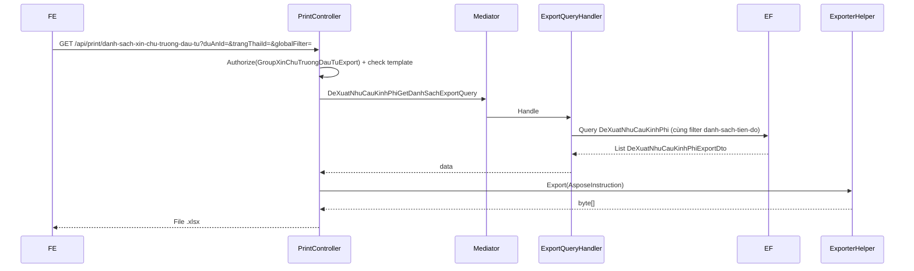

# Export Excel — Danh mục xin chủ trương đầu tư

**Ngày tạo:** June 2026  
**Trạng thái:** ✅ IMPLEMENTED  
**Effort ước tính:** ~3–4 giờ  
**Pattern tham chiếu:** `PrintController.InKetQuaPhanKhaiVonDuocDuyet` (Hướng B: LINQ + `IExporterHelper`)  
**Hướng dẫn Aspose:** `[QLDA.WebApi/PrintTemplates/huong-dan.md](../../../QLDA.WebApi/PrintTemplates/huong-dan.md)`  
**Doc export tương tự:** `[task-export-danh-sach-de-xuat-chu-truong-chuyen-tiep.md](../DeXuatChuyenTiep/task-export-danh-sach-de-xuat-chu-truong-chuyen-tiep.md)`

---

## 📋 Executive Summary

**Tính năng là gì?**  
Cho phép user bấm **Xuất Excel** trên màn danh sách **xin chủ trương đầu tư**, tải file `.xlsx` đúng cột đang hiển thị trên grid.

**Mapping module backend (đã xác minh từ source):**


| Khía cạnh               | Giá trị                                                        |
| ----------------------- | -------------------------------------------------------------- |
| Tên nghiệp vụ / UI      | Danh mục xin chủ trương đầu tư                                 |
| Entity                  | `DeXuatNhuCauKinhPhi`                                          |
| Controller danh sách    | `DeXuatNhuCauKinhPhiController`                                |
| API danh sách grid      | `GET /api/de-xuat-nhu-cau-kinh-phi/danh-sach-tien-do`          |
| Query/handler danh sách | `DeXuatNhuCauKinhPhiQuery` → `DeXuatNhuCauKinhPhiQueryHandler` |


> **Lưu ý đặt tên:** Trên Swagger tag là *"Đề xuất nhu cầu kinh phí"*, nhưng cột UI (Trích yếu, Kinh phí đề xuất, Phòng đề xuất, Số phiếu chuyển, Trạng thái) khớp 100% entity `DeXuatNhuCauKinhPhi`. BA gọi màn hình là *xin chủ trương đầu tư* — không nhầm với `DeXuatChuTruongMoiController` (cột khác: `TomTatNoiDung`, `TongMucDauTu`, không có `SoPhieuChuyen`).

**Thách thức chính:**  
Export phải dùng **cùng logic filter** với grid (`duAnId`, `trangThaiId`, từ khóa tìm kiếm), **không phân trang**, và chỉ cho role **CB.PCT** / **LĐ.PCT**.

**Độ phức tạp:** Thấp  
**Migration:** Không cần  
**Stored procedure:** Không cần (dùng LINQ + Aspose template)

---

## 📋 Quick Facts


| Thuộc tính                 | Giá trị                                                    |
| -------------------------- | ---------------------------------------------------------- |
| **Entity**                 | `DeXuatNhuCauKinhPhi`                                      |
| **Table**                  | `DeXuatNhuCauKinhPhi`                                      |
| **API danh sách gốc**      | `GET /api/de-xuat-nhu-cau-kinh-phi/danh-sach-tien-do`      |
| **Search DTO tái sử dụng** | `DeXuatNhuCauKinhPhiSearchDto` (kế thừa `CommonSearchDto`) |
| **API export (đã triển khai)** | `GET /api/print/danh-sach-xin-chu-truong-dau-tu`         |
| **Pattern export**             | LINQ + `IExporterHelper.Export` + Aspose template        |
| **Template (đã triển khai)**   | `DanhSachXinChuTruongDauTu.xlsx`                         |


---

## 🔍 Kết quả khảo sát source (Phase 0)

### 0.1 Controller quản lý danh sách

**File:** `QLDA.WebApi/Controllers/DeXuatNhuCauKinhPhiController.cs`

```csharp
[HttpGet("danh-sach-tien-do")]
public async Task<ResultApi> Get([FromQuery] DeXuatNhuCauKinhPhiSearchDto req) {
    var res = await Mediator.Send(new DeXuatNhuCauKinhPhiQuery() {
        DuAnId = req.DuAnId,
        BuocId = req.BuocId,
        TrangThaiId = req.TrangThaiId,
        DaDuyetTongHop = req.DaDuyetTongHop,
        SoPhieuChuyen = req.SoPhieuChuyen,
        GlobalFilter = req.GlobalFilter,
        PageIndex = req.PageIndex,
        PageSize = req.PageSize,
        IsNoTracking = true,
    });
    return ResultApi.Ok(res);
}
```

**Endpoint phụ (theo dõi — không phải màn export này):**  
`GET /api/de-xuat-nhu-cau-kinh-phi/theo-doi-tinh-hinh` → `TheoDoiDeXuatNhuCauKinhPhiQuery` (logic phức tạp hơn, có join kế hoạch năm).

### 0.2 Query/handler lấy danh sách grid


| Thành phần   | File                                                                                                               |
| ------------ | ------------------------------------------------------------------------------------------------------------------ |
| Query record | `QLDA.Application/DeXuatNhuCauKinhPhi/Queries/DeXuatNhuCauKinhPhiGetDanhSachQuery.cs` — `DeXuatNhuCauKinhPhiQuery` |
| Handler      | `DeXuatNhuCauKinhPhiQueryHandler`                                                                                  |
| DTO trả về   | `QLDA.Application/DeXuatNhuCauKinhPhi/DTOs/DeXuatNhuCauKinhPhiDto.cs`                                              |
| Search DTO   | `QLDA.Application/DeXuatNhuCauKinhPhi/DTOs/DeXuatNhuCauKinhPhiSearchDto.cs`                                        |


**Filter hiện tại trong handler (cần copy sang export query):**

```text
!e.IsDeleted
!e.DuAn!.IsDeleted
DaDuyetTongHop → TrangThaiId == trạng thái Đã duyệt (DeXuatMacDinh)   [chỉ khi flag = true]
duAnId         → e.DuAnId == duAnId                                    [nếu có]
buocId         → e.BuocId == buocId                                    [nếu > 0]
soPhieuChuyen  → Contains                                               [nếu có]
trangThaiId    → e.TrangThaiId == trangThaiId                          [nếu có]
tuNgay/denNgay → filter NgayPhieuChuyen                                [nếu có]
```

**⚠️ Gap cần xử lý khi implement:**


| Vấn đề                      | Chi tiết                                                                                                    | Đề xuất                                                                                                                                                                                                  |
| --------------------------- | ----------------------------------------------------------------------------------------------------------- | -------------------------------------------------------------------------------------------------------------------------------------------------------------------------------------------------------- |
| `GlobalFilter` chưa áp dụng | `DeXuatNhuCauKinhPhiQuery` có property `GlobalFilter` nhưng handler **không gọi** `.WhereGlobalFilter(...)` | Export query **nên** áp dụng `WhereGlobalFilter` trên `TrichYeu`, `SoPhieuChuyen`, tên phòng (`DmDonVi.TenDonVi`) để khớp ô "Tìm kiếm" trên UI. **Không sửa** query grid gốc trừ khi BA yêu cầu đồng bộ. |
| Cột "Phòng đề xuất"         | Grid DTO chỉ có `DonViDeXuatId`; tên phòng FE có thể resolve client-side                                    | Export query **JOIN** `DmDonVi` → `TenPhongDeXuat` (tham khảo `TheoDoiDeXuatNhuCauKinhPhiQuery` dòng `TenDonViDeXuat`)                                                                                   |
| `buocId`                    | User spec chỉ nêu `duAnId` + `trangThaiId`; grid trong tiến độ dự án thường có `buocId`                     | **Đã quyết định:** **không** đưa `buocId` vào export API — chỉ `duAnId`, `trangThaiId`, `globalFilter` theo BA                                                                                            |


### 0.3 API export Excel tham khảo trong project

`DeXuatNhuCauKinhPhiController` **không có** endpoint export — chỉ dùng làm reference module/filter. Export thực tế theo pattern `PrintController`:


| Endpoint                                                  | Pattern                                        | File tham chiếu                                       |
| --------------------------------------------------------- | ---------------------------------------------- | ----------------------------------------------------- |
| `GET /api/print/ket-qua-phan-khai-von-duoc-duyet`         | LINQ + Aspose + `GlobalFilter`                 | `PrintController.InKetQuaPhanKhaiVonDuocDuyet`        |
| `GET /api/print/danh-sach-de-xuat-chu-truong-chuyen-tiep` | LINQ + Aspose, filter `duAnId`/`buocId`        | `PrintController.InDanhSachDeXuatChuTruongChuyenTiep` |
| Export query mẫu                                          | `PhanKhaiKinhPhiGetDanhSachDaDuyetExportQuery` | Có `WhereGlobalFilter`, `Stt` tự sinh                 |
| Export query mẫu                                          | `DeXuatChuyenTiepGetDanhSachExportQuery`       | Copy filter từ `GetDanhSachQuery`                     |


### 0.4 Phân quyền


| Vai trò BA | Role hệ thống     | Constant hiện có |
| ---------- | ----------------- | ---------------- |
| CB.PCT     | `QLDA_ChuyenVien` | —                |
| LĐ.PCT     | `QLDA_LDDV`       | —                |


**Yêu cầu task:** Chỉ CB.PCT + LĐ.PCT (không như `GroupPhanKhaiKinhPhiExport` đã bao gồm thêm GĐ/PGĐ, CB/LĐ.PKH-TC).

**Đề xuất constant mới** trong `RoleConstants.cs`:

```csharp
/// <summary>
/// Kết xuất Excel danh mục xin chủ trương đầu tư (CB.PCT, LĐ.PCT)
/// </summary>
public const string GroupXinChuTruongDauTuExport =
    $"{QLDA_TatCa},{QLDA_QuanTri},{QLDA_LDDV},{QLDA_ChuyenVien}";
```

> Giữ `QLDA_TatCa` + `QLDA_QuanTri` theo convention các export khác (admin vẫn export được).

---

## 🎯 Phạm vi tính năng

### Đã bao gồm

- Endpoint export Excel với phân quyền CB.PCT / LĐ.PCT
- Query EF **không phân trang**, filter giống `danh-sach-tien-do` + `globalFilter`
- Template Aspose 6 cột (STT + 5 cột nghiệp vụ)
- Export DTO + PrintSearchModel
- Tên file tải về có timestamp

### Không bao gồm

- Thay đổi logic `DeXuatNhuCauKinhPhiQuery` (grid gốc)
- Migration / stored procedure
- Export màn `theo-doi-tinh-hinh` (phạm vi khác)
- Import ngược từ file Excel

---

## 🏗️ Kiến trúc & luồng xử lý

```
Màn "Xin chủ trương đầu tư"
├── GET /api/de-xuat-nhu-cau-kinh-phi/danh-sach-tien-do   → Grid (có phân trang)
└── GET /api/print/danh-sach-xin-chu-truong-dau-tu        → Export Excel (không phân trang)

DeXuatNhuCauKinhPhi (Entity)
├── DuAnId: Guid
├── BuocId: int?
├── TrichYeu: string?
├── KinhPhiDeXuat: long?
├── DonViDeXuatId: long?        → JOIN DmDonVi → TenPhongDeXuat
├── SoPhieuChuyen: string?
└── TrangThaiId: int?           → JOIN DmTrangThaiPheDuyet → TenTrangThai
```




---

## 📊 Cột export (khớp UI)


| #   | Header Excel         | Property DTO     | Nguồn DB                                    | Kiểu      | Ghi chú                                                                                                                                        |
| --- | -------------------- | ---------------- | ------------------------------------------- | --------- | ---------------------------------------------------------------------------------------------------------------------------------------------- |
| 1   | STT                  | `Stt`            | Tự sinh `index + 1`                         | `int`     | Không lấy từ DB                                                                                                                                |
| 2   | Trích yếu            | `TrichYeu`       | `e.TrichYeu`                                | `string?` |                                                                                                                                                |
| 3   | Kinh phí đề xuất (đ) | `KinhPhiDeXuat`  | `e.KinhPhiDeXuat`                           | `long?`   | UI hiển thị đơn vị **đồng** — export **nguyên giá trị DB** (không chia triệu như PhanKhaiKinhPhi). Format `#,##0` trong template Excel nếu cần |
| 4   | Phòng đề xuất        | `TenPhongDeXuat` | `DmDonVi.TenDonVi` qua `DonViDeXuatId`      | `string?` | Ví dụ UI: `PCT1`                                                                                                                               |
| 5   | Số phiếu chuyển      | `SoPhieuChuyen`  | `e.SoPhieuChuyen`                           | `string?` | Ví dụ UI: `PC-01`                                                                                                                              |
| 6   | Trạng thái           | `TenTrangThai`   | `e.TrangThai.Ten` hoặc fallback `TenDuThao` | `string?` | Ví dụ UI: `Đã trình`                                                                                                                           |


**Placeholder template Aspose:** `$Stt`, `$TrichYeu`, `$KinhPhiDeXuat`, `$TenPhongDeXuat`, `$SoPhieuChuyen`, `$TenTrangThai`

---

## 📂 Files đã tạo / sửa (implementation)

### Tạo mới ✅


| Layer       | File                                                                       | Mô tả                                                              |
| ----------- | -------------------------------------------------------------------------- | ------------------------------------------------------------------ |
| Domain      | —                                                                          | Không cần                                                          |
| Application | `DeXuatNhuCauKinhPhi/DTOs/DeXuatNhuCauKinhPhiExportDto.cs`                 | DTO export — property = placeholder template                       |
| Application | `DeXuatNhuCauKinhPhi/Queries/DeXuatNhuCauKinhPhiGetDanhSachExportQuery.cs` | Query + handler export (không phân trang)                          |
| WebApi      | `Models/DeXuatNhuCauKinhPhis/DeXuatNhuCauKinhPhiPrintSearchModel.cs`       | `DuAnId`, `TrangThaiId`, `GlobalFilter`, `HiddenColumns` (không có `BuocId`) |
| WebApi      | `PrintTemplates/DanhSachXinChuTruongDauTu.xlsx`                            | Template Aspose 6 cột                                              |


### Sửa ✅


| File                                         | Thay đổi                                                                    |
| -------------------------------------------- | --------------------------------------------------------------------------- |
| `QLDA.Domain/Constants/RoleConstants.cs`     | ➕ `GroupXinChuTruongDauTuExport`                                            |
| `QLDA.WebApi/Controllers/PrintController.cs` | ➕ region `DanhSachXinChuTruongDauTu` + `InDanhSachXinChuTruongDauTu`         |


### Không sửa


| File                                     | Lý do                                                  |
| ---------------------------------------- | ------------------------------------------------------ |
| `DeXuatNhuCauKinhPhiGetDanhSachQuery.cs` | Giữ nguyên logic grid                                  |
| `DeXuatNhuCauKinhPhiController.cs`       | Export đặt tại `PrintController` theo convention dự án |
| Migration / snapshot                     | Không thay đổi DB                                      |


---

## 🚀 Step-by-Step Implementation

### Phase 1: Domain (~15 phút)

**File:** `QLDA.Domain/Constants/RoleConstants.cs`

- Thêm `GroupXinChuTruongDauTuExport` (xem mục 0.4)

**Verify:** constant compile, map đúng CB.PCT + LĐ.PCT

---

### Phase 2: Application (~1 giờ)

#### 2.1 Export DTO

**File:** `QLDA.Application/DeXuatNhuCauKinhPhi/DTOs/DeXuatNhuCauKinhPhiExportDto.cs`

```csharp
namespace QLDA.Application.DeXuatNhuCauKinhPhis.DTOs;

public class DeXuatNhuCauKinhPhiExportDto {
    public int Stt { get; set; }
    public string? TrichYeu { get; set; }
    public long? KinhPhiDeXuat { get; set; }
    public string? TenPhongDeXuat { get; set; }
    public string? SoPhieuChuyen { get; set; }
    public string? TenTrangThai { get; set; }
}
```

#### 2.2 Export Query

**File:** `QLDA.Application/DeXuatNhuCauKinhPhi/Queries/DeXuatNhuCauKinhPhiGetDanhSachExportQuery.cs`

```csharp
public record DeXuatNhuCauKinhPhiGetDanhSachExportQuery : IMayHaveGlobalFilter, IRequest<List<DeXuatNhuCauKinhPhiExportDto>> {
    public Guid? DuAnId { get; set; }
    public int? TrangThaiId { get; set; }
    public string? GlobalFilter { get; set; }
}
```

**Critical points:**

- Copy `Where` cơ bản từ `DeXuatNhuCauKinhPhiQueryHandler` (`!IsDeleted`, `DuAnId`, `TrangThaiId`) — **không** có `BuocId`, `DaDuyetTongHop`, `SoPhieuChuyen`
- **GlobalFilter (đã implement):** `Contains` trên `TrichYeu`, `SoPhieuChuyen`, `DmDonVi.TenDonVi` (subquery qua `DonViDeXuatId`)
- JOIN `DmDonVi` lấy `TenPhongDeXuat` (subquery trong `Select`)
- `TenTrangThai`: `e.TrangThai.Ten` nếu `Ma != "LEG"`, else `TrangThaiPheDuyetCodes.Default.TenDuThao`
- Sort: `OrderBy CreatedAt`, `ThenBy Id`
- `Stt = index + 1` sau khi materialize list
- **Không** gọi `.PaginatedListAsync`

**Verify:** `dotnet build QLDA.Application` pass

---

### Phase 3: WebApi (~1.5 giờ)

#### 3.1 PrintSearchModel

**File:** `QLDA.WebApi/Models/DeXuatNhuCauKinhPhis/DeXuatNhuCauKinhPhiPrintSearchModel.cs`

```csharp
public record DeXuatNhuCauKinhPhiPrintSearchModel {
    public Guid? DuAnId { get; set; }
    public int? TrangThaiId { get; set; }
    public string? GlobalFilter { get; set; }
    public List<string>? HiddenColumns { get; set; }
}
```

> Tận dụng fields từ `DeXuatNhuCauKinhPhiSearchDto` / `CommonSearchDto` — không tạo DTO trùng lặp ở Application nếu không cần.

#### 3.2 Endpoint PrintController

**File:** `QLDA.WebApi/Controllers/PrintController.cs`

```csharp
#region DanhSachXinChuTruongDauTu

/// <summary>
/// DanhSachXinChuTruongDauTu.xlsx — Export danh sách xin chủ trương đầu tư
/// </summary>
[HttpGet("api/print/danh-sach-xin-chu-truong-dau-tu")]
[Authorize(Roles = RoleConstants.GroupXinChuTruongDauTuExport)]
[ProducesResponseType(StatusCodes.Status200OK)]
public async Task<IActionResult> InDanhSachXinChuTruongDauTu(
    [FromQuery] DeXuatNhuCauKinhPhiPrintSearchModel searchModel) {
    var fileNameTemplate = "DanhSachXinChuTruongDauTu.xlsx";
    var templatePath = Path.Combine(AppContext.BaseDirectory, "PrintTemplates", fileNameTemplate);

    ManagedException.ThrowIf(!File.Exists(templatePath), "Không tìm thấy file template");
    ManagedException.ThrowIf(_userProvider.Id == 0, "Vui lòng đăng nhập");

    var data = await Mediator.Send(new DeXuatNhuCauKinhPhiGetDanhSachExportQuery {
        DuAnId = searchModel.DuAnId,
        TrangThaiId = searchModel.TrangThaiId,
        GlobalFilter = searchModel.GlobalFilter,
    });

    var exportResult = _excelExporter.Export(new AsposeInstruction<DeXuatNhuCauKinhPhiExportDto> {
        TemplatePath = templatePath,
        Items = data,
        HiddenColumns = searchModel.HiddenColumns ?? [],
        AutoFitColumnsAndRows = false,
    });

    return new FileContentResult(exportResult.FileBytes, exportResult.ContentType) {
        FileDownloadName = GetDownloadFileName(fileNameTemplate)
    };
}

#endregion
```

#### 3.3 API spec

```http
GET /api/print/danh-sach-xin-chu-truong-dau-tu?duAnId={guid}&trangThaiId={int}&globalFilter={string}
Authorization: Bearer {token}
```


| Query param     | Kiểu       | Mô tả                              |
| --------------- | ---------- | ---------------------------------- |
| `duAnId`        | `Guid?`    | Lọc 1 dự án; null = tất cả dự án   |
| `trangThaiId`   | `int?`     | Lọc theo trạng thái; null = tất cả |
| `globalFilter`  | `string?`  | Từ khóa tìm kiếm (ô "Tìm kiếm...") |
| `hiddenColumns` | `string[]` | Ẩn cột optional                    |


**Response:** `application/vnd.openxmlformats-officedocument.spreadsheetml.sheet`  
**Tên file:** `DanhSachXinChuTruongDauTu_ddMMyyyy_HHmmss.xlsx`

#### 3.4 Template Excel

**File:** `QLDA.WebApi/PrintTemplates/DanhSachXinChuTruongDauTu.xlsx`

- Layout letterhead giống `DanhSachDeXuatChuTruongChuyenTiep.xlsx` (UBND / Cộng hòa, merge `A1:D2`, `E1:F2`)
- Tiêu đề `A3:F3`: **DANH SÁCH XIN CHỦ TRƯƠNG ĐẦU TƯ**
- Header row 4 + placeholder row 5: `$Stt`, `$TrichYeu`, `$KinhPhiDeXuat`, `$TenPhongDeXuat`, `$SoPhieuChuyen`, `$TenTrangThai`
- Cột `KinhPhiDeXuat`: format `#,##0`, căn phải

**Verify:** template copy to output (`PrintTemplates/` trong build)

---

### Phase 4: Tích hợp FE (~30 phút)

```typescript
// Cùng filter với grid "Xin chủ trương đầu tư"
const params = new URLSearchParams({
  ...(duAnId && { duAnId }),
  ...(trangThaiId && { trangThaiId: String(trangThaiId) }),
  ...(globalFilter && { globalFilter }),
});
// Nút "Xuất Excel" — chỉ hiện với CB.PCT, LĐ.PCT
window.open(`/api/print/danh-sach-xin-chu-truong-dau-tu?${params}`, '_blank');
```

---

### Phase 5: Kiểm thử (~30 phút)


| Case                               | Kỳ vọng                                                      |
| ---------------------------------- | ------------------------------------------------------------ |
| Có dữ liệu theo `duAnId`           | File đủ dòng, đúng 6 cột                                     |
| Chỉ `trangThaiId` (không `duAnId`) | Export cross-project theo trạng thái                         |
| `globalFilter` khớp 1 bản ghi      | Chỉ 1 dòng trong Excel                                       |
| Không có dữ liệu                   | File chỉ có header                                           |
| User không có role                 | 403 Forbidden                                                |
| Chưa đăng nhập                     | 400 "Vui lòng đăng nhập"                                     |
| Thiếu template                     | 400 "Không tìm thấy file template"                           |
| So sánh với grid                   | Số dòng export = tổng dòng grid (cùng filter, bỏ phân trang) |


---

## ✅ Validation Checklist (trước khi merge)

### Code Quality

- [x] Export DTO compile
- [x] Export query compile
- [x] PrintController endpoint compile
- [x] `dotnet build` solution pass

### Chức năng

- [x] Filter export: `duAnId`, `trangThaiId`, `globalFilter` (TrichYeu / SoPhieuChuyen / TenDonVi)
- [x] STT tự sinh 1, 2, 3…
- [x] Phân quyền CB.PCT + LĐ.PCT (+ `QLDA_TatCa`, `QLDA_QuanTri`)
- [x] Template Aspose fill đúng placeholder
- [x] `KinhPhiDeXuat` raw `long`, format `#,##0` trong template
- [ ] Kiểm thử thủ công end-to-end (FE chưa tích hợp)

### Không thay đổi

- [x] Không sửa migration
- [x] Không sửa `DeXuatNhuCauKinhPhiQuery` handler

---

## 📊 Effort Breakdown


| Phase    | Task                                     | Giờ    | Status |
| -------- | ---------------------------------------- | ------ | ------ |
| 0        | Phân tích source + pattern               | 0.5    | ✅      |
| 1        | RoleConstants                            | 0.25   | ✅      |
| 2        | Export DTO + Query                       | 1      | ✅      |
| 3        | PrintSearchModel + Controller + Template | 1.5    | ✅      |
| 4        | FE integration guide                     | 0.5    | ⬜      |
| 5        | Kiểm thử thủ công                        | 0.5    | ⬜      |
| **Tổng** |                                          | **~4** |        |


---

## 📞 Common Issues & Solutions


| Vấn đề                  | Nguyên nhân                      | Giải pháp                                              |
| ----------------------- | -------------------------------- | ------------------------------------------------------ |
| Số dòng export ≠ grid   | Filter khác (grid có `buocId`, export không) | Export chỉ `duAnId` + `trangThaiId` + `globalFilter` theo BA; grid vẫn có thể filter `buocId` riêng |
| Cột Phòng đề xuất trống | Chưa JOIN `DmDonVi`              | Lấy `TenDonVi` qua `DonViDeXuatId`                     |
| Tìm kiếm export ≠ grid  | Grid chưa có `WhereGlobalFilter` | Export có filter; hoặc sửa grid đồng bộ                |
| Cột trống trong Excel   | Placeholder sai tên              | Property DTO phải khớp `$Field`                        |
| 403 Forbidden           | User thiếu role                  | Kiểm tra `GroupXinChuTruongDauTuExport`                |


---

## 🔗 Files tham chiếu


| File                                                                                    | Vai trò                             |
| --------------------------------------------------------------------------------------- | ----------------------------------- |
| `QLDA.WebApi/Controllers/DeXuatNhuCauKinhPhiController.cs`                              | API danh sách gốc                   |
| `DeXuatNhuCauKinhPhiGetDanhSachQuery.cs`                                                | Logic filter tham chiếu             |
| `TheoDoiDeXuatNhuCauKinhPhiQuery.cs`                                                    | Mẫu JOIN `TenDonViDeXuat`           |
| `PrintController.InKetQuaPhanKhaiVonDuocDuyet`                                          | Pattern export LINQ + Aspose        |
| `PhanKhaiKinhPhiGetDanhSachDaDuyetExportQuery.cs`                                       | Pattern `WhereGlobalFilter` + `Stt` |
| `docs/feature/DeXuatChuyenTiep/task-export-danh-sach-de-xuat-chu-truong-chuyen-tiep.md` | Doc export cùng pattern             |


---

## 📝 Changelog so với bản thiết kế ban đầu

| Hạng mục | Thiết kế ban đầu | Đã triển khai |
| -------- | ---------------- | ------------- |
| API route | `GET /api/print/danh-muc-xin-chu-truong-dau-tu` | `GET /api/print/danh-sach-xin-chu-truong-dau-tu` |
| Controller method | `InDanhMucXinChuTruongDauTu` | `InDanhSachXinChuTruongDauTu` |
| Template file | `DanhMucXinChuTruongDauTu.xlsx` | `DanhSachXinChuTruongDauTu.xlsx` |
| Query param `buocId` | Có (theo `CommonSearchDto`) | **Bỏ** — BA chỉ yêu cầu `duAnId` + `trangThaiId` |
| `globalFilter` | Đề xuất dùng `WhereGlobalFilter` | **Có** — filter thủ công `TrichYeu`, `SoPhieuChuyen`, `TenDonVi` |
| Sort | Chưa chốt | `OrderBy CreatedAt`, `ThenBy Id` |
| Format tiền | Chưa chốt | Raw `long` DB + `#,##0` trong template Excel |

---

## ✅ Đã chốt (open questions)

1. **Tên route:** `danh-sach-xin-chu-truong-dau-tu`
2. **GlobalFilter:** Có — áp dụng trên export (grid gốc vẫn chưa có `WhereGlobalFilter`)
3. **Sort order:** `CreatedAt`, rồi `Id`
4. **Format tiền:** Raw `long` + format `#,##0` trong template
5. **`buocId`:** Không đưa vào export API

**Còn lại:** FE tích hợp nút Xuất Excel + kiểm thử thủ công end-to-end.

