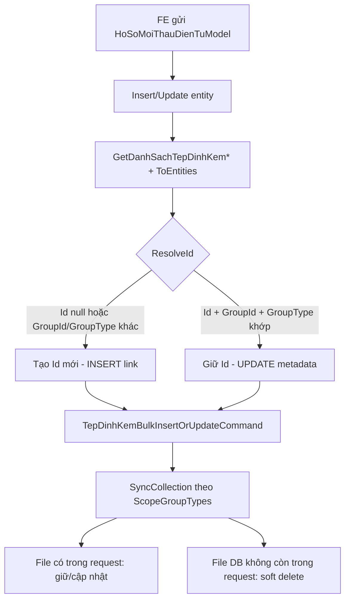

# Fix đính kèm file — HoSoMoiThauDienTu

Tài liệu mô tả **nguyên nhân lỗi**, **cách sửa từng bước** và **kịch bản test** cho phần `TepDinhKem` của module Hồ sơ mời thầu điện tử.

> **Không cần migration** — thay đổi chỉ ở logic Application/WebApi.

---

## 1. Triệu chứng (hiện trạng trước khi sửa)

| Case | Hành vi sai |
|------|-------------|
| **Thêm mới** | Chọn file từ hồ sơ/bản ghi khác → hệ thống **insert lại bằng Id cũ**, ghi đè hoặc trùng PK, liên kết sai `GroupId` |
| **Cập nhật** | Upload/chọn file mới → **không lưu được** hoặc không sync đúng |
| **Xóa file trên UI** | Remove file khỏi danh sách → **liên kết cũ vẫn còn** trong DB |
| **Tờ trình / Thẩm định** | File quyết định thẩm định **chỉ sync khi tờ trình có file** (điều kiện sai) |

---

## 2. Kiến trúc đính kèm (chuẩn dự án)

`TepDinhKem` **không có FK** trực tiếp từ entity. Liên kết qua:

| Trường | Ý nghĩa |
|--------|---------|
| `GroupId` | Id bản ghi sở hữu file (string) |
| `GroupType` | Loại nghiệp vụ (`EGroupType`) |

### Mapping GroupId / GroupType cho HoSoMoiThauDienTu

| Vùng UI | GroupId | GroupType |
|---------|---------|-----------|
| `DanhSachTepDinhKem` (hồ sơ chính) | `entity.Id` | `HoSoMoiThauDienTu` |
| `ToTrinhQuyetDinh.DanhSachTepDinhKem` | `entity.ToTrinhQuyetDinh.Id` | `HoSoMoiThauDienTuToTrinh` |
| `HoSoMoiThauThamDinh.DinhKemQuyetDinh` | `entity.Id` | `HoSoMoiThauDienTuQuyetDinhTD` |
| `HoSoMoiThauThamDinh.DinhKemCamKet` | `entity.Id` | `HoSoMoiThauDienTuCamKetTD` |
| `HoSoMoiThauThamDinh.DinhKemBaoCao` | `entity.Id` | `HoSoMoiThauDienTuBaoCaoTD` |

**Lưu ý:** Nhiều `GroupType` khác nhau có thể **cùng `GroupId = entity.Id`**. Mỗi lần sync phải giới hạn đúng `GroupType`, tránh xóa nhầm loại file khác.

---

## 3. Nguyên nhân gốc (chỗ sai)

### Lỗi A — Map Id sai khi tạo liên kết file (`HoSoMoiThauDienTuMappingConfiguration`)

**File:** `QLDA.WebApi/Models/HoSoMoiThauDienTus/HoSoMoiThauDienTuMappingConfiguration.cs`

**Code cũ (sai):**
```csharp
Id = m.Id ?? Guid.NewGuid(),
GroupId = groupId.ToString(),
GroupType = EGroupType.HoSoMoiThauDienTu.ToString(),
```

**Vì sao sai:**
- Khi user **chọn file cũ** từ bản ghi khác, FE gửi kèm `Id` + `GroupId` của bản ghi cũ.
- Backend **giữ nguyên Id cũ** → `SyncCollection` coi đây là bản ghi đã tồn tại hoặc cố insert trùng PK.
- Kết quả: file cũ bị **tạo lại / ghi đè sai**, không tạo **liên kết mới** đúng nghiệp vụ.

**Chuẩn dự án:** Các module khác dùng `TepDinhKemMappingConfigurations.ToEntities()` với logic `ResolveId`.

---

### Lỗi B — `TepDinhKemBulkInsertOrUpdateCommand` bỏ qua danh sách rỗng

**File:** `QLDA.Application/TepDinhKems/Commands/TepDinhKemBulkInsertOrUpdateCommand.cs`

**Code cũ (sai):**
```csharp
if (request.Entities.Count == 0)
    return;
```

**Vì sao sai:**
- `SyncHelper.SyncCollection` hỗ trợ **Delete All** khi request rỗng (soft delete các file không còn trong danh sách).
- Early return khiến **update không xóa được file** khi user remove trên UI.

---

### Lỗi C — Không giới hạn `GroupType` khi sync list rỗng

HoSoMoiThauDienTu có **4 GroupType** dùng chung `GroupId = entity.Id`.

Khi `Entities = []` và không filter `GroupType`, handler load **tất cả** file cùng `GroupId` → có thể xóa nhầm file thẩm định khi chỉ muốn xóa file hồ sơ chính.

**Fix:** Thêm `ScopeGroupTypes` vào command để chỉ định phạm vi xóa khi list rỗng.

---

### Lỗi D — Điều kiện sync sai trong Controller

**File:** `QLDA.WebApi/Controllers/HoSoMoiThauDienTuController.cs`

**Code cũ (sai):**
```csharp
// Chỉ sync tờ trình khi có file
if (model.ToTrinhQuyetDinh?.DanhSachTepDinhKem?.Count > 0) { ... }

// Quyết định thẩm định — check nhầm sang tờ trình
if (model.ToTrinhQuyetDinh?.DanhSachTepDinhKem?.Count > 0) {
    // sync DinhKemQuyetDinh  ← SAI
}
```

**Vì sao sai:**
1. `Count > 0` → không sync khi user **xóa hết file** (update).
2. File quyết định thẩm định phụ thuộc vào tờ trình thay vì `DinhKemQuyetDinh` → **không bao giờ sync đúng** khi tờ trình không có file.

---

## 4. Cách sửa từng bước (đã implement)

### Bước 1 — Thêm `ResolveId` vào mapping tệp chung

**File:** `QLDA.WebApi/Models/TepDinhKems/TepDinhKemMappingConfigurations.cs`

```csharp
private static Guid ResolveId(this TepDinhKemModel model, string targetGroupId, string resolvedGroupType)
{
    if (model.Id is not { } existingId)
        return SequentialGuidGenerator.Instance.NewGuid();

    var belongsToTarget =
        string.Equals(model.GroupId, targetGroupId, StringComparison.OrdinalIgnoreCase)
        && (string.IsNullOrEmpty(model.GroupType)
            || string.Equals(model.GroupType, resolvedGroupType, StringComparison.OrdinalIgnoreCase));

    // Thuộc đúng nhóm → giữ Id (update)
    // Copy từ nhóm khác / upload mới → Id mới (insert link)
    return belongsToTarget ? existingId : SequentialGuidGenerator.Instance.NewGuid();
}
```

Cập nhật `ToEntity()` dùng `ResolveId` thay vì `model.GetId()`.

---

### Bước 2 — HoSoMoiThauDienTu dùng `ToEntities` chuẩn

**File:** `QLDA.WebApi/Models/HoSoMoiThauDienTus/HoSoMoiThauDienTuMappingConfiguration.cs`

Thay toàn bộ `Select(m => new TepDinhKem { Id = m.Id ?? Guid.NewGuid(), ... })` bằng:

```csharp
public static List<TepDinhKem> GetDanhSachTepDinhKem(this HoSoMoiThauDienTuModel model, Guid groupId)
    => model.DanhSachTepDinhKem?.ToEntities(groupId, EGroupType.HoSoMoiThauDienTu).ToList() ?? [];

// Tương tự cho ToTrinh, CamKet, QuyetDinh, BaoCao
```

---

### Bước 3 — Sửa `TepDinhKemBulkInsertOrUpdateCommand`

**File:** `QLDA.Application/TepDinhKems/Commands/TepDinhKemBulkInsertOrUpdateCommand.cs`

1. **Xóa** early return khi `Entities.Count == 0`.
2. **Thêm** property:
   ```csharp
   public List<string>? ScopeGroupTypes { get; set; }
   ```
3. Khi `Entities` rỗng, dùng `ScopeGroupTypes` để giới hạn phạm vi soft-delete:
   ```csharp
   if (groupTypes.Count == 0 && request.ScopeGroupTypes?.Count > 0)
       groupTypes = request.ScopeGroupTypes.Where(...).Distinct().ToList();
   ```

---

### Bước 4 — Refactor Controller sync

**File:** `QLDA.WebApi/Controllers/HoSoMoiThauDienTuController.cs`

1. Luôn gọi sync cho **từng nhóm file** (không check `Count > 0`).
2. Truyền `ScopeGroupTypes` cho mỗi nhóm.
3. Sửa điều kiện thẩm định: chỉ cần `model.HoSoMoiThauThamDinh != null`.

```csharp
private Task SyncTepDinhKemAsync(string groupId, List<TepDinhKem> entities, string scopeGroupType, CancellationToken ct)
    => Mediator.Send(new TepDinhKemBulkInsertOrUpdateCommand {
        GroupId = groupId,
        Entities = entities,
        ScopeGroupTypes = [scopeGroupType]
    }, ct);
```

Flow create/update:
```
Insert/Update entity → SaveDanhSachTepDinhKemAsync → SaveChanges → Commit
```

---

## 5. Luồng xử lý sau khi sửa



---

## 6. Kịch bản test

### Test 1 — Thêm mới + upload file mới

1. `POST /api/ho-so-moi-thau-dien-tu/them-moi`
2. Body: `DanhSachTepDinhKem: [{ id: null, path, fileName, ... }]`
3. **Kỳ vọng:** 1 row `TepDinhKem` mới với `GroupId = entity.Id`, `GroupType = HoSoMoiThauDienTu`

### Test 2 — Thêm mới + chọn file từ hồ sơ khác

1. Chọn file từ GET hồ sơ A (có `id`, `groupId` của A)
2. Tạo hồ sơ B mới, gửi file đó trong `DanhSachTepDinhKem`
3. **Kỳ vọng:**
   - Row mới với **Id mới** (≠ Id file A)
   - `GroupId = B.Id`
   - File A **không bị sửa/xóa**

### Test 3 — Cập nhật giữ file cũ + thêm file mới

1. GET hồ sơ → lấy `DanhSachTepDinhKem` (có Id)
2. PUT giữ 1 file cũ + thêm 1 file mới (`id: null`)
3. **Kỳ vọng:** 2 file active; file cũ giữ nguyên Id

### Test 4 — Cập nhật xóa file

1. GET hồ sơ có 2 file
2. PUT chỉ gửi 1 file
3. **Kỳ vọng:** file bị remove có `IsDeleted = true`

### Test 5 — Cập nhật xóa hết file một nhóm

1. PUT với `DanhSachTepDinhKem: []`
2. **Kỳ vọng:** chỉ file `GroupType = HoSoMoiThauDienTu` bị soft delete
3. File thẩm định (`CamKetTD`, `QuyetDinhTD`, …) **vẫn còn** nếu không gửi rỗng ở nhóm đó

### Test 6 — Tờ trình quyết định

1. Tạo/cập nhật có `ToTrinhQuyetDinh.DanhSachTepDinhKem`
2. **Kỳ vọng:** `GroupId = ToTrinhQuyetDinh.Id`, `GroupType = HoSoMoiThauDienTuToTrinh`

### Test 7 — Thẩm định (quyết định / cam kết / báo cáo)

1. Gửi `HoSoMoiThauThamDinh` với 3 list file
2. **Kỳ vọng:** sync độc lập từng `GroupType`, **không phụ thuộc** tờ trình có file hay không

---

## 7. Files đã thay đổi

| File | Thay đổi |
|------|----------|
| `QLDA.WebApi/Models/TepDinhKems/TepDinhKemMappingConfigurations.cs` | `ResolveId`, cập nhật `ToEntity` |
| `QLDA.Application/TepDinhKems/Commands/TepDinhKemBulkInsertOrUpdateCommand.cs` | Bỏ early return, thêm `ScopeGroupTypes` |
| `QLDA.WebApi/Models/HoSoMoiThauDienTus/HoSoMoiThauDienTuMappingConfiguration.cs` | Dùng `ToEntities` chuẩn |
| `QLDA.WebApi/Controllers/HoSoMoiThauDienTuController.cs` | Sync đúng 5 nhóm file, helper `SyncTepDinhKemAsync` |

---

## 8. Ghi chú cho Frontend

- **Upload mới:** gửi `id: null` (hoặc không gửi `id`).
- **Giữ file đã lưu:** gửi lại đúng `id`, `groupId`, `groupType` từ GET.
- **Chọn file từ nguồn khác:** có thể gửi metadata file cũ; backend sẽ tự tạo **liên kết mới** (Id mới) nếu `groupId` không khớp entity hiện tại.
- **Xóa file:** không gửi file đó trong list tương ứng (gửi `[]` nếu xóa hết nhóm).
