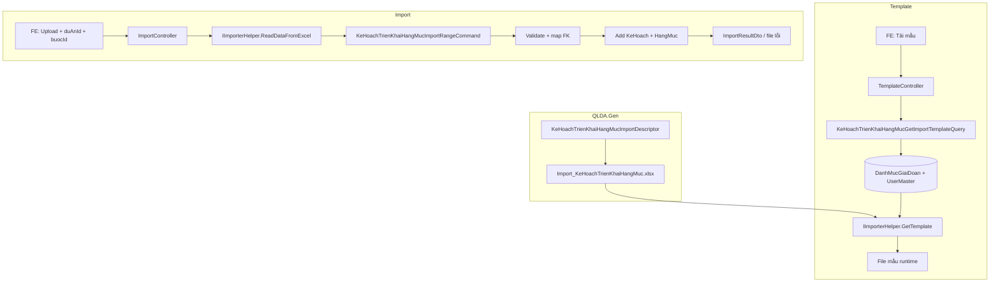

# PMIS #9469 — Tải mẫu & Import Kế hoạch triển khai hạng mục

**Document date:** June 26, 2026  
**Status:** 🚧 **IMPLEMENTED** (import + tải mẫu — June 26, 2026)  
**Module:** QLDA — `KeHoachTrienKhaiHangMuc`  
**Pattern tham chiếu:** `[task-excel-import-export-phan-khai-kinh-phi.md](../PhanKhaiKinhPhi/task-excel-import-export-phan-khai-kinh-phi.md)`, `[task-import-danh-sach-de-xuat-chu-truong-chuyen-tiep.md](../DeXuatChuyenTiep/task-import-danh-sach-de-xuat-chu-truong-chuyen-tiep.md)`, `[docs/issues/9579/report.md](../../issues/9579/report.md)`

**Mục lục:** [0. Trạng thái](#0-trạng-thái-hiện-tại) · [1. Tóm tắt BA](#1-tóm-tắt-nghiệp-vụ--test-cases) · [2. Khảo sát source](#2-khảo-sát-source-đã-xác-minh) · [3. Kiến trúc](#3-kiến-trúc-tổng-thể) · [4. Template](#4-phần-i--tải-mẫu-excel) · [4.0 Format Excel](#40-định-dạng-excel-căn-lề-màu-chữ-in-đậm-in-nghiêng) · [5. Import](#5-phần-ii--import-excel) · [6. Test plan](#6-test-plan-theo-ba-cases) · [7. Checklist](#7-checklist-nghiệm-thu) · [8. Commit](#8-thứ-tự-commit-đề-xuất)

---

## 0. Trạng thái hiện tại


| Hạng mục                         | Trạng thái  | Ghi chú                                                 |
| -------------------------------- | ----------- | ------------------------------------------------------- |
| Export Excel KH triển khai       | ✅ Done      | `GET /api/print/ke-hoach-trien-khai-hang-muc`           |
| QLDA.Gen export descriptor       | ✅ Done      | `KeHoachTrienKhaiHangMucExportDescriptor`               |
| Template import Excel            | ✅ Done      | `Import_KeHoachTrienKhaiHangMuc.xlsx`                   |
| API tải mẫu import               | ✅ Done      | `GET /api/template/import-ke-hoach-trien-khai-hang-muc` |
| API import                       | ✅ Done      | `POST /api/import/ke-hoach-trien-khai-hang-muc`         |
| Application Command/Query import | ✅ Done      |                                                         |
| Integration test import          | ✅ Done      | 3 tests HTTP                                            |
| Migration                        | ✅ Không cần | Entity đã có đủ field                                   |


---

## 1. Tóm tắt nghiệp vụ & test cases

### 1.1 Mô tả

Bổ sung **tải file mẫu Excel** và **import Kế hoạch triển khai hạng mục** trên tab tiến độ dự án.

Mỗi dòng Excel mô tả **một hạng mục công việc** (`HangMucKeHoach`) kèm thông tin tờ trình (`KeHoachTrienKhaiHangMuc`: Số tờ trình, Ngày trình, Trích yếu).

### 1.2 Mapping BA cases → kỹ thuật


| Case BA    | Yêu cầu                                                  | Giải pháp đề xuất                                                                                             |
| ---------- | -------------------------------------------------------- | ------------------------------------------------------------------------------------------------------------- |
| **Case 1** | Tải mẫu, đủ 11 cột, dropdown đúng loại                   | `GET /api/template/import-ke-hoach-trien-khai-hang-muc` + QLDA.Gen                                            |
| **Case 2** | Dropdown cán bộ lọc theo `DonViID` user đăng nhập        | Query `UserMaster` với `DonViId == IUserProvider.Info.DonViID`; **cùng nguồn** cho `$cbo2` và `$cbo3`         |
| **Case 3** | Dropdown giai đoạn + map `GiaiDoanId` khi import         | Combo từ `DanhMucGiaiDoan`; import map `Ten` → `Id`, lỗi nếu không khớp                                       |
| **Case 4** | Import hợp lệ, map FK đúng                               | `ImportRangeCommand` insert parent + child                                                                    |
| **Case 5** | Import lỗi: không insert dòng lỗi, trả file/ message lỗi | Pattern `PhanKhaiKinhPhiImportRangeCommand` + **mở rộng** file Excel lỗi (xem [5.5](#55-xử-lý-lỗi--file-lỗi)) |
| **Case 6** | Controller mỏng, logic ở Application                     | Query/Command MediatR, không model WebApi mới                                                                 |


### 1.3 Cột file mẫu (BA)


| #   | Header Excel        | Bắt buộc import | Ghi chú                                     |
| --- | ------------------- | --------------- | ------------------------------------------- |
| 1   | Tên hạng mục        | ✅               | Text                                        |
| 2   | Giai đoạn           | ✅               | Dropdown `$cbo1` — `DanhMucGiaiDoan`        |
| 3   | Cán bộ chủ trì      | ✅               | Dropdown `$cbo2` — user theo đơn vị         |
| 4   | Cán bộ phối hợp     | ❌               | Dropdown `$cbo3` — **cùng rule** `$cbo2`    |
| 5   | Ngày bắt đầu        | ❌               | `dd/MM/yyyy`                                |
| 6   | Ngày kết thúc       | ❌               | `dd/MM/yyyy`                                |
| 7   | Kinh phí            | ❌               | Số nguyên ≥ 0                               |
| 8   | Thời hạn hoàn thành | ❌               | `dd/MM/yyyy` (entity `DateOnly? ThoiHan`)   |
| 9   | Tờ trình            | ✅               | Map → `KeHoachTrienKhaiHangMuc.So`          |
| 10  | Ngày trình          | ❌               | Map → `KeHoachTrienKhaiHangMuc.NgayToTrinh` |
| 11  | Trích yếu           | ❌               | Map → `KeHoachTrienKhaiHangMuc.TrichYeu`    |


> **Lưu ý:** Export hiện tại hiển thị `ThoiHan` là **số ngày** tính từ ngày bắt đầu/kết thúc (`KeHoachTrienKhaiHangMucExportMapper.CalcThoiHan`). DB/entity lưu `DateOnly?`. Import theo **entity** — nhập ngày `dd/MM/yyyy`, không nhập số ngày.

> **Định dạng Excel (căn lề / màu / đậm / nghiêng):** Xem chi tiết [mục 4.0](#40-định-dạng-excel-căn-lề-màu-chữ-in-đậm-in-nghiêng) — đồng bộ visual với export `KeHoachTrienKhaiHangMuc.xlsx`.

---

## 2. Khảo sát source (đã xác minh)

### 2.1 Entity & quan hệ

```text
KeHoachTrienKhaiHangMuc (parent — 1 tờ trình)
├── DuAnId              Guid          ← Form import (không có trong Excel)
├── BuocId              int?          ← Form import
├── So                  string        ← Excel "Tờ trình"
├── NgayToTrinh         DateTimeOffset? ← Excel "Ngày trình"
├── TrichYeu            string?       ← Excel "Trích yếu"
├── TrangThaiId         int?          ← Auto Dự thảo (DT)
└── DanhSachHangMuc[]   HangMucKeHoach (child — 1 dòng Excel = 1 hạng mục)
    ├── TenHangMuc      string        ← "Tên hạng mục"
    ├── GiaiDoanId      int?          ← map từ "Giai đoạn"
    ├── CanBoChuTriId   long?         ← map từ "Cán bộ chủ trì" (UserMaster.Id)
    ├── CanBoPhoiHopIds List<long>?   ← map từ "Cán bộ phối hợp" → [id] nếu có 1 người
    ├── NgayBatDau      DateOnly?
    ├── NgayKetThuc     DateOnly?
    ├── ThoiHan         DateOnly?
    └── KinhPhi         long?
```

**File tham chiếu:**


| Thành phần          | Vị trí                                                                                |
| ------------------- | ------------------------------------------------------------------------------------- |
| Entity parent       | `QLDA.Domain/Entities/KeHoachTrienKhaiHangMuc.cs`                                     |
| Entity child        | `QLDA.Domain/Entities/HangMucKeHoach.cs`                                              |
| Insert              | `QLDA.Application/.../KeHoachTrienKhaiHangMucInsertCommand.cs`                        |
| Update + Sync child | `QLDA.Application/.../KeHoachTrienKhaiHangMucUpdateCommand.cs`                        |
| Mapping             | `QLDA.Application/.../KeHoachTrienKhaiHangMucMappings.cs`                             |
| Export (đã có)      | `KeHoachTrienKhaiHangMucGetExportQuery` + `PrintController.InKeHoachTrienKhaiHangMuc` |


### 2.2 API hiện có


| API           | Route                                         | Ghi chú                             |
| ------------- | --------------------------------------------- | ----------------------------------- |
| CRUD          | `api/ke-hoach-trien-khai-hang-muc`            | `KeHoachTrienKhaiHangMucController` |
| Danh sách tab | `GET .../danh-sach-tien-do`                   | Filter `duAnId`, `buocId`           |
| Export        | `GET /api/print/ke-hoach-trien-khai-hang-muc` | Đã implement #9469 (phần export)    |


### 2.3 API mới (đề xuất)


| API                                                 | Method | Mục đích                                  |
| --------------------------------------------------- | ------ | ----------------------------------------- |
| `/api/template/import-ke-hoach-trien-khai-hang-muc` | GET    | Tải mẫu + fill dropdown runtime           |
| `/api/import/ke-hoach-trien-khai-hang-muc`          | POST   | Upload Excel + `duAnId` + `buocId` (form) |


### 2.4 Pattern import có sẵn


| Thành phần                             | Vị trí                                                   | Dùng cho task này                |
| -------------------------------------- | -------------------------------------------------------- | -------------------------------- |
| `IImporterHelper.GetTemplate`          | `BuildingBlocks.Infrastructure/Offices/ExcelImporter.cs` | Fill combo sheet                 |
| `IImporterHelper.ReadDataFromExcel<T>` | Cùng file                                                | Đọc Excel Table                  |
| `PhanKhaiKinhPhiImportRangeCommand`    | Gom lỗi theo dòng, partial success                       | **Pattern chính** cho validation |
| `DeXuatChuyenTiepImportRangeCommand`   | `duAnId` + `buocId` qua form                             | Context tab tiến độ              |
| QLDA.Gen `GenerateImportTemplate`      | `PhanKhaiKinhPhiImportDescriptor`                        | Sinh `Import_*.xlsx`             |


### 2.5 Cơ chế đọc Excel (bắt buộc tuân thủ)


| Quy ước         | Chi tiết                                                           |
| --------------- | ------------------------------------------------------------------ |
| Sheet           | Index `0`                                                          |
| Bảng            | **Excel Table** (`ListObject`) bắt buộc                            |
| Header          | Dòng 1 trong table                                                 |
| Mô tả           | Dòng 2 (bỏ qua khi đọc)                                            |
| Dữ liệu         | Từ `startRow + 2`                                                  |
| Map cột         | **Thứ tự property trong DTO = thứ tự cột** (không theo tên header) |
| `[Description]` | Chỉ dùng cho message lỗi                                           |
| `[Required]`    | `ReadDataFromExcel` throw khi ô trống                              |


> ⚠️ Xem `[docs/issues/9579/report.md](../../issues/9579/report.md)` — map theo **vị trí cột**, không theo tên.

### 2.6 Dropdown user theo đơn vị (Case 2)

**Rule BA:**

```sql
SELECT * FROM dbo.USER_MASTER WHERE DonViID = currentUser.DonViId
```

**Implementation đề xuất** (đồng bộ `UserMasterGetDanhSachQuery`):

```csharp
var donViId = _userProvider.Info?.DonViID;

var danhSachCanBo = await _userRepo.GetQueryableSet()
    .AsNoTracking()
    .Where(e => e.LaDonViChinh == true)          // giống combobox form hiện tại
    .WhereIf(donViId > 0, e => e.DonViId == donViId)
    .Select(e => new ComboData {
        Name = e.HoTen ?? string.Empty,
        Id = e.Id.ToString(),                    // UserMaster.Id — khớp CanBoChuTriId trong DB
    })
    .ToListAsync(cancellationToken);
```


| Combo           | Placeholder | `comboData` index | Nguồn                                                |
| --------------- | ----------- | ----------------- | ---------------------------------------------------- |
| Giai đoạn       | `$cbo1`     | `[0]`             | `DanhMucGiaiDoan.GetQueryableSet()` → `Ten`          |
| Cán bộ chủ trì  | `$cbo2`     | `[1]`             | `UserMaster` lọc `DonViId`                           |
| Cán bộ phối hợp | `$cbo3`     | `[2]`             | **Cùng list** `[1]` — copy reference hoặc cùng query |


**Không được:**

- Load toàn bộ user hệ thống
- Load user đơn vị khác
- Dùng nguồn khác nhau cho 2 dropdown cán bộ

### 2.7 Map FK khi import


| Cột Excel (text từ dropdown) | Lookup                                     | Field DB                                           |
| ---------------------------- | ------------------------------------------ | -------------------------------------------------- |
| Giai đoạn                    | `DanhMucGiaiDoan.Ten` (exact, trim)        | `HangMucKeHoach.GiaiDoanId`                        |
| Cán bộ chủ trì               | `UserMaster.HoTen` trong phạm vi `DonViId` | `HangMucKeHoach.CanBoChuTriId` = `UserMaster.Id`   |
| Cán bộ phối hợp              | Tương tự                                   | `CanBoPhoiHopIds = [userId]` (1 người) hoặc `null` |


**Edge case — trùng `HoTen` trong cùng đơn vị:** Báo lỗi `"Cán bộ chủ trì không xác định (trùng tên)"` thay vì chọn bừa.

### 2.8 Context form (không có trong Excel)

Giống `import/de-xuat-chu-truong-chuyen-tiep`:


| Field    | Nguồn                 | Bắt buộc |
| -------- | --------------------- | -------- |
| `duAnId` | `multipart/form-data` | ✅        |
| `buocId` | `multipart/form-data` | ✅        |


Tab tiến độ luôn biết dự án/bước hiện tại — **không** đưa vào Excel.

### 2.9 Quy tắc gom dòng → insert DB

**Đề xuất (cần xác nhận BA khi implement):**

```text
1. Validate từng dòng Excel (không throw cả file)
2. Group các dòng HỢP LỆ theo key: (So, NgayTrinh, TrichYeu)
   → Mỗi group = 1 KeHoachTrienKhaiHangMuc
   → Mỗi dòng trong group = 1 HangMucKeHoach
3. Nếu chỉ 1 tờ trình trong file → 1 parent, N children
4. Trạng thái parent: Ma = "DT", Loai = PheDuyetEntityNames.DeXuatMacDinhStt
   (giống KeHoachTrienKhaiHangMucInsertCommand)
5. Authorization: EnsureCanExecuteStepAsync(buocId) trước khi insert
6. SaveChanges 1 lần sau khi add tất cả entity hợp lệ
```

**Phương án đơn giản hơn (nếu BA chỉ import 1 tờ trình/lần):** Luôn tạo **1** `KeHoachTrienKhaiHangMuc` với `So`/`NgayTrinh`/`TrichYeu` lấy từ **dòng đầu hợp lệ**; các dòng sau chỉ thêm hạng mục nếu cùng tờ trình, ngược lại báo lỗi.

> **Khuyến nghị:** Dùng **group theo `So`** — khớp nghiệp vụ nhiều hạng mục / 1 tờ trình.

### 2.10 Đơn vị kinh phí


| Tầng                        | Quy tắc                                              |
| --------------------------- | ---------------------------------------------------- |
| DB `HangMucKeHoach.KinhPhi` | `long?` — đồng, không quy đổi                        |
| Import Excel                | `long?` — nhập số thuần, format `#,##0` chỉ hiển thị |


---

## 3. Kiến trúc tổng thể

### 3.1 Sơ đồ luồng




### 3.2 Case 6 — phân tầng (bắt buộc)


| Tầng                    | Trách nhiệm                                                              | Không làm                                |
| ----------------------- | ------------------------------------------------------------------------ | ---------------------------------------- |
| **WebApi Controller**   | Nhận file/form → `Mediator.Send` → trả `FileContentResult` / `ResultApi` | Không query DB, không validate nghiệp vụ |
| **Application Query**   | `KeHoachTrienKhaiHangMucGetImportTemplateQuery` — build `comboData`      |                                          |
| **Application Command** | `KeHoachTrienKhaiHangMucImportRangeCommand` — validate, map, insert      |                                          |
| **Application DTO**     | `KeHoachTrienKhaiHangMucImportDto`, `ImportResultDto`                    |                                          |
| **QLDA.Gen**            | Sinh template `.xlsx`                                                    |                                          |
| **WebApi Models**       | ❌ Không tạo model import mới                                             | Dùng DTO Application                     |


### 3.3 Vị trí file sau khi implement

```text
QLDA.Gen/
└── Descriptors/
    └── KeHoachTrienKhaiHangMucImportDescriptor.cs    [MỚI]

QLDA.Application/
└── KeHoachTrienKhaiHangMuc/
    ├── DTOs/
    │   ├── KeHoachTrienKhaiHangMucImportDto.cs       [MỚI]
    │   └── KeHoachTrienKhaiHangMucImportResultDto.cs [MỚI]
    ├── Queries/
    │   └── KeHoachTrienKhaiHangMucGetImportTemplateQuery.cs [MỚI]
    └── Commands/
        └── KeHoachTrienKhaiHangMucImportRangeCommand.cs     [MỚI]

QLDA.WebApi/
├── Controllers/
│   ├── TemplateController.cs                         [+endpoint mỏng]
│   └── ImportController.cs                           [+endpoint mỏng]
└── PrintTemplates/
    └── Import_KeHoachTrienKhaiHangMuc.xlsx             [CODEGEN]

QLDA.Tests/Integration/
└── KeHoachTrienKhaiHangMucImportTests.cs             [MỚI]
```

---

## 4. Phần I — Tải mẫu Excel

### 4.0 Định dạng Excel (căn lề, màu chữ, in đậm, in nghiêng)

Import template dùng **cùng họ visual** với export `KeHoachTrienKhaiHangMuc.xlsx` (`LetterheadImportWithCombo` + `KeHoachTrienKhaiHangMucExportDescriptor`).

#### 4.0.1 Hằng số màu & font (QLDA.Gen)


| Token            | Giá trị           | Dùng cho                                                  |
| ---------------- | ----------------- | --------------------------------------------------------- |
| Font             | `Times New Roman` | Toàn workbook                                             |
| Cỡ chữ thường    | `11`              | Hint, mô tả, dòng nhập                                    |
| Cỡ tiêu đề       | `16`              | Row 3 — title                                             |
| Nền xám          | `#C8C8C8`         | Hint row 4, description row 6                             |
| Nền xanh header  | `#D9E1F2`         | Header row 5 (khớp `KeHoachTrienKhaiHangMucExportStyler`) |
| Màu chữ mặc định | `#000000`         | Dòng nhập liệu                                            |
| Màu chữ bắt buộc | `#C00000`         | Description cột bắt buộc (`Bắt buộc`)                     |
| Màu chữ gợi ý    | `#595959`         | Description cột tùy chọn                                  |


#### 4.0.2 Định dạng theo vùng (layout import)


| Vùng                                  | Row | Căn ngang                                        | In đậm | In nghiêng | Màu chữ                            | Nền            |
| ------------------------------------- | --- | ------------------------------------------------ | ------ | ---------- | ---------------------------------- | -------------- |
| Letterhead trái/phải                  | 1–2 | **Giữa**                                         | ✅      | ❌          | Đen                                | Trắng          |
| Tiêu đề `MẪU IMPORT…`                 | 3   | **Giữa**                                         | ✅      | ❌          | Đen                                | Trắng          |
| Hint (dòng gợi ý)                     | 4   | Trái                                             | ❌      | ✅          | `#595959`                          | Xám            |
| **Header cột** (tên cột)              | 5   | Theo cột ([4.0.3](#403-bảng-định-dạng-từng-cột)) | ✅      | ❌          | Đen                                | Xanh `#D9E1F2` |
| **Description** (gợi ý nhập)          | 6   | Theo cột                                         | ❌      | ✅          | Đỏ nếu bắt buộc / xám nếu tùy chọn | Xám            |
| **Dòng nhập** (data + user nhập thêm) | 7+  | Theo cột                                         | ❌      | ❌          | Đen                                | Trắng          |


#### 4.0.3 Bảng định dạng từng cột

> Căn lề áp dụng cho **header (row 5)** và **dòng nhập (row 7+)**. Description row 6 luôn **căn trái** + *in nghiêng*.


| #   | Cột                 | Căn lề (header & data) | Wrap text | Header in đậm | Description                     | Data row          |
| --- | ------------------- | ---------------------- | --------- | ------------- | ------------------------------- | ----------------- |
| 1   | Tên hạng mục        | **Trái**               | ✅         | ✅             | *Bắt buộc* — đỏ                 | Trái, thường      |
| 2   | Giai đoạn           | **Trái**               | ❌         | ✅             | *Chọn từ danh mục* — đỏ         | Trái, thường      |
| 3   | Cán bộ chủ trì      | **Trái**               | ✅         | ✅             | *Chọn từ danh sách đơn vị* — đỏ | Trái, thường      |
| 4   | Cán bộ phối hợp     | **Trái**               | ✅         | ✅             | *Tùy chọn* — xám                | Trái, thường      |
| 5   | Ngày bắt đầu        | **Giữa**               | ❌         | ✅             | *dd/MM/yyyy* — xám              | Giữa, format ngày |
| 6   | Ngày kết thúc       | **Giữa**               | ❌         | ✅             | *dd/MM/yyyy* — xám              | Giữa, format ngày |
| 7   | Kinh phí            | **Phải**               | ❌         | ✅             | *Số ≥ 0 (đồng)* — xám           | Phải, `#,##0`     |
| 8   | Thời hạn hoàn thành | **Giữa**               | ❌         | ✅             | *dd/MM/yyyy* — xám              | Giữa, format ngày |
| 9   | Tờ trình            | **Trái**               | ❌         | ✅             | *Bắt buộc* — đỏ                 | Trái, thường      |
| 10  | Ngày trình          | **Giữa**               | ❌         | ✅             | *dd/MM/yyyy* — xám              | Giữa, format ngày |
| 11  | Trích yếu           | **Trái**               | ✅         | ✅             | *Tùy chọn* — xám                | Trái, thường      |


**Đối chiếu export** (`KeHoachTrienKhaiHangMucExportDescriptor`):


| Import cột                      | Export cột tương ứng         | Căn lề export |
| ------------------------------- | ---------------------------- | ------------- |
| Tên hạng mục                    | Hạng mục công việc           | Trái + wrap   |
| Giai đoạn                       | Giai đoạn                    | Trái          |
| Cán bộ chủ trì / phối hợp       | Cán bộ chủ trì / phối hợp    | Trái + wrap   |
| Ngày bắt đầu / kết thúc / trình | Thời gian bắt đầu / kết thúc | Giữa          |
| Kinh phí                        | kinh phí                     | Phải          |
| Thời hạn hoàn thành             | Thời hạn                     | Giữa          |
| Trích yếu                       | — (chỉ import)               | Trái + wrap   |


#### 4.0.4 Mở rộng `ImportColumn` (QLDA.Gen)

`ImportColumn` hiện chỉ có `Width` / `NumberFormat`. Cần bổ sung metadata giống `ExportColumn`:

**File:** `QLDA.Gen/Metadata/ImportColumn.cs`

```csharp
namespace QLDA.Gen.Metadata;

public class ImportColumn {
    public string Header { get; set; } = "";
    public string? Description { get; set; }
    public string? Placeholder { get; set; }
    public int? ComboIndex { get; set; }
    public int Width { get; set; } = 18;
    public string? NumberFormat { get; set; }

    /// <summary>Căn ngang header + dòng nhập. Default: Left.</summary>
    public ColumnAlign HorizontalAlign { get; set; } = ColumnAlign.Left;

    /// <summary>Wrap text dòng nhập (cột text dài).</summary>
    public bool WrapText { get; set; }

    /// <summary>Cột bắt buộc → description màu đỏ.</summary>
    public bool Required { get; set; }

    /// <summary>Màu chữ description tùy chọn. Default: #595959 hoặc #C00000 nếu Required.</summary>
    public string? DescriptionFontColor { get; set; }
}
```

**Cập nhật `TemplateGenerator.BuildImportWorksheet`:**

```csharp
// Header row 5
headerCell.Style.Font.SetBold(true);
headerCell.Style.Alignment.SetHorizontal(ToHorizontalAlignment(col.HorizontalAlign));

// Description row 6
descCell.Style.Font.SetItalic(true);
descCell.Style.Alignment.SetHorizontal(XLAlignmentHorizontalValues.Left);
var descColor = col.Required ? "#C00000" : (col.DescriptionFontColor ?? "#595959");
descCell.Style.Font.SetFontColor(XLColor.FromHtml(descColor));

// Value / data row 7+
valueCell.Style.Alignment.SetHorizontal(ToHorizontalAlignment(col.HorizontalAlign));
valueCell.Style.Alignment.WrapText = col.WrapText;
```

> `ToHorizontalAlignment` đã có sẵn trong `TemplateGenerator` (dùng cho export).

#### 4.0.5 Verify định dạng (manual)

- [ ] Header row 5: nền xanh `#D9E1F2`, chữ **in đậm**
- [ ] Description row 6: nền xám, chữ *in nghiêng*; cột bắt buộc màu đỏ
- [ ] Cột text dài (Tên hạng mục, Cán bộ, Trích yếu): căn **trái**, wrap
- [ ] Cột ngày: căn **giữa**, format `dd/MM/yyyy`
- [ ] Cột Kinh phí: căn **phải**, format `#,##0`
- [ ] Visual khớp export cùng module (cùng font Times New Roman, header xanh)

---

### 4.1 QLDA.Gen — Import descriptor

**File:** `QLDA.Gen/Descriptors/KeHoachTrienKhaiHangMucImportDescriptor.cs`

```csharp
using QLDA.Gen.Metadata;

namespace QLDA.Gen.Descriptors;

public class KeHoachTrienKhaiHangMucImportDescriptor : IImportDescriptor {
    public string EntityName => "Import kế hoạch triển khai hạng mục";
    public string TemplateFileName => "Import_KeHoachTrienKhaiHangMuc.xlsx";
    public string TableName => "KeHoachTrienKhaiHangMucImport";
    public string OutputPath { get; set; } = "";
    public string? Title => "MẪU IMPORT KẾ HOẠCH TRIỂN KHAI HẠNG MỤC";
    public string? HintText =>
        "Nhập dữ liệu vào bảng bên dưới. Giai đoạn / Cán bộ chọn từ danh sách. Ngày nhập dd/MM/yyyy.";

    public List<ImportColumn> Columns { get; } =
    [
        new() { Header = "Tên hạng mục", Description = "Bắt buộc", Width = 40,
            HorizontalAlign = ColumnAlign.Left, WrapText = true, Required = true },
        new() { Header = "Giai đoạn", Description = "Chọn từ danh mục", Placeholder = "$cbo1", ComboIndex = 1, Width = 22,
            HorizontalAlign = ColumnAlign.Left, Required = true },
        new() { Header = "Cán bộ chủ trì", Description = "Chọn từ danh sách đơn vị", Placeholder = "$cbo2", ComboIndex = 2, Width = 28,
            HorizontalAlign = ColumnAlign.Left, WrapText = true, Required = true },
        new() { Header = "Cán bộ phối hợp", Description = "Tùy chọn — cùng danh sách đơn vị", Placeholder = "$cbo3", ComboIndex = 3, Width = 28,
            HorizontalAlign = ColumnAlign.Left, WrapText = true },
        new() { Header = "Ngày bắt đầu", Description = "dd/MM/yyyy", NumberFormat = "dd/MM/yyyy", Width = 16,
            HorizontalAlign = ColumnAlign.Center },
        new() { Header = "Ngày kết thúc", Description = "dd/MM/yyyy", NumberFormat = "dd/MM/yyyy", Width = 16,
            HorizontalAlign = ColumnAlign.Center },
        new() { Header = "Kinh phí", Description = "Số ≥ 0 (đồng)", NumberFormat = "#,##0", Width = 18,
            HorizontalAlign = ColumnAlign.Right },
        new() { Header = "Thời hạn hoàn thành", Description = "dd/MM/yyyy", NumberFormat = "dd/MM/yyyy", Width = 16,
            HorizontalAlign = ColumnAlign.Center },
        new() { Header = "Tờ trình", Description = "Bắt buộc", Width = 18,
            HorizontalAlign = ColumnAlign.Left, Required = true },
        new() { Header = "Ngày trình", Description = "dd/MM/yyyy", NumberFormat = "dd/MM/yyyy", Width = 16,
            HorizontalAlign = ColumnAlign.Center },
        new() { Header = "Trích yếu", Description = "Tùy chọn", Width = 35,
            HorizontalAlign = ColumnAlign.Left, WrapText = true },
    ];
}
```

**Đăng ký slug** (`QLDA.Gen/Program.cs`):

```csharp
new("import-ke-hoach-trien-khai-hang-muc",
    g => g.GenerateImportTemplate(
        CreateImportDescriptor<KeHoachTrienKhaiHangMucImportDescriptor>(basePath))),
```

**Chạy codegen:**

```bash
cd QLDA.Gen
dotnet run -- import-ke-hoach-trien-khai-hang-muc --force ../QLDA.WebApi/PrintTemplates
```

### 4.2 Application — Query template data

**File:** `QLDA.Application/KeHoachTrienKhaiHangMuc/Queries/KeHoachTrienKhaiHangMucGetImportTemplateQuery.cs`

```csharp
public record KeHoachTrienKhaiHangMucGetImportTemplateQuery
    : IRequest<List<List<ComboData>>>;

// Handler:
// 1. DanhMucGiaiDoan → combo [0]
// 2. UserMaster (DonViId = current user) → combo [1]
// 3. combo [2] = cùng reference list [1]
```

> Logic lọc user **phải nằm trong Query**, không viết trong Controller.

### 4.3 WebApi — Template endpoint (mỏng)

```csharp
[HttpGet("import-ke-hoach-trien-khai-hang-muc")]
[ProducesResponseType<FileContentResult>(StatusCodes.Status200OK)]
public async Task<FileContentResult> GetImportKeHoachTrienKhaiHangMuc(
    CancellationToken cancellationToken = default) {
    const string fileNameTemplate = "Import_KeHoachTrienKhaiHangMuc.xlsx";
    var templatePath = Path.Combine(AppContext.BaseDirectory, "PrintTemplates", fileNameTemplate);

    var comboData = await Mediator.Send(
        new KeHoachTrienKhaiHangMucGetImportTemplateQuery(), cancellationToken);

    var importResult = _excelImporter.GetTemplate(templatePath, comboData);

    return new FileContentResult(importResult.FileBytes, importResult.ContentType) {
        FileDownloadName = fileNameTemplate,
    };
}
```

### 4.4 Verify template (Case 1)

- [ ] File có Excel Table `KeHoachTrienKhaiHangMucImport`
- [ ] Đúng **11 cột** theo thứ tự trên
- [ ] Cột A text (Tên hạng mục)
- [ ] Cột B/C/D có validation list sau khi gọi API
- [ ] Dropdown cán bộ chỉ user cùng `DonViID` (test với user Kế hoạch tài chính / Ban giám đốc)
- [ ] Định dạng theo [mục 4.0](#40-định-dạng-excel-căn-lề-màu-chữ-in-đậm-in-nghiêng): căn trái/giữa/phải, header **đậm** nền xanh, description *nghiêng*, cột bắt buộc màu đỏ

---

## 5. Phần II — Import Excel

### 5.1 Import DTO (thứ tự property = thứ tự cột)

**File:** `QLDA.Application/KeHoachTrienKhaiHangMuc/DTOs/KeHoachTrienKhaiHangMucImportDto.cs`

```csharp
using System.ComponentModel;
using System.ComponentModel.DataAnnotations;

namespace QLDA.Application.KeHoachTrienKhaiHangMucs.DTOs;

public class KeHoachTrienKhaiHangMucImportDto {
    [Required]
    [Description("Tên hạng mục")]
    public string? TenHangMuc { get; set; }

    [Required]
    [Description("Giai đoạn")]
    public string? TenGiaiDoan { get; set; }

    [Required]
    [Description("Cán bộ chủ trì")]
    public string? TenCanBoChuTri { get; set; }

    [Description("Cán bộ phối hợp")]
    public string? TenCanBoPhoiHop { get; set; }

    [Description("Ngày bắt đầu")]
    public DateOnly? NgayBatDau { get; set; }

    [Description("Ngày kết thúc")]
    public DateOnly? NgayKetThuc { get; set; }

    [Description("Kinh phí")]
    public long? KinhPhi { get; set; }

    [Description("Thời hạn hoàn thành")]
    public DateOnly? ThoiHan { get; set; }

    [Required]
    [Description("Tờ trình")]
    public string? So { get; set; }

    [Description("Ngày trình")]
    public DateTimeOffset? NgayTrinh { get; set; }

    [Description("Trích yếu")]
    public string? TrichYeu { get; set; }

    /// <summary>Số dòng Excel — gán ở Controller, không map từ file</summary>
    public int ExcelRowNumber { get; set; }

    /// <summary>Message lỗi — dùng khi xuất file lỗi</summary>
    public string? ErrorMessage { get; set; }
}
```

### 5.2 Import Result DTO

```csharp
public class KeHoachTrienKhaiHangMucImportResultDto {
    public int SuccessCount { get; set; }
    public int ErrorCount { get; set; }
    public List<string> Errors { get; set; } = [];
    public byte[]? ErrorFileBytes { get; set; }
    public string? ErrorFileName { get; set; }
}
```

### 5.3 Import Command

```csharp
public record KeHoachTrienKhaiHangMucImportRangeCommand(
    List<KeHoachTrienKhaiHangMucImportDto> Imports,
    Guid DuAnId,
    int BuocId) : IRequest<KeHoachTrienKhaiHangMucImportResultDto>;
```

**Luồng handler:**

```text
1. EnsureCanExecuteStepAsync(BuocId)
2. Preload dictionaries:
   - TenGiaiDoan → GiaiDoanId (DanhMucGiaiDoan)
   - TenCanBo → UserMaster.Id (filter DonViId = current user)
3. foreach dòng (bỏ qua dòng trống):
   a. Validate bắt buộc: TenHangMuc, TenGiaiDoan, TenCanBoChuTri, So
   b. Map GiaiDoanId — lỗi: "Không tìm thấy giai đoạn"
   c. Map CanBoChuTriId — lỗi: "Không tìm thấy cán bộ chủ trì" / "không thuộc đơn vị"
   d. Map CanBoPhoiHopIds (optional)
   e. Validate KinhPhi >= 0
   f. Validate ngày (đã parse hoặc báo "định dạng ngày không hợp lệ")
   g. Lỗi → Errors.Add("Dòng {n}: ..."), ErrorCount++, continue
4. Group dòng hợp lệ theo (So, NgayTrinh, TrichYeu)
5. Mỗi group → KeHoachTrienKhaiHangMuc + DanhSachHangMuc
6. SaveChangesAsync (1 lần)
7. Return ImportResultDto
```

**Format message lỗi:**

```text
Dòng 7: Tên hạng mục bắt buộc
Dòng 8: Không tìm thấy giai đoạn
Dòng 9: Không tìm thấy cán bộ chủ trì
Dòng 10: Kinh phí không hợp lệ
```

### 5.4 WebApi — Import endpoint (mỏng)

```csharp
[HttpPost("ke-hoach-trien-khai-hang-muc")]
[Consumes("multipart/form-data")]
public async Task<ResultApi> ImportKeHoachTrienKhaiHangMuc(
    CancellationToken cancellationToken = default) {
    var form = await Request.ReadFormAsync(cancellationToken);
    var file = form.Files.FirstOrDefault();

    if (file == null || file.Length == 0)
        return ResultApi.Fail("File không hợp lệ");

    _ = Guid.TryParse(form["duAnId"].FirstOrDefault(), out var duAnId);
    _ = int.TryParse(form["buocId"].FirstOrDefault(), out var buocId);

    if (duAnId == Guid.Empty || buocId <= 0)
        return ResultApi.Fail("Thiếu duAnId hoặc buocId");

    var rows = _excelImporter.ReadDataFromExcel<KeHoachTrienKhaiHangMucImportDto>(
        file.OpenReadStream());

    if (rows.Count == 0)
        return ResultApi.Fail("File không có dữ liệu");

    for (var i = 0; i < rows.Count; i++)
        rows[i].ExcelRowNumber = i + 7; // offset LetterheadImportWithCombo

    var result = await Mediator.Send(
        new KeHoachTrienKhaiHangMucImportRangeCommand(rows, duAnId, buocId),
        cancellationToken);

    if (result.ErrorCount > 0) {
        return new ResultApi {
            Result = false,
            ErrorMessage = string.Join("\n", result.Errors),
            DataResult = result,
        };
    }

    return ResultApi.Ok(result);
}
```

### 5.5 Xử lý lỗi & file lỗi

**Hiện trạng codebase:** `PhanKhaiKinhPhi` trả JSON `Errors[]` — **chưa có** file Excel lỗi chuẩn.

**Yêu cầu BA (Case 5):** Trả file lỗi ghi rõ lỗi từng dòng/cột.

**Đề xuất implement (mở rộng pattern PhanKhaiKinhPhi):**

```text
1. Giữ partial success: chỉ insert dòng hợp lệ
2. Khi ErrorCount > 0:
   a. Copy workbook upload (hoặc template gốc + data rows)
   b. Thêm cột "Lỗi" (cột L) — ghi ErrorMessage từng dòng
   c. Set ImportResultDto.ErrorFileBytes + ErrorFileName =
      "Loi_Import_KeHoachTrienKhaiHangMuc_yyyyMMdd_HHmmss.xlsx"
3. FE: nếu DataResult.ErrorFileBytes có → download file lỗi
   (hoặc endpoint riêng POST trả FileContentResult khi có lỗi — thống nhất với FE)
```

**Helper gợi ý:** Method mới trong `IImporterHelper` hoặc service Application `IImportErrorFileBuilder` — tránh logic Aspose trong Controller.

### 5.6 Validation chi tiết (Case 4 & 5)


| Trường          | Rule hợp lệ                   | Message lỗi                      |
| --------------- | ----------------------------- | -------------------------------- |
| Tên hạng mục    | Not empty                     | `Tên hạng mục bắt buộc`          |
| Giai đoạn       | Not empty + tồn tại DM        | `Không tìm thấy giai đoạn`       |
| Cán bộ chủ trì  | Not empty + user đơn vị       | `Không tìm thấy cán bộ chủ trì`  |
| Cán bộ phối hợp | Optional + user đơn vị nếu có | `Không tìm thấy cán bộ phối hợp` |
| Tờ trình        | Not empty                     | `Tờ trình bắt buộc`              |
| Ngày *          | Parse được `dd/MM/yyyy`       | `Ngày ... không hợp lệ`          |
| Kinh phí        | `null` hoặc `>= 0`            | `Kinh phí không hợp lệ`          |


---

## 6. Test plan (theo BA cases)

### 6.1 Integration tests

**File:** `QLDA.Tests/Integration/KeHoachTrienKhaiHangMucImportTests.cs`


| #   | Test                                                                    | Case BA   |
| --- | ----------------------------------------------------------------------- | --------- |
| 1   | `GET template/import-ke-hoach-trien-khai-hang-muc` → 200, xlsx          | Case 1    |
| 2   | Template có Excel Table 11 cột                                          | Case 1    |
| 3   | Combo cán bộ chỉ chứa user cùng `DonViId`                               | Case 2    |
| 4   | Import hợp lệ → `SuccessCount > 0`, DB có `GiaiDoanId`, `CanBoChuTriId` | Case 4    |
| 5   | Import thiếu Tên hạng mục → lỗi, không insert                           | Case 5    |
| 6   | Import giai đoạn không tồn tại → lỗi dòng                               | Case 3, 5 |
| 7   | Import cán bộ khác đơn vị → lỗi                                         | Case 5    |
| 8   | Import ngày sai format → lỗi                                            | Case 5    |
| 9   | Import kinh phí âm / text → lỗi                                         | Case 5    |
| 10  | File hỗn hợp đúng + sai → chỉ insert dòng đúng                          | Case 5    |
| 11  | `dotnet build` không warning/error mới                                  | Case 6    |


**Chạy test:**

```bash
dotnet test QLDA.Tests/QLDA.Tests.csproj --filter "FullyQualifiedName~KeHoachTrienKhaiHangMucImport"
```

### 6.2 Manual QA checklist


| Case | Bước kiểm tra                                                                                                                       |
| ---- | ----------------------------------------------------------------------------------------------------------------------------------- |
| 1    | Tải mẫu → mở Excel → đủ 11 cột, 3 dropdown, căn lề/đậm/nghiêng/màu đúng [4.0](#40-định-dạng-excel-căn-lề-màu-chữ-in-đậm-in-nghiêng) |
| 2    | Đăng nhập user phòng Kế hoạch TC / BGĐ → dropdown cán bộ không có user đơn vị khác                                                  |
| 3    | Chọn giai đoạn từ dropdown → import → `GiaiDoanId` đúng; nhập text sai → báo lỗi                                                    |
| 4    | Import file mẫu điền đủ → kiểm tra DB / màn danh sách                                                                               |
| 5    | Các file lỗi → không insert dòng lỗi, có message/file lỗi                                                                           |
| 6    | Review PR: Controller < 30 dòng logic, không model WebApi import                                                                    |


---

## 7. Checklist nghiệm thu


| #   | Tiêu chí                      | Cách kiểm tra                                                              |
| --- | ----------------------------- | -------------------------------------------------------------------------- |
| 1   | Tải mẫu OK                    | `GET /api/template/import-ke-hoach-trien-khai-hang-muc`                    |
| 2   | Đủ 11 cột + dropdown + format | Mở Excel — [mục 4.0](#40-định-dạng-excel-căn-lề-màu-chữ-in-đậm-in-nghiêng) |
| 3   | User dropdown theo đơn vị     | So sánh với query `USER_MASTER`                                            |
| 4   | Import hợp lệ                 | POST + kiểm tra `danh-sach-tien-do`                                        |
| 5   | Map FK đúng                   | SQL/EF: `GiaiDoanId`, `CanBoChuTriId`, `CanBoPhoiHopIds`                   |
| 6   | Import lỗi không insert       | File thiếu field / sai DM                                                  |
| 7   | File/message lỗi theo dòng    | Response / file `Loi_Import_*.xlsx`                                        |
| 8   | Kiến trúc đúng pattern        | Review Application layer                                                   |
| 9   | Không sửa migration           | `git diff QLDA.Migrator` rỗng                                              |
| 10  | Build sạch                    | `dotnet build`                                                             |


---

## 8. Thứ tự commit đề xuất


| Commit | Nội dung                                                                                                                                   |
| ------ | ------------------------------------------------------------------------------------------------------------------------------------------ |
| 1      | QLDA.Gen: mở rộng `ImportColumn` (align/wrap/required/color) + `BuildImportWorksheet` + descriptor + `Import_KeHoachTrienKhaiHangMuc.xlsx` |
| 2      | Application: Import DTO + `GetImportTemplateQuery`                                                                                         |
| 3      | Application: `ImportRangeCommand` + `ImportResultDto`                                                                                      |
| 4      | WebApi: `TemplateController` + `ImportController` (endpoint mỏng)                                                                          |
| 5      | (Optional) `IImportErrorFileBuilder` + file lỗi Excel                                                                                      |
| 6      | Tests integration                                                                                                                          |


> **Không có** thay đổi Domain / Persistence / Migrator.

---

## 9. Rủi ro & quyết định cần chốt


| #   | Chủ đề                            | Đề xuất                                                                                      | Cần xác nhận BA |
| --- | --------------------------------- | -------------------------------------------------------------------------------------------- | --------------- |
| 1   | Gom dòng → parent                 | Group theo `So` (+ NgayTrinh, TrichYeu)                                                      | ☐               |
| 2   | Cán bộ phối hợp                   | 1 dropdown → `CanBoPhoiHopIds = [id]`                                                        | ☐               |
| 3   | `UserMaster.Id` vs `UserPortalId` | Dùng `UserMaster.Id` (khớp export/DB)                                                        | ☐               |
| 4   | Filter `LaDonViChinh`             | Giữ giống combobox form                                                                      | ☐               |
| 5   | File lỗi Excel                    | Mở rộng mới (chưa có sẵn 100%)                                                               | ☐               |
| 6   | `ThoiHan` import                  | `DateOnly` dd/MM/yyyy (không phải số ngày như export)                                        | ☐               |
| 7   | Trùng `HoTen` user                | Báo lỗi, không auto-pick                                                                     | ☐               |
| 8   | Định dạng Excel import            | Mở rộng `ImportColumn` + `BuildImportWorksheet` ([4.0.4](#404-mở-rộng-importcolumn-qldagen)) | ☐               |


---

## 10. Tài liệu liên quan

- Export cùng issue: `PrintController.InKeHoachTrienKhaiHangMuc`, `KeHoachTrienKhaiHangMucExportDescriptor`
- `[task-excel-import-export-phan-khai-kinh-phi.md](../PhanKhaiKinhPhi/task-excel-import-export-phan-khai-kinh-phi.md)` — pattern import gom lỗi
- `[task-import-danh-sach-de-xuat-chu-truong-chuyen-tiep.md](../DeXuatChuyenTiep/task-import-danh-sach-de-xuat-chu-truong-chuyen-tiep.md)` — `duAnId`/`buocId` form
- `[docs/issues/9579/report.md](../../issues/9579/report.md)` — map cột theo index
- `[QLDA.WebApi/PrintTemplates/huong-dan.md](../../../QLDA.WebApi/PrintTemplates/huong-dan.md)` — Aspose template

