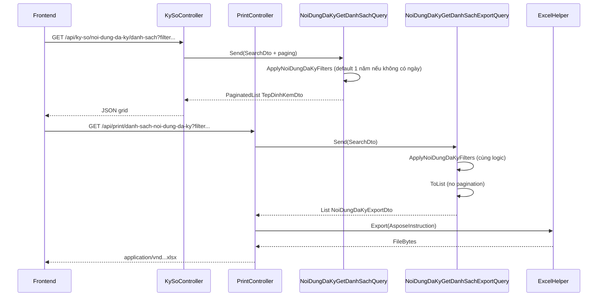

# Task – Export Excel tab Nội dung đã ký (Quản lý ký số)

**Ngày tạo:** 01/07/2026  
**Cập nhật:** 01/07/2026  
**Trạng thái:** ✅ **IMPLEMENTED v1.2** — đã code xong; tham chiếu **§12** + **§13 Changelog**  
**Module:** `KySo` / `TepDinhKem`  
**Màn hình:** `Quản lý ký số` → tab **Nội dung đã ký**  
**Pattern tham chiếu:**
- Danh sách: `NoiDungDaKyGetDanhSachQuery`, `NoiDungDaKySearchDto`
- Export flat (Aspose): `BanGiaoHoSoGetDanhSachExportQuery` + `PrintController.InDanhSachBanGiaoHoSo`
- Filter dùng chung: `BanGiaoHoSoQueryableExtensions.ApplyDanhSachFilters`
- Lọc theo dự án qua `GroupId`: `DuAnGetDanhSachTepDinhKemQuery`
- Doc nghiệp vụ ký số: [task-9460-noi-dung-da-ky.md](./task-9460-noi-dung-da-ky.md), [task-9460-danh-sach-noi-dung-da-ky.md](./task-9460-danh-sach-noi-dung-da-ky.md)

**Liên quan:** [task-export-excel-ban-giao-ho-so.md](../BanGiaoHoSo/task-export-excel-ban-giao-ho-so.md)

---

## Executive Summary

Bổ sung **xuất Excel danh sách nội dung đã ký** trên tab **Nội dung đã ký**, đồng thời **chuẩn hóa lại filter** của API danh sách để grid và export dùng **cùng một bộ điều kiện lọc**.

| Hạng mục | Mô tả |
|----------|--------|
| API export mới | `GET /api/print/danh-sach-noi-dung-da-ky` |
| API list (sửa) | `GET /api/ky-so/noi-dung-da-ky/danh-sach` — bổ sung filter + default 1 năm |
| Nguyên tắc | **Không** xuất/load toàn bộ dữ liệu khi không có khoảng thời gian hợp lệ |
| Default thời gian | **1 năm gần nhất** tính đến ngày hiện tại khi FE **không** truyền `tuNgay` / `denNgay` |

> **Đã implement** theo §12. Bổ sung sau khi code: `nguoiKyId`, format ngày `dd-MM-yyyy`, cột **Loại file** ngắt dòng Excel.

---

## 1. Hiện trạng source (sau implement)

### 1.1 API danh sách

```
GET /api/ky-so/noi-dung-da-ky/danh-sach
  ?nguoiKyId=
  &tuNgay=          ← dd-MM-yyyy | dd/MM/yyyy | yyyy-MM-dd (§2.6)
  &denNgay=
  &duAnId=
  &globalFilter=
  &pageIndex=
  &pageSize=
```

| Thành phần | File |
|------------|------|
| Controller | `QLDA.WebApi/Controllers/KySoController.cs` |
| Search DTO | `QLDA.Application/KySos/DTOs/NoiDungDaKySearchDto.cs` |
| Query handler | `QLDA.Application/KySos/Queries/NoiDungDaKyGetDanhSachQuery.cs` |
| Filter dùng chung | `QLDA.Application/KySos/Queries/NoiDungDaKyQueryableExtensions.cs` |
| Response DTO | `QLDA.Application/TepDinhKems/DTOs/TepDinhKemDto.cs` |
| Bind ngày query | `QLDA.WebApi/ModelBinding/DateOnlyVnModelBinder.cs` |

### 1.2 Trạng thái so với yêu cầu UI

| Yêu cầu | Trạng thái | Ghi chú |
|---------|------------|---------|
| Lọc `tuNgay` / `denNgay` | ✅ | Lọc theo `CreatedAt`; default 1 năm khi cả hai null |
| Default 1 năm gần nhất | ✅ | `ResolveDateRange` — list + export |
| Lọc `duAnId` | ✅ | Qua `DuAnTepDinhKemGroupIdResolver` → `GroupId IN (...)` |
| Ô tìm kiếm (keyword) | ✅ | `globalFilter` OR: Tên file / Tên gốc / Người tạo (in-memory sau join) |
| `GroupType` ký số | ✅ | `KySo` \| `NoiDungDaKySo` |
| Export Excel | ✅ | `GET /api/print/danh-sach-noi-dung-da-ky` |
| Format ngày VN | ✅ | `dd-MM-yyyy` trên query string (§2.6) |
| Filter người ký | ✅ | `nguoiKyId` → `CreatedBy` |

### 1.3 Cột hiển thị trên UI (tab Nội dung đã ký)

| Cột UI | Field response (`TepDinhKemDto`) | Export? |
|--------|----------------------------------|---------|
| STT | (index + 1) | ✅ |
| Tên file | `FileName` | ✅ |
| Tên gốc | `OriginalName` | ✅ |
| Loại file | `Type` | ✅ |
| Dung lượng | `Size` (format hiển thị) | ✅ |
| Người tạo | `TenNguoiTao` | ✅ |

**Placeholder ô tìm kiếm UI:** `Tên file, tên gốc, người tạo...` → map `globalFilter`.

### 1.4 Định nghĩa dữ liệu “nội dung đã ký”

Theo [task-9460-danh-sach-noi-dung-da-ky.md](./task-9460-danh-sach-noi-dung-da-ky.md):

| Điều kiện | Ý nghĩa |
|-----------|---------|
| `ParentId IS NOT NULL` | Chỉ bản tệp **đã ký** (con), không lấy file gốc |
| `GroupType IN ('KySo', 'NoiDungDaKySo')` | Cả bản hiện hành và lịch sử |
| `GetQueryableSet(OnlyNotDeleted: false)` | Bao gồm bản user ẩn thủ công (`IsDeleted = true`) |

---

## 2. Quy tắc filter (list + export dùng chung)

### 2.1 Khoảng thời gian (`CreatedAt`)

**Cột lọc:** `TepDinhKem.CreatedAt` (audit).

| Trường hợp | Xử lý |
|------------|--------|
| FE **không** truyền `tuNgay` **và** **không** truyền `denNgay` | Default: `[hôm nay - 1 năm, hôm nay]` |
| FE truyền một hoặc cả hai | Dùng giá trị được truyền; thiếu một đầu thì chỉ áp điều kiện đầu còn lại |

**Ví dụ** (hôm nay = `30/06/2026`, không truyền ngày):

```text
tuNgayEffective  = 30/06/2025
denNgayEffective = 30/06/2026

CreatedAt >= 30/06/2025 00:00:00 VN (→ UTC)
CreatedAt <= 30/06/2026 23:59:59 VN (→ UTC)
```

**Implementation thực tế** (trong `ApplyFiltersAsync`):

```csharp
// 1. Query DB: ParentId, GroupType, nguoiKyId, duAnId (không lọc CreatedAt trên SQL)
var files = await query
    .Where(e => e.ParentId != null)
    .Where(e => e.GroupType == GroupTypeConstants.KySo
             || e.GroupType == GroupTypeConstants.NoiDungDaKySo)
    .WhereIf(nguoiKyId != null, e => e.CreatedBy == nguoiKyId)
    .WhereIf(groupIds != null, e => groupIds!.Contains(e.GroupId))
    .ToListAsync(cancellationToken);

// 2. Lọc CreatedAt in-memory (tránh lỗi EF translate DateTimeOffset trên SQLite test)
if (tuNgay.HasValue)
    files = files.Where(e => e.CreatedAt >= tuNgay.Value.ToStartOfDayUtc()).ToList();
if (denNgay.HasValue)
    files = files.Where(e => e.CreatedAt <= denNgay.Value.ToEndOfDayUtc()).ToList();
```

> **Lưu ý:** Lọc ngày in-memory sau `ToListAsync` — chấp nhận được vì đã giới hạn `GroupType` ký số; đồng thời tương thích SQLite integration test.

> **Quan trọng:** Default 1 năm áp dụng **cả khi chỉ gọi list** (không chỉ export) để grid và Excel luôn khớp, và tránh load toàn bộ lịch sử ký số.

### 2.2 Dự án (`duAnId`)

| Param | Kiểu | Bắt buộc | Mô tả |
|-------|------|----------|-------|
| `duAnId` | `Guid?` | Không | Lọc file thuộc các đối tượng nghiệp vụ của dự án |

`TepDinhKem` **không** có cột `DuAnId`. `GroupId` = Id đối tượng nghiệp vụ (Gói thầu, Hợp đồng, …).

**Cách lọc:** Thu thập danh sách `GroupId` thuộc dự án → `WHERE GroupId IN (...)`.

Pattern tham chiếu: `DuAnGetDanhSachTepDinhKemQuery` (query Id từ ~15 bảng con có `DuAnId`, cộng thêm `duAnId` của chính dự án).

**Đề xuất refactor:** Tách helper dùng chung, ví dụ:

```
QLDA.Application/DuAns/Services/DuAnTepDinhKemGroupIdResolver.cs
  → Task<List<string>> ResolveGroupIdsAsync(Guid duAnId, CancellationToken ct)
```

Handler list/export gọi helper này khi `search.DuAnId.HasValue`.

### 2.3 Keyword (`globalFilter`)

| Trường search | Nguồn |
|---------------|--------|
| Tên file | `TepDinhKem.FileName` |
| Tên gốc | `TepDinhKem.OriginalName` |
| Người tạo | `UserMaster.HoTen` (sau join `CreatedBy` ↔ `UserPortalId`) |

**Đã implement** — OR 3 trường **in-memory** sau khi map user (không dùng `WhereGlobalFilter` trên SQL):

```csharp
rows = rows.Where(x =>
    (x.E.FileName != null && x.E.FileName.Contains(filterLower, StringComparison.OrdinalIgnoreCase))
    || (x.E.OriginalName != null && x.E.OriginalName.Contains(filterLower, StringComparison.OrdinalIgnoreCase))
    || (x.User?.HoTen != null && x.User.HoTen.Contains(filterLower, StringComparison.OrdinalIgnoreCase)));
```

### 2.4 `nguoiKyId`

Param trên `NoiDungDaKySearchDto` — **UserPortalId**, map `TepDinhKem.CreatedBy`:

```csharp
var nguoiKyId = search.NguoiKyId?.ToString();
// ...
.WhereIf(nguoiKyId != null, e => e.CreatedBy == nguoiKyId)
```

> **Breaking change:** tên cũ `createUserId` đã đổi thành `nguoiKyId` (rõ nghĩa nghiệp vụ “người ký”).

### 2.5 Filter cốt lõi (luôn áp dụng)

```csharp
var signedGroupTypes = new[] {
    GroupTypeConstants.KySo,
    GroupTypeConstants.NoiDungDaKySo
};

var query = _tepDinhKemRepository.GetQueryableSet(OnlyNotDeleted: false)
    .AsNoTracking()
    .Where(e => e.ParentId != null)
    .Where(e => signedGroupTypes.Contains(e.GroupType));
// + date range (§2.1)
// + duAnId via GroupId IN (§2.2)
// + nguoiKyId (§2.4)
// + globalFilter OR 3 trường in-memory (§2.3)
// → map UserMaster qua dictionary
// → OrderByDescending(CreatedAt)
```

### 2.6 Format ngày trên query string (`tuNgay` / `denNgay`)

**Binder:** `DateOnlyVnModelBinder` — đăng ký global trong `WebApiServiceExtensions.AddControllersWithJson()`.

**Định dạng chấp nhận** (`DateOnlyExtensions.VnQueryDateFormats`):

| Format | Ví dụ |
|--------|-------|
| `dd-MM-yyyy` | `01-07-2025` (**khuyến nghị FE**) |
| `dd/MM/yyyy` | `01/07/2025` |
| `yyyy-MM-dd` | `2025-07-01` (ISO, tương thích cũ) |

Giá trị không hợp lệ (ví dụ `tuNgay=1`) → HTTP **400** model binding.

```http
GET /api/ky-so/noi-dung-da-ky/danh-sach?tuNgay=01-07-2025&denNgay=30-06-2026
GET /api/print/danh-sach-noi-dung-da-ky?tuNgay=01-07-2025&denNgay=30-06-2026
```

---

## 3. API Export Excel

### 3.1 Endpoint

```http
GET /api/print/danh-sach-noi-dung-da-ky
```

**Query params** — reuse `NoiDungDaKySearchDto` (bind trực tiếp, không tạo WebApi model):

| Param | Kiểu | Mô tả |
|-------|------|-------|
| `tuNgay` | `DateOnly?` | Từ ngày (ngày tạo file) — §2.6 |
| `denNgay` | `DateOnly?` | Đến ngày (ngày tạo file) — §2.6 |
| `duAnId` | `Guid?` | Dự án |
| `globalFilter` | `string?` | Keyword: tên file, tên gốc, người tạo |
| `nguoiKyId` | `long?` | Người ký (`UserPortalId` → `CreatedBy`) |

**Không nhận** `pageIndex` / `pageSize` — export toàn bộ kết quả sau filter (trong khoảng thời gian hợp lệ).

**Ví dụ:**

```http
GET /api/print/danh-sach-noi-dung-da-ky?tuNgay=01-07-2025&denNgay=30-06-2026&duAnId=08deab16-...&globalFilter=hop-dong
```

```http
GET /api/print/danh-sach-noi-dung-da-ky?tuNgay=2025-06-30&denNgay=2026-06-30
# → yyyy-MM-dd vẫn hợp lệ
```

```http
GET /api/print/danh-sach-noi-dung-da-ky
# → default 1 năm gần nhất, không lọc dự án
```

### 3.2 Response

- `Content-Type`: `application/vnd.openxmlformats-officedocument.spreadsheetml.sheet`
- `Content-Disposition`: attachment
- Tên file: `DanhSachNoiDungDaKy_ddMMyyyy_HHmmss.xlsx`

### 3.3 Cột Excel

| Cột | Property export DTO | Placeholder template | Nguồn / format |
|-----|---------------------|----------------------|----------------|
| STT | `Stt` | `$Stt` | `index + 1` |
| Tên file | `TenFile` | `$TenFile` | `FileName` |
| Tên gốc | `TenGoc` | `$TenGoc` | `OriginalName` |
| Loại file | `LoaiFile` | `$LoaiFile` | `Type` — **WrapText** (ngắt dòng MIME dài) |
| Dung lượng | `DungLuong` | `$DungLuong` | `Size` → `FormatDungLuong` (§3.5) |
| Người tạo | `NguoiTao` | `$NguoiTao` | `TenNguoiTao` |

### 3.4 Yêu cầu nghiệp vụ export

1. Dữ liệu export **phải khớp** danh sách trên UI với **cùng bộ filter** (kể cả default 1 năm).
2. **Không** phụ thuộc phân trang.
3. Không có dữ liệu → `ManagedException`: `"Không có dữ liệu để xuất"` (convention project).
4. **Không** xuất toàn bộ lịch sử ký số của user khi không có khoảng thời gian (default 1 năm bắt buộc).

### 3.5 Format dung lượng file

`TepDinhKem.Size` lưu **bytes** (`long`).

| Quy tắc đề xuất | Ví dụ |
|-----------------|-------|
| &lt; 1 KB | `{n} B` |
| &lt; 1 MB | `{n:0.#} KB` |
| ≥ 1 MB | `{n:0.##} MB` |

> **Đã implement** trong `NoiDungDaKyQueryableExtensions.FormatDungLuong`.

**Vị trí helper:** `QLDA.Application/KySos/Queries/NoiDungDaKyQueryableExtensions.cs`

---

## 4. Thiết kế kỹ thuật

### 4.1 Filter dùng chung (bắt buộc)

**File mới:** `QLDA.Application/KySos/Queries/NoiDungDaKyQueryableExtensions.cs`

```csharp
internal static class NoiDungDaKyQueryableExtensions
{
    internal static async Task<List<NoiDungDaKyJoinedRow>> ApplyFiltersAsync(
        this IQueryable<TepDinhKem> query,
        NoiDungDaKySearchDto search,
        IQueryable<UserMaster> users,
        DuAnTepDinhKemGroupIdResolver duAnResolver,
        IDateTimeProvider clock,
        CancellationToken cancellationToken)
    {
        // §2.1 – §2.5 — trả List (in-memory join + globalFilter OR)
    }

    internal static string FormatDungLuong(long sizeBytes) => /* ... */;
}

internal sealed class NoiDungDaKyJoinedRow
{
    public TepDinhKem E { get; init; } = null!;
    public UserMaster? User { get; init; }
}
```

**Refactor (đã làm):**
- `NoiDungDaKyGetDanhSachQueryHandler` → `ApplyFiltersAsync` → map DTO → `PaginatedList.Create` in-memory
- `NoiDungDaKyGetDanhSachExportQueryHandler` → `ApplyFiltersAsync` → map `NoiDungDaKyExportDto`

### 4.2 Export Query

**File mới:** `QLDA.Application/KySos/Queries/NoiDungDaKyGetDanhSachExportQuery.cs`

```csharp
public record NoiDungDaKyGetDanhSachExportQuery(NoiDungDaKySearchDto SearchDto)
    : IRequest<List<NoiDungDaKyExportDto>>;
```

Handler:
1. `ApplyFiltersAsync` → `ToListAsync`
2. `ManagedException.ThrowIf(rows.Count == 0, "Không có dữ liệu để xuất")`
3. Map `NoiDungDaKyExportDto` in-memory (`Stt`, format `DungLuong`)

### 4.3 Export DTO

**File mới:** `QLDA.Application/KySos/DTOs/NoiDungDaKyExportDto.cs`

Property name khớp placeholder template Excel.

### 4.4 PrintController endpoint

**File sửa:** `QLDA.WebApi/Controllers/PrintController.cs`

```csharp
#region DanhSachNoiDungDaKy

[HttpGet("api/print/danh-sach-noi-dung-da-ky")]
public async Task<IActionResult> InDanhSachNoiDungDaKy(
    [FromQuery] NoiDungDaKySearchDto searchDto,
    CancellationToken cancellationToken)
{
    var data = await Mediator.Send(
        new NoiDungDaKyGetDanhSachExportQuery(searchDto), cancellationToken);

    var exportResult = _excelExporter.Export(new AsposeInstruction<NoiDungDaKyExportDto>
    {
        TemplatePath = templatePath,
        Items = data,
        HiddenColumns = searchDto.HiddenColumns ?? [],
        AutoFitColumnsAndRows = false,
    });

    return new FileContentResult(exportResult.FileBytes, exportResult.ContentType)
    {
        FileDownloadName = GetDownloadFileName("DanhSachNoiDungDaKy.xlsx")
    };
}

#endregion
```

### 4.5 Excel template (QLDA.Gen)

**File:** `QLDA.WebApi/PrintTemplates/DanhSachNoiDungDaKy.xlsx`

- Layout: `LetterheadExport` (giống `DanhSachBanGiaoHoSo`)
- Title: `DANH SÁCH NỘI DUNG ĐÃ KÝ`
- Hàng mẫu **R5**: `$Stt`, `$TenFile`, `$TenGoc`, `$LoaiFile`, `$DungLuong`, `$NguoiTao`
- Cột **Loại file**: `WrapText = true`, width 48
- Cột **Tên file / Tên gốc / Người tạo**: `WrapText = true`

**Descriptor mới:** `QLDA.Gen/Descriptors/DanhSachNoiDungDaKyExportDescriptor.cs`

```powershell
dotnet run --project e:\SER\QLDA.Gen\QLDA.Gen.csproj -- danh-sach-noi-dung-da-ky --force e:\SER\QLDA.WebApi\PrintTemplates
```

Đăng ký slug `danh-sach-noi-dung-da-ky` trong `QLDA.Gen/Program.cs`.

### 4.6 Helper resolve GroupId theo dự án (tùy chọn nhưng khuyến nghị)

**File mới:** `QLDA.Application/DuAns/Services/DuAnTepDinhKemGroupIdResolver.cs`

- Extract logic từ `DuAnGetDanhSachTepDinhKemQueryHandler`
- `DuAnGetDanhSachTepDinhKemQueryHandler` refactor gọi lại helper (tránh duplicate ~15 query)

---

## 5. Sơ đồ luồng



---

## 6. Frontend (gợi ý tích hợp)

> Repo backend không chứa FE — mô tả để đồng bộ với team UI.

| Hành động UI | API / param |
|--------------|-------------|
| Load grid lần đầu | `GET .../danh-sach` **không** truyền ngày → BE default 1 năm |
| User chọn Từ ngày / Đến ngày | Truyền `tuNgay`, `denNgay` — format **`dd-MM-yyyy`** (hoặc `yyyy-MM-dd`) |
| User chọn Dự án | Truyền `duAnId` |
| Ô tìm kiếm | Truyền `globalFilter` |
| Nút **In excel** | `GET /api/print/danh-sach-noi-dung-da-ky` với **cùng** query string đang dùng cho list (bỏ `pageIndex`, `pageSize`) |

**Lưu ý:** Nếu FE muốn hiển thị rõ khoảng default trên UI (ví dụ pre-fill Từ ngày = today-1y), vẫn OK — BE vẫn enforce default khi param null để tránh bypass.

---

## 7. Checklist implement

### Application layer

- [x] `NoiDungDaKyQueryableExtensions.cs` — filter dùng chung + default 1 năm
- [x] Bật lại filter `GroupType IN (KySo, NoiDungDaKySo)`
- [x] Bổ sung `duAnId` + `globalFilter` (OR 3 trường in-memory)
- [x] Refactor `NoiDungDaKyGetDanhSachQueryHandler` dùng extension
- [x] `NoiDungDaKyExportDto.cs`
- [x] `NoiDungDaKyGetDanhSachExportQuery.cs` + Handler
- [x] `DuAnTepDinhKemGroupIdResolver.cs` + refactor `DuAnGetDanhSachTepDinhKemQuery`

### WebApi layer

- [x] `PrintController` — `InDanhSachNoiDungDaKy`
- [x] `PrintTemplates/DanhSachNoiDungDaKy.xlsx`
- [x] `DateOnlyVnModelBinder` — bind `dd-MM-yyyy` trên query string

### QLDA.Gen

- [x] `DanhSachNoiDungDaKyExportDescriptor.cs` (LoaiFile WrapText)
- [x] Đăng ký slug `danh-sach-noi-dung-da-ky` trong `Program.cs`

### Tests

- [x] `QLDA.Tests/Integration/NoiDungDaKyExportTests.cs` — list default, `dd-MM-yyyy`, export smoke
- [ ] Integration test: export cùng filter → cùng số dòng với `totalRows` list (chưa có seed data)
- [ ] Integration test: `duAnId` lọc đúng `GroupId` (chưa có)
- [x] Integration test: empty / no match → 400 `"Không có dữ liệu để xuất"`

### Không sửa

- [ ] Migration / `AppDbContextModelSnapshot.cs`
- [ ] Model/DTO trong `QLDA.WebApi/Models/`
- [ ] `QuanLyKySoController` (CRUD chứng thư ký số — khác module upload file)

---

## 8. Test plan

### 8.1 API danh sách (sau refactor filter)

| # | Request | Kỳ vọng |
|---|---------|---------|
| 1 | Không truyền `tuNgay`, `denNgay` | Chỉ record `CreatedAt` trong **[today-1y, today]** |
| 2 | `tuNgay=01-07-2025`, `denNgay=30-06-2026` (dd-MM-yyyy) | Đúng khoảng truyền vào |
| 2b | `tuNgay=2025-01-01`, `denNgay=2025-12-31` (yyyy-MM-dd) | Vẫn hợp lệ |
| 3 | `duAnId` hợp lệ | Chỉ file có `GroupId` thuộc đối tượng của dự án |
| 4 | `globalFilter` = tên file | Match `FileName` |
| 5 | `globalFilter` = họ tên người tạo | Match `TenNguoiTao` |
| 6 | Không có `ParentId` | Không xuất hiện |
| 7 | File gốc `GroupType = GoiThau` | Không xuất hiện (chỉ bản ký) |

### 8.2 Export Excel

| # | Request | Kỳ vọng |
|---|---------|---------|
| 1 | Cùng filter với list (bỏ paging) | Số dòng Excel = `totalRows` của `/danh-sach` |
| 2 | Không filter, default 1 năm | Không chứa file cũ hơn 1 năm |
| 3 | Filter không match | HTTP 400, `"Không có dữ liệu để xuất"` |
| 4 | Kiểm tra 6 cột | STT, Tên file, Tên gốc, Loại file, Dung lượng, Người tạo |
| 5 | `DungLuong` | Format khớp grid |

### 8.3 Regression

- [ ] `POST /api/ky-so/them-moi` — upload/ký lại không đổi
- [ ] `GET /api/quan-ly-ky-so/danh-sach` — CRUD chứng thư không ảnh hưởng

---

## 9. Rủi ro & quyết định mở

| # | Chủ đề | Đề xuất | Trạng thái |
|---|--------|---------|------------|
| 1 | Default 1 năm áp dụng cho **list** hay chỉ export? | **Cả list + export** | ✅ Đã làm |
| 2 | Chỉ truyền `tuNgay` hoặc chỉ `denNgay` | Giữ `WhereIf` từng đầu; default chỉ khi **cả hai** null | ✅ Đã làm |
| 3 | `duAnId` resolver | `DuAnTepDinhKemGroupIdResolver` | ✅ Đã làm |
| 4 | Format `DungLuong` | `B` / `KB` / `MB` trong `FormatDungLuong` | ✅ Đã làm |
| 5 | Performance `duAnId` | ~15 subquery — pattern có sẵn | ✅ Chấp nhận |
| 6 | Auth | Tab quản lý ký số — `[Authorize]` trên controller | ⏳ Confirm PO |
| 7 | `GroupType` filter | Bật `KySo` + `NoiDungDaKySo` | ✅ Đã làm |
| 8 | Format ngày query | `dd-MM-yyyy` + `DateOnlyVnModelBinder` | ✅ Đã làm |

---

## 10. Files đã tạo / sửa

| File | Hành động |
|------|-----------|
| `QLDA.Application/KySos/Queries/NoiDungDaKyQueryableExtensions.cs` | ✅ Tạo |
| `QLDA.Application/KySos/Queries/NoiDungDaKyGetDanhSachQuery.cs` | ✅ Sửa |
| `QLDA.Application/KySos/Queries/NoiDungDaKyGetDanhSachExportQuery.cs` | ✅ Tạo |
| `QLDA.Application/KySos/DTOs/NoiDungDaKyExportDto.cs` | ✅ Tạo |
| `QLDA.Application/KySos/DTOs/NoiDungDaKySearchDto.cs` | ✅ Sửa — `NguoiKyId` |
| `QLDA.Application/DuAns/Services/DuAnTepDinhKemGroupIdResolver.cs` | ✅ Tạo |
| `QLDA.Application/DuAns/Queries/DuAnGetDanhSachTepDinhKemQuery.cs` | ✅ Sửa |
| `QLDA.Application/DependencyInjection.cs` | ✅ Đăng ký resolver |
| `QLDA.WebApi/Controllers/PrintController.cs` | ✅ Endpoint export |
| `QLDA.WebApi/PrintTemplates/DanhSachNoiDungDaKy.xlsx` | ✅ Tạo (QLDA.Gen) |
| `QLDA.WebApi/ModelBinding/DateOnlyVnModelBinder.cs` | ✅ Tạo |
| `QLDA.WebApi/WebApplicationExtensions.cs` | ✅ Đăng ký model binder |
| `BuildingBlocks.../DateOnlyExtensions.cs` | ✅ `TryParseFromQuery`, `VnQueryDateFormats` |
| `QLDA.Gen/Descriptors/DanhSachNoiDungDaKyExportDescriptor.cs` | ✅ Tạo |
| `QLDA.Gen/Program.cs` | ✅ Slug `danh-sach-noi-dung-da-ky` |
| `QLDA.Tests/Integration/NoiDungDaKyExportTests.cs` | ✅ Tạo |

---

## 11. Tham chiếu source

```
QLDA.WebApi/Controllers/KySoController.cs
QLDA.Application/KySos/Queries/NoiDungDaKyGetDanhSachQuery.cs
QLDA.Application/KySos/DTOs/NoiDungDaKySearchDto.cs
QLDA.Application/Common/DTOs/CommonSearchDto.cs
QLDA.Application/DuAns/Queries/DuAnGetDanhSachTepDinhKemQuery.cs
QLDA.Application/BanGiaoHoSos/Queries/BanGiaoHoSoQueryableExtensions.cs
QLDA.Application/BanGiaoHoSos/Queries/BanGiaoHoSoGetDanhSachExportQuery.cs
QLDA.WebApi/Controllers/PrintController.cs
BuildingBlocks.CrossCutting/ExtensionMethods/GlobalFilterExtensions.cs
QLDA.WebApi/ModelBinding/DateOnlyVnModelBinder.cs
BuildingBlocks.CrossCutting/ExtensionMethods/DateOnlyExtensions.cs
QLDA.Tests/Integration/NoiDungDaKyExportTests.cs
docs/feature/KySo/task-9460-danh-sach-noi-dung-da-ky.md
```

---

## 12. Hướng dẫn code chi tiết (đã implement — tham chiếu)

> Mục này ghi lại **implementation guide** ban đầu. Code thực tế có thể khác nhẹ (xem §13 Changelog).  
> Thứ tự §12.1 → §12.11 đã hoàn tất.

### 12.1 Thứ tự tạo file

```
1. DuAnTepDinhKemGroupIdResolver.cs          (helper dự án — dùng chung)
2. NoiDungDaKyQueryableExtensions.cs         (filter dùng chung)
3. NoiDungDaKyExportDto.cs
4. Sửa NoiDungDaKyGetDanhSachQuery.cs       (refactor dùng extension)
5. NoiDungDaKyGetDanhSachExportQuery.cs     (export query)
6. Sửa DuAnGetDanhSachTepDinhKemQuery.cs    (gọi resolver)
7. DanhSachNoiDungDaKyExportDescriptor.cs    (QLDA.Gen)
8. Sửa QLDA.Gen/Program.cs
9. Generate template .xlsx
10. Sửa PrintController.cs
11. Integration test
12. DateOnlyVnModelBinder + DateOnlyExtensions.TryParseFromQuery
```

---

### 12.2.1 `DateOnlyVnModelBinder` (TẠO MỚI — bổ sung v1.2)

**Path:** `QLDA.WebApi/ModelBinding/DateOnlyVnModelBinder.cs`

**Parse helper:** `BuildingBlocks.CrossCutting/ExtensionMethods/DateOnlyExtensions.cs`

```csharp
public static readonly string[] VnQueryDateFormats =
    ["dd-MM-yyyy", "dd/MM/yyyy", "yyyy-MM-dd"];

public static bool TryParseFromQuery(string? value, out DateOnly date) { /* ... */ }
```

**Đăng ký** trong `WebApplicationExtensions.AddControllersWithJson()`:

```csharp
options.ModelBinderProviders.Insert(0, new DateOnlyVnModelBinderProvider());
```

---

### 12.2 `DuAnTepDinhKemGroupIdResolver.cs` (TẠO MỚI)

**Path:** `QLDA.Application/DuAns/Services/DuAnTepDinhKemGroupIdResolver.cs`

Extract nguyên logic từ `DuAnGetDanhSachTepDinhKemQueryHandler` — **không đổi** danh sách bảng.

```csharp
using Microsoft.EntityFrameworkCore;
using QLDA.Domain.Entities;

namespace QLDA.Application.DuAns.Services;

/// <summary>
/// Thu thập GroupId (string) của mọi đối tượng nghiệp vụ thuộc một dự án.
/// Dùng cho lọc TepDinhKem theo DuAnId.
/// </summary>
internal sealed class DuAnTepDinhKemGroupIdResolver(IServiceProvider serviceProvider)
{
    private readonly IRepository<GoiThau, Guid> _goiThauRepo =
        serviceProvider.GetRequiredService<IRepository<GoiThau, Guid>>();
    // ... inject y hệt DuAnGetDanhSachTepDinhKemQueryHandler (15 repo)

    public async Task<List<string>> ResolveGroupIdsAsync(
        Guid duAnId,
        CancellationToken cancellationToken = default)
    {
        var duAnIdStr = duAnId.ToString();
        var groupIds = new List<string> { duAnIdStr };

        void AddIds(IEnumerable<string> ids) => groupIds.AddRange(ids);

        AddIds(await _goiThauRepo.GetQueryableSet()
            .Where(e => e.DuAnId == duAnId && !e.IsDeleted)
            .Select(e => e.Id.ToString()).ToListAsync(cancellationToken));

        // ... copy nguyên 14 block AddIds còn lại từ DuAnGetDanhSachTepDinhKemQueryHandler

        return groupIds.Distinct().ToList();
    }
}
```

**Đăng ký DI** — `QLDA.Application/DependencyInjection.cs` (hoặc file DI tương đương):

```csharp
services.AddScoped<DuAnTepDinhKemGroupIdResolver>();
```

---

### 12.3 `NoiDungDaKyQueryableExtensions.cs` (ĐÃ IMPLEMENT)

**Path:** `QLDA.Application/KySos/Queries/NoiDungDaKyQueryableExtensions.cs`

**Khác biệt so với bản spec ban đầu:**

| Spec ban đầu | Code thực tế |
|--------------|--------------|
| `ApplyFiltersAsync` → `IQueryable` + EF join | Trả `Task<List<NoiDungDaKyJoinedRow>>` — load + join in-memory |
| Lọc `CreatedAt` trên SQL | Lọc `CreatedAt` **in-memory** sau `ToListAsync` (SQLite test) |
| `WhereGlobalFilter` + join AND | `globalFilter` OR 3 trường in-memory (§12.3.1) |
| `CreateUserId` | `NguoiKyId` |
| `GetQueryableSet()` | `GetQueryableSet(OnlyNotDeleted: false, OrderByIndex: false)` |

**Luồng chính:**

```csharp
internal static async Task<List<NoiDungDaKyJoinedRow>> ApplyFiltersAsync(...)
{
    var (tuNgay, denNgay) = ResolveDateRange(search, clock);
    var nguoiKyId = search.NguoiKyId?.ToString();

    var files = await query
        .Where(e => e.ParentId != null)
        .Where(e => e.GroupType == GroupTypeConstants.KySo
                 || e.GroupType == GroupTypeConstants.NoiDungDaKySo)
        .WhereIf(nguoiKyId != null, e => e.CreatedBy == nguoiKyId)
        .WhereIf(groupIds != null, e => groupIds!.Contains(e.GroupId))
        .ToListAsync(cancellationToken);

    if (tuNgay.HasValue)
        files = files.Where(e => e.CreatedAt >= tuNgay.Value.ToStartOfDayUtc()).ToList();
    if (denNgay.HasValue)
        files = files.Where(e => e.CreatedAt <= denNgay.Value.ToEndOfDayUtc()).ToList();

    // userMap + globalFilter OR + OrderByDescending CreatedAt → List<NoiDungDaKyJoinedRow>
}
```

#### 12.3.1 `globalFilter` OR đúng 3 trường — ✅ ĐÃ DÙNG

**Đã implement** in-memory sau khi map `userMap`:

```csharp
rows = rows.Where(x =>
    (x.E.FileName != null && x.E.FileName.Contains(filterLower, StringComparison.OrdinalIgnoreCase))
    || (x.E.OriginalName != null && x.E.OriginalName.Contains(filterLower, StringComparison.OrdinalIgnoreCase))
    || (x.User?.HoTen != null && x.User.HoTen.Contains(filterLower, StringComparison.OrdinalIgnoreCase)));
```

---

### 12.4 `NoiDungDaKyExportDto.cs` (TẠO MỚI)

**Path:** `QLDA.Application/KySos/DTOs/NoiDungDaKyExportDto.cs`

```csharp
namespace QLDA.Application.KySos.DTOs;

/// <summary>Property khớp placeholder template Excel ($Field).</summary>
public class NoiDungDaKyExportDto
{
    public int Stt { get; set; }
    public string? TenFile { get; set; }
    public string? TenGoc { get; set; }
    public string? LoaiFile { get; set; }
    public string? DungLuong { get; set; }
    public string? NguoiTao { get; set; }
}
```

---

### 12.5 Sửa `NoiDungDaKyGetDanhSachQuery.cs` (ĐÃ IMPLEMENT)

**Path:** `QLDA.Application/KySos/Queries/NoiDungDaKyGetDanhSachQuery.cs`

**Điểm chính:**

| Cũ | Mới |
|----|-----|
| `GroupType` filter bị comment | Bật trong extension |
| Không default 1 năm | `ResolveDateRange` |
| Không `duAnId` / `globalFilter` | Đầy đủ trong `ApplyFiltersAsync` |
| `PaginatedListAsync` trên IQueryable | `ApplyFiltersAsync` → `List` → `PaginatedList.Create` in-memory |
| `GetQueryableSet()` | `GetQueryableSet(OnlyNotDeleted: false, OrderByIndex: false)` |

---

### 12.6 `NoiDungDaKyGetDanhSachExportQuery.cs` (ĐÃ IMPLEMENT)

**Path:** `QLDA.Application/KySos/Queries/NoiDungDaKyGetDanhSachExportQuery.cs`

Gọi `ApplyFiltersAsync` trực tiếp (không dùng `PipeAsync`). `ManagedException` khi `rows.Count == 0`.

---

### 12.7 Sửa `DuAnGetDanhSachTepDinhKemQuery.cs`

Rút gọn handler — gọi resolver:

```csharp
internal class DuAnGetDanhSachTepDinhKemQueryHandler(
    IServiceProvider serviceProvider)
    : IRequestHandler<DuAnGetDanhSachTepDinhKemQuery, List<TepDinhKemDto>>
{
    private readonly IRepository<TepDinhKem, Guid> _tepDinhKemRepo =
        serviceProvider.GetRequiredService<IRepository<TepDinhKem, Guid>>();
    private readonly DuAnTepDinhKemGroupIdResolver _groupIdResolver =
        serviceProvider.GetRequiredService<DuAnTepDinhKemGroupIdResolver>();

    public async Task<List<TepDinhKemDto>> Handle(
        DuAnGetDanhSachTepDinhKemQuery request,
        CancellationToken cancellationToken = default)
    {
        var groupIds = await _groupIdResolver.ResolveGroupIdsAsync(
            request.DuAnId, cancellationToken);

        var files = await _tepDinhKemRepo.GetQueryableSet()
            .Where(f => groupIds.Contains(f.GroupId) && !f.IsDeleted)
            .ToListAsync(cancellationToken);

        return files.ToDtos();
    }
}
```

---

### 12.8 QLDA.Gen — Descriptor + đăng ký slug

**File:** `QLDA.Gen/Descriptors/DanhSachNoiDungDaKyExportDescriptor.cs`

```csharp
using QLDA.Gen.Metadata;

namespace QLDA.Gen.Descriptors;

public class DanhSachNoiDungDaKyExportDescriptor : IExportDescriptor
{
    public string EntityName => "DanhSachNoiDungDaKy";
    public string TemplateFileName => "DanhSachNoiDungDaKy.xlsx";
    public string OutputPath { get; set; } = string.Empty;
    public string? Title => "DANH SÁCH NỘI DUNG ĐÃ KÝ";
    public TemplateLayoutType Layout => TemplateLayoutType.LetterheadExport;

    public List<ExportColumn> Columns { get; } =
    [
        new("Stt", "STT", 8, null, false, ColumnAlign.Center),
        new("TenFile", "Tên file", 36, null, true, ColumnAlign.Left),
        new("TenGoc", "Tên gốc", 41, null, true, ColumnAlign.Left),
        new("LoaiFile", "Loại file", 48, null, true, ColumnAlign.Center),  // WrapText
        new("DungLuong", "Dung lượng", 11, null, false, ColumnAlign.Right),
        new("NguoiTao", "Người tạo", 24, null, true, ColumnAlign.Left),
    ];
}
```

**File:** `QLDA.Gen/Program.cs` — thêm vào mảng `generators`:

```csharp
new("danh-sach-noi-dung-da-ky",
    g => g.GenerateTemplate(CreateDescriptor<DanhSachNoiDungDaKyExportDescriptor>(basePath))),
```

**Generate template:**

```powershell
dotnet run --project e:\SER\QLDA.Gen\QLDA.Gen.csproj -- danh-sach-noi-dung-da-ky --force e:\SER\QLDA.WebApi\PrintTemplates
```

Template sinh ra: `QLDA.WebApi/PrintTemplates/DanhSachNoiDungDaKy.xlsx`  
(Hàng mẫu R5: `$Stt`, `$TenFile`, `$TenGoc`, `$LoaiFile`, `$DungLuong`, `$NguoiTao`)

`QLDA.WebApi.csproj` đã có wildcard `PrintTemplates\**\*.*` → **không** cần thêm entry riêng nếu dùng glob.

---

### 12.9 `PrintController.cs` — endpoint export

**File:** `QLDA.WebApi/Controllers/PrintController.cs`

Thêm `using`:

```csharp
using QLDA.Application.KySos.DTOs;
using QLDA.Application.KySos.Queries;
```

Thêm region (copy pattern `InDanhSachBanGiaoHoSo`):

```csharp
#region DanhSachNoiDungDaKy

/// <summary>
/// DanhSachNoiDungDaKy.xlsx — Export danh sách nội dung đã ký (theo filter grid, không phân trang)
/// </summary>
[HttpGet("api/print/danh-sach-noi-dung-da-ky")]
[ProducesResponseType(StatusCodes.Status200OK)]
public async Task<IActionResult> InDanhSachNoiDungDaKy(
    [FromQuery] NoiDungDaKySearchDto searchDto,
    CancellationToken cancellationToken = default)
{
    var fileNameTemplate = "DanhSachNoiDungDaKy.xlsx";
    var templatePath = Path.Combine(
        AppContext.BaseDirectory,
        "PrintTemplates",
        fileNameTemplate);

    ManagedException.ThrowIf(!System.IO.File.Exists(templatePath), "Không tìm thấy file template");

    var data = await Mediator.Send(
        new NoiDungDaKyGetDanhSachExportQuery(searchDto),
        cancellationToken);

    var exportResult = _excelExporter.Export(new AsposeInstruction<NoiDungDaKyExportDto>
    {
        TemplatePath = templatePath,
        Items = data,
        HiddenColumns = searchDto.HiddenColumns ?? [],
        AutoFitColumnsAndRows = false,
    });

    return new FileContentResult(exportResult.FileBytes, exportResult.ContentType)
    {
        FileDownloadName = GetDownloadFileName(fileNameTemplate)
    };
}

#endregion
```

**`KySoController` — không sửa** (list vẫn ở `GET /api/ky-so/noi-dung-da-ky/danh-sach`).

---

### 12.10 Integration test (ĐÃ CÓ)

**File:** `QLDA.Tests/Integration/NoiDungDaKyExportTests.cs`

| Test | Mô tả |
|------|-------|
| `Handler_GetDanhSach_Translates` | MediatR handler không throw (SQLite) |
| `GetNoiDungDaKyList_Default_ReturnsOk` | List không truyền ngày → 200 |
| `GetNoiDungDaKyList_WithDdMmYyyyDateRange_ReturnsOk` | `tuNgay=01-07-2025&denNgay=30-06-2026` → 200 |
| `ExportNoiDungDaKy_WithDefaultDateRange_ReturnsExcelOrNoData` | Export → 200 (xlsx) hoặc 400 (no data) |
| `ExportNoiDungDaKy_NoMatch_ReturnsBadRequest` | `globalFilter=__no_match_xyz__` → 400 |

**Chưa có:** test so sánh `totalRows` list vs số dòng Excel (cần seed data).

---

### 12.11 Verify sau khi code xong

```powershell
# Build
dotnet build e:\SER\QLDA.Application\QLDA.Application.csproj
dotnet build e:\SER\QLDA.WebApi\QLDA.WebApi.csproj

# Test (nếu có)
dotnet test e:\SER\QLDA.Tests\QLDA.Tests.csproj --filter "FullyQualifiedName~NoiDungDaKy"
```

**Postman smoke test:**

```http
GET /api/ky-so/noi-dung-da-ky/danh-sach?pageIndex=1&pageSize=20
GET /api/ky-so/noi-dung-da-ky/danh-sach?tuNgay=01-07-2025&denNgay=30-06-2026
GET /api/print/danh-sach-noi-dung-da-ky
GET /api/print/danh-sach-noi-dung-da-ky?tuNgay=01-07-2025&denNgay=30-06-2026&duAnId={guid}&globalFilter=hop-dong
```

So sánh: `totalRows` (list) = số dòng dữ liệu Excel (bỏ header).

---

### 12.12 FE gọi API (tham khảo)

```typescript
// Format ngày khuyến nghị: dd-MM-yyyy (BE cũng chấp nhận yyyy-MM-dd)
const formatDate = (d: Date | null) =>
  d ? `${pad(d.getDate())}-${pad(d.getMonth() + 1)}-${d.getFullYear()}` : null;

const params = {
  tuNgay: formatDate(filter.tuNgay),
  denNgay: formatDate(filter.denNgay),
  duAnId: filter.duAnId,
  globalFilter: filter.keyword,
  nguoiKyId: filter.nguoiKyId,  // optional
};

// Load grid
await api.get('/api/ky-so/noi-dung-da-ky/danh-sach', {
  params: { ...params, pageIndex: 1, pageSize: 20 },
});

// Nút In excel — CÙNG params, KHÔNG gửi pageIndex/pageSize
const response = await api.get('/api/print/danh-sach-noi-dung-da-ky', {
  params,
  responseType: 'blob',
});
downloadBlob(response.data, `DanhSachNoiDungDaKy_${formatNow()}.xlsx`);
```

---

## 13. Changelog

| Version | Ngày | Nội dung |
|---------|------|----------|
| **1.0** | 01/07/2026 | Spec ban đầu — export Excel + filter dùng chung |
| **1.1** | 01/07/2026 | Bổ sung §12 hướng dẫn code chi tiết |
| **1.2** | 01/07/2026 | **Implemented** — cập nhật doc theo code thực tế |

**v1.2 — thay đổi so với spec 1.1:**

1. **`createUserId` → `nguoiKyId`** trên `NoiDungDaKySearchDto`
2. **Format ngày query:** `dd-MM-yyyy` (ưu tiên), `dd/MM/yyyy`, `yyyy-MM-dd` — `DateOnlyVnModelBinder`
3. **Filter `CreatedAt` in-memory** sau `ToListAsync` (tương thích SQLite test)
4. **`ApplyFiltersAsync` trả `List`** — join user + `globalFilter` OR in-memory (không EF join)
5. **List handler:** `PaginatedList.Create` in-memory; `OrderByIndex: false`
6. **Excel cột Loại file:** `WrapText = true`, width 48
7. **Integration tests** cơ bản trong `NoiDungDaKyExportTests.cs`

---

**Version:** 1.2  
**Trạng thái:** ✅ Implemented — chờ FE tích hợp nút **In excel** + format ngày `dd-MM-yyyy`
