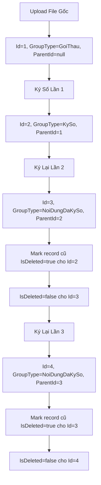
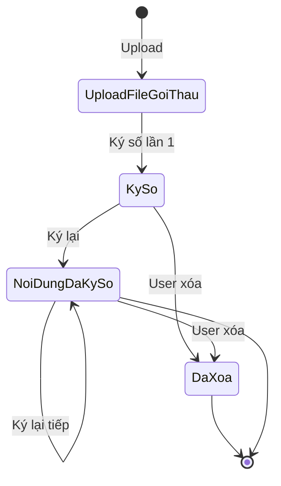
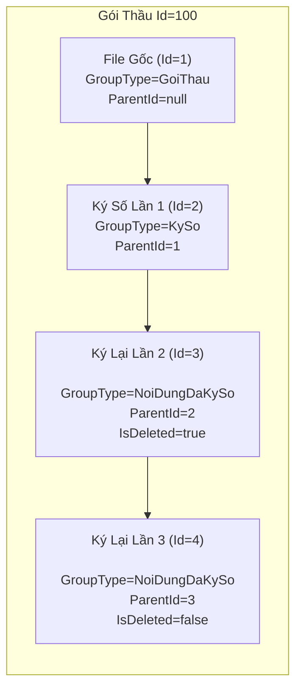

# Hướng Dẫn Logic Bảng TepDinhKem - Gói Thầu

## Tổng Quan

Bảng `TepDinhKem` (Tệp Đính Kèm) lưu trữ tất cả file đính kèm trong hệ thống, bao gồm file gốc và file ký số. Mỗi dòng represents một version của file.

---

## 1. Thêm File Ký Số

### Quy Trình

```
User chọn file → Gọi API ky-so/them-moi → Tạo record mới với GroupId = GoiThauId
```

### Chi Tiết

| Trường | Giá trị | Ý nghĩa |
|--------|---------|---------|
| `GroupId` | `GoiThauId` | File belongs to Gói Thầu nào |
| `GroupType` | `"KySo"` | Đánh dấu đây là file ký số |
| `ParentId` | `Id của file gốc` | Link đến file gốc (chưa ký) |
| `DuongDan` | URL file đã ký | Vị trí lưu file ký số |
| `TenFile` | Tên file đã ký | VD: `Hồ sơ thầu_signed.pdf` |
| `IsDeleted` | `false` | File đang active |

### Ví Dụ

```
File gốc: Hồ sơ thầu.pdf (Id = 100)
    ↓ ký số
File ký số: Hồ sơ thầu_signed.pdf (Id = 101, ParentId = 100, GroupType = "KySo")
```

---

## 2. Load File (Lấy Danh Sách)

### Query

```sql
-- Lấy tất cả file của Gói Thầu (bao gồm cả file ký số)
SELECT * FROM TepDinhKem
WHERE GroupId = @GoiThauId AND IsDeleted = false
```

### Đặc Điểm

- Load **tất cả** file bao gồm file ký số
- **Không có** yêu cầu không cho xóa file ký số
- Frontend tự handle hiển thị / disable nút xóa nếu cần

---

## 3. Lưu Lịch Sử Ký Số (Đề Xuất Mới)

### Ý Tưởng

Dùng lại bảng `TepDinhKem` luôn, **không cần tạo bảng mới**.

### Cơ Chế

| Trường | Giá trị | Ý nghĩa |
|--------|---------|---------|
| `GroupId` | `GoiThauId` | File belongs to Gói Thầu |
| `GroupType` | `"NoiDungDaKySo"` | Đánh dấu đây là lịch sử ký số |
| `ParentId` | `Id của file ký số gốc` | Link đến file đã ký |
| `DuongDan` | URL file version cũ | Vị trí lưu version cũ |

### Khi Nào Tạo Lịch Sử?

```
User ký lại file (re-sign) → Tạo record mới GroupType = "NoiDungDaKySo"
                           → Bỏ qua IsDeleted = true cho record cũ (soft delete)
```

### Query Lịch Sử

```sql
-- Lấy lịch sử ký số
SELECT * FROM TepDinhKem
WHERE GroupId = @GoiThauId
  AND GroupType = 'NoiDungDaKySo'
  AND IsDeleted = true

-- Lấy file đã ký + lịch sử
SELECT * FROM TepDinhKem
WHERE GroupId = @GoiThauId
  AND GroupType IN ('KySo', 'NoiDungDaKySo')
```

---

## 4. Soft Delete (Bắt Buộc)

### Mục Đích

- Lịch sử ký số cần giữ lại, không xóa vĩnh viễn
- Khi user ký lại file → mark record cũ là `IsDeleted = true`

### Quy Tắc

| Action | IsDeleted |
|--------|-----------|
| Upload file mới | `false` |
| Ký file (tạo KySo) | `false` |
| Ký lại (tạo NoiDungDaKySo) | Record cũ → `true` |
| Xóa file (user request) | `true` |

---

## 5. Sơ Đồ Luồng

### 5.1 Luồng Upload & Ký Số



### 5.2 Lifecycle Của Một File



### 5.3 Mối Quan Hệ ParentId Chain



### 5.4 Bảng Dữ Liệu Tương Ứng

| Id | GroupId | GroupType | ParentId | IsDeleted | Ghi Chú |
|----|---------|-----------|----------|-----------|---------|
| 1 | 100 | GoiThau | null | false | File gốc |
| 2 | 100 | KySo | 1 | false | Version ký số hiện tại |
| 3 | 100 | NoiDungDaKySo | 2 | true | Lịch sử ký số lần 2 |
| 4 | 100 | NoiDungDaKySo | 3 | false | Lịch sử ký số lần 3 |

---

## 7. Check List Khi Implement

- [ ] Thêm `GroupType` vào entity `TepDinhKem`
- [ ] Thêm `ParentId` (nullable) để link file ký số → file gốc
- [ ] Bổ sung `IsDeleted` cho soft delete
- [ ] API `ky-so/them-moi` set đúng `GroupType = "KySo"`
- [ ] API re-sign set `GroupType = "NoiDungDaKySo"` và mark record cũ là `IsDeleted = true`
- [ ] Query load file cần filter `IsDeleted = false` hoặc filter theo `GroupType` phù hợp

---

## 9. Các GroupType Thường Dùng

| GroupType | Ý nghĩa |
|-----------|---------|
| `KySo` | File ký số (version hiện tại) |
| `NoiDungDaKySo` | Lịch sử các version ký số |
| `GoiThau` | File gốc (chưa ký) |

---

## 10. Câu Hỏi Thường Gặp

**Q: Tại sao không tạo bảng riêng cho lịch sử ký số?**
A: Vì `ParentId + GroupType` đủ để phân biệt, không cần duplicate cấu trúc.

**Q: Làm sao lấy file gốc từ file ký số?**
A: Follow `ParentId` chain từ file ký số ngược về file gốc.

**Q: File nào được coi là "version hiện tại"?**
A: Record có `GroupType = "KySo"` và `IsDeleted = false`.