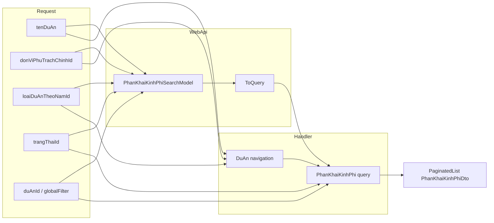

# Fix search API danh sách Phân khai kinh phí

**Document date:** June 29, 2026  
**Status:** ✅ **IMPLEMENTED** (June 29, 2026)  
**Module:** QLDA — `PhanKhaiKinhPhi` (UC40 — #9467)  
**Pattern tham chiếu:** `QuyetDinhDuyetDuToanGetDanhSachQuery`, `DuAnGetDanhSachQuery`, `HoSoMoiThauDienTuGetDanhSachQuery`

**Mục lục:** [0. Trạng thái](#0-trạng-thái-hiện-tại) · [1. Triệu chứng](#1-triệu-chứng-trước-fix) · [2. Root cause](#2-root-cause-đã-xác-minh) · [3. Khảo sát flow](#3-khảo-sát-flow) · [4. Đã implement](#4-đã-implement-as-built) · [5. API contract](#5-api-contract) · [6. Test plan](#6-test-plan) · [7. Checklist](#7-checklist-nghiệm-thu) · [8. Commit](#8-commit) · [9. Phụ lục](#phụ-lục-a--sơ-đồ-filter)

---

## 0. Trạng thái hiện tại

| Hạng mục | Trạng thái | Ghi chú |
| -------- | ---------- | ------- |
| Investigation / docs | ✅ Done | File này |
| `PhanKhaiKinhPhiSearchDto` (Application) | ✅ Done | `QLDA.Application/PhanKhaiKinhPhis/DTOs/PhanKhaiKinhPhiSearchDto.cs` |
| `PhanKhaiKinhPhiSearchModel` (WebApi) | ✅ Done | `QLDA.WebApi/Models/PhanKhaiKinhPhis/PhanKhaiKinhPhiSearchModel.cs` |
| `PhanKhaiKinhPhiMappingConfiguration` | ✅ Done | `ToSearchDto()` + `ToQuery()` |
| `PhanKhaiKinhPhiGetDanhSachQuery` handler | ✅ Done | `Include(DuAn)` + filter 4 field |
| `PhanKhaiKinhPhiController.GetDanhSach` | ✅ Done | Bind `PhanKhaiKinhPhiSearchModel` → `ToQuery()` |
| `PhanKhaiKinhPhiGetDanhSachExportQuery` | ✅ Done | Cùng filter với `danh-sach` |
| `PhanKhaiKinhPhiPrintSearchModel` | ✅ Done | Đủ field cho export Excel |
| `PrintController.InDanhSachPhanKhaiKinhPhi` | ✅ Done | Map đủ filter sang export query |
| Migration | ✅ Không cần | Chỉ query/filter |
| Build | ✅ Pass | `dotnet build QLDA.WebApi` — 0 error |
| Integration test | ⏳ Tùy chọn | Chưa thêm case filter mới |
| Manual verify curl | ⏳ Pending | Mẫu ở [6.1](#61-curl-mẫu) |

---

## 1. Triệu chứng (trước fix)

**Endpoint:**

```http
GET /QuanLyDuAn/api/phan-khai-kinh-phi/danh-sach
```

**FE / Postman gửi** (ví dụ từ màn hình lọc dự án chung):

```http
?pageIndex=1&pageSize=10&triger=3
&tenDuAn=1111
&thoiGianKhoiCong=2026&thoiGianHoanThanh=2026
&hinhThucDauTuId=6&loaiDuAnId=4
&donViPhuTrachChinhId=218
&loaiDuAnTheoNamId=2
&trangThaiId=32
```

### Expected

| Param | Kỳ vọng |
| ----- | ------- |
| `tenDuAn` | Chỉ trả phân khai kinh phí của dự án có tên chứa keyword |
| `donViPhuTrachChinhId` | Chỉ trả phân khai của dự án thuộc phòng ban phụ trách chính đó |
| `loaiDuAnTheoNamId` | Chỉ trả phân khai của dự án thuộc loại dự án theo năm (tài chính) đó — **không** dùng `LoaiDuAnId` |
| `trangThaiId` | Lọc theo trạng thái phê duyệt của bản ghi phân khai (`DanhMucTrangThaiPheDuyet`) |
| Kết hợp nhiều param | AND logic — tất cả điều kiện đều thỏa |
| Dự án match nhưng không có phân khai | Không hiển thị (inner filter qua `PhanKhaiKinhPhi`) |
| Paging | `totalRows`, `pageNumber`, `items` giữ nguyên format `PaginatedList` |

### Actual (trước fix)

| Param | Hành vi |
| ----- | ------- |
| `duAnId` | ✅ Hoạt động |
| `globalFilter` | ✅ Hoạt động (tìm `SoToTrinh`, `TenNguonVon`) |
| `trangThaiId` | ✅ Handler đã có filter — controller **chưa** bind đầy đủ search model |
| `tenDuAn` | ❌ Bị bỏ qua |
| `donViPhuTrachChinhId` | ❌ Bị bỏ qua |
| `loaiDuAnTheoNamId` | ❌ Bị bỏ qua |
| `thoiGianKhoiCong`, `loaiDuAnId`, … | ❌ Ngoài scope (xem [5.3](#53-phạm-vi--ngoài-scope)) |

---

## 2. Root cause (đã xác minh)

### 2.1 Controller bind thiếu param

Controller cũ dùng inline `[FromQuery]` từng param — chỉ `duAnId`, `globalFilter`, `trangThaiId` + paging. Các query string `tenDuAn`, `donViPhuTrachChinhId`, `loaiDuAnTheoNamId` **không được map**.

### 2.2 Handler không lọc theo `DuAn`

Handler cũ không `Include(e => e.DuAn)` và không có `WhereIf` theo navigation `DuAn`.

### 2.3 Không có Search DTO / SearchModel

| Layer | Trước fix | Sau fix |
| ----- | --------- | ------- |
| Application | Chỉ field rời trên query record | `PhanKhaiKinhPhiSearchDto : CommonSearchDto` |
| WebApi | Inline `[FromQuery]` | `PhanKhaiKinhPhiSearchModel` + `ToQuery()` |

### 2.4 Export lệch filter (đã sync)

`PhanKhaiKinhPhiGetDanhSachExportQuery` và `PhanKhaiKinhPhiPrintSearchModel` đã được cập nhật cùng filter với grid.

---

## 3. Khảo sát flow

### 3.1 Luồng dữ liệu (sau fix)

```text
FE màn hình Phân khai kinh phí
  └─ GET api/phan-khai-kinh-phi/danh-sach?...filters...
       └─ PhanKhaiKinhPhiController.GetDanhSach
            └─ PhanKhaiKinhPhiSearchModel.ToQuery()
                 └─ PhanKhaiKinhPhiGetDanhSachQuery(SearchDto)
                      └─ Handler: PhanKhaiKinhPhi ⟵ Include DuAn
                           ├─ Filter DuAn: TenDuAn, DonViPhuTrachChinhId, LoaiDuAnTheoNamId
                           └─ Filter PhanKhaiKinhPhi: DuAnId, TrangThaiId, GlobalFilter
                      └─ PaginatedList<PhanKhaiKinhPhiDto>

Export Excel (cùng filter):
  GET api/print/danh-sach-phan-khai-kinh-phi
       └─ PrintController.InDanhSachPhanKhaiKinhPhi
            └─ PhanKhaiKinhPhiGetDanhSachExportQuery (cùng WhereIf)
```

### 3.2 Entity liên quan

**`PhanKhaiKinhPhi`** — filter trực tiếp: `DuAnId`, `TrangThaiId`, `SoToTrinh`, `GlobalFilter` (qua `NguonVon.Ten`).

**`DuAn`** — filter qua navigation:

| Field API | Field entity | Kiểu |
| --------- | ------------ | ---- |
| `tenDuAn` | `TenDuAn` | `string?` — contains, case-insensitive |
| `donViPhuTrachChinhId` | `DonViPhuTrachChinhId` | `long?` — `-1` = null |
| `loaiDuAnTheoNamId` | `LoaiDuAnTheoNamId` | `int?` — **không** map `LoaiDuAnId` |

**`trangThaiId`** = `PhanKhaiKinhPhi.TrangThaiId` → `DanhMucTrangThaiPheDuyet` (không phải `DuAn.TrangThaiDuAnId`).

### 3.3 Authorization

`PhanKhaiKinhPhiGetDanhSachQuery` **không** dùng `FilterVisible` — task này **không** mở rộng auth, giữ hành vi cũ.

---

## 4. Đã implement (as-built)

### 4.1 Files thay đổi

| File | Thay đổi |
| ---- | -------- |
| `QLDA.Application/PhanKhaiKinhPhis/DTOs/PhanKhaiKinhPhiSearchDto.cs` | **Mới** — search DTO Application |
| `QLDA.WebApi/Models/PhanKhaiKinhPhis/PhanKhaiKinhPhiSearchModel.cs` | **Mới** — bind query string |
| `QLDA.WebApi/Models/PhanKhaiKinhPhis/PhanKhaiKinhPhiMappingConfiguration.cs` | `ToSearchDto()`, `ToQuery()` |
| `QLDA.Application/PhanKhaiKinhPhis/Queries/PhanKhaiKinhPhiGetDanhSachQuery.cs` | Nhận `SearchDto`, filter `DuAn` |
| `QLDA.WebApi/Controllers/PhanKhaiKinhPhiController.cs` | `GetDanhSach([FromQuery] PhanKhaiKinhPhiSearchModel)` |
| `QLDA.Application/PhanKhaiKinhPhis/Queries/PhanKhaiKinhPhiGetDanhSachExportQuery.cs` | Cùng filter |
| `QLDA.WebApi/Models/PhanKhaiKinhPhis/PhanKhaiKinhPhiPrintSearchModel.cs` | Thêm 3 field DuAn |
| `QLDA.WebApi/Controllers/PrintController.cs` | Map filter export |

### 4.2 `PhanKhaiKinhPhiSearchDto`

```csharp
public record PhanKhaiKinhPhiSearchDto : CommonSearchDto {
    public string? TenDuAn { get; set; }
    public long? DonViPhuTrachChinhId { get; set; }
    public int? LoaiDuAnTheoNamId { get; set; }
    public int? TrangThaiId { get; set; }
}
```

`CommonSearchDto` cung cấp `DuAnId`, `GlobalFilter`, `PageIndex`, `PageSize`.

### 4.3 WebApi mapping

```csharp
// PhanKhaiKinhPhiMappingConfiguration.cs
public static PhanKhaiKinhPhiGetDanhSachQuery ToQuery(this PhanKhaiKinhPhiSearchModel model)
    => new(model.ToSearchDto()) { IsNoTracking = true };
```

### 4.4 Controller (mỏng)

```csharp
[HttpGet("danh-sach")]
public async Task<ResultApi> GetDanhSach([FromQuery] PhanKhaiKinhPhiSearchModel searchModel) {
    var res = await Mediator.Send(searchModel.ToQuery());
    return ResultApi.Ok(res);
}
```

### 4.5 Handler — logic lọc chính

```csharp
var search = request.SearchDto;

var queryable = _repo.GetQueryableSet().AsNoTracking()
    .Include(e => e.TrangThai)
    .Include(e => e.NguonVon)
    .Include(e => e.DuAn)
    .Where(e => e.DuAn != null && !e.DuAn.IsDeleted)
    .WhereIf(search.DuAnId != null, e => e.DuAnId == search.DuAnId)
    .WhereIf(search.TrangThaiId > 0, e => e.TrangThaiId == search.TrangThaiId)
    .WhereIf(search.TenDuAn.IsNotNullOrWhitespace(),
        e => e.DuAn!.TenDuAn!.ToLower().Contains(search.TenDuAn!.ToLower()))
    .WhereFunc(search.DonViPhuTrachChinhId.HasValue, q => q
        .WhereIf(search.DonViPhuTrachChinhId > 0,
            e => e.DuAn!.DonViPhuTrachChinhId == search.DonViPhuTrachChinhId)
        .WhereIf(search.DonViPhuTrachChinhId == -1,
            e => e.DuAn!.DonViPhuTrachChinhId == null))
    .WhereIf(search.LoaiDuAnTheoNamId > 0,
        e => e.DuAn!.LoaiDuAnTheoNamId == search.LoaiDuAnTheoNamId)
    .WhereGlobalFilter(search,
        e => e.SoToTrinh,
        e => e.NguonVon != null ? e.NguonVon.Ten : null);
```

**Quyết định thiết kế:**

- Query record nhận `PhanKhaiKinhPhiSearchDto` (Option A trong bản plan) — đồng bộ `DuAnGetDanhSachQuery`.
- Filter `DuAn` qua `e.DuAn!` — chỉ dự án **có bản ghi phân khai** xuất hiện.
- `WhereGlobalFilter` nhận `search` (`CommonSearchDto`) — không duplicate `GlobalFilter` trên query record.

### 4.6 Export — đồng bộ filter

`PhanKhaiKinhPhiGetDanhSachExportQuery` copy cùng `WhereIf` / `WhereFunc` như handler danh-sach.

`PrintController.InDanhSachPhanKhaiKinhPhi` map:

```csharp
new PhanKhaiKinhPhiGetDanhSachExportQuery {
    DuAnId = searchModel.DuAnId,
    GlobalFilter = searchModel.GlobalFilter,
    TenDuAn = searchModel.TenDuAn,
    DonViPhuTrachChinhId = searchModel.DonViPhuTrachChinhId,
    LoaiDuAnTheoNamId = searchModel.LoaiDuAnTheoNamId,
    TrangThaiId = searchModel.TrangThaiId,
}
```

> **Lưu ý:** `InKetQuaPhanKhaiVonDuocDuyet` vẫn chỉ filter `DuAnId` + `GlobalFilter` — endpoint riêng, ngoài scope task này.

### 4.7 Files không sửa

| File / area | Lý do |
| ----------- | ----- |
| `AppDbContextModelSnapshot.cs`, migrations | Không đổi schema |
| `PhanKhaiKinhPhi` entity | Đủ field |
| `PhanKhaiKinhPhiDto` response | Acceptance không yêu cầu thêm field |

---

## 5. API contract

### 5.1 Query parameters

| Param | Type | Bắt buộc | Lọc trên | Ghi chú |
| ----- | ---- | -------- | -------- | ------- |
| `pageIndex` | `int` | Không | — | 1-based |
| `pageSize` | `int` | Không | — | |
| `duAnId` | `Guid?` | Không | `PhanKhaiKinhPhi.DuAnId` | |
| `globalFilter` | `string?` | Không | `SoToTrinh`, `TenNguonVon` | |
| `tenDuAn` | `string?` | Không | `DuAn.TenDuAn` | Contains, ignore case |
| `donViPhuTrachChinhId` | `long?` | Không | `DuAn.DonViPhuTrachChinhId` | `-1` = null |
| `loaiDuAnTheoNamId` | `int?` | Không | `DuAn.LoaiDuAnTheoNamId` | **Không** map `loaiDuAnId` |
| `trangThaiId` | `int?` | Không | `PhanKhaiKinhPhi.TrangThaiId` | `DanhMucTrangThaiPheDuyet` |

### 5.2 Response — không đổi

```json
{
  "result": true,
  "dataResult": {
    "items": [ { "id": "...", "duAnId": "...", "trangThaiId": 32, ... } ],
    "pageNumber": 1,
    "totalPages": 2,
    "totalRows": 15,
    "hasNextPage": true,
    "hasPreviousPage": false
  }
}
```

### 5.3 Phạm vi / ngoài scope

| Param | Xử lý |
| ----- | ----- |
| `thoiGianKhoiCong`, `thoiGianHoanThanh` | Ngoài scope |
| `hinhThucDauTuId` | Ngoài scope |
| `loaiDuAnId` | Ngoài scope — khác `loaiDuAnTheoNamId` |
| `triger` | Param FE nội bộ — BE bỏ qua |

---

## 6. Test plan

### 6.1 Curl mẫu

**Danh sách:**

```bash
curl --location \
  'http://192.168.1.12:9051/QuanLyDuAn/api/phan-khai-kinh-phi/danh-sach?pageIndex=1&pageSize=10&tenDuAn=1111&donViPhuTrachChinhId=218&loaiDuAnTheoNamId=2&trangThaiId=32' \
  --header 'Authorization: Bearer <JWT_TOKEN>'
```

**Export Excel (cùng filter):**

```bash
curl --location \
  'http://192.168.1.12:9051/QuanLyDuAn/api/print/danh-sach-phan-khai-kinh-phi?tenDuAn=1111&donViPhuTrachChinhId=218&loaiDuAnTheoNamId=2&trangThaiId=32' \
  --header 'Authorization: Bearer <JWT_TOKEN>' \
  -o PhanKhaiKinhPhi.xlsx
```

### 6.2 Manual checklist

| # | Case | Kỳ vọng |
| - | ---- | ------- |
| 1 | Chỉ `tenDuAn` | Dự án tên chứa keyword; không có phân khai → không hiện |
| 2 | Chỉ `donViPhuTrachChinhId=218` | `DuAn.DonViPhuTrachChinhId == 218` |
| 3 | Chỉ `loaiDuAnTheoNamId=2` | `DuAn.LoaiDuAnTheoNamId == 2` |
| 4 | Chỉ `trangThaiId=32` | Mọi item `trangThaiId == 32` |
| 5 | Kết hợp 4 filter | AND |
| 6 | Không match | `items: []`, `totalRows: 0` |
| 7 | Paging | `pageIndex=2` đúng, `totalRows` ổn định |
| 8 | Regression | `duAnId`, `globalFilter` vẫn OK |
| 9 | Export | Excel cùng subset với grid khi gửi cùng filter |

### 6.3 Build

```bash
dotnet build QLDA.WebApi/QLDA.WebApi.csproj
```

---

## 7. Checklist nghiệm thu

- [x] `tenDuAn` lọc theo tên dự án (contains)
- [x] `donViPhuTrachChinhId` lọc theo phòng ban phụ trách chính dự án
- [x] `loaiDuAnTheoNamId` lọc đúng cột — không nhầm `loaiDuAnId`
- [x] `trangThaiId` lọc trạng thái phê duyệt phân khai
- [x] Kết hợp nhiều param — AND logic
- [x] Dự án match nhưng không có phân khai → không hiển thị
- [x] Paging / `totalRows` / response shape không đổi
- [x] Logic filter trong Application handler — không trong Controller
- [x] Không sửa migration / snapshot
- [x] Build pass
- [x] Export Excel cùng filter với grid
- [ ] Manual verify curl trên dev/staging

---

## 8. Commit

```
fix(phan-khai-kinh-phi): support search filters on danh-sach API

Add DuAn-based filters (tenDuAn, donViPhuTrachChinhId, loaiDuAnTheoNamId)
and wire trangThaiId through search model so list and export match FE grid.
```

**Files trong commit:**

1. `QLDA.Application/PhanKhaiKinhPhis/DTOs/PhanKhaiKinhPhiSearchDto.cs`
2. `QLDA.Application/PhanKhaiKinhPhis/Queries/PhanKhaiKinhPhiGetDanhSachQuery.cs`
3. `QLDA.Application/PhanKhaiKinhPhis/Queries/PhanKhaiKinhPhiGetDanhSachExportQuery.cs`
4. `QLDA.WebApi/Models/PhanKhaiKinhPhis/PhanKhaiKinhPhiSearchModel.cs`
5. `QLDA.WebApi/Models/PhanKhaiKinhPhis/PhanKhaiKinhPhiPrintSearchModel.cs`
6. `QLDA.WebApi/Models/PhanKhaiKinhPhis/PhanKhaiKinhPhiMappingConfiguration.cs`
7. `QLDA.WebApi/Controllers/PhanKhaiKinhPhiController.cs`
8. `QLDA.WebApi/Controllers/PrintController.cs`

---

## Phụ lục A — Sơ đồ filter



---

## Phụ lục B — File map

| Vai trò | Đường dẫn |
| ------- | --------- |
| Controller | `QLDA.WebApi/Controllers/PhanKhaiKinhPhiController.cs` |
| Search model + mapping | `QLDA.WebApi/Models/PhanKhaiKinhPhis/PhanKhaiKinhPhiSearchModel.cs` |
| Mapping extensions | `QLDA.WebApi/Models/PhanKhaiKinhPhis/PhanKhaiKinhPhiMappingConfiguration.cs` |
| Search DTO | `QLDA.Application/PhanKhaiKinhPhis/DTOs/PhanKhaiKinhPhiSearchDto.cs` |
| Query + Handler | `QLDA.Application/PhanKhaiKinhPhis/Queries/PhanKhaiKinhPhiGetDanhSachQuery.cs` |
| Export query | `QLDA.Application/PhanKhaiKinhPhis/Queries/PhanKhaiKinhPhiGetDanhSachExportQuery.cs` |
| Print search | `QLDA.WebApi/Models/PhanKhaiKinhPhis/PhanKhaiKinhPhiPrintSearchModel.cs` |
| Print controller | `QLDA.WebApi/Controllers/PrintController.cs` → `InDanhSachPhanKhaiKinhPhi` |
| Entity PKP | `QLDA.Domain/Entities/PhanKhaiKinhPhi.cs` |
| Entity DuAn | `QLDA.Domain/Entities/DuAn.cs` |
| Integration tests | `QLDA.Tests/Integration/PhanKhaiKinhPhiControllerTests.cs` |
| Docs export gốc | `docs/feature/PhanKhaiKinhPhi/task-excel-import-export-phan-khai-kinh-phi.md` |

---

*Document updated after implementation — June 29, 2026.*
