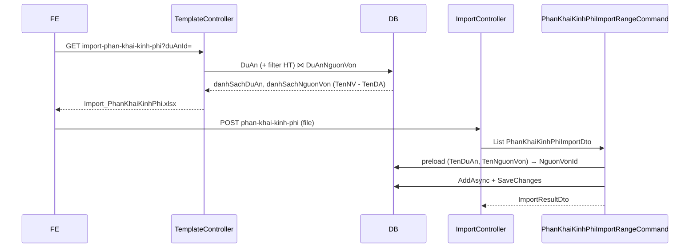

# Fix: CBO Nguồn vốn trong mẫu import Phân khai kinh phí

> **Trạng thái:** Implemented  
> **Liên quan:** UC40 / #9467 — import Phân khai kinh phí  
> **Slug template:** `import-phan-khai-kinh-phi`  
> **API tải mẫu:** `GET /api/template/import-phan-khai-kinh-phi?duAnId={guid?}`  
> **API import:** `POST /api/import/phan-khai-kinh-phi`

---

## Vấn đề hiện tại

Mẫu Excel import **Phân khai kinh phí** có 2 combo:


| Combo     | Cột     | Nguồn dữ liệu (thiết kế cũ)        | Hệ quả                                             |
| --------- | ------- | ---------------------------------- | -------------------------------------------------- |
| Dự án     | `$cbo1` | `DuAn`                             | OK                                                 |
| Nguồn vốn | `$cbo2` | `DanhMucNguonVon` (danh mục chung) | User chọn Dự án A nhưng chọn Nguồn vốn của Dự án B |


Nguồn vốn thực tế gắn với dự án qua bảng junction `DuAnNguonVon` (`LeftId` = `DuAnId`, `RightId` = `NguonVonId`). Nhiều dự án có thể có nguồn vốn **trùng tên** nhưng khác `NguonVonId` trong ngữ cảnh dự án.

**Import handler** (`PhanKhaiKinhPhiImportRangeCommand`) hiện map:

```text
TenNguonVon → DanhMucNguonVon.Ten (global, DistinctBy Ten)
```

→ Có thể insert sai `NguonVonId` khi tên trùng giữa các dự án.

---

## Hiện trạng source (đã khảo sát)


| Thành phần         | File                                                                         | Trạng thái                                                                                                                          |
| ------------------ | ---------------------------------------------------------------------------- | ----------------------------------------------------------------------------------------------------------------------------------- |
| Descriptor codegen | `QLDA.Gen/Descriptors/PhanKhaiKinhPhiImportDescriptor.cs`                    | Cột Nguồn vốn mô tả *"Chọn từ danh mục"* — chưa phản ánh format mới                                                                 |
| Template runtime   | `QLDA.WebApi/Controllers/TemplateController.cs` → `GetImportPhanKhaiKinhPhi` | **Đã có một phần:** filter `duAnId`, loại dự án hoàn thành, join `DuAnNguonVons` — **chưa** đổi `Name` sang `TenNguonVon - TenDuAn` |
| Import handler     | `QLDA.Application/.../PhanKhaiKinhPhiImportRangeCommand.cs`                  | **Chưa sửa** — vẫn lookup `DanhMucNguonVon` theo `Ten`                                                                              |
| Import DTO         | `PhanKhaiKinhPhiImportDto.cs`                                                | Giữ nguyên property `TenNguonVon` (chứa chuỗi display mới)                                                                          |
| Excel engine       | `BuildingBlocks.Infrastructure/Offices/ExcelImporter.cs`                     | Không hỗ trợ dropdown phụ thuộc (`ParentId` không dùng) — phù hợp hướng flat list                                                   |


**Kết luận:** Chỉ cần sửa **display text combo** + **logic resolve import**. Không cần dropdown phụ thuộc, không cần migration, không cần đổi cấu trúc file `.xlsx` (vẫn `$cbo1`, `$cbo2`).

---

## Mục tiêu

1. CBO **Nguồn vốn** load từ `DuAn` ⋈ `DuAnNguonVon` ⋈ `DanhMucNguonVon`, không dùng danh mục chung.
2. Text hiển thị: `**{TenNguonVon} - {TenDuAn}*`* (separator cố định: `" - "`).
3. Tải mẫu **có `duAnId`:** chỉ dự án đó + nguồn vốn thuộc dự án đó.
4. Tải mẫu **không có `duAnId`:** chỉ dự án **chưa hoàn thành** + nguồn vốn của các dự án đó.
5. Import resolve `NguonVonId` theo **cả tên nguồn vốn và tên dự án**, khớp với cột Dự án trên cùng dòng.

---

## Thiết kế đề xuất

### 1. Format display (hằng số)

Dùng **một separator** xuyên suốt template + import:

```csharp
// Gợi ý đặt private const trong handler + inline TemplateController
private const string NguonVonDisplaySeparator = " - ";
// Display: TenNguonVon + NguonVonDisplaySeparator + TenDuAn
```

**Parse khi import** — tách từ **phải sang trái** (last index) để xử lý trường hợp tên nguồn vốn có chứa `" - "`:

```csharp
static (string? TenNguonVon, string? TenDuAn) ParseNguonVonDisplay(string? display)
{
    if (string.IsNullOrWhiteSpace(display)) return (null, null);
    var idx = display.LastIndexOf(NguonVonDisplaySeparator, StringComparison.Ordinal);
    if (idx < 0) return (display.Trim(), null); // fallback file cũ — sẽ fail lookup junction
    return (
        display[..idx].Trim(),
        display[(idx + NguonVonDisplaySeparator.Length)..].Trim()
    );
}
```

---

### 2. Generate template — `TemplateController.GetImportPhanKhaiKinhPhi`

**Giữ nguyên** khung query dự án đã có:

```csharp
var duAnQuery = DuAn.GetQueryableSet().Where(e => !e.IsDeleted);

if (duAnId.HasValue)
    duAnQuery = duAnQuery.Where(e => e.Id == duAnId.Value);
else
{
    var trangThaiHoanThanh = await TrangThaiDuAn
        .GetQueryableSet(OnlyUsed: true, OnlyNotDeleted: true, OrderByIndex: false)
        .FirstOrDefaultAsync(s => s.Ma == DanhMucTrangThaiDuAnCodes.HoanThanh, cancellationToken);

    if (trangThaiHoanThanh != null)
        duAnQuery = duAnQuery.Where(e => e.TrangThaiDuAnId != trangThaiHoanThanh.Id);
}
```

> **Constant:** `DanhMucTrangThaiDuAnCodes.HoanThanh` = `"HT"` — tương đương `TrangThaiId != Đã hoàn thành`.

**Sửa query nguồn vốn** — bỏ `ParentId` (không dùng), đổi `Name`:

```csharp
var danhSachNguonVon = await duAnQuery
    .SelectMany(e => e.DuAnNguonVons!
        .Where(dnv => dnv.NguonVon != null)
        .Select(dnv => new {
            TenDuAn = e.TenDuAn ?? string.Empty,
            TenNguonVon = dnv.NguonVon!.Ten ?? string.Empty,
            NguonVonId = dnv.RightId,
        }))
    .Distinct()
    .OrderBy(x => x.TenDuAn).ThenBy(x => x.TenNguonVon)
    .Select(x => new ComboData {
        Name = x.TenNguonVon + NguonVonDisplaySeparator + x.TenDuAn,
        Id = x.NguonVonId.ToString(),
    })
    .ToListAsync(cancellationToken);

List<List<ComboData>> comboData = [danhSachDuAn, danhSachNguonVon];
```


| Case           | Dropdown Dự án | Dropdown Nguồn vốn                             |
| -------------- | -------------- | ---------------------------------------------- |
| `?duAnId=A`    | Chỉ Dự án A    | `NS thành phố - Dự án A`, `NS TW - Dự án A`, … |
| Không `duAnId` | Dự án chưa HT  | Tất cả `(TenNV - TenDA)` của các dự án chưa HT |


**Không** làm `$cbo2_childOf[cbo1]` — `ExcelImporter` chưa implement dependent validation.

---

### 3. Descriptor — cập nhật mô tả cột (optional nhưng nên làm)

**File:** `QLDA.Gen/Descriptors/PhanKhaiKinhPhiImportDescriptor.cs`

```csharp
new() {
    Header = "Nguồn vốn",
    Description = "Tên nguồn vốn - Tên dự án",
    Placeholder = "$cbo2",
    ComboIndex = 2,
    Width = 40,  // rộng hơn vì text dài
},
```

Cập nhật `HintText` nếu cần:

```text
Cột Dự án / Nguồn vốn chọn từ danh sách. Nguồn vốn hiển thị dạng "Tên nguồn vốn - Tên dự án".
```

Regenerate template (chỉ đổi hint/description, không đổi cấu trúc cột):

```bash
cd QLDA.Gen
dotnet run -- import-phan-khai-kinh-phi --force ../QLDA.WebApi/PrintTemplates
```

---

### 4. Import — `PhanKhaiKinhPhiImportRangeCommandHandler`

#### 4.1 Thay đổi dependency


| Trước                                             | Sau                                                                      |
| ------------------------------------------------- | ------------------------------------------------------------------------ |
| `IRepository<DanhMucNguonVon, int> _nguonVonRepo` | `IRepository<DuAn, Guid> _duAnRepo` (đã có) — lookup qua `DuAnNguonVons` |


Không cần repo `DanhMucNguonVon` riêng nếu join từ `DuAn`.

#### 4.2 Preload dictionary

Thay block `tenNguonVons` + `nguonVonByTen`:

```csharp
var tenDuAns = rows
    .Where(r => !string.IsNullOrWhiteSpace(r.TenDuAn))
    .Select(r => r.TenDuAn!)
    .Distinct()
    .ToList();

// Dictionary: (TenDuAn, TenNguonVon) → NguonVonId
var nguonVonByDuAnAndTen = await _duAnRepo.GetQueryableSet()
    .Where(e => tenDuAns.Contains(e.TenDuAn!))
    .SelectMany(e => e.DuAnNguonVons!
        .Where(dnv => dnv.NguonVon != null)
        .Select(dnv => new {
            TenDuAn = e.TenDuAn!,
            TenNguonVon = dnv.NguonVon!.Ten!,
            NguonVonId = dnv.RightId,
        }))
    .ToListAsync(cancellationToken);

var nguonVonLookup = nguonVonByDuAnAndTen
    .DistinctBy(x => (x.TenDuAn, x.TenNguonVon))
    .ToDictionary(x => (x.TenDuAn, x.TenNguonVon), x => x.NguonVonId);
```

Giữ nguyên `duAnByTen` như hiện tại.

#### 4.3 Validate từng dòng

```text
foreach row:
  1. TenDuAn bắt buộc → duAnId từ duAnByTen
  2. Nếu có TenNguonVon (cột Excel):
     a. Parse → (tenNv, tenDaFromDisplay)
     b. Nếu tenDaFromDisplay != null && tenDaFromDisplay != row.TenDuAn
        → lỗi: "Nguồn vốn không thuộc dự án đã chọn"
     c. Lookup nguonVonLookup[(row.TenDuAn, tenNv)]
        → không có: "Không tìm thấy nguồn vốn" (hoặc message chi tiết hơn)
     d. Gán NguonVonId
  3. Các validate tiền / ngày — giữ nguyên
```

**Message lỗi đề xuất:**


| Tình huống                                         | Message                                                                     |
| -------------------------------------------------- | --------------------------------------------------------------------------- |
| Parse được nhưng tên dự án trong combo ≠ cột Dự án | `Dòng N: Nguồn vốn không thuộc dự án đã chọn`                               |
| Không tìm thấy trong junction                      | `Dòng N: Không tìm thấy nguồn vốn`                                          |
| File cũ (chỉ tên NV, không có `- TenDA`)           | Lookup fail → `Không tìm thấy nguồn vốn` (chấp nhận — user cần tải mẫu mới) |


#### 4.4 Không đổi

- `PhanKhaiKinhPhiImportDto` — property `TenNguonVon` vẫn map cột B, chỉ **giá trị** đổi format.
- `ImportController` — không đổi.
- Entity `PhanKhaiKinhPhi` — không đổi schema.

---

## Luồng end-to-end




---

## Files cần sửa


| File                                                                              | Thao tác      | Ghi chú                                                           |
| --------------------------------------------------------------------------------- | ------------- | ----------------------------------------------------------------- |
| `QLDA.WebApi/Controllers/TemplateController.cs`                                   | **Sửa**       | `Name` combo NV + bỏ `ParentId`; có thể extract `const` separator |
| `QLDA.Application/PhanKhaiKinhPhis/Commands/PhanKhaiKinhPhiImportRangeCommand.cs` | **Sửa**       | Parse display, lookup junction, validate cross-column             |
| `QLDA.Gen/Descriptors/PhanKhaiKinhPhiImportDescriptor.cs`                         | **Sửa**       | Description / HintText / Width cột NV                             |
| `QLDA.WebApi/PrintTemplates/Import_PhanKhaiKinhPhi.xlsx`                          | **Regen**     | Sau sửa descriptor (optional)                                     |
| `QLDA.Tests/Integration/PhanKhaiKinhPhiImportExportTests.cs`                      | **Thêm test** | Case resolve NV theo dự án (xem § Test)                           |


**Không đụng:** Migration, `AppDbContextModelSnapshot`, Domain entity, WebApi model mới.

---

## Test plan

### Case 1 — Tải mẫu có `duAnId`

```http
GET /api/template/import-phan-khai-kinh-phi?duAnId={guid}
```

- [ ] Dropdown Dự án: đúng 1 dự án
- [ ] Dropdown Nguồn vốn: chỉ NV của dự án đó
- [ ] Mỗi item NV có dạng `Tên nguồn vốn - Tên dự án`

### Case 2 — Tải mẫu không có `duAnId`

```http
GET /api/template/import-phan-khai-kinh-phi
```

- [ ] Dropdown Dự án: không có dự án `TrangThaiDuAn.Ma == HT`
- [ ] Dropdown Nguồn vốn: chỉ NV của các dự án trên
- [ ] Format display đúng

### Case 3 — Import dữ liệu

Chuẩn bị DB: 2 dự án A, B cùng nguồn vốn tên `"Ngân sách thành phố"` (khác `NguonVonId` hoặc cùng ID nhưng junction khác `DuAnId`).


| Dòng | Dự án   | Nguồn vốn (Excel)               | Kỳ vọng                        |
| ---- | ------- | ------------------------------- | ------------------------------ |
| 1    | Dự án A | `Ngân sách thành phố - Dự án A` | Insert đúng `NguonVonId` của A |
| 2    | Dự án B | `Ngân sách thành phố - Dự án B` | Insert đúng `NguonVonId` của B |
| 3    | Dự án A | `Ngân sách thành phố - Dự án B` | Lỗi: không thuộc dự án đã chọn |
| 4    | Dự án A | `Ngân sách thành phố` (file cũ) | Lỗi: không tìm thấy nguồn vốn  |


### Case 4 — Integration test gợi ý

Mở rộng `PhanKhaiKinhPhiImportExportTests`:

1. Seed 2 `DuAn` + `DuAnNguonVon` + `DanhMucNguonVon` trùng tên.
2. Build `PhanKhaiKinhPhiImportDto` in-memory hoặc mock Excel row.
3. Gọi `PhanKhaiKinhPhiImportRangeCommand` qua Mediator / handler trực tiếp.
4. Assert `NguonVonId` và `DuAnId` trên entity inserted.

---

## Checklist implement

- [x] `TemplateController`: `Name = TenNguonVon + " - " + TenDuAn`, bỏ `ParentId`
- [x] `PhanKhaiKinhPhiImportRangeCommand`: bỏ lookup `DanhMucNguonVon` global
- [x] Thêm `ParseNguonVonDisplay` + validate cross-column (`PhanKhaiKinhPhiImportDisplay`)
- [x] Preload `(TenDuAn, TenNguonVon) → NguonVonId` từ `DuAnNguonVons`
- [x] Cập nhật `PhanKhaiKinhPhiImportDescriptor` description/hint
- [ ] Regen `Import_PhanKhaiKinhPhi.xlsx` — slug chưa đăng ký trong `QLDA.Gen/Program.cs` (hint/description chỉ ảnh hưởng khi regen; runtime combo fill từ API)
- [x] Chạy `PhanKhaiKinhPhiImportExportTests` + test case trùng tên NV
- [ ] Manual test Case 1–3 trên môi trường dev

---

## Commit gợi ý

```
fix(import): CBO nguồn vốn join dự án trong mẫu phân khai kinh phí
```

Hoặc tách 2 commit nếu muốn review rõ:

1. `fix(template): hiển thị nguồn vốn dạng TenNV - TenDA trong import PKKP`
2. `fix(import): resolve NguonVonId theo dự án khi import phân khai kinh phí`

---

## Phạm vi ngoài (out of scope)

- Dropdown phụ thuộc Dự án → Nguồn vốn (`_childOf`)
- Đổi API import nhận `duAnId` từ form (hiện chỉ đọc file)
- Lọc dự án theo authorization (`FilterVisible`) trên template — **chưa có** ở endpoint template hiện tại; cân nhắc riêng nếu BA yêu cầu
- Sửa import Gói thầu / các mẫu khác dùng `DanhMucNguonVon` chung

