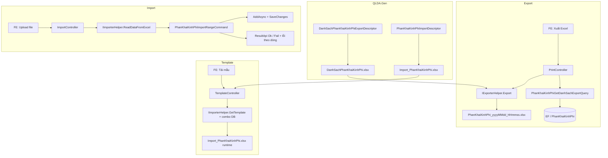

# Excel Import/Export — Phân khai kinh phí

**Ngày tạo:** June 2026  
**Trạng thái:** ✅ **IMPLEMENTED** (June 2026)  
**Effort ước tính:** ~10–12 giờ (QLDA.Gen ~2h, export ~2.5h, import ~4h, test ~1h)  
**Module gốc:** UC40 — Phân khai kinh phí (`PhanKhaiKinhPhiController`)  
**Pattern export tham chiếu:** [`task-export-danh-sach-de-xuat-chu-truong-chuyen-tiep.md`](../DeXuatChuyenTiep/task-export-danh-sach-de-xuat-chu-truong-chuyen-tiep.md)  
**Pattern import tham chiếu:** [`task-import-danh-sach-de-xuat-chu-truong-chuyen-tiep.md`](../DeXuatChuyenTiep/task-import-danh-sach-de-xuat-chu-truong-chuyen-tiep.md), [`docs/issues/9579/report.md`](../../issues/9579/report.md)  
**Export đã có (khác phạm vi):** [`task-export-ket-qua-phan-khai-von-duoc-duyet.md`](./task-export-ket-qua-phan-khai-von-duoc-duyet.md) — chỉ bản ghi **Đã duyệt**  
**Hướng dẫn Aspose:** [`QLDA.WebApi/PrintTemplates/huong-dan.md`](../../../QLDA.WebApi/PrintTemplates/huong-dan.md)  
**Codegen template:** [`QLDA.Gen`](../../../QLDA.Gen/) — **không tạo `.xlsx` tay** nếu có descriptor tương ứng

### Đơn vị tiền (quyết định đã chốt khi implement)

| Tầng | Quy tắc |
|------|---------|
| **Form / DB** | `KinhPhiDeXuat`, `KinhPhiPhanKhai` lưu **đồng** (`decimal`) — giống `PhanKhaiKinhPhiInsertCommand` |
| **Import Excel** | Nhập **đồng**, lưu **1:1** — **không** nhân `× 1_000_000` |
| **Export danh sách** | Giá trị DB (đồng), format template `#,##0` |
| **Export đã duyệt** (`ket-qua-phan-khai-von-duoc-duyet`) | Khác phạm vi — chia `/ 1_000_000` (triệu) trên DTO riêng |

**Ví dụ:** Excel nhập `100000` → DB `100000` (DBeaver có thể hiển thị `100,000` — chỉ là format ngàn).

**Cách nhập an toàn:** gõ số thuần `100000` (không gõ dấu phẩy/chấm). Template dùng format `#,##0` chỉ để **hiển thị** trong Excel.

> ⚠️ **Locale:** Parser `double` trong `StringExtension` + đọc ô số trong `AsposeHelper` đã xử lý en-US (`100,000`) và vi-VN (`100.000`). Tránh nhập dạng text `1,000` (nghĩ là 1 nghìn) trên Excel locale Việt — có thể bị hiểu thành `1`.

---

## 📋 Executive Summary

**Tính năng:** Bổ sung Excel cho màn **danh sách Phân khai kinh phí**:

| # | Hạng mục | Mô tả ngắn |
|---|----------|------------|
| I | **Xuất Excel danh sách** | Nút "Xuất Excel" — dữ liệu khớp filter grid hiện tại, không phân trang |
| II | **Tải file mẫu import** | API + template Aspose, dropdown Dự án / Nguồn vốn |
| III | **Import Excel** | Đọc template, validate từng dòng, insert qua MediatR handler |

**Không nhầm với:**

- `GET /api/print/ket-qua-phan-khai-von-duoc-duyet` → export **kết quả đã duyệt** (6 cột khác: Số tờ trình, Trích yếu, Nguồn, …)
- Task doc [`task-export-ket-qua-phan-khai-von-duoc-duyet.md`](./task-export-ket-qua-phan-khai-von-duoc-duyet.md) dùng stored procedure — **task này dùng LINQ** (giống export danh sách chuyển tiếp)

---

## 📋 Quick Facts

| Thuộc tính | Giá trị |
|------------|---------|
| **Entity** | `PhanKhaiKinhPhi` |
| **Controller CRUD** | `PhanKhaiKinhPhiController` — `api/phan-khai-kinh-phi` |
| **API danh sách** | `GET /api/phan-khai-kinh-phi/danh-sach` |
| **API export mới** | `GET /api/print/danh-sach-phan-khai-kinh-phi` |
| **API template mới** | `GET /api/template/import-phan-khai-kinh-phi` |
| **API import mới** | `POST /api/import/phan-khai-kinh-phi` |
| **Query list** | `PhanKhaiKinhPhiGetDanhSachQuery` |
| **Query export mới** | `PhanKhaiKinhPhiGetDanhSachExportQuery` |
| **Command import mới** | `PhanKhaiKinhPhiImportRangeCommand` |
| **Phân quyền export** | `RoleConstants.GroupPhanKhaiKinhPhiExport` *(đã có)* |
| **Template export** | `QLDA.WebApi/PrintTemplates/DanhSachPhanKhaiKinhPhi.xlsx` |
| **Template import** | `QLDA.WebApi/PrintTemplates/Import_PhanKhaiKinhPhi.xlsx` |
| **QLDA.Gen slug export** | `danh-sach-phan-khai-kinh-phi` |
| **QLDA.Gen slug import** | `import-phan-khai-kinh-phi` |
| **Layout export** | `LetterheadExport` *(cùng họ visual `KetQuaPhanKhaiVonDuocDuyet` / `DanhSachDeXuatChuTruongChuyenTiep`)* |
| **Layout import** | `LetterheadImportWithCombo` — `GenerateImportTemplate` *(đã implement)* |
| **Migration** | Không cần |
| **Stored procedure** | Không cần |

---

## 🎯 Phạm vi tính năng

### Đã bao gồm

- ✅ **QLDA.Gen** sinh template export + import (descriptor, không tạo `.xlsx` tay)
- ✅ Export danh sách theo filter hiện tại (xem [Phase 0.3](#03-filter-thực-tế))
- ✅ Template import 8 cột + dropdown Dự án / Nguồn vốn
- ✅ Import qua `IImporterHelper` + `ImportRangeCommand`
- ✅ Validate từng dòng, gom lỗi (không crash cả file)
- ✅ Insert bản ghi mới trạng thái **Dự thảo** (giống `PhanKhaiKinhPhiInsertCommand`)
- ✅ Integration test cơ bản

### Không bao gồm

- ❌ Import / export tệp đính kèm
- ❌ Update bản ghi đã có qua Excel (chỉ insert mới)
- ❌ Thay đổi workflow phê duyệt
- ❌ Migration / thay đổi schema DB

---

## 🔍 Phase 0 — Khảo sát source (đã xác minh)

### 0.1 API / Controller hiện tại

| Thành phần | Vị trí |
|------------|--------|
| Controller | `QLDA.WebApi/Controllers/PhanKhaiKinhPhiController.cs` |
| Route | `[Route("api/phan-khai-kinh-phi")]` |
| Endpoint list | `[HttpGet("danh-sach")]` |
| Handler | `QLDA.Application/PhanKhaiKinhPhis/Queries/PhanKhaiKinhPhiGetDanhSachQuery.cs` |
| Insert command | `PhanKhaiKinhPhiInsertCommand` |

**Controller map params danh sách:**

```csharp
// PhanKhaiKinhPhiController.GetDanhSach
new PhanKhaiKinhPhiGetDanhSachQuery {
    DuAnId = duAnId,
    GlobalFilter = globalFilter,
    TrangThaiId = trangThaiId,
    PageIndex = pageIndex,
    PageSize = pageSize,
    IsNoTracking = true,
}
```

### 0.2 Entity & field mapping

```text
PhanKhaiKinhPhi
├── DuAnId              Guid (FK DuAn)
├── BuocId              int (entity có field; Create API hiện không set — giữ nguyên hành vi)
├── SoToTrinh           string?
├── NgayToTrinh         DateTimeOffset?
├── NguonVonId          int? (FK DanhMucNguonVon)
├── KinhPhiDeXuat       decimal(18,2) — lưu đồng
├── KinhPhiPhanKhai     decimal(18,2) — lưu đồng
├── ThuyetMinh          string?  ← import cột "Thuyết minh phân khai"
├── TrichYeu            string?
└── TrangThaiId         int? → auto Dự thảo khi insert
```

### 0.3 Filter thực tế

| Param | Handler list hiện tại | Yêu cầu BA | Ghi chú |
|-------|----------------------|------------|---------|
| `duAnId` | ✅ `WhereIf` | ✅ | |
| `globalFilter` | ✅ `WhereGlobalFilter` trên `SoToTrinh`, `NguonVon.Ten` | ✅ Từ khóa | |
| `trangThaiId` | ✅ `WhereIf` | ✅ Trạng thái | Đã bổ sung cả `danh-sach` + export |
| `pageIndex` / `pageSize` | ✅ list only | ❌ export bỏ phân trang | |

> **Quyết định triển khai:** Export **bắt buộc** dùng cùng filter với `danh-sach`. Nếu màn hình có filter trạng thái mà API chưa hỗ trợ → thêm `TrangThaiId?` vào **cả** `PhanKhaiKinhPhiGetDanhSachQuery` và export query trong cùng PR (tránh lệch grid vs Excel).

### 0.4 Cột UI danh sách ↔ Export

| # | Cột UI (yêu cầu) | Nguồn dữ liệu | Property export | Ghi chú |
|---|------------------|---------------|-----------------|---------|
| 1 | STT | Tự sinh | `Stt` | `index + 1` trên full dataset đã filter |
| 2 | Dự án | `DuAn.TenDuAn` | `TenDuAn` | List DTO **chưa có** `TenDuAn` — export query cần `Include(e => e.DuAn)` |
| 3 | KP đề xuất | `KinhPhiDeXuat` | `KinhPhiDeXuat` | Giá trị DB (đồng); format `#,##0` trên template |
| 4 | KP phân khai | `KinhPhiPhanKhai` | `KinhPhiPhanKhai` | Tương tự |
| 5 | Trạng thái | `TrangThai.Ten` | `TenTrangThai` | Fallback `TrangThaiPheDuyetCodes.Default.TenDuThao` nếu `Ma == LEG` |

**Khác export đã duyệt:** `PhanKhaiKinhPhiExportDto` hiện tại dùng cho `ket-qua-phan-khai-von-duoc-duyet` (chia `/ 1_000_000`). Export **danh sách** này dùng DTO **riêng** — giữ nguyên đơn vị đồng + format Excel.

### 0.5 Pattern import/export có sẵn

| Thành phần | Vị trí |
|------------|--------|
| `ImportController` | `QLDA.WebApi/Controllers/ImportController.cs` |
| `TemplateController` | `QLDA.WebApi/Controllers/TemplateController.cs` |
| `IImporterHelper` | `BuildingBlocks.Infrastructure/Offices/ExcelImporter.cs` |
| `IExporterHelper` | `BuildingBlocks.Infrastructure/Offices/ExcelHelper.cs` |
| `PrintController` | Export LINQ + Aspose |
| Combo dropdown template | `GetTemplate(path, comboData)` — sheet[1] + `$cbo1`, `$cbo2` |

**Cơ chế đọc Excel (`ReadDataFromExcel`):**

| Quy ước | Chi tiết |
|---------|----------|
| Sheet | Index `0` |
| Bảng | **Excel Table** (`ListObject`) bắt buộc |
| Header | Dòng 1 trong table |
| Mô tả | Dòng 2 (bỏ qua khi đọc) |
| Dữ liệu | Từ `startRow + 2` |
| Map cột | **Thứ tự property trong class = thứ tự cột** (không theo tên) |
| `[Description]` | Chỉ dùng cho message lỗi |
| `[Required]` | Throw khi ô trống (trong `ReadDataFromExcel`) |

> ⚠️ `ConvertStringToPropertyType` **chưa hỗ trợ `decimal`** — import tiền dùng `double?` rồi cast `(decimal)` khi lưu DB (1:1, không quy đổi đơn vị).  
> Ô **numeric** đọc qua `AsposeHelper.GetCellValueAsString` → `InvariantCulture` (`100000`). Ô **text** parse `double` theo thứ tự Invariant → en-US → vi-VN.

### 0.6 Dropdown dữ liệu (form / template)

| Combo | Nguồn đề xuất | Tham chiếu |
|-------|---------------|------------|
| Dự án | `DuAn.GetQueryableSet()` + `WhereGlobalFilter` giống combobox form | `DuAnGetDanhSachComboboxQuery` — filter `TenDuAn`, `MaDuAn` |
| Nguồn vốn | `DanhMucNguonVon.GetQueryableSet()` | `TemplateController.GetImportGoiThau` — `$cbo` NguonVon |

**Template endpoint** có thể nhận `?duAnId=` để thu hẹp dropdown dự án (pattern `import-de-xuat-chu-truong-chuyen-tiep`).

### 0.7 QLDA.Gen — template codegen

**Tool:** [`QLDA.Gen`](../../../QLDA.Gen/) — sinh file `.xlsx` từ descriptor C# (ClosedXML), không chỉnh tay trừ khi cần patch nhỏ.

| Thành phần | Vị trí |
|------------|--------|
| CLI | `QLDA.Gen/Program.cs` — registry slug → descriptor |
| Layout export | `TemplateLayoutType.LetterheadExport` *(đã có)* |
| Layout import | `LetterheadImportWithCombo` — `GenerateImportTemplate` trong `TemplateGenerator` *(đã có)* |
| Descriptor export | `QLDA.Gen/Descriptors/DanhSachPhanKhaiKinhPhiExportDescriptor.cs` *(mới)* |
| Descriptor import | `QLDA.Gen/Descriptors/PhanKhaiKinhPhiImportDescriptor.cs` *(mới)* |
| Generator | `QLDA.Gen/Generators/TemplateGenerator.cs` |
| Column metadata | `QLDA.Gen/Metadata/ExportColumn.cs`, `ImportColumn.cs` *(mới cho import)* |

**Slug đã đăng ký (sau implement):**

```csharp
// QLDA.Gen/Program.cs — BuildRegistry
new("danh-sach-phan-khai-kinh-phi",
    g => g.GenerateTemplate(CreateDescriptor<DanhSachPhanKhaiKinhPhiExportDescriptor>(basePath))),
new("import-phan-khai-kinh-phi",
    g => g.GenerateImportTemplate(CreateImportDescriptor<PhanKhaiKinhPhiImportDescriptor>(basePath))),
```

**Lệnh sinh template (bắt buộc trỏ `PrintTemplates`):**

```bash
cd QLDA.Gen

# Export danh sách
dotnet run -- danh-sach-phan-khai-kinh-phi --force ../QLDA.WebApi/PrintTemplates

# Import mẫu (đã có GenerateImportTemplate)
dotnet run -- import-phan-khai-kinh-phi --force ../QLDA.WebApi/PrintTemplates

# Hoặc sinh cả hai
dotnet run -- danh-sach-phan-khai-kinh-phi import-phan-khai-kinh-phi --force ../QLDA.WebApi/PrintTemplates
```

> **Lưu ý:** Default output của `QLDA.Gen` là `QLDA.WebApi/ExportTemplates`. Project QLDA dùng **`PrintTemplates`** — luôn truyền path tường minh.  
> **`--force`:** ghi đè file đã có. Không `--force` → skip nếu file tồn tại (bảo vệ template đã chỉnh tay).

**Tham chiếu descriptor có sẵn:**

| Descriptor | Slug | Layout | Output |
|------------|------|--------|--------|
| `TinhHinhDeXuatNhuCauExportDescriptor` | `tinh-hinh-de-xuat-nhu-cau` | `LetterheadExport` | `TinhHinhDeXuatNhuCau.xlsx` |
| `BaoCaoDeXuatChuTruongExportDescriptor` | `bao-cao-de-xuat-chu-truong` | `LetterheadExportWithSummary` | `BaoCaoDeXuatChuTruong.xlsx` |

**Import:** Task này đã **mở rộng QLDA.Gen** (`GenerateImportTemplate`, `IImportDescriptor`, `ImportColumn`) — codegen `Import_PhanKhaiKinhPhi.xlsx`. Các template import khác (`Import_DeXuatChuTruongChuyenTiep.xlsx`, …) vẫn có thể hand-crafted.

**Verify checklist Phase 0:**

- [ ] Đã đọc `PhanKhaiKinhPhiGetDanhSachQuery.cs`
- [ ] Đã đọc `PrintController.InKetQuaPhanKhaiVonDuocDuyet` (khác phạm vi)
- [ ] Đã đọc `QLDA.Gen/Program.cs` + descriptor mẫu `BaoCaoDeXuatChuTruongExportDescriptor`
- [ ] Đã xác nhận FE có filter `trangThaiId` hay chưa
- [ ] Xác nhận không cần migration

---

## 🏗️ Kiến trúc tổng thể



### Vị trí file sau khi implement

```text
QLDA.Gen/
├── Descriptors/
│   ├── DanhSachPhanKhaiKinhPhiExportDescriptor.cs   [export list]
│   ├── PhanKhaiKinhPhiImportDescriptor.cs             [import mẫu]
│   └── IImportDescriptor.cs                           [interface + HintText]
├── Metadata/
│   └── ImportColumn.cs
├── Generators/
│   └── TemplateGenerator.cs                           [+GenerateImportTemplate, BuildImportWorksheet]
└── Program.cs                                         [+2 slug registry]

QLDA.Application/
└── PhanKhaiKinhPhis/
    ├── DTOs/
    │   ├── PhanKhaiKinhPhiDanhSachExportDto.cs
    │   ├── PhanKhaiKinhPhiImportDto.cs
    │   └── PhanKhaiKinhPhiImportResultDto.cs
    ├── Queries/
    │   ├── PhanKhaiKinhPhiGetDanhSachQuery.cs         [+TrangThaiId]
    │   └── PhanKhaiKinhPhiGetDanhSachExportQuery.cs
    └── Commands/
        └── PhanKhaiKinhPhiImportRangeCommand.cs

QLDA.WebApi/
├── Controllers/
│   ├── PrintController.cs                           [+InDanhSachPhanKhaiKinhPhi]
│   ├── TemplateController.cs                        [+GetImportPhanKhaiKinhPhi]
│   └── ImportController.cs                          [+ImportPhanKhaiKinhPhi]
├── Models/PhanKhaiKinhPhis/
│   └── PhanKhaiKinhPhiPrintSearchModel.cs           [+TrangThaiId]
└── PrintTemplates/
    ├── DanhSachPhanKhaiKinhPhi.xlsx                   [CODEGEN]
    └── Import_PhanKhaiKinhPhi.xlsx                    [CODEGEN]

QLDA.Tests/Integration/
└── PhanKhaiKinhPhiImportExportTests.cs

BuildingBlocks/ (parse số import)
├── CrossCutting/ExtensionMethods/StringExtension.cs   [double: Invariant → en-US → vi-VN]
└── Infrastructure/Offices/AsposeHelper.cs           [numeric cell → InvariantCulture]
```

---

# PHẦN 0 — QLDA.Gen: sinh template Excel (~1.5–2 giờ)

> **Làm trước** Application/WebApi — mọi placeholder `$Field` phải khớp DTO trước khi viết handler.

## Phase QLDA.Gen-A: Export danh sách (~45 phút)

### A.1 Chọn layout — `LetterheadExport`

Export danh sách Phân khai kinh phí dùng **cùng họ visual** với export module đã có:

| Template tham chiếu | Layout | Ghi chú |
|---------------------|--------|---------|
| `KetQuaPhanKhaiVonDuocDuyet.xlsx` | Hand-crafted / letterhead | Cùng nghiệp vụ UC40 |
| `DanhSachDeXuatChuTruongChuyenTiep.xlsx` | `LetterheadExport` | Pattern codegen đã production |
| `TinhHinhDeXuatNhuCau.xlsx` | `LetterheadExport` | Descriptor mẫu |

**Cấu trúc row sau codegen (`LetterheadExport`):**

| Row | Nội dung |
|-----|----------|
| R1–R2 | Letterhead UBND / Quốc hiệu |
| R3 | **DANH SÁCH PHÂN KHAI KINH PHÍ** |
| R4 | Header xanh: STT \| Dự án \| KP đề xuất \| KP phân khai \| Trạng thái |
| R5 | `$Stt` \| `$TenDuAn` \| `$KinhPhiDeXuat` \| `$KinhPhiPhanKhai` \| `$TenTrangThai` ← template row |

### A.2 Tạo descriptor export

**File:** `QLDA.Gen/Descriptors/DanhSachPhanKhaiKinhPhiExportDescriptor.cs`

```csharp
using QLDA.Gen.Metadata;

namespace QLDA.Gen.Descriptors;

public class DanhSachPhanKhaiKinhPhiExportDescriptor : IExportDescriptor {
    public string EntityName => "Danh sách phân khai kinh phí";
    public string TemplateFileName => "DanhSachPhanKhaiKinhPhi.xlsx";
    public string OutputPath { get; set; } = "";
    public TemplateLayoutType Layout => TemplateLayoutType.LetterheadExport;
    public string? Title => "DANH SÁCH PHÂN KHAI KINH PHÍ";

    public List<ExportColumn> Columns { get; } =
    [
        new("Stt", "STT", 6),
        new("TenDuAn", "Dự án", 45),
        new("KinhPhiDeXuat", "KP đề xuất", 18, "#,##0"),
        new("KinhPhiPhanKhai", "KP phân khai", 18, "#,##0"),
        new("TenTrangThai", "Trạng thái", 22),
    ];
}
```

**Critical points:**

- ✅ `Name` property = key Aspose (`$KinhPhiDeXuat` → `KinhPhiDeXuat`)
- ✅ `NumberFormat = "#,##0"` trên cột tiền → `ExporterHelper` copy format xuống data rows
- ✅ Giá trị export là **đồng** (handler không chia triệu)

### A.3 Đăng ký slug + chạy codegen

**File:** `QLDA.Gen/Program.cs` — thêm vào `BuildRegistry`:

```csharp
new("danh-sach-phan-khai-kinh-phi",
    g => g.GenerateTemplate(CreateDescriptor<DanhSachPhanKhaiKinhPhiExportDescriptor>(basePath))),
```

```bash
cd QLDA.Gen
dotnet run -- danh-sach-phan-khai-kinh-phi --force ../QLDA.WebApi/PrintTemplates
```

**Verify:**

- [ ] File `QLDA.WebApi/PrintTemplates/DanhSachPhanKhaiKinhPhi.xlsx` được tạo
- [ ] R5 có đúng 5 placeholder `$...`
- [ ] Cột KP có number format `#,##0`

---

## Phase QLDA.Gen-B: Import mẫu (~1–1.5 giờ)

### B.1 Mở rộng QLDA.Gen — layout import

Import template khác export: cần **Excel Table** (`ListObject`) + **combo placeholders** (`$cbo1`, `$cbo2`) cho `IImporterHelper.GetTemplate`.

**Thêm interface** `QLDA.Gen/Descriptors/IImportDescriptor.cs`:

```csharp
namespace QLDA.Gen.Descriptors;

public interface IImportDescriptor {
    string EntityName { get; }
    string TemplateFileName { get; }
    string TableName { get; }           // VD: "PhanKhaiKinhPhiImport"
    List<ImportColumn> Columns { get; }
    string OutputPath { get; set; }
    string? Title { get; }
    string? HintText { get; }          // dòng gợi ý row 4 (VD: "Tiền nhập theo đồng.")
}
```

**Thêm metadata** `QLDA.Gen/Metadata/ImportColumn.cs`:

```csharp
namespace QLDA.Gen.Metadata;

public class ImportColumn {
    public string Header { get; set; } = "";
    public string? Description { get; set; }   // dòng hint row 2 trong table
    public string? Placeholder { get; set; } // "$cbo1" hoặc null
    public int? ComboIndex { get; set; }     // 1-based → $cbo1, $cbo2
    public int Width { get; set; } = 18;
    public string? NumberFormat { get; set; }
}
```

**Thêm enum** trong `IExportDescriptor.cs` (hoặc file riêng):

```csharp
/// <summary>
/// Letterhead + title + hint row + Excel Table + combo placeholders.
/// R1-R2: Letterhead | R3: Title | R4: hint (xám) | R5: headers | R6: $cbo/data row (table row 1)
/// Sheet 2: combo placeholder rows ($cbo1, $cbo2...).
/// Used by: import-phan-khai-kinh-phi.
/// </summary>
LetterheadImportWithCombo,
```

**Thêm method** `TemplateGenerator.GenerateImportTemplate(IImportDescriptor)`:

1. Sheet `Data`: letterhead + title (giống `Import_DeXuatChuTruongChuyenTiep.xlsx`)
2. Row hint (nền xám): *"Chọn từ danh sách / Nhập số không âm / Ngày dd/MM/yyyy"*
3. Tạo `ListObject` tên `descriptor.TableName`, ref `A5:H7` (header + hint + 1 data row)
4. Data row: cột có `ComboIndex` → `$cbo{n}`; cột tiền → format `#,##0`; ngày → `dd/MM/yyyy`
5. Sheet `ComboData`: placeholder rows `$cbo1`, `$cbo2` (Aspose `GetTemplate` fill runtime)

> Tham chiếu cấu trúc: `Import_DeXuatChuTruongChuyenTiep.xlsx` (`A5:F7`, table `DeXuatChuyenTiepImport`).  
> Nếu chưa kịp implement `ListObject` trong generator → codegen skeleton + **một lần** patch Excel Table bằng script (pattern `scripts/patch_import_dexuat_template.py`), nhưng **ưu tiên** codegen đủ Table trong `TemplateGenerator`.

### B.2 Tạo descriptor import

**File:** `QLDA.Gen/Descriptors/PhanKhaiKinhPhiImportDescriptor.cs`

```csharp
using QLDA.Gen.Metadata;

namespace QLDA.Gen.Descriptors;

public class PhanKhaiKinhPhiImportDescriptor : IImportDescriptor {
    public string EntityName => "Import phân khai kinh phí";
    public string TemplateFileName => "Import_PhanKhaiKinhPhi.xlsx";
    public string TableName => "PhanKhaiKinhPhiImport";
    public string OutputPath { get; set; } = "";
    public string? Title => "MẪU IMPORT PHÂN KHAI KINH PHÍ";
    public string? HintText =>
        "Nhập dữ liệu vào bảng bên dưới. Cột Dự án / Nguồn vốn chọn từ danh sách. Tiền nhập theo đồng.";

    public List<ImportColumn> Columns { get; } =
    [
        new() { Header = "Dự án", Description = "Chọn từ danh sách", Placeholder = "$cbo1", ComboIndex = 1, Width = 40 },
        new() { Header = "Nguồn vốn", Description = "Chọn từ danh mục", Placeholder = "$cbo2", ComboIndex = 2, Width = 22 },
        new() { Header = "Kinh phí đề xuất", Description = "Số ≥ 0 (đồng)", NumberFormat = "#,##0", Width = 22 },
        new() { Header = "Kinh phí phân khai", Description = "Số ≥ 0 (đồng)", NumberFormat = "#,##0", Width = 22 },
        new() { Header = "Thuyết minh phân khai", Description = "Tùy chọn", Width = 35 },
        new() { Header = "Số tờ trình", Description = "Tùy chọn", Width = 18 },
        new() { Header = "Ngày tờ trình", Description = "dd/MM/yyyy", NumberFormat = "dd/MM/yyyy", Width = 16 },
        new() { Header = "Trích yếu", Description = "Tùy chọn", Width = 35 },
    ];
}
```

**Mapping combo ↔ `TemplateController`:**

| Combo | Placeholder | `comboData` index | Nguồn runtime |
|-------|-------------|-------------------|---------------|
| Dự án | `$cbo1` | `[0]` | `DuAn.GetQueryableSet()` |
| Nguồn vốn | `$cbo2` | `[1]` | `DanhMucNguonVon.GetQueryableSet()` |

### B.3 Đăng ký slug + chạy codegen

```csharp
// Program.cs
new("import-phan-khai-kinh-phi",
    g => g.GenerateImportTemplate(CreateImportDescriptor<PhanKhaiKinhPhiImportDescriptor>(basePath))),
```

```bash
cd QLDA.Gen
dotnet run -- import-phan-khai-kinh-phi --force ../QLDA.WebApi/PrintTemplates
```

**Verify:**

- [ ] `Import_PhanKhaiKinhPhi.xlsx` có Excel Table `PhanKhaiKinhPhiImport`
- [ ] 8 cột đúng thứ tự (khớp `PhanKhaiKinhPhiImportDto` property order)
- [ ] Cột A = `$cbo1`, cột B = `$cbo2`
- [ ] `IImporterHelper.ReadDataFromExcel` đọc được ≥ 1 dòng mẫu trống

---

# PHẦN I — Xuất Excel danh sách

## Phase 1: Application — Export DTO & Query (~1 giờ)

### 1.1 Tạo `PhanKhaiKinhPhiDanhSachExportDto`

**File:** `QLDA.Application/PhanKhaiKinhPhis/DTOs/PhanKhaiKinhPhiDanhSachExportDto.cs`

```csharp
namespace QLDA.Application.PhanKhaiKinhPhis.DTOs;

/// <summary>
/// Dòng export danh sách phân khai kinh phí — property khớp placeholder template ($Field)
/// </summary>
public class PhanKhaiKinhPhiDanhSachExportDto {
    public int Stt { get; set; }
    public string? TenDuAn { get; set; }
    public decimal? KinhPhiDeXuat { get; set; }
    public decimal? KinhPhiPhanKhai { get; set; }
    public string? TenTrangThai { get; set; }
}
```

**Critical points:**

- ✅ Tên property = placeholder Aspose (`$TenDuAn` → `TenDuAn`)
- ✅ **Không** chia triệu đồng (khác `PhanKhaiKinhPhiExportDto` của báo cáo đã duyệt)
- ✅ `Stt` sinh trong handler

### 1.2 Tạo `PhanKhaiKinhPhiGetDanhSachExportQuery`

**File:** `QLDA.Application/PhanKhaiKinhPhis/Queries/PhanKhaiKinhPhiGetDanhSachExportQuery.cs`

```csharp
public record PhanKhaiKinhPhiGetDanhSachExportQuery : IMayHaveGlobalFilter,
    IRequest<List<PhanKhaiKinhPhiDanhSachExportDto>> {
    public Guid? DuAnId { get; set; }
    public string? GlobalFilter { get; set; }
    public int? TrangThaiId { get; set; }
}
```

**Handler — filter bám `PhanKhaiKinhPhiGetDanhSachQuery`:**

```csharp
var queryable = _repo.GetQueryableSet().AsNoTracking()
    .Include(e => e.TrangThai)
    .Include(e => e.DuAn)
    .Include(e => e.NguonVon)
    .WhereIf(request.DuAnId != null, e => e.DuAnId == request.DuAnId)
    .WhereIf(request.TrangThaiId > 0, e => e.TrangThaiId == request.TrangThaiId)
    .WhereGlobalFilter(request,
        e => e.SoToTrinh,
        e => e.NguonVon != null ? e.NguonVon.Ten : null
    );

var rows = await queryable
    .OrderBy(e => e.SoToTrinh)
    .ToListAsync(cancellationToken);

return rows.Select((e, index) => new PhanKhaiKinhPhiDanhSachExportDto {
    Stt = index + 1,
    TenDuAn = e.DuAn?.TenDuAn,
    KinhPhiDeXuat = e.KinhPhiDeXuat,
    KinhPhiPhanKhai = e.KinhPhiPhanKhai,
    TenTrangThai = e.TrangThai != null && e.TrangThai.Ma != "LEG"
        ? e.TrangThai.Ten
        : TrangThaiPheDuyetCodes.Default.TenDuThao,
}).ToList();
```

> **Ghi chú implement:** Map `TenTrangThai` trong memory (sau `ToListAsync`) — tránh lỗi EF/SQLite khi `OrderBy`/`Select` phức tạp. Không `OrderBy(CreatedAt)` trên SQLite test (hạn chế `DateTimeOffset`).

**Verify checklist:**

- [ ] Filter khớp `danh-sach` (kể cả `TrangThaiId` nếu thêm)
- [ ] Không phân trang
- [ ] `dotnet build QLDA.Application` pass

---

## Phase 2: WebApi — Export endpoint & template (~1.5 giờ)

### 2.1 Mở rộng `PhanKhaiKinhPhiPrintSearchModel` (nếu cần)

**File:** `QLDA.WebApi/Models/PhanKhaiKinhPhis/PhanKhaiKinhPhiPrintSearchModel.cs`

```csharp
public record PhanKhaiKinhPhiPrintSearchModel {
    public Guid? DuAnId { get; set; }
    public string? GlobalFilter { get; set; }
    public int? TrangThaiId { get; set; }      // optional — đồng bộ FE
    public List<string>? HiddenColumns { get; set; }
}
```

### 2.2 Thêm endpoint `PrintController`

**Route đề xuất:** `GET /api/print/danh-sach-phan-khai-kinh-phi`

```csharp
#region DanhSachPhanKhaiKinhPhi

/// <summary>
/// DanhSachPhanKhaiKinhPhi.xlsx — Export danh sách phân khai kinh phí (theo filter grid)
/// </summary>
[HttpGet("api/print/danh-sach-phan-khai-kinh-phi")]
[Authorize(Roles = RoleConstants.GroupPhanKhaiKinhPhiExport)]
[ProducesResponseType(StatusCodes.Status200OK)]
public async Task<IActionResult> InDanhSachPhanKhaiKinhPhi(
    [FromQuery] PhanKhaiKinhPhiPrintSearchModel searchModel,
    CancellationToken cancellationToken = default) {
    var fileNameTemplate = "DanhSachPhanKhaiKinhPhi.xlsx";
    var templatePath = Path.Combine(AppContext.BaseDirectory, "PrintTemplates", fileNameTemplate);

    ManagedException.ThrowIf(!System.IO.File.Exists(templatePath), "Không tìm thấy file template");
    ManagedException.ThrowIf(_userProvider.Id == 0, "Vui lòng đăng nhập");

    var data = await Mediator.Send(new PhanKhaiKinhPhiGetDanhSachExportQuery {
        DuAnId = searchModel.DuAnId,
        GlobalFilter = searchModel.GlobalFilter,
        TrangThaiId = searchModel.TrangThaiId,
    }, cancellationToken);

    var exportResult = _excelExporter.Export(new AsposeInstruction<PhanKhaiKinhPhiDanhSachExportDto> {
        TemplatePath = templatePath,
        Items = data,
        HiddenColumns = searchModel.HiddenColumns ?? [],
        AutoFitColumnsAndRows = false,
    });

    // Tên file theo yêu cầu BA — không dùng GetDownloadFileName(template)
    var downloadName = $"PhanKhaiKinhPhi_{DateTime.Now:yyyyMMdd_HHmmss}.xlsx";

    return new FileContentResult(exportResult.FileBytes, exportResult.ContentType) {
        FileDownloadName = downloadName
    };
}

#endregion
```

### 2.3 Template export — dùng QLDA.Gen (không tạo tay)

**Không** copy/chỉnh tay `DanhSachDeXuatChuTruongChuyenTiep.xlsx`. Sinh bằng codegen:

```bash
cd QLDA.Gen
dotnet run -- danh-sach-phan-khai-kinh-phi --force ../QLDA.WebApi/PrintTemplates
```

**Output:** `QLDA.WebApi/PrintTemplates/DanhSachPhanKhaiKinhPhi.xlsx`

| Thành phần | Nguồn |
|------------|-------|
| Letterhead R1–R2 | `TemplateGenerator.BuildLetterheadExport` |
| Title R3 | `DanhSachPhanKhaiKinhPhiExportDescriptor.Title` |
| Header R4 | Descriptor `Columns[].Header` |
| Template row R5 | `$` + `Columns[].Name` |
| Format tiền | `ExportColumn.NumberFormat = "#,##0"` |

Chi tiết descriptor: [Phase QLDA.Gen-A](#phase-qldagen-a-export-danh-sách-45-phút).

**Verify checklist:**

- [ ] Chạy `dotnet run` slug `danh-sach-phan-khai-kinh-phi` thành công
- [ ] Template có đúng 1 template row `$...` (R5)
- [ ] File copy khi build (`PrintTemplates/**` trong csproj)
- [ ] Gọi API trả file `.xlsx` hợp lệ

### 2.4 FE tích hợp export (tham khảo)

```typescript
// Truyền đúng params đang dùng cho GET danh-sach (trừ pageIndex/pageSize)
const params = {
  duAnId: filters.duAnId,
  globalFilter: filters.keyword,
  trangThaiId: filters.trangThaiId,  // nếu có
};
window.open(`/api/print/danh-sach-phan-khai-kinh-phi?${qs.stringify(params)}`);
```

---

# PHẦN II — Tải file mẫu import

## Phase 3: Template Excel & API (~1.5 giờ)

### 3.1 Cột file mẫu

| # | Header Excel | `[Description]` | Property DTO | Combo | Kiểu DTO |
|---|--------------|-----------------|--------------|-------|----------|
| 1 | Dự án | `Dự án` | `TenDuAn` | `$cbo1` | `string?` |
| 2 | Nguồn vốn | `Nguồn vốn` | `TenNguonVon` | `$cbo2` | `string?` |
| 3 | Kinh phí đề xuất | `Kinh phí đề xuất` | `KinhPhiDeXuat` | | `double?` — **đồng** |
| 4 | Kinh phí phân khai | `Kinh phí phân khai` | `KinhPhiPhanKhai` | | `double?` — **đồng** |
| 5 | Thuyết minh phân khai | `Thuyết minh phân khai` | `ThuyetMinhPhanKhai` | | `string?` |
| 6 | Số tờ trình | `Số tờ trình` | `SoToTrinh` | | `string?` |
| 7 | Ngày tờ trình | `Ngày tờ trình` | `NgayToTrinh` | | `DateTimeOffset?` |
| 8 | Trích yếu | `Trích yếu` | `TrichYeu` | | `string?` |

> **Thứ tự property trong DTO phải khớp thứ tự cột** — xem [`docs/issues/9579/report.md`](../../issues/9579/report.md).

### 3.2 Template import — dùng QLDA.Gen (không tạo tay)

**Không** copy `Import_GoiThau.xlsx` rồi chỉnh tay. Sinh bằng codegen:

```bash
cd QLDA.Gen
dotnet run -- import-phan-khai-kinh-phi --force ../QLDA.WebApi/PrintTemplates
```

**Output:** `QLDA.WebApi/PrintTemplates/Import_PhanKhaiKinhPhi.xlsx`

| Thành phần | Yêu cầu | Nguồn codegen |
|------------|---------|---------------|
| Sheet 0 `Data` | Bảng nhập liệu | `LetterheadImportWithCombo` |
| Sheet 1 `ComboData` | Placeholder `$cbo1`, `$cbo2` | `TemplateGenerator` sheet 2 |
| Excel Table | `PhanKhaiKinhPhiImport`, ref `A5:H7` | `IImportDescriptor.TableName` |
| Row header (table row 1) | 8 cột tiếng Việt | `ImportColumn.Header` |
| Row mô tả (table row 2) | Gợi ý format | `ImportColumn.Description` |
| Row data (table row 3) | `$cbo1`, `$cbo2`, ô trống | `ImportColumn.Placeholder` / `ComboIndex` |
| Format ngày cột G | `dd/MM/yyyy` | `NumberFormat` trên column |
| Format tiền cột C, D | `#,##0` (**đồng**) | `NumberFormat` trên column |

Chi tiết descriptor + layout mới: [Phase QLDA.Gen-B](#phase-qldagen-b-import-mẫu-11-15-giờ).

**Sau codegen — `TemplateController` vẫn fill dropdown runtime:**

```csharp
List<List<ComboData>> comboData = [danhSachDuAn, danhSachNguonVon];
var importResult = _excelImporter.GetTemplate(templatePath, comboData);
```

> Dropdown **không hard-code** trong file `.xlsx` — chỉ có placeholder; dữ liệu combo lấy từ DB khi API `GET template/import-phan-khai-kinh-phi` được gọi.

### 3.3 Endpoint `TemplateController`

```csharp
[HttpGet("import-phan-khai-kinh-phi")]
[ProducesResponseType<FileContentResult>(StatusCodes.Status200OK)]
public async Task<FileContentResult> GetImportPhanKhaiKinhPhi(
    [FromQuery] Guid? duAnId = null,
    CancellationToken cancellationToken = default) {
    var fileNameTemplate = "Import_PhanKhaiKinhPhi.xlsx";
    var templatePath = Path.Combine(AppContext.BaseDirectory, "PrintTemplates", fileNameTemplate);

    var duAnQuery = DuAn.GetQueryableSet().Where(e => !e.IsDeleted);
    if (duAnId.HasValue)
        duAnQuery = duAnQuery.Where(e => e.Id == duAnId.Value);

    var danhSachDuAn = await duAnQuery
        .Select(e => new ComboData {
            Name = e.TenDuAn ?? string.Empty,
            Id = e.Id.ToString(),
        })
        .ToListAsync(cancellationToken);

    var danhSachNguonVon = await NguonVon.GetQueryableSet().Where(e => !e.IsDeleted)
        .Select(e => new ComboData {
            Name = e.Ten ?? string.Empty,
            Id = e.Id.ToString(),
        })
        .ToListAsync(cancellationToken);

    List<List<ComboData>> comboData = [danhSachDuAn, danhSachNguonVon];

    var importResult = _excelImporter.GetTemplate(templatePath, comboData);

    return new FileContentResult(importResult.FileBytes, importResult.ContentType) {
        FileDownloadName = fileNameTemplate
    };
}
```

> **Lọc dự án:** Căn theo combobox form (`DuAnGetDanhSachComboboxQuery`). Nếu form chỉ hiện dự án đang triển khai → thêm filter `TrangThaiDuAn.Ma == "DTH"` khi không có `duAnId` (giống `GetImportDeXuatChuTruongChuyenTiep`).

**Verify checklist:**

- [ ] Tải mẫu có dropdown Dự án + Nguồn vốn
- [ ] Excel Table tồn tại (import đọc được)
- [ ] 8 cột đúng thứ tự

---

# PHẦN III — Import Excel

## Phase 4: Application — DTO & Command (~2.5 giờ)

### 4.1 `PhanKhaiKinhPhiImportDto`

**File:** `QLDA.Application/PhanKhaiKinhPhis/DTOs/PhanKhaiKinhPhiImportDto.cs`

```csharp
using System.ComponentModel;
using System.ComponentModel.DataAnnotations;

namespace QLDA.Application.PhanKhaiKinhPhis.DTOs;

public class PhanKhaiKinhPhiImportDto {
    [Required]
    [Description("Dự án")]
    public string? TenDuAn { get; set; }

    [Description("Nguồn vốn")]
    public string? TenNguonVon { get; set; }

    [Description("Kinh phí đề xuất")]
    public double? KinhPhiDeXuat { get; set; }

    [Description("Kinh phí phân khai")]
    public double? KinhPhiPhanKhai { get; set; }

    [Description("Thuyết minh phân khai")]
    public string? ThuyetMinhPhanKhai { get; set; }

    [Description("Số tờ trình")]
    public string? SoToTrinh { get; set; }

    [Description("Ngày tờ trình")]
    public DateTimeOffset? NgayToTrinh { get; set; }

    [Description("Trích yếu")]
    public string? TrichYeu { get; set; }

    /// <summary>Chỉ dùng khi trả lỗi — không map từ Excel</summary>
    public int ExcelRowNumber { get; set; }
}
```

### 4.2 `PhanKhaiKinhPhiImportResultDto`

```csharp
public class PhanKhaiKinhPhiImportResultDto {
    public int SuccessCount { get; set; }
    public int ErrorCount { get; set; }
    public List<string> Errors { get; set; } = [];
}
```

**Format message lỗi (theo yêu cầu BA):**

```text
Dòng 3: Không tìm thấy dự án
Dòng 4: Kinh phí phân khai không hợp lệ
```

> **Khác pattern GoiThau:** GoiThau/DeXuatChuyenTiep cũ dùng `IRequest` void và `continue` im lặng. Yêu cầu BA **bắt buộc gom lỗi theo dòng** → command trả `PhanKhaiKinhPhiImportResultDto`, controller quyết định `ResultApi.Ok` / `ResultApi.Fail`.

### 4.3 `PhanKhaiKinhPhiImportRangeCommand`

**File:** `QLDA.Application/PhanKhaiKinhPhis/Commands/PhanKhaiKinhPhiImportRangeCommand.cs`

```csharp
public record PhanKhaiKinhPhiImportRangeCommand(List<PhanKhaiKinhPhiImportDto> Imports)
    : IRequest<PhanKhaiKinhPhiImportResultDto>;
```

**Luồng handler đề xuất:**

```text
1. Nếu Imports rỗng → Fail "File không có dữ liệu"
2. Preload dictionary:
   - TenDuAn → DuAnId (tất cả tên xuất hiện trong file)
   - TenNguonVon → NguonVonId
   - Trạng thái Dự thảo (Ma=DT, Loai=PhanKhaiKinhPhi)
3. foreach từng dòng (có ExcelRowNumber = index trong file + offset header):
   a. Bỏ qua dòng trống (IsEmptyRow)
   b. Validate:
      - Dự án bắt buộc
      - Dự án tồn tại trong DB
      - Nguồn vốn bắt buộc nếu form bắt buộc (xác nhận BA — hiện Create cho phép null)
      - Nguồn vốn tồn tại nếu có nhập
      - KinhPhiDeXuat / KinhPhiPhanKhai: số hợp lệ, >= 0
      - NgayToTrinh: optional (không bắt buộc)
   c. Nếu lỗi → thêm vào Errors, continue (không throw)
   d. Nếu hợp lệ → AddAsync entity:
      - DuAnId từ dictionary
      - NguonVonId từ dictionary
      - KinhPhiDeXuat = (decimal)row.KinhPhiDeXuat   // đồng — 1:1, không nhân
      - KinhPhiPhanKhai = (decimal)row.KinhPhiPhanKhai
      - ThuyetMinh = row.ThuyetMinhPhanKhai
      - SoToTrinh, NgayToTrinh, TrichYeu
      - TrangThaiId = trangThaiDuThao.Id
4. Nếu có ít nhất 1 dòng hợp lệ → SaveChangesAsync (1 lần)
5. Return ImportResultDto
```

**`IsEmptyRow` gợi ý:**

```csharp
private static bool IsEmptyRow(PhanKhaiKinhPhiImportDto row) =>
    string.IsNullOrWhiteSpace(row.TenDuAn)
    && string.IsNullOrWhiteSpace(row.TenNguonVon)
    && !row.KinhPhiDeXuat.HasValue
    && !row.KinhPhiPhanKhai.HasValue
    && string.IsNullOrWhiteSpace(row.ThuyetMinhPhanKhai)
    && string.IsNullOrWhiteSpace(row.SoToTrinh)
    && !row.NgayToTrinh.HasValue
    && string.IsNullOrWhiteSpace(row.TrichYeu);
```

**Reuse logic insert:** Có thể gọi `PhanKhaiKinhPhiInsertCommand` từng dòng — **không khuyến nghị** (N transaction). Nên duplicate logic gán entity như `PhanKhaiKinhPhiInsertCommandHandler` + 1 `SaveChanges`.

**Verify checklist:**

- [x] Import 1 dòng hợp lệ → 1 bản ghi DB trạng thái Dự thảo
- [x] Tiền **đồng** lưu 1:1 (Excel `100000` → DB `100000`)
- [x] File có dòng lỗi + dòng đúng → chỉ insert dòng đúng, trả danh sách lỗi

---

## Phase 5: WebApi — Import endpoint (~45 phút)

### 5.1 `ImportController`

```csharp
[HttpPost("phan-khai-kinh-phi")]
[Consumes("multipart/form-data")]
[ProducesResponseType(typeof(ResultApi), StatusCodes.Status200OK)]
[ProducesResponseType(typeof(ResultApi), StatusCodes.Status400BadRequest)]
public async Task<ResultApi> ImportPhanKhaiKinhPhi(CancellationToken cancellationToken = default) {
    var formFile = await Request.ReadFormAsync(cancellationToken);
    var file = formFile.Files.FirstOrDefault();

    if (file == null || file.Length == 0)
        return ResultApi.Fail("File không hợp lệ");

    var rows = _excelImporter.ReadDataFromExcel<PhanKhaiKinhPhiImportDto>(file.OpenReadStream());

    if (rows.Count == 0)
        return ResultApi.Fail("File không có dữ liệu");

    // Gán số dòng Excel (offset table: header row 5 + description row 6 + data bắt đầu row 7)
    for (var i = 0; i < rows.Count; i++)
        rows[i].ExcelRowNumber = i + 7;

    var result = await Mediator.Send(
        new PhanKhaiKinhPhiImportRangeCommand(rows),
        cancellationToken);

    if (result.ErrorCount > 0) {
        return new ResultApi {
            Result = false,
            ErrorMessage = string.Join("\n", result.Errors),
            DataResult = result,
        };
    }

    return ResultApi.Ok(result);
}
```

### 5.2 (Tùy chọn) File Excel lỗi

Project **chưa có** pattern trả file lỗi chuẩn. Nếu BA bắt buộc file Excel lỗi:

1. Thêm cột `Lỗi` vào bản copy workbook upload
2. Dùng Aspose ghi message vào cột cuối các dòng lỗi
3. Trả `FileContentResult` thay vì JSON

**Khuyến nghị phase 1:** Trả `ResultApi.Fail` + `Errors: string[]` — đủ cho FE hiển thị toast/dialog.

---

## Phase 6: Tests (~1 giờ)

**File:** `QLDA.Tests/Integration/PhanKhaiKinhPhiImportExportTests.cs`

| # | Test | Kỳ vọng |
|---|------|---------|
| 1 | `GET template/import-phan-khai-kinh-phi` | 200, content-type xlsx |
| 2 | Template có Excel Table | `FindTableStartPosition` không rỗng |
| 3 | Import file hợp lệ | `Result=true`, `SuccessCount >= 1` |
| 4 | Import dự án không tồn tại | `Result=false`, message chứa `Dòng` |
| 5 | Import kinh phí âm | Lỗi theo dòng |
| 6 | `GET print/danh-sach-phan-khai-kinh-phi` | 200, file xlsx |
| 7 | Export với `duAnId` | Chỉ dữ liệu dự án đó |

**Chạy test:**

```bash
dotnet test QLDA.Tests/QLDA.Tests.csproj --filter "FullyQualifiedName~PhanKhaiKinhPhiImportExport"
```

---

## ✅ Checklist nghiệm thu (theo yêu cầu BA)

| # | Tiêu chí | Cách kiểm tra |
|---|----------|---------------|
| 1 | Tải file mẫu được | `GET /api/template/import-phan-khai-kinh-phi` |
| 2 | Mẫu đủ 8 cột + dropdown | Mở Excel, kiểm tra combo Dự án / Nguồn vốn |
| 3 | Import mẫu hợp lệ tạo dữ liệu | POST import → kiểm tra `GET danh-sach` |
| 4 | Import tiền đúng đơn vị | Excel `100000` → DB `KinhPhiDeXuat = 100000` (đồng, 1:1) |
| 5 | Import lỗi trả rõ dòng | File sai → response chứa `Dòng N: ...` |
| 6 | Xuất Excel đúng filter | So sánh số dòng export vs grid (cùng filter, bỏ phân trang) |
| 7 | Format tiền có phân cách nghìn | Mở file export, cột KP |
| 8 | Tên file export | `PhanKhaiKinhPhi_yyyyMMdd_HHmmss.xlsx` |
| 9 | Build sạch | `dotnet build` không warning/error mới |

---

## 📦 Thứ tự commit đề xuất

| Commit | Nội dung |
|--------|----------|
| 1 | **QLDA.Gen:** `LetterheadImportWithCombo` + 2 descriptor + slug registry + chạy codegen → commit 2 file `.xlsx` |
| 2 | Application: Export DTO + Query (+ TrangThaiId list nếu cần) |
| 3 | WebApi: PrintController endpoint export |
| 4 | Application: Import DTO + ImportRangeCommand + ResultDto |
| 5 | WebApi: TemplateController + ImportController |
| 6 | Tests integration |

> **Lưu ý:** Không có thay đổi Domain/Persistence/Migrator → không cần nhóm migration.  
> **Regen template:** Sau khi đổi cột, sửa descriptor rồi `dotnet run -- <slug> --force ../QLDA.WebApi/PrintTemplates` — không sửa `.xlsx` tay trừ patch một lần.

---

## ⚠️ Rủi ro & quyết định (đã chốt khi implement)

| # | Chủ đề | Quyết định |
|---|--------|------------|
| 1 | Filter trạng thái | ✅ Đã thêm `trangThaiId` vào `danh-sach` + export |
| 2 | Nguồn vốn bắt buộc | **Optional** — giống form Create (`NguonVonId` null được) |
| 3 | Đơn vị tiền import | **Đồng 1:1** — Excel = DB, **không** nhân `1_000_000` |
| 4 | Đơn vị tiền export list | **Đồng** + format `#,##0` (khác export đã duyệt chia triệu) |
| 5 | Lỗi import | JSON `Errors[]` + `ErrorMessage` nhiều dòng; `DataResult` = `PhanKhaiKinhPhiImportResultDto` |
| 6 | Số dòng Excel | `ExcelRowNumber = i + 7` (ước lượng; chưa mở rộng `ReadDataFromExcel`) |
| 7 | `BuocId` | Không set khi import — giống Create hiện tại |
| 8 | QLDA.Gen import | ✅ `GenerateImportTemplate` + Excel Table `CreateTable` |
| 9 | Locale số tiền | Ô numeric → Invariant; text → parse đa culture — **khuyến nghị nhập số thuần** |

---

## 📚 Tài liệu liên quan

- [`QLDA.Gen`](../../../QLDA.Gen/) — codegen template Excel (descriptor + `dotnet run`)
- [`task-export-bao-cao-de-xuat-chu-truong.md`](../TongHopDeXuatChuTruong/task-export-bao-cao-de-xuat-chu-truong.md) — pattern QLDA.Gen `LetterheadExportWithSummary`
- [`task-export-tinh-hinh-de-xuat-nhu-cau.md`](../DeXuatNhuCauKinhPhi/task-export-tinh-hinh-de-xuat-nhu-cau.md) — pattern QLDA.Gen `LetterheadExport`
- [`task-export-ket-qua-phan-khai-von-duoc-duyet.md`](./task-export-ket-qua-phan-khai-von-duoc-duyet.md) — export đã duyệt (khác cột, có thể dùng SP)
- [`task-export-danh-sach-de-xuat-chu-truong-chuyen-tiep.md`](../DeXuatChuyenTiep/task-export-danh-sach-de-xuat-chu-truong-chuyen-tiep.md) — pattern export LINQ
- [`task-import-danh-sach-de-xuat-chu-truong-chuyen-tiep.md`](../DeXuatChuyenTiep/task-import-danh-sach-de-xuat-chu-truong-chuyen-tiep.md) — pattern import + `GetTemplate` combo
- [`task-import-them-cot-du-an.md`](../DeXuatChuyenTiep/task-import-them-cot-du-an.md) — bối cảnh QLDA.Gen import; task này đã bổ sung `GenerateImportTemplate`
- [`docs/issues/9467/report.md`](../../issues/9467/report.md) — UC40 Phân khai kinh phí
- [`docs/workflow-quan-ly-phe-duyet.md`](../../workflow-quan-ly-phe-duyet.md) — workflow trình/duyệt
