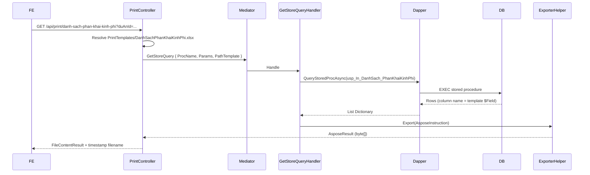

# Task – Export Excel kết quả phân khai vốn được duyệt (PhanKhaiKinhPhi)

**Pattern tham chiếu:** `PrintController` + `GetStoreQuery` + Aspose template (`PrintTemplates/`)  
**Hướng dẫn kỹ thuật:** [`QLDA.WebApi/PrintTemplates/huong-dan.md`](../../../QLDA.WebApi/PrintTemplates/huong-dan.md)  
**Module gốc:** UC40 — Issue #9467 (`docs/issues/9467/report.md`)  
**Trạng thái:** Chưa implement — doc này là checklist triển khai end-to-end

---

## 1. Phân tích yêu cầu

### 1.1 Nghiệp vụ

Các vai trò sau có thể **kết xuất Excel** danh sách **kết quả phân khai vốn đã được duyệt**:

| Vai trò | Ghi chú |
|---------|---------|
| CB.PCT | Cán bộ Phòng Chủ trì |
| LĐ.PCT | Lãnh đạo Phòng Chủ trì |
| GĐ / PGĐ | Ban Giám đốc |
| CB.PKH-TC | Cán bộ Phòng Kế hoạch – Tài chính |
| LĐ.PKH-TC | Lãnh đạo Phòng Kế hoạch – Tài chính |

**Phạm vi dữ liệu export:** chỉ bản ghi `PhanKhaiKinhPhi` có trạng thái **Đã duyệt** (`Ma = ĐD`, `Loai = PhanKhaiKinhPhi`).

**Giao diện tham chiếu (cột grid):**

| # | Cột UI | Nguồn dữ liệu đề xuất | Ghi chú |
|---|--------|------------------------|---------|
| 1 | Số tờ trình | `SoToTrinh` | |
| 2 | Trích yếu | `ThuyetMinh` | Nếu BA xác nhận hiển thị tên dự án → dùng `DuAn.Ten` alias `TrichYeu` |
| 3 | Nguồn | `TenNguonVon` | JOIN `DmNguonVon` |
| 4 | KP đề xuất (tr) | `KinhPhiDeXuat` | Chia `/ 1_000_000`, format `#,##0.000` |
| 5 | KP phân khai (tr) | `KinhPhiPhanKhai` | Chia `/ 1_000_000`, format `#,##0.000` |
| 6 | Trạng thái | `TenTrangThai` | Luôn = "Đã duyệt" khi export theo yêu cầu |

> **Lưu ý đơn vị:** DB lưu `decimal(18,2)` (đồng). UI hiển thị **triệu đồng (tr)** — format ở stored procedure hoặc template Excel.

### 1.2 Việc cần làm

| # | Hạng mục | Layer | Ghi chú |
|---|----------|-------|---------|
| 1 | Tạo file template Excel | `QLDA.WebApi/PrintTemplates/` | Copy `DanhSachBaoCaoTienDo.xlsx` (hoặc `BaoCaoTienDoDuAn.xlsx`) rồi chỉnh layout theo mock BA |
| 2 | Tạo stored procedure | DB (ngoài EF migration) | `usp_In_DanhSach_PhanKhaiKinhPhi` |
| 3 | Thêm endpoint export | `PrintController` | `GET api/print/danh-sach-phan-khai-kinh-phi` |
| 4 | Thêm search model | `QLDA.WebApi/Models/` | Filter giống màn danh sách + `HiddenColumns` |
| 5 | FE gọi API + phân quyền nút Export | Frontend | Truyền cùng `duAnId`, `globalFilter` như `danh-sach` |

### 1.3 API bị ảnh hưởng / mới

| Method | Endpoint | Mô tả |
|--------|----------|-------|
| GET | `/api/print/danh-sach-phan-khai-kinh-phi` | **Mới** — trả file `.xlsx` |
| GET | `/api/phan-khai-kinh-phi/danh-sach` | Không đổi — FE dùng song song để hiển thị grid |

---

## 2. Kiến trúc export (theo PrintController hiện có)

### 2.1 Luồng xử lý



### 2.2 Quy ước template (từ `huong-dan.md`)

1. **Placeholder hàng dữ liệu:** dòng mẫu trong Excel dùng `$TenCot` — ví dụ `$SoToTrinh`, `$TrichYeu`, `$TenNguonVon`.
2. **Tên cột SP = tên placeholder (bỏ `$`):** SP phải `SELECT` alias trùng tên: `SoToTrinh`, `TrichYeu`, `TenNguonVon`, …
3. **Placeholder header (tùy chọn):** `$TenDuAn`, `$NgayXuat` — set qua `PlaceholderReplacements` nếu dùng `ExportWithOutline`; với `GetStoreQuery` thường để cố định trong template hoặc thêm 1 dòng header tĩnh.
4. **STT tự động:** nếu template có cột `$Stt` hoặc `$Index` mà SP không trả về, `ExporterHelper` tự gán `1, 2, 3…`
5. **Ẩn cột:** FE truyền `hiddenColumns` (giống các export danh sách khác) → BE xóa cột trước khi fill.

**Cần nhắn dev nếu muốn:**
- Đổi tên stored procedure
- Đổi / thêm thứ tự parameters

---

## 3. Stored procedure

### 3.1 Đặt tên & convention

| Thành phần | Giá trị |
|------------|---------|
| Tên SP | `usp_In_DanhSach_PhanKhaiKinhPhi` |
| Template | `DanhSachPhanKhaiKinhPhi.xlsx` |
| Region trong controller | `#region usp_In_DanhSach_PhanKhaiKinhPhi` |

> SP **không** nằm trong EF migration — deploy riêng lên DB (script SQL / DBA).

### 3.2 Parameters (thứ tự khớp object anonymous trong controller)

| Param | Kiểu | Bắt buộc | Mô tả |
|-------|------|----------|-------|
| `@DuAnId` | `uniqueidentifier` | Không | Filter theo dự án (null = tất cả) |
| `@GlobalFilter` | `nvarchar` | Không | Tìm `SoToTrinh`, `TenNguonVon`, `ThuyetMinh`, `DuAn.Ten` |
| `@PageIndex` | `int` | Không | Luôn `0` khi export (lấy hết) |
| `@PageSize` | `int` | Không | Luôn `0` khi export (lấy hết) |

**Tham số cố định trong SP (không cần truyền từ FE):**

```sql
-- Chỉ lấy bản ghi Đã duyệt
AND tt.Ma = N'ĐD'
AND tt.Loai = N'PhanKhaiKinhPhi'
AND pk.IsDeleted = 0
```

### 3.3 SELECT columns (khớp template)

```sql
SELECT
    pk.SoToTrinh,
    ISNULL(pk.ThuyetMinh, da.Ten) AS TrichYeu,   -- xác nhận với BA
    nv.Ten AS TenNguonVon,
    pk.KinhPhiDeXuat / 1000000.0 AS KinhPhiDeXuat,
    pk.KinhPhiPhanKhai / 1000000.0 AS KinhPhiPhanKhai,
    tt.Ten AS TenTrangThai
FROM PhanKhaiKinhPhi pk
INNER JOIN DuAn da ON da.Id = pk.DuAnId AND da.IsDeleted = 0
LEFT JOIN DmNguonVon nv ON nv.Id = pk.NguonVonId
INNER JOIN DmTrangThaiPheDuyet tt ON tt.Id = pk.TrangThaiId
WHERE pk.IsDeleted = 0
  AND tt.Ma = N'ĐD'
  AND tt.Loai = N'PhanKhaiKinhPhi'
  AND (@DuAnId IS NULL OR pk.DuAnId = @DuAnId)
  AND (
        @GlobalFilter IS NULL OR @GlobalFilter = N''
        OR pk.SoToTrinh LIKE N'%' + @GlobalFilter + N'%'
        OR nv.Ten LIKE N'%' + @GlobalFilter + N'%'
        OR pk.ThuyetMinh LIKE N'%' + @GlobalFilter + N'%'
        OR da.Ten LIKE N'%' + @GlobalFilter + N'%'
      )
ORDER BY pk.SoToTrinh;
```

> Điều chỉnh tên bảng DM (`DmNguonVon`, `DmTrangThaiPheDuyet`) theo schema thực tế trên DB.

---

## 4. Template Excel

### 4.1 Tạo file

1. Copy `QLDA.WebApi/PrintTemplates/DanhSachBaoCaoTienDo.xlsx` → `DanhSachPhanKhaiKinhPhi.xlsx`
2. Chỉnh header + dòng mẫu cho giống mock BA (ảnh grid):
   - Tiêu đề báo cáo (hàng 1–3): text tĩnh hoặc placeholder `$TieuDe`
   - Hàng header cột: `STT | Số tờ trình | Trích yếu | Nguồn | KP đề xuất (tr) | KP phân khai (tr) | Trạng thái`
   - **Một dòng** chứa marker: `$Stt | $SoToTrinh | $TrichYeu | $TenNguonVon | $KinhPhiDeXuat | $KinhPhiPhanKhai | $TenTrangThai`
3. Format số triệu đồng ở dòng mẫu (`#,##0.000`) — `ExporterHelper` copy format xuống các dòng data.

### 4.2 Đăng ký trong project

Folder `PrintTemplates` đã được copy khi build (`QLDA.WebApi.csproj`):

```xml
<None Include="PrintTemplates\**\*.*">
    <CopyToOutputDirectory>PreserveNewest</CopyToOutputDirectory>
</None>
```

Không cần sửa csproj trừ khi muốn thêm `<None Update="PrintTemplates\DanhSachPhanKhaiKinhPhi.xlsx">` riêng (tùy chọn).

---

## 5. Code changes

### 5.1 Search model (WebApi)

**File mới:** `QLDA.WebApi/Models/PhanKhaiKinhPhis/PhanKhaiKinhPhiPrintSearchModel.cs`

```csharp
namespace QLDA.WebApi.Models.PhanKhaiKinhPhis;

/// <summary>
/// Search model cho print/export phân khai kinh phí — không phân trang
/// </summary>
public record PhanKhaiKinhPhiPrintSearchModel {
    public Guid? DuAnId { get; set; }
    public string? GlobalFilter { get; set; }
    public List<string>? HiddenColumns { get; set; }
}
```

> Theo rule DTO: **không** tạo mapping entity ở WebApi — chỉ search params cho print.

### 5.2 PrintController endpoint

**File:** `QLDA.WebApi/Controllers/PrintController.cs`

Thêm `using QLDA.WebApi.Models.PhanKhaiKinhPhis;` và region mới (copy pattern `InBaoCaoTienDo`):

```csharp
#region usp_In_DanhSach_PhanKhaiKinhPhi

/// <summary>
/// usp_In_DanhSach_PhanKhaiKinhPhi - DanhSachPhanKhaiKinhPhi.xlsx
/// Export kết quả phân khai vốn đã duyệt
/// </summary>
[HttpGet("api/print/danh-sach-phan-khai-kinh-phi")]
[ProducesResponseType(StatusCodes.Status200OK)]
public async Task<IActionResult> InPhanKhaiKinhPhi([FromQuery] PhanKhaiKinhPhiPrintSearchModel searchModel) {
    var fileNameTemplate = "DanhSachPhanKhaiKinhPhi.xlsx";
    var procedureName = "usp_In_DanhSach_PhanKhaiKinhPhi";
    var templatePath = Path.Combine(
        AppContext.BaseDirectory,
        "PrintTemplates",
        fileNameTemplate
    );

    ManagedException.ThrowIf(!System.IO.File.Exists(templatePath), "Không tìm thấy file template");

    ManagedException.ThrowIf(_userProvider.Id == 0, "Vui lòng đăng nhập");

    var query = new GetStoreQuery() {
        PathTemplate = templatePath,
        ProcName = procedureName,
        Params = new {
            searchModel.DuAnId,
            searchModel.GlobalFilter,
            PageIndex = 0,
            PageSize = 0,
        },
        HiddenColumns = searchModel.HiddenColumns
    };
    var exportResult = await Mediator.Send(query);

    return new FileContentResult(exportResult.FileBytes, exportResult.ContentType) {
        FileDownloadName = GetDownloadFileName(fileNameTemplate)
    };
}

#endregion
```

**Điểm giống các endpoint hiện có:**

| Pattern | Ví dụ tham chiếu |
|---------|------------------|
| `GetStoreQuery` + Dapper SP | `InBaoCaoTienDo` (dòng 335–370) |
| `PageIndex = 0`, `PageSize = 0` | Export full list |
| `GetDownloadFileName` | Tên file có timestamp `ddMMyyyy_HHmmss` |
| Check đăng nhập | `InBaoCaoTienDo`, `InGoiThau` (một số không check — nên check cho feature mới) |

**Không dùng** `ExportWithOutline` — chỉ dùng khi có cây phân cấp (`InQuyTrinhTrinhDuAn`).

### 5.3 Application layer

**Không bắt buộc** thêm Query riêng nếu dùng `GetStoreQuery` (đã có sẵn `QLDA.Application/Common/Queries/GetStoreQuery.cs`).

Chỉ cần thêm Application query/DTO nếu team chọn hướng **LINQ + IExporterHelper** thay vì SP (không khuyến nghị — lệch pattern PrintController hiện tại).

---

## 6. API contract (FE / QA)

### 6.1 Request

```http
GET /api/print/danh-sach-phan-khai-kinh-phi?duAnId={guid}&globalFilter={text}
Authorization: Bearer {token}
```

| Query param | Kiểu | Mô tả |
|-------------|------|-------|
| `duAnId` | `Guid?` | Giống `GET /api/phan-khai-kinh-phi/danh-sach` |
| `globalFilter` | `string?` | Giống danh sách |
| `hiddenColumns` | `string[]` | Tên field ẩn cột (optional) — ví dụ `hiddenColumns=TenTrangThai` |

### 6.2 Response

| HTTP | Content-Type | Body |
|------|--------------|------|
| 200 | `application/vnd.openxmlformats-officedocument.spreadsheetml.sheet` | File binary |
| 400 | `application/json` | `{ "result": false, "errorMessage": "Không tìm thấy file template" }` |
| 401 | — | Chưa đăng nhập |

**Tên file tải về:** `DanhSachPhanKhaiKinhPhi_ddMMyyyy_HHmmss.xlsx`

### 6.3 Gợi ý tích hợp FE

```typescript
// Cùng filter với grid
const params = new URLSearchParams({
  ...(duAnId && { duAnId }),
  ...(globalFilter && { globalFilter }),
});
window.open(`/api/print/danh-sach-phan-khai-kinh-phi?${params}`, '_blank');
// hoặc fetch + blob download nếu cần header Authorization
```

**Phân quyền nút Export:** chỉ hiện với role CB.PCT, LĐ.PCT, GĐ/PGĐ, CB.PKH-TC, LĐ.PKH-TC (map claim/policy theo cấu hình `CauHinhVaiTroQuyen`).

---

## 7. Checklist triển khai

### Bước 1 — Template & DB

- [ ] Copy & chỉnh `DanhSachPhanKhaiKinhPhi.xlsx` trong `PrintTemplates/`
- [ ] Xác nhận với BA: cột **Trích yếu** = `ThuyetMinh` hay `DuAn.Ten`
- [ ] Tạo & chạy script `usp_In_DanhSach_PhanKhaiKinhPhi` trên DB dev/staging
- [ ] Test SP thủ công: chỉ trả bản ghi `ĐD`, đúng filter `DuAnId` / `GlobalFilter`

### Bước 2 — Backend

- [ ] Thêm `PhanKhaiKinhPhiPrintSearchModel.cs`
- [ ] Thêm endpoint `InPhanKhaiKinhPhi` vào `PrintController`
- [ ] `dotnet build QLDA.WebApi`
- [ ] Gọi API swagger / Postman → file Excel tải được, dữ liệu khớp grid

### Bước 3 — Frontend

- [ ] Nút **Kết xuất Excel** trên màn Phân khai kinh phí
- [ ] Ẩn nút theo role
- [ ] Truyền filter hiện tại của grid

### Bước 4 — Kiểm thử

| Case | Kỳ vọng |
|------|---------|
| Có bản ghi Đã duyệt | File có đủ dòng, đúng cột |
| Không có bản ghi Đã duyệt | File chỉ có header (0 dòng data) |
| Filter `duAnId` | Chỉ dự án đó |
| `globalFilter` | Khớp tìm kiếm grid |
| Chưa login | 400/401 "Vui lòng đăng nhập" |
| Thiếu template | 400 "Không tìm thấy file template" |
| User không có quyền (nếu bổ sung policy) | 403 |

---

## 8. Files liên quan

| Layer | File | Vai trò |
|-------|------|---------|
| Guide | `QLDA.WebApi/PrintTemplates/huong-dan.md` | Quy ước `$Field`, setup Aspose |
| Controller | `QLDA.WebApi/Controllers/PrintController.cs` | Endpoint export |
| Query chung | `QLDA.Application/Common/Queries/GetStoreQuery.cs` | Gọi SP + Aspose |
| Export engine | `BuildingBlocks.Infrastructure/Offices/ExcelHelper.cs` | Fill template |
| CRUD | `QLDA.WebApi/Controllers/PhanKhaiKinhPhiController.cs` | Grid data |
| Entity | `QLDA.Domain/Entities/PhanKhaiKinhPhi.cs` | Bảng nguồn |
| List query | `QLDA.Application/PhanKhaiKinhPhis/Queries/PhanKhaiKinhPhiGetDanhSachQuery.cs` | Logic filter tham chiếu |
| UC40 doc | `docs/issues/9467/report.md` | Context nghiệp vụ |

---

## 9. Rủi ro & lưu ý

| Rủi ro | Mức | Cách xử lý |
|--------|-----|------------|
| SP chưa deploy lên môi trường | Cao | Checklist deploy DB kèm release BE |
| Tên cột SP ≠ placeholder template | Cao | Test 1 dòng — cột trống = sai tên alias |
| Đơn vị tiền (đồng vs triệu) | Trung bình | Thống nhất format ở SP hoặc template |
| Phân quyền chỉ ở FE | Trung bình | Cân nhắc `[Authorize]` / policy trên endpoint nếu cần |
| Load lớn khi export full | Thấp | `PageSize = 0` lấy hết — monitor nếu data lớn |

---

## 10. Tham chiếu nhanh — Endpoint PrintController hiện có

| Endpoint | Template | Stored procedure |
|----------|----------|------------------|
| `GET api/print/danh-sach-bao-cao-tien-do` | `DanhSachBaoCaoTienDo.xlsx` | `usp_In_DanhSach_BaoCaoTienDo` |
| `GET api/print/danh-sach-goi-thau` | `DanhSachGoiThau.xlsx` | `usp_In_DanhSach_GoiThau` |
| `GET api/print/bao-cao-tien-do-du-an` | `BaoCaoTienDoDuAn.xlsx` | `usp_In_BaoCao_TienDo_DuAn` |
| **`GET api/print/danh-sach-phan-khai-kinh-phi`** | **`DanhSachPhanKhaiKinhPhi.xlsx`** | **`usp_In_DanhSach_PhanKhaiKinhPhi`** |
