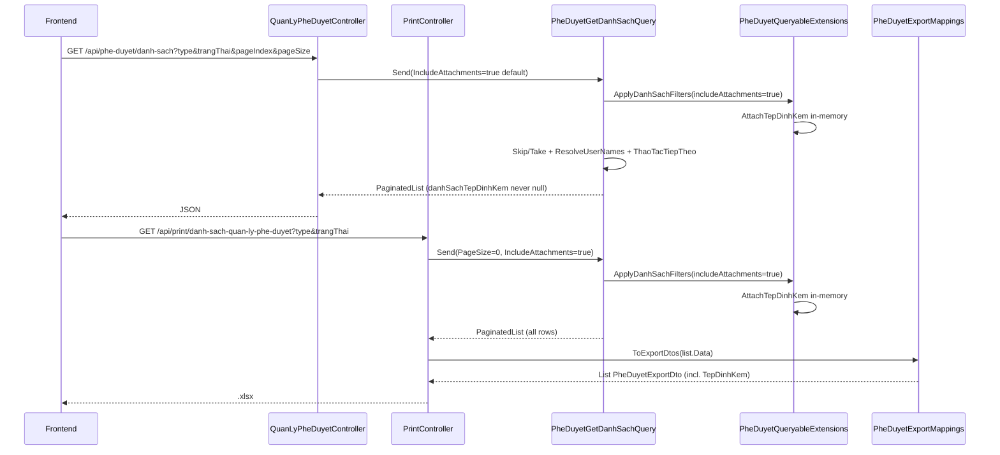

# Task – Export Excel màn hình Quản lý phê duyệt

**Ngày tạo:** 10/07/2026  
**Cập nhật:** 21/07/2026  
**Trạng thái:** ✅ **IMPLEMENTED** — export + cột tệp đính kèm; template là SOT layout  
**Module:** `QuanLyPheDuyet`  
**Màn hình:** Quản lý dự án → Quản lý phê duyệt (`/quan-ly-du-an/quan-ly-phe-duyet`)  
**Pattern tham chiếu:**
- Danh sách: `PheDuyetGetDanhSachQuery`, `PheDuyetListItemDto`
- Filter dùng chung: `PheDuyetQueryableExtensions.ApplyDanhSachFilters`
- Map export: `PheDuyetExportMappings.ToExportDtos`
- Export flat (Aspose): `PrintController.InDanhSachQuanLyPheDuyet`
- Export + test: `PheDuyetExportTests`, `PheDuyetExportMappingsTests`
- Workflow nghiệp vụ: [docs/workflow-quan-ly-phe-duyet.md](../../workflow-quan-ly-phe-duyet.md)
- Design template-driven: [docs/superpowers/specs/2026-07-14-export-template-driven-quan-ly-phe-duyet-design.md](../../superpowers/specs/2026-07-14-export-template-driven-quan-ly-phe-duyet-design.md)

**Liên quan:** [task-export-excel-ban-giao-ho-so.md](../BanGiaoHoSo/task-export-excel-ban-giao-ho-so.md), [task-export-excel-noi-dung-da-ky.md](../KySo/task-export-excel-noi-dung-da-ky.md)

---

## Executive Summary

Bổ sung **xuất Excel danh sách phê duyệt** trên màn hình **Quản lý phê duyệt**. Dữ liệu export **khớp** API danh sách, dùng **cùng query** `PheDuyetGetDanhSachQuery` + **cùng logic lọc** `type` / `trangThai`, **không phân trang** (`PageSize = 0`).

| Hạng mục | Mô tả |
|----------|--------|
| API danh sách | `GET /api/phe-duyet/danh-sach` |
| API export | `GET /api/print/danh-sach-quan-ly-phe-duyet` |
| Nguồn dữ liệu export | `PheDuyetGetDanhSachQuery` (PageSize=0) → `PheDuyetExportMappings` |
| Filter export | `type`, `trangThai` — map từ yêu cầu nghiệp vụ `Loai`, `TrangThai` |
| Filter dùng chung | `PheDuyetQueryableExtensions.ApplyDanhSachFilters` |
| Cột tệp đính kèm | `$TepDinhKem` — tên file ghép nhiều dòng (wrap text) |

**Không sửa migration.** **Không tạo model/DTO trong WebApi.** **Không tạo Service trong Application layer.**

---

## Template là nguồn cấu hình layout (SOT)

Runtime export **không** đọc `DanhSachQuanLyPheDuyetExportDescriptor.Columns`
để sắp cột / width / align. Engine (`ExporterHelper`) đọc placeholder `$Field`
trên `PrintTemplates/DanhSachQuanLyPheDuyet.xlsx`.

| Muốn | Làm |
|------|-----|
| Đổi thứ tự cột | Sửa hàng header (R4) + hàng `$Field` (R5) trong `.xlsx` |
| Đổi canh lề / width / font / border | Format trong Excel |
| Thêm cột đã có trên DTO | Thêm header + `$PropertyName` trong template |
| Thêm dữ liệu mới | Thêm property `PheDuyetExportDto` + map trong `PheDuyetExportMappings` + `$Field` trên template |
| Chạy Gen `--force` | **Bị chặn** (`HandMaintainedTemplate = true`) |

**Không** hard-code `ColumnAlign` / width / thứ tự layout trong descriptor.

**Layout hiện tại (R4 header / R5 placeholder):**

| Cột | Header | Placeholder |
|-----|--------|-------------|
| A | STT | `$Stt` |
| B | Dự án | `$TenDuAn` |
| C | Giai đoạn | `$TenGiaiDoan` |
| D | Tên bước | `$TenBuoc` |
| E | Người trình | `$NguoiTrinh` |
| F | Người duyệt | `$NguoiDuyet` |
| G | Trạng thái | `$TenTrangThai` |
| H | Tệp đính kèm | `$TepDinhKem` |

Merge letterhead: `A1:D2`, `E1:H2`, title `A3:H3`.

---

## 1. Hiện trạng source (sau implement)

### 1.1 API danh sách

```http
GET /api/phe-duyet/danh-sach
  ?duAnId=
  &type=
  &trangThai=
  &globalFilter=
  &pageIndex=
  &pageSize=
```

| Thành phần | File |
|------------|------|
| Controller | `QLDA.WebApi/Controllers/QuanLyPheDuyetController.cs` |
| Query handler | `QLDA.Application/QuanLyPheDuyet/Queries/PheDuyetGetDanhSachQuery.cs` |
| Filter dùng chung | `QLDA.Application/QuanLyPheDuyet/Queries/PheDuyetQueryableExtensions.cs` |
| Response DTO | `QLDA.Application/QuanLyPheDuyet/DTOs/PheDuyetListItemDto.cs` |

**Query param nội bộ (MediatR, không expose qua controller):**

| Property | Mặc định | Mô tả |
|----------|----------|--------|
| `IncludeAttachments` | `true` | `true` → load tệp in-memory; `false` → `DanhSachTepDinhKem = []`, không query DB file |

Frontend **không cần** truyền `IncludeAttachments` — mặc định luôn trả danh sách tệp (hoặc `[]`).

### 1.2 API export

```http
GET /api/print/danh-sach-quan-ly-phe-duyet
  ?type=
  &trangThai=
```

| Thành phần | File |
|------------|------|
| Controller | `QLDA.WebApi/Controllers/PrintController.cs` → `InDanhSachQuanLyPheDuyet` |
| Query (cùng list) | `PheDuyetGetDanhSachQuery` — `PageSize = 0`, `IncludeAttachments = true` |
| Map export | `QLDA.Application/QuanLyPheDuyet/PheDuyetExportMappings.cs` |
| Export DTO | `QLDA.Application/QuanLyPheDuyet/DTOs/PheDuyetExportDto.cs` |
| Template | `QLDA.WebApi/PrintTemplates/DanhSachQuanLyPheDuyet.xlsx` |
| Gen descriptor (catalog) | `QLDA.Gen/Descriptors/DanhSachQuanLyPheDuyetExportDescriptor.cs` |

> **Lưu ý:** Không còn `PheDuyetGetDanhSachExportQuery` — export tái sử dụng trực tiếp `PheDuyetGetDanhSachQuery`.

```csharp
// PrintController.InDanhSachQuanLyPheDuyet
var list = await Mediator.Send(new PheDuyetGetDanhSachQuery {
    Type = type,
    TrangThai = trangThai,
    PageIndex = 1,
    PageSize = 0,              // lấy hết
    IncludeAttachments = true, // cần cho cột $TepDinhKem
}, cancellationToken);

var data = PheDuyetExportMappings.ToExportDtos(list.Data);
```

### 1.3 Map tên param (nghiệp vụ ↔ API)

| UI / spec nghiệp vụ | Query param API | Ví dụ |
|---------------------|-----------------|-------|
| Loại | `type` | `PheDuyetDuToan`, `ToTrinhKeHoach` |
| Trạng thái (mã) | `trangThai` | `ĐTr`, `ĐD`, `DT` |

> **Quan trọng:** Filter trạng thái dùng **mã** (`TrangThai.Ma`), không phải tên hiển thị.

| UI hiển thị | Param `trangThai` |
|-------------|-------------------|
| Đã trình | `ĐTr` |
| Đã duyệt | `ĐD` |
| Dự thảo | `DT` |
| Trả lại | `TL` |
| Từ chối | `TC` |

**Ví dụ chỉ lấy Đã trình:**

```http
GET /api/phe-duyet/danh-sach?trangThai=ĐTr&pageIndex=1&pageSize=50
GET /api/print/danh-sach-quan-ly-phe-duyet?trangThai=ĐTr
```

### 1.4 Logic lọc (`ApplyDanhSachFilters`)

```
PheDuyet (IsDeleted = false)
  → WhereIf type not empty: EntityName == type
  → WhereIf trangThai not empty: TrangThai.Ma == trangThai
  → Inner join DuAn on DuAnId
  → Left join DuAnBuoc on BuocId
  → If NOT HasKhtcBypass: DuAn.LanhDaoPhuTrachId == current UserPortalId
  → Select PheDuyetListItemDto (KHÔNG subquery TepDinhKem trong EF Select)
  → OrderByDescending(UpdatedAt)
  → ToList()
  → if includeAttachments: AttachTepDinhKem (batch in-memory)
     else: DanhSachTepDinhKem = [] cho mọi dòng
  → [List] Skip/Take → PaginatedList + ResolveUserNames + ThaoTacTiepTheo
  → [Export] PheDuyetExportMappings.ToExportDtos
```

| Filter | Điều kiện |
|--------|-----------|
| `type` | `e.EntityName == type` khi param không rỗng |
| `trangThai` | `e.TrangThai.Ma == trangThai` khi param không rỗng |
| Cả hai | AND |
| Phân quyền | `HasKhtcBypass` hoặc `LanhDaoPhuTrachId == userId` |

**Chưa áp dụng** (có trên query record nhưng không dùng trong nhánh hiện tại): `duAnId`, `globalFilter`. Export **không** tự thêm 2 filter này.

### 1.5 Tệp đính kèm (API list + export)

**Liên kết file:**

```text
Attachment.GroupId == PheDuyet.EntityId.ToString()
```

- `EntityId` trên bảng `PheDuyet` là `Guid` → chuỗi dạng `"08ded4c9-2194-2ddf-b3bf-2f1810035a0a"`.
- Không parse cứng Guid/long — luôn so sánh qua `.ToString()` trên `EntityId`.

**Contract API danh sách (`PheDuyetListItemDto`):**

| Trường hợp | `danhSachTepDinhKem` |
|------------|----------------------|
| Có file | `[{ id, groupId, fileName, ... }]` |
| Không có file | `[]` |
| `IncludeAttachments = false` | `[]` (không query DB) |
| **Không được** | `null` |

Property DTO: `List<TepDinhKemDto> DanhSachTepDinhKem { get; set; } = []`.

**Load pattern (`PheDuyetQueryableExtensions`):**

1. EF projection **không** embed subquery file (tránh lệch số dòng list/export).
2. Sau `ToList()`, `AttachTepDinhKem` batch query `groupIds.Contains(Attachment.GroupId)`.
3. `AssignAttachments` gán theo `EntityId` ↔ `GroupId` (case-insensitive).
4. Không match → `[]`.

**Map export cột `$TepDinhKem` (`PheDuyetExportMappings.FormatTepDinhKem`):**

- Lấy `OriginalName`, fallback `FileName`.
- Nhiều file → ghép bằng `Environment.NewLine` (Excel wrap text trên cột H).
- Không có file → chuỗi rỗng `""`.

### 1.6 Resolve tên người (list + export)

Cả list và export đều resolve tên qua `PheDuyetGetDanhSachQueryHandler.ResolveUserNamesAsync`:

| Cột | Nguồn ID | Join |
|-----|----------|------|
| Người trình | `NguoiTrinhId` | `UserMaster.UserPortalId` |
| Người duyệt | `NguoiDuyetId` (chỉ khi `Ma == "ĐD"`) | `UserMaster.UserPortalId` |

### 1.7 Cột Excel (`PheDuyetExportDto`)

| # | Cột UI | Property | Placeholder | Nguồn |
|---|--------|----------|-------------|-------|
| 1 | STT | `Stt` | `$Stt` | Index + 1 khi map |
| 2 | Dự án | `TenDuAn` | `$TenDuAn` | `PheDuyetListItemDto.TenDuAn` |
| 3 | Giai đoạn | `TenGiaiDoan` | `$TenGiaiDoan` | `TenGiaiDoan` |
| 4 | Tên bước | `TenBuoc` | `$TenBuoc` | `TenBuoc` |
| 5 | Người trình | `NguoiTrinh` | `$NguoiTrinh` | Resolve `UserMaster` |
| 6 | Người duyệt | `NguoiDuyet` | `$NguoiDuyet` | Resolve `UserMaster` |
| 7 | Trạng thái | `TenTrangThai` | `$TenTrangThai` | `TenTrangThai` |
| 8 | Tệp đính kèm | `TepDinhKem` | `$TepDinhKem` | `FormatTepDinhKem(DanhSachTepDinhKem)` |

**Không export:** icon đính kèm, thao tác, Id, BuocId, DuAnId, EntityId…

---

## 2. Sơ đồ luồng



---

## 3. Bug đã xử lý

### 3.1 Lệch số dòng list vs export (36 vs 35)

**Nguyên nhân:** Subquery `TepDinhKem` trong EF `Select` — SQL/plan khác khi bật/tắt file.

**Fix:** Tách `AttachTepDinhKem` ra sau `ToList()`; EF query giống nhau cho list và export.

### 3.2 `danhSachTepDinhKem = null` sau refactor (regression API)

**Triệu chứng:** API list trả `"danhSachTepDinhKem": null` thay vì `[]` hoặc danh sách file.

**Nguyên nhân:** Projection hardcode `DanhSachTepDinhKem = null`; nhánh `includeAttachments=false` không gán `[]`.

**Fix:**

- Bỏ gán `null` trong EF Select.
- `EnsureEmptyAttachments()` khi không load file.
- DTO default `DanhSachTepDinhKem = []`.
- `IncludeAttachments` mặc định `true`.

### 3.3 Export thiếu cột Tệp đính kèm

**Triệu chứng:** Template có `$TepDinhKem` nhưng Excel trống cột H.

**Nguyên nhân:** `PheDuyetExportDto` thiếu property; export gọi `IncludeAttachments = false`; chưa map tên file.

**Fix:**

- Thêm `TepDinhKem` vào `PheDuyetExportDto`.
- Export `IncludeAttachments = true`.
- `PheDuyetExportMappings.FormatTepDinhKem`.
- Cập nhật template + descriptor catalog.

### 3.4 Test parity

**File:** `QLDA.Tests/Integration/PheDuyetExportTests.cs`

- `ExportPheDuyet_UnpagedCountMatchesListTotal_WhenSameFilter` — cùng filter → cùng số dòng.
- `Handler_GetDanhSach_DefaultIncludeAttachments_NeverReturnsNullAttachmentList`.
- `Handler_GetDanhSach_IncludeAttachmentsFalse_ReturnsEmptyNotNull`.

**File:** `QLDA.Tests/Unit/PheDuyetExportMappingsTests.cs`

- Map `TepDinhKem` từ `OriginalName` / fallback `FileName`.
- Nhiều file → xuống dòng.

**File:** `QLDA.Tests/Unit/PheDuyetQueryableExtensionsAttachmentTests.cs`

- Match `GroupId` ↔ `EntityId.ToString()` (Guid, long-as-string).
- Không có file → `[]`.

---

## 4. Checklist implement

### Application layer

- [x] `PheDuyetQueryableExtensions.cs` — `ApplyDanhSachFilters`, `AttachTepDinhKem`, `AssignAttachments`, `EnsureEmptyAttachments`
- [x] `PheDuyetGetDanhSachQuery.cs` — dùng extension; `IncludeAttachments` default `true`
- [x] `PheDuyetListItemDto.cs` — `DanhSachTepDinhKem` non-null default `[]`
- [x] `PheDuyetExportDto.cs` — incl. `TepDinhKem`
- [x] `PheDuyetExportMappings.cs` — `ToExportDtos` + `FormatTepDinhKem`
- [ ] `PheDuyetSearchDto.cs` — **bỏ qua** (bind trực tiếp trên controller)
- [x] ~~`PheDuyetGetDanhSachExportQuery.cs`~~ — **đã gộp** vào `PheDuyetGetDanhSachQuery`

### WebApi layer

- [x] `PrintController` — `InDanhSachQuanLyPheDuyet` (IncludeAttachments=true)
- [x] `PrintTemplates/DanhSachQuanLyPheDuyet.xlsx` — 8 cột incl. `$TepDinhKem`

### QLDA.Gen

- [x] `DanhSachQuanLyPheDuyetExportDescriptor.cs` — catalog incl. `TepDinhKem`
- [x] Slug `danh-sach-quan-ly-phe-duyet` trong `Program.cs`

### Tests

- [x] `PheDuyetExportTests.cs` — smoke + attachment contract + parity
- [x] `PheDuyetExportMappingsTests.cs` — unit map cột tệp
- [x] `PheDuyetQueryableExtensionsAttachmentTests.cs` — unit match GroupId
- [ ] Verify thủ công trên DB production sau deploy

### Không sửa (đã tuân thủ)

- [x] Migration / `AppDbContextModelSnapshot.cs`
- [x] Model/DTO trong `QLDA.WebApi/Models/`
- [x] `Application/Services/*`

---

## 5. Test plan

### 5.1 Export Excel

| # | Request | Kỳ vọng |
|---|---------|---------|
| 1 | Không filter | Số dòng Excel = `totalRows` `/danh-sach` (cùng user) |
| 2 | `type=PheDuyetDuToan` | Chỉ loại đó |
| 3 | `trangThai=ĐTr` | Chỉ Đã trình — số dòng UI = số dòng Excel |
| 4 | `type` + `trangThai` | AND cả hai |
| 5 | Filter không match | HTTP 400, `"Không có dữ liệu để xuất"` |
| 6 | > 10 bản ghi | Export đủ, không cắt theo pageSize |
| 7 | Thứ tự | Khớp list (`OrderByDescending UpdatedAt`) |
| 8 | Cột | **8 cột** incl. Tệp đính kèm |
| 9 | `NguoiDuyet` | Chỉ có tên khi `MaTrangThai == "ĐD"` |
| 10 | `TepDinhKem` | Tên file; nhiều file xuống dòng; rỗng nếu không có |
| 11 | File | Mở được, không lỗi format |

### 5.2 API danh sách — tệp đính kèm

| # | Kỳ vọng |
|---|---------|
| 1 | Không truyền `IncludeAttachments` → vẫn load file (default `true`) |
| 2 | Có file → `danhSachTepDinhKem` là mảng có phần tử |
| 3 | Không có file → `danhSachTepDinhKem: []` |
| 4 | Không được trả `null` |

### 5.3 Postman smoke

```http
GET /api/phe-duyet/danh-sach?trangThai=ĐTr&pageIndex=1&pageSize=100
GET /api/print/danh-sach-quan-ly-phe-duyet?trangThai=ĐTr
```

So sánh: `totalRows` (list) = số dòng dữ liệu Excel.

### 5.4 Regression

- [x] `GET /api/phe-duyet/danh-sach` — contract tệp đính kèm giữ backward compatible
- [ ] Verify trên môi trường deploy

---

## 6. Frontend (tích hợp)

| Hành động UI | API / param |
|--------------|-------------|
| Load grid | `GET /api/phe-duyet/danh-sach` + `type`, `trangThai`, `pageIndex`, `pageSize` |
| Nút **Xuất Excel** | `GET /api/print/danh-sach-quan-ly-phe-duyet` — **cùng** `type` + `trangThai`, **không** gửi paging |

```typescript
const params = {
  type: filter.loai,           // EntityName từ combobox Loại (optional)
  trangThai: filter.trangThai, // Mã: 'ĐTr', 'ĐD', 'DT'... — KHÔNG gửi text "Đã trình"
};

// Grid — không cần IncludeAttachments
await api.get('/api/phe-duyet/danh-sach', {
  params: { ...params, pageIndex: 1, pageSize: 50 },
});

// Export — CÙNG params, bỏ pageIndex/pageSize
const response = await api.get('/api/print/danh-sach-quan-ly-phe-duyet', {
  params,
  responseType: 'blob',
});
```

**Lỗi thường gặp FE:**

| Sai | Đúng |
|-----|------|
| `trangThai=Đã trình` | `trangThai=ĐTr` |
| Export không gửi `trangThai` khi grid đang lọc | Gửi đúng param đang filter |
| Gửi `pageSize=10` khi export | Không gửi paging |
| Xử lý `danhSachTepDinhKem` chỉ khi non-null | Luôn là array — dùng `?.length` hoặc `?? []` phòng hờ |

---

## 7. Files đã tạo / sửa

| File | Hành động |
|------|-----------|
| `QLDA.Application/QuanLyPheDuyet/Queries/PheDuyetQueryableExtensions.cs` | Tạo + fix attachment in-memory |
| `QLDA.Application/QuanLyPheDuyet/Queries/PheDuyetGetDanhSachQuery.cs` | Refactor extension; `IncludeAttachments` default |
| `QLDA.Application/QuanLyPheDuyet/DTOs/PheDuyetListItemDto.cs` | `DanhSachTepDinhKem` non-null |
| `QLDA.Application/QuanLyPheDuyet/DTOs/PheDuyetExportDto.cs` | + `TepDinhKem` |
| `QLDA.Application/QuanLyPheDuyet/PheDuyetExportMappings.cs` | Map export incl. tệp |
| `QLDA.WebApi/Controllers/PrintController.cs` | Export qua `PheDuyetGetDanhSachQuery` |
| `QLDA.WebApi/PrintTemplates/DanhSachQuanLyPheDuyet.xlsx` | 8 cột incl. Tệp đính kèm |
| `QLDA.Gen/Descriptors/DanhSachQuanLyPheDuyetExportDescriptor.cs` | Catalog + `TepDinhKem` |
| `QLDA.Tests/Integration/PheDuyetExportTests.cs` | Integration tests |
| `QLDA.Tests/Unit/PheDuyetExportMappingsTests.cs` | Unit map tệp |
| `QLDA.Tests/Unit/PheDuyetQueryableExtensionsAttachmentTests.cs` | Unit match GroupId |

**Regenerate template:**

> Template **hand-maintained**. Không regenerate bằng Gen.
> Chỉnh trực tiếp: `QLDA.WebApi/PrintTemplates/DanhSachQuanLyPheDuyet.xlsx`

```powershell
# Sẽ bị [SKIP] — HandMaintainedTemplate = true (kể cả --force)
dotnet run --project e:\SER\QLDA.Gen\QLDA.Gen.csproj -- danh-sach-quan-ly-phe-duyet --force e:\SER\QLDA.WebApi\PrintTemplates
```

---

## 8. Tham chiếu source

```
QLDA.Application/QuanLyPheDuyet/Queries/PheDuyetQueryableExtensions.cs
QLDA.Application/QuanLyPheDuyet/Queries/PheDuyetGetDanhSachQuery.cs
QLDA.Application/QuanLyPheDuyet/PheDuyetExportMappings.cs
QLDA.Application/QuanLyPheDuyet/DTOs/PheDuyetExportDto.cs
QLDA.Application/QuanLyPheDuyet/DTOs/PheDuyetListItemDto.cs
QLDA.WebApi/Controllers/QuanLyPheDuyetController.cs
QLDA.WebApi/Controllers/PrintController.cs
QLDA.WebApi/PrintTemplates/DanhSachQuanLyPheDuyet.xlsx
QLDA.Gen/Descriptors/DanhSachQuanLyPheDuyetExportDescriptor.cs
QLDA.Tests/Integration/PheDuyetExportTests.cs
QLDA.Tests/Unit/PheDuyetExportMappingsTests.cs
QLDA.Tests/Unit/PheDuyetQueryableExtensionsAttachmentTests.cs
QLDA.Domain/Entities/PheDuyet.cs
QLDA.Domain/Constants/TrangThaiPheDuyetCodes.cs
docs/workflow-quan-ly-phe-duyet.md
```

---

## 9. Changelog

| Version | Ngày | Nội dung |
|---------|------|----------|
| **1.0** | 10/07/2026 | Spec ban đầu |
| **1.1** | 10/07/2026 | **Implemented** — export API, extension, template, tests |
| **1.2** | 10/07/2026 | **Fix** lệch 36/35 dòng — tách `AttachTepDinhKem` khỏi EF Select; test parity; bảng mã `trangThai` |
| **1.3** | 14/07/2026 | Refactor docs + Gen: template-driven SOT; descriptor bỏ width/align; HandMaintainedTemplate |
| **1.4** | 21/07/2026 | Gộp export vào `PheDuyetGetDanhSachQuery`; fix `danhSachTepDinhKem` null → `[]`; thêm cột `$TepDinhKem`; `PheDuyetExportMappings`; unit tests attachment/export map |

---

**Version:** 1.4  
**Trạng thái:** ✅ Implemented — template 8 cột; API list + export đồng bộ tệp đính kèm; chờ verify trên môi trường deploy
