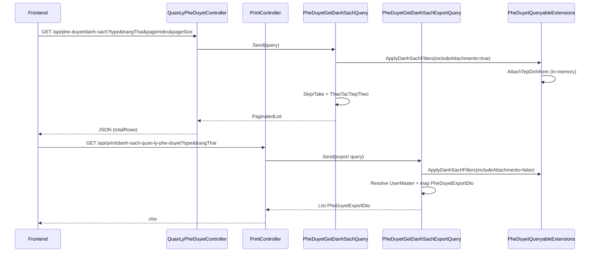

# Task – Export Excel màn hình Quản lý phê duyệt

**Ngày tạo:** 10/07/2026  
**Cập nhật:** 10/07/2026  
**Trạng thái:** ✅ **IMPLEMENTED** — đã code + fix lệch số dòng list/export  
**Module:** `QuanLyPheDuyet`  
**Màn hình:** Quản lý dự án → Quản lý phê duyệt (`/quan-ly-du-an/quan-ly-phe-duyet`)  
**Pattern tham chiếu:**
- Danh sách: `PheDuyetGetDanhSachQuery`, `PheDuyetListItemDto`
- Filter dùng chung: `PheDuyetQueryableExtensions.ApplyDanhSachFilters`
- Export flat (Aspose): `BanGiaoHoSoGetDanhSachExportQuery` + `PrintController`
- Export + test: `NoiDungDaKyGetDanhSachExportQuery`, `NoiDungDaKyExportTests`
- Workflow nghiệp vụ: [docs/workflow-quan-ly-phe-duyet.md](../../workflow-quan-ly-phe-duyet.md)

**Liên quan:** [task-export-excel-ban-giao-ho-so.md](../BanGiaoHoSo/task-export-excel-ban-giao-ho-so.md), [task-export-excel-noi-dung-da-ky.md](../KySo/task-export-excel-noi-dung-da-ky.md)

---

## Executive Summary

Bổ sung **xuất Excel danh sách phê duyệt** trên màn hình **Quản lý phê duyệt**. Dữ liệu export **khớp** API danh sách, dùng **cùng logic lọc** `type` (Loại) và `trangThai` (Trạng thái), **không phân trang**.

| Hạng mục | Mô tả |
|----------|--------|
| API danh sách | `GET /api/phe-duyet/danh-sach` |
| API export | `GET /api/print/danh-sach-quan-ly-phe-duyet` |
| Filter export | `type`, `trangThai` — map từ yêu cầu nghiệp vụ `Loai`, `TrangThai` |
| Filter dùng chung | `PheDuyetQueryableExtensions.ApplyDanhSachFilters` |

**Không sửa migration.** **Không tạo model/DTO trong WebApi.** **Không tạo Service trong Application layer.**

---

## 1. Hiện trạng source (sau implement)

### 1.1 API danh sách

```http
GET /api/phe-duyet/danh-sach
  ?duAnId=
  &type=
  &trangThai=
  &globalFilter=
  &pageIndex=
  &pageSize=
```

| Thành phần | File |
|------------|------|
| Controller | `QLDA.WebApi/Controllers/QuanLyPheDuyetController.cs` |
| Query handler | `QLDA.Application/QuanLyPheDuyet/Queries/PheDuyetGetDanhSachQuery.cs` |
| Filter dùng chung | `QLDA.Application/QuanLyPheDuyet/Queries/PheDuyetQueryableExtensions.cs` |
| Response DTO | `QLDA.Application/QuanLyPheDuyet/DTOs/PheDuyetListItemDto.cs` |

### 1.2 API export

```http
GET /api/print/danh-sach-quan-ly-phe-duyet
  ?type=
  &trangThai=
```

| Thành phần | File |
|------------|------|
| Controller | `QLDA.WebApi/Controllers/PrintController.cs` → `InDanhSachQuanLyPheDuyet` |
| Export query | `QLDA.Application/QuanLyPheDuyet/Queries/PheDuyetGetDanhSachExportQuery.cs` |
| Export DTO | `QLDA.Application/QuanLyPheDuyet/DTOs/PheDuyetExportDto.cs` |
| Template | `QLDA.WebApi/PrintTemplates/DanhSachQuanLyPheDuyet.xlsx` |
| Gen descriptor | `QLDA.Gen/Descriptors/DanhSachQuanLyPheDuyetExportDescriptor.cs` |

### 1.3 Map tên param (nghiệp vụ ↔ API)

| UI / spec nghiệp vụ | Query param API | Ví dụ |
|---------------------|-----------------|-------|
| Loại | `type` | `PheDuyetDuToan`, `ToTrinhKeHoach` |
| Trạng thái (mã) | `trangThai` | `ĐTr`, `ĐD`, `DT` |

> **Quan trọng:** Filter trạng thái dùng **mã** (`TrangThai.Ma`), không phải tên hiển thị.

| UI hiển thị | Param `trangThai` |
|-------------|-------------------|
| Đã trình | `ĐTr` |
| Đã duyệt | `ĐD` |
| Dự thảo | `DT` |
| Trả lại | `TL` |
| Từ chối | `TC` |

**Ví dụ chỉ lấy Đã trình:**

```http
GET /api/phe-duyet/danh-sach?trangThai=ĐTr&pageIndex=1&pageSize=50
GET /api/print/danh-sach-quan-ly-phe-duyet?trangThai=ĐTr
```

### 1.4 Logic lọc (`ApplyDanhSachFilters`)

```
PheDuyet (IsDeleted = false)
  → WhereIf type not empty: EntityName == type
  → WhereIf trangThai not empty: TrangThai.Ma == trangThai
  → Inner join DuAn on DuAnId
  → Left join DuAnBuoc on BuocId
  → If NOT HasKhtcBypass: DuAn.LanhDaoPhuTrachId == current UserPortalId
  → Select PheDuyetListItemDto (KHÔNG subquery TepDinhKem trong EF)
  → OrderByDescending(UpdatedAt)
  → ToList()
  → [List only] AttachTepDinhKem in-memory (batch)
  → [List] Skip/Take → PaginatedList + ThaoTacTiepTheo
  → [Export] map PheDuyetExportDto + resolve UserMaster.HoTen
```

| Filter | Điều kiện |
|--------|-----------|
| `type` | `e.EntityName == type` khi param không rỗng |
| `trangThai` | `e.TrangThai.Ma == trangThai` khi param không rỗng |
| Cả hai | AND |
| Phân quyền | `HasKhtcBypass` hoặc `LanhDaoPhuTrachId == userId` |

**Chưa áp dụng** (có trên query record nhưng không dùng trong nhánh hiện tại): `duAnId`, `globalFilter`. Export **không** tự thêm 2 filter này.

### 1.5 Resolve tên người (export)

API danh sách trả **ID**; export resolve tên trên BE:

| Cột export | Nguồn ID | Join |
|------------|----------|------|
| Người trình | `NguoiTrinhId` | `UserMaster.UserPortalId` (**không** dùng `UserMaster.Id`) |
| Người duyệt | `NguoiDuyetId` (chỉ khi `Ma == "ĐD"`) | `UserMaster.UserPortalId == NguoiXuLyId` |

```csharp
// PheDuyetGetDanhSachExportQueryHandler — batch load
var userMap = await userMaster.GetQueryableSet().AsNoTracking()
    .Where(u => u.UserPortalId != null && portalIds.Contains(u.UserPortalId.Value))
    .ToDictionaryAsync(u => u.UserPortalId!.Value, u => u.HoTen ?? string.Empty);
```

### 1.6 Cột Excel

| # | Cột UI | Property | Placeholder |
|---|--------|----------|-------------|
| 1 | STT | `Stt` | `$Stt` |
| 2 | Dự án | `TenDuAn` | `$TenDuAn` |
| 3 | Giai đoạn | `TenGiaiDoan` | `$TenGiaiDoan` |
| 4 | Tên bước | `TenBuoc` | `$TenBuoc` |
| 5 | Người trình | `NguoiTrinh` | `$NguoiTrinh` |
| 6 | Người duyệt | `NguoiDuyet` | `$NguoiDuyet` |
| 7 | Trạng thái | `TenTrangThai` | `$TenTrangThai` |

**Không export:** icon đính kèm, thao tác, Id, BuocId, DuAnId, EntityId…

---

## 2. Sơ đồ luồng



---

## 3. Bug đã xử lý — lệch số dòng list vs export

### 3.1 Triệu chứng

- UI: **Tổng 36 dòng** (filter `trangThai=ĐTr`)
- Excel export: **35 dòng** (STT 1–35)

### 3.2 Nguyên nhân

Phiên bản đầu: list gọi `ApplyDanhSachFilters` với `includeAttachments: true` — subquery `TepDinhKem` **nằm trong EF `Select`**. Export gọi với `includeAttachments: false` — **SQL/plan EF khác** → số dòng lệch.

### 3.3 Fix (đã áp dụng)

**File:** `PheDuyetQueryableExtensions.cs`

1. EF `Select` **không** chứa subquery `TepDinhKem` — `DanhSachTepDinhKem = null` trong projection.
2. Sau `ToList()`, nếu `includeAttachments == true` → `AttachTepDinhKem()` batch load in-memory theo `EntityId` / `GroupId`.
3. List và export dùng **cùng EF query** → cùng số dòng; chỉ list thêm bước gắn file đính kèm.

### 3.4 Test parity

**File:** `QLDA.Tests/Integration/PheDuyetExportTests.cs`

- `ExportPheDuyet_CountMatchesList_WhenSameFilter` — `export.Count == list.TotalRows` với cùng `trangThai=ĐTr`.

---

## 4. Checklist implement

### Application layer

- [x] `PheDuyetQueryableExtensions.cs` — `ApplyDanhSachFilters` + `AttachTepDinhKem`
- [x] Refactor `PheDuyetGetDanhSachQueryHandler` dùng extension
- [ ] `PheDuyetSearchDto.cs` — **bỏ qua** (bind trực tiếp `type`/`trangThai` trên controller)
- [x] `PheDuyetExportDto.cs`
- [x] `PheDuyetGetDanhSachExportQuery.cs` + Handler

### WebApi layer

- [x] `PrintController` — `InDanhSachQuanLyPheDuyet`
- [x] `PrintTemplates/DanhSachQuanLyPheDuyet.xlsx`

### QLDA.Gen

- [x] `DanhSachQuanLyPheDuyetExportDescriptor.cs`
- [x] Slug `danh-sach-quan-ly-phe-duyet` trong `Program.cs`

### Tests

- [x] `PheDuyetExportTests.cs` — smoke export + filter cases
- [x] `ExportPheDuyet_CountMatchesList_WhenSameFilter`
- [ ] Test so sánh số dòng Excel vs API trên DB production (cần verify thủ công sau deploy)

### Không sửa (đã tuân thủ)

- [x] Migration / `AppDbContextModelSnapshot.cs`
- [x] Model/DTO trong `QLDA.WebApi/Models/`
- [x] `Application/Services/*`

---

## 5. Test plan

### 5.1 Export Excel

| # | Request | Kỳ vọng |
|---|---------|---------|
| 1 | Không filter | Số dòng Excel = `totalRows` `/danh-sach` (cùng user) |
| 2 | `type=PheDuyetDuToan` | Chỉ loại đó |
| 3 | `trangThai=ĐTr` | Chỉ Đã trình — **36 dòng UI = 36 dòng Excel** |
| 4 | `type` + `trangThai` | AND cả hai |
| 5 | Filter không match | HTTP 400, `"Không có dữ liệu để xuất"` |
| 6 | > 10 bản ghi | Export đủ, không cắt theo pageSize |
| 7 | Thứ tự | Khớp list (`OrderByDescending UpdatedAt`) |
| 8 | Cột | Đủ 7 cột |
| 9 | `NguoiDuyet` | Chỉ có tên khi `MaTrangThai == "ĐD"` |
| 10 | File | Mở được, không lỗi format |

### 5.2 Postman smoke

```http
GET /api/phe-duyet/danh-sach?trangThai=ĐTr&pageIndex=1&pageSize=100
GET /api/print/danh-sach-quan-ly-phe-duyet?trangThai=ĐTr
```

So sánh: `totalRows` (list) = số dòng dữ liệu Excel.

### 5.3 Regression

- [x] `GET /api/phe-duyet/danh-sach` — behavior không đổi (refactor extension)
- [ ] Verify trên môi trường `dxcenter.vietinfo.tech` sau deploy

---

## 6. Frontend (tích hợp)

| Hành động UI | API / param |
|--------------|-------------|
| Load grid | `GET /api/phe-duyet/danh-sach` + `type`, `trangThai`, `pageIndex`, `pageSize` |
| Nút **Xuất Excel** | `GET /api/print/danh-sach-quan-ly-phe-duyet` — **cùng** `type` + `trangThai`, **không** gửi paging |

```typescript
const params = {
  type: filter.loai,           // EntityName từ combobox Loại (optional)
  trangThai: filter.trangThai, // Mã: 'ĐTr', 'ĐD', 'DT'... — KHÔNG gửi text "Đã trình"
};

// Grid
await api.get('/api/phe-duyet/danh-sach', {
  params: { ...params, pageIndex: 1, pageSize: 50 },
});

// Export — CÙNG params, bỏ pageIndex/pageSize
const response = await api.get('/api/print/danh-sach-quan-ly-phe-duyet', {
  params,
  responseType: 'blob',
});
```

**Lỗi thường gặp FE:**

| Sai | Đúng |
|-----|------|
| `trangThai=Đã trình` | `trangThai=ĐTr` |
| Export không gửi `trangThai` khi grid đang lọc | Gửi đúng param đang filter |
| Gửi `pageSize=10` khi export | Không gửi paging |

---

## 7. Files đã tạo / sửa

| File | Hành động |
|------|-----------|
| `QLDA.Application/QuanLyPheDuyet/Queries/PheDuyetQueryableExtensions.cs` | Tạo + fix AttachTepDinhKem |
| `QLDA.Application/QuanLyPheDuyet/Queries/PheDuyetGetDanhSachQuery.cs` | Sửa — dùng extension |
| `QLDA.Application/QuanLyPheDuyet/DTOs/PheDuyetExportDto.cs` | Tạo |
| `QLDA.Application/QuanLyPheDuyet/Queries/PheDuyetGetDanhSachExportQuery.cs` | Tạo |
| `QLDA.WebApi/Controllers/PrintController.cs` | Sửa — `InDanhSachQuanLyPheDuyet` |
| `QLDA.WebApi/PrintTemplates/DanhSachQuanLyPheDuyet.xlsx` | Tạo (QLDA.Gen) |
| `QLDA.Gen/Descriptors/DanhSachQuanLyPheDuyetExportDescriptor.cs` | Tạo |
| `QLDA.Gen/Program.cs` | Sửa — slug `danh-sach-quan-ly-phe-duyet` |
| `QLDA.Tests/Integration/PheDuyetExportTests.cs` | Tạo |

**Regenerate template:**

```powershell
dotnet run --project e:\SER\QLDA.Gen\QLDA.Gen.csproj -- danh-sach-quan-ly-phe-duyet --force e:\SER\QLDA.WebApi\PrintTemplates
```

---

## 8. Tham chiếu source

```
QLDA.Application/QuanLyPheDuyet/Queries/PheDuyetQueryableExtensions.cs
QLDA.Application/QuanLyPheDuyet/Queries/PheDuyetGetDanhSachQuery.cs
QLDA.Application/QuanLyPheDuyet/Queries/PheDuyetGetDanhSachExportQuery.cs
QLDA.Application/QuanLyPheDuyet/DTOs/PheDuyetExportDto.cs
QLDA.Application/QuanLyPheDuyet/DTOs/PheDuyetListItemDto.cs
QLDA.WebApi/Controllers/QuanLyPheDuyetController.cs
QLDA.WebApi/Controllers/PrintController.cs
QLDA.Gen/Descriptors/DanhSachQuanLyPheDuyetExportDescriptor.cs
QLDA.Tests/Integration/PheDuyetExportTests.cs
QLDA.Domain/Entities/PheDuyet.cs
QLDA.Domain/Constants/TrangThaiPheDuyetCodes.cs
docs/workflow-quan-ly-phe-duyet.md
```

---

## 9. Changelog

| Version | Ngày | Nội dung |
|---------|------|----------|
| **1.0** | 10/07/2026 | Spec ban đầu |
| **1.1** | 10/07/2026 | **Implemented** — export API, extension, template, tests |
| **1.2** | 10/07/2026 | **Fix** lệch 36/35 dòng — tách `AttachTepDinhKem` khỏi EF Select; thêm test parity; bổ sung bảng mã `trangThai` |

---

**Version:** 1.2  
**Trạng thái:** ✅ Implemented — chờ FE tích hợp nút export + verify trên môi trường deploy
