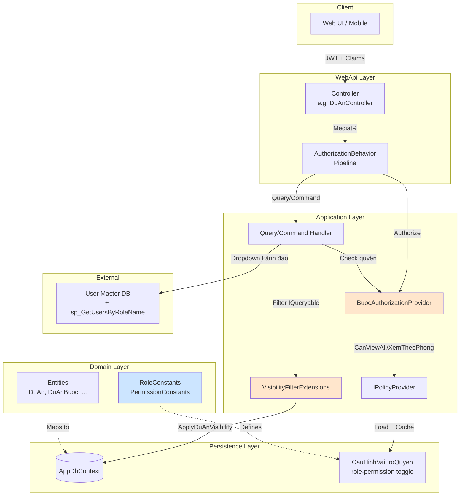
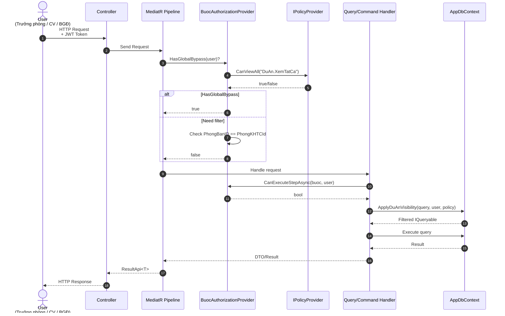
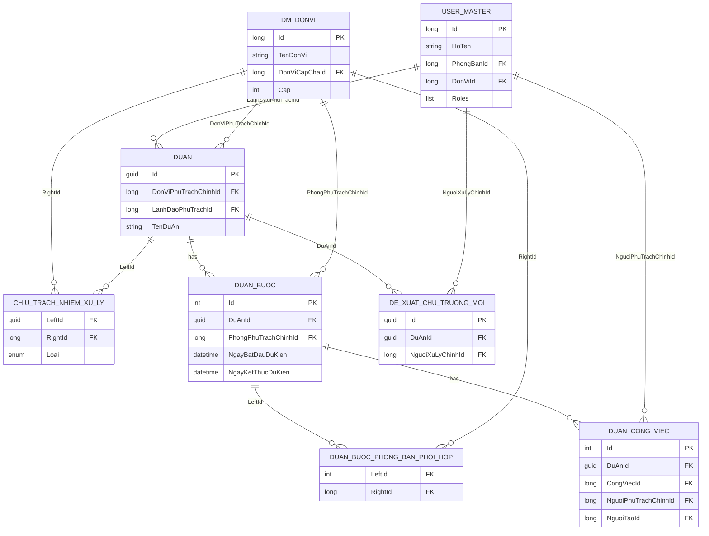
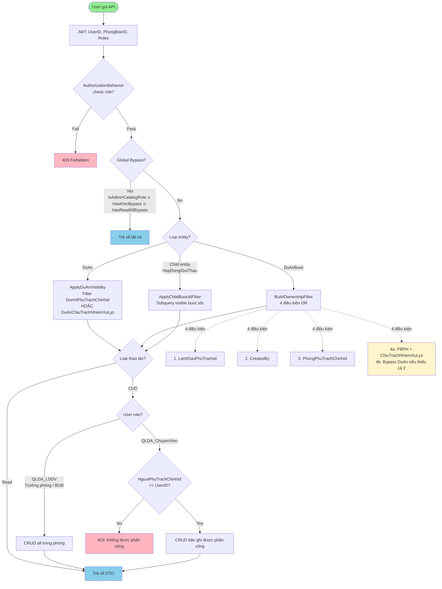
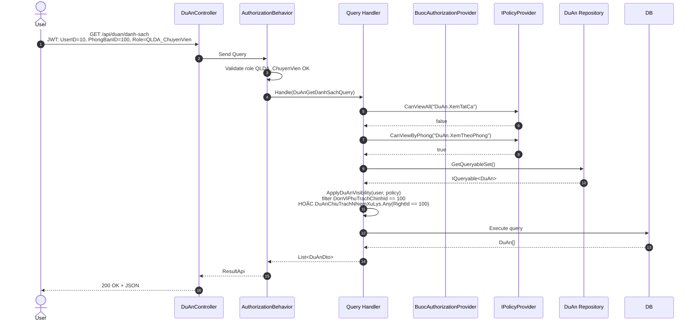
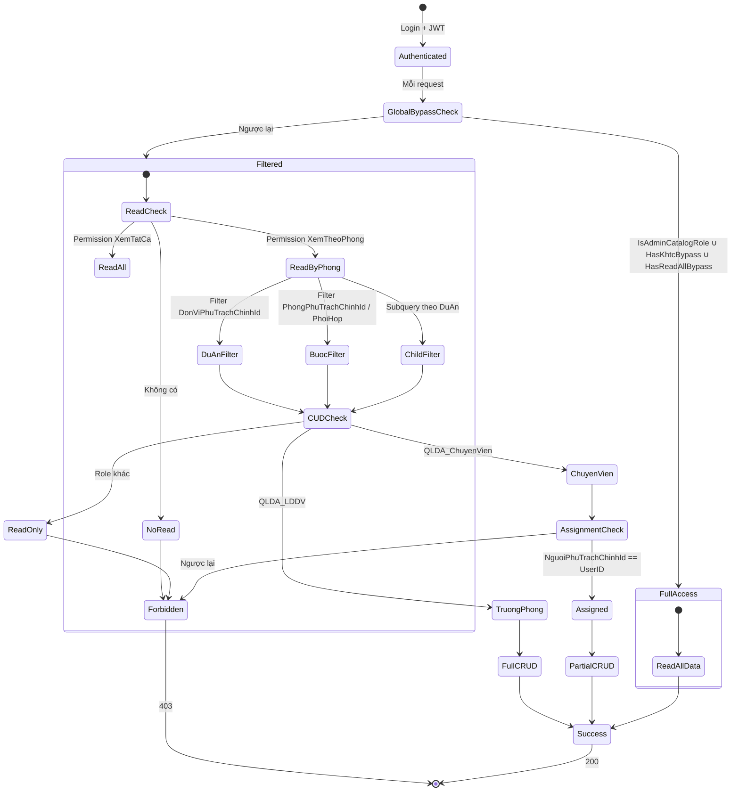

# Tích hợp Hệ thống Phân quyền QLDA theo Phòng ban

## Mục lục

1. [Tổng quan](#1-tổng-quan)
2. [Khái niệm cốt lõi](#2-khái-niệm-cốt-lõi)
3. [Kiến trúc hệ thống](#3-kiến-trúc-hệ-thống)
4. [Quy trình tích hợp (tổng quát)](#4-quy-trình-tích-hợp-tổng-quát)
5. [Bước 1 — Xác định tác nhân](#5-bước-1--xác-định-tác-nhân)
6. [Bước 2 — Kiểm tra Global Bypass](#6-bước-2--kiểm-tra-global-bypass)
7. [Bước 3 — Áp dụng Buoc-level filter](#7-bước-3--áp-dụng-buoc-level-filter)
   - [7.1 Logic filter (`BuildOwnershipFilter`)](#71-logic-filter-buocauthorizationhelperbuildownershipfilter)
   - [7.2 4 điều kiện match](#72-4-điều-kiện-match)
   - [7.3 Quy tắc ưu tiên bước vs DuAn (mới từ v1.2)](#73-quy-tắc-ưu-tiên-bước-vs-duan-mới-từ-v12)
   - [7.4 Ví dụ behavior](#74-ví-dụ-behavior)
   - [7.5 Sử dụng trong code](#75-sử-dụng-trong-code)
   - [7.6 Files tham chiếu](#76-files-tham-chiếu)
8. [Bước 4 — Áp dụng DuAn-level filter](#8-bước-4--áp-dụng-duan-level-filter)
9. [Bước 5 — Phân quyền CUD theo phòng](#9-bước-5--phân-quyền-cud-theo-phòng)
10. [Bước 6 — Phân công chuyên viên](#10-bước-6--phân-công-chuyên-viên)
11. [Phân biệt theo loại entity](#11-phân-biệt-theo-loại-entity)
12. [Data conversion](#12-data-conversion)
13. [Metadata / Schema](#13-metadata--schema)
14. [Mermaid — ER Diagram](#14-mermaid--er-diagram)
15. [Mermaid — Flowchart phân quyền](#15-mermaid--flowchart-phân-quyền)
16. [Mermaid — Sequence Diagram](#16-mermaid--sequence-diagram)
17. [Mermaid — State Diagram](#17-mermaid--state-diagram)
18. [API Reference](#18-api-reference)
19. [Checklist tích hợp](#19-checklist-tích-hợp)
20. [Error Handling Matrix](#20-error-handling-matrix)
21. [Mở rộng & Best practices](#21-mở-rộng--best-practices)
- [Phụ lục A — Code Examples](#phụ-lục-a--code-examples)
- [Phụ lục B — Permission Constants](#phụ-lục-b--permission-constants)
- [Phụ lục C — Glossary](#phụ-lục-c--glossary)

---

## 1. Tổng quan

Hệ thống QLDA (Quản lý Dự án) cung cấp cơ chế **phân quyền 2 tầng** kết hợp **xác định theo Phòng ban** để kiểm soát quyền truy cập dự án, bước dự án, và các màn hình liên kết (Hợp đồng, Gói thầu, Văn bản).

**Mục đích:**
- BGĐ / Lãnh đạo cấp cao xem/sửa/xóa/phê duyệt tất cả dự án.
- Phòng chuyên môn (Trưởng phòng + Chuyên viên) chỉ thao tác dự án trong phạm vi phòng mình.
- Phòng phối hợp chỉ xem dự án, có thể CRUD màn hình liên kết khi được gán trong bước.
- Phòng theo dõi chỉ xem (chưa triển khai junction riêng).

**Giá trị kinh doanh:**
- Đảm bảo nguyên tắc "đúng người, đúng việc" theo cơ cấu tổ chức 3 cấp.
- Cho phép từng phòng chủ động xử lý công việc được phân công mà không cần can thiệp từ phòng ban khác.
- Hỗ trợ quy trình phê duyệt nhiều cấp (Trưởng phòng → BGĐ).

**Phạm vi tích hợp:**
- Áp dụng cho mọi controller thuộc module QLDA: `DuAn`, `DuAnBuoc`, `HopDong`, `GoiThau`, `VanBan`, `DeXuatChuTruongMoi`, ...
- Filter thông qua extension `ApplyDuAnVisibility()`, `WhereFilterBuocVisibility()`, hoặc check trực tiếp qua `BuocAuthorizationProvider`.

---

## 2. Khái niệm cốt lõi

| Thuật ngữ | Định nghĩa |
|-----------|------------|
| **Tác nhân (Actor)** | Người dùng thao tác trong hệ thống, xác định bởi Role + PhongBanID + UserID |
| **Phòng KH-TC** | Phòng Kế hoạch - Tài chính, có quyền global bypass |
| **Phòng HC-TH** | Phòng Hành chính - Tổng hợp, xác định bằng `PhongHCTHId` |
| **Phòng phụ trách chính** | `DuAn.DonViPhuTrachChinhId` — phòng chịu trách nhiệm chính |
| **Phòng phối hợp** | `DuAnChiuTrachNhiemXuLy.Loai = DonViPhoiHop` — phòng tham gia phụ |
| **Phòng theo dõi** | `DuAnChiuTrachNhiemXuLy.Loai = DonViTheoDoi` — chỉ xem (enum chưa có junction) |
| **Bước (Buoc)** | `DuAnBuoc` — cấu hình phòng ban thực hiện cho từng bước dự án |
| **Lãnh đạo phụ trách** | `DuAn.LanhDaoPhuTrachId` — UserID của BGĐ/Trưởng phòng được gán |
| **Phân công** | Giao bản ghi cho chuyên viên xử lý (`NguoiPhuTrachChinhId` / `NguoiXuLyChinhId`) |
| **Global Bypass** | Quyền xem/sửa tất cả không cần check filter |
| **Buoc-level filter** | Filter áp dụng cho `DuAnBuoc` (bước dự án) |
| **DuAn-level filter** | Filter áp dụng cho `DuAn` (dự án) |
| **Junction Entity** | Bảng trung gian nhiều-nhiều (`DuAnBuocPhongBanPhoiHop`, `ChiuTrachNhiemXuLy`) |
| **Sp_GetUsersByRoleName** | Stored procedure lấy user theo role (dùng cho dropdown Lãnh đạo) |
| **EChiuTrachNhiemXuLy** | Enum: `DonViPhoiHop` (phối hợp), `DonViTheoDoi` (theo dõi) |

---

## 3. Kiến trúc hệ thống

### 3.1. Các thành phần chính

| Component | Project | File | Vai trò |
|-----------|---------|------|---------|
| `IAppSettingsProvider` | `QLDA.Application` | `Providers/IAppSettingsProvider.cs` | Đọc config `PhongKHTCId`, `PhongHCTHId` |
| `IPolicyProvider` | `QLDA.Application` | `Providers/IPolicyProvider.cs` | Check permission key + cache |
| `BuocAuthorizationProvider` | `QLDA.Application` | `Authorization/Providers/BuocAuthorizationProvider.cs` | Check quyền thao tác bước |
| `VisibilityFilterExtensions` | `QLDA.Application` | `Common/Extensions/VisibilityFilterExtensions.cs` | Extension filter IQueryable |
| `RoleConstants` | `QLDA.Domain` | `Constants/RoleConstants.cs` | Định nghĩa 4 roles (TatCa, QuanTri, LDDV, ChuyenVien) |
| `PermissionConstants` | `QLDA.Domain` | `Constants/PermissionConstants.cs` | Permission keys + default mapping |
| `CauHinhVaiTroQuyen` | `QLDA.Persistence` | `Configurations/CauHinhVaiTroQuyenConfiguration.cs` | Seed role-permission toggle |
| `GetUserByRoleNameQuery` | `QLDA.Application` | `UserMasters/Queries/GetUserByRoleNameQuery.cs` | Load user theo role (cho dropdown Lãnh đạo) |
| `AppSettings` | `QLDA.WebApi` | `ConfigurationOptions/AppSettings.cs` | Config `PhongKHTCId`, `PhongHCTHId` |

### 3.2. Sơ đồ kiến trúc



---

## 4. Quy trình tích hợp (tổng quát)



**Tóm tắt 6 bước chính khi tích hợp:**

1. Xác định tác nhân (Role + PhongBanID + UserID).
2. Kiểm tra Global Bypass (nếu có → return toàn bộ data).
3. Áp dụng Buoc-level filter (cho entity `DuAnBuoc`).
4. Áp dụng DuAn-level filter (cho entity `DuAn` + child).
5. Phân quyền CUD theo phòng (chuyên viên chỉ thao tác bản ghi được phân công).
6. Phân công chuyên viên (chỉ Trưởng phòng / BGĐ có quyền).

---

## 5. Bước 1 — Xác định tác nhân

### 5.1. Tác nhân (chốt)

| # | Tác nhân | Cơ chế xác định | Quyền |
|---|----------|-----------------|-------|
| 1 | **BGĐ / Lãnh đạo cấp cao** | `UserID == DuAn.LanhDaoPhuTrachId` | Xem/Sửa/Xóa/Phê duyệt dự án được gán |
| 2 | **Phòng KH-TC** (mọi role) | `PhongBanID == PhongKHTCId` (tương đương `HasKhtcBypass`) | Global bypass — full quyền, bao gồm CRUD ThanhToan |
| 3 | **Phòng HC-TH** | `PhongBanID == PhongHCTHId` | Tùy module |
| 4 | **Trưởng phòng phụ trách chính** | `QLDA_LDDV` + `PhongBanID == DuAn.DonViPhuTrachChinhId` | CRUD all trong phòng, phân công, phê duyệt |
| 5 | **Chuyên viên phòng phụ trách chính** | `QLDA_ChuyenVien` + `PhongBanID == DuAn.DonViPhuTrachChinhId` | CRUD chỉ bản ghi được phân công |
| 6 | **Trưởng phòng phối hợp** | `QLDA_LDDV` + `PhongBanID` ∈ `DonViPhoiHop` | Xem dự án, CRUD màn hình trong bước |
| 7 | **Chuyên viên phòng phối hợp** | `QLDA_ChuyenVien` + `PhongBanID` ∈ `DonViPhoiHop` | Xem dự án, CRUD theo phân công trong bước |
| 8 | **Admin / Quản trị** | `QLDA_TatCa` hoặc `QLDA_QuanTri` | Full quyền read+write (qua `IsAdminCatalogRole` trong provider) |

> **Lưu ý v1.4:** Bắt đầu từ v1.4, cờ `HasAdminCatalog` đã được loại bỏ hoàn toàn khỏi `IAuthorizationContext`/`AuthorizationContext`. Bypass role `QLDA_TatCa` / `QLDA_QuanTri` giờ được check trực tiếp trong `BuocAuthorizationProvider` qua helper `IsAdminCatalogRole(ctx)` (dựa trên `RoleConstants.GroupAdminCatalog`). Phòng KH-TC vẫn bypass qua cờ `HasKhtcBypass` (department-based) — đường riêng, tách biệt. Xem chi tiết ở Section 6.5.

### 5.2. Role mapping (chốt)

| Role | Mapping | Ghi chú |
|------|---------|---------|
| `QLDA_TatCa` | Admin hệ thống | Giữ |
| `QLDA_QuanTri` | Quản trị viên | Giữ |
| `QLDA_LDDV` | BGĐ + Trưởng phòng | Bao gồm cả BGĐ (đã gộp với role `QLDA_LD` cũ) |
| `QLDA_ChuyenVien` | Chuyên viên trong phòng | Giữ |
| ~~`QLDA_LD`~~ | **ĐÃ BỎ** | Chỉ còn trong comment, sắp xóa |
| ~~`QLDA_HC_TH`~~ | **ĐÃ BỎ** | Thay bằng `PhongHCTHId` (User.PhongBanID) |

### 5.3. Code xác định tác nhân

```csharp
// Lấy thông tin user từ JWT
var userId = userProvider.Info.UserID;
var phongBanId = userProvider.Info.PhongBanID;
var hasRoleLDDV = userProvider.AuthInfo?.HasRole(RoleConstants.QLDA_LDDV) ?? false;
var hasRoleChuyenVien = userProvider.AuthInfo?.HasRole(RoleConstants.QLDA_ChuyenVien) ?? false;
var hasRoleTatCa = userProvider.AuthInfo?.HasRole(RoleConstants.QLDA_TatCa) ?? false;

// Phân loại tác nhân
// Department-based bypass: kiểm tra qua HasKhtcBypass (PhongKHTCId), không cần biến riêng.
// Role-based bypass: trước v1.4 dùng HasAdminCatalog (flag trên IAuthorizationContext);
// từ v1.4 phải check trực tiếp role thuộc GroupAdminCatalog (QLDA_TatCa ∪ QLDA_QuanTri).
var hasKhtcBypass = phongBanId == appSettings.PhongKHTCId;
var hasRoleQuanTri = userProvider.AuthInfo?.HasRole(RoleConstants.QLDA_QuanTri) ?? false;
var isAdminCatalogRole = hasRoleTatCa || hasRoleQuanTri;
var isHcth = phongBanId == appSettings.PhongHCTHId;
var isLanhDaoPhuTrach = duAn.LanhDaoPhuTrachId == userId;
var isPhuTrachChinh = duAn.DonViPhuTrachChinhId == phongBanId;
var isPhoiHop = duAn.DuAnChiuTrachNhiemXuLys?.Any(x =>
    x.RightId == phongBanId && x.Loai == EChiuTrachNhiemXuLy.DonViPhoiHop) ?? false;
```

> **Lưu ý (v1.4):** `IAuthorizationContext` hiện chỉ còn `HasKhtcBypass` / `IsAdminManager` / `HasGlobalBypass` / `HasReadAllBypass`. Cờ `HasAdminCatalog` đã bị loại bỏ — provider tự check role thuộc `GroupAdminCatalog` qua helper nội bộ (vd `BuocAuthorizationProvider.IsAdminCatalogRole`). Handler không cần (và không thể) dùng cờ này. Code trên chỉ mang tính tham chiếu cho logic nghiệp vụ.

---

## 6. Bước 2 — Kiểm tra Global Bypass

### 6.1. Logic kiểm tra (`BuocAuthorizationProvider.cs:13-22`)

```csharp
public bool HasGlobalBypass(IUserProvider user)
{
    if (user.Info.PhongBanID == settings.PhongKHTCId)
        return true;

    if (policy.CanViewAll(user, PermissionConstants.DuAn_XemTatCa))
        return true;

    return false;
}
```

### 6.2. Điều kiện Global Bypass

| Điều kiện | Ý nghĩa | Flag tương ứng |
|-----------|----------|----------------|
| `user.PhongBanID == PhongKHTCId` | User thuộc phòng KH-TC | `HasKhtcBypass` |
| `policy.CanViewAll("DuAn.XemTatCa")` | Có permission `DuAn.XemTatCa` (role `QLDA_TatCa`, `QLDA_QuanTri`, `QLDA_LDDV` mặc định) | thường đi kèm `IsAdminManager` |

> **Lưu ý v1.4:** Trước v1.4, cờ `HasAdminCatalog` trên `IAuthorizationContext` là một đường bypass **độc lập** short-circuit trong `BuocAuthorizationProvider`. Từ v1.4, cờ này đã bị loại bỏ — `BuocAuthorizationProvider` tự gọi helper `IsAdminCatalogRole(ctx)` kiểm tra role thuộc `GroupAdminCatalog`. Hai user "Admin" (`QLDA_TatCa`) và "KH-TC" (`QLDA_ChuyenVien` + `PhongBanID == PhongKHTCId`) vẫn có quyền bypass như nhau nhưng đi qua 2 cơ chế tách biệt — quan trọng khi debug audit log.

### 6.3. Ý nghĩa

Khi `HasGlobalBypass` = `true`:
- Bỏ qua mọi filter buoc-level và duan-level.
- User thấy và thao tác được tất cả dự án.
- KHÔNG cần check `LanhDaoPhuTrachId`, `DonViPhuTrachChinhId`, `DuAnChiuTrachNhiemXuLys`.

### 6.4. Sử dụng trong code

```csharp
// Trong Query/Command Handler
if (authProvider.HasGlobalBypass(user))
{
    // Trả về toàn bộ data, không cần filter
    return await _repository.GetQueryableSet().ToListAsync(cancellationToken);
}
```

### 6.5. Admin Catalog Bypass — check role trực tiếp trong `BuocAuthorizationProvider`

> **Cập nhật v1.4** — Cờ `HasAdminCatalog` đã được loại bỏ hoàn toàn khỏi `IAuthorizationContext` / `AuthorizationContext` (kể cả field cache, compute method, property). `BuocAuthorizationProvider` tự gọi helper nội bộ `IsAdminCatalogRole(ctx)` kiểm tra role thuộc `RoleConstants.GroupAdminCatalog`. Lý do loại bỏ:
> - Tách bạch giữa 2 cơ chế bypass: department-based (`HasKhtcBypass`) vs role-based (`GroupAdminCatalog`). Mỗi cơ chế có owner riêng, không qua cờ chung.
> - Tránh phụ thuộc chéo giữa các provider — `BuocAuthorizationProvider` tự quyết định "role admin catalog có bypass ownership không" mà không cần hỏi `IAuthorizationContext`.
> - `IAuthorizationContext` chỉ giữ các cờ có logic ổn định (department-based + read-all). Cờ phụ thuộc `RoleConstants.GroupAdminCatalog` thì thay đổi nội bộ provider.

#### 6.5.1. Bối cảnh lịch sử

- **v1.0:** Chỉ có `HasKhtcBypass`. `QLDA_QuanTri` không bypass ownership trên Buoc → bất đối xứng với controller-level `[Authorize(Roles=GroupAdminOrManager)]` (70+ chỗ).
- **v1.1:** Thêm cờ `HasAdminCatalog` gộp Phòng KH-TC + `GroupAdminCatalog` (`QLDA_TatCa`, `QLDA_QuanTri`). Gắn lên `IAuthorizationContext` để provider consume.
- **v1.3:** Tách `PhongKHTC` ra khỏi `HasAdminCatalog` (chỉ còn check role) nhưng vẫn giữ cờ trên interface.
- **v1.4:** Loại bỏ cờ `HasAdminCatalog` hoàn toàn khỏi interface. `BuocAuthorizationProvider` check role trực tiếp qua `IsAdminCatalogRole(ctx)`.

#### 6.5.2. Các flag còn lại trong `AuthorizationContext` (v1.4)

| Flag | Logic | Bypass read+write? |
|------|-------|---------------------|
| `HasKhtcBypass` | `PhongBanID == PhongKHTCId` (department) | ✅ |
| `HasReadAllBypass` | `Role ∈ GroupReadAll` (hiện `""` — đã dỡ bỏ) | ❌ read-only (không còn ai match) |
| `IsAdminManager` | `Role ∈ GroupAdminOrManager` ∪ `DuAn_XemTatCa` policy | (không provider nào dùng — legacy) |
| `HasGlobalBypass` | `HasKhtcBypass ∥ IsAdminManager` | (legacy — không provider nào dùng) |
| ~~`HasAdminCatalog`~~ | **ĐÃ LOẠI BỎ** (v1.4) | — |

> **Quan trọng (v1.4):** Bypass role `QLDA_TatCa` / `QLDA_QuanTri` giờ là **chi tiết triển khai nội bộ** của `BuocAuthorizationProvider`, không phải cờ public trên `IAuthorizationContext`. Provider nào khác cần bypass tương tự có thể tự gọi `RoleConstants.GroupAdminCatalog.Split(',')` hoặc copy helper từ `BuocAuthorizationProvider.IsAdminCatalogRole` (chưa extracted thành util — YAGNI).

#### 6.5.3. `GroupAdminCatalog` (giữ nguyên)

```csharp
// QLDA.Domain/Constants/RoleConstants.cs
public const string GroupAdminCatalog = $"{QLDA_TatCa},{QLDA_QuanTri}";
```

| Role / Phòng | Quyền | Cơ chế bypass |
|------|-------|---------------|
| `QLDA_TatCa` | Admin hệ thống — toàn quyền read+write trên DuAn/Buoc (mọi phòng ban) | `BuocAuthorizationProvider.IsAdminCatalogRole` |
| `QLDA_QuanTri` | Quản trị — toàn quyền read+write (kể cả ngoài PhongKHTC) | `BuocAuthorizationProvider.IsAdminCatalogRole` |
| `QLDA_LDDV` | **KHÔNG** trong `GroupAdminCatalog` — vẫn phải qua ownership filter (chỉ bypass khi là Lãnh đạo phụ trách DuAn đó) | (không bypass) |
| User thuộc Phòng KH-TC (mọi role) | Bypass qua `HasKhtcBypass` (đường riêng, tách biệt) | `IAuthorizationContext.HasKhtcBypass` |

#### 6.5.4. Provider wiring (v1.4)

| Provider | Method | Check role-based | Check department-based |
|----------|--------|------------------|------------------------|
| `DuAnAuthorizationProvider` | `CanExecuteAsync` | (không — ownership only) | (không) |
| `DuAnAuthorizationProvider` | `CanViewAsync` | (không) | (không — chỉ `HasReadAllBypass`) |
| `DuAnAuthorizationProvider` | `Filter<T>` | (không) | (không — chỉ `HasReadAllBypass`) |
| `BuocAuthorizationProvider` | `CanExecuteStepAsync` | `IsAdminCatalogRole(ctx)` | (không — qua ownership) |
| `BuocAuthorizationProvider` | `FilterVisibleSteps` | `IsAdminCatalogRole(ctx)` ∪ `HasReadAllBypass` | (không — qua ownership) |
| `BuocAuthorizationProvider` | `FilterVisibleChildEntities` | `IsAdminCatalogRole(ctx)` ∪ `HasReadAllBypass` | (không — qua ownership) |
| `BuocAuthorizationProvider` | `CanManageStepFieldsAsync` | `IsAdminCatalogRole(ctx)` | (không — qua ownership) |
| `BuocAuthorizationProvider` | `CanExecuteThanhToanAsync` | (gọi qua `CanManageStepFieldsAsync`) + `PhongPhuTrachChinhId` | (không) |

> **Lưu ý (v1.4):** `DuAnAuthorizationProvider` KHÔNG dùng `IsAdminCatalogRole` cho write path — mọi write trên `DuAn` đều qua ownership filter, kể cả admin. Chỉ `BuocAuthorizationProvider` mới có short-circuit cho role admin catalog.

Helper `IsAdminCatalogRole` ở `BuocAuthorizationProvider`:

```csharp
private static bool IsAdminCatalogRole(IAuthorizationContext ctx)
{
    var roles = ctx.User.AuthInfo.Roles ?? [];
    if (roles.Count == 0) return false;
    var adminCatalogRoles = RoleConstants.GroupAdminCatalog.Split(',');
    foreach (var r in roles)
    {
        if (string.IsNullOrEmpty(r)) continue;
        var trimmed = r.Trim();
        foreach (var ac in adminCatalogRoles)
            if (string.Equals(ac.Trim(), trimmed, StringComparison.Ordinal))
                return true;
    }
    return false;
}
```

#### 6.5.5. Behavior matrix (v1.4)

| User | Read DuAn | Write DuAn | Read Buoc | Write Buoc |
|------|-----------|------------|-----------|------------|
| `QLDA_TatCa` (ngoài PhongKHTC) | Ownership (qua `DuAnAuthorizationProvider`) | Ownership | Bypass (`IsAdminCatalogRole`) | Bypass (`IsAdminCatalogRole`) |
| `QLDA_QuanTri` (ngoài PhongKHTC) | Ownership | Ownership | Bypass (`IsAdminCatalogRole`) | Bypass (`IsAdminCatalogRole`) |
| User thuộc Phòng KH-TC (mọi role) | Ownership | Ownership | Bypass (`HasKhtcBypass`) | Bypass (`HasKhtcBypass`) |
| `QLDA_LDDV` (không phụ trách DuAn) | Ownership | Ownership | Ownership | Ownership |
| `QLDA_ChuyenVien` | Ownership | Ownership | Ownership | Ownership |
| `NVTT_BP01` / `NVTT_XemDuAn` | Ownership (v1.3: `GroupReadAll = ""`) | Ownership | Ownership (chỉ qua `HasReadAllBypass` nếu role được thêm lại) | Ownership |

> **So sánh v1.3 → v1.4:** Read DuAn giờ KHÔNG còn bypass cho `QLDA_TatCa` / `QLDA_QuanTri` (vì `DuAnAuthorizationProvider` không dùng `IsAdminCatalogRole`). User admin phải qua ownership filter khi xem DuAn. Nếu cần admin xem tất cả DuAn, hãy dùng controller `nvtt/` hoặc cấp `QLDA_TatCa` + extend filter trong provider.

#### 6.5.6. Sử dụng trong code (v1.4)

Caller KHÔNG truy cập trực tiếp `IsAdminCatalogRole` (private static). Provider đã wire sẵn:

```csharp
// Handler — gọi provider bình thường
public async Task<bool> CanExecuteStepAsync(DuAnBuoc buoc, IAuthorizationContext ctx, CancellationToken ct)
{
    // BuocAuthorizationProvider tự check IsAdminCatalogRole ở đầu method
    // → caller không cần làm gì
    // ...
}
```

Nếu code ở ngoài provider cần check role admin catalog, hãy inline:

```csharp
// Cách 1: Inline check role
var isAdminCatalog = userProvider.AuthInfo.Roles.Any(r =>
    RoleConstants.GroupAdminCatalog.Split(',').Contains(r, StringComparer.Ordinal));

// Cách 2: Qua IUserProvider.HasRole (nếu API hỗ trợ nhiều role)
var isAdminCatalog =
    userProvider.AuthInfo.HasRole(RoleConstants.QLDA_TatCa) ||
    userProvider.AuthInfo.HasRole(RoleConstants.QLDA_QuanTri);
```

#### 6.5.7. Khi nào cần cập nhật?

| Tình huống | Hành động |
|------------|-----------|
| Thêm role mới có toàn quyền catalog (admin hệ thống) | ✅ Thêm vào `RoleConstants.GroupAdminCatalog`. `BuocAuthorizationProvider.IsAdminCatalogRole` tự nhận — không cần sửa provider. |
| Thêm provider mới cần bypass role admin | Tự copy pattern `IsAdminCatalogRole` hoặc viết helper util nếu dùng ≥ 3 chỗ (YAGNI trước). |
| User thuộc Phòng KH-TC cần bypass | Không cần làm gì — tự động qua `HasKhtcBypass` (nếu provider check flag này). Hiện `BuocAuthorizationProvider.FilterVisibleSteps` KHÔNG check `HasKhtcBypass` riêng — chỉ qua ownership. |
| User ngoài PhongKHTC cần bypass DuAn read | Hiện KHÔNG có cơ chế — phải qua ownership filter hoặc tạo controller riêng (`nvtt/`). |
| Role chỉ cần bypass khi sở hữu | Không cần cập nhật — để qua ownership filter. |

#### 6.5.8. Files tham chiếu

- `QLDA.Domain/Constants/RoleConstants.cs` — constant `GroupAdminCatalog` (giữ nguyên, KHÔNG bao gồm PhongKHTC).
- `QLDA.Application/Authorization/IAuthorizationContext.cs` — **KHÔNG còn** property `HasAdminCatalog` (v1.4).
- `QLDA.Application/Authorization/AuthorizationContext.cs` — **KHÔNG còn** `_hasAdminCatalog` field, `ComputeHasAdminCatalog` method (v1.4).
- `QLDA.Application/Authorization/Providers/BuocAuthorizationProvider.cs` — helper private `IsAdminCatalogRole(ctx)` (v1.4). 4 chỗ call sites trong `CanExecuteStepAsync`, `FilterVisibleSteps`, `FilterVisibleChildEntities`, `CanManageStepFieldsAsync`.
- `QLDA.Tests/Unit/AuthorizationManagerTests.cs` — `StubContext` đã bỏ property `HasAdminCatalog` (v1.4).

### 6.6. `HasReadAllBypass` — read-only access cho `NVTT_BP01` / `NVTT_XemDuAn`

> **Cập nhật v1.3** — `GroupReadAll` hiện là chuỗi rỗng (`""`); hai role NVTT đã được dỡ bỏ khỏi group. Xem thêm ở `QLDA.Domain/Constants/RoleConstants.cs` (comment trên `GroupReadAll`).

#### 6.6.1. Hai role NVTT (vẫn tồn tại, nhưng tách khỏi read-all)

| Role | Ý nghĩa hiện tại (v1.3) |
|------|-------------------------|
| `NVTT_BP01` | Role vẫn được khai báo. Bộ phận 01 NVTT — dùng controller riêng `NvttDuAnController` / `NvttBuocController` (prefix `nvtt/`) để xem toàn bộ dự án, **không** đi qua ownership filter của các endpoint chuẩn. |
| `NVTT_XemDuAn` | Role dùng chung cho user NVTT (Trưởng phòng xử lý, Trưởng phòng phối hợp, Giám đốc...). Cũng qua controller `nvtt/`, **không** bypass filter chuẩn. |

Hai role này **trước v1.3** thuộc `GroupReadAll`:

```csharp
// QLDA.Domain/Constants/RoleConstants.cs
// v1.2: public const string GroupReadAll = $"{NVTT_BP01},{NVTT_XemDuAn}";
// v1.3: dỡ bỏ — chuyển sang controller nvtt/ riêng
public const string GroupReadAll = "";
```

#### 6.6.2. Cờ `HasReadAllBypass` (v1.3)

| Mục | Giá trị |
|-----|---------|
| **Flag** | `IAuthorizationContext.HasReadAllBypass` |
| **Logic** | `Role ∈ GroupReadAll` (cached `??=`, computed once per request) |
| **Hiện trạng v1.3** | `GroupReadAll = ""` → `HasReadAllBypass` luôn `false`. Cờ vẫn được consume ở provider (an toàn khi extend lại sau này) nhưng **không có role nào match**. |
| **Bypass read?** | ✅ (khi cờ true) — `Filter<T>`, `CanViewAsync`, `FilterVisibleSteps`, `FilterVisibleChildEntities` đều return query gốc |
| **Bypass write?** | ❌ — `HasReadAllBypass` KHÔNG tự bypass write. Write path (`CanExecuteAsync`, `CanExecuteStepAsync`) luôn fallback về ownership check |

> **Hệ quả v1.3:** User có role `NVTT_BP01` / `NVTT_XemDuAn` mà gọi endpoint chuẩn (không có prefix `nvtt/`) sẽ phải qua ownership filter như user thường. Read-all chỉ áp dụng cho controller `nvtt/`.

#### 6.6.3. Behavior matrix (cập nhật v1.3)

| User (endpoint chuẩn) | Read DuAn | Write DuAn được assign | Write DuAn không assign |
|------|-----------|------------------------|------------------------|
| `NVTT_BP01` (không qua `nvtt/`) | Ownership | ✅ (nếu match ownership) | ❌ |
| `NVTT_XemDuAn` (không qua `nvtt/`) | Ownership | ✅ (nếu match ownership) | ❌ |
| `QLDA_QuanTri` | Ownership (v1.4: `DuAnAuthorizationProvider` không dùng `IsAdminCatalogRole` cho read) | ✅ (nếu match ownership) | ✅ (qua `IsAdminCatalogRole` trong `BuocAuthorizationProvider`) |
| `QLDA_ChuyenVien` | Ownership | ✅ (nếu match ownership) | ❌ |
| User thuộc Phòng KH-TC | Ownership | ✅ (qua `HasKhtcBypass` nếu provider check) | ✅ (qua `HasKhtcBypass` nếu provider check) |

#### 6.6.4. So sánh 4 flag (cập nhật v1.4)

| Flag | Bypass read | Bypass write | Ai match (v1.4) |
|------|-------------|--------------|------------------|
| `HasKhtcBypass` | ✅ (khi provider check) | ✅ (khi provider check) | Phòng KH-TC (department-based) |
| ~~`HasAdminCatalog`~~ | **ĐÃ LOẠI BỎ** | **ĐÃ LOẠI BỎ** | — (chuyển thành helper `IsAdminCatalogRole` private trong `BuocAuthorizationProvider`) |
| `HasReadAllBypass` | ✅ (khi provider check) | ❌ | (hiện không có role nào — `GroupReadAll = ""`) |
| `IsAdminManager` | (không provider nào dùng) | (không provider nào dùng) | `GroupAdminOrManager` ∪ `DuAn_XemTatCa` policy |

#### 6.6.5. Files tham chiếu

- `QLDA.Domain/Constants/RoleConstants.cs` — constants `NVTT_BP01`, `NVTT_XemDuAn`, `GroupReadAll = ""`.
- `QLDA.Application/Authorization/IAuthorizationContext.cs` — property `HasReadAllBypass`.
- `QLDA.Application/Authorization/AuthorizationContext.cs` — compute method `ComputeHasReadAllBypass`.
- `QLDA.Application/Authorization/Providers/DuAnAuthorizationProvider.cs` — check `HasReadAllBypass` trong `CanViewAsync` và `Filter<T>`.
- `QLDA.Application/Authorization/Providers/BuocAuthorizationProvider.cs` — check `HasReadAllBypass` trong `FilterVisibleSteps` và `FilterVisibleChildEntities`.
- `QLDA.WebApi/Controllers/NvttDuAnController.cs`, `NvttBuocController.cs` — controller riêng với prefix `nvtt/` (xem toàn bộ không filter).

#### 6.6.6. Khi nào cần thêm role vào `GroupReadAll`?

> **Hiện tại v1.3:** `GroupReadAll` đang rỗng → cờ `HasReadAllBypass` không match role nào. Cân nhắc bật lại khi cần:

| Tình huống | Cách xử lý hiện tại |
|------------|---------------------|
| Role cần xem toàn bộ DuAn/Buoc trên **endpoint chuẩn** | Thêm role vào `GroupReadAll` lại (hiện đang rỗng) |
| Role cần xem toàn bộ DuAn/Buoc trên **màn riêng** | Tạo controller mới với prefix riêng (pattern `NvttDuAnController`) |
| Role cần xem **và** CRUD tất cả | Thêm vào `GroupAdminCatalog` (provider tự nhận qua `IsAdminCatalogRole`) |
| Role chỉ cần xem DuAn trong phòng mình | Để qua ownership filter |

---

## 7. Bước 3 — Áp dụng Buoc-level filter

### 7.1. Logic filter (`BuocAuthorizationHelper.BuildOwnershipFilter`)

> **Cập nhật từ v1.2** — Ownership filter giờ gồm **4 điều kiện OR**, trong đó điều kiện 4 được mở rộng thêm nhánh bypass (4b) khi bước THIẾU CẢ HAI yếu tố phòng ban.
>
> **Cập nhật v1.4** — Short-circuit `ctx.HasAdminCatalog` đã được thay bằng `IsAdminCatalogRole(ctx)` (helper private trong provider). Tương đương về behavior: vẫn bypass cho `QLDA_TatCa` / `QLDA_QuanTri` (mọi phòng ban). Phòng KH-TC KHÔNG match `IsAdminCatalogRole` — phải qua ownership filter (giống v1.3).

`FilterVisibleSteps` áp dụng cho `DuAnBuoc` thông qua `BuildOwnershipFilter`:

```csharp
public IQueryable<DuAnBuoc> FilterVisibleSteps(IQueryable<DuAnBuoc> query, IAuthorizationContext ctx)
{
    if (IsAdminCatalogRole(ctx)) return query;       // QLDA_TatCa ∪ QLDA_QuanTri (helper nội bộ v1.4)
    if (ctx.HasReadAllBypass) return query;          // NVTT_BP01 ∪ NVTT_XemDuAn (v1.3: không match vì GroupReadAll = "")

    if (ctx.PhongBanId == 0 && ctx.UserId <= 0)
        return query.Where(e => false);

    return query.Where(BuocAuthorizationHelper.BuildOwnershipFilter(ctx.UserId, ctx.PhongBanId));
}
```

> **Lưu ý quan trọng (v1.4):** `FilterVisibleSteps` không check `HasKhtcBypass` riêng (vẫn giữ từ v1.3). User thuộc Phòng KH-TC với role `QLDA_ChuyenVien` sẽ KHÔNG bypass ở bước này — sẽ rơi vào `BuildOwnershipFilter`. Tuy nhiên, ownership filter vẫn match user đó trong nhiều trường hợp (vd là `Lãnh đạo phụ trách DuAn`, là `CreatedBy` bước, hoặc là `PhongBanChinh` của bước). Nếu muốn user Phòng KH-TC với role thường luôn bypass, hãy gán thêm role `QLDA_QuanTri` hoặc chuyển sang controller `nvtt/`.

`BuildOwnershipFilter` biên dịch ra 4 điều kiện OR:

```text
(1) b.DuAn.LanhDaoPhuTrachId == userId
OR
(2) b.CreatedBy == userId.ToString()
OR
(3) b.PhongPhuTrachChinhId == phongBanId
OR
(4a) b.DuAnBuocPhongBanPhoiHops.Any(p => p.RightId == phongBanId)
    AND b.DuAn.DuAnChiuTrachNhiemXuLys.Any(x => x.RightId == phongBanId && x.Loai == DonViPhoiHop)
OR
(4b) (b.PhongPhuTrachChinhId == null AND !b.DuAnBuocPhongBanPhoiHops.Any())
    AND b.DuAn != null
    AND (b.DuAn.DonViPhuTrachChinhId == phongBanId
         OR b.DuAn.DuAnChiuTrachNhiemXuLys.Any(x => x.RightId == phongBanId && x.Loai == DonViPhoiHop))
```

### 7.2. 4 điều kiện match

| # | Điều kiện | Ai match | Đã có từ |
|---|-----------|----------|----------|
| 1 | `b.DuAn.LanhDaoPhuTrachId == userId` | BGĐ / Trưởng phòng được gán vào dự án | v1.0 |
| 2 | `b.CreatedBy == userId.ToString()` | Người tạo bước | v1.0 |
| 3 | `b.PhongPhuTrachChinhId == phongBanId` | Phòng phụ trách chính của bước | v1.0 |
| 4a | `b.DuAnBuocPhongBanPhoiHops.Any(p => p.RightId == phongBanId)` AND thuộc `DuAn.DuAnChiuTrachNhiemXuLys(DonViPhoiHop)` | Phòng phối hợp của bước (khi bước đã gán PBPH) | v1.0 |
| 4b | Bước THIẾU CẢ HAI (`PhongPhuTrachChinhId == null` AND PBPH rỗng) AND thuộc `DuAn.DonViPhuTrachChinhId` HOẶC `DuAn.DuAnChiuTrachNhiemXuLys(DonViPhoiHop)` | Phòng phối hợp dự án (fallback khi bước chưa gán) | **v1.2** |

### 7.3. Quy tắc ưu tiên bước vs DuAn (mới từ v1.2)

Khi bước đã được gán **một trong hai** yếu tố (`PhongPhuTrachChinhId != null`
HOẶC PBPH có phòng) → ownership riêng của bước (điều kiện 3, 4a) được ưu
tiên, KHÔNG fallback theo DuAn.

Chỉ khi bước THIẾU CẢ HAI (`PhongPhuTrachChinhId == null` VÀ PBPH null/rỗng)
mới kích hoạt bypass 4b — fallback theo scope phòng ban của `DuAn`.

| Trạng thái bước | Match bằng | Kết quả |
|------------------|-----------|---------|
| `PhongPhuTrachChinhId != null` HOẶC PBPH có phòng | (3) hoặc (4a) | Theo ownership bước |
| `PhongPhuTrachChinhId == null` VÀ PBPH rỗng | (4b) — `DuAn.DonViPhuTrachChinhId == phongBanId` | True |
| `PhongPhuTrachChinhId == null` VÀ PBPH rỗng | (4b) — `DuAn.ChiuTrachNhiemXuLys.Any(RightId==pb, Loai==DonViPhoiHop)` | True |
| Cả hai đều khớp (1)/(2) | bất kỳ | True |

### 7.4. Ví dụ behavior

**Ví dụ 1 — bước chưa gán, user thuộc DuAn:**

- Bước: `PhongPhuTrachChinhId = null`, PBPH rỗng
- User: phòng 100, thuộc `DuAn.DonViPhuTrachChinhId = 100`
- → **True** (khớp 4b — fallback theo DuAn)

**Ví dụ 2 — bước đã gán, user thuộc DuAn nhưng không thuộc bước:**

- Bước: `PhongPhuTrachChinhId = 999`, PBPH rỗng
- User: phòng 100, thuộc `DuAn.DonViPhuTrachChinhId = 100`
- → **False** (đã gán `PhongPhuTrachChinhId` → 4b KHÔNG kích hoạt; 3, 4a fail)

**Ví dụ 3 — bước đã có PBPH nhưng không chứa user:**

- Bước: `PhongPhuTrachChinhId = null`, PBPH = `[RightId=777]`
- User: phòng 100, thuộc `DuAn.DuAnChiuTrachNhiemXuLys(Loai=DonViPhoiHop, RightId=100)`
- → **False** (PBPH có phòng → 4b không kích hoạt; 4a fail vì phòng 777 ≠ 100)

### 7.5. Sử dụng trong code

```csharp
// Cách 1: Gọi trực tiếp qua IAuthorizationContext
var query = _duAnBuocRepository.GetQueryableSet();
var visibleQuery = _buocAuth.FilterVisibleSteps(query, authContext);
var buocList = await visibleQuery.ToListAsync(cancellationToken);

// Cách 2: Qua extension (filter child entity)
var visibleQuery = _duAnBuocRepository.GetQueryableSet()
    .AsNoTracking()
    .WhereFilterBuocVisibility(_duAnBuocRepository, _buocAuth, authContext, x => x.BuocId);
```

### 7.6. Files tham chiếu

- `QLDA.Application/Authorization/Providers/BuocAuthorizationProvider.cs`:
  - `BuildOwnershipFilter` (line ~33) — biên dịch 4 điều kiện.
  - `BuildPhoiHopInChiuTrachNhiemScopeCondition` (line ~115) — điều kiện 4a + 4b.
  - `BuildIsNullOrEmpty` (line ~172) — helper `collection == null || !collection.Any()`.
  - `CheckOwnership` (line ~219) — compile expression, dùng cho `CanExecuteStepAsync` (line ~233).
- `QLDA.Tests/Unit/BuocAuthorizationProviderChildFilterTests.cs` — 5 unit test mới (v1.2) cho bypass.
- `QLDA.Tests/Integration/BuocAuthorizationProviderTranslationTests.cs` — 1 EF translation test mới (v1.2).

---

## 8. Bước 4 — Áp dụng DuAn-level filter

### 8.1. Logic filter (`VisibilityFilterExtensions.cs:19-35`)

```csharp
public static IQueryable<DuAn> ApplyDuAnVisibility(
    this IQueryable<DuAn> query, IUserProvider user, IPolicyProvider policy)
{
    if (policy.CanViewAll(user, PermissionConstants.DuAn_XemTatCa))
        return query;

    if (policy.CanViewByPhong(user, PermissionConstants.DuAn_XemTheoPhong) && user.Info.PhongBanID.HasValue)
    {
        var phongBanId = user.Info.PhongBanID.Value;
        return query.Where(e =>
            e.DonViPhuTrachChinhId == phongBanId ||
            e.DuAnChiuTrachNhiemXuLys!.Any(i => i.RightId == phongBanId));
    }

    return query.Where(e => false);
}
```

### 8.2. 3 nhánh xử lý

| Nhánh | Permission | Kết quả |
|-------|-----------|---------|
| 1 | `DuAn.XemTatCa` (true) | Trả về toàn bộ |
| 2 | `DuAn.XemTheoPhong` (true) + có `PhongBanID` | Filter theo `DonViPhuTrachChinhId` HOẶC `DuAnChiuTrachNhiemXuLys.RightId` |
| 3 | Không có permission | Trả về rỗng (`Where(e => false)`) |

### 8.3. Áp dụng cho child entities (GoiThau, HopDong, VanBan)

`ApplyDuAnChildVisibility` filter theo `DuAn` visibility thông qua subquery:

```csharp
public static IQueryable<T> ApplyDuAnChildVisibility<T>(
    this IQueryable<T> query,
    IRepository<DuAn, Guid> duAnRepo,
    IUserProvider user,
    IPolicyProvider policy,
    Func<T, Guid> duAnIdSelector) where T : class
{
    if (policy.CanViewAll(user, PermissionConstants.DuAn_XemTatCa))
        return query;

    if (policy.CanViewByPhong(user, PermissionConstants.DuAn_XemTheoPhong) && user.Info.PhongBanID.HasValue)
    {
        var phongBanId = user.Info.PhongBanID.Value;
        var visibleDuAnIds = duAnRepo.GetQueryableSet()
            .Where(e =>
                e.DonViPhuTrachChinhId == phongBanId ||
                e.DuAnChiuTrachNhiemXuLys!.Any(i => i.RightId == phongBanId))
            .Select(e => e.Id);

        return query.Where(e => visibleDuAnIds.Contains(duAnIdSelector(e)));
    }

    return query.Where(e => false);
}
```

### 8.4. Sử dụng trong Query Handler

```csharp
public async Task<List<DuAnDto>> Handle(DuAnGetDanhSachQuery request, CancellationToken cancellationToken)
{
    var query = _duAnRepository.GetQueryableSet()
        .AsNoTracking()
        .ApplyDuAnVisibility(userProvider, policyProvider);

    return await query.Select(e => e.ToDto()).ToListAsync(cancellationToken);
}
```

---

## 9. Bước 5 — Phân quyền CUD theo phòng

### 9.1. Vấn đề hiện tại

Hiện tại, các endpoint Create/Update/Delete (CUD) chỉ check role (qua `[Authorize(Roles=...)]`) chưa áp `BuocAuthorizationProvider` cho CUD. Điều này dẫn đến:
- Chuyên viên phòng A có thể sửa dự án phòng B nếu có role `QLDA_ChuyenVien`.
- Chưa phân biệt Trưởng phòng (full CRUD) vs Chuyên viên (CRUD theo phân công).

### 9.2. Giải pháp đề xuất

Áp `BuocAuthorizationProvider.CanExecuteStepAsync` trong Command Handler:

```csharp
public async Task<Guid> Handle(DuAnBuocUpdateCommand request, CancellationToken cancellationToken)
{
    var buoc = await _duAnBuocRepository.GetQueryableSet()
        .Include(b => b.DuAn)
        .Include(b => b.DuAnBuocPhongBanPhoiHops)
        .FirstOrDefaultAsync(b => b.Id == request.Id, cancellationToken);

    ManagedException.ThrowIfNull(buoc, "Không tìm thấy bước dự án");

    // Check quyền thao tác
    var canExecute = await _buocAuth.CanExecuteStepAsync(buoc, userProvider, cancellationToken);
    ManagedException.ThrowIf(!canExecute, "Bạn không có quyền thao tác bước này");

    // Phân biệt Trưởng phòng vs Chuyên viên
    var isTruongPhong = userProvider.AuthInfo?.HasRole(RoleConstants.QLDA_LDDV) ?? false;
    if (!isTruongPhong)
    {
        // Chuyên viên: chỉ thao tác bản ghi được phân công
        var isAssigned = buoc.NguoiPhuTrachChinhId == userProvider.Info.UserID;
        ManagedException.ThrowIf(!isAssigned, "Bạn không được phân công xử lý bước này");
    }

    // Update entity
    buoc.Update(request.Model);
    await _unitOfWork.SaveChangesAsync(cancellationToken);

    return buoc.Id;
}
```

### 9.3. Ma trận quyền CUD

| Tác nhân | Create | Update | Delete | Phê duyệt |
|----------|--------|--------|--------|-----------|
| BGĐ (1) | ✅ | ✅ | ✅ | ✅ |
| KH-TC (2) | ✅ | ✅ | ✅ | ✅ |
| Kế toán (3) | ⚠️ ThanhToan | ⚠️ ThanhToan | ⚠️ ThanhToan | ❌ |
| HC-TH (4) | ⚠️ Module | ⚠️ Module | ⚠️ Module | ⚠️ |
| TP phụ trách (5) | ✅ | ✅ | ✅ | ✅ |
| CV phụ trách (6) | ⚠️ Phân công | ⚠️ Phân công | ❌ | ❌ |
| TP phối hợp (7) | ⚠️ Trong bước | ⚠️ Trong bước | ❌ | ❌ |
| CV phối hợp (8) | ⚠️ Trong bước + Phân công | ⚠️ Trong bước + Phân công | ❌ | ❌ |
| Admin (9) | ✅ | ✅ | ✅ | ✅ |

---

## 10. Bước 6 — Phân công chuyên viên

### 10.1. Cơ chế phân công

Chỉ **Trưởng phòng (`QLDA_LDDV`)** hoặc **BGĐ / Admin** mới có quyền phân công.

Các field phân công trong codebase:

| Field | Entity | Code reference |
|-------|--------|----------------|
| `NguoiPhuTrachChinhId` | `DuAnCongViec` | `DuAnCongViecMappings.cs:6` |
| `NguoiXuLyChinhId` | `DeXuatChuTruongMoi` | `DeXuatChuTruongMoiMappingConfiguration.cs:34` |
| `NguoiTaoId` | `DuAnCongViec` (audit) | `DuAnCongViecMappings.cs:7` |

### 10.2. Dropdown chọn Lãnh đạo phụ trách

Dùng `GetUserByRoleNameQuery` để load user có role `QLDA_LDDV`:

```csharp
// Controller
[HttpGet("lanh-dao-phu-trach")]
public async Task<ResultApi<List<UserByRoleDto>>> GetLanhDaoPhuTrach()
{
    var result = await Mediator.Send(new GetUserByRoleNameQuery(RoleConstants.QLDA_LDDV));
    return ResultApi.Ok(result);
}
```

Handler gọi stored procedure:

```csharp
// GetUserByRoleNameQueryHandler.cs
public async Task<List<UserByRoleDto>> Handle(GetUserByRoleNameQuery request, CancellationToken cancellationToken)
{
    var storeName = "sp_GetUsersByRoleName";
    var parameters = new {
        RoleNames = request.RoleNames,
        DonViID = request.DonViID,
        PhongBanID = request.PhongBanID,
    };
    return [.. await _dapperRepository.QueryStoredProcAsync<UserByRoleDto>(storeName, parameters)];
}
```

### 10.3. Validate khi phân công

```csharp
public class PhanCongChuyenVienCommandValidator : AbstractValidator<PhanCongChuyenVienCommand>
{
    public PhanCongChuyenVienCommandValidator()
    {
        // Chỉ Trưởng phòng / BGĐ / Admin mới được phân công
        RuleFor(x => x).Must((cmd, _) =>
        {
            var user = _userProvider;
            var isLDDV = user.AuthInfo?.HasRole(RoleConstants.QLDA_LDDV) ?? false;
            var isTatCa = user.AuthInfo?.HasRole(RoleConstants.QLDA_TatCa) ?? false;
            var isQuanTri = user.AuthInfo?.HasRole(RoleConstants.QLDA_QuanTri) ?? false;
            return isLDDV || isTatCa || isQuanTri;
        }).WithMessage("Chỉ Trưởng phòng / Lãnh đạo mới có quyền phân công");

        // User được phân công phải thuộc cùng phòng
        RuleFor(x => x.NguoiPhuTrachChinhId)
            .NotEmpty().WithMessage("Người được phân công là bắt buộc");
    }
}
```

---

## 11. Phân biệt theo loại entity

### 11.1. Theo entity

| Entity | Filter áp dụng | Lý do |
|--------|---------------|-------|
| `DuAn` | `ApplyDuAnVisibility()` | Dự án — cấp cao nhất |
| `DuAnBuoc` | `FilterVisibleSteps()` hoặc `CanExecuteStepAsync()` | Bước — cấu hình riêng |
| `HopDong` / `GoiThau` / `VanBan` | `ApplyDuAnChildVisibility()` | Child entity — thừa hưởng từ `DuAn` |
| `DeXuatChuTruongMoi` | `ApplyDuAnChildVisibility()` | Đề xuất liên kết dự án |
| `PheDuyetDuToan` / `PhanKhaiKinhPhi` | Check `QLDA_LDDV` + `PhongHCTHId` | Riêng — quy trình phê duyệt |
| `ThanhToan` | `PhongBanID == PhongKHTCId` | Riêng — Phòng Kế Hoạch - Tài chính |

### 11.2. Code pattern cho từng loại

```csharp
// DuAn
var query = _duAnRepo.GetQueryableSet()
    .ApplyDuAnVisibility(user, policy);

// DuAnBuoc
var query = _duAnBuocRepo.GetQueryableSet()
    .FilterVisibleSteps(user); // via BuocAuthorizationProvider

// HopDong (child of DuAn)
var query = _hopDongRepo.GetQueryableSet()
    .ApplyDuAnChildVisibility(_duAnRepo, user, policy, x => x.DuAnId);

// ThanhToan (specific)
if (user.PhongBanID != appSettings.PhongKHTCId)
    throw new ManagedException("Chỉ Phòng Kế Hoạch - Tài chính có quyền");
```

---

## 12. Data conversion

### 12.1. UserInfo mapping

```csharp
// BuildingBlocks.Domain.DTOs.UserAuthInfo
public class UserAuthInfo
{
    public List<string> Roles { get; set; } = [];
    public List<string> Permissions { get; set; } = [];
    public bool HasRoles => Roles.Count > 0;
    public bool AccessDenied => Roles.Count == 0;
    public bool HasRole(string role) => Roles.Contains(role);
}
```

### 12.2. UserInfo từ JWT

```csharp
// QLDA.Application.Common.DTOs.UserInfo
public class UserInfo
{
    public long UserID { get; set; }
    public long? PhongBanID { get; set; }
    // ... các field khác từ JWT claim
}
```

### 12.3. UserByRoleDto (cho dropdown Lãnh đạo)

```csharp
public class UserByRoleDto
{
    private long Id { get; set; }
    public long? UserId => Id;
    public string? Ten { get; set; }
    public long? DonViId { get; set; }
    public long? PhongBanId { get; set; }
}
```

---

## 13. Metadata / Schema

### 13.1. Entity quan trọng

| Entity | Field liên quan | Ý nghĩa |
|--------|-----------------|---------|
| `DuAn` | `LanhDaoPhuTrachId` (long?) | UserID của BGĐ / Trưởng phòng |
| `DuAn` | `DonViPhuTrachChinhId` (long?) | Phòng phụ trách chính |
| `ChiuTrachNhiemXuLy` | `LeftId` (DuAnId), `RightId` (PhongBanId), `Loai` | Junction DuAn ↔ Phòng (PhoiHop/TheoDoi) |
| `DuAnBuoc` | `PhongPhuTrachChinhId` (long?) | Phòng phụ trách chính của bước |
| `DuAnBuocPhongBanPhoiHop` | `LeftId` (BuocId), `RightId` (PhongBanId) | Junction Buoc ↔ Phòng phối hợp |
| `DuAnCongViec` | `NguoiPhuTrachChinhId` (long?), `NguoiTaoId` | Phân công + audit |
| `DeXuatChuTruongMoi` | `NguoiXuLyChinhId` (long?) | Phân công xử lý đề xuất |
| `DmDonVi` | `DonViCapChaId`, `Cap`, `CapDonViId` | Cây phân cấp tổ chức |

### 13.2. AppSettings config

```json
{
    "ConnectionStrings": { ... },
    "AllowedHosts": "*",
    "Jwt": { ... },
    "PhongKHTCId": 219,
    "PhongHCTHId": 300
}
```

### 13.3. Permission keys

| Permission key | Ý nghĩa |
|----------------|---------|
| `DuAn.XemTatCa` | Xem tất cả dự án (global) |
| `DuAn.XemTheoPhong` | Xem dự án theo phòng |
| `DuAn.Tao` / `DuAn.Sua` / `DuAn.Xoa` | CRUD dự án |
| `GoiThau.Tao` / `GoiThau.Sua` / ... | CRUD gói thầu |
| `HopDong.Tao` / `HopDong.Sua` / ... | CRUD hợp đồng |
| `VanBan.Tao` / `VanBan.Sua` / ... | CRUD văn bản |
| `PheDuyet.Duyet` / `PheDuyet.KySo` / `PheDuyet.TuChoi` | Phê duyệt |

### 13.4. Default role → permission mapping (seed)

| Role | XemTatCa | XemTheoPhong | Tao | Sua | Xoa | PheDuyet |
|------|----------|--------------|-----|-----|-----|----------|
| `QLDA_TatCa` | ✅ | ✅ | ✅ | ✅ | ✅ | ✅ |
| `QLDA_QuanTri` | ✅ | ✅ | ✅ | ✅ | ✅ | ✅ |
| `QLDA_LDDV` | ✅ | — | — | — | — | ✅ |
| `QLDA_ChuyenVien` | — | ✅ | ✅ | ✅ | — | — |

---

## 14. Mermaid — ER Diagram



---

## 15. Mermaid — Flowchart phân quyền



---

## 16. Mermaid — Sequence Diagram



---

## 17. Mermaid — State Diagram



---

## 18. API Reference

### 18.1. Lấy danh sách dự án (Read)

| Field | Value |
|-------|-------|
| **Method** | `GET` |
| **Path** | `/api/duan/danh-sach` |
| **Authorize** | `[AuthorizeAllRoles]` (mọi role QLDA) |
| **Permission** | `DuAn.XemTatCa` HOẶC `DuAn.XemTheoPhong` |
| **Filter áp dụng** | `ApplyDuAnVisibility()` |
| **Response** | `ResultApi<PaginatedList<DuAnDto>>` |

**Response example:**

```json
{
  "success": true,
  "data": {
    "items": [
      {
        "id": "guid",
        "tenDuAn": "Dự án ABC",
        "lanhDaoPhuTrachId": 10,
        "donViPhuTrachChinhId": 100,
        "trangThaiDuAnId": 1
      }
    ],
    "totalCount": 50
  }
}
```

### 18.2. Lấy danh sách bước dự án (Read)

| Field | Value |
|-------|-------|
| **Method** | `GET` |
| **Path** | `/api/duan-buoc/danh-sach?duAnId={guid}` |
| **Authorize** | `[AuthorizeAllRoles]` |
| **Permission** | `DuAn.XemTatCa` HOẶC `DuAn.XemTheoPhong` |
| **Filter áp dụng** | `FilterVisibleSteps()` |
| **Response** | `ResultApi<List<DuAnBuocDto>>` |

### 18.3. Cập nhật bước dự án (CUD)

| Field | Value |
|-------|-------|
| **Method** | `PUT` |
| **Path** | `/api/duan-buoc/{id}` |
| **Authorize** | `[AuthorizeAllRoles]` |
| **Check thêm** | `BuocAuthorizationProvider.CanExecuteStepAsync()` |
| **Phân biệt role** | `QLDA_LDDV` → full; `QLDA_ChuyenVien` → check `NguoiPhuTrachChinhId` |
| **Response** | `ResultApi<Guid>` |

### 18.4. Lấy danh sách Lãnh đạo phụ trách (cho dropdown)

| Field | Value |
|-------|-------|
| **Method** | `GET` |
| **Path** | `/api/user-master/by-role?roleNames=QLDA_LDDV` |
| **Authorize** | `[AuthorizeAllRoles]` |
| **Implementation** | `GetUserByRoleNameQuery` → `sp_GetUsersByRoleName` |
| **Response** | `ResultApi<List<UserByRoleDto>>` |

**Response example:**

```json
{
  "success": true,
  "data": [
    {
      "userId": 10,
      "ten": "Nguyễn Văn A",
      "donViId": 1,
      "phongBanId": 100
    }
  ]
}
```

### 18.5. Cập nhật phân quyền runtime

| Field | Value |
|-------|-------|
| **Method** | `PUT` |
| **Path** | `/api/cau-hinh-vai-tro-quyen/cap-nhat` |
| **Authorize** | `[Authorize(Roles = "QLDA_QuanTri,QLDA_TatCa")]` |
| **Body** | `{ "Items": [{ "Id": row_id, "KichHoat": false }] }` |
| **Response** | `ResultApi<int>` |

### 18.6. Error responses

| Status | Code | Ý nghĩa |
|--------|------|---------|
| 400 | `BadRequest` | Validation fail |
| 401 | `Unauthorized` | JWT missing/invalid |
| 403 | `Forbidden` | Role check fail hoặc không đủ quyền |
| 404 | `NotFound` | Entity không tồn tại |
| 500 | `InternalServerError` | Lỗi hệ thống |

---

## 19. Checklist tích hợp

### 19.1. Khi thêm entity mới cùng cấp với DuAn

- [ ] Thêm permission key vào `PermissionConstants.cs` (e.g., `NewEntity_XemTatCa`, `NewEntity_XemTheoPhong`).
- [ ] Thêm seed role-permission vào `CauHinhVaiTroQuyenConfiguration.cs`.
- [ ] Nếu là child entity của `DuAn`: dùng `ApplyDuAnChildVisibility()`.
- [ ] Nếu là child entity của `DuAnBuoc`: dùng `WhereFilterBuocVisibility()`.
- [ ] Validate role bằng `[Authorize(Roles=...)]` hoặc `[AuthorizeAllRoles]`.
- [ ] CUD commands: check `BuocAuthorizationProvider.CanExecuteStepAsync()`.
- [ ] Phân biệt Trưởng phòng vs Chuyên viên trong handler.
- [ ] Thêm validator cho command (e.g., `PhanCongChuyenVienCommandValidator`).

### 19.2. Khi thêm bước mới (DuAnBuoc) cho dự án

- [ ] Auto-clone từ `DanhMucBuoc` theo `QuyTrinhId`.
- [ ] Set `PhongPhuTrachChinhId` ← `DuAn.DonViPhuTrachChinhId` (mặc định).
- [ ] Set `DuAnBuocPhongBanPhoiHops` ← `DuAnChiuTrachNhiemXuLys(DonViPhoiHop)` (mặc định).
- [ ] Cho phép user tùy chỉnh qua `DuAnBuocController` (issue #9591).
- [ ] Validate phòng được chọn nằm trong danh sách phòng của dự án.

### 19.3. Khi thêm tác nhân mới

- [ ] Xác định cơ chế: PhongBanID / UserID / Role.
- [ ] Cập nhật `BuocAuthorizationProvider` nếu là buoc-level.
- [ ] Cập nhật `VisibilityFilterExtensions` nếu là duan-level.
- [ ] Thêm test cho tác nhân mới.

### 19.4. Khi thêm role mới

- [ ] Thêm constant vào `RoleConstants.cs` (giữ format `QLDA_Xxx`).
- [ ] Thêm seed permission vào `CauHinhVaiTroQuyenConfiguration.cs`.
- [ ] Cập nhật `GroupAdminOrManager` và các group constants nếu cần.
- [ ] Update `AuthorizeAllRolesAttribute` (tự động load từ reflection).

---

## 20. Error Handling Matrix

| Tình huống | Exception | Status | Thông báo |
|------------|-----------|--------|-----------|
| User chưa đăng nhập | `UnauthorizedAccessException` | 401 | "Bạn cần đăng nhập" |
| Role không hợp lệ | `ManagedException` | 403 | "Bạn không có quyền truy cập" |
| Phòng user không phụ trách dự án | `ManagedException` | 403 | "Bạn không có quyền thao tác dự án này" |
| Chuyên viên không được phân công | `ManagedException` | 403 | "Bạn không được phân công xử lý bước này" |
| Phòng phối hợp CRUD DuAn | `ManagedException` | 403 | "Phòng phối hợp chỉ có quyền xem dự án" |
| Phòng theo dõi CRUD màn hình trong bước | `ManagedException` | 403 | "Phòng theo dõi chỉ có quyền xem" |
| Không có quyền phân công | `ManagedException` | 403 | "Chỉ Trưởng phòng / Lãnh đạo mới có quyền phân công" |
| User được phân công không thuộc phòng | `ManagedException` | 400 | "Người được phân công phải thuộc cùng phòng" |
| Phòng được chọn không nằm trong dự án | `ManagedException` | 400 | "Phòng ban phải thuộc phòng phụ trách / phối hợp của dự án" |

### Code pattern xử lý lỗi

```csharp
// Pattern 1: Throw ManagedException
ManagedException.ThrowIf(condition, "Thông báo lỗi");

// Pattern 2: Check trước khi xử lý
if (!canExecute)
    throw new ManagedException("Bạn không có quyền");

// Pattern 3: Filter IQueryable trả về rỗng (cho Read)
if (!hasPermission)
    return query.Where(e => false);
```

---

## 21. Mở rộng & Best practices

### 21.1. Thêm "Phòng theo dõi" cho bước (chưa triển khai)

Hiện tại `DonViTheoDoi` chỉ tồn tại trong enum, **chưa có junction entity riêng trong `DuAnBuoc`**. Để thêm:

1. Tạo `DuAnBuoc_DonViTheoDoi` junction entity (tương tự `DuAnBuocPhongBanPhoiHop`).
2. Thêm field `Loai` vào `DuAnBuocPhongBanPhoiHop` để phân biệt PhoiHop vs TheoDoi.
3. Update `BuocAuthorizationProvider.FilterVisibleSteps` để check `TheoDoi` chỉ xem.
4. Thêm migration mới.
5. Update frontend UI.

### 21.2. Best practices

| Practice | Mô tả |
|----------|-------|
| **Luôn dùng extension** | `ApplyDuAnVisibility()` thay vì tự viết filter |
| **Cache policy** | `IPolicyProvider` đã cache permission, không check DB mỗi lần |
| **Validate sớm** | Check quyền trước khi query DB |
| **Trả về rỗng thay vì 403** | Cho Read: filter `Where(e => false)` thay vì throw exception |
| **Phân biệt Read vs CUD** | Read dùng filter IQueryable; CUD check trực tiếp trong handler |
| **Không hard-code role** | Luôn dùng `RoleConstants.Xxx` |
| **Không hard-code phòng** | Luôn dùng `IAppSettingsProvider.XxxID` |
| **Audit log** | Mọi thao tác CUD nên log `UserID` + `PhongBanID` |

### 21.3. Anti-patterns cần tránh

| ❌ Anti-pattern | ✅ Cách đúng |
|----------------|-------------|
| `[Authorize(Roles = "QLDA_ChuyenVien")]` cho mọi action | Check `BuocAuthorizationProvider` thay vì chỉ check role |
| Hard-code `user.PhongBanID == 500` | Dùng `appSettings.PhongKHTCId` |
| Skip filter cho "user quan trọng" | Dùng `HasGlobalBypass` |
| Query full table rồi filter trong C# | Filter IQueryable ở DB |
| Throw exception cho Read permission | Return empty result |
| Check role thay vì check permission | Check `policy.CanViewAll` / `CanViewByPhong` |

### 21.4. Testing

Test cases bắt buộc cho mỗi tác nhân:

| Tác nhân | Test case |
|----------|-----------|
| BGĐ | Có thể CRUD dự án được gán + dự án khác (nếu full) |
| KH-TC | Full quyền mọi dự án |
| Kế toán | Chỉ CRUD ThanhToan |
| HC-TH | Xem tất cả, CRUD module được phép |
| Trưởng phòng phụ trách | CRUD all trong phòng, không thấy dự án phòng khác |
| Chuyên viên phụ trách | CRUD chỉ bản ghi được phân công |
| Trưởng phòng phối hợp | Xem dự án, CRUD màn hình trong bước được gán |
| Chuyên viên phối hợp | Xem dự án, CRUD màn hình theo phân công trong bước |
| Admin | Full quyền |

---

## Phụ lục A — Code Examples

### A.1. Custom Command với check quyền

```csharp
public class DuAnBuocPhanCongChuyenVienCommand : IRequest<Result>
{
    public Guid DuAnBuocId { get; set; }
    public long NguoiPhuTrachChinhId { get; set; }
}

internal class DuAnBuocPhanCongChuyenVienCommandHandler(
    IRepository<DuAnBuoc, int> duAnBuocRepo,
    IBuocAuthorizationProvider buocAuth,
    IUserProvider userProvider) : IRequestHandler<DuAnBuocPhanCongChuyenVienCommand, Result>
{
    public async Task<Result> Handle(DuAnBuocPhanCongChuyenVienCommand request, CancellationToken cancellationToken)
    {
        // 1. Load buoc
        var buoc = await duAnBuocRepo.GetQueryableSet()
            .Include(b => b.DuAn)
            .FirstOrDefaultAsync(b => b.Id == request.DuAnBuocId, cancellationToken);
        ManagedException.ThrowIfNull(buoc, "Không tìm thấy bước dự án");

        // 2. Check quyền thao tác bước
        var canExecute = await buocAuth.CanExecuteStepAsync(buoc, userProvider, cancellationToken);
        ManagedException.ThrowIf(!canExecute, "Bạn không có quyền thao tác bước này");

        // 3. Check quyền phân công (chỉ Trưởng phòng / BGĐ / Admin)
        var isLDDV = userProvider.AuthInfo?.HasRole(RoleConstants.QLDA_LDDV) ?? false;
        var isTatCa = userProvider.AuthInfo?.HasRole(RoleConstants.QLDA_TatCa) ?? false;
        var isQuanTri = userProvider.AuthInfo?.HasRole(RoleConstants.QLDA_QuanTri) ?? false;
        ManagedException.ThrowIf(
            !(isLDDV || isTatCa || isQuanTri),
            "Chỉ Trưởng phòng / Lãnh đạo mới có quyền phân công");

        // 4. Update phân công
        buoc.NguoiPhuTrachChinhId = request.NguoiPhuTrachChuyenVienId;
        await duAnBuocRepo.UpdateAsync(buoc, cancellationToken);
        await duAnBuocRepo.SaveChangesAsync(cancellationToken);

        return Result.Success();
    }
}
```

### A.2. Custom Query với visibility filter

```csharp
public class DuAnBuocGetDanhSachTheoPhongQuery : IRequest<List<DuAnBuocDto>>;

internal class DuAnBuocGetDanhSachTheoPhongQueryHandler(
    IRepository<DuAnBuoc, int> repo,
    IBuocAuthorizationProvider buocAuth,
    IUserProvider userProvider) : IRequestHandler<DuAnBuocGetDanhSachTheoPhongQuery, List<DuAnBuocDto>>
{
    public async Task<List<DuAnBuocDto>> Handle(DuAnBuocGetDanhSachTheoPhongQuery request, CancellationToken cancellationToken)
    {
        var query = repo.GetQueryableSet()
            .AsNoTracking()
            .Include(b => b.DuAn)
            .Include(b => b.DuAnBuocPhongBanPhoiHops);

        // Áp filter buoc-level
        var visibleQuery = buocAuth.FilterVisibleSteps(query, userProvider);

        return await visibleQuery
            .OrderBy(b => b.Index)
            .Select(b => b.ToDto())
            .ToListAsync(cancellationToken);
    }
}
```

### A.3. Validator cho command

```csharp
public class DuAnBuocPhanCongChuyenVienCommandValidator : AbstractValidator<DuAnBuocPhanCongChuyenVienCommand>
{
    public DuAnBuocPhanCongChuyenVienCommandValidator()
    {
        RuleFor(x => x.DuAnBuocId)
            .NotEmpty().WithMessage("Bước dự án là bắt buộc");

        RuleFor(x => x.NguoiPhuTrachChinhId)
            .NotEmpty().WithMessage("Người được phân công là bắt buộc")
            .GreaterThan(0).WithMessage("Người được phân công không hợp lệ");
    }
}
```

---

## Phụ lục B — Permission Constants

```csharp
// QLDA.Domain/Constants/PermissionConstants.cs
public static class PermissionConstants
{
    public const string DuAn_XemTatCa = "DuAn.XemTatCa";
    public const string DuAn_XemTheoPhong = "DuAn.XemTheoPhong";
    public const string DuAn_Tao = "DuAn.Tao";
    public const string DuAn_Sua = "DuAn.Sua";
    public const string DuAn_Xoa = "DuAn.Xoa";

    public const string GoiThau_Tao = "GoiThau.Tao";
    public const string GoiThau_Sua = "GoiThau.Sua";
    public const string GoiThau_Xoa = "GoiThau.Xoa";

    public const string HopDong_Tao = "HopDong.Tao";
    public const string HopDong_Sua = "HopDong.Sua";
    public const string HopDong_Xoa = "HopDong.Xoa";

    public const string VanBan_Tao = "VanBan.Tao";
    public const string VanBan_Sua = "VanBan.Sua";
    public const string VanBan_Xoa = "VanBan.Xoa";

    public const string PheDuyet_Duyet = "PheDuyet.Duyet";
    public const string PheDuyet_KySo = "PheDuyet.KySo";
    public const string PheDuyet_ChuyenQLVB = "PheDuyet.ChuyenQLVB";
    public const string PheDuyet_TuChoi = "PheDuyet.TuChoi";

    public static readonly Dictionary<string, string[]> ByNhom = new()
    {
        ["DuAn"] = [DuAn_XemTatCa, DuAn_XemTheoPhong, DuAn_Tao, DuAn_Sua, DuAn_Xoa],
        ["GoiThau"] = [GoiThau_Tao, GoiThau_Sua, GoiThau_Xoa],
        ["HopDong"] = [HopDong_Tao, HopDong_Sua, HopDong_Xoa],
        ["VanBan"] = [VanBan_Tao, VanBan_Sua, VanBan_Xoa],
    };

    public static readonly string[] AllXemTatCa = [DuAn_XemTatCa];
    public static readonly string[] AllXemTheoPhong = [DuAn_XemTheoPhong];
    public static readonly string[] AllTaoSua = [DuAn_Tao, DuAn_Sua, GoiThau_Tao, GoiThau_Sua, HopDong_Tao, HopDong_Sua, VanBan_Tao, VanBan_Sua];
    public static readonly string[] PheDuyetActions = [PheDuyet_Duyet, PheDuyet_KySo, PheDuyet_ChuyenQLVB, PheDuyet_TuChoi];
}
```

---

## Phụ lục C — Glossary

| Thuật ngữ | Tiếng Anh | Định nghĩa |
|-----------|-----------|------------|
| Tác nhân | Actor | User thao tác trong hệ thống |
| Phòng ban | Department | Đơn vị tổ chức (`DmDonVi`) |
| BGĐ | Director Board | Lãnh đạo cấp cao nhất |
| Trưởng phòng | Department Head | User có role `QLDA_LDDV` trong phòng |
| Chuyên viên | Officer / Specialist | User có role `QLDA_ChuyenVien` |
| Phòng phụ trách chính | Primary Owner Department | Phòng chịu trách nhiệm chính dự án |
| Phòng phối hợp | Coordination Department | Phòng tham gia phụ |
| Phòng theo dõi | Monitoring Department | Phòng chỉ xem (chưa triển khai cho bước) |
| Bước | Step | `DuAnBuoc` — cấu hình thực hiện cho từng bước |
| Phân công | Assignment | Giao bản ghi cho user xử lý |
| Phê duyệt | Approval | Duyệt bản ghi theo quy trình |
| Global Bypass | Global Bypass | Quyền xem tất cả không cần filter |
| Filter | Filter | Áp điều kiện lên IQueryable |
| Junction | Junction Table | Bảng trung gian nhiều-nhiều |
| Auto-clone | Auto-clone | Tự động copy cấu hình từ template |
| Enum | Enum | Kiểu liệt kê giá trị cố định |
| Phạm vi | Scope | Phạm vi áp dụng quyền |
| Ưu tiên | Priority | Mức độ quan trọng |
| Tham chiếu | Reference | Liên kết đến thông tin khác |

---

**Liên kết nội bộ:**
- Issue 9591: `docs/issues/9591/report.md`
- Issue 9584: `docs/issues/9584/report.md`
- Code: `QLDA.Application/Authorization/Providers/BuocAuthorizationProvider.cs`
- Code: `QLDA.Application/Authorization/Providers/DuAnAuthorizationProvider.cs`
- Code: `QLDA.Application/Authorization/AuthorizationContext.cs`
- Code: `QLDA.Application/Authorization/IAuthorizationContext.cs`
- Code: `QLDA.Application/Common/Extensions/VisibilityFilterExtensions.cs`
- Config: `QLDA.WebApi/ConfigurationOptions/AppSettings.cs`
- Constants: `QLDA.Domain/Constants/RoleConstants.cs`, `QLDA.Domain/Constants/PermissionConstants.cs`

**Lịch sử thay đổi:**
- **v1.4 (2026-07-07)** — **Loại bỏ hoàn toàn cờ `HasAdminCatalog` khỏi `IAuthorizationContext` / `AuthorizationContext`** (gồm property, field cache, compute method, comment). `BuocAuthorizationProvider` tự check role thuộc `RoleConstants.GroupAdminCatalog` qua helper private `IsAdminCatalogRole(ctx)` (4 call sites: `CanExecuteStepAsync`, `FilterVisibleSteps`, `FilterVisibleChildEntities`, `CanManageStepFieldsAsync`). Hệ quả: `DuAnAuthorizationProvider` KHÔNG còn short-circuit cho admin read DuAn — admin giờ phải qua ownership filter. `RoleConstants.GroupAdminCatalog` giữ nguyên (provider tự consume). Test `AuthorizationManagerTests.StubContext` cập nhật (bỏ `HasAdminCatalog`). Build pass 0 errors, 9/9 `BuocAuthorization` tests pass. Cập nhật Section 5.1, 5.3, 6.2, 6.5 (viết lại toàn bộ), 6.6, 7.1, Mermaid Flowchart + State Diagram.
- **v1.3 (2026-07-07)** — Tách `PhongKHTC` ra khỏi `HasAdminCatalog`. Cờ `HasAdminCatalog` giờ CHỈ match role `QLDA_TatCa` / `QLDA_QuanTri` (role-based). User thuộc Phòng KH-TC vẫn có quyền bypass full nhưng qua cờ `HasKhtcBypass` (department-based) thay vì qua `HasAdminCatalog`. Cập nhật Section 5.1 (actor 8), 5.3 (code example), 6.2 (bảng Global Bypass có thêm cột flag), 6.5 (tách rõ 2 cờ, behavior matrix mở rộng read/write DuAn vs Buoc), 6.6 (ghi nhận `GroupReadAll = ""` — cờ `HasReadAllBypass` hiện không match role nào), 7.1 (note user Phòng KH-TC + role thường KHÔNG bypass ở FilterVisibleSteps), Mermaid Flowchart + State Diagram (bổ sung `HasKhtcBypass`).
- **v1.2 (2026-06-30)** — Mở rộng ownership filter cho `DuAnBuoc` với nhánh bypass 4b: khi bước THIẾU CẢ HAI yếu tố phòng ban (`PhongPhuTrachChinhId == null` AND PBPH rỗng) → fallback theo `DuAn.DonViPhuTrachChinhId` HOẶC `DuAn.DuAnChiuTrachNhiemXuLys(Loai=DonViPhoiHop)`. Bước đã gán một trong hai → giữ ownership riêng (3, 4a), KHÔNG fallback. Thêm 5 unit test + 1 integration test. Section 7 tách thành 7.1-7.6 với rule ưu tiên + ví dụ. Mermaid Flowchart (Section 15) thêm nhánh 4a/4b.
- **v1.1 (2026-06-29)** — Thêm section 6.5 (`HasAdminCatalog`) + 6.6 (`HasReadAllBypass` cho NVTT_BP01/NVTT_XemDuAn). Gộp actor trùng cơ chế trong section 5.1 (9→8 actor). Bỏ các biến check phòng riêng trong code 5.3, dùng `HasKhtcBypass` thay thế. Gộp `PhongKHTCID` về `PhongKHTCId` trong toàn bộ docs.
- **v1.0 (2026-06-16)** — Phiên bản đầu tiên.
