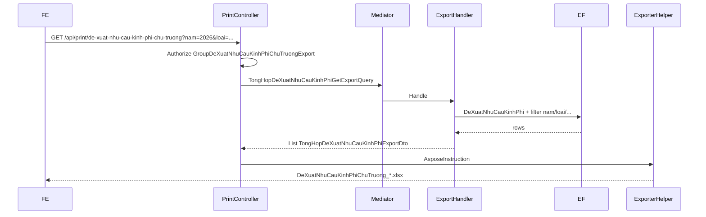

# Issue #9464 — Export Excel đề xuất nhu cầu kinh phí (chủ trương mới / chuyển tiếp)

**Ngày tạo:** June 2026  
**Cập nhật:** June 2026  
**Trạng thái:** ✅ **IMPLEMENTED** (backend) — FE chưa gắn nút  
**Issue:** #9464  
**Pattern tham chiếu:** `PrintController.InDanhSachXinChuTruongDauTu` (6 cột LINQ + Aspose + `LetterheadExport`)  
**Doc export liên quan:**
- [`task-export-bao-cao-de-xuat-chu-truong.md`](./task-export-bao-cao-de-xuat-chu-truong.md) — cùng module `tong-hop-de-xuat-chu-truong`, **khác cột**
- [`../DeXuatNhuCauKinhPhi/task-export-danh-muc-xin-chu-truong-dau-tu.md`](../DeXuatNhuCauKinhPhi/task-export-danh-muc-xin-chu-truong-dau-tu.md) — **cùng 6 cột UI**, khác API list / filter  
**Hướng dẫn Aspose:** [`QLDA.WebApi/PrintTemplates/huong-dan.md`](../../../QLDA.WebApi/PrintTemplates/huong-dan.md)  
**Codegen template:** [`QLDA.Gen`](../../../QLDA.Gen/) — layout `LetterheadExport`

---

## ⚠️ Phân biệt màn hình / export (tránh nhầm)

| Màn hình / Issue | API list (theo issue / source) | Cột grid / Excel | Export đã có? |
|------------------|-------------------------------|------------------|---------------|
| **#9464 — Đề xuất nhu cầu KP (CT mới / CT)** *(task này)* | `GET /api/tong-hop-de-xuat-chu-truong/danh-sach?nam=…` | STT, Trích yếu, Kinh phí đề xuất (đ), Phòng đề xuất, Số phiếu chuyển, Trạng thái | ❌ Chưa có |
| Báo cáo → Đề xuất chủ trương | Cùng API list trên | STT, Loại đề xuất, Tên dự án, Phòng ban phụ trách + stats | ✅ `GET /api/print/bao-cao-de-xuat-chu-truong` |
| Danh mục xin chủ trương đầu tư (tiến độ dự án) | `GET /api/de-xuat-nhu-cau-kinh-phi/danh-sach-tien-do` | **Cùng 6 cột** như #9464 | ✅ `GET /api/print/danh-sach-xin-chu-truong-dau-tu` |

> **Phát hiện quan trọng khi khảo sát source (xem mục 0.7):** API list `tong-hop-de-xuat-chu-truong/danh-sach` **hiện tại** trả về `TenDuAn`, `Loai`, `TenPhongBanPhuTrach`, `TenTrangThai` — **không khớp** 6 cột trong screenshot issue #9464. Cần xác nhận BA/FE trước khi code (mục Open Questions).

---

## 📋 Executive Summary

**Tính năng:** User bấm **Xuất Excel** trên màn tổng hợp đề xuất chủ trương (filter `nam`, loại mới/chuyển tiếp), tải file `.xlsx` đúng dữ liệu grid sau filter — **không phân trang**.

| Khía cạnh | Giá trị đề xuất |
|-----------|-----------------|
| Tên nghiệp vụ / UI | Đề xuất nhu cầu kinh phí — dự án / dự toán / KHT xin chủ trương mới / chuyển tiếp |
| API danh sách tham chiếu (issue) | `GET /api/tong-hop-de-xuat-chu-truong/danh-sach` |
| **API export đề xuất** | `GET /api/print/de-xuat-nhu-cau-kinh-phi-chu-truong` |
| Controller list | `TongHopDeXuatChuTruongController` |
| Query list hiện tại | `TongHopDeXuatChuTruongGetDanhSachQuery` |
| **Query export mới** | `TongHopDeXuatNhuCauKinhPhiGetExportQuery` *(tên đề xuất)* |
| DTO export row | `TongHopDeXuatNhuCauKinhPhiExportDto` *(tên đề xuất — 6 cột)* |
| Search DTO list | `DeXuatChuTruongMoiSearchDto` |
| PrintSearchModel | `TongHopDeXuatNhuCauKinhPhiPrintSearchModel` *(mới)* |
| Template | `QLDA.WebApi/PrintTemplates/DeXuatNhuCauKinhPhiChuTruong.xlsx` |
| QLDA.Gen slug | `de-xuat-nhu-cau-kinh-phi-chu-truong` |
| Layout template | `LetterheadExport` |
| Phân quyền đề xuất | `RoleConstants.GroupDeXuatNhuCauKinhPhiChuTruongExport` *(mới)* |
| Migration | Không cần |
| Stored procedure | Không (LINQ + Aspose) |

**Effort ước tính:** ~4–5 giờ (backend), phụ thuộc xác nhận nguồn dữ liệu ở mục 0.7.

---

## 🖼️ Mapping cột UI → Excel (theo issue #9464)

| # | Cột UI (issue) | Property export đề xuất | Nguồn dữ liệu (giả định) | Format Excel |
|---|----------------|-------------------------|--------------------------|--------------|
| 1 | STT | `Stt` | `index + 1` | Căn giữa |
| 2 | Trích yếu | `TrichYeu` | `DeXuatNhuCauKinhPhi.TrichYeu` | Wrap, căn trái |
| 3 | Kinh phí đề xuất (đ) | `KinhPhiDeXuat` | `DeXuatNhuCauKinhPhi.KinhPhiDeXuat` | `#,##0`, căn phải, **kiểu số** |
| 4 | Phòng đề xuất | `TenPhongDeXuat` | `DmDonVi.TenDonVi` qua `DonViDeXuatId` | Căn trái |
| 5 | Số phiếu chuyển | `SoPhieuChuyen` | `DeXuatNhuCauKinhPhi.SoPhieuChuyen` | Căn trái |
| 6 | Trạng thái | `TenTrangThai` | `TrangThai.Ten` hoặc fallback `TenDuThao` | Text giống UI, VD: `Đã trình` |

**Không export:** cột thao tác `...`, badge UI-only, đính kèm, checkbox, v.v.

**Logic trạng thái** (copy từ export đã có `DeXuatNhuCauKinhPhiGetDanhSachExportQuery`):

```csharp
TenTrangThai = e.TrangThai != null && e.TrangThai.Ma != "LEG"
    ? e.TrangThai.Ten
    : TrangThaiPheDuyetCodes.Default.TenDuThao
```

---

## 🔍 Phase 0 — Khảo sát source (đã xác minh)

### 0.1 API / Controller danh sách

| Thành phần | Vị trí |
|------------|--------|
| Controller | `QLDA.WebApi/Controllers/TongHopDeXuatChuTruongController.cs` |
| Route | `[Route("api/tong-hop-de-xuat-chu-truong")]` |
| Endpoint | `[HttpGet("danh-sach")]` |
| Handler | `QLDA.Application/TongHopDeXuatChuTruong/Queries/TongHopDeXuatChuTruongGetDanhSachQuery.cs` |
| Response | `TongHopDeXuatChuTruongResponseDto` |

**Controller map params:**

```csharp
new TongHopDeXuatChuTruongGetDanhSachQuery {
    DuAnId = req.DuAnId,
    BuocId = req.BuocId,
    GlobalFilter = req.GlobalFilter,
    PageIndex = req.PageIndex,
    PageSize = req.PageSize,
    IsNoTracking = true,
    Loai = req.Loai,
    Nam = req.Nam,
}
```

**Search DTO:** `DeXuatChuTruongMoiSearchDto` có thêm `LoaiDuAnTheoNamId`, `DonViPhuTrachId` — **controller list chưa map** 2 field này.

### 0.2 Dữ liệu nguồn list **hiện tại**

Handler **union** 2 entity (không phải `DeXuatNhuCauKinhPhi`):

```
DeXuatChuTruongMoi (Loai = "DeXuatMoi")
        ∪ Concat
DeXuatChuyenTiep   (Loai = "ChuyenTiep")
        → TongHopDeXuatChuTruongDto
```

| Field list hiện tại | Nguồn | Có trong issue #9464? |
|---------------------|-------|----------------------|
| `TenDuAn` | `DuAn.TenDuAn` | ❌ |
| `Loai` | `"DeXuatMoi"` / `"ChuyenTiep"` | ❌ |
| `TenPhongBanPhuTrach` | `CreatedBy` → `UserMaster.PhongBanId` → `DmDonVi` | ❌ *(issue dùng **Phòng đề xuất**)* |
| `TenTrangThai` | `TrangThai.Ten` | ✅ *(cột Trạng thái)* |
| `TrichYeu` | — | ❌ **không có trên entity Moi/CT** |
| `KinhPhiDeXuat` | — | ❌ |
| `SoPhieuChuyen` | — | ❌ |

Entity `DeXuatChuTruongMoi` có `TomTatNoiDung`, `TongMucDauTu` — **không** có `SoPhieuChuyen`.  
Entity `DeXuatChuyenTiep` có `NhuCauKinhPhi` — **không** có `TrichYeu`, `SoPhieuChuyen`.

### 0.3 Filter list hiện tại

| Param | Handler list | Controller truyền? | Ghi chú |
|-------|--------------|-------------------|---------|
| `nam` | ✅ `NamDeXuat` (Moi + CT) | ✅ | Issue sample: `nam=2026` |
| `loai` | ✅ subset union | ✅ | `DeXuatMoi` / `ChuyenTiep` / null = cả hai |
| `duAnId` | ✅ | ✅ | |
| `buocId` | ✅ (> 0) | ✅ | |
| `donViPhuTrachId` | ✅ chỉ nhánh Moi | ❌ | Có trong SearchDto, controller **chưa map** |
| `loaiDuAnTheoNamId` | ❌ | ❌ | Có trong SearchDto (#9609), chưa dùng |
| `globalFilter` | ❌ | ✅ truyền nhưng **bỏ qua** | |
| `pageIndex` / `pageSize` | ✅ list only | ✅ | Export: **không** truyền |

**Stats trên response list:** `TongDeXuatMoi`, `TongDeXuatChuyenTiep` — đếm **toàn bộ** theo filter (không phụ thuộc `loai` subset).

### 0.4 Export đã có trong cùng module (khác phạm vi)

| Endpoint | File handler | Cột export | Dùng cho #9464? |
|----------|--------------|------------|-----------------|
| `GET /api/print/bao-cao-de-xuat-chu-truong` | `TongHopDeXuatChuTruongGetExportQuery` | STT, Loại đề xuất, Tên dự án, Phòng ban phụ trách + stats R4 | ❌ Khác cột |
| `GET /api/print/danh-sach-xin-chu-truong-dau-tu` | `DeXuatNhuCauKinhPhiGetDanhSachExportQuery` | **Đúng 6 cột issue** | ⚠️ Cùng cột nhưng list API khác, **không có filter `nam`** |

### 0.5 Pattern export project (bắt buộc bám)

1. Endpoint đặt tại **`PrintController`** — không thêm vào controller CRUD/list.
2. Application: `*GetExportQuery` + `*ExportDto` — không tạo model mapping ở WebApi.
3. WebApi: `*PrintSearchModel` mirror filter list (bỏ pagination).
4. Template Aspose trong **`PrintTemplates/`** (runtime), codegen qua `QLDA.Gen`.
5. `IExporterHelper.Export(AsposeInstruction<T>)` — `AutoFitColumnsAndRows = false`, set width trong descriptor.
6. Phân quyền: `[Authorize(Roles = RoleConstants.Group…)]` trên action PrintController.

**Tham chiếu code gần nhất (6 cột giống issue):**

```787:821:QLDA.WebApi/Controllers/PrintController.cs
    [HttpGet("api/print/danh-sach-xin-chu-truong-dau-tu")]
    [Authorize(Roles = RoleConstants.GroupXinChuTruongDauTuExport)]
    public async Task<IActionResult> InDanhSachXinChuTruongDauTu(
        [FromQuery] DeXuatNhuCauKinhPhiPrintSearchModel searchModel)
    {
        // ... template DanhSachXinChuTruongDauTu.xlsx
        var data = await Mediator.Send(new DeXuatNhuCauKinhPhiGetDanhSachExportQuery { ... });
        var exportResult = _excelExporter.Export(new AsposeInstruction<DeXuatNhuCauKinhPhiExportDto> { ... });
    }
```

### 0.6 Phân quyền

| Controller | `[Authorize]` riêng? |
|------------|---------------------|
| `TongHopDeXuatChuTruongController` | Không — kế thừa middleware chung |
| `DeXuatNhuCauKinhPhiController` | Không |

Export gần đây dùng group role trong `RoleConstants.cs` (VD: `GroupBaoCaoDeXuatChuTruongExport`, `GroupXinChuTruongDauTuExport`).

**Đề xuất cho #9464** — tách constant mới (tránh reuse nhầm export danh mục tiến độ dự án):

```csharp
/// <summary>
/// Kết xuất Excel đề xuất nhu cầu kinh phí chủ trương (tổng hợp CT mới / chuyển tiếp)
/// </summary>
public const string GroupDeXuatNhuCauKinhPhiChuTruongExport =
    $"{QLDA_TatCa},{QLDA_QuanTri},{QLDA_LDDV},{QLDA_ChuyenVien}";
```

> Cần BA xác nhận có hẹp hơn (chỉ CB/LĐ.PCT) hay giữ convention admin như các export khác.

### 0.7 ⚠️ Gap nghiệp vụ — **đọc trước khi code**

| # | Vấn đề | Chi tiết |
|---|--------|----------|
| 1 | **Cột UI ≠ response list hiện tại** | Issue #9464 yêu cầu 6 cột thuộc entity `DeXuatNhuCauKinhPhi`, nhưng `TongHopDeXuatChuTruongGetDanhSachQuery` query `DeXuatChuTruongMoi` + `DeXuatChuyenTiep` với cột khác. |
| 2 | **Filter `nam`** | `DeXuatNhuCauKinhPhi` **không có** `NamDeXuat`. Filter `nam` trên list tong-hop áp vào `NamDeXuat` của Moi/CT. |
| 3 | **Phòng đề xuất** | Issue: `DonViDeXuatId` → tên phòng. List tong-hop hiện tại: phòng của user `CreatedBy`. |
| 4 | **Export trùng cột đã có** | `danh-sach-xin-chu-truong-dau-tu` đã export 6 cột tương tự nhưng từ API `de-xuat-nhu-cau-kinh-phi/danh-sach-tien-do` (không `nam`). |

**Giả thuyết triển khai được đề xuất (cần BA/FE confirm):**

Export #9464 query **`DeXuatNhuCauKinhPhi`**, giới hạn các bản ghi thuộc dự án có đề xuất chủ trương trong năm `nam`:

```csharp
// Pseudo-filter nam + loai
var duAnCoDeXuatMoi = DeXuatChuTruongMoi
    .Where(m => m.NamDeXuat == nam && !m.IsDeleted && !m.DuAn!.IsDeleted)
    .Select(m => m.DuAnId);

var duAnCoChuyenTiep = DeXuatChuyenTiep
    .Where(ct => ct.NamDeXuat == nam && !ct.IsDeleted && !ct.DuAn!.IsDeleted)
    .Select(ct => ct.DuAnId);

// loai = null  → union cả hai
// loai = DeXuatMoi → chỉ duAnCoDeXuatMoi
// loai = ChuyenTiep → chỉ duAnCoChuyenTiep

DeXuatNhuCauKinhPhi
    .Where(e => !e.DuAn!.IsDeleted)
    .Where(e => duAnIds.Contains(e.DuAnId))
    // + duAnId, buocId, loaiDuAnTheoNamId (nếu BA yêu cầu), globalFilter...
```

**Nếu BA xác nhận list API sẽ được sửa trước** để trả đúng 6 cột → export **bắt buộc** dùng chung projection/filter với list (refactor `BuildQueryable` private dùng chung).

**Nếu BA xác nhận issue nhầm API** → có thể chỉ cần bổ sung `nam` (+ `loai`) vào `DeXuatNhuCauKinhPhiGetDanhSachExportQuery` và reuse endpoint `danh-sach-xin-chu-truong-dau-tu` — **không tạo endpoint mới**.

---

## 🏗️ Kiến trúc đề xuất (sau khi chốt nguồn dữ liệu)

```
Màn tổng hợp đề xuất chủ trương (#9464)
├── GET /api/tong-hop-de-xuat-chu-truong/danh-sach     → Grid (phân trang) — cần khớp 6 cột
└── GET /api/print/de-xuat-nhu-cau-kinh-phi-chu-truong → Export Excel (toàn bộ filter)

TongHopDeXuatChuTruongGetDanhSachQuery          ← list (có thể cần sửa projection)
TongHopDeXuatNhuCauKinhPhiGetExportQuery        ← export mới (đề xuất)
```



**Chiến lược tái sử dụng logic:**

1. **Ưu tiên:** Extract `BuildExportQueryable(...)` dùng chung list + export sau khi list được cập nhật đúng 6 cột.
2. **Chấp nhận được:** Copy filter từ list + thêm join `DeXuatNhuCauKinhPhi` (pattern `DeXuatNhuCauKinhPhiGetDanhSachExportQuery`).
3. **Không làm:** `PageSize = int.MaxValue` trên list query — dễ lệch sort/stats.

**Sort export đề xuất:** `OrderBy CreatedAt` → `ThenBy Id` (đồng bộ `DeXuatNhuCauKinhPhiGetDanhSachExportQuery`).

---

## 📂 Files dự kiến tạo / sửa

### Tạo mới

| File | Mô tả |
|------|-------|
| `QLDA.Application/TongHopDeXuatChuTruong/DTOs/TongHopDeXuatNhuCauKinhPhiExportDto.cs` | 6 property = placeholder template |
| `QLDA.Application/TongHopDeXuatChuTruong/Queries/TongHopDeXuatNhuCauKinhPhiGetExportQuery.cs` | Query + handler export |
| `QLDA.WebApi/Models/TongHopDeXuatChuTruongs/TongHopDeXuatNhuCauKinhPhiPrintSearchModel.cs` | Params export |
| `QLDA.WebApi/PrintTemplates/DeXuatNhuCauKinhPhiChuTruong.xlsx` | Template Aspose |
| `QLDA.Gen/Descriptors/DeXuatNhuCauKinhPhiChuTruongExportDescriptor.cs` | Descriptor codegen |

### Sửa

| File | Thay đổi |
|------|----------|
| `QLDA.Domain/Constants/RoleConstants.cs` | ➕ `GroupDeXuatNhuCauKinhPhiChuTruongExport` |
| `QLDA.WebApi/Controllers/PrintController.cs` | ➕ region + `InDeXuatNhuCauKinhPhiChuTruong` |
| `QLDA.Gen/Program.cs` | Đăng ký slug `de-xuat-nhu-cau-kinh-phi-chu-truong` |

### Có thể sửa (phụ thuộc BA)

| File | Khi nào |
|------|---------|
| `TongHopDeXuatChuTruongGetDanhSachQuery.cs` | List phải trả đúng 6 cột trước khi export go-live |
| `TongHopDeXuatChuTruongController.cs` | Map thêm `LoaiDuAnTheoNamId`, `DonViPhuTrachId` nếu BA yêu cầu |

### Không sửa

| File | Lý do |
|------|-------|
| Migration / snapshot | Không đổi schema |
| `DeXuatNhuCauKinhPhiGetDanhSachExportQuery` | Trừ khi chọn hướng reuse + thêm `nam` |
| `bao-cao-de-xuat-chu-truong` export | Phạm vi khác |

---

## 🚀 Step-by-Step Implementation

### Phase 1: Xác nhận BA (~30 phút) — **blocking**

- [ ] Chốt nguồn dữ liệu: `DeXuatNhuCauKinhPhi` join Moi/CT theo `nam` **hay** sửa list query hiện tại?
- [ ] List API có được cập nhật 6 cột trong cùng sprint không?
- [ ] `loaiDuAnTheoNamId` (dự án / dự toán / KHT) có bắt buộc trên list + export?
- [ ] Role export: giữ `GroupBaoCaoDeXuatChuTruongExport` hay tạo group mới?

### Phase 2: QLDA.Gen — Template (~45 phút)

**Descriptor đề xuất:**

```csharp
public class DeXuatNhuCauKinhPhiChuTruongExportDescriptor : IExportDescriptor {
    public string EntityName => "Đề xuất nhu cầu kinh phí chủ trương";
    public string TemplateFileName => "DeXuatNhuCauKinhPhiChuTruong.xlsx";
    public TemplateLayoutType Layout => TemplateLayoutType.LetterheadExport;
    public string? Title => "ĐỀ XUẤT NHU CẦU KINH PHÍ CHỦ TRƯƠNG ĐẦU TƯ";

    public List<ExportColumn> Columns { get; } =
    [
        new("Stt", "STT", 6, null, false, ColumnAlign.Center),
        new("TrichYeu", "Trích yếu", 50, null, true, ColumnAlign.Left),
        new("KinhPhiDeXuat", "Kinh phí đề xuất (đ)", 22, "#,##0", false, ColumnAlign.Right),
        new("TenPhongDeXuat", "Phòng đề xuất", 28, null, false, ColumnAlign.Left),
        new("SoPhieuChuyen", "Số phiếu chuyển", 22, null, false, ColumnAlign.Left),
        new("TenTrangThai", "Trạng thái", 24, null, false, ColumnAlign.Left),
    ];
}
```

**Regenerate:**

```bash
cd QLDA.Gen
dotnet run -- de-xuat-nhu-cau-kinh-phi-chu-truong --force "E:\SER\QLDA.WebApi\PrintTemplates"
```

> Có thể **reuse** file `DanhSachXinChuTruongDauTu.xlsx` nếu layout/cột giống hệt — chỉ đổi title R3. Ưu tiên file riêng nếu title nghiệp vụ khác.

### Phase 3: Application — Export DTO + Query (~1.5 giờ)

**Export DTO** (có thể alias/reuse `DeXuatNhuCauKinhPhiExportDto` nếu property trùng 100%):

```csharp
public class TongHopDeXuatNhuCauKinhPhiExportDto {
    public int Stt { get; set; }
    public string? TrichYeu { get; set; }
    public long? KinhPhiDeXuat { get; set; }
    public string? TenPhongDeXuat { get; set; }
    public string? SoPhieuChuyen { get; set; }
    public string? TenTrangThai { get; set; }
}
```

**Query record:**

```csharp
public record TongHopDeXuatNhuCauKinhPhiGetExportQuery : IMayHaveGlobalFilter,
    IRequest<List<TongHopDeXuatNhuCauKinhPhiExportDto>> {
    public Guid? DuAnId { get; set; }
    public int? BuocId { get; set; }
    public string? GlobalFilter { get; set; }
    public string? Loai { get; set; }
    public int? Nam { get; set; }
    public int? LoaiDuAnTheoNamId { get; set; }
    public long? DonViPhuTrachId { get; set; }
}
```

**Handler logic (pseudo):**

1. Tính tập `duAnIds` từ Moi/CT theo `nam` + `loai` (mục 0.7).
2. Query `DeXuatNhuCauKinhPhi` với `duAnIds.Contains(e.DuAnId)`.
3. Áp dụng `WhereIf` đồng bộ list: `duAnId`, `buocId`, `loaiDuAnTheoNamId` (join `DuAn`).
4. `GlobalFilter` trên `TrichYeu`, `SoPhieuChuyen`, `TenPhongDeXuat` (tham khảo export xin chủ trương đã có).
5. `ToListAsync` — **không** phân trang.
6. Map `Stt = index + 1`.

### Phase 4: WebApi — PrintSearchModel + PrintController (~45 phút)

**Route đề xuất:**

```
GET /api/print/de-xuat-nhu-cau-kinh-phi-chu-truong
```

**Query params (mirror list, bỏ pagination):**

| Param | Kiểu | Mô tả |
|-------|------|-------|
| `nam` | `int?` | Bắt buộc theo issue sample |
| `loai` | `string?` | `DeXuatMoi` / `ChuyenTiep` |
| `duAnId` | `Guid?` | |
| `buocId` | `int?` | |
| `loaiDuAnTheoNamId` | `int?` | Nếu BA yêu cầu |
| `donViPhuTrachId` | `long?` | Parity SearchDto |
| `globalFilter` | `string?` | |
| `hiddenColumns` | `string[]` | Optional |

**Tên file tải về:** `DeXuatNhuCauKinhPhiChuTruong_yyyyMMddHHmmss.xlsx`

```csharp
[HttpGet("api/print/de-xuat-nhu-cau-kinh-phi-chu-truong")]
[Authorize(Roles = RoleConstants.GroupDeXuatNhuCauKinhPhiChuTruongExport)]
public async Task<IActionResult> InDeXuatNhuCauKinhPhiChuTruong(
    [FromQuery] TongHopDeXuatNhuCauKinhPhiPrintSearchModel searchModel)
{
    // check template + login
    var data = await Mediator.Send(new TongHopDeXuatNhuCauKinhPhiGetExportQuery { ... });
    var exportResult = _excelExporter.Export(new AsposeInstruction<TongHopDeXuatNhuCauKinhPhiExportDto> {
        TemplatePath = templatePath,
        Items = data,
        HiddenColumns = searchModel.HiddenColumns ?? [],
        AutoFitColumnsAndRows = false,
    });
    return new FileContentResult(...);
}
```

### Phase 5: Build & verify (~30 phút)

```bash
dotnet build E:\SER\SER.sln
```

| Case | Kỳ vọng |
|------|---------|
| `nam=2026`, có data | File có đủ 6 cột, STT 1..N |
| Cùng filter với list | `exportRows.Count == listResponse.Data.TotalCount` |
| `loai=DeXuatMoi` | Chỉ dự án có đề xuất mới năm `nam` |
| `kinhPhiDeXuat` | Ô Excel kiểu number `#,##0`, không string |
| `tenTrangThai` | Text `Đã trình` giống UI |
| Không data | File có letterhead + header, 0 dòng data |
| Thiếu role | 403 |
| Chưa đăng nhập | 400 |

### Phase 6: Tích hợp FE (~30 phút)

```typescript
const params = new URLSearchParams({
  ...(nam != null && { nam: String(nam) }),
  ...(loai && { loai }),
  ...(duAnId && { duAnId }),
  ...(buocId && { buocId: String(buocId) }),
  ...(globalFilter && { globalFilter }),
});

window.open(`/api/print/de-xuat-nhu-cau-kinh-phi-chu-truong?${params}`, '_blank');
```

**Lưu ý:** Không gửi `pageIndex` / `pageSize`.

---

## ❓ Open Questions (cần BA / FE xác nhận trước code)

1. **API list đúng chưa?** Issue ghi `tong-hop-de-xuat-chu-truong/danh-sach` nhưng response hiện tại **không có** 6 cột screenshot. FE màn #9464 đang gọi API nào?
2. **Nguồn dữ liệu export:** `DeXuatNhuCauKinhPhi` lọc theo dự án có Moi/CT `nam` — có đúng nghiệp vụ?
3. **Cập nhật list handler:** Có làm trong scope #9464 hay task riêng?
4. **`loaiDuAnTheoNamId`:** Có filter dự án / dự toán / KHT trên màn này không?
5. **Reuse export cũ:** Có đủ bổ sung `nam`/`loai` vào `danh-sach-xin-chu-truong-dau-tu` thay vì endpoint mới?
6. **Phân quyền:** Dùng `GroupBaoCaoDeXuatChuTruongExport` hay group riêng?
7. **`GlobalFilter`:** List hiện bỏ qua — export có implement không (để khớp ô tìm kiếm FE)?

---

## 📊 Effort Breakdown

| Phase | Task | Giờ | Phụ thuộc |
|-------|------|-----|-----------|
| 1 | Xác nhận BA / gap list | 0.5 | Blocking |
| 2 | QLDA.Gen descriptor + template | 0.75 | |
| 3 | Export DTO + Query | 1.5 | Phase 1 |
| 4 | PrintSearchModel + PrintController + Role | 0.75 | |
| 5 | Build + test Swagger | 0.5 | |
| 6 | FE nút Xuất Excel | 0.5 | Backend xong |
| **Tổng** | | **~4.5** | |

---

## 📞 Common Issues (dự đoán)

| Vấn đề | Nguyên nhân | Giải pháp |
|--------|-------------|-----------|
| Excel khác grid | List chưa cập nhật / query khác nguồn | Chốt BA mục 0.7; dùng chung `BuildQueryable` |
| Số dòng export ≠ grid | Filter `nam`/`loai` lệch | Copy `WhereIf` từ list; test `TotalCount` |
| Cột kinh phí là text | Template thiếu `#,##0` | Descriptor format + DTO `long?` |
| Phòng đề xuất trống | Dùng `CreatedBy` thay `DonViDeXuatId` | JOIN `DmDonVi` qua `DonViDeXuatId` |
| Nhầm với báo cáo CT | 2 export cùng module | Phân biệt bảng ở đầu doc |
| Template not found | Output sai folder | `PrintTemplates/`, không `ExportTemplates/` |

---

## 🔗 Files tham chiếu

| File | Vai trò |
|------|---------|
| `TongHopDeXuatChuTruongController.cs` | API list issue tham chiếu |
| `TongHopDeXuatChuTruongGetDanhSachQuery.cs` | Logic list hiện tại |
| `DeXuatNhuCauKinhPhiGetDanhSachExportQuery.cs` | Pattern 6 cột + map trạng thái |
| `PrintController.InDanhSachXinChuTruongDauTu` | Pattern endpoint export |
| `PrintController.InBaoCaoDeXuatChuTruong` | Export cùng module, khác cột |
| `DanhSachXinChuTruongDauTu.xlsx` | Template tham chiếu layout 6 cột |
| `TongHopNhuCauKinhPhiNamExportDescriptor.cs` | Pattern QLDA.Gen `LetterheadExport` |

---

## ✅ Validation Checklist (khi implement)

### Code Quality

- [ ] Export DTO compile
- [ ] Export query compile
- [ ] QLDA.Gen descriptor + slug registered
- [ ] Template trong `PrintTemplates/`
- [ ] PrintController endpoint + `[Authorize]`
- [ ] `dotnet build SER.sln` pass

### Chức năng

- [ ] 6 cột khớp issue #9464
- [ ] Filter export khớp list (sau khi chốt nguồn dữ liệu)
- [ ] `nam=2026` hoạt động đúng
- [ ] STT 1..N liên tục
- [ ] `KinhPhiDeXuat` format số `#,##0`
- [ ] `TenTrangThai` text giống UI
- [ ] Không sửa migration
- [ ] So sánh số dòng grid vs export trên staging

### FE

- [ ] Nút Xuất Excel gọi đúng API + params (không pagination)
- [ ] Cùng filter với grid khi user đổi `nam` / `loai`
