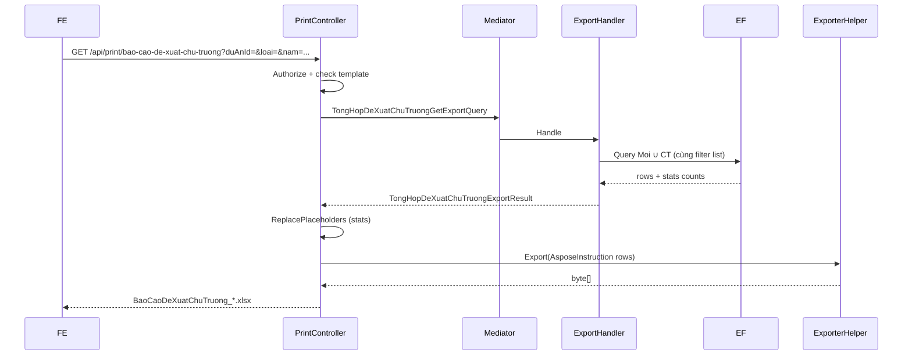

# Export Excel — Báo cáo Đề xuất chủ trương

**Ngày tạo:** June 2026  
**Cập nhật:** June 2026  
**Trạng thái:** ✅ **IMPLEMENTED** (backend) — FE chưa gắn nút  
**Effort:** ~5 giờ  
**FE route tham chiếu:** `/quan-ly-du-an/bao-cao/de-xuat-chu-truong`  
**Pattern tham chiếu:** `Import_DeXuatChuTruongChuyenTiep.xlsx` (letterhead) + `PrintController.InTongHopNhuCauKinhPhiNam` (codegen QLDA.Gen)  
**Doc export tương tự:** [`task-export-tong-hop-nhu-cau-kinh-phi-nam.md`](../DeXuatNhuCauKinhPhi/task-export-tong-hop-nhu-cau-kinh-phi-nam.md)  
**Hướng dẫn Aspose:** [`QLDA.WebApi/PrintTemplates/huong-dan.md`](../../../QLDA.WebApi/PrintTemplates/huong-dan.md)  
**Codegen template:** [`QLDA.Gen`](../../../QLDA.Gen/)

---

## 📋 Executive Summary

**Tính năng:** User bấm **In excel** trên màn **Báo cáo → Đề xuất chủ trương**, tải file `.xlsx` khớp dữ liệu grid (cùng filter, **không phân trang**), kèm 3 chỉ số tổng quan trên UI.

| Khía cạnh | Giá trị |
|-----------|---------|
| Tên nghiệp vụ / UI | Báo cáo Đề xuất chủ trương |
| **Controller danh sách** | `TongHopDeXuatChuTruongController` |
| **API danh sách grid** | `GET /api/tong-hop-de-xuat-chu-truong/danh-sach` |
| **API export (đã có)** | `GET /api/print/bao-cao-de-xuat-chu-truong` |
| **Query list** | `TongHopDeXuatChuTruongGetDanhSachQuery` |
| **Query export** | `TongHopDeXuatChuTruongGetExportQuery` |
| **DTO list response** | `TongHopDeXuatChuTruongResponseDto` |
| **DTO list item** | `TongHopDeXuatChuTruongDto` |
| **DTO export row** | `TongHopDeXuatChuTruongExportDto` |
| **DTO export result** | `TongHopDeXuatChuTruongExportResult` |
| **Search DTO (list)** | `DeXuatChuTruongMoiSearchDto` (kế thừa `CommonSearchDto`) |
| **PrintSearchModel** | `TongHopDeXuatChuTruongPrintSearchModel` |
| **Template** | `QLDA.WebApi/PrintTemplates/BaoCaoDeXuatChuTruong.xlsx` |
| **QLDA.Gen slug** | `bao-cao-de-xuat-chu-truong` |
| **Layout template** | `LetterheadExportWithSummary` *(letterhead UBND + title + stats + header xanh — giống `Import_DeXuatChuTruongChuyenTiep.xlsx`)* |
| **Phân quyền** | `RoleConstants.GroupBaoCaoDeXuatChuTruongExport` |
| **Migration** | Không cần |
| **Stored procedure** | Không (LINQ + Aspose) |

> **Không nhầm với:**
> - `GET /api/de-xuat-chu-truong-moi/danh-sach` → danh sách **chỉ đề xuất mới** (module CRUD)
> - `GET /api/de-xuat-chu-truong-chuyen-tiep/danh-sach-tien-do` → tab tiến độ **chuyển tiếp**
> - `GET /api/print/danh-sach-de-xuat-chu-truong-chuyen-tiep` → export tab tiến độ chuyển tiếp (6 cột số liệu)

---

## 🔍 Phase 0 — Báo cáo khảo sát source (đã xác minh)

### 0.1 API / Controller hiện tại

| Thành phần | Vị trí |
|------------|--------|
| Controller | `QLDA.WebApi/Controllers/TongHopDeXuatChuTruongController.cs` |
| Route | `[Route("api/tong-hop-de-xuat-chu-truong")]` |
| Endpoint list | `[HttpGet("danh-sach")]` |
| Handler | `QLDA.Application/TongHopDeXuatChuTruong/Queries/TongHopDeXuatChuTruongGetDanhSachQuery.cs` |
| Response DTO | `TongHopDeXuatChuTruongResponseDto` |

**Controller map params:**

```csharp
// TongHopDeXuatChuTruongController.Get
new TongHopDeXuatChuTruongGetDanhSachQuery {
    DuAnId = req.DuAnId,
    BuocId = req.BuocId,
    GlobalFilter = req.GlobalFilter,
    PageIndex = req.PageIndex,
    PageSize = req.PageSize,
    IsNoTracking = true,
    Loai = req.Loai,
    Nam = req.Nam,
}
```

### 0.2 Dữ liệu nguồn

Handler **union** 2 nguồn EF:

```
DeXuatChuTruongMoi (Loai = "DeXuatMoi")
        ∪ Concat
DeXuatChuyenTiep   (Loai = "ChuyenTiep")
        → TongHopDeXuatChuTruongDto
```

| Field grid | Nguồn | Ghi chú |
|------------|-------|---------|
| `TenDuAn` | `DuAn.TenDuAn` | |
| `TenPhongBanPhuTrach` | `CreatedBy` → `UserMaster.PhongBanId` → `DmDonVi.TenDonVi` | Không dùng `DonViPhuTrachChinhId` |
| `Loai` | `"DeXuatMoi"` / `"ChuyenTiep"` | FE hiển thị badge **Chủ trương mới** / **Chuyển tiếp** |
| `TongDeXuatMoi` | `Count()` trên `queryableMoi` | Luôn đếm **toàn bộ** (không phụ thuộc `Loai` filter) |
| `TongDeXuatChuyenTiep` | `Count()` trên `queryableCT` | Tương tự |
| **Tổng số đề xuất (UI)** | `TongDeXuatMoi + TongDeXuatChuyenTiep` | Ví dụ screenshot: 55 = 22 + 33 |

### 0.3 Filter thực tế trong handler

| Param | Áp dụng Đề xuất mới | Áp dụng Chuyển tiếp | Controller truyền? |
|-------|---------------------|---------------------|-------------------|
| `DuAnId` | ✅ | ✅ | ✅ |
| `BuocId` (> 0) | ✅ | ✅ | ✅ |
| `Nam` | ✅ | ✅ | ✅ |
| `DonViPhuTrachId` | ✅ (`DonViPhuTrachChinhId`) | ❌ | ❌ *(có trong `DeXuatChuTruongMoiSearchDto` nhưng controller **không map**)* |
| `Loai` | Chỉ chọn query phân trang | Chỉ chọn query phân trang | ✅ |
| `GlobalFilter` | ❌ **chưa filter** | ❌ **chưa filter** | ✅ truyền nhưng handler **bỏ qua** |
| `PageIndex` / `PageSize` | ✅ list only | ✅ list only | ✅ |

**Quy tắc `Loai` (quan trọng cho export):**

| `Loai` | Data grid | Stats |
|--------|-----------|-------|
| `null` / rỗng | Union cả hai | Đếm cả hai |
| `"DeXuatMoi"` | Chỉ mới | Vẫn đếm **cả hai** (stats không đổi) |
| `"ChuyenTiep"` | Chỉ chuyển tiếp | Vẫn đếm **cả hai** |

Export **phải bám đúng hành vi trên** — không tự ý đổi logic stats khi chưa có yêu cầu BA.

### 0.4 Cột UI ↔ Excel

| # | Cột UI | Property list | Cột export | Ghi chú |
|---|--------|---------------|------------|---------|
| 1 | STT | *(client-side / page offset)* | `Stt` | Export: `index + 1` trên **toàn bộ** dataset đã filter |
| 2 | Loại đề xuất | `Loai` | `LoaiDeXuat` | Map: `DeXuatMoi` → `"Chủ trương mới"`, `ChuyenTiep` → `"Chuyển tiếp"` |
| 3 | Tên dự án | `TenDuAn` | `TenDuAn` | Cột rộng nhất |
| 4 | Phòng ban phụ trách | `TenPhongBanPhuTrach` | `PhongBanPhuTrach` | |

### 0.5 Nên đặt API export ở đâu?

**`PrintController`** — đúng convention project:

- Các export LINQ + Aspose gần đây đều ở `QLDA.WebApi/Controllers/PrintController.cs`
- Ví dụ: `InDanhSachDeXuatChuTruongChuyenTiep`, `InTongHopNhuCauKinhPhiNam`
- **Không** thêm endpoint export vào `TongHopDeXuatChuTruongController`

### 0.6 Phân quyền

`TongHopDeXuatChuTruongController` **không** có `[Authorize]` riêng (kế thừa middleware chung).

Export đã thêm constant trong `RoleConstants.cs`:

```csharp
public const string GroupBaoCaoDeXuatChuTruongExport =
    $"{QLDA_TatCa},{QLDA_QuanTri},{QLDA_LDDV},{QLDA_ChuyenVien}";
```

Gắn trên `PrintController.InBaoCaoDeXuatChuTruong` qua `[Authorize(Roles = …)]`.

---

## 🏗️ Kiến trúc đề xuất

```
Màn "Báo cáo → Đề xuất chủ trương"
├── GET /api/tong-hop-de-xuat-chu-truong/danh-sach     → Grid (phân trang + stats)
└── GET /api/print/bao-cao-de-xuat-chu-truong          → Export Excel (toàn bộ filter, có stats)

TongHopDeXuatChuTruongGetDanhSachQuery     ← list (KHÔNG sửa logic filter)
TongHopDeXuatChuTruongGetExportQuery       ← export (copy filter + projection, bỏ phân trang)
```



**Chiến lược tái sử dụng logic:**

1. **Ưu tiên:** Extract method private `BuildQueryable(...)` dùng chung giữa list handler và export handler *(refactor nhỏ, an toàn)*  
2. **Chấp nhận được:** Copy nguyên khối `Where` + `Select` từ list sang export query *(pattern đã dùng ở `TheoDoiDeXuatNhuCauKinhPhiGetExportQuery`)*  
3. **Không làm:** Gọi list query với `PageSize = int.MaxValue` — dễ lệch stats / sort

---

## 📂 Files đã tạo / sửa

### Tạo mới ✅

| File | Mô tả |
|------|-------|
| `QLDA.Application/TongHopDeXuatChuTruong/DTOs/TongHopDeXuatChuTruongExportDto.cs` | 4 cột dữ liệu + `Stt` |
| `QLDA.Application/TongHopDeXuatChuTruong/DTOs/TongHopDeXuatChuTruongExportResult.cs` | `Rows`, `TongDeXuatMoi`, `TongDeXuatChuyenTiep`, `TongSoDeXuat` |
| `QLDA.Application/TongHopDeXuatChuTruong/Queries/TongHopDeXuatChuTruongGetExportQuery.cs` | Query + handler export |
| `QLDA.WebApi/Models/TongHopDeXuatChuTruongs/TongHopDeXuatChuTruongPrintSearchModel.cs` | Params export (= filter list) |
| `QLDA.WebApi/PrintTemplates/BaoCaoDeXuatChuTruong.xlsx` | Template Aspose (codegen QLDA.Gen) |
| `QLDA.Gen/Descriptors/BaoCaoDeXuatChuTruongExportDescriptor.cs` | Descriptor codegen |
| `QLDA.Infrastructure/Offices/ExcelExportTemplateHelper.cs` | Fill stats R4 + `EnsureCellsLicense` trước save temp |

### Sửa ✅

| File | Thay đổi |
|------|----------|
| `QLDA.Domain/Constants/RoleConstants.cs` | ➕ `GroupBaoCaoDeXuatChuTruongExport` |
| `QLDA.WebApi/Controllers/PrintController.cs` | ➕ region `BaoCaoDeXuatChuTruong` + `InBaoCaoDeXuatChuTruong` |
| `QLDA.Gen/Program.cs` | Đăng ký slug `bao-cao-de-xuat-chu-truong` |
| `QLDA.Gen/Descriptors/IExportDescriptor.cs` | ➕ `TemplateLayoutType.LetterheadExportWithSummary` |
| `QLDA.Gen/Generators/TemplateGenerator.cs` | ➕ `BuildLetterheadExportWithSummary` |

### Không sửa ✅

| File | Lý do |
|------|-------|
| Migration / snapshot | Không đổi DB |
| `TongHopDeXuatChuTruongGetDanhSachQuery` | Giữ nguyên; export copy logic filter |
| `TongHopDeXuatChuTruongController` | Export ở `PrintController` |

---

## 🚀 Step-by-Step Implementation

### Phase 1: QLDA.Gen — Template Excel (~45–60 phút)

#### 1.0 Trả lời nhanh — **có làm giống format trong hình được không?**

**Có.** Mẫu trong hình (`Import_DeXuatChuTruongChuyenTiep.xlsx`) và export chủ trương đã có (`DanhSachDeXuatChuTruongChuyenTiep.xlsx`) dùng chung họ visual:

- Letterhead UBND trái / quốc hiệu phải (R1–R2)
- Title in hoa, bold, căn giữa (R3)
- Header bảng nền xanh `#D9E1F2`, chữ đậm, viền mỏng
- Font Times New Roman, wrap text

Codegen qua `QLDA.Gen` layout **`LetterheadExport`** (đã có) + mở rộng **`LetterheadExportWithSummary`** để chèn dòng stats (thay dòng hướng dẫn xám chỉ có ở mẫu import).

#### 1.1 Chọn layout — **giống format letterhead trong hình**

**Tham chiếu trực quan:** `QLDA.WebApi/PrintTemplates/Import_DeXuatChuTruongChuyenTiep.xlsx`  
*(Mẫu import đề xuất chủ trương chuyển tiếp — letterhead UBND, title giữa, header bảng nền xanh `#D9E1F2`, border, wrap text.)*

Export báo cáo dùng **cùng họ visual** với import/export chủ trương đã có:

| Template có sẵn | Layout QLDA.Gen | Ghi chú |
|----------------|-----------------|---------|
| `Import_DeXuatChuTruongChuyenTiep.xlsx` | Hand-crafted | **Hình user gửi** — letterhead + title + header xanh |
| `DanhSachDeXuatChuTruongChuyenTiep.xlsx` | `LetterheadExport` | Export tab tiến độ — cùng letterhead |
| `TongHopNhuCauKinhPhiNam.xlsx` | `LetterheadExport` | Pattern codegen đã chạy production |

**Khác biệt so với import:** Import có **dòng hướng dẫn** (nền xám nhạt, VD: *"Chọn từ danh sách"*) — báo cáo export thay bằng **dòng tổng quan 3 chỉ số** (stats từ API).

→ Dùng layout mới **`LetterheadExportWithSummary`** = `LetterheadExport` + thêm R4 stats.

**Cấu trúc row (sau codegen):**

| Row | Nội dung | Style |
|-----|----------|-------|
| **R1–R2** | Letterhead trái: *ỦY BAN NHÂN DÂN TP.HCM / TRUNG TÂM CHUYỂN ĐỔI SỐ* — phải: *CỘNG HÒA XHCN VN / Độc lập - Tự do - Hạnh phúc* | Bold, merge, căn giữa *(constants `LetterheadLeftText` / `LetterheadRightText` trong `TemplateGenerator`)* |
| **R3** | **BÁO CÁO ĐỀ XUẤT CHỦ TRƯƠNG** | Bold, size title, merge full width, căn giữa |
| **R4** | Tổng quan: `Tổng số đề xuất: $TongSoDeXuat` · `Chủ trương mới: $TongChuTruongMoi` · `Chuyển tiếp: $TongChuyenTiep` | Merge A4:D4, wrap; fill ở Phase 4 qua `ReplacePlaceholders` |
| **R5** | Header bảng: STT \| Loại đề xuất \| Tên dự án \| Phòng ban phụ trách | Nền xanh `#D9E1F2`, **bold**, căn giữa, **thin border** |
| **R6** | Template row: `$Stt` \| `$LoaiDeXuat` \| `$TenDuAn` \| `$PhongBanPhuTrach` | Border, wrap; STT căn giữa; Aspose bind row này |

```
┌─────────────────────────────────────────────────────────────────┐
│  UBND TP.HCM / TT CĐS          │     CỘNG HÒA XHCN VN          │  R1-R2
├─────────────────────────────────────────────────────────────────┤
│              BÁO CÁO ĐỀ XUẤT CHỦ TRƯƠNG                         │  R3
├─────────────────────────────────────────────────────────────────┤
│ Tổng số: $TongSoDeXuat | Chủ trương mới: $... | Chuyển tiếp: $..│  R4
├──────┬──────────────┬─────────────────────┬──────────────────────┤
│ STT  │ Loại đề xuất │ Tên dự án           │ Phòng ban phụ trách  │  R5 (xanh)
├──────┼──────────────┼─────────────────────┼──────────────────────┤
│ $Stt │ $LoaiDeXuat  │ $TenDuAn            │ $PhongBanPhuTrach    │  R6 ← template
└──────┴──────────────┴─────────────────────┴──────────────────────┘
```

**Độ rộng cột:**

| Column | Name | Header | Width |
|--------|------|--------|-------|
| A | `Stt` | STT | 6 |
| B | `LoaiDeXuat` | Loại đề xuất | 22 |
| C | `TenDuAn` | Tên dự án | **50** *(rộng nhất — giống yêu cầu UI)* |
| D | `PhongBanPhuTrach` | Phòng ban phụ trách | 35 |

#### 1.2 Bổ sung layout trong QLDA.Gen

**File:** `QLDA.Gen/Descriptors/IExportDescriptor.cs` — thêm enum:

```csharp
/// <summary>
/// LetterheadExport + summary row before table headers.
/// R1-R2: Letterhead | R3: Title | R4: $TongSo... stats (merged)
/// R5: Blue headers | R6: $Field template row.
/// Used by: bao-cao-de-xuat-chu-truong.
/// </summary>
LetterheadExportWithSummary,
```

**File:** `QLDA.Gen/Generators/TemplateGenerator.cs` — thêm method:

```csharp
private static void BuildLetterheadExportWithSummary(IXLWorksheet worksheet, string title, List<ExportColumn> columns)
{
    // R1-R3 + R5-R6: gọi logic LetterheadExport nhưng offset +1 row cho headers/template
    // Hoặc: copy BuildLetterheadExport, chèn WriteSummaryRow(worksheet, 4, columns) giữa title và headers

    // R4 — summary (merge full width):
    var summaryCell = worksheet.Cell(4, 1);
    summaryCell.Value =
        "Tổng số đề xuất: $TongSoDeXuat    |    Chủ trương mới: $TongChuTruongMoi    |    Chuyển tiếp: $TongChuyenTiep";
    summaryCell.Style.Alignment.SetHorizontal(XLAlignmentHorizontalValues.Center);
    summaryCell.Style.Alignment.WrapText = true;
    worksheet.Range(4, 1, 4, columns.Count).Merge();
    worksheet.Row(4).Height = 24;
}
```

Trong `BuildWorksheet` switch, thêm `case TemplateLayoutType.LetterheadExportWithSummary`.

> **⚠️ Lưu ý Aspose (bắt buộc):** `ExtractTemplateBinding` chọn **row đầu tiên** có ký tự `$` làm template row. R4 có `$TongSoDeXuat`… nên nếu gọi `Export()` trực tiếp trên file gốc → Aspose bind nhầm R4, **không** fill được bảng dữ liệu.
>
> **Workflow đúng (Phase 4):**
> 1. `new Workbook(templatePath)`
> 2. `worksheet.ReplacePlaceholders({ "$TongSoDeXuat": "55", … })` — R4 thành số, **không còn `$`**
> 3. Lưu temp file (hoặc stream)
> 4. `_excelExporter.Export(...)` trên temp → row `$` đầu tiên còn lại là **R6** (`$Stt`…)

#### 1.3 Tạo descriptor

**File:** `QLDA.Gen/Descriptors/BaoCaoDeXuatChuTruongExportDescriptor.cs`

```csharp
using QLDA.Gen.Metadata;

namespace QLDA.Gen.Descriptors;

public class BaoCaoDeXuatChuTruongExportDescriptor : IExportDescriptor {
    public string EntityName => "Báo cáo đề xuất chủ trương";
    public string TemplateFileName => "BaoCaoDeXuatChuTruong.xlsx";
    public string OutputPath { get; set; } = "";
    public TemplateLayoutType Layout => TemplateLayoutType.LetterheadExportWithSummary;
    public string? Title => "BÁO CÁO ĐỀ XUẤT CHỦ TRƯƠNG";

    public List<ExportColumn> Columns { get; } =
    [
        new("Stt", "STT", 6),
        new("LoaiDeXuat", "Loại đề xuất", 22),
        new("TenDuAn", "Tên dự án", 50),
        new("PhongBanPhuTrach", "Phòng ban phụ trách", 35),
    ];
}
```

#### 1.4 Đăng ký slug

**File:** `QLDA.Gen/Program.cs`

```csharp
new("bao-cao-de-xuat-chu-truong",
    g => g.GenerateTemplate(CreateDescriptor<BaoCaoDeXuatChuTruongExportDescriptor>(basePath))),
```

#### 1.5 Generate template

```bash
cd QLDA.Gen
dotnet run -- bao-cao-de-xuat-chu-truong --force e:\SER\QLDA.WebApi\PrintTemplates
```

> **Lưu ý:** Default output của `QLDA.Gen` là `QLDA.WebApi/ExportTemplates` — project QLDA dùng **`PrintTemplates`**. Luôn truyền path tường minh.

#### 1.6 So sánh nhanh với mẫu import (hình)

| Thành phần | Import (`Import_DeXuatChuTruongChuyenTiep`) | Export báo cáo (`BaoCaoDeXuatChuTruong`) |
|------------|---------------------------------------------|------------------------------------------|
| Letterhead R1–R2 | ✅ Giống | ✅ Giống |
| Title R3 | MẪU IMPORT ĐỀ XUẤT… | BÁO CÁO ĐỀ XUẤT CHỦ TRƯƠNG |
| Row giữa title ↔ header | Dòng hướng dẫn (xám) | **Dòng stats** (3 số tổng quan) |
| Header bảng | Xanh `#D9E1F2`, bold, border | ✅ Giống |
| Số cột | 7 (dữ liệu import) | **4** (STT + 3 cột UI) |
| Template row | Data / combo | `$Stt`, `$LoaiDeXuat`, … |

**Verify checklist:**

- [x] Letterhead R1–R2 khớp `Import_DeXuatChuTruongChuyenTiep.xlsx` / `DanhSachDeXuatChuTruongChuyenTiep.xlsx`
- [x] Title R3: **BÁO CÁO ĐỀ XUẤT CHỦ TRƯƠNG**
- [x] R4 có `$TongSoDeXuat`, `$TongChuTruongMoi`, `$TongChuyenTiep`
- [x] R5 header xanh, bold, border, căn giữa
- [x] R6 có `$Stt`, `$LoaiDeXuat`, `$TenDuAn`, `$PhongBanPhuTrach` *(template row — Aspose bind)*
- [x] Cột C (`TenDuAn`) width = 50
- [x] File nằm trong `PrintTemplates/`
- [x] `QLDA.WebApi.csproj` copy `PrintTemplates/**` *(đã có sẵn)*

---

### Phase 2: Domain — Role (~10 phút)

**File:** `QLDA.Domain/Constants/RoleConstants.cs`

```csharp
/// <summary>
/// Kết xuất Excel báo cáo đề xuất chủ trương
/// </summary>
public const string GroupBaoCaoDeXuatChuTruongExport =
    $"{QLDA_TatCa},{QLDA_QuanTri},{QLDA_LDDV},{QLDA_ChuyenVien}";
```

---

### Phase 3: Application — Export DTO + Query (~1.5 giờ)

#### 3.1 Export row DTO

**File:** `TongHopDeXuatChuTruongExportDto.cs`

```csharp
public class TongHopDeXuatChuTruongExportDto {
    public int Stt { get; set; }
    public string LoaiDeXuat { get; set; } = string.Empty;
    public string TenDuAn { get; set; } = string.Empty;
    public string? PhongBanPhuTrach { get; set; }
}
```

**Map `Loai`:**

```csharp
static string MapLoaiDeXuat(string? loai) => loai switch {
    "DeXuatMoi" => "Chủ trương mới",
    "ChuyenTiep" => "Chuyển tiếp",
    _ => loai ?? ""
};
```

#### 3.2 Export result wrapper

```csharp
public class TongHopDeXuatChuTruongExportResult {
    public List<TongHopDeXuatChuTruongExportDto> Rows { get; set; } = [];
    public int TongDeXuatMoi { get; set; }
    public int TongDeXuatChuyenTiep { get; set; }
    public int TongSoDeXuat => TongDeXuatMoi + TongDeXuatChuyenTiep;
}
```

#### 3.3 Export query

**File:** `TongHopDeXuatChuTruongGetExportQuery.cs`

```csharp
public record TongHopDeXuatChuTruongGetExportQuery : IMayHaveGlobalFilter, IRequest<TongHopDeXuatChuTruongExportResult> {
    public int? BuocId { get; set; }
    public Guid? DuAnId { get; set; }
    public string? GlobalFilter { get; set; }  // giữ param, chưa filter (giống list)
    public string? Loai { get; set; }
    public long? DonViPhuTrachId { get; set; } // giữ parity handler (chỉ Moi)
    public int? Nam { get; set; }
}
```

**Logic handler (pseudo):**

1. Copy **y hệt** `queryableMoi` + `queryableCT` từ `TongHopDeXuatChuTruongGetDanhSachQuery`
2. `tongMoi = await queryableMoi.CountAsync()`
3. `tongCT = await queryableCT.CountAsync()`
4. Chọn `finalQueryable` theo `Loai` (giống list)
5. `rows = await finalQueryable.OrderBy(...).ToListAsync()` — **không** `PaginatedListAsync`
6. Map sang `TongHopDeXuatChuTruongExportDto` với `Stt = index + 1`

**Sort export:** `OrderBy TenDuAn` → `ThenBy Id` *(list handler không sort explicit)*.

**Verify checklist:**

- [x] Filter export = filter list (từng `WhereIf`)
- [x] Stats = `TongDeXuatMoi`, `TongDeXuatChuyenTiep` (không phụ thuộc `Loai`)
- [x] Số dòng export = `Data.TotalCount` của list (cùng filter, bỏ page)
- [x] `dotnet build QLDA.Application` pass

---

### Phase 4: WebApi — PrintSearchModel + PrintController (~1 giờ)

#### 4.1 PrintSearchModel

**File:** `TongHopDeXuatChuTruongPrintSearchModel.cs`

Mirror params list (bỏ pagination):

```csharp
public record TongHopDeXuatChuTruongPrintSearchModel {
    public Guid? DuAnId { get; set; }
    public int? BuocId { get; set; }
    public string? GlobalFilter { get; set; }
    public string? Loai { get; set; }
    public int? Nam { get; set; }
    public long? DonViPhuTrachId { get; set; }  // optional parity
    public List<string>? HiddenColumns { get; set; }
}
```

#### 4.2 Endpoint PrintController *(đã implement)*

**Route:** `GET /api/print/bao-cao-de-xuat-chu-truong`

Luồng thực tế:

1. `TongHopDeXuatChuTruongGetExportQuery` → rows + stats
2. `ExcelExportTemplateHelper.PrepareTemplateWithPlaceholders(_asposeHelper, …)` — fill R4, **gọi `EnsureCellsLicense` trước** `new Workbook`
3. `_excelExporter.Export` trên file temp → bind R6
4. Xóa file temp trong `finally`

```csharp
var preparedTemplatePath = ExcelExportTemplateHelper.PrepareTemplateWithPlaceholders(
    _asposeHelper,
    templatePath,
    new Dictionary<string, string> {
        { "$TongSoDeXuat", result.TongSoDeXuat.ToString() },
        { "$TongChuTruongMoi", result.TongDeXuatMoi.ToString() },
        { "$TongChuyenTiep", result.TongDeXuatChuyenTiep.ToString() },
    });

try {
    var exportResult = _excelExporter.Export(new AsposeInstruction<TongHopDeXuatChuTruongExportDto> {
        TemplatePath = preparedTemplatePath,
        Items = result.Rows,
        HiddenColumns = searchModel.HiddenColumns ?? [],
        AutoFitColumnsAndRows = false,
    });
    // ...
} finally {
    if (File.Exists(preparedTemplatePath)) File.Delete(preparedTemplatePath);
}
```

**Xử lý placeholder stats (R4):**

| Cách | Trạng thái |
|------|------------|
| `ExcelExportTemplateHelper` + `IAsposeHelper.EnsureCellsLicense` | ✅ **Đã dùng** |
| Ghi trực tiếp cell R4 | Không dùng |

Placeholder R4 (đã codegen ở Phase 1):

```
Tổng số đề xuất: $TongSoDeXuat    |    Chủ trương mới: $TongChuTruongMoi    |    Chuyển tiếp: $TongChuyenTiep
```

> **Quan trọng:** Gọi `ReplacePlaceholders` **trước** `Export()` để R4 được fill; row template data vẫn là **R6** (`$Stt`…).

**Tên file tải về:** `BaoCaoDeXuatChuTruong_ddMMyyyy_HHmmss.xlsx` (qua `GetDownloadFileName`)

---

### Phase 5: Build & verify (~30 phút)

```bash
dotnet build e:\SER\SER.sln
```

| Case | Kỳ vọng | Status |
|------|---------|--------|
| Có data, không filter | File có stats đúng + đủ dòng | ✅ manual |
| `loai=DeXuatMoi` | Grid subset; stats vẫn full; export dòng = subset | ✅ theo logic |
| `duAnId` + `nam` | Khớp list | ⬜ staging |
| Không data | File có title + stats 0 + header, 0 dòng data | ✅ |
| User thiếu role | 403 | ⬜ |
| Chưa đăng nhập | 400 "Vui lòng đăng nhập" | ✅ |
| Thiếu template | 400 "Không tìm thấy file template" | ✅ |
| So sánh list | `exportRows.Count == listResponse.Data.TotalCount` | ⬜ staging |
| Không có sheet Evaluation Warning | `EnsureCellsLicense` trước save temp | ✅ đã fix |

---

### Phase 6: Tích hợp FE (~30 phút)

```typescript
// Cùng filter với GET /api/tong-hop-de-xuat-chu-truong/danh-sach
const params = new URLSearchParams({
  ...(duAnId && { duAnId }),
  ...(buocId && { buocId: String(buocId) }),
  ...(nam && { nam: String(nam) }),
  ...(loai && { loai }),
  ...(globalFilter && { globalFilter }),
});

window.open(`/api/print/bao-cao-de-xuat-chu-truong?${params}`, '_blank');
```

**Lưu ý:** Không truyền `pageIndex` / `pageSize`.

---

## 🎯 Phạm vi

### Đã xong (backend) ✅

- Endpoint export + phân quyền `GroupBaoCaoDeXuatChuTruongExport`
- Query EF không phân trang, filter giống list
- Template `LetterheadExportWithSummary` qua QLDA.Gen
- `ExcelExportTemplateHelper` fill stats + Aspose license
- 3 chỉ số tổng quan (R4) + 4 cột bảng (R5–R6)
- Format letterhead giống `Import_DeXuatChuTruongChuyenTiep.xlsx`
- `dotnet build SER.sln` pass

### Chưa làm ⬜

- **FE:** gắn nút **In excel** + truyền cùng query params với grid
- **Kiểm thử staging** với data thật (so sánh số dòng grid vs export)

### Không bao gồm (trừ khi BA yêu cầu)

- Sửa `GlobalFilter` trên list *(hiện chưa hoạt động)*
- Map `DonViPhuTrachId` từ controller list *(hiện chưa truyền)*
- Filter `DonViPhuTrachId` cho nhánh chuyển tiếp
- Migration / stored procedure
- Thay đổi logic stats khi filter `Loai`

---

## ❓ Open Questions (cần BA / FE xác nhận)

1. **`GlobalFilter`** — Có cần implement filter cho list + export không? *(Handler hiện bỏ qua.)*
2. **`DonViPhuTrachId`** — Controller list không map; có cần bổ sung cho list + export?
3. **Thứ tự dòng export** — Grid có sort client-side không? Export nên sort theo tiêu chí nào?
4. **Stats khi filter `Loai`** — Giữ nguyên đếm full (như list hiện tại) hay chỉ đếm loại đang lọc?
5. ~~**Layout Excel**~~ — ✅ **Đã chốt:** letterhead UBND giống `Import_DeXuatChuTruongChuyenTiep.xlsx` + dòng stats thay dòng hướng dẫn import.
6. **Role export** — Cùng tập `QLDA_ChuyenVien` + `QLDA_LDDV` hay hẹp hơn?

---

## 📊 Effort Breakdown

| Phase | Task | Giờ | Status |
|-------|------|-----|--------|
| 0 | Khảo sát source | 0.5 | ✅ |
| 1 | QLDA.Gen `LetterheadExportWithSummary` + descriptor + template | 1 | ✅ |
| 2 | RoleConstants | 0.25 | ✅ |
| 3 | Export DTO + Query | 1.5 | ✅ |
| 4 | PrintSearchModel + PrintController + stats fill | 1 | ✅ |
| 5 | Build + fix Aspose Evaluation Warning | 0.5 | ✅ |
| 6 | FE integration | 0.5 | ⬜ |
| **Tổng** | | **~5** | **backend done** |

---

## 📞 Common Issues (dự đoán)

| Vấn đề | Nguyên nhân | Giải pháp |
|--------|-------------|-----------|
| Số dòng export ≠ grid | Filter / `Loai` khác | Copy chính xác `WhereIf` từ list handler |
| Stats sai khi filter `Loai` | List cũng đếm full | Document; đừng tự sửa nếu chưa có BA |
| Cột trống | Placeholder ≠ property DTO | `LoaiDeXuat` không phải `Loai` |
| Summary trống / bảng không fill | Export trực tiếp khi R4 còn `$` → bind nhầm row | `ReplacePlaceholders` R4 **trước** Export; template data row = R6 |
| Sheet **Evaluation Warning** | `ExcelExportTemplateHelper` save temp **không** gọi license | Gọi `_asposeHelper.EnsureCellsLicense()` trước `new Workbook` |
| Letterhead lệch mẫu import | Regenerate sai layout | Dùng `LetterheadExportWithSummary`; so sánh với `Import_DeXuatChuTruongChuyenTiep.xlsx` |
| `TenDuAn` bị co | `AutoFitColumnsAndRows = true` | Set `false`, width 50 trong descriptor |
| Template not found | Sai folder | Output vào `PrintTemplates/`, không `ExportTemplates/` |

---

## 🔗 Files tham chiếu

| File | Vai trò |
|------|---------|
| `TongHopDeXuatChuTruongController.cs` | API list hiện tại |
| `TongHopDeXuatChuTruongGetDanhSachQuery.cs` | Logic filter + union |
| `TongHopDeXuatChuTruongDto.cs` | Response + item DTO |
| `DeXuatChuTruongMoiSearchDto.cs` | Search params FE đang gửi |
| `PrintController.InBaoCaoDeXuatChuTruong` | Endpoint export |
| `ExcelExportTemplateHelper.cs` | Fill stats + Aspose license |
| `BaoCaoDeXuatChuTruongExportDescriptor.cs` | Descriptor QLDA.Gen |
| `Import_DeXuatChuTruongChuyenTiep.xlsx` | **Format letterhead tham chiếu (hình user)** |
| `DanhSachDeXuatChuTruongChuyenTiep.xlsx` | Export cùng domain, layout letterhead |
| `task-export-danh-sach-de-xuat-chu-truong-chuyen-tiep.md` | Doc export cùng domain |

---

## ✅ Validation Checklist

### Code Quality

- [x] Export DTO / Result compile
- [x] Export query compile
- [x] QLDA.Gen `LetterheadExportWithSummary` + descriptor + slug registered
- [x] Template letterhead khớp `Import_DeXuatChuTruongChuyenTiep.xlsx`
- [x] PrintController endpoint
- [x] `dotnet build SER.sln` pass

### Chức năng

- [x] Filter export khớp `danh-sach`
- [x] Stats khớp logic list (`TongDeXuatMoi` + `TongDeXuatChuyenTiep`)
- [x] `LoaiDeXuat` hiển thị tiếng Việt
- [x] STT 1..N liên tục
- [x] Phân quyền role
- [x] Không sửa migration
- [x] Không còn Aspose Evaluation Warning (sau fix license)
- [ ] So sánh số dòng grid vs export trên staging

### FE

- [ ] Nút In excel gọi đúng API + params
- [ ] Không gửi pagination params

---

## 📝 TÓM TẮT CÔNG VIỆC ĐÃ HOÀN THÀNH

### API đã bổ sung

| Method | Route | Mô tả |
|--------|-------|-------|
| `GET` | `/api/print/bao-cao-de-xuat-chu-truong` | Export Excel báo cáo đề xuất chủ trương |

### Query params

| Param | Kiểu | Mô tả |
|-------|------|-------|
| `duAnId` | `Guid?` | Giống `danh-sach` |
| `buocId` | `int?` | Giống `danh-sach` |
| `nam` | `int?` | Giống `danh-sach` |
| `loai` | `string?` | `DeXuatMoi` / `ChuyenTiep` |
| `globalFilter` | `string?` | Nhận param, chưa filter (giống list) |
| `donViPhuTrachId` | `long?` | Parity handler (chỉ nhánh Moi) |
| `hiddenColumns` | `string[]` | Ẩn cột optional |

**Response:** `application/vnd.openxmlformats-officedocument.spreadsheetml.sheet`  
**Tên file:** `BaoCaoDeXuatChuTruong_ddMMyyyy_HHmmss.xlsx`

### Regenerate template

```bash
cd QLDA.Gen
dotnet run -- bao-cao-de-xuat-chu-truong --force e:\SER\QLDA.WebApi\PrintTemplates
```

### Kết quả

- Nút **In excel** (FE) gọi API trên → file `.xlsx` letterhead + stats + 4 cột, dữ liệu khớp filter list (không phân trang).
- Phân quyền: `GroupBaoCaoDeXuatChuTruongExport` (= CB/LĐ.PCT, GĐ/PGĐ, CB/LĐ.PKH-TC + admin).
- Không migration, không stored procedure, không đổi logic `TongHopDeXuatChuTruongGetDanhSachQuery`.
