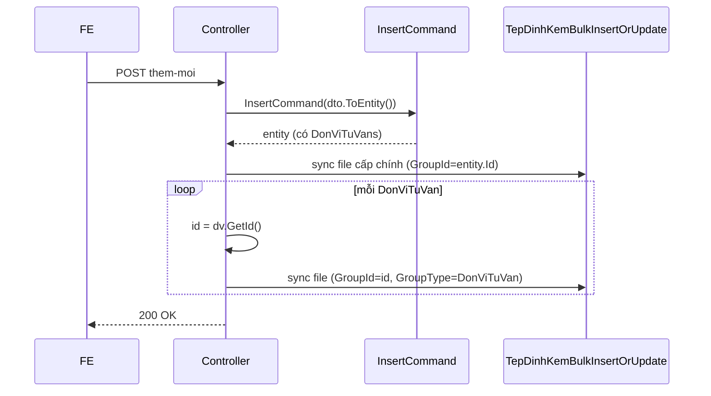
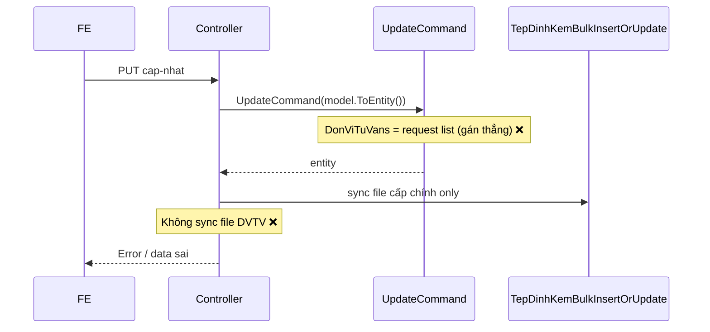
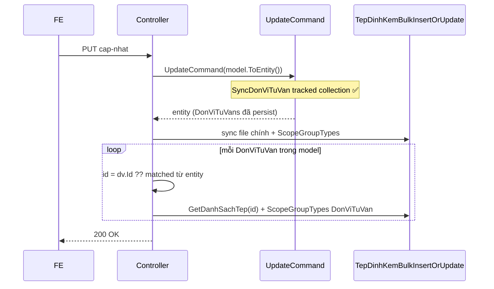

# Fix cập nhật Triển khai KHLCNT — đơn vị tư vấn & tệp đính kèm

**Document date:** June 29, 2026  
**Status:** ✅ **IMPLEMENTED**  
**Module:** QLDA — `TrienKhaiKeHoachLCNT`  
**Pattern tham chiếu:** `KeHoachTrienKhaiHangMucUpdateCommand`, `TrienKhaiKeHoachLCNTController.Create`, `HoSoMoiThauDienTu/fix-tep-dinh-kem.md`

**Mục lục:** [0. Trạng thái](#0-trạng-thái-hiện-tại) · [1. Triệu chứng](#1-triệu-chứng) · [2. Root cause](#2-root-cause-đã-xác-minh) · [3. Khảo sát flow](#3-khảo-sát-flow) · [4. Bước code chi tiết](#4-bước-code-chi-tiết) · [5. API contract](#5-api-contract) · [6. Test plan](#6-test-plan) · [7. Checklist](#7-checklist-nghiệm-thu) · [8. Commit](#8-commit-đề-xuất)

---

## 0. Trạng thái hiện tại

| Hạng mục | Trạng thái | Ghi chú |
| -------- | ---------- | ------- |
| Investigation / docs | ✅ Done | File này |
| Fix `TrienKhaiKeHoachLCNTUpdateCommand` | ✅ Done | Sync `DonViTuVans` đúng cách |
| Fix `TrienKhaiKeHoachLCNTController.Update` | ✅ Done | Thêm sync file đơn vị tư vấn |
| Fix mapping `DonViTuVanKeHoach` | ✅ Done | Gán `KeHoachId` khi `ToEntity` |
| Fix bug gán `So` | ✅ Done | Đang gán nhầm `TrichYeu` |
| Migration | ✅ Không cần | Chỉ sửa logic Application/WebApi |
| Manual verify curl | ⏳ Pending | Payload mẫu ở [6.1](#61-curl-mẫu) |

---

## 1. Triệu chứng

**Endpoint:**

```http
PUT /QuanLyDuAn/api/trien-khai-ke-hoach-lcnt/cap-nhat
```

**Payload điển hình:** Cập nhật tờ trình triển khai KHLCNT kèm:

1. **Đơn vị tư vấn đã có** (`id` có giá trị) + file đính kèm có `groupId` / `groupType`
2. **Đơn vị tư vấn mới** (`id: null`) + file mới chưa có `groupId` / `groupType`
3. **`danhSachTepDinhKem` cấp chính** = mảng rỗng `[]`

### Expected

| Case | Kỳ vọng |
| ---- | ------- |
| Cập nhật thông tin chính | API 200, lưu đúng `so`, `ngayTrinh`, `giaTri`, … |
| Đơn vị tư vấn cũ | Cập nhật `tenDonVi`, giữ file cũ |
| Đơn vị tư vấn mới | Tạo bản ghi mới, file gán `groupId` = id DVTV mới, `groupType` = `"DonViTuVan"` |
| File cấp chính rỗng | Không lỗi; không xóa nhầm file đơn vị tư vấn |

### Actual

API **lỗi** khi PUT với payload trên (exception EF / FK / tracking — tùy môi trường).

---

## 2. Root cause (đã xác minh)

### 2.1 Tổng quan luồng lỗi

```text
Controller.Update
  └─ model.ToEntity()          → DonViTuVans[].KeHoachId = Guid.Empty (mới)
  └─ UpdateCommand             → entity.DonViTuVans = request.Dto.DonViTuVans  ❌
  └─ (thiếu) sync file DVTV    → file mới không được gán GroupId/GroupType    ❌
```

### 2.2 Lỗi A — Gán thẳng navigation collection (UpdateCommand)

**File:** `QLDA.Application/TrienKhaiKeHoachLCNT/Commands/TrienKhaiKeHoachLCNTUpdateCommand.cs`

```csharp
// TRƯỚC (sai) — dòng 66
entity.DonViTuVans = request.Dto.DonViTuVans;
```

**Vì sao sai:**

- Collection đã được `Include` và **tracked** bởi EF; gán list mới → detach/attach lỗi hoặc EF cố insert trùng PK.
- Không có logic **update / add / remove** từng phần tử.
- `SyncDonViTuVan()` đã có trong `TrienKhaiKeHoachLCNTMappings.cs` nhưng **không được gọi** (và bản hiện tại dùng `Clear()` — không phù hợp tracked entity).

**So sánh pattern đúng:** `KeHoachTrienKhaiHangMucUpdateCommand` dùng `SyncHelper.SyncCollection` cho child `HangMucKeHoach` (entity implement `IAggregateRoot`).

> `DonViTuVanKeHoach` **không** implement `Entity<Guid>` / `IAggregateRoot` → **không dùng** `SyncHelper.SyncCollection` trực tiếp. Cần sync thủ công trên navigation collection đã tracked (hoặc refactor entity sau — **ngoài scope** task này).

---

### 2.3 Lỗi B — `KeHoachId` không được gán khi map DVTV mới

**File:** `QLDA.WebApi/Models/DonViTuVanKeHoach/DonViTuVanKeHoachMappingConfiguration.cs`

```csharp
// TRƯỚC
public static DonViTuVanKeHoach ToEntity(this DonViTuVanKeHoachModel model)
    => new() {
        Id = model.GetId(),
        KeHoachId = model.KeHoachId,   // FE không gửi → Guid.Empty
        TenDonVi = model.TenDonVi
    };
```

**File:** `QLDA.WebApi/Models/TrienKhaiKeHoachLCNT/TrienKhaiKeHoachLCNTMappingConfiguration.cs`

```csharp
DonViTuVans = model.DonViTuVans?.Select(x => x.ToEntity()).ToList() ?? [],
// Không truyền parent Id
```

**Hệ quả:** Insert DVTV mới vi phạm FK `KeHoachLCNTId` (required).

**Chuẩn Create (đã đúng một phần):** Controller gọi `dv.GetId()` trước khi sync file — ID ổn định trước khi persist. Nhưng `KeHoachId` vẫn thiếu ở mapping.

---

### 2.4 Lỗi C — Controller Update thiếu sync file đơn vị tư vấn

**File:** `QLDA.WebApi/Controllers/TrienKhaiKeHoachLCNTController.cs`

| Action | Sync file cấp chính | Sync file `DonViTuVans` |
| ------ | -------------------- | ----------------------- |
| `Create` | ✅ `GetDanhSachTep(entity.Id)` | ✅ `foreach (dv in dto.DonViTuVans)` |
| `Update` | ✅ (có, kể cả khi `[]`) | ❌ **Thiếu hoàn toàn** |

Create (đúng pattern):

```csharp
foreach (var dv in dto.DonViTuVans)
{
    var id = dv.GetId();
    var danhSachFileKetQua = dv.GetDanhSachTep(id).ToList();
    await Mediator.Send(new TepDinhKemBulkInsertOrUpdateCommand
    {
        GroupId = id.ToString(),
        Entities = danhSachFileKetQua
    });
}
```

Update **không có** vòng lặp tương tự → file DVTV mới không lưu / không gán `GroupId` + `GroupType`.

`GetDanhSachTep` đã có sẵn:

```csharp
// TepDinhKemMappingConfigurations.cs
public static List<TepDinhKem> GetDanhSachTep(this DonViTuVanKeHoachModel model, Guid groupId)
    => model.DanhSachTepDinhKem?.ToEntities(groupId, EGroupType.DonViTuVan).ToList() ?? [];
```

`ToEntities` dùng `ResolveId` — file mới (không `groupId`) → tạo Id mới; gán `GroupId` + `GroupType` đúng target.

---

### 2.5 Lỗi D — Gán nhầm `So` trong UpdateCommand

```csharp
// TRƯỚC (sai) — dòng 56
entity.So = request.Dto.TrichYeu;

// ĐÚNG
entity.So = request.Dto.So;
```

Regression nhỏ nhưng ảnh hưởng dữ liệu khi cập nhật.

---

### 2.6 Lỗi E — `danhSachTepDinhKem` rỗng ở cấp chính

Update hiện gọi `TepDinhKemBulkInsertOrUpdateCommand` với `Entities = []` khi mảng rỗng.

**Hành vi `TepDinhKemBulkInsertOrUpdateCommand` (đã fix trước đó):**

- Không early-return khi list rỗng → **soft-delete** file không còn trong request (đúng nghiệp vụ).
- File DVTV dùng `GroupId` = **id đơn vị tư vấn**, không phải `entity.Id` → sync cấp chính **không** ảnh hưởng file DVTV.

**Khuyến nghị khi implement:** Truyền `ScopeGroupTypes = [GroupTypeConstants.TrienKhaiKeHoachLCNT]` khi sync file cấp chính (phòng trường hợp sau này có nhiều `GroupType` cùng `GroupId`).

---

### 2.7 Bảng tóm tắt root cause

| # | Layer | Vấn đề | Mức độ |
| - | ----- | ------ | ------ |
| A | `UpdateCommand` | Gán thẳng `DonViTuVans` | 🔴 Blocker |
| B | WebApi mapping | `KeHoachId` = Empty cho DVTV mới | 🔴 Blocker |
| C | `Controller.Update` | Thiếu sync file DVTV | 🔴 Blocker |
| D | `UpdateCommand` | `So` ← `TrichYeu` | 🟡 Data bug |
| E | Controller | Nên thêm `ScopeGroupTypes` khi sync file chính | 🟢 Hardening |

---

## 3. Khảo sát flow

### 3.1 Entity & quan hệ

```text
TrienKhaiKeHoachLCNT (parent)
├── Id, DuAnId, BuocId, So, NgayTrinh, ...
└── DonViTuVans[]  DonViTuVanKeHoach (child — không soft-delete)
    ├── Id           Guid PK
    ├── KeHoachId    FK → TrienKhaiKeHoachLCNT.Id (cột DB: KeHoachLCNTId)
    └── TenDonVi

TepDinhKem (không FK trực tiếp)
├── GroupId + GroupType → liên kết logic
├── Cấp chính:  GroupId = TrienKhaiKeHoachLCNT.Id,  GroupType = "TrienKhaiKeHoachLCNT"
└── Cấp DVTV:   GroupId = DonViTuVanKeHoach.Id,     GroupType = "DonViTuVan"
```

**File tham chiếu:**

| Thành phần | Vị trí |
| ---------- | ------ |
| Entity parent | `QLDA.Domain/Entities/TrienKhaiKeHoachLCNT.cs` |
| Entity child | `QLDA.Domain/Entities/DonViTuVanKeHoach.cs` |
| EF config child | `QLDA.Persistence/Configurations/DonViTuVanKeHoachConfiguration.cs` |
| Insert | `QLDA.Application/.../TrienKhaiKeHoachLCNTInsertCommand.cs` |
| Update | `QLDA.Application/.../TrienKhaiKeHoachLCNTUpdateCommand.cs` |
| Mapping sync (chưa dùng) | `QLDA.Application/.../TrienKhaiKeHoachLCNTMappings.cs` → `SyncDonViTuVan` |
| Controller | `QLDA.WebApi/Controllers/TrienKhaiKeHoachLCNTController.cs` |
| File mapping | `QLDA.WebApi/Models/TepDinhKems/TepDinhKemMappingConfigurations.cs` |

### 3.2 Luồng Create (reference — đúng)



### 3.3 Luồng Update (hiện tại — sai)



### 3.4 Luồng Update (target — sau fix)



---

## 4. Bước code chi tiết

### 4.1 Phase 1 — Mapping `DonViTuVanKeHoach`

**File:** `QLDA.WebApi/Models/DonViTuVanKeHoach/DonViTuVanKeHoachMappingConfiguration.cs`

Thêm overload nhận `keHoachId`:

```csharp
public static DonViTuVanKeHoach ToEntity(this DonViTuVanKeHoachModel model, Guid keHoachId)
    => new() {
        Id = model.Id ?? model.GetId(),
        KeHoachId = keHoachId,
        TenDonVi = model.TenDonVi
    };

// Giữ ToEntity(model) cũ → delegate sang overload (hoặc obsolete) để không break caller khác
public static DonViTuVanKeHoach ToEntity(this DonViTuVanKeHoachModel model)
    => model.ToEntity(model.KeHoachId);
```

**File:** `QLDA.WebApi/Models/TrienKhaiKeHoachLCNT/TrienKhaiKeHoachLCNTMappingConfiguration.cs`

```csharp
// TRƯỚC
DonViTuVans = model.DonViTuVans?.Select(x => x.ToEntity()).ToList() ?? [],

// SAU
DonViTuVans = model.DonViTuVans?.Select(x => x.ToEntity(model.GetId())).ToList() ?? [],
```

> `model.GetId()` dùng `Id` có sẵn khi update; không sinh Id mới cho parent.

---

### 4.2 Phase 2 — `SyncDonViTuVan` (Application mapping)

**File:** `QLDA.Application/TrienKhaiKeHoachLCNT/TrienKhaiKeHoachLCNTMappings.cs`

Thay `Clear()` + add all bằng sync trên collection **đã tracked**:

```csharp
public static void SyncDonViTuVan(this TrienKhaiKeHoachLCNT entity, List<DonViTuVanKeHoach>? donVis)
{
    entity.DonViTuVans ??= [];
    var requestList = donVis ?? [];
    var requestIds = requestList.Select(d => d.Id).ToHashSet();

    // Xóa khỏi collection những DVTV không còn trong request
    foreach (var existing in entity.DonViTuVans.Where(d => !requestIds.Contains(d.Id)).ToList())
        entity.DonViTuVans.Remove(existing);

    foreach (var item in requestList)
    {
        var existing = entity.DonViTuVans.FirstOrDefault(d => d.Id == item.Id);
        if (existing is not null)
        {
            existing.TenDonVi = item.TenDonVi;
            existing.KeHoachId = entity.Id;
        }
        else
        {
            entity.DonViTuVans.Add(new DonViTuVanKeHoach
            {
                Id = item.Id,
                KeHoachId = entity.Id,
                TenDonVi = item.TenDonVi
            });
        }
    }
}
```

**Lưu ý:**

- `item.Id` đã được `ToEntity(keHoachId)` / `GetId()` gán trước khi vào command.
- Cascade delete FK: xóa DVTV khỏi collection → EF xóa row; file `TepDinhKem` **không** tự xóa — cân nhắc gọi `SyncHelper.SetDeleteWithRelatedFiles` khi remove DVTV (optional, nếu BA yêu cầu dọn file orphan).

---

### 4.3 Phase 3 — `TrienKhaiKeHoachLCNTUpdateCommand`

**File:** `QLDA.Application/TrienKhaiKeHoachLCNT/Commands/TrienKhaiKeHoachLCNTUpdateCommand.cs`

```csharp
// Thay các dòng gán field + DonViTuVans:

entity.So = request.Dto.So;                    // fix bug D
entity.TrichYeu = request.Dto.TrichYeu;
// ... các field khác giữ nguyên ...

entity.SyncDonViTuVan(request.Dto.DonViTuVans);  // thay vì gán thẳng

await _repo.UpdateAsync(entity, cancellationToken);
await _unitOfWork.SaveChangesAsync(cancellationToken);
```

**Không** mở transaction mới trong handler nếu controller đã `BeginTransaction` — pattern hiện tại `SaveChanges` trong handler vẫn OK khi `HasTransaction = true`.

---

### 4.4 Phase 4 — `TrienKhaiKeHoachLCNTController.Update`

**File:** `QLDA.WebApi/Controllers/TrienKhaiKeHoachLCNTController.cs`

Sau khi `UpdateCommand` trả `entity`, bổ sung sync file DVTV (mirror Create):

```csharp
// Sync file cấp chính
var danhSachTepChinh = model.GetDanhSachTep(entity.Id).ToList();
await Mediator.Send(new TepDinhKemBulkInsertOrUpdateCommand
{
    GroupId = entity.Id.ToString(),
    Entities = danhSachTepChinh,
    ScopeGroupTypes = [GroupTypeConstants.TrienKhaiKeHoachLCNT]
}, cancellationToken);

// Sync file từng đơn vị tư vấn
foreach (var dv in model.DonViTuVans ?? [])
{
    // Id ổn định: FE gửi id có sẵn, hoặc GetId() đã chạy lúc ToEntity
    var dvId = dv.Id ?? dv.GetId();
    var files = dv.GetDanhSachTep(dvId).ToList();
    await Mediator.Send(new TepDinhKemBulkInsertOrUpdateCommand
    {
        GroupId = dvId.ToString(),
        Entities = files,
        ScopeGroupTypes = [GroupTypeConstants.DonViTuVan]
    }, cancellationToken);
}

await unitOfWork.SaveChangesAsync(cancellationToken);
await unitOfWork.CommitTransactionAsync(cancellationToken);
```

**Dọn code trùng:** Update hiện gọi `TepDinhKemBulkInsertOrUpdate` **hai lần** cho file cấp chính (`ToEntities` rồi `GetDanhSachTep`). Sau fix chỉ giữ **một** lần qua `GetDanhSachTep`.

**Response:** Có thể enrich `entity.ToDto()` kèm file DVTV nếu FE cần — optional; GET chi-tiet đã load đủ.

---

### 4.5 Phase 5 — Build

```bash
dotnet build QLDA.Application/QLDA.Application.csproj
dotnet build QLDA.WebApi/QLDA.WebApi.csproj
```

> Stop `QLDA.WebApi` nếu process đang lock DLL.

---

## 5. API contract

### 5.1 Request body (PUT `cap-nhat`)

| Field | Type | Ghi chú |
| ----- | ---- | ------- |
| `id` | `Guid` | Bắt buộc — id tờ trình |
| `duAnId`, `buocId` | | Bắt buộc cho auth bước |
| `donViTuVans` | `array` | Optional; mỗi phần tử: |
| `donViTuVans[].id` | `Guid?` | `null` = thêm mới |
| `donViTuVans[].tenDonVi` | `string` | |
| `donViTuVans[].danhSachTepDinhKem` | `array` | File mới có thể thiếu `groupId`/`groupType` |
| `danhSachTepDinhKem` | `array` | `[]` hợp lệ — xóa file cấp chính (nếu có) |

### 5.2 Quy tắc `TepDinhKem` (chuẩn dự án)

| Vùng | GroupId | GroupType |
| ---- | ------- | --------- |
| Tờ trình chính | `TrienKhaiKeHoachLCNT.Id` | `TrienKhaiKeHoachLCNT` |
| Đơn vị tư vấn | `DonViTuVanKeHoach.Id` | `DonViTuVan` |

`ToEntities(groupId, groupType)` + `ResolveId`:

- File **đã thuộc** đúng group → giữ `Id` (update metadata).
- File **mới** hoặc copy từ group khác → `Id` mới + `GroupId`/`GroupType` target.

---

## 6. Test plan

### 6.1 Curl mẫu

```bash
curl --location --request PUT 'http://192.168.1.12:9051/QuanLyDuAn/api/trien-khai-ke-hoach-lcnt/cap-nhat' \
--header 'Authorization: Bearer <JWT_TOKEN>' \
--header 'Content-Type: application/json' \
--data '{
    "id": "08ded585-d386-33f8-687a-7b174805f884",
    "duAnId": "08deb0bb-9c28-6fe6-687a-7b2f840244bc",
    "so": "14.PC123",
    "ngayTrinh": "2026-06-29",
    "trichYeu": "",
    "buocId": 5032,
    "hinhThucLCNT": 2,
    "goiThauId": "dcbf5f92-bc05-446d-9888-2dd65be57e31",
    "giaTri": 11111111111111,
    "thoiGianThucHien": "1",
    "noiDung": "1",
    "yeuCau": "1",
    "donViTuVans": [
        {
            "id": "08ded585-d386-35f9-687a-7b174805f885",
            "tenDonVi": "đơn vị",
            "danhSachTepDinhKem": [
                {
                    "id": "08ded585-d39f-83d4-687a-7b174805f889",
                    "groupId": "08ded585-d386-35f9-687a-7b174805f885",
                    "groupType": "DonViTuVan",
                    "type": "application/vnd.openxmlformats-officedocument.spreadsheetml.sheet",
                    "fileName": "DanhSach_TreHanPhongBan_270620261802 (1).xlsx",
                    "originalName": "DanhSach_TreHanPhongBan_270620261802 (1).xlsx",
                    "path": "2026/06/29/d25aceef-b068-42a4-9a1d-35f0b1d37569.xlsx",
                    "size": 12814
                }
            ]
        },
        {
            "id": null,
            "tenDonVi": "đơn vị 2",
            "danhSachTepDinhKem": [
                {
                    "id": "62bb08ff-9074-436c-87ca-4ef9655598f1",
                    "type": "application/vnd.openxmlformats-officedocument.spreadsheetml.sheet",
                    "fileName": "DanhSach_TinhHinhDauThau_260620261659.xlsx",
                    "originalName": "DanhSach_TinhHinhDauThau_260620261659.xlsx",
                    "path": "2026/06/29/11640b13-c204-49d2-aedf-0b5742b040d3.xlsx",
                    "size": 14217
                }
            ]
        }
    ],
    "danhSachTepDinhKem": [],
    "trangThaiDangTaiId": 0,
    "trangThaiId": 30
}'
```

### 6.2 Manual test cases

| # | Case | Steps | Kỳ vọng |
| - | ---- | ----- | ------- |
| T1 | Cập nhật DVTV cũ + giữ file | PUT payload trên | 200; `tenDonVi` cập nhật; file cũ còn trong DB |
| T2 | Thêm DVTV mới + file mới | Payload có `id: null` + file không `groupId` | 200; row mới `DonViTuVanKeHoach`; file có `GroupId` = id DVTV mới, `GroupType` = `DonViTuVan` |
| T3 | `danhSachTepDinhKem: []` | PUT không file cấp chính | 200; không exception; file DVTV không bị xóa |
| T4 | GET chi tiết sau PUT | `GET {id}/chi-tiet` | 2 DVTV; mỗi DVTV có đúng `danhSachTepDinhKem` |
| T5 | Xóa DVTV khỏi list | PUT bỏ 1 phần tử `donViTuVans` | DVTV bị remove khỏi DB (cascade) |
| T6 | Trạng thái không DT/Trả lại | PUT khi đã trình | 400 `Trạng thái không thể cập nhật!` |

### 6.3 Verify DB (optional)

```sql
-- Đơn vị tư vấn
SELECT Id, KeHoachLCNTId, TenDonVi
FROM DonViTuVanKeHoach
WHERE KeHoachLCNTId = '08ded585-d386-33f8-687a-7b174805f884';

-- File đính kèm DVTV
SELECT Id, GroupId, GroupType, FileName, IsDeleted
FROM TepDinhKem
WHERE GroupType = 'DonViTuVan'
  AND GroupId IN (SELECT CAST(Id AS nvarchar(36)) FROM DonViTuVanKeHoach WHERE KeHoachLCNTId = '...');
```

---

## 7. Checklist nghiệm thu

- [ ] `SyncDonViTuVan` sync add/update/remove trên tracked collection
- [ ] `UpdateCommand` gọi `SyncDonViTuVan`, không gán thẳng list
- [ ] `entity.So = request.Dto.So` (không nhầm `TrichYeu`)
- [ ] `ToEntity(keHoachId)` gán FK đúng cho DVTV mới
- [ ] `Controller.Update` sync file từng DVTV + `ScopeGroupTypes`
- [ ] Bỏ duplicate sync file cấp chính
- [ ] Không migration / không sửa snapshot
- [ ] Curl T1 + T2 pass
- [ ] `gitnexus impact` trước khi sửa + `detect_changes()` trước commit

---

## 8. Commit đề xuất

```
fix(trien-khai-ke-hoach-lcnt): sync don vi tu van and attachments on update

- Sync DonViTuVans on tracked collection instead of replacing navigation
- Map KeHoachId when converting DonViTuVan models to entities
- Mirror Create flow: bulk sync TepDinhKem per consulting unit on PUT
- Fix So field assignment in update handler
```

**Files dự kiến thay đổi:**

| File | Phase |
| ---- | ----- |
| `QLDA.Application/TrienKhaiKeHoachLCNT/TrienKhaiKeHoachLCNTMappings.cs` | 2 |
| `QLDA.Application/TrienKhaiKeHoachLCNT/Commands/TrienKhaiKeHoachLCNTUpdateCommand.cs` | 3 |
| `QLDA.WebApi/Models/DonViTuVanKeHoach/DonViTuVanKeHoachMappingConfiguration.cs` | 1 |
| `QLDA.WebApi/Models/TrienKhaiKeHoachLCNT/TrienKhaiKeHoachLCNTMappingConfiguration.cs` | 1 |
| `QLDA.WebApi/Controllers/TrienKhaiKeHoachLCNTController.cs` | 4 |

---

**Next step:** Implement theo [mục 4](#4-bước-code-chi-tiết), chạy curl [6.1](#61-curl-mẫu), tick checklist [mục 7](#7-checklist-nghiệm-thu).
