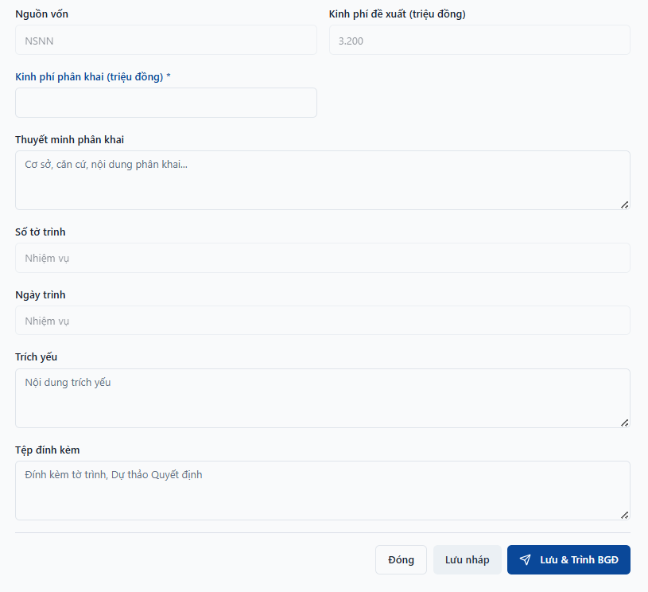
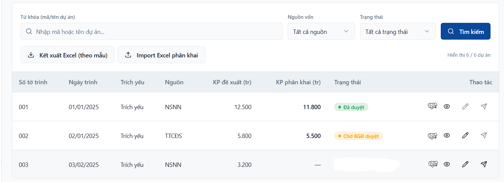

Mô tả

Em gửi thông tin UC40 còn thiếu theo hợp đồng

Tên Use case: Phân khai kinh phí cho các nội dung được giao dự toán

Tên tác nhân: CB.PKH-TC, LD.PKH-TC

Mô tả:
CB.PKH-TC, LD.PKH-TC có thể lọc danh sách các dự án/dự toán trình xin giao kinh phí thực hiện
CB.PKH-TC, LD.PKH-TC có thể kết xuất danh sách các dự án/dự toán trình xin giao kinh phí thực hiện ra excel (theo mẫu)
CB.PKH-TC, LD.PKH-TC có thể import file excel sau khi phân khai vốn theo phân bổ vốn cho Trung Tâm
CB.PKH-TC, LD.PKH-TC có thể nhập thông tin phân khai đối với các dự án/dự toán được cấp kinh phí thực hiện
CB.PKH-TC, LD.PKH-TC có thể xin lấy ý kiến của các phòng chuyên môn về Quyết định giao nhiệm vụ chủ trì các dự án và hình thức QLDA
CB.PKH-TC, LD.PKH-TC có thể tạo phiếu trình (theo mẫu) đề xuất phân khai kinh phí thực hiện theo danh mục dự án/dự toán đã được cấp kinh phí hoặc kết xuất thông tin ra file
CB.PKH-TC, LD.PKH-TC có thể tạo dự thảo Quyết định phân khai kinh phí thực hiện theo danh mục dự án/dự toán đã được cấp kinh phí (theo mẫu) hoặc đính kèm file
CB.PKH-TC, LD.PKH-TC có thể tạo phiếu trình (theo mẫu) đề xuất giao nhiệm vụ cho Phòng được giao chủ trì hoặc kết xuất thông tin ra file
CB.PKH-TC, LD.PKH-TC có thể tạo dự thảo Quyết định giao nhiệm vụ đối với những dự án giao vốn mới (theo mẫu) hoặc đính kèm file
LD.PKH-TC có thể ký số phiếu trình hoặc đính kèm file
CB.PKH-TC, LĐ.PKH-TC có thể chuyển trình BGĐ Trung tâm
Giao diện tham khảo
Bổ sung màn hình Phân khai kinh phí
Nguồn vốn sẽ chọn từ Kế hoạch vốn -> Kinh phí đề xuất được theo nguồn vốn trong Kế hoạch vốn

Phòng PCT có chức năng bao gồm Xem, Chỉnh sửa (trạng thái đã trình không được sửa), Trình (Trình cho phòng BGĐ), Xóa (trạng thái đã trình không được xóa)
