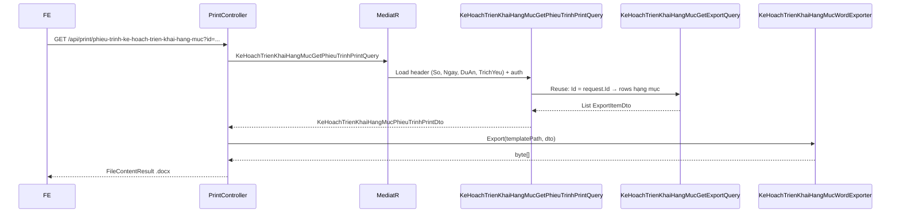

# Issue #9469 — Xuất phiếu trình kế hoạch triển khai hạng mục (Word)

> **Ngày tạo:** 30/06/2026  
> **Trạng thái:** ✅ **Đã implement**  
> **Phụ thuộc:** Export Excel #9469 đã có — tái sử dụng query/mapper hạng mục  
> **Pattern tham chiếu:**
> - Word đơn giản (MailMerge text): `GET /api/print/bien-ban-ban-giao-ho-so` + `BanGiaoHoSoPrintQuery`
> - Word phiếu trình: `GET /api/print/phieu-trinh-phe-duyet`, `GET /api/print/phieu-trinh-giao-nhiem-vu-phan-khai-kinh-phi`
> - Export Excel hạng mục: `GET /api/print/ke-hoach-trien-khai-hang-muc` + `KeHoachTrienKhaiHangMucGetExportQuery`

---

## 1. Tóm tắt nghiệp vụ

CB/LĐ cần **xuất file Word phiếu trình** kế hoạch triển khai hạng mục theo mẫu hành chính **PHIẾU TRÌNH** (khác với file Excel kế hoạch đã có).

| Khía cạnh | Mô tả |
|-----------|-------|
| **Đối tượng** | Một bản ghi `KeHoachTrienKhaiHangMuc` (kế hoạch triển khai) |
| **Dữ liệu** | Header phiếu trình + bảng hạng mục công việc group theo giai đoạn |
| **Trigger UI** | Nút **Xuất phiếu trình** / **In phiếu trình** trên màn chi tiết hoặc danh sách kế hoạch |
| **Không sửa migration** | Chỉ đọc dữ liệu hiện có |
| **Không logic nghiệp vụ trong Controller** | Query/Handler Application + helper Infrastructure |

---

## 2. Mẫu phiếu trình (layout)

Tham chiếu ảnh mẫu trong issue:

```
┌─────────────────────────────────────────────────────────────┐
│ Số: 111-42/2023              Độc lập - Tự do - Hạnh phúc   │
│                              Tphcm, ngày 10 tháng 03 năm 2025│
│                                                             │
│                      PHIẾU TRÌNH                            │
│           V/v: Kế hoạch triển khai dự án                    │
│                                                             │
│ Kín | Ban Giám đốc                                          │
│ Dự án | DA-2025-01 — Nâng cấp hệ thống lưu trữ trung tâm   │
│ Trích yếu | Kế hoạch triển khai nâng cấp...                 │
│ Nội dung kế hoạch triển khai:                               │
│ ┌────┬──────────┬─────────────┬─────────┬ ... ────────────┐│
│ │STT │Giai đoạn │Hạng mục CV  │ĐV chủ trì│ ... │ Kinh phí ││
│ ├────┼──────────┼─────────────┼─────────┼ ... ────────────┤│
│ │ A  │Chuẩn bị đầu tư│        │         │     │          ││  ← group row
│ │ 1  │          │Tờ trình dự toán...│Phòng KHTC│ ... │10.000.000││
│ └────┴──────────┴─────────────┴─────────┴ ... ────────────┘│
│ Kính trình Ban Giám đốc xem xét, phê duyệt./.               │
└─────────────────────────────────────────────────────────────┘
```

### 2.1. Nội dung bắt buộc

| # | Trường trên mẫu | Nguồn dữ liệu | Ghi chú |
|---|-----------------|---------------|---------|
| 1 | Số phiếu trình | `KeHoachTrienKhaiHangMuc.So` | |
| 2 | Ngày lập | `KeHoachTrienKhaiHangMuc.NgayToTrinh` | Format: `Tphcm, ngày dd tháng MM năm yyyy` |
| 3 | Kính gửi | **Cố định template** | `"Ban Giám đốc"` — không có field entity |
| 4 | Dự án | `DuAn.MaDuAn` + `DuAn.TenDuAn` | Format: `{MaDuAn} — {TenDuAn}` |
| 5 | Trích yếu | `KeHoachTrienKhaiHangMuc.TrichYeu` | |
| 6 | Bảng hạng mục | `DanhSachHangMuc` | Group theo `GiaiDoanId`, 11 cột |
| 7 | Lời kết | **Cố định template** | `"Kính trình Ban Giám đốc xem xét, phê duyệt./."` |

### 2.2. Bảng hạng mục (11 cột — giống Excel #9469)

| # | Header | Placeholder đề xuất | Nguồn / format |
|---|--------|---------------------|----------------|
| 1 | STT | `Stt` | Group: `A`,`B`,`C`… / Item: `1`,`2`,`3`… |
| 2 | Giai đoạn | `GiaiDoan` | Group: tên giai đoạn / Item: trống |
| 3 | Hạng mục công việc | `TenHangMuc` | `HangMucKeHoach.TenHangMuc` |
| 4 | Đơn vị chủ trì | `DonViChuTri` | `DmDonVi.TenDonVi` |
| 5 | Đơn vị phối hợp | `DonViPhoiHop` | Nối tên từ `DonViPhoiHopIds` |
| 6 | Bắt đầu | `NgayBatDau` | `yyyy-MM-dd` (mẫu issue) hoặc `dd/MM/yyyy` — **chốt với BA** |
| 7 | Kết thúc | `NgayKetThuc` | Cùng format cột 6 |
| 8 | Thời hạn | `ThoiHan` | Số ngày: `(NgayKetThuc - NgayBatDau).Days + 1` |
| 9 | Cán bộ chủ trì | `CanBoChuTri` | `USER_MASTER.HoTen` |
| 10 | Cán bộ phối hợp | `CanBoPhoiHop` | Nối tên từ `CanBoPhoiHopIds` |
| 11 | Kinh phí | `KinhPhi` | `#,##0` (culture `vi-VN`) |

**Group row:** dòng header giai đoạn — chỉ điền `Stt` + `GiaiDoan`, các cột còn lại trống, **in đậm** (giống Excel styler).

**Tái sử dụng:** logic group/flatten đã có tại `KeHoachTrienKhaiHangMucExportMapper.ToExportRows()` → output `List<KeHoachTrienKhaiHangMucExportItemDto>`.

---

## 3. Phạm vi API

### 3.1. Endpoint đề xuất

```
GET /api/print/phieu-trinh-ke-hoach-trien-khai-hang-muc?id={keHoachId}
```

| Thuộc tính | Giá trị |
|------------|---------|
| Controller | `PrintController.InPhieuTrinhKeHoachTrienKhaiHangMuc` |
| Auth | `RoleConstants.GroupKeHoachTrienKhaiHangMucExport` (reuse role Excel) |
| Template | `PrintTemplates/Word/PhieuTrinhKeHoachTrienKhaiHangMuc.docx` |
| Response | `application/vnd.openxmlformats-officedocument.wordprocessingml.document` |
| Tên file tải | `PhieuTrinhKeHoachTrienKhaiHangMuc_{yyyyMMdd_HHmmss}.docx` |

> **Khác Excel:** Phiếu trình Word chỉ export **theo `id` kế hoạch** (một phiếu = một kế hoạch). Không hỗ trợ bulk/filter như Excel — không phù hợp nghiệp vụ phiếu trình.

### 3.2. Request parameters

| Param | Type | Bắt buộc | Mô tả |
|-------|------|----------|-------|
| `id` | `Guid` | ✅ | Id `KeHoachTrienKhaiHangMuc` |

**Ví dụ:**

```http
GET /api/print/phieu-trinh-ke-hoach-trien-khai-hang-muc?id=3fa85f64-5717-4562-b3fc-2c963f66afa6
Authorization: Bearer {token}
```

### 3.3. Response & lỗi

| HTTP | Mô tả |
|------|-------|
| `200` | File `.docx` |
| `400` | `"Không tìm thấy dữ liệu"` — kế hoạch không tồn tại / không có quyền |
| `400` | `"Không có dữ liệu để xuất"` — kế hoạch không có hạng mục |
| `400` | `"Không tìm thấy file template"` |
| `401/403` | Chưa đăng nhập / không đủ role |

---

## 4. Kiến trúc & luồng xử lý

### 4.1. Sequence diagram



### 4.2. Phân tầng trách nhiệm

| Layer | Thành phần | Trách nhiệm |
|-------|------------|-------------|
| **WebApi** | `PrintController` | Nhận `id`, gọi Mediator, gọi Word exporter, trả file |
| **Application** | `KeHoachTrienKhaiHangMucGetPhieuTrinhPrintQuery` | Auth + load header + gọi/tái sử dụng export rows |
| **Application** | `KeHoachTrienKhaiHangMucPhieuTrinhPrintDto` | DTO header + `Rows` |
| **Application** | `KeHoachTrienKhaiHangMucGetExportQuery` | **Reuse** — load & map hạng mục (đã có) |
| **Infrastructure** | `KeHoachTrienKhaiHangMucWordExporter` | Fill template Word + bảng động |
| **WebApi** | `PrintTemplates/Word/PhieuTrinhKeHoachTrienKhaiHangMuc.docx` | Mẫu Word (BA/Designer tạo) |

**Không tạo Model WebApi.** **Không logic nghiệp vụ trong Controller.**

---

## 5. Application layer — chi tiết

### 5.1. DTO mới

**File:** `QLDA.Application/KeHoachTrienKhaiHangMuc/DTOs/KeHoachTrienKhaiHangMucPhieuTrinhPrintDto.cs`

```csharp
public class KeHoachTrienKhaiHangMucPhieuTrinhPrintDto
{
    public string So { get; set; } = string.Empty;
    public DateTimeOffset? NgayToTrinh { get; set; }
    public string? TrichYeu { get; set; }
    public string? MaDuAn { get; set; }
    public string? TenDuAn { get; set; }

    /// <summary>Format sẵn: "{MaDuAn} — {TenDuAn}"</summary>
    public string DuAnDisplay { get; set; } = string.Empty;

    public List<KeHoachTrienKhaiHangMucExportItemDto> Rows { get; set; } = [];
}
```

> **Reuse** `KeHoachTrienKhaiHangMucExportItemDto` — đã có đủ field bảng + `IsGroupHeader`.

### 5.2. Query mới

**File:** `QLDA.Application/KeHoachTrienKhaiHangMuc/Queries/KeHoachTrienKhaiHangMucGetPhieuTrinhPrintQuery.cs`

```csharp
public record KeHoachTrienKhaiHangMucGetPhieuTrinhPrintQuery : IRequest<KeHoachTrienKhaiHangMucPhieuTrinhPrintDto>
{
    public Guid Id { get; set; }
}
```

**Handler logic:**

```
1. Auth: FilterVisibleChildEntities trên KeHoachTrienKhaiHangMuc (giống GetExportQuery)
2. Load kế hoạch by Id:
   - Include DuAn
   - ThrowIfNull nếu không tìm thấy / không có quyền
3. Gọi KeHoachTrienKhaiHangMucGetExportQuery { Id = request.Id } qua IMediator
   → List<KeHoachTrienKhaiHangMucExportItemDto> rows
4. ThrowIf rows.Count == 0
5. Map header → KeHoachTrienKhaiHangMucPhieuTrinhPrintDto
```

**Authorization:** reuse pattern từ `KeHoachTrienKhaiHangMucGetExportQueryHandler.BuildFilteredQueryable()` — `FilterVisibleChildEntities` theo `BuocId`.

### 5.3. Không sửa entity / migration

Tất cả field cần thiết đã có trên:

| Entity | Field |
|--------|-------|
| `KeHoachTrienKhaiHangMuc` | `So`, `NgayToTrinh`, `TrichYeu`, `DuAnId`, `DanhSachHangMuc` |
| `HangMucKeHoach` | `TenHangMuc`, `GiaiDoanId`, `DonViChuTriId`, `DonViPhoiHopIds`, `NgayBatDau`, `NgayKetThuc`, `CanBoChuTriId`, `CanBoPhoiHopIds`, `KinhPhi` |
| `DuAn` | `MaDuAn`, `TenDuAn` |

---

## 6. Word export — kỹ thuật template

### 6.1. Cơ chế hiện có

| Thành phần | Mô tả |
|------------|-------|
| `IWordHelper.ExportFromTemplate` | MailMerge text placeholder `<key>` — **chỉ field đơn**, không hỗ trợ bảng động |
| Template Word hiện có | `BienBanBanGiao.docx`, `PhieuTrinhPheDuyet.docx`, `PhieuTrinhGiaoNhiemVu.docx` |
| Aspose.Words | Đã có license qua `IAsposeHelper.EnsureLicense()` |

### 6.2. Vấn đề: bảng hạng mục động

Phiếu trình có **bảng nhiều dòng** (group header + item rows). `IWordHelper` hiện tại **chưa hỗ trợ** MailMerge region/table.

**Phương án đề xuất (Recommended):** `KeHoachTrienKhaiHangMucWordExporter` trong `QLDA.Infrastructure/Offices/`

```
1. Load template .docx
2. MailMerge / Replace placeholder header:
   - So, NgayLap, DuAn, TrichYeu
   (Kính gửi + lời kết: "cố định trong template)
3. Tìm bảng hạng mục (Table index 0 hoặc bookmark "HangMucTable")
4. Clone row template cho từng ExportItemDto:
   - IsGroupHeader=true → bold STT + GiaiDoan, cột khác trống
   - IsGroupHeader=false → fill đủ 11 cột
5. Xóa row template mẫu
6. Save → byte[]
```

**Phương án thay thế:** mở rộng `IWordHelper` với `ExportFromTemplateWithRegions` (Aspose `MailMerge.ExecuteWithRegions`) — phù hợp nếu nhiều module Word cần bảng động sau này. **Chưa có precedent** trong repo → ưu tiên exporter riêng module trước.

### 6.3. Placeholder header (MailMerge)

| Placeholder template | Giá trị |
|---------------------|---------|
| `So` | `dto.So` |
| `NgayLap` | `ngày {dd} tháng {MM} năm {yyyy}` (UTC+7) |
| `DuAn` | `dto.DuAnDisplay` |
| `TrichYeu` | `dto.TrichYeu ?? ""` |

> Convention placeholder: plain text `<So>`, `<NgayLap>`, … (giống `IWordHelper` — `UseNonMergeFields = true`).

### 6.4. Template file

| Thuộc tính | Giá trị |
|------------|---------|
| Đường dẫn | `QLDA.WebApi/PrintTemplates/Word/PhieuTrinhKeHoachTrienKhaiHangMuc.docx` |
| Copy output | `QLDA.WebApi.csproj` — `<None Include="PrintTemplates\**\*.*">` (đã có) |
| Tạo mẫu | **Designer/BA** tạo file Word theo ảnh issue; dev review placeholder |

**Row mẫu trong bảng** (1 dòng data + 1 dòng group — hoặc 1 row template chung):

Dev clone row template trong code, không cần MailMerge region nếu dùng phương án programmatic.

---

## 7. PrintController — pseudo-code

```csharp
[HttpGet("api/print/phieu-trinh-ke-hoach-trien-khai-hang-muc")]
[Authorize(Roles = RoleConstants.GroupKeHoachTrienKhaiHangMucExport)]
public async Task<IActionResult> InPhieuTrinhKeHoachTrienKhaiHangMuc(
    [FromQuery] Guid id,
    CancellationToken cancellationToken = default)
{
    var templatePath = Path.Combine(AppContext.BaseDirectory,
        "PrintTemplates", "Word", "PhieuTrinhKeHoachTrienKhaiHangMuc.docx");
    ManagedException.ThrowIf(!File.Exists(templatePath), "Không tìm thấy file template");

    var dto = await Mediator.Send(
        new KeHoachTrienKhaiHangMucGetPhieuTrinhPrintQuery { Id = id },
        cancellationToken);

    var bytes = _keHoachWordExporter.Export(templatePath, dto);

    return File(bytes,
        "application/vnd.openxmlformats-officedocument.wordprocessingml.document",
        GetDownloadFileName("PhieuTrinhKeHoachTrienKhaiHangMuc.docx"));
}
```

---

## 8. FE integration

| Màn hình | Hành vi |
|----------|---------|
| Chi tiết kế hoạch triển khai | Nút **Xuất phiếu trình** → `GET ...?id={keHoachId}` |
| Danh sách (toolbar row action) | Icon in Word trên dòng → `?id={item.id}` |

**Download:** blob `.docx` — pattern giống các endpoint `/api/print/phieu-trinh-*`.

**Không gọi export** khi kế hoạch chưa có hạng mục (API trả 400).

---

## 9. Checklist implement

### Application
- [x] `KeHoachTrienKhaiHangMucPhieuTrinhPrintDto.cs`
- [x] `KeHoachTrienKhaiHangMucGetPhieuTrinhPrintQuery.cs` + Handler
- [ ] Unit test handler (mock Mediator export query) — optional

### Infrastructure
- [x] `KeHoachTrienKhaiHangMucWordExporter.cs`
- [x] Đăng ký DI: `services.AddScoped<KeHoachTrienKhaiHangMucWordExporter>()`

### WebApi
- [x] Template `PrintTemplates/Word/PhieuTrinhKeHoachTrienKhaiHangMuc.docx`
- [x] Endpoint `PrintController.InPhieuTrinhKeHoachTrienKhaiHangMuc`
- [x] Reuse role `GroupKeHoachTrienKhaiHangMucExport`

### Test / QA
- [ ] Integration test: export với kế hoạch có hạng mục → 200 + content-type docx
- [ ] Test group row bold + STT A/B/C
- [ ] Test auth: user không có quyền bước → 400
- [ ] Test kế hoạch không hạng mục → 400
- [ ] So sánh output với mẫu issue (visual QA)

### Không làm
- [ ] Sửa migration / entity
- [ ] Tạo Model WebApi
- [ ] Logic nghiệp vụ trong Controller

---

## 10. Quyết định cần chốt với BA

| # | Câu hỏi | Đề xuất mặc định |
|---|---------|------------------|
| 1 | Format ngày trong bảng (cột Bắt đầu/Kết thúc) | `yyyy-MM-dd` theo ảnh issue |
| 2 | Format ngày header phiếu | `Tphcm, ngày dd tháng MM năm yyyy` |
| 3 | Kính gửi có thay đổi theo loại dự án? | Cố định `"Ban Giám đốc"` trong template |
| 4 | Export khi kế hoạch ở trạng thái nào? | Mọi trạng thái (miễn có quyền xem + có hạng mục) |
| 5 | Có cần ký số / watermark? | Không (ngoài scope issue) |
| 6 | Tên endpoint FE | `phieu-trinh-ke-hoach-trien-khai-hang-muc` |

---

## 11. Quan hệ với export Excel #9469

| Khía cạnh | Excel (đã có) | Word phiếu trình (mới) |
|-----------|---------------|------------------------|
| Endpoint | `GET /api/print/ke-hoach-trien-khai-hang-muc` | `GET /api/print/phieu-trinh-ke-hoach-trien-khai-hang-muc` |
| Format | `.xlsx` | `.docx` |
| Scope | `id` / `duAnId` / bulk filter | Chỉ `id` |
| Layout | Kế hoạch triển khai (letterhead + bảng) | Phiếu trình hành chính |
| Mapper rows | `KeHoachTrienKhaiHangMucExportMapper` | **Reuse** |
| Query rows | `KeHoachTrienKhaiHangMucGetExportQuery` | **Reuse** (từ print query) |
| Post-process | `KeHoachTrienKhaiHangMucExportStyler` | `KeHoachTrienKhaiHangMucWordExporter` |

---

## 12. Files tham chiếu code

| File | Vai trò |
|------|---------|
| `QLDA.Application/.../KeHoachTrienKhaiHangMucGetExportQuery.cs` | Load hạng mục + auth |
| `QLDA.Application/.../KeHoachTrienKhaiHangMucExportMapper.cs` | Group theo giai đoạn |
| `QLDA.Application/.../KeHoachTrienKhaiHangMucExportItemDto.cs` | DTO dòng bảng |
| `QLDA.Application/BanGiaoHoSos/Queries/BanGiaoHoSoPrintQuery.cs` | Pattern print query |
| `BuildingBlocks/.../IWordHelper.cs` | MailMerge text |
| `QLDA.Infrastructure/Offices/KeHoachTrienKhaiHangMucExportStyler.cs` | Pattern post-process export |
| `QLDA.WebApi/Controllers/PrintController.cs` | Endpoints print hiện có |
| `docs/issues/9469/report.md` | Spec Excel đã implement |
