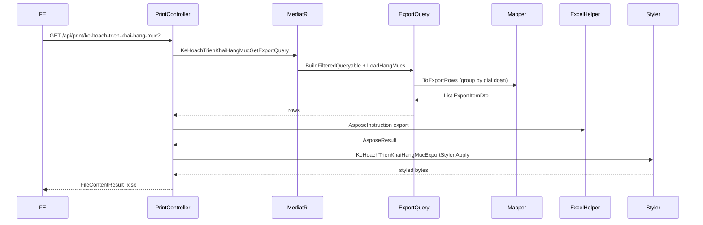

# Issue #9469 — Export Excel Kế hoạch triển khai hạng mục

> Cập nhật: 24/06/2026  
> Trạng thái: ✅ **Đã implement**

---

## 1. Tóm tắt

API export Excel cho module **Kế hoạch triển khai hạng mục**, xuất các hạng mục công việc **group theo Giai đoạn** (A/B/C + dòng 1,2,3…), layout letterhead UBND + bảng 11 cột.

**Ba chế độ export** (ưu tiên theo thứ tự):

| Chế độ | Điều kiện | Dữ liệu xuất |
|--------|-----------|--------------|
| **Theo kế hoạch** | Có `id` | Hạng mục của đúng 1 bản ghi `KeHoachTrienKhaiHangMuc` |
| **Theo dự án** | Có `duAnId`, không có `id` | Hạng mục của kế hoạch **mới nhất** (`NgayToTrinh` ↓, rồi `CreatedAt` ↓) |
| **Theo filter** | Không có `id` và `duAnId` | Gộp hạng mục từ **tất cả** kế hoạch khớp filter + quyền xem |

> Khi export bulk, các hạng mục từ nhiều kế hoạch được **gộp chung** rồi group lại theo `GiaiDoanId` (không tách theo từng dự án/kế hoạch trong file Excel).

---

## 2. API

### 2.1. Endpoint

```
GET /api/print/ke-hoach-trien-khai-hang-muc
```

- Controller: `PrintController.InKeHoachTrienKhaiHangMuc`
- Auth role: `RoleConstants.GroupKeHoachTrienKhaiHangMucExport`
- Template: `QLDA.WebApi/ExportTemplates/KeHoachTrienKhaiHangMuc.xlsx`
- Tên file: `KeHoachTrienKhaiHangMuc_{yyyyMMdd_HHmmss}.xlsx`

### 2.2. Query parameters

| Param | Type | Bắt buộc | Mô tả |
|-------|------|----------|-------|
| `id` | `Guid?` | ❌ | Id kế hoạch — **ưu tiên cao nhất** khi có giá trị |
| `duAnId` | `Guid?` | ❌ | Id dự án — lấy kế hoạch mới nhất (khi không có `id`) |
| `buocId` | `int?` | ❌ | Lọc theo bước dự án |
| `so` | `string?` | ❌ | Lọc số kế hoạch (contains) |
| `trichYeu` | `string?` | ❌ | Lọc trích yếu (contains) |
| `tuNgay` | `DateOnly?` | ❌ | Ngày tờ trình từ (inclusive) |
| `denNgay` | `DateOnly?` | ❌ | Ngày tờ trình đến (inclusive) |
| `trangThaiId` | `int?` | ❌ | Lọc trạng thái phê duyệt |
| `loaiDuAnTheoNamId` | `int?` | ❌ | Lọc loại dự án theo năm |
| `globalFilter` | `string?` | ❌ | Có trên DTO; **chưa áp dụng** trong handler (giống API danh sách) |
| `hiddenColumns` | `string[]?` | ❌ | Ẩn cột (convention PrintController) |

**Ví dụ:**

```http
# Export toàn bộ (theo quyền user)
GET /api/print/ke-hoach-trien-khai-hang-muc

# Export 1 kế hoạch
GET /api/print/ke-hoach-trien-khai-hang-muc?id=3fa85f64-5717-4562-b3fc-2c963f66afa6

# Export kế hoạch mới nhất của dự án
GET /api/print/ke-hoach-trien-khai-hang-muc?duAnId=3fa85f64-5717-4562-b3fc-2c963f66afa6

# Export theo filter (giống grid)
GET /api/print/ke-hoach-trien-khai-hang-muc?trangThaiId=2&tuNgay=2025-01-01
```

### 2.3. Response & lỗi

| HTTP | Mô tả |
|------|-------|
| `200` | File `.xlsx` (`application/vnd.openxmlformats-officedocument.spreadsheetml.sheet`) |
| `400` | `"Không có dữ liệu để xuất"` — không có hạng mục sau filter/auth |
| `400` | `"Không tìm thấy file template"` / `"Vui lòng đăng nhập"` |
| `401/403` | Chưa đăng nhập / không đủ role |

### 2.4. Authorization

```csharp
_buocAuth.FilterVisibleChildEntities(
    _keHoachRepo.GetQueryableSet(),
    _duAnBuocRepo, _authContext, e => e.BuocId)
```

Role (`RoleConstants.cs`):

```csharp
public const string GroupKeHoachTrienKhaiHangMucExport =
    $"{QLDA_TatCa},{QLDA_QuanTri},{QLDA_LDDV},{QLDA_ChuyenVien}";
```

---

## 3. Luồng xử lý



### 3.1. Handler — logic chọn dữ liệu

```
BuildFilteredQueryable(request)
  → auth + filter (id, duAnId, buocId, so, trichYeu, trangThaiId, loaiDuAnTheoNamId, tuNgay/denNgay)
  → Include DanhSachHangMuc

LoadHangMucsAsync:
  if (id)        → 1 kế hoạch đầu tiên khớp filter
  else if (duAnId) → kế hoạch mới nhất (OrderBy NgayToTrinh ↓, CreatedAt ↓)
  else           → tất cả kế hoạch khớp (OrderBy So, NgayToTrinh ↓) → SelectMany DanhSachHangMuc

MapToExportRowsAsync → join DanhMucGiaiDoan, DmDonVi, UserMaster → Mapper.ToExportRows
```

---

## 4. Cấu trúc dữ liệu export

### 4.1. Layout Excel (11 cột)

| # | Header | Placeholder | Nguồn |
|---|--------|-------------|-------|
| 1 | STT | `$Stt` | Group: `A`, `B`, `C`… / Item: `1`, `2`, `3`… |
| 2 | Giai đoạn | `$GiaiDoan` | Group: tên giai đoạn / Item: trống |
| 3 | Hạng mục công việc | `$TenHangMuc` | `HangMucKeHoach.TenHangMuc` |
| 4 | Đơn vị chủ trì | `$DonViChuTri` | `DmDonVi.TenDonVi` |
| 5 | Đơn vị phối hợp | `$DonViPhoiHop` | Nối tên từ `DonViPhoiHopIds` |
| 6 | Thời gian bắt đầu | `$NgayBatDau` | `dd/MM/yyyy` |
| 7 | thời gian kết thúc | `$NgayKetThuc` | `dd/MM/yyyy` |
| 8 | Thời hạn | `$ThoiHan` | Số ngày (xem §4.3) |
| 9 | Cán bộ chủ trì | `$CanBoChuTri` | `USER_MASTER.HoTen` |
| 10 | Cán bộ phối hợp | `$CanBoPhoiHop` | Nối tên từ `CanBoPhoiHopIds` |
| 11 | kinh phí | `$KinhPhi` | `#,##0` |

Chi tiết mẫu: [`template-preview.json`](template-preview.json)

### 4.2. Group & map (`KeHoachTrienKhaiHangMucExportMapper`)

```
1. Group HangMuc theo GiaiDoanId
2. Sort group theo DanhMucGiaiDoan.Stt
3. Hạng mục không có GiaiDoanId → group "Khác" (cuối danh sách)
4. Sort item trong group: NgayBatDau → TenHangMuc
5. Flatten: mỗi group → 1 header row (IsGroupHeader=true) + N item rows
```

**Thời hạn:** tính `(NgayKetThuc - NgayBatDau).Days + 1` khi cả hai ngày có giá trị; ngược lại `null`.

**STT group:** `A`, `B`, `C`… (`(char)('A' + index)`).

### 4.3. Files Application layer

```
QLDA.Application/KeHoachTrienKhaiHangMuc/
├── DTOs/
│   ├── KeHoachTrienKhaiHangMucPrintSearchDto.cs
│   ├── KeHoachTrienKhaiHangMucExportItemDto.cs
│   └── KeHoachTrienKhaiGroupByGiaiDoanDto.cs      # internal
├── KeHoachTrienKhaiHangMucExportMapper.cs
└── Queries/
    └── KeHoachTrienKhaiHangMucGetExportQuery.cs
```

`KeHoachTrienKhaiHangMucExportItemDto` — `Stt` kiểu `string` (tránh auto-STT số của ExcelHelper); `IsGroupHeader` có `[JsonIgnore]`, chỉ dùng cho styler.

---

## 5. Template & style

### 5.1. Template

- File: `QLDA.WebApi/ExportTemplates/KeHoachTrienKhaiHangMuc.xlsx`
- Sinh bởi `QLDA.Gen/Descriptors/KeHoachTrienKhaiHangMucExportDescriptor.cs`
- Layout: **`LetterheadExport`** — letterhead UBND + title `KẾ HOẠCH TRIỂN KHAI HẠNG MỤC` + header bảng xanh `#D9E1F2`
- Pattern: `AsposeInstruction<T>` — flat rows (không dùng `TwoLevelHierarchicalInstruction`)

### 5.2. Post-process (`KeHoachTrienKhaiHangMucExportStyler`)

Sau `ExcelHelper.Export()`, `PrintController` gọi styler:

| Tính năng | Chi tiết |
|-----------|----------|
| Header bảng | Nền xanh `#D9E1F2`, chữ đậm |
| Dòng giai đoạn | **Bold** cột STT + Giai đoạn (`IsGroupHeader`) |
| Wrap text | Hạng mục, Đơn vị chủ trì/phối hợp, Cán bộ chủ trì/phối hợp |
| AutoFit | `AutoFitRows` trên các cột wrap text |
| Border | Viền mỏng trên ô wrap text |

---

## 6. FE integration

| Màn hình | Hành vi gợi ý |
|----------|---------------|
| Grid danh sách — export dòng chọn | `?id={item.id}` |
| Grid — export theo filter hiện tại | Truyền cùng filter (`trangThaiId`, `tuNgay`, …), không cần `id` |
| Chi tiết kế hoạch | `?id={id}` hoặc `?duAnId={duAnId}` |
| Export toàn bộ | Gọi không param (user đủ quyền) |

**Không** export khi `isDuAnChuaCoKeHoach=true` — dự án chưa có kế hoạch, không có hạng mục.

Download blob như các export `/api/print/*` khác.

---

## 7. Checklist

### Application
- [x] `KeHoachTrienKhaiHangMucPrintSearchDto.cs`
- [x] `KeHoachTrienKhaiHangMucExportItemDto.cs`
- [x] `KeHoachTrienKhaiHangMucExportMapper.cs`
- [x] `KeHoachTrienKhaiHangMucGetExportQuery.cs` + Handler

### Infrastructure / Gen / WebApi
- [x] `KeHoachTrienKhaiHangMucExportStyler.cs`
- [x] `KeHoachTrienKhaiHangMucExportDescriptor.cs` + đăng ký trong `QLDA.Gen/Program.cs`
- [x] `ExportTemplates/KeHoachTrienKhaiHangMuc.xlsx`
- [x] Endpoint `PrintController.InKeHoachTrienKhaiHangMuc`
- [x] `RoleConstants.GroupKeHoachTrienKhaiHangMucExport`

### Chưa làm
- [ ] Integration test (`QLDA.Tests`, pattern `PhanKhaiKinhPhiImportExportTests`)
- [ ] Áp dụng `WhereGlobalFilter` cho `globalFilter` (nếu BA yêu cầu khớp grid)

---

## 8. Quyết định đã chốt

| # | Câu hỏi | Quyết định |
|---|---------|------------|
| 1 | Export theo `id` hay bulk? | **Cả hai** — `id` > `duAnId` > bulk theo filter |
| 2 | `ThoiHan` export gì? | **Số ngày**, tính từ khoảng ngày |
| 3 | Group row bold? | **Có** — styler post-process |
| 4 | Hạng mục không `GiaiDoanId`? | Group **"Khác"** cuối danh sách |

---

## 9. Tham chiếu code

| File | Vai trò |
|------|---------|
| `QLDA.WebApi/Controllers/PrintController.cs` | Endpoint export + styler |
| `QLDA.Application/.../KeHoachTrienKhaiHangMucGetExportQuery.cs` | Query + auth + load |
| `QLDA.Application/.../KeHoachTrienKhaiHangMucExportMapper.cs` | Group + flatten |
| `QLDA.Infrastructure/Offices/KeHoachTrienKhaiHangMucExportStyler.cs` | Post-process Excel |
| `QLDA.Gen/Descriptors/KeHoachTrienKhaiHangMucExportDescriptor.cs` | Template metadata |
| `QLDA.Application/.../KeHoachTrienKhaiHangMucGetDanhSachQuery.cs` | Filter pattern danh sách |
| `QLDA.Application/PhanKhaiKinhPhis/Queries/PhanKhaiKinhPhiGetDanhSachExportQuery.cs` | Export bulk không bắt buộc id |
| `QLDA.Domain/Constants/RoleConstants.cs` | Role export |
| `docs/issues/9469/template-preview.json` | Cấu trúc mẫu Excel |
