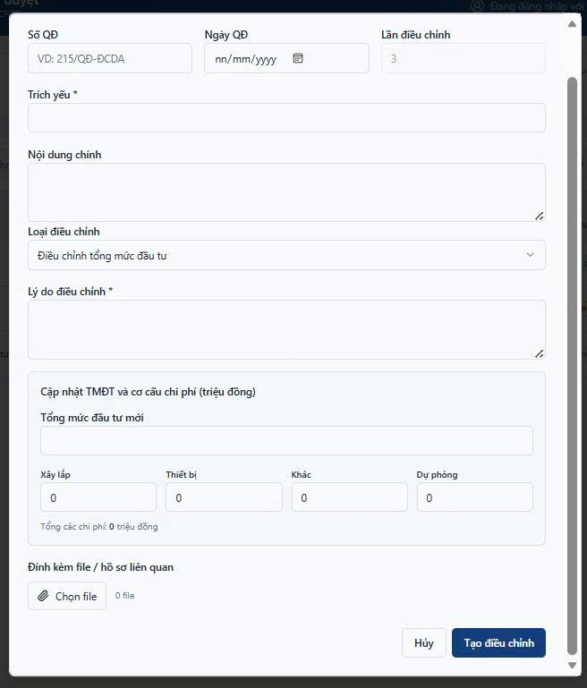
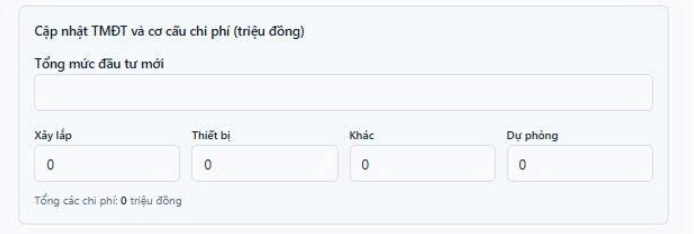
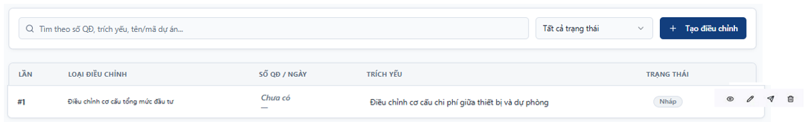
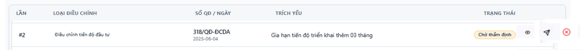
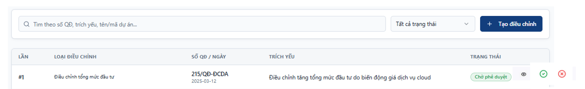

Feature #9483
[QLDA] - Bổ sung UC Điều chỉnh QĐ phê duyệt dự toán/dự án/kế hoạch thuê dịch vụ công nghệ thông tin theo yêu cầu riêng (các lần nếu có)
Mô tả

Em gửi thông tin UC64 còn thiếu theo hợp đồng

Tên Use case: Điều chỉnh QĐ phê duyệt dự toán/dự án/kế hoạch thuê dịch vụ công nghệ thông tin theo yêu cầu riêng (các lần nếu có)

Tên tác nhân: CB.PCT, LĐ.PCT, GĐ/PGĐ, CB.PKH-TC, LD.PKH-TC,P.HC-TH, HĐTĐ

Mô tả:
1. PCT có thể lập và trình thuyết minh điều chỉnh dự án
2. Đơn vị tư vấn thẩm tra, PCT có thể Thẩm định về kỹ thuật và thẩm tra thuyết minh điều chỉnh dự án
3. PKH-TC, HĐTĐ có thê thẩm định và trình phê duyệt điều chỉnh dự án
4. GĐ/PGĐ có thể phê duyệt Quyết định phê duyệt điều chỉnh dự án
5. Cho phép cập nhật nội dung QĐ điều chỉnh dự án:
6. Loại điều chỉnh: Điều chỉnh mục tiêu, quy mô đầu tư; Điều chỉnh tổng mức đầu tư; Điều chỉnh tiến độ đầu tư; Chuyển đôi chủ đầu tư; Tạm dừng dự án; Điều chỉnh nguồn vốn dự án; Điều chỉnh cơ cấu tổng mức đầu tư.
7. Số QĐ, ngày, trích yếu, nội dung chính, lần, lý do, đính kèm file, hồ sơ liên quan.
8. Cập nhật TMĐT và các chi phí của dự án (Xây lắp, thiết bị, khác, dự phòng, …) (nếu Điều chỉnh tổng mức đầu tư)
9. CB.PCT, LĐ.PCT, GĐ/PGĐ, CB.PKH-TC, LD.PKH-TC có thể xem nội dung QĐ điều chỉnh dự toán
Giao diện tham khảo:
Bổ sung màn hình Điều chỉnh quyết định phê duyệt

Lưu ý khi chọn Loại điều chỉnh là "Điều chỉnh tổng mức đầu tư" thì mới hiển thị Cập nhật TMĐT phía dưới

Cán bộ PCT thêm mới -> Chuyển cho P.KH-TC thẩm định và có thể trả lại cho PCT -> P.KH-TC thực hiện trình thì phòng BGĐ có thể Duyệt/ Trả lại
!!Trạng thái Chờ thẩm định , Chờ duyệt thì k thế nhấn chỉnh sửa, xóa
Cán bộ PCT thêm mới

P.KH-TC vào trả lại thẩm định hoặc trình tiếp cho BGĐ

BGĐ vào phê duyệt hoặc trả lại cho P.KH-TC

Example
1. Table QuyetDinhDieuChinhDuToan
Số QĐ,
ngày,
trích yếu,
nội dung chính,
lần(int)
lý do
đính kèm file/hồ sơ liên quan.
2. Bảng phụ ThongTinDieuChinhDuToan
TongMucDauTu
ChiPhiXayLap
ChiPhiThietBI
ChiPhiDuPhong
ChiPhiKhac
3. * Danh mục Loại điều chỉnh* :
Điều chỉnh mục tiêu, quy mô đầu tư; Điều chỉnh tổng mức đầu tư; Điều chỉnh tiến độ đầu tư; Chuyển đôi chủ đầu tư; Tạm dừng dự án; Điều chỉnh nguồn vốn dự án;