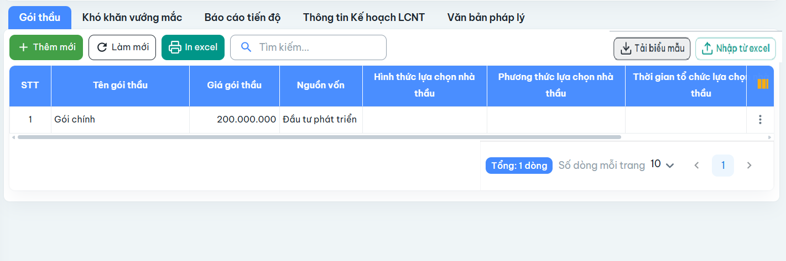

Mô tả:
Bổ sung chức năng import gói thầu từ excel

Hình ảnh tham khảo

Ghi chú: không cần bổ sung ở menu Gói thầu va tab Gói thầu trong chức năng Chỉnh sửa
endpoints
tải template: template/import-goi-thau
import: import/goi-thau

## Tài liệu

| File | Nội dung |
|------|----------|
| [report.md](./report.md) | Spec import ban đầu (cột Excel, endpoint) |
| [journal.md](./journal.md) | Nhật ký implement feature |
| [investigation-import-success-no-data.md](./investigation-import-success-no-data.md) | ✅ **Bug #9579:** import success nhưng tab trống — đã fix BE (chờ FE) |
| [import-goi-thau-debug-dataresult-empty.md](../import-goi-thau-debug-dataresult-empty.md) | Bug `dataResult: []` (template thiếu Excel Table) — đã xử lý |
