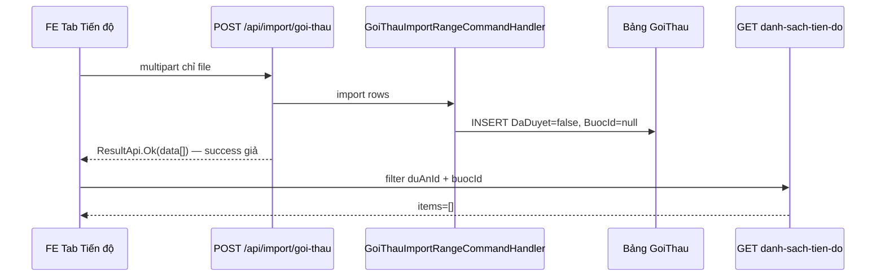
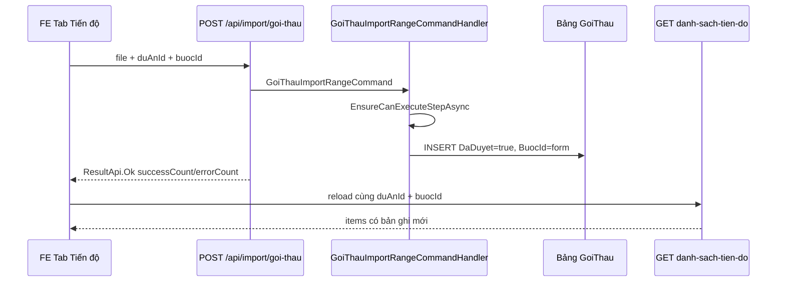

# [9579] Import Gói thầu thành công nhưng tab Tiến độ không hiển thị dữ liệu

**Trạng thái:** ✅ **HOÀN THÀNH** (BE + test — 2026-07-01)  
**Phạm vi:** Tab **Gói thầu** trong màn **Tiến độ** dự án (không áp dụng menu Gói thầu độc lập / tab Chỉnh sửa — theo `index.md`)  
**Liên quan:** `docs/issues/import-goi-thau-debug-dataresult-empty.md` (đã xử lý `dataResult: []`), `docs/issues/9579/report.md` (spec import ban đầu)

---

## Tóm tắt xử lý

| Hạng mục | Trạng thái |
|----------|------------|
| Root cause xác định | ✅ |
| Fix BE (`BuocId`, `DaDuyet`, validate, result DTO) | ✅ |
| Bắt buộc `duAnId` + `buocId` trên form import | ✅ |
| Integration tests | ✅ `GoiThauImportTests` — 6 tests |
| FE gửi context + reload grid | ⏳ Repo FE (ngoài SER) |

**Nguyên nhân gốc:** Import insert với `DaDuyet=false`, `BuocId=null` trong khi `danh-sach-tien-do` filter `DaDuyet=true` + `BuocId` tab → grid trống dù toast success (API cũ trả `ResultApi.Ok(data)` — mảng Excel).

**Sau fix:** Insert `DaDuyet=true`, `BuocId` từ form; response `GoiThauImportResultDto`; fail rõ khi thiếu context hoặc 0 dòng insert.

---

## 1. Triệu chứng

| Bước | Hành vi |
|------|---------|
| Import Excel | Toast **"Thành công - Nhập dữ liệu thành công"** |
| Tab Gói thầu (cùng bước tiến độ) | Vẫn **"Không có dữ liệu"**, tổng **0 dòng** |
| Kỳ vọng | Dữ liệu hiện ngay sau import, tổng dòng = số bản ghi import thành công |

---

## 2. Luồng hệ thống (end-to-end)

### 2.1. Trước fix (bug)



### 2.2. Sau fix (hiện tại)



**Điểm mấu chốt (đã xử lý):** Import và list dùng chung contract `duAnId` + `buocId` + `DaDuyet=true`.

---

## 3. API liên quan

| Method | Route | Vai trò |
|--------|-------|---------|
| `GET` | `/api/template/import-goi-thau?duAnId=` | Tải Excel; dropdown Kế hoạch LCNT filter theo `duAnId` |
| `POST` | `/api/import/goi-thau` | Import file — **bắt buộc** `file` + `duAnId` + `buocId` |
| `GET` | `/api/goi-thau/danh-sach-tien-do` | Grid tab Tiến độ |

### 3.1. Request import (sau fix)

```http
POST /api/import/goi-thau
Content-Type: multipart/form-data

file: Import_GoiThau.xlsx
duAnId: {guid}
buocId: {int}    # DuAnBuoc.Id — id bước tiến độ, không phải DanhMucBuoc.Id
```

**Response thành công:**

```json
{
  "result": true,
  "dataResult": {
    "successCount": 1,
    "errorCount": 0,
    "errors": []
  }
}
```

**Dấu hiệu server cũ (chưa deploy fix):** `dataResult` là **mảng** `[{ ten, tenKeHoachLuaChonNhaThau, ... }]` — format `ResultApi.Ok(data)` cũ.

### 3.2. Request import trước fix (tham chiếu)

```http
POST /api/import/goi-thau
Content-Type: multipart/form-data

file: Import_GoiThau.xlsx
```

So sánh import **Đề xuất chuyển tiếp** (đã làm đúng pattern tiến độ):

```http
POST /api/import/de-xuat-chu-truong-chuyen-tiep
Content-Type: multipart/form-data

file: ...
duAnId: {guid}
buocId: {int}
```

### 3.2. Request load danh sách tab Tiến độ (FE)

Tham chiếu `docs/issues/9609/fe-endpoint-mapping.md`:

```http
GET /api/goi-thau/danh-sach-tien-do?duAnId={guid}&buocId={int}&loaiDuAnTheoNamId={int}&pageIndex=0&pageSize=20
```

`buocId` và `duAnId` lấy từ context tab tiến độ đang mở.

---

## 4. Trace code — Import

### 4.1. Controller

**File:** `QLDA.WebApi/Controllers/ImportController.cs`

```csharp
[HttpPost("goi-thau")]
public async Task<ResultApi> ImportGoiThau()
{
    var formFile = await Request.ReadFormAsync();
    var file = formFile.Files.FirstOrDefault();
    if (file == null || file.Length == 0)
        return ResultApi.Fail("File không hợp lệ");

    var data = _excelImporter.ReadDataFromExcel<GoiThauImportDto>(file.OpenReadStream());
    await Mediator.Send(new GoiThauImportRangeCommand(data));
    return ResultApi.Ok(data);  // ← success kể cả 0 row insert
}
```

**Vấn đề:**
- Không đọc `duAnId` / `buocId` từ form (khác `ImportDeXuatChuTruongChuyenTiep`, `ImportKeHoachTrienKhaiHangMuc`).
- `ResultApi.Ok(data)` trả success khi handler **không insert dòng nào** (skip im lặng hoặc file rỗng đã qua bước đọc Excel).

### 4.2. Handler import

**File:** `QLDA.Application/GoiThaus/Commands/GoiThauImportRangeCommand.cs`

Luồng xử lý:

1. Gom tên `TenKeHoachLuaChonNhaThau` → lookup `KeHoachLuaChonNhaThau` **toàn hệ thống** (không filter `DuAnId` form).
2. Gom tên danh mục → lookup `LoaiHopDong`, `HinhThuc`, `PhuongThuc`, `NguonVon`.
3. Với mỗi dòng:
   - Nếu **không tìm thấy** tên Kế hoạch → `continue` (bỏ qua, **không báo lỗi**).
   - Insert `GoiThau` với:

```csharp
await _goiThau.AddAsync(new GoiThau {
    Id = Guid.NewGuid(),
    DuAnId = keHoachInfo.DuAnId,           // từ Kế hoạch LCNT, không từ form
    KeHoachLuaChonNhaThauId = keHoachInfo.Id,
    // BuocId KHÔNG được set → NULL
    Ten = item.Ten,
    // ... các field khác ...
    DaDuyet = false                        // ← draft
}, cancellationToken);
```

**Ghi chú thiết kế ban đầu** (`docs/issues/9579/journal.md`):

> `DaDuyet = false`: All imported records start as draft (not approved)  
> Skip-on-missing: Records with unknown KeHoach are skipped silently

### 4.3. So sánh thêm mới thủ công (hoạt động đúng trên tab)

**File:** `QLDA.Application/GoiThaus/GoiThauMappings.cs`

```csharp
public static GoiThau ToEntity(this GoiThauInsertDto dto) {
    return new GoiThau {
        DuAnId = dto.DuAnId,
        BuocId = dto.BuocId,      // ← FE gửi buocId tab hiện tại
        // ...
        DaDuyet = true            // ← hiển thị ngay trên danh sách
    };
}
```

**File:** `QLDA.WebApi/Controllers/GoiThauController.cs` — `POST them-moi` còn gọi `DuAnUpdateStepCommand` theo `BuocId`.

---

## 5. Trace code — Load danh sách tab Tiến độ

**File:** `QLDA.WebApi/Controllers/GoiThauController.cs`

```csharp
[HttpGet("danh-sach-tien-do")]
public async Task<ResultApi> Get([FromQuery] GoiThauSearchDto searchDto) {
    var res = await Mediator.Send(new GoiThauGetDanhSachQuery(searchDto) { IsNoTracking = true });
    return ResultApi.Ok(res);
}
```

**File:** `QLDA.Application/GoiThaus/Queries/GoiThauGetDanhSachQuery.cs`

```csharp
var queryable = _authManager.FilterVisible(GoiThau.GetQueryableSet(), AuthorizationResourceKeys.DuAn)
    .Where(e => e.DaDuyet)                                                    // (A) chỉ bản ghi đã duyệt
  // ...
    .WhereIf(request.SearchDto.DuAnId != null, e => e.DuAnId == request.SearchDto.DuAnId)
    .WhereIf(request.SearchDto.BuocId > 0, e => e.BuocId == request.SearchDto.BuocId);  // (B) lọc bước
```

`GoiThauSearchDto` kế thừa `CommonSearchDto` → có `DuAnId`, `BuocId`.

| Filter | Giá trị sau import | Giá trị FE gửi khi xem tab | Kết quả |
|--------|-------------------|---------------------------|---------|
| **(A) `DaDuyet`** | `false` | N/A (query luôn `true`) | **Loại hết** bản ghi import |
| **(B) `BuocId`** | `NULL` | `buocId` tab (vd. `42`) | `NULL == 42` → **Loại hết** |

Chỉ cần **một** trong hai điều kiện trên cũng đủ giải thích grid trống. Trong thực tế import vi phạm **cả hai**.

---

## 6. Root cause (xếp hạng mức độ)

### RC-1 — `DaDuyet = false` vs query chỉ lấy `DaDuyet = true` (Chắc chắn)

- Import: `GoiThauImportRangeCommand` set `DaDuyet = false`.
- Thêm mới UI: `GoiThauMappings.ToEntity` set `DaDuyet = true`.
- List tiến độ: filter cứng `.Where(e => e.DaDuyet)`.

→ Dữ liệu **có thể đã insert DB** nhưng **không bao giờ** xuất hiện trên `danh-sach-tien-do`.

### RC-2 — `BuocId` không được gán khi import (Chắc chắn khi FE truyền `buocId`)

- Entity `GoiThau` implements `ITienDo` có `BuocId`.
- Import không nhận / không set `BuocId`.
- Query tiến độ: `WhereIf(BuocId > 0, e => e.BuocId == BuocId)`.

→ Bản ghi `BuocId IS NULL` không khớp bước đang xem.

### RC-3 — API success dù 0 row insert (Có thể)

- Lookup Kế hoạch fail → `continue` im lặng.
- Tên Kế hoạch trong Excel không khớp DB (sai dự án, typo, dropdown cũ).
- Handler vẫn `SaveChangesAsync` (0 change) + controller `ResultApi.Ok`.

→ User thấy success nhưng **không có row** trong `GoiThau`.

### RC-4 — Thiếu `duAnId`/`buocId` trên form import (Góp phần)

Pattern chuẩn tiến độ (`DeXuatChuyenTiep`, `KeHoachTrienKhaiHangMuc`):

- Form POST kèm `duAnId`, `buocId`.
- Handler gán vào entity + `EnsureCanExecuteStepAsync`.

Gói thầu chưa làm → không gắn bước, không check quyền bước khi import trong tiến độ.

### RC-5 — FE không reload (Ít khả năng nếu toast success có hook reload)

Repo **không chứa FE**. Cần team FE xác nhận sau import có gọi lại:

```
GET /api/goi-thau/danh-sach-tien-do?duAnId=&buocId=
```

Nếu đã reload mà vẫn 0 dòng → nguyên nhân nằm ở RC-1/2/3 (BE).

---

## 7. Cách verify (trước khi sửa)

### 7.1. SQL / EF — kiểm tra DB sau import

```sql
SELECT TOP 20
    Id, Ten, DuAnId, BuocId, DaDuyet, KeHoachLuaChonNhaThauId, CreatedAt
FROM GoiThau
WHERE IsDeleted = 0
ORDER BY CreatedAt DESC;
```

**Kỳ vọng nếu bug RC-1/2:** có row mới với `DaDuyet = 0`, `BuocId IS NULL`.

**Kỳ vọng nếu bug RC-3:** không có row mới.

### 7.2. Postman — tái hiện mismatch list

```http
# 1) Import
POST /api/import/goi-thau
file: (Excel có dòng hợp lệ)

# 2) List giống FE tab tiến độ
GET /api/goi-thau/danh-sach-tien-do?duAnId={duAnId}&buocId={buocId}&pageIndex=0&pageSize=20
→ items: []

# 3) Bỏ filter buocId (chỉ để debug)
GET /api/goi-thau/danh-sach-tien-do?duAnId={duAnId}&pageIndex=0&pageSize=20
→ vẫn [] vì DaDuyet=false

# 4) Query thủ công (debug only — không có API public)
-- Cần SQL: WHERE DuAnId = @duAnId AND DaDuyet = 0
```

### 7.3. Integration test hiện có — gap

`QLDA.Tests/Integration/GoiThauImportTests.cs` chỉ assert HTTP 200 và `dataResult` có phần tử từ template — **không** assert:

- Row insert vào DB
- Row xuất hiện trên `danh-sach-tien-do` với `duAnId` + `buocId`

---

## 8. Fix đã triển khai ✅

### 8.1. Files đã sửa / tạo

| Layer | File | Thay đổi |
|-------|------|----------|
| Application | `GoiThaus/DTOs/GoiThauImportResultDto.cs` | ✅ Tạo mới |
| Application | `GoiThaus/Commands/GoiThauImportRangeCommand.cs` | ✅ `DuAnId`, `BuocId`, `DaDuyet=true`, validate từng dòng, `EnsureCanExecuteStepAsync` |
| WebApi | `Controllers/ImportController.cs` | ✅ Đọc `duAnId`/`buocId`, fail nếu thiếu, trả `GoiThauImportResultDto` |
| Tests | `Integration/GoiThauImportTests.cs` | ✅ E2E insert + test thiếu `duAnId` |

**Không sửa:** migration, `GoiThauGetDanhSachQuery` (filter `DaDuyet` giữ nguyên — đúng nghiệp vụ).

### 8.2. Hành vi handler (tóm tắt)

- Filter dòng trống; lookup Kế hoạch LCNT theo `DuAnId` form.
- Báo lỗi theo dòng (không `continue` im lặng): thiếu KH, KH không thuộc dự án.
- Insert: `DuAnId`, `BuocId` từ form, `DaDuyet = true`.
- `SuccessCount == 0` hoặc `ErrorCount > 0` → controller trả `result: false`.

### 8.3. Checklist FE (còn lại — repo ngoài SER)

| # | Việc | Status |
|---|------|--------|
| 1 | `formData.append('duAnId', ...)` + `formData.append('buocId', ...)` | ⏳ |
| 2 | Sau `result === true` → reload `GET .../danh-sach-tien-do?duAnId=&buocId=` | ⏳ |
| 3 | Hiển thị `errorMessage` / `errors[]` khi `result === false` | ⏳ |
| 4 | Template: `GET .../import-goi-thau?duAnId=` | ⏳ |

```typescript
const formData = new FormData();
formData.append('file', file);
formData.append('duAnId', duAnId);
formData.append('buocId', String(buocId)); // DuAnBuoc.Id

const json = await fetch('/api/import/goi-thau', { method: 'POST', body: formData }).then(r => r.json());
if (!json.result) { /* show json.errorMessage */ return; }
// reload grid: GET /api/goi-thau/danh-sach-tien-do?duAnId=&buocId=&pageIndex=1&pageSize=10
```

### 8.4. Tests đã có

`QLDA.Tests/Integration/GoiThauImportTests.cs`:

| Test | Mục đích |
|------|----------|
| `ImportGoiThau_WithoutDuAnIdOrBuocId_ReturnsBadRequest` | Thiếu context → fail |
| `ImportGoiThau_WithDuAnIdAndBuocId_AppearsInDanhSachTienDo` | Insert đúng `BuocId`, `DaDuyet` |
| `ImportGoiThau_WithRealTemplateFile_ReturnsOk` | HTTP + template thật |

---

## 8 (archive). Hướng fix đề xuất (trước khi code — giữ tham chiếu)

### 8.1. Nguyên tắc

Import trong **Tiến độ** phải tạo bản ghi **nhìn thấy được** trên `danh-sach-tien-do` với cùng `duAnId` + `buocId` — tương đương `POST /api/goi-thau/them-moi` về mặt visibility.

Tham chiếu pattern: `DeXuatChuyenTiepImportRangeCommand`, `KeHoachTrienKhaiHangMucImportRangeCommand`.

### 8.2. Thay đổi BE (đề xuất cụ thể)

#### Bước 1 — Mở rộng command + controller

**`GoiThauImportRangeCommand`:**

```csharp
public record GoiThauImportRangeCommand(List<GoiThauImportDto> Imports) : IRequest<GoiThauImportResultDto>
{
    public Guid DuAnId { get; init; }
    public int BuocId { get; init; }
}
```

**`ImportController.ImportGoiThau`:**

```csharp
_ = Guid.TryParse(formFile["duAnId"].FirstOrDefault(), out var duAnId);
_ = int.TryParse(formFile["buocId"].FirstOrDefault(), out var buocId);

var importQuery = new GoiThauImportRangeCommand(data) {
    DuAnId = duAnId,
    BuocId = buocId,
};

var result = await Mediator.Send(importQuery);

if (result.ErrorCount > 0)
    return new ResultApi { Result = false, ErrorMessage = string.Join("\n", result.Errors), DataResult = result };

return ResultApi.Ok(result);
```

> Khi `DuAnId` + `BuocId` có giá trị → import trong tiến độ.  
> Có thể giữ mode cũ (không truyền form) cho import ngoài tiến độ nếu BA yêu cầu — nhưng `index.md` ghi **chỉ** tab Tiến độ.

#### Bước 2 — Handler: gán `BuocId`, `DaDuyet`, validate

```csharp
// Đầu Handle — khi import trong dự án
if (request.DuAnId != Guid.Empty && request.BuocId > 0)
    await _auth.EnsureCanExecuteStepAsync(request.BuocId, _authContext, cancellationToken);

// Lookup KeHoach — thêm filter DuAnId khi import trong tiến độ
var keHoachQuery = _keHoach.GetQueryableSet()
    .Where(e => keHoachNames.Contains(e.Ten!));
if (request.DuAnId != Guid.Empty)
    keHoachQuery = keHoachQuery.Where(e => e.DuAnId == request.DuAnId);

// Trong vòng foreach — khi insert
await _goiThau.AddAsync(new GoiThau {
    DuAnId = request.DuAnId != Guid.Empty ? request.DuAnId : keHoachInfo.DuAnId,
    BuocId = request.BuocId > 0 ? request.BuocId : null,
    // ...
    DaDuyet = true,   // khớp GoiThauMappings.ToEntity — hiển thị ngay trên tab
}, cancellationToken);
```

**Quyết định BA cần chốt:**

| Câu hỏi | Đề xuất kỹ thuật |
|---------|------------------|
| `DaDuyet` sau import? | `true` (giống thêm mới form) — nếu BA muốn draft thì phải **bỏ** filter `DaDuyet` trên list tiến độ |
| Import trùng tên? | Báo lỗi theo dòng hoặc skip có message — tránh silent success |
| Kế hoạch LCNT khác `DuAnId` form? | Báo lỗi dòng — không `continue` im lặng |

#### Bước 3 — `GoiThauImportResultDto` (khuyến nghị)

Giống `KeHoachTrienKhaiHangMucImportResultDto`:

```csharp
public class GoiThauImportResultDto
{
    public int SuccessCount { get; set; }
    public int ErrorCount { get; set; }
    public List<string> Errors { get; set; } = [];
}
```

- `SuccessCount == 0` → trả `Result = false`, message rõ ("Không có dòng nào được nhập").
- Tránh toast success khi 0 insert.

#### Bước 4 — (Tùy chọn) Cập nhật bước dự án

`GoiThauController.Create` gọi `DuAnUpdateStepCommand` + `DuAnUpdatePhaseCommand`. Cân nhắc gọi tương tự sau import hàng loạt nếu nghiệp vụ yêu cầu đồng bộ tiến độ dự án.

### 8.3. Thay đổi FE (checklist)

| # | Việc cần làm |
|---|--------------|
| 1 | Khi `POST /api/import/goi-thau`, gửi kèm `duAnId`, `buocId` cùng context tab (giống import Đề xuất chuyển tiếp / Kế hoạch triển khai hạng mục) |
| 2 | Sau success, gọi lại `GET /api/goi-thau/danh-sach-tien-do` với **cùng** `duAnId`, `buocId`, `loaiDuAnTheoNamId`, phân trang |
| 3 | Nếu API trả `errorCount > 0`, hiển thị lỗi theo dòng — không toast success chung |
| 4 | Tải template: `GET /api/template/import-goi-thau?duAnId=` để dropdown Kế hoạch đúng dự án |

### 8.4. Test cần bổ sung

**File:** `QLDA.Tests/Integration/GoiThauImportTests.cs`

```csharp
[Fact]
public async Task ImportGoiThau_WithDuAnIdAndBuocId_AppearsInDanhSachTienDo()
{
    // 1. Seed KeHoach + danh mục (đã có)
    // 2. POST import với form: file + duAnId + buocId
    // 3. GET danh-sach-tien-do?duAnId=&buocId=
    // 4. Assert totalCount >= 1, item.Ten khớp Excel
}
```

---

## 9. Files (archive — checklist lúc implement)

| Layer | File | Status |
|-------|------|--------|
| Application | `GoiThaus/Commands/GoiThauImportRangeCommand.cs` | ✅ |
| Application | `GoiThaus/DTOs/GoiThauImportResultDto.cs` | ✅ |
| WebApi | `Controllers/ImportController.cs` | ✅ |
| Tests | `Integration/GoiThauImportTests.cs` | ✅ |
| FE | (repo FE) | ⏳ |

---

## 10. Ma trận kết luận (sau fix)

| Câu hỏi | Kết quả |
|----------|---------|
| API import có insert DB đúng không? | ✅ Khi `duAnId`/`buocId` hợp lệ + KH LCNT match |
| Có lưu đúng `duAnId`? | ✅ Từ form |
| Có lưu đúng `buocId`? | ✅ Từ form (`DuAnBuoc.Id`) |
| List có filter sai? | ✅ Filter đúng; dữ liệu import khớp sau fix |
| Success nhưng 0 insert? | ✅ Đã chặn — `result: false` + message |
| QA thực tế (Network) | ⚠️ Cần **restart WebApi** + FE gửi form — response cũ `dataResult: []` = chưa deploy |

---

## 11. Nghiệm thu

- [x] Fix handler + controller
- [x] Integration tests pass
- [x] Bắt buộc `duAnId`/`buocId`
- [ ] FE gửi context + reload (team FE)
- [ ] Manual QA trên môi trường dev sau restart BE

**Verify nhanh sau deploy:**

1. Import → response `dataResult.successCount` (object), **không** phải mảng Excel.
2. Thiếu `duAnId` → `Thiếu duAnId — cần gửi kèm context tab tiến độ`.
3. Grid hiện bản ghi mới sau reload cùng `buocId`.
