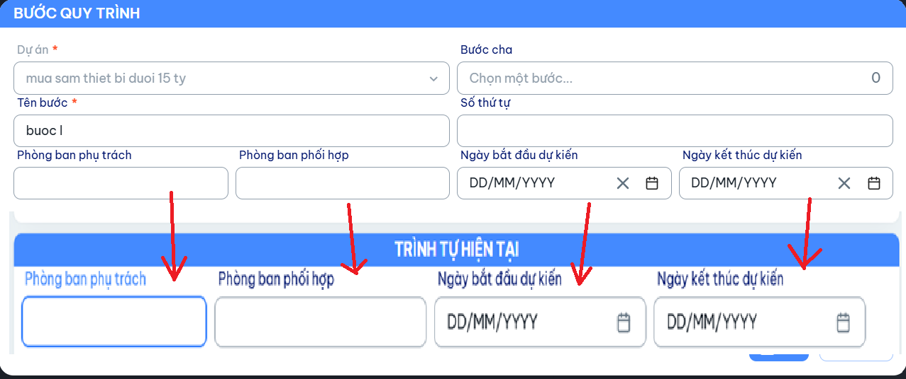

Mô tả:
Disable các trường thông tin Trách nhiệm thực hiện, Ngày bắt đầu dự kiến, Ngày kết thúc dự kiến
Trường Trách nhiệm thực hiện hiển thị các phòng ban được chọn trong Dự án bước quy trình
Trường Ngày bắt đầu dự kiến lấy dữ từ trường Ngày bắt đầu dự kiến trong Dự án bước quy trình
Trường Ngày kết thúc dự kiến lấy dữ từ trường Ngày kết thúc dự kiến trong Dự án bước quy trình

=> bổ sung  Phòng ban phụ trách và Phòng ban phối hợp tại bước