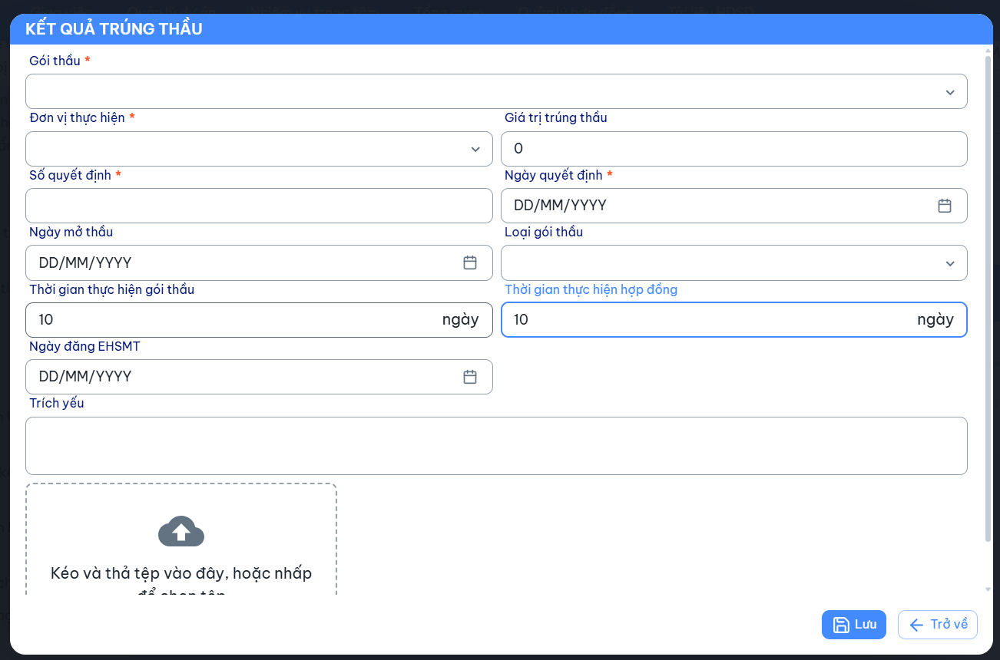
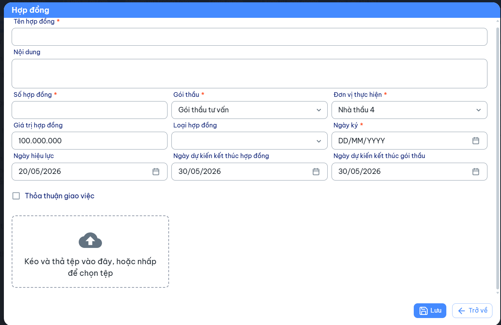

Mô tả:
Đổi tên trường Ngày dự kiến kết thúc thành Ngày dự kiến kết thúc hợp đồng
Bổ sung trường Ngày dự kiến kết thúc gói thầu

Ngày dự kiến kết thúc hợp đồng = Ngày hiệu lực + số ngày Thời gian thực hiện hợp đồng ở màn hình Kết quả trúng thầu, cho phép chỉnh sửa
Ngày dự kiến kết thúc gói thầu = Ngày hiệu lực + số ngày Thời gian thực hiện gói thầu ở màn hình Kết quả trúng thầu, cho phép chỉnh sửa

Ví dụ
Màn hình Kết quả trúng thầu, có thời gian thực hiện gói thầu là 10 ngày, thời gian thực hiện hợp đồng là 10 ngày

Ở màn hinh Hợp đồng, khi lựa chọn gói thầu có kết quả trúng thầu trên
Chọn ngày hiệu lực là 20/05/2026 -> Ngày dự kiến kết thúc hợp đồng là 30/05/2026, Ngày dự kiến kết thúc gói thầu là 30/05/2026
