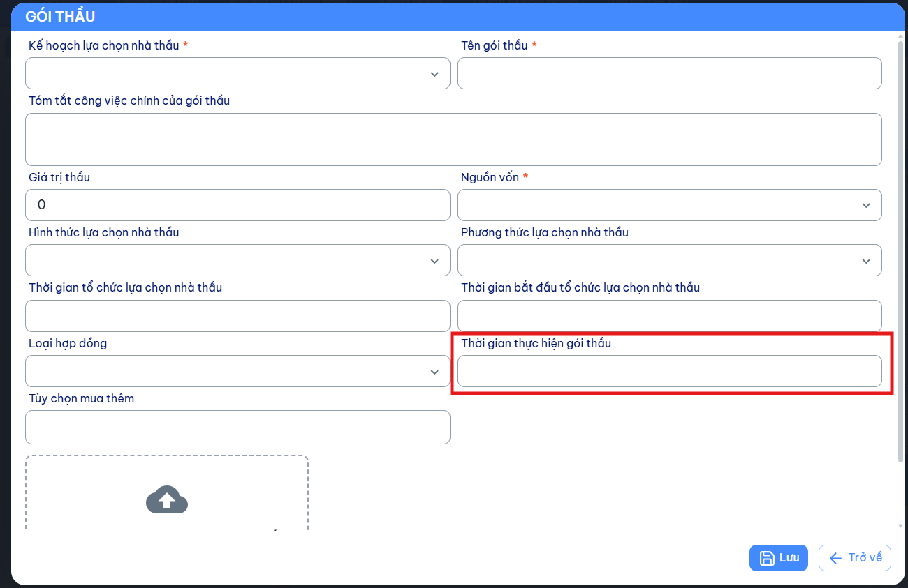

# Issue #9604 — FE Mapping: Thời gian thực hiện gói thầu (int)

## API Endpoints

| Action | Method | Route | Body Type |
|--------|--------|-------|-----------|
| Thêm mới | `POST` | `/api/goi-thau` | `GoiThauInsertDto` |
| Cập nhật | `PUT` | `/api/goi-thau` | `GoiThauUpdateDto` |
| Chi tiết | `GET` | `/api/goi-thau/{id}/chi-tiet` | — |

Response cho cả 3 endpoint: `ResultApi<GoiThauDto>`

---

## 1. Thay đổi Type

| Field | Type cũ | Type mới | Notes |
|-------|---------|----------|-------|
| `ThoiGianThucHienGoiThau` | `string?` | `int?` | Số ngày thực hiện gói thầu |

---

## 2. Input Fields (Create/Update)

> Trên `GoiThauInsertDto` / `GoiThauUpdateDto`

| FE Field Label | API Field | Type | Required | Notes |
|----------------|-----------|------|----------|-------|
| Thời gian thực hiện gói thầu | `ThoiGianThucHienGoiThau` | `int?` | No | Số ngày (number input) |

---

## 3. Response Fields

> Trên `GoiThauDto`

| API Field | Type | Notes |
|-----------|------|-------|
| `ThoiGianThucHienGoiThau` | `int?` | Số ngày thực hiện gói thầu |

---

## 4. UI Reference

---

## 5. Tóm tắt thay đổi FE

| # | Thay đổi | Loại |
|---|----------|------|
| 1 | Đổi `ThoiGianThucHienGoiThau` từ `string` → `int` | **Type change** |
| 2 | Input là number thay vì text | **UI change** |

### Lưu ý quan trọng
- FE sử dụng number input thay vì text input
- Giá trị là số ngày (VD: 10, 30, 90)
- Mapping giống với `SoNgayTrienKhai` trong `KetQuaTrungThau`