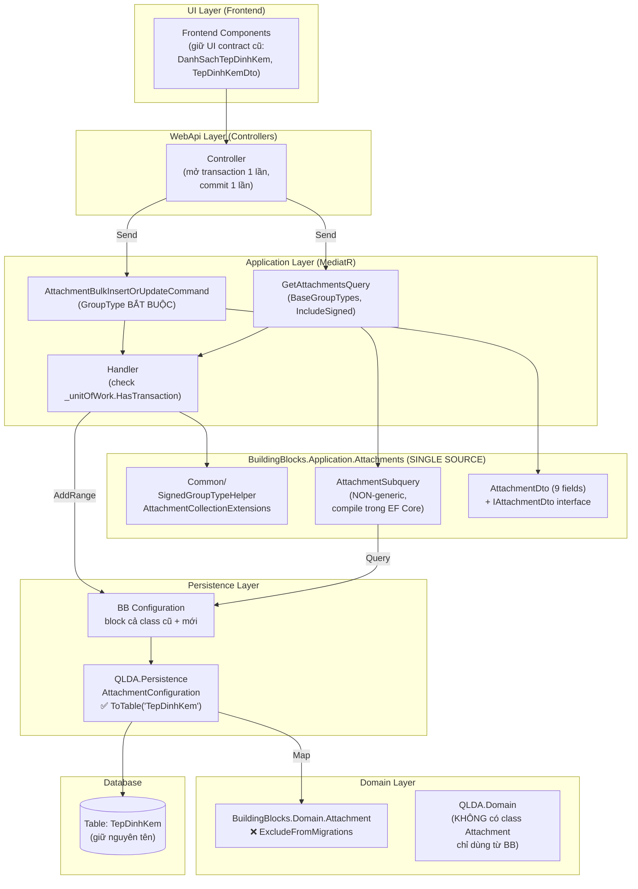
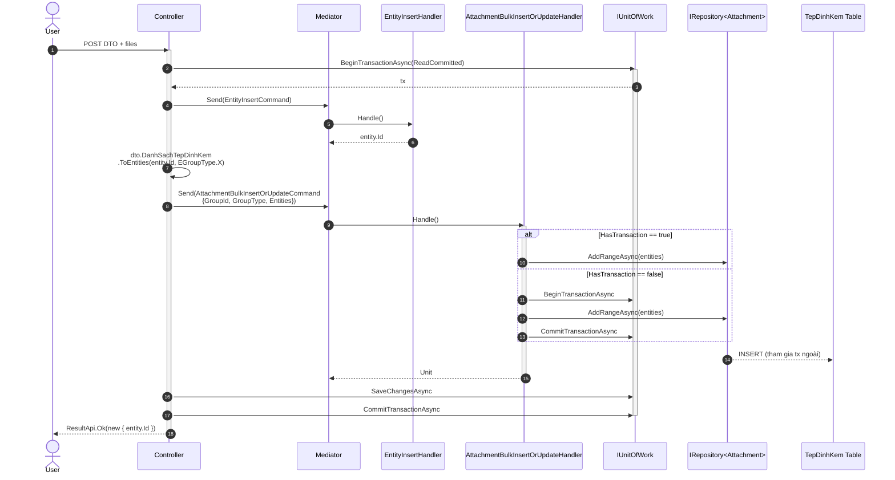
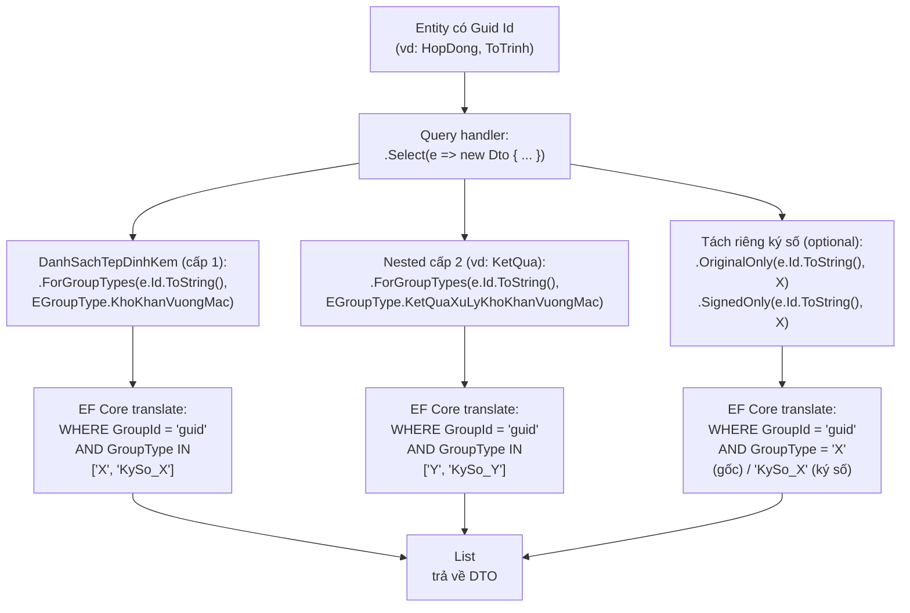
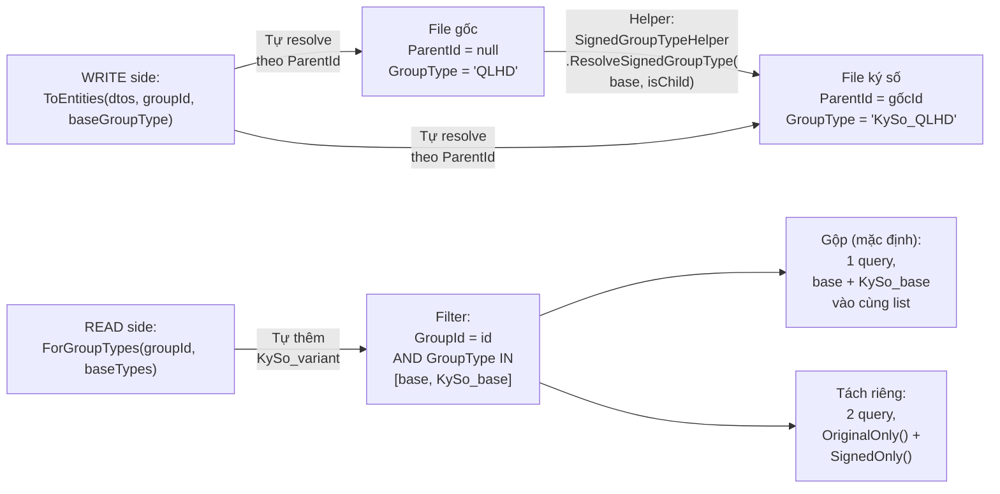
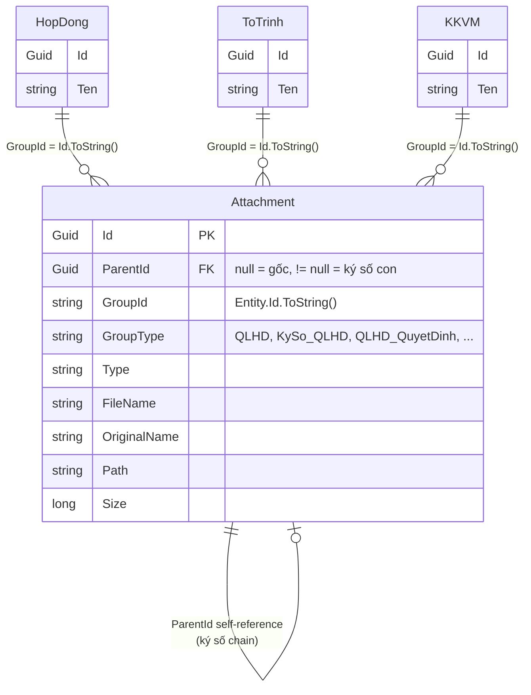
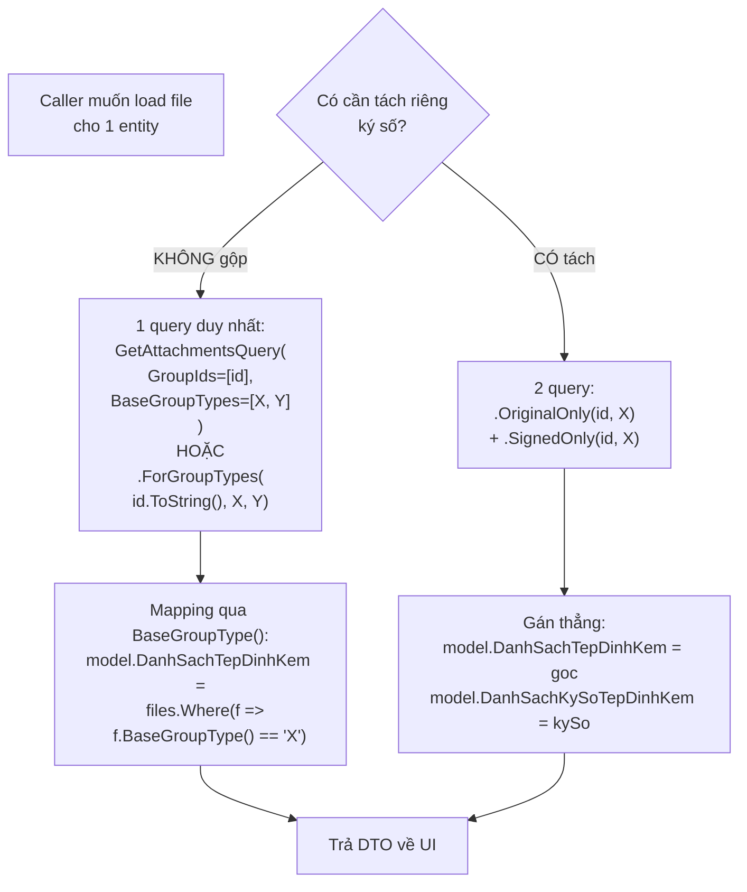

# Plan: Đồng bộ TepDinhKem → Application.Attachments (Attachment)

## Context

### Quy ước đặt tên: code-side vs DB-side

| Layer | Tên gọi |
|---|---|
| **Code (class/entity)** | `Attachment` (tiếng Anh, generic) |
| **DB table** | `TepDinhKem` (giữ nguyên, mỗi module tự config) |

→ KHÔNG tạo table `Attachments`. Mỗi module giữ nguyên `ToTable("TepDinhKem")` hoặc `ToTable("TepDinhKems")` qua `AttachmentConfiguration` riêng. Class `Attachment` map xuống table `TepDinhKem(s)` — đây là pattern **POCO != TableName** chuẩn của EF Core.

### Multi-DB / Multi-module reality (quan trọng!)

Mỗi module (QLDA, QLHD, DVDC, NVTT) có **DB riêng**, mỗi DB có **bảng `TepDinhKem` riêng**. Tuy nhiên về mặt **Application pattern**, tất cả cùng gọi chung 1 set Commands/Queries — không cần tách theo module. `BuildingBlocks.Application.Attachments/` là nguồn duy nhất.

### GroupId/GroupType multiplexing (ĐẶC BIỆT — không được bỏ qua)

Cùng 1 entity có thể có **nhiều danh sách file tách biệt** trên cùng `GroupId`, phân biệt bằng `GroupType`. Ví dụ entity `HopDong`:

| GroupId | GroupType | ParentId | Vai trò |
|---|---|---|---|
| `{hopdongId}` | `QLHD` | null | File hợp đồng gốc |
| `{hopdongId}` | `QLHD_QuyetDinh` | null | File quyết định kèm theo |
| `{hopdongId}` | `KySo_QLHD` | !=null (→ file QLHD gốc) | Bản ký số của file QLHD |
| `{hopdongId}` | `KySo_QLHD_QuyetDinh` | !=null (→ file QLHD_QuyetDinh gốc) | Bản ký số của file quyết định |

**Quy tắc:**
- `GroupType` = `KySo_<baseType>` **CHỈ** khi `ParentId != null` (là bản ký số của file gốc)
- File gốc: `GroupType = <baseType>`, `ParentId = null`
- File ký số: `GroupType = KySo_<baseType>`, `ParentId = <fileGocId>`
- 1 file gốc có thể có nhiều bản ký số (chain qua ParentId)

**API Get phải filter đúng:**

```csharp
// Lấy TẤT CẢ file của hopdong (mọi GroupType, kể cả gốc + ký số) — dùng cho hydration
var dsAll = await Mediator.Send(new GetAttachmentsQuery([hopdongId]));

// Lấy CHỈ file có GroupType exact = "QLHD" (không lấy "KySo_QLHD")
var dsGoc = await Mediator.Send(new GetAttachmentsQuery([hopdongId], ["QLHD"]));

// Lấy CHỈ file ký số của QLHD
var dsKySo = await Mediator.Send(new GetAttachmentsQuery([hopdongId], ["KySo_QLHD"]));

// Lấy nhiều GroupType exact
var dsMix = await Mediator.Send(new GetAttachmentsQuery([hopdongId], ["QLHD", "KySo_QLHD_QuyetDinh"]));
```

→ `GetAttachmentsQuery` filter **exact match GroupType**, không tự động thêm/bỏ prefix `KySo_`. Caller tự chỉ định chính xác GroupType cần lấy.

### Multi-property load — Convention-based (KHÔNG dùng attribute)

> **Nguyên tắc duy nhất:** `SignedGroupTypeHelper.ResolveSignedGroupType(baseGroupType, isChild)` là single source of truth cho mọi resolve GroupType. **KHÔNG dùng attribute**, **KHÔNG reflection**.

**Tại sao KHÔNG dùng `AttachmentGroupTypeAttribute`?**
- YAGNI: convention `ParentId != null → GroupType = "KySo_" + base` đã rõ ràng, không cần attribute
- DRY: 1 helper thay vì 2 cơ chế (attribute + convention) dễ conflict
- KISS: caller quyết định gộp/tách qua việc gọi 1 hoặc 2 lần helper, không cần reflection

**Quy tắc load 1 entity có nhiều property danh sách file:**

Ví dụ `HopDongModel`:

```csharp
public class HopDongModel
{
    public List<TepDinhKemDto>? DanhSachTepDinhKem { get; set; }     // base = "QLHD"
    public List<TepDinhKemDto>? DanhSachQuyetDinh { get; set; }       // base = "QLHD_QuyetDinh"
    public List<TepDinhKemDto>? DanhSachKySoTepDinhKem { get; set; } // base = "KySo_QLHD"
    public List<TepDinhKemDto>? DanhSachKySoQuyetDinh { get; set; }   // base = "KySo_QLHD_QuyetDinh"
}
```

**Quy tắc mapping (1 query duy nhất, gán đúng property):**

| GroupType trong DB | Property đích (mặc định — caller gọi 1 lần) | Property đích (tách riêng — caller gọi 2 lần) |
|---|---|---|
| `QLHD` | `DanhSachTepDinhKem` (gộp) | `DanhSachTepDinhKem` (chỉ gốc) |
| `KySo_QLHD` | `DanhSachTepDinhKem` *(gộp)* | `DanhSachKySoTepDinhKem` *(tách riêng)* |
| `QLHD_QuyetDinh` | `DanhSachQuyetDinh` (gộp) | `DanhSachQuyetDinh` (chỉ gốc) |
| `KySo_QLHD_QuyetDinh` | `DanhSachQuyetDinh` *(gộp)* | `DanhSachKySoQuyetDinh` *(tách riêng)* |

**Caller tự quyết định** khi nào gộp/tách — KHÔNG cần attribute, KHÔNG cần reflection:

```csharp
// Case 1: GỘP (phổ biến nhất) — caller gọi 1 lần với base
var allFiles = await Mediator.Send(new GetAttachmentsQuery(
    GroupIds: [hopDongId.ToString()],
    BaseGroupTypes: ["QLHD", "QLHD_QuyetDinh"]   // helper tự thêm KySo_ variant
));
hopDong.DanhSachTepDinhKem = allFiles.Where(f => f.BaseGroupType() == "QLHD").ToList();
hopDong.DanhSachQuyetDinh = allFiles.Where(f => f.BaseGroupType() == "QLHD_QuyetDinh").ToList();
// → Mỗi property gộp cả gốc + ký số

// Case 2: TÁCH RIÊNG — caller gọi 2 lần với base khác nhau
var goc = await Mediator.Send(new GetAttachmentsQuery(
    GroupIds: [hopDongId.ToString()],
    BaseGroupTypes: ["QLHD"]   // helper filter CHỈ GroupType = "QLHD", KHÔNG bao gồm KySo_QLHD
));
var kySo = await Mediator.Send(new GetAttachmentsQuery(
    GroupIds: [hopDongId.ToString()],
    BaseGroupTypes: ["KySo_QLHD"]  // base = "KySo_QLHD" (đã có prefix sẵn)
));
hopDong.DanhSachTepDinhKem = goc;
hopDong.DanhSachKySoTepDinhKem = kySo;
```

**Helper method `BaseGroupType()` trên `AttachmentDto` (extension):**

```csharp
namespace BuildingBlocks.Application.Attachments.Common;

public static class AttachmentDtoExtensions
{
    /// Strip "KySo_" prefix để lấy base GroupType
    /// "KySo_QLHD" → "QLHD"
    /// "QLHD" → "QLHD"
    public static string BaseGroupType(this AttachmentDto dto)
        => dto.GroupType?.StartsWith(SignedGroupTypeHelper.Prefix) == true
            ? dto.GroupType.Substring(SignedGroupTypeHelper.Prefix.Length)
            : dto.GroupType ?? string.Empty;
}
```

**Helper `GetAttachmentsQuery` (signature mới — convention-based):**

```csharp
public record GetAttachmentsQuery(
    List<string> GroupIds,
    /// Base GroupTypes (KHÔNG có prefix KySo_). Helper tự thêm KySo_ variant nếu IncludeSigned=true.
    List<string>? BaseGroupTypes = null,
    /// true (mặc định): load cả gốc + KySo_ variant. false: chỉ load exact GroupType.
    bool IncludeSigned = true
) : IRequest<List<AttachmentDto>>;
```

**Handler implementation (convention-based, KHÔNG reflection):**

```csharp
public class GetAttachmentsQueryHandler : IRequestHandler<GetAttachmentsQuery, List<AttachmentDto>>
{
    private readonly IRepository<Attachment, Guid> _repository;
    public GetAttachmentsQueryHandler(IRepository<Attachment, Guid> repository)
        => _repository = repository;

    public async Task<List<AttachmentDto>> Handle(GetAttachmentsQuery request, CancellationToken ct)
    {
        IQueryable<Attachment> query = _repository.GetQueryableSet()
            .Where(a => request.GroupIds.Contains(a.GroupId));

        if (request.BaseGroupTypes?.Count > 0)
        {
            // Build danh sách GroupTypes cần filter: base + (KySo_base nếu IncludeSigned)
            var groupTypesToFilter = new List<string>();
            foreach (var baseType in request.BaseGroupTypes)
            {
                groupTypesToFilter.Add(baseType);
                if (request.IncludeSigned && !baseType.StartsWith(SignedGroupTypeHelper.Prefix))
                    groupTypesToFilter.Add(SignedGroupTypeHelper.Prefix + baseType);
            }
            query = query.Where(a => groupTypesToFilter.Contains(a.GroupType!));
        }

        return await query.Select(a => a.ToDto()).ToListAsync(ct);
    }
}
```

**Sử dụng trong HopDongGetQueryHandler (cascade — KHÔNG dùng attribute):**

```csharp
public class HopDongGetQueryHandler(IServiceProvider sp) : IRequestHandler<HopDongGetQuery, HopDongModel>
{
    private readonly IRepository<HopDong, Guid> _hopDongRepo = sp.GetRequiredService<...>();
    private readonly IMediator _mediator = sp.GetRequiredService<IMediator>();

    public async Task<HopDongModel> Handle(HopDongGetQuery request, CancellationToken ct)
    {
        var hopDong = await _hopDongRepo.GetByIdAsync(request.Id, ct);
        var model = hopDong.ToModel();

        // Case 1: GỘP - 1 query duy nhất, 1 property per base
        var allFiles = await _mediator.Send(new GetAttachmentsQuery(
            GroupIds: [hopDong.Id.ToString()],
            BaseGroupTypes: ["QLHD", "QLHD_QuyetDinh"]   // helper tự resolve
        ), ct);
        
        model.DanhSachTepDinhKem = allFiles
            .Where(f => f.BaseGroupType() == "QLHD").ToList();
        model.DanhSachQuyetDinh = allFiles
            .Where(f => f.BaseGroupType() == "QLHD_QuyetDinh").ToList();

        return model;
    }
}
```

**Helper cho write side (KHÔNG dùng attribute):**

```csharp
public static class AttachmentCollectionExtensions
{
    /// Convert DTO list → List<Attachment> entities cho save
    /// Caller TỰ truyền baseGroupType (vd: "QLHD") — helper tự resolve GroupType theo ParentId
    public static List<Attachment> ToEntities(
        this IEnumerable<AttachmentInsertOrUpdateModel> dtos,
        Guid groupId,
        string baseGroupType)
    {
        return dtos.Select(d => new Attachment
        {
            Id = d.Id ?? SequentialGuid.SequentialGuidGenerator.Instance.NewGuid(),
            GroupId = groupId.ToString(),
            GroupType = SignedGroupTypeHelper.ResolveSignedGroupType(
                baseGroupType, d.ParentId != null),  // ← tự resolve ký số
            ParentId = d.ParentId,
            Type = d.Type,
            FileName = d.FileName,
            OriginalName = d.OriginalName,
            Path = d.Path,
            Size = d.Size,
        }).ToList();
    }
}
```

**Validator cho bulk save (KHÔNG ScopeGroupTypes, KHÔNG attribute):**

```csharp
public class AttachmentBulkInsertOrUpdateCommandValidator : AbstractValidator<AttachmentBulkInsertOrUpdateCommand>
{
    public AttachmentBulkInsertOrUpdateCommandValidator()
    {
        RuleFor(x => x.GroupId).NotEmpty();
        RuleFor(x => x.GroupType).NotEmpty()
            .WithMessage("GroupType là bắt buộc để tránh xóa nhầm files khác cùng GroupId");
        RuleFor(x => x.Entities).NotNull();

        RuleForEach(x => x.Entities).ChildRules(file =>
        {
            file.RuleFor(f => f.GroupId).Equal(x => x.GroupId)
                .WithMessage("Tất cả file phải cùng GroupId");
        });
    }
}
```

**Lưu ý quan trọng về property naming & default behavior:**

> ⚠️ **DEPRECATED** — Phần này đã được thay thế bằng section **Multi-property load — Convention-based** ở trên. Xem line 53+.

→ `GetAttachmentsQuery` đã có tham số `BaseGroupTypes` + `IncludeSigned` (convention-based, KHÔNG dùng attribute). Xem line 53+.

### IQueryable-level subquery pattern (nested DTOs — quan trọng!)

**Vấn đề:** Một số handler dùng **subquery trong `.Select()` projection** ở IQueryable level để tránh N+1 query kết hợp với `.PaginatedListAsync()`. Đây là pattern bắt buộc vì EF Core không thể execute side-effect query (gọi `_mediator.Send()`) trong projection.

**Ví dụ thực tế (QLDA.Application/KhoKhanVuongMacs/Queries/KhoKhanVuongMacGetDanhSachQuery.cs):**

```csharp
return await queryable
    .Select(e => new KhoKhanVuongMacDto() {
        Id = e.Id,
        // ...
        // Top-level: file của KhoKhanVuongMac
        DanhSachTepDinhKem = TepDinhKem.GetQueryableSet()
            .Where(i => i.GroupId == e.Id.ToString() 
                && (i.GroupType == nameof(EGroupType.KhoKhanVuongMac) 
                    || i.GroupType == SignedHelper.Prefix + nameof(EGroupType.KhoKhanVuongMac)))
            .Select(i => i.ToDto()).ToList(),
        
        // Nested: file của KetQua (cấp 2)
        KetQua = new KetQuaXuLyDto() {
            KetQuaXuLy = e.KetQuaXuLy,
            NgayXuLy = e.NgayXuLy,
            DanhSachTepDinhKem = TepDinhKem.GetQueryableSet()
                .Where(i => i.GroupId == e.Id.ToString() 
                    && (i.GroupType == nameof(EGroupType.KetQuaXuLyKhoKhanVuongMac) 
                        || i.GroupType == SignedHelper.Prefix + nameof(EGroupType.KetQuaXuLyKhoKhanVuongMac)))
                .Select(i => i.ToDto()).ToList()
        },
    })
    .PaginatedListAsync(request.Skip(), request.Take(), cancellationToken: cancellationToken);
```

**Đặc điểm:**
- 1 query duy nhất (không N+1)
- Nested DTO có attachment riêng (cấp 2, 3, ...)
- Mỗi cấp có 1+ GroupType khác nhau
- Có thể có nhiều level sâu hơn nữa (cấp 3, 4)

**Rule:** KHÔNG được gọi `_mediator.Send(...)` bên trong `.Select()` projection → sẽ throw exception khi execute (EF Core không cho phép side-effect trong expression tree).

→ Phải tạo helper method **expression-tree-friendly** để gom logic filter TepDinhKem vào `BuildingBlocks.Application.Attachments.Common`.

**Solution: Helper class `AttachmentSubquery` cho IQueryable:**

```csharp
namespace BuildingBlocks.Application.Attachments.Common;

/// <summary>
/// Helper cho EF Core subquery trong .Select() projection
/// Tránh side-effect (không gọi _mediator.Send trong expression tree)
/// </summary>
public static class AttachmentSubquery
{
    /// <summary>
    /// Subquery filter theo NHIỀU GroupType (gộp cả base + signed variant)
    /// ⚠️ NON-generic, nhận string groupId trực tiếp — compile được trong EF Core expression tree
    /// </summary>
    /// <param name="query">IQueryable<Attachment></param>
    /// <param name="groupId">string — GroupId (vd: entity.Id.ToString())</param>
    /// <param name="baseGroupTypes">params string[] — các base GroupType, helper tự thêm KySo_ variant</param>
    public static IQueryable<AttachmentDto> ForGroupTypes(
        this IQueryable<Attachment> query,
        string groupId,
        params string[] baseGroupTypes
    )
    {
        // Tự động thêm cả base + signed variant cho mỗi GroupType
        var allTypes = baseGroupTypes
            .SelectMany(gt => new[] { gt, SignedGroupTypeHelper.Prefix + gt })
            .Distinct()
            .ToList();

        return query
            .Where(a => a.GroupId == groupId && allTypes.Contains(a.GroupType))
            .Select(a => a.ToDto());
    }

    /// <summary>
    /// Subquery lấy 1 GroupType exact (không gộp ký số) — dùng khi cần tách riêng
    /// </summary>
    public static IQueryable<AttachmentDto> ForExactGroupType(
        this IQueryable<Attachment> query,
        string groupId,
        string exactGroupType
    )
    {
        return query
            .Where(a => a.GroupId == groupId && a.GroupType == exactGroupType)
            .Select(a => a.ToDto());
    }

    /// <summary>
    /// Subquery lấy TẤT CẢ file của 1 GroupId (mọi GroupType) — load thẳng về DTO qua mapping
    /// </summary>
    public static IQueryable<AttachmentDto> ForGroupId(
        this IQueryable<Attachment> query,
        string groupId
    )
    {
        return query
            .Where(a => a.GroupId == groupId)
            .Select(a => a.ToDto());
    }

    /// <summary>
    /// Subquery chỉ lấy file GỐC (không bao gồm KySo_) — overload non-generic
    /// </summary>
    public static IQueryable<AttachmentDto> OriginalOnly(
        this IQueryable<Attachment> query,
        string groupId,
        string baseGroupType
    )
    {
        return query
            .Where(a => a.GroupId == groupId && a.GroupType == baseGroupType)
            .Select(a => a.ToDto());
    }

    /// <summary>
    /// Subquery chỉ lấy file KÝ SỐ — overload non-generic
    /// </summary>
    public static IQueryable<AttachmentDto> SignedOnly(
        this IQueryable<Attachment> query,
        string groupId,
        string baseGroupType
    )
    {
        var signedType = SignedGroupTypeHelper.Prefix + baseGroupType;
        return query
            .Where(a => a.GroupId == groupId && a.GroupType == signedType)
            .Select(a => a.ToDto());
    }
}
```

**Sử dụng trong handler (refactor):**

```csharp
// TRƯỚC (duplicate code):
DanhSachTepDinhKem = TepDinhKem.GetQueryableSet()
    .Where(i => i.GroupId == e.Id.ToString() 
        && (i.GroupType == nameof(EGroupType.KhoKhanVuongMac) 
            || i.GroupType == SignedHelper.Prefix + nameof(EGroupType.KhoKhanVuongMac)))
    .Select(i => i.ToDto()).ToList(),

// SAU (gọn + 1 helper dùng chung, NON-generic):
DanhSachTepDinhKem = TepDinhKem.GetQueryableSet()
    .ForGroupTypes(e.Id.ToString(), nameof(EGroupType.KhoKhanVuongMac))
    .ToList(),

// Nested cấp 2 (KetQua — cùng GroupId vì cùng entity cha):
KetQua = new KetQuaXuLyDto() {
    KetQuaXuLy = e.KetQuaXuLy,
    NgayXuLy = e.NgayXuLy,
    DanhSachTepDinhKem = TepDinhKem.GetQueryableSet()
        .ForGroupTypes(e.Id.ToString(), nameof(EGroupType.KetQuaXuLyKhoKhanVuongMac))
        .ToList()
},

// Nhiều GroupType cùng lúc (vd: BaoCaoKhoKhanVuongMac có 2 loại):
DanhSachTepDinhKem = TepDinhKem.GetQueryableSet()
    .ForGroupTypes(e.Id.ToString(),
        nameof(EGroupType.KhoKhanVuongMac),
        nameof(EGroupType.KetQuaXuLyKhoKhanVuongMac))
    .ToList(),

// Tách riêng file gốc / ký số (caller tự gọi 2 lần):
DanhSachTepDinhKem = TepDinhKem.GetQueryableSet()
    .OriginalOnly(e.Id.ToString(), nameof(EGroupType.KhoKhanVuongMac))
    .ToList(),
DanhSachKySo = TepDinhKem.GetQueryableSet()
    .SignedOnly(e.Id.ToString(), nameof(EGroupType.KhoKhanVuongMac))
    .ToList(),

// Pattern load tất cả rồi mapping thủ công (cho entity có nhiều property file):
var allFiles = TepDinhKem.GetQueryableSet()
    .ForGroupId(e.Id.ToString())
    .ToList();
model.DanhSachTepDinhKem = allFiles.Where(f => f.BaseGroupType() == nameof(EGroupType.KhoKhanVuongMac)).ToList();
model.DanhSachQuyetDinh = allFiles.Where(f => f.BaseGroupType() == nameof(EGroupType.KhoKhanVuongMac_QuyetDinh)).ToList(),
```

**Rules cho IQueryable-level usage (REFACTOR sau khi verify):**

| Rule | Lý do |
|---|---|
| Helper method PHẢI nhận `IQueryable<Attachment>` qua extension method | EF Core cần expression tree liên tục |
| KHÔNG được gọi `_mediator.Send()` bên trong `.Select()` | Side-effect bị throw exception khi execute |
| **Helper NON-generic, nhận `string groupId` trực tiếp** | EF Core expression tree KHÔNG solve được generic type `<TParent>` + selector |
| PHẢI return `IQueryable<AttachmentDto>` (chưa execute) | Caller mới quyết định `.ToList()`, `.FirstOrDefault()`, ... |
| Mặc định `ForGroupTypes` gộp cả base + signed | Match với default behavior của `GetAttachmentsQuery(BaseGroupTypes, IncludeSigned=true)` |
| Helper phải static, không state | Tránh closure capture gây memory issue |

**Cú pháp `nameof(EGroupType.X)` chuyển sang constant:**

Để tránh magic string, dùng overload generic chỉ cho phần `baseGroupTypes` (KHÔNG generic cho parent):

```csharp
public static class AttachmentSubqueryTyped
{
    /// Nhận enum EGroupType trực tiếp, convert sang string bên trong
    /// Parent là string groupId (không generic) — đảm bảo compile được trong EF Core expression tree
    public static IQueryable<AttachmentDto> ForGroupTypes<TEnum>(
        this IQueryable<Attachment> query,
        string groupId,
        params TEnum[] baseGroupTypes
    ) where TEnum : Enum
    {
        var baseTypes = baseGroupTypes.Select(g => g.ToString()).ToArray();
        return query.ForGroupTypes(groupId, baseTypes);
    }
}

// Sử dụng:
DanhSachTepDinhKem = TepDinhKem.GetQueryableSet()
    .ForGroupTypes(e.Id.ToString(), EGroupType.KhoKhanVuongMac)
    .ToList(),  // implicit convert từ IQueryable<AttachmentDto>
```

**Áp dụng cho file `KhoKhanVuongMacGetDanhSachQuery.cs`:**

```csharp
return await queryable
    .Select(e => new KhoKhanVuongMacDto() {
        Id = e.Id,
        DuAnId = e.DuAnId,
        BuocId = e.BuocId,
        NoiDung = e.NoiDung,
        Ngay = e.Ngay.ToDateOnlyVn(),
        TinhTrangId = e.TinhTrangId,
        MucDoKhoKhanId = e.MucDoKhoKhanId,
        HuongXuLy = e.HuongXuLy,

        // ✅ Dùng helper NON-generic, truyền string groupId trực tiếp
        DanhSachTepDinhKem = TepDinhKem.GetQueryableSet()
            .ForGroupTypes(e.Id.ToString(), EGroupType.KhoKhanVuongMac)
            .ToList(),

        KetQua = new KetQuaXuLyDto() {
            KetQuaXuLy = e.KetQuaXuLy,
            NgayXuLy = e.NgayXuLy,
            // ✅ Cùng helper, GroupType khác — gom logic về 1 chỗ
            DanhSachTepDinhKem = TepDinhKem.GetQueryableSet()
                .ForGroupTypes(e.Id.ToString(), EGroupType.KetQuaXuLyKhoKhanVuongMac)
                .ToList()
        },

        LoaiDuAnId = e.DuAn!.LoaiDuAnId,
        NgayBatDau = e.DuAn.NgayBatDau,
        // ...
    })
    .PaginatedListAsync(request.Skip(), request.Take(), cancellationToken: cancellationToken);
```

**Lưu ý biên dịch:** Helper `ForGroupTypes` (NON-generic) compile được trong expression tree của EF Core vì expression body có dạng concrete:
```csharp
.Where(a => a.GroupId == groupId && allTypes.Contains(a.GroupType))
//         ^^^^^^^^^^^^^^^^^^^   ^^^^^^^^^^^^^^^^^^^^^^^^^^^^^^
//         string == string       List<string>.Contains(string)
```
Đây là dạng duy nhất EF Core Pomelo MySQL provider có thể translate sang SQL. Generic `<TParent>` + `Func<TParent, string>` selector KHÔNG thể solve tự động trong expression tree.

**Test với:**
- `string` groupId (đơn giản nhất) — pass
- `Guid` Id → caller gọi `.ToString()` trước khi truyền vào helper — pass
- Number Id (long/int) → caller gọi `.ToString()` — pass
- Tránh capture local variable ngoài closure — pass

### Scout: TepDinhKemDto usages rải rác — KHÔNG dùng DTO chung

**⚠️ HARD CONSTRAINT: KHÔNG được đổi tên property/DTO hiện có.** UI contract đã lock với frontend:
- `DanhSachTepDinhKem` → KHÔNG được rename thành `DanhSachAttachment`
- `TepDinhKemDto`, `TepDinhKemInsertDto`, `TepDinhKemInsertOrUpdateDto` → KHÔNG được rename
- `TepDinhKemModel` (WebApi) → KHÔNG được rename
- Property `GroupId`, `GroupType`, `ParentId`, `Type`, `FileName`, `OriginalName`, `Path`, `Size` → KHÔNG được rename

→ Gom về 1 chỗ nhưng **giữ nguyên tên cũ**. Tạo alias `TepDinhKemDto = AttachmentDto` (C# `using TepDinhKemDto = BuildingBlocks.Application.Attachments.DTOs.AttachmentDto;`) hoặc dùng `type alias` để không phải đổi tên 50+ DTO files.

**Hiện trạng — quá nhiều duplicate DTO classes:**

#### A. DTO class files cần refactor / xóa:
| File | Class | Action |
|---|---|---|
| `BuildingBlocks.Application/TepDinhKems/DTOs/TepDinhKemDto.cs` | `TepDinhKemDto` | DELETE (thay bằng `AttachmentDto`) |
| `BuildingBlocks.Application/TepDinhKems/DTOs/TepDinhKemInsertModel.cs` | `TepDinhKemInsertModel` | DELETE (thay bằng `AttachmentInsertModel`) |
| `BuildingBlocks.Application/TepDinhKems/DTOs/TepDinhKemInsertOrUpdateModel.cs` | `TepDinhKemInsertOrUpdateModel` | DELETE (thay bằng `AttachmentInsertOrUpdateModel`) |
| `QLDA.Application/TepDinhKems/DTOs/TepDinhKemDto.cs` | `TepDinhKemDto` | **KEEP** — đổi `: IHasKey<...>` thành `: AttachmentDto` + thêm field riêng (TenNguoiTao, audit) |
| `QLDA.Application/TepDinhKems/DTOs/TepDinhKemInsertDto.cs` | `TepDinhKemInsertDto` | DELETE (dùng `AttachmentInsertModel`) |
| `QLDA.Application/TepDinhKems/DTOs/TepDinhKemInsertOrUpdateDto.cs` | `TepDinhKemInsertOrUpdateDto` | DELETE (dùng `AttachmentInsertOrUpdateModel`) |

#### B. DTOs reference TepDinhKemDto trực tiếp (~50+ files) — KHÔNG đổi tên, chỉ đổi source:

**VẤN ĐỀ:** ~50 DTOs trong QLDA.Application có property `List<TepDinhKemDto>? DanhSachTepDinhKem`. Hard constraint: KHÔNG được rename property.

**GIẢI PHÁP: C# `using` alias** ở mỗi file — KHÔNG cần đổi property name:

```csharp
// Trước (QLDA.Application/TamUngs/DTOs/TamUngDto.cs)
using QLDA.Application.TepDinhKems.DTOs;

public class TamUngDto
{
    public List<TepDinhKemDto>? DanhSachTepDinhKem { get; set; }  // tên giữ nguyên
}

// Sau (chỉ thay đổi using statement, KHÔNG đổi class/property)
using TepDinhKemDto = BuildingBlocks.Application.Attachments.DTOs.AttachmentDto;

public class TamUngDto
{
    public List<TepDinhKemDto>? DanhSachTepDinhKem { get; set; }  // tên giữ nguyên, type alias
}
```

**Cách làm:**
1. Mỗi file QLDA.Application/{*}/DTOs/*.cs có reference TepDinhKemDto, **chỉ đổi** dòng `using QLDA.Application.TepDinhKems.DTOs;` → `using TepDinhKemDto = BuildingBlocks.Application.Attachments.DTOs.AttachmentDto;`
2. Property name `DanhSachTepDinhKem` giữ nguyên 100%
3. Source code compile vẫn work, runtime behavior giống hệt
4. Frontend không bị ảnh hưởng (JSON contract giữ nguyên)

**Danh sách files cần đổi using alias (KHÔNG đổi property):**

| DTO (Application) | Property hiện tại (giữ nguyên) | Action |
|---|---|---|
| `BaoCaoTienDoUpdateDto` | `List<TepDinhKemDto>? DanhSachTepDinhKem` | Đổi using → alias |
| `BaoCaoBanGiaoSanPhamDto` | `List<TepDinhKemDto>? DanhSachTepDinhKem` | Đổi using → alias |
| `BaoCaoBaoHanhDto` | `List<TepDinhKemDto>? DanhSachTepDinhKem` | Đổi using → alias |
| `BaoCaoKetQuaKhaoSatDto` | `List<TepDinhKemDto>? DanhSachTepDinhKem` | Đổi using → alias |
| `ChuTruongLapKeHoachDto` | `List<TepDinhKemDto>? DanhSachTepDinhKem` | Đổi using → alias |
| `DangTaiKeHoachLcntLenMangDto` | `List<TepDinhKemDto>? DanhSachTepDinhKem` | Đổi using → alias |
| `DeXuatChuTruongMoiDto` | `List<TepDinhKemDto>? DanhSachTepDinhKem` | Đổi using → alias |
| `DeXuatChuTruongChuyenTiepDto` | `List<TepDinhKemDto>? DanhSachTepDinhKem` | Đổi using → alias |
| `DeXuatNhuCauKinhPhiDto` | `List<TepDinhKemDto>? DanhSachTepDinhKem` | Đổi using → alias |
| `DeXuatNhuCauKinhPhiNamDto` | `List<TepDinhKemDto>? DanhSachTepDinhKem` | Đổi using → alias |
| `DuAnDto` | `List<TepDinhKemDto>? DanhSachTepDinhKem` | Đổi using → alias |
| `DuToanDauTuDto` | `List<TepDinhKemDto>? DanhSachTepDinhKem` | Đổi using → alias |
| `GoiThauDto` | `List<TepDinhKemDto>? DanhSachTepDinhKem` | Đổi using → alias |
| `HoSoDeXuatCapDoCnttDto` | `List<TepDinhKemDto>? DanhSachTepDinhKem` | Đổi using → alias |
| `HoSoMoiThauDienTuDto` | `List<TepDinhKemDto>? DanhSachTepDinhKem` | Đổi using → alias |
| `HoSoMoiThauThamDinhDto` | `List<TepDinhKemDto>? DinhKemQuyetDinh/CamKet/BaoCao` | Đổi using → alias (giữ tên property) |
| `HopDongDto` | `List<TepDinhKemDto>? DanhSachTepDinhKem` | Đổi using → alias |
| `KeHoachLuaChonNhaThauDto` | `List<TepDinhKemDto>? DanhSachTepDinhKem` | Đổi using → alias |
| `KeHoachTrienKhaiChiTietDuAnDto` | `List<TepDinhKemDto>? DanhSachTepDinhKem` | Đổi using → alias |
| `KeHoachTrienKhaiHangMucInsUpdDto` | `List<TepDinhKemDto>? DanhSachTepDinhKem` | Đổi using → alias |
| `KetQuaTrungThauDto` | `List<TepDinhKemDto>? DanhSachTepDinhKem` | Đổi using → alias |
| `KhoKhanVuongMacDto` | `List<TepDinhKemDto>? DanhSachTepDinhKem` | Đổi using → alias |
| `KetQuaXuLyDto` | `List<TepDinhKemDto>? DanhSachTepDinhKem` *(nested)* | Đổi using → alias |
| `NghiemThuDto` | `List<TepDinhKemDto>? DanhSachTepDinhKem` | Đổi using → alias |
| `PheDuyetDuToanDto` | `List<TepDinhKemDto>? DanhSachTepDinhKem` | Đổi using → alias |
| `PhanKhaiKinhPhiDto` | `List<TepDinhKemDto>? DanhSachTepDinhKem` | Đổi using → alias |
| `PhuLucHopDongDto` | `List<TepDinhKemDto>? DanhSachTepDinhKem` | Đổi using → alias |
| `QuyetDinhDieuChinhDto` | `List<TepDinhKemDto>? DanhSachTepDinhKem` | Đổi using → alias |
| `QuyetDinhDuyetDuAnDto` | `List<TepDinhKemDto>? DanhSachTepDinhKem` | Đổi using → alias |
| `QuyetDinhDuyetDuToanInsUpdDto` | `List<TepDinhKemDto>? DanhSachTepDinhKemKhac` | Đổi using → alias |
| `QuyetDinhDuyetKHLCNTDto` | `List<TepDinhKemDto>? DanhSachTepDinhKem` | Đổi using → alias |
| `QuyetDinhDuyetQuyetToanDto` | `List<TepDinhKemDto>? DanhSachTepDinhKem` | Đổi using → alias |
| `QuyetDinhLapBanQldaDto` | `List<TepDinhKemDto>? DanhSachTepDinhKem` | Đổi using → alias |
| `QuyetDinhLapBenMoiThauDto` | `List<TepDinhKemDto>? DanhSachTepDinhKem` | Đổi using → alias |
| `QuyetDinhLapHoiDongThamDinhDto` | `List<TepDinhKemDto>? DanhSachTepDinhKem` | Đổi using → alias |
| `TamUngDto` | `List<TepDinhKemDto>? DanhSachTepDinhKem` | Đổi using → alias |
| `ThanhLyHopDongDto` | `List<TepDinhKemDto>? ThanhLyHopDongs/Khacs` *(nested)* | Đổi using → alias |
| `ThanhToanDto` | `List<TepDinhKemDto>? DanhSachTepDinhKem` | Đổi using → alias |
| `ThoaThuanGiaoViecDto` | `List<TepDinhKemDto>? DanhSachTepDinhKem` | Đổi using → alias |
| `ThuyetMinhDuAnDto` | `List<TepDinhKemDto>? DanhSachTepDinhKem/TepThamDinh` | Đổi using → alias |
| `ToTrinhCoThamDinhDto` | `List<TepDinhKemDto>? DanhSachTepDinhKem/TepThamDinh` | Đổi using → alias |
| `ToTrinhKetQuaGoiThauDto` | `List<TepDinhKemDto>? DanhSachTepDinhKem` | Đổi using → alias |
| `ToTrinhPheDuyetDto` | `List<TepDinhKemDto>? DanhSachTepDinhKem` | Đổi using → alias |
| `ToTrinhThamDinhNhaThauDto` | `List<TepDinhKemDto>? DanhSachTepDinhKem` | Đổi using → alias |
| `TrienKhaiKeHoachLCNTDto` | `List<TepDinhKemDto>? DanhSachTepDinhKem` | Đổi using → alias |
| `VanBanChuTruongDto` | `List<TepDinhKemDto>? DanhSachTepDinhKem` | Đổi using → alias |
| `VanBanPhapLyDto` | `List<TepDinhKemDto>? DanhSachTepDinhKem` | Đổi using → alias |
| `DanhMucInsertDto` | `List<TepDinhKemDto>? DanhSachTepDinhKem` | Đổi using → alias |
| `DanhMucUpdateDto` | `List<TepDinhKemDto>? DanhSachTepDinhKem` | Đổi using → alias |
| `DanhMucGuidInsertDto` | `List<TepDinhKemDto>? DanhSachTepDinhKem` | Đổi using → alias |
| `DanhMucGuidUpdateDto` | `List<TepDinhKemDto>? DanhSachTepDinhKem` | Đổi using → alias |
| `PheDuyetListItemDto` | (mixed types) | Đổi using → alias |

**Tổng cộng: ~50 DTOs chỉ đổi 1 dòng `using`, KHÔNG đổi property/class name.**

#### C. Insert/InsertOrUpdate DTOs (~20+ files) — KHÔNG đổi tên, dùng alias:

| DTO (Application) | Property hiện tại (giữ nguyên) | Action |
|---|---|---|
| `TamUngInsertDto` | `IMayHaveTepDinhKemInsertDto` | Đổi using → alias cho `IMayHaveAttachmentInsertModel` |
| `TamUngUpdateDto` | `List<TepDinhKemInsertOrUpdateDto>? DanhSachTepDinhKem` | Đổi using → alias |
| `GoiThauInsertDto` | `List<TepDinhKemInsertDto>? DanhSachTepDinhKem` | Đổi using → alias |
| `GoiThauUpdateDto` | `IMayHaveTepDinhKemInsertOrUpdateDto` | Đổi using → alias |
| `HopDongInsertDto` | `IMayHaveTepDinhKemInsertDto` | Đổi using → alias |
| `HopDongUpdateDto` | `IMayHaveTepDinhKemInsertOrUpdateDto` | Đổi using → alias |
| `KetQuaTrungThauInsertDto` | `IMayHaveTepDinhKemInsertDto` | Đổi using → alias |
| `KetQuaTrungThauUpdateDto` | `IMayHaveTepDinhKemInsertOrUpdateDto` | Đổi using → alias |
| `ThanhLyHopDongInsertDto` | (có DanhSachTepDinhKem property) | Đổi using → alias |
| `ThanhLyHopDongUpdateDto` | (có DanhSachTepDinhKem property) | Đổi using → alias |
| `DeXuatChuTruongMoiInsertDto` | `IMayHaveTepDinhKemDto` | Đổi using → alias |
| `DuToanInsertModel` | `IMayHaveTepDinhKemInsertDto` | Đổi using → alias |
| ... và ~10 files khác | | |

**Chi tiết cách dùng alias cho interface:**

```csharp
// Trước
using QLDA.Application.Common.Interfaces;
using QLDA.Application.TepDinhKems.DTOs;

public class TamUngInsertDto : IMayHaveTepDinhKemInsertDto, ITienDo
{
    public List<TepDinhKemInsertDto>? DanhSachTepDinhKem { get; set; }
}

// Sau (dùng type alias để giữ nguyên tên)
using QLDA.Application.Common.Interfaces;
using BuildingBlocks.Application.Attachments.DTOs;
using TepDinhKemInsertDto = BuildingBlocks.Application.Attachments.DTOs.AttachmentInsertModel;
using IMayHaveTepDinhKemInsertDto = BuildingBlocks.Application.Common.Interfaces.IMayHaveAttachmentInsertModel;

public class TamUngInsertDto : IMayHaveTepDinhKemInsertDto, ITienDo
{
    public List<TepDinhKemInsertDto>? DanhSachTepDinhKem { get; set; }
}
```

#### D. WebApi Models (~30 files) — KHÔNG đổi tên `TepDinhKemModel`:

**KHÔNG rename** `QLDA.WebApi/Models/TepDinhKems/TepDinhKemModel.cs` → giữ nguyên tên file và class.

**Chỉ cần:**
1. Sửa nội dung file `TepDinhKemModel.cs` để `TepDinhKemModel` extend hoặc alias `AttachmentModel` (nếu cần)
2. Hoặc giữ nguyên `TepDinhKemModel` class riêng, chỉ đổi mapping logic dùng `Attachment` thay vì `TepDinhKem`
3. ~30 files `QLDA.WebApi/Models/{*}/MappingConfiguration.cs` giữ nguyên property name (`DanhSachTepDinhKem`, ...), chỉ đổi mapping logic

**Khuyến nghị:** Giữ nguyên `TepDinhKemModel` class trong WebApi (UI contract không đổi), chỉ thay đổi internal mapping để dùng `Attachment` entity:

```csharp
// WebApi/Models/TepDinhKems/TepDinhKemModel.cs (GIỮ NGUYÊN tên)
public class TepDinhKemModel : IHasKey<Guid?>, IMustHaveId<Guid>, IMayHaveCreated, IMayHaveUpdate
{
    // giữ nguyên tất cả property
    public Guid? Id { get; set; }
    public string? GroupId { get; set; }
    // ...
}

// WebApi/Models/TepDinhKems/TepDinhKemMappingConfigurations.cs (chỉ đổi internal)
public static class TepDinhKemMappingConfigurations
{
    public static TepDinhKemModel ToModel(this Attachment entity)  // đổi TepDinhKem → Attachment
        => new() { Id = entity.Id, /* ... */ };
}
```

#### E. Interfaces KHÔNG cần rename — dùng type alias:

| File | Action |
|---|---|
| `BuildingBlocks.Application/Common/Interfaces/IMayHaveTepDinhKem.cs` | DELETE — interface cũ bị xóa, mọi nơi dùng đổi sang alias `IMayHaveAttachmentDto` |
| `QLDA.Application/Common/Interfaces/IMayHaveTepDinhKemDto.cs` | DELETE — thay bằng alias |
| `QLDA.Application/Common/Interfaces/IMayHaveTepDinhKemInsertDto.cs` (nếu có) | DELETE — thay bằng alias |
| `QLDA.WebApi/Models/Common/Interfaces/IMayHaveTepDinhKemModel.cs` | GIỮ NGUYÊN tên, chỉ sửa nội dung để dùng `AttachmentModel` bên trong |

**`IMayHaveAttachment` trong `BuildingBlocks.Application.Common.Interfaces` đã có sẵn:**
- `IMayHaveAttachmentDto`
- `IMayHaveAttachmentInsertModel`
- `IMayHaveAttachmentInsertOrUpdateModel`

**Cách dùng alias để giữ tên cũ:**

```csharp
// Mỗi file DTO cần dùng interface cũ + tên cũ:
using IMayHaveTepDinhKemDto = BuildingBlocks.Application.Common.Interfaces.IMayHaveAttachmentDto;
using IMayHaveTepDinhKemInsertDto = BuildingBlocks.Application.Common.Interfaces.IMayHaveAttachmentInsertModel;
using IMayHaveTepDinhKemInsertOrUpdateDto = BuildingBlocks.Application.Common.Interfaces.IMayHaveAttachmentInsertOrUpdateModel;

public class TamUngInsertDto : IMayHaveTepDinhKemInsertDto, ITienDo
{
    public List<TepDinhKemInsertDto>? DanhSachTepDinhKem { get; set; }
}
```

→ Source code compile OK, tên cũ được giữ nguyên, runtime dùng `Attachment*` mới.

#### F. AttachmentDto ↔ TepDinhKemDto — Tách Interface + Kế thừa

**Vấn đề (user đã chỉ ra):** `TepDinhKemDto` có field riêng (`TenNguoiTao`) chỉ QLDA cần. Nếu ép `AttachmentDto` chứa tất cả field → "spill" data riêng của QLDA vào DTO chung. **KHÔNG được sửa interface/DTO chung chỉ vì 1 module riêng.**

**Nguyên tắc:**
1. **Giao tiếp qua interface** (`IAttachmentDto`) — contract chung, KHÔNG có field, chỉ định nghĩa "cái gì là attachment"
2. **`AttachmentDto` implement interface** + có core fields (Id, ParentId, GroupId, GroupType, Type, FileName, OriginalName, Path, Size)
3. **`TepDinhKemDto` extends `AttachmentDto`** + thêm field riêng QLDA (`TenNguoiTao`, audit fields, ...) — KHÔNG ảnh hưởng DTO chung
4. **Mapping polymorphic** — handler/service giao tiếp qua interface, runtime trả về concrete type

**Phân tích field:**

| Field | `TepDinhKemDto` (QLDA) | `AttachmentDto` (BuildingBlocks) | Ai thuộc về? |
|---|---|---|---|
| `Guid? Id` | ✅ | ✅ | **Shared** |
| `Guid? ParentId` | ✅ | ✅ | **Shared** |
| `string? GroupId` | ✅ | ✅ | **Shared** |
| `string? GroupType` | ✅ | ✅ | **Shared** |
| `string? Type` | ✅ | ✅ | **Shared** |
| `string? FileName` | ✅ | ✅ | **Shared** |
| `string? OriginalName` | ✅ | ✅ | **Shared** |
| `string? Path` | ✅ | ✅ | **Shared** |
| `long Size` | ✅ | ✅ | **Shared** |
| `string? TenNguoiTao` | ✅ | ❌ | **QLDA riêng** |
| `CreatedBy`, `CreatedAt`, `UpdatedBy`, `UpdatedAt` | ✅ | ❌ | **QLDA riêng** (audit theo convention QLDA) |

→ `AttachmentDto` chỉ chứa 9 core fields. `TepDinhKemDto` extend + thêm 5 fields riêng QLDA.

**1. Interface chung `IAttachmentDto` (trong BuildingBlocks):**

```csharp
// BuildingBlocks.Application/Attachments/Common/IAttachmentDto.cs
namespace BuildingBlocks.Application.Attachments.Common;

/// <summary>
/// Contract chung cho attachment DTO — giao tiếp qua interface để không phụ thuộc vào
/// implementation cụ thể của từng module (QLDA, QLHD, NVTT).
/// KHÔNG thêm field vào đây chỉ vì 1 module.
/// </summary>
public interface IAttachmentDto
{
    Guid? Id { get; set; }
    Guid? ParentId { get; set; }
    string? GroupId { get; set; }
    string? GroupType { get; set; }
    string? Type { get; set; }
    string? FileName { get; set; }
    string? OriginalName { get; set; }
    string? Path { get; set; }
    long Size { get; set; }
}
```

**2. `AttachmentDto` implement interface (core 9 fields):**

```csharp
// BuildingBlocks.Application/Attachments/DTOs/AttachmentDto.cs
namespace BuildingBlocks.Application.Attachments.DTOs;

public class AttachmentDto : IAttachmentDto
{
    public Guid? Id { get; set; }
    public Guid? ParentId { get; set; }
    public string? GroupId { get; set; }
    public string? GroupType { get; set; }
    public string? Type { get; set; }
    public string? FileName { get; set; }
    public string? OriginalName { get; set; }
    public string? Path { get; set; }
    public long Size { get; set; }
}
```

**3. `TepDinhKemDto` extend `AttachmentDto` (thêm 5 fields riêng QLDA):**

```csharp
// QLDA.Application/TepDinhKems/DTOs/TepDinhKemDto.cs — GIỮ NGUYÊN file
namespace QLDA.Application.TepDinhKems.DTOs;

public class TepDinhKemDto : AttachmentDto, IHasKey<Guid?>, IMustHaveId<Guid>, IMayHaveCreated, IMayHaveUpdate
{
    public Guid GetId() => Id ?? SequentialGuid.SequentialGuidGenerator.Instance.NewGuid();

    #region QLDA riêng — không spill vào DTO chung

    /// <summary>Người tạo — join UserMaster.HoTen qua CreatedBy = UserPortalId (list ký số).</summary>
    public string? TenNguoiTao { get; set; }

    [JsonIgnore] public string CreatedBy { get; set; } = string.Empty;
    [JsonIgnore] public DateTimeOffset CreatedAt { get; set; }
    [JsonIgnore] public string UpdatedBy { get; set; } = string.Empty;
    [JsonIgnore] public DateTimeOffset? UpdatedAt { get; set; }

    #endregion
}
```

**4. Type alias `TepDinhKemDto` (KHÔNG đổi tên property trong 50+ DTO files):**

```csharp
// Trong các DTO của QLDA (vd TamUngDto.cs):
using TepDinhKemDto = QLDA.Application.TepDinhKems.DTOs.TepDinhKemDto;
//       ↑ alias → class QLDA extend AttachmentDto

public List<TepDinhKemDto>? DanhSachTepDinhKem { get; set; }  // tên giữ nguyên 100%
```

→ Frontend vẫn thấy `TepDinhKemDto`, JSON output có đủ cả 14 field như cũ (vì `TepDinhKemDto` extends `AttachmentDto` + 5 field riêng).

**5. Cross-module: QLHD/DVDC/NVTT muốn dùng attachment:**

```csharp
// QLHD không cần TenNguoiTao / audit fields → dùng thẳng AttachmentDto
using AttachmentDto = BuildingBlocks.Application.Attachments.DTOs.AttachmentDto;

public List<AttachmentDto>? DanhSachTepDinhKem { get; set; }  // chỉ 9 core fields

// Nếu QLHD cần thêm field riêng (vd: NgayHetHan cho HĐ hết hạn):
public class HopDongAttachmentDto : AttachmentDto
{
    public DateTimeOffset? NgayHetHan { get; set; }
}
```

**6. Mapping polymorphic — generic helper:**

```csharp
// BuildingBlocks.Application/Attachments/DTOs/AttachmentMapping.cs
public static class AttachmentMapping
{
    /// Map entity → DTO (T phải là IAttachmentDto + có constructor không tham số)
    public static T ToDto<T>(this Attachment entity) where T : IAttachmentDto, new()
    {
        var dto = new T
        {
            Id = entity.Id,
            ParentId = entity.ParentId,
            GroupId = entity.GroupId,
            GroupType = entity.GroupType,
            Type = entity.Type,
            FileName = entity.FileName,
            OriginalName = entity.OriginalName,
            Path = entity.Path,
            Size = entity.Size,
        };
        // Field riêng QLDA — set qua reflection hoặc cast nếu là TepDinhKemDto
        if (dto is TepDinhKemDto tepDto)
        {
            tepDto.CreatedBy = entity.CreatedBy ?? string.Empty;
            tepDto.CreatedAt = entity.CreatedAt;
            tepDto.UpdatedBy = entity.UpdatedBy ?? string.Empty;
            tepDto.UpdatedAt = entity.UpdatedAt;
        }
        return dto;
    }
}
```

**7. Handler giao tiếp qua interface (polymorphic):**

```csharp
// Handler QLDA cần TepDinhKemDto (đủ 14 field):
.Select(e => AttachmentMapping.ToDto<TepDinhKemDto>(e))  // đủ field

// Handler QLHD chỉ cần AttachmentDto (9 field):
.Select(e => AttachmentMapping.ToDto<AttachmentDto>(e))  // gọn nhẹ

// Handler generic không biết trước type → dùng interface:
.Select(e => e.ToDto<TepDinhKemDto>())
```

**So sánh các approach:**

| Approach | Conflict | Spill data | Field QLDA riêng | Cross-module |
|---|---|---|---|---|
| Copy hết field vào `AttachmentDto` | ✅ Có | ✅ Có (TenNguoiTao, audit) | Phải sửa DTO chung | Phải chịu field thừa |
| **Interface + Extend (approach này)** | ❌ Không | ❌ Không | QLDA tự quản | Mỗi module tự extend |
| Type alias `TepDinhKemDto = AttachmentDto` | ❌ Không | ❌ Không | ❌ KHÔNG CÓ (mất field riêng) | OK |

**Rule quan trọng:**

> **KHÔNG được thêm field vào `AttachmentDto` hoặc `IAttachmentDto` chỉ vì 1 module cần.**
> Module nào cần field riêng → tạo class riêng extends `AttachmentDto` (đặt trong module đó).
> Field chung là gì → thảo luận và thêm vào `AttachmentDto` (qua design review, không tự ý).

**Acceptance criteria bổ sung:**

- [ ] `IAttachmentDto` interface định nghĩa đúng 9 core fields, KHÔNG có field riêng QLDA
- [ ] `AttachmentDto` implement `IAttachmentDto` + 9 fields
- [ ] `TepDinhKemDto` extend `AttachmentDto` + 5 fields riêng QLDA (TenNguoiTao, audit fields)
- [ ] Type alias `using TepDinhKemDto = ...` giữ nguyên 100% tên trong 50+ DTO files
- [ ] JSON output `TepDinhKemDto` khớp 100% với contract cũ (14 fields, Frontend không cần đổi)
- [ ] Cross-module (QLHD) dùng `AttachmentDto` không cần kế thừa
- [ ] Module riêng cần field mới → tạo class con `: AttachmentDto`, KHÔNG sửa DTO chung
- [ ] `AttachmentMapping.ToDto<T>(...)` generic cho mọi loại DTO implement `IAttachmentDto`

### Scout bổ sung: Per-feature mapping nằm NGOÀI TepDinhKems/ folder

**Vấn đề phát hiện:** Có ~15+ file mapping nằm trong folder feature (KHÔNG phải `TepDinhKems/`) đang duplicate logic build `TepDinhKem` entity từ DTO. Mỗi file có pattern y hệt nhau:

```csharp
public static List<TepDinhKem> GetDanhSachXXX(this XXXDto dto, Guid groupId) {
    if (dto.DanhSachTepDinhKem?.Any() != true) return [];
    return dto.DanhSachTepDinhKem
        .Select(f => new TepDinhKem {
            Id = f.Id ?? GuidExtensions.GetSequentialGuidId(),
            ParentId = f.ParentId,
            GroupId = groupId.ToString(),
            GroupType = EGroupType.XXX.ToString().ResolveSignedGroupType(f.ParentId != null),
            Type = f.Type,
            FileName = f.FileName,
            OriginalName = f.OriginalName,
            Path = f.Path,
            Size = f.Size
        }).ToList();
}
```

#### File list đầy đủ (per-feature mappings):

**QLDA.Application/{Feature}/DTOs/{Feature}Mappings.cs (~10+ files):**

| File | Method | GroupType |
|---|---|---|
| `QLDA.Application/BanGiaoHoSos/DTOs/BanGiaoHoSoMappings.cs` | `GetDanhSachTepHSBanGiao(dto, groupId)` | `EGroupType.BanGiaoHoSo` |
| `QLDA.Application/BanGiaoHoSos/DTOs/BanGiaoHoSoMappings.cs` | `GetDanhSachBienBanBanGiao(dto, groupId)` | `EGroupType.BienBanBanGiao` |
| `QLDA.Application/ThanhLyHopDongs/DTOs/ThanhLyHopDongMappings.cs` (nếu có) | tương tự | ... |
| `QLDA.Application/HoSoMoiThauDienTus/DTOs/HoSoMoiThauDienTuMappings.cs` (nếu có) | tương tự | ... |
| ... (còn ~7 files khác) | | |

**QLDA.Application/{Feature}/Queries/*GetDanhSachQuery.cs (~40+ files):**

Mỗi handler đang query trực tiếp `IRepository<TepDinhKem, Guid>` + filter SignedHelper + Select ToDto. Đã scout được ~40 file:

| File | GroupType(s) |
|---|---|
| `BanGiaoHoSoGetDanhSachQuery.cs` | `BanGiaoHoSo`, `BienBanBanGiao` |
| `ThanhLyHopDongGetDanhSachQuery.cs` | `ThanhLyHopDong`, `ThanhLyHopDong_Khac` |
| `ThanhLyHopDongGetDanhSachTienDoQuery.cs` | `ThanhLyHopDong`, `ThanhLyHopDong_Khac` |
| `ThuyetMinhDuAnGetDanhSachQuery.cs` | `ThuyetMinhDuAn`, `ThuyetMinhDuAnThamDinh` |
| `PhanKhaiKinhPhiGetDanhSachQuery.cs` | ... |
| `NghiemThuGetQuery.cs` | ... |
| `ChuTruongLapKeHoachGetQuery.cs` | ... |
| `TrienKhaiKeHoachLCNTGetQuery.cs` | ... |
| `KetQuaTrungThauInsertDto.cs` (và ~30+ files khác) | ... |
| `KeHoachLuaChonNhaThauGetDanhSachQuery.cs` | ... |
| `QuyetDinhLapBanQldaGetDanhSachQuery.cs` | ... |
| `QuyetDinhDieuChinhGetDanhSachQuery.cs` | ... |
| `QuyetDinhDuyetKHLCNTGetDanhSachQuery.cs` | ... |
| `QuyetDinhDuyetDuToanGetDanhSachQuery.cs` | ... |
| `VanBanPhapLyGetDanhSachQuery.cs` | ... |
| `VanBanChuTruongGetDanhSachQuery.cs` | ... |
| `ThoaThuanGiaoViecGetDanhSachQuery.cs` | ... |
| `DangTaiKeHoachLcntLenMangGetDanhSachQuery.cs` | ... |
| `DeXuatChuTruongMoiGetDanhSachQuery.cs` | ... |
| `DeXuatChuTruongChuyenTiepGetDanhSachQuery.cs` | ... |
| `DeXuatNhuCauKinhPhiGetDanhSachQuery.cs` | ... |
| `DeXuatNhuCauKinhPhiNamGetDanhSachQuery.cs` | ... |
| `DuToanDauTuGetQuery.cs` | ... |
| `QuyetDinhLapHoiDongThamDinhGetDanhSachQuery.cs` | ... |
| `QuyetDinhThanhLapBanQldaGetDanhSachQuery.cs` | ... |
| `BaoCaoTienDoGetDanhSachQuery.cs` | ... |
| `BaoCaoKetQuaKhaoSatGetDanhSachQuery.cs` | ... |
| `BaoCaoBanGiaoSanPhamGetDanhSachQuery.cs` | ... |
| `BaoCaoBaoHanhSanPhamGetDanhSachQuery.cs` | ... |
| `KhoKhanVuongMacGetDanhSachQuery.cs` | `KhoKhanVuongMac`, `KetQuaXuLyKhoKhanVuongMac` (nested) |
| ... (còn ~10 files) | |

**QLDA.WebApi/Models/{Feature}/{Feature}MappingConfiguration.cs (~30+ files):**

Mỗi file có method `GetDanhSachTepDinhKem` riêng:

| File | GroupType |
|---|---|
| `BanGiaoHoSos/BanGiaoHoSoMappingConfiguration.cs` | `BanGiaoHoSo`, `BienBanBanGiao` |
| `HoSoDeXuatCapDoCntts/HoSoDeXuatCapDoCnttMappingConfiguration.cs` | `HoSoDeXuatCapDoCntt` |
| `HoSoMoiThauDienTus/HoSoMoiThauDienTuMappingConfiguration.cs` | `HoSoMoiThauDienTu`, `HoSoMoiThauDienTuToTrinh`, `HoSoMoiThauDienTuQuyetDinh` |
| `BaoCaoBanGiaoSanPhamController/MappingConfiguration.cs` | `BaoCaoBanGiaoSanPham` |
| `PhanKhaiKinhPhi/MappingConfiguration.cs` | `PhanKhaiKinhPhi` |
| `DeXuatChuTruongMoi/MappingConfiguration.cs` | `DeXuatChuTruongMoi` |
| `QuyetDinhDuyetDuAn/MappingConfiguration.cs` | `QuyetDinhDuyetDuAn` |
| `QuyetDinhDuyetKHLCNT/MappingConfiguration.cs` | `QuyetDinhDuyetKHLCNT` |
| ... (còn ~22 files) | |

**QLDA.Application/DuAns/Queries/DuAnGetDanhSachTepDinhKemQuery.cs:**

Query riêng cho DuAn, dùng helper `DuAnTepDinhKemGroupIdQueryExtensions.ResolveGroupIdsAsync` để gom tất cả GroupId của DuAn + children. Đây là pattern đặc biệt cần giữ lại logic.

```csharp
public class DuAnGetDanhSachTepDinhKemQuery : IRequest<List<TepDinhKemDto>> {
    public Guid DuAnId { get; set; }
}
// → Gom TẤT CẢ file của DuAn + các entity con
```

**QLDA.Application/KySos/Queries/NoiDungDaKyGetDanhSachQuery.cs:**

Query riêng cho ký số, có alias:
```csharp
using TepDinhKem = QLDA.Domain.Entities.TepDinhKem;  // alias cũ
```

#### Mappings khác (misc):

| File | Note |
|---|---|
| `QLDA.WebApi/Models/TepDinhKems/TepDinhKemMappingConfigurations.cs` | File mapping chính (~200 dòng) — chứa `ResolveGroupType`, `ResolveId`, `GetDanhSachTepDinhKem` cho ~30 entity |
| `QLDA.WebApi/Models/TepDinhKems/TepDinhKemModel.cs` | Model class |
| `QLDA.Application/KySos/Commands/NoiDungDaKyCommand.cs` | Command riêng cho ký số |

#### Kết luận: Toàn bộ mapping này phải refactor về dùng (convention-based, KHÔNG attribute):

1. **`AttachmentCollectionExtensions.ToEntities(dtos, groupId, baseGroupType)`** — thay thế tất cả `GetDanhSachXXX(model, groupId)` per-feature. Caller truyền `baseGroupType` rõ ràng, helper tự resolve ký số qua `SignedGroupTypeHelper.ResolveSignedGroupType`.
2. **`GetAttachmentsQuery(GroupIds, BaseGroupTypes, IncludeSigned=true)`** + extension `AttachmentDto.BaseGroupType()` — thay thế việc inject `IRepository<TepDinhKem>` trong handler. Caller tự gọi 1 hoặc 2 lần tùy case gộp/tách.
3. **`AttachmentSubquery.ForGroupType`** — thay thế filter inline trong `.Select()` projection (giữ nguyên cho IQueryable-level subquery).

→ Sau khi refactor, ~15+ files per-feature mappings + ~40+ handler files có thể **xoá** hoặc thu gọn còn 1-2 dòng.

> ⚠️ **DEPRECATED** — Phần này cũ ref về `AttachmentEntityBuilder` + `AttachmentPropertyMapper` + `AttachmentGroupTypeAttribute`. Đã thay thế bằng convention-based approach (xem line 53+).

#### Tổng kết scope thực tế:

| Layer | Số files | Loại duplicate |
|---|---|---|
| `QLDA.Application/TepDinhKems/` | 6 files (3 DTO + 2 Command + 1 Query) | Application layer cũ |
| `BuildingBlocks.Application/TepDinhKems/` | 5 files (3 DTO + 1 Command + 1 Query) | Application layer cũ duplicate |
| `QLDA.Application/{Feature}/DTOs/Mappings.cs` | ~15 files | Per-feature mapping build entities |
| `QLDA.Application/{Feature}/Queries/*Handler.cs` | ~40 files | Per-handler query TepDinhKem |
| `QLDA.WebApi/Models/{Feature}/MappingConfiguration.cs` | ~30 files | Per-WebApi mapping |
| `QLDA.WebApi/Models/TepDinhKems/` | 2 files (Model + Mapping) | WebApi model gốc |
| Interfaces | 4 files | `IMayHaveTepDinhKem*` |
| Domain | 2 files | Entity duplicate |
| Persistence | 2 files | EF config duplicate |
| SignedHelper | 1 file | Helper duplicate |
| **TỔNG** | **~107 files** | |

### Inventory toàn bộ duplicate code (Phase 0 — gom về 1 chỗ)

**Yêu cầu:** Gom TẤT CẢ code liên quan đến `TepDinhKem`/`Attachment` về duy nhất `BuildingBlocks.Application.Attachments/`. Mọi module (QLDA, QLHD, DVDC, NVTT) chỉ reference, KHÔNG tự định nghĩa lại.

**Danh sách duplicate hiện tại cần gom:**

| # | File | Loại duplicate | Action |
|---|---|---|---|
| 1 | `BuildingBlocks/src/BuildingBlocks.Domain/Entities/TepDinhKem.cs` | Entity duplicate với QLDA.Domain | Rename class → `Attachment` |
| 2 | `QLDA.Domain/Entities/TepDinhKem.cs` | Entity duplicate | DELETE (dùng chung `Attachment`) |
| 3 | `BuildingBlocks/src/BuildingBlocks.Application/TepDinhKems/` (cả folder) | Application layer cũ | DELETE TOÀN BỘ |
| 4 | `QLDA.Application/TepDinhKems/` (cả folder) | Application layer duplicate | DELETE TOÀN BỘ |
| 5 | `BuildingBlocks/src/BuildingBlocks.Persistence/Configurations/TepDinhKemConfiguration.cs` | EF config duplicate | DELETE |
| 6 | `QLDA.Persistence/Configurations/TepDinhKemConfiguration.cs` | EF config duplicate | DELETE |
| 7 | `QLDA.Application/Common/SignedHelper.cs` | SignedGroupType helper | MOVE → `BuildingBlocks.Application.Attachments.Common.SignedGroupTypeHelper` |
| 8 | `BuildingBlocks/src/BuildingBlocks.Application/Common/Interfaces/IMayHaveTepDinhKem.cs` | Interface cũ | DELETE (dùng `IMayHaveAttachment`) |
| 9 | `QLDA.Application/Common/Interfaces/IMayHaveTepDinhKemDto.cs` | Interface duplicate | DELETE |
| 10 | `QLDA.Application/Common/Interfaces/IMayHaveTepDinhKemInsertOrUpdateDto.cs` | Interface duplicate | DELETE |
| 11 | `QLDA.WebApi/Models/Common/Interfaces/IMayHaveTepDinhKemModel.cs` | Interface WebApi | **GIỮ TÊN**, đổi nội dung dùng `Attachment` class bên trong (giữ UI contract) |
| 12 | `QLDA.WebApi/Models/TepDinhKems/TepDinhKemMappingConfigurations.cs` | Mapping helper duplicate (chứa `ResolveGroupType` cho ký số) | **GIỮ TÊN**, đổi nội dung dùng `SignedGroupTypeHelper.ResolveSignedGroupType` từ BuildingBlocks |
| 13 | `QLDA.WebApi/Models/TepDinhKems/TepDinhKemModel.cs` | Model class | **GIỮ TÊN `TepDinhKemModel`**, đổi nội dung wrap `AttachmentDto` hoặc alias |
| 14 | `QLDA.WebApi/Models/{*}/{*}MappingConfiguration.cs` (~30 files) | Per-entity mapping có `GetDanhSachTepDinhKem(model, groupId)` riêng | REFACTOR → dùng `AttachmentCollectionExtensions.ToEntities(model, groupId, baseGroupType)` chung |

**Duplicate pattern ở handlers (~40+ files):**

```csharp
// PATTERN LẶP LẠI ở ~40+ GetDanhSach QueryHandlers
private readonly IRepository<TepDinhKem, Guid> TepDinhKem = serviceProvider.GetRequiredService<IRepository<TepDinhKem, Guid>>();
// ...
// Query trực tiếp:
.Where(i => i.GroupId == x.Id.ToString()
    && (i.GroupType == nameof(EGroupType.X)
        || i.GroupType == SignedHelper.Prefix + nameof(EGroupType.X)))
.Select(i => i.ToDto()).ToList()
```

→ Gom về `GetAttachmentsQuery(BaseGroupTypes, IncludeSigned)` + `AttachmentCollectionExtensions.ToEntities(...)` chung trong `BuildingBlocks.Application.Attachments`. Caller tự quyết gộp/tách qua số lần gọi helper.

**Duplicate pattern ở WebApi mapping (~30+ files):**

```csharp
// PATTERN LẶP LẠI trong mỗi entity mapping
public static List<TepDinhKem> GetDanhSachTepDinhKem(this XYZModel model, Guid groupId)
    => model.DanhSachTepDinhKem?.ToEntities(groupId, EGroupType.XYZ).ToList() ?? [];

// Và có ~30 bản copy-paste cho 30 entity khác nhau
```

→ Gom về `AttachmentCollectionExtensions.ToEntities(dtos, groupId, baseGroupType)` (write side, convention-based) trong `BuildingBlocks.Application.Attachments`. Helper tự resolve ký số qua `SignedGroupTypeHelper.ResolveSignedGroupType`.

**Duplicate SignedGroupType logic:**

```csharp
// QLDA.Application.Common.SignedHelper (move đi):
public const string Prefix = "KySo_";
public static string ResolveSignedGroupType(this string baseGroupType, bool isChild) => ...;
public static string? ToBaseGroupType(this string groupType) => ...;

// QLDA.WebApi.Models.TepDinhKems.TepDinhKemMappingConfigurations có bản copy riêng:
private const string KySoPrefix = SignedHelper.Prefix;
private static string ResolveGroupType(this TepDinhKemModel model, string rawGroupType) => ...;
```

→ Gom về 1 chỗ: `BuildingBlocks.Application.Attachments.Common.SignedGroupTypeHelper` (extend thêm `ResolveGroupTypeFromModel` để cover cả 2 use cases).

**Sau khi gom xong, kiến trúc mới:**

```
BuildingBlocks.Application.Attachments/    ← SINGLE SOURCE OF TRUTH
├── Commands/        (AttachmentBulkInsertOrUpdateCommand, AttachmentDeleteCommand, ...)
├── Queries/         (GetAttachmentsQuery, GetAttachmentByIdQuery, GetAttachmentsByParentQuery, VerifySignedAttachmentQuery)
├── DTOs/            (AttachmentDto, AttachmentInsertModel, AttachmentInsertOrUpdateModel, AttachmentMapping)
├── Validators/      (AttachmentBulkInsertOrUpdateCommandValidator, ...)
└── Common/
    ├── SignedGroupTypeHelper.cs           ← was: QLDA.Application.Common.SignedHelper
    ├── AttachmentCollectionExtensions.cs  ← chứa: ToEntities (write), SyncAttachmentsAsync (sync), AttachmentDto.BaseGroupType() (read)

BuildingBlocks.Application.Common.Interfaces/
├── IMayHaveAttachment.cs                  ← was: IMayHaveTepDinhKem.cs (rename + extend)

BuildingBlocks.Domain.Entities/
└── Attachment.cs                          ← was: TepDinhKem.cs (rename class)

BuildingBlocks.Persistence.Configurations/
└── AttachmentConfiguration.cs             ← was: TepDinhKemConfiguration.cs
```

**Module nào dùng thì chỉ reference + DI:**
- QLDA.Application: `using BuildingBlocks.Application.Attachments.*;` (DI đã có sẵn qua `AddApplication`)
- QLHD/DVDC/NVTT: tương tự, không cần copy code

### 2 hệ thống song song hiện tại

| Hệ thống | Vị trí | Trạng thái |
|---|---|---|
| `TepDinhKem` (Vietnamese) | `BuildingBlocks.Domain/Entities/TepDinhKem.cs` + `QLDA.Domain/Entities/TepDinhKem.cs` (duplicate) | **Đang dùng ở 50 controllers QLDA** |
| `Attachment` (English) | `BuildingBlocks.Domain/Entities/Attachment.cs` | **Mới tạo, chưa ai dùng** (1/99 controllers) |

**Vấn đề:**
1. **Duplicate entity class**: Cùng schema `Id, ParentId, GroupId, GroupType, Type, FileName, OriginalName, Path, Size` ở 2 nơi (`BuildingBlocks` + `QLDA.Domain`)
2. **Duplicate Application layer**: `BuildingBlocks.Application/TepDinhKems/` (Commands/Queries/DTOs) + `QLDA.Application/TepDinhKems/` (duplicate) + `BuildingBlocks.Application/Attachments/` (mới, ít dùng)
3. **Duplicate interfaces**: `IMayHaveTepDinhKemDto` / `IMayHaveTepDinhKemInsertOrUpdateDto` / `IMayHaveAttachmentDto` / `IMayHaveAttachmentInsertOrUpdateModel` / `IMayHaveTepDinhKemModel` (QLDA.WebApi)
4. **Trải rộng ở 50 controllers QLDA** (~50% tổng số controllers = 99): Mỗi controller đều có pattern giống nhau:
   ```csharp
   List<TepDinhKem> files = [.. model.DanhSachTepDinhKem?.ToEntities(entity.Id, EGroupType.X) ?? []];
   await Mediator.Send(new TepDinhKemBulkInsertOrUpdateCommand { GroupId = entity.Id.ToString(), Entities = files });
   var danhSachTepDinhKem = await Mediator.Send(new GetDanhSachTepDinhKemQuery { GroupId = [entity.Id.ToString()], EGroupTypes = [nameof(EGroupType.X)] });
   ```
5. **Signed files** đang xử lý qua `ParentId` + `SignedHelper.Prefix` trong GroupType string (hack) thay vì tách concern rõ ràng

**Mục tiêu:**
- Đồng bộ **mọi code dùng `TepDinhKem`** sang dùng `Attachment` qua `BuildingBlocks.Application.Attachments/`
- Xóa duplicate entity `TepDinhKem` (giữ 1 bản ở `BuildingBlocks.Domain`)
- Chuẩn hóa interfaces: dùng `IMayHaveAttachmentDto` / `IMayHaveAttachmentInsertOrUpdateModel` (đã có sẵn ở BuildingBlocks)
- Tách riêng `KySo` concern thành Command/Query riêng (không nhét vào Attachment CRUD)

**Outcome mong đợi:**
- 1 entity duy nhất (`Attachment`) trong Domain
- 1 Application layer (`BuildingBlocks.Application.Attachments/`) chứa tất cả Commands/Queries/DTOs/Validators
- Tất cả 50 controllers QLDA dùng chung 1 set of commands (`AttachmentBulkInsertOrUpdateCommand`, `GetAttachmentsQuery`, ...)
- QLHD/DVDC/NVTT (khi có) reference trực tiếp `BuildingBlocks.Application.Attachments`

---

## Files to modify/create

> **⚠️ DEPRECATED — BỘ PHASE CŨ (Phase 1-7) ĐÃ BỊ XÓA.**
>
> **Lý do xóa:** Bộ phase cũ (line 1226-1501 trước khi sửa) chứa nhiều **logic conflict** với bộ `Implementation phases` (line 1517+) và vi phạm **hard rule "KHÔNG đổi tên DTO/property"**.
>
> **Conflict phát hiện:**
> 1. **Cũ:** Rename `DanhSachTepDinhKem` → `DanhSachAttachment`, `ToEntities` → `ToAttachmentEntities` — **VI PHẠM hard rule**
> 2. **Cũ:** `TepDinhKemDto.cs → DELETE` — **SAI**, hard rule nói `KEEP, extend AttachmentDto`
> 3. **Cũ:** `AttachmentBulkInsertOrUpdateCommand` có `ScopeGroupTypes` optional — **SAI**, hard rule nói `GroupType BẮT BUỘC`
> 4. **Cũ:** 50+ controllers cần đổi tên property — **SAI**, chỉ cần đổi command name
>
> **Bộ phase duy nhất còn hiệu lực:** `Implementation phases` (line 1517+).
>
> Tất cả tham chiếu "Phase X" trong plan này đều trỏ tới `Implementation phases` — Phase 1 (Preparation) → Phase 6 (Documentation).

---

## Reusable existing code

| Component | File | Tái sử dụng cho |
|---|---|---|
| `SyncHelper.SyncCollection` | `BuildingBlocks.Application.Common` | `AttachmentBulkInsertOrUpdateCommandHandler` (đã dùng, chỉ extend) |
| `IRepository<T, TKey>` | BuildingBlocks | `Attachment` entity |
| `AggregateRootConfiguration<T>` | BuildingBlocks.Persistence | `AttachmentConfiguration` (đã có) |
| `IRequestHandler<TReq, TRes>` | MediatR pattern | Tất cả handlers mới |
| `IAuthorizationManager` | QLDA | Filter theo quyền xem attachment (nếu cần) |
| `IServiceProvider.GetRequiredService<>` | Pattern | Constructor injection cho handlers |
| `SignedHelper.ResolveSignedGroupType` | `QLDA.Application/Common/SignedHelper.cs` | Move sang `BuildingBlocks.Application.Attachments.Common.SignedGroupTypeHelper` |

---

## Implementation phases

## ⚠️ HARD RULE: Build Verification Trước Commit (ÁP DỤNG MỌI PHASE)

> **MỖI COMMIT PHẢI CÓ `dotnet build` PASS VỚI 0 ERRORS. KHÔNG CÓ NGOẠI LỆ.**

### Workflow bắt buộc trước mỗi `git commit`

```bash
# 1. Build solution gốc (đã verify reference đúng cấu trúc thư mục hiện tại)
cd /home/juju/vietinfo-projects/quan-ly-du-an
dotnet build SER.sln -c Release --nologo

# 2. Check exit code
if [ $? -ne 0 ]; then
    echo "❌ BUILD FAILED - KHÔNG ĐƯỢC COMMIT"
    exit 1
fi

# 3. Nếu pass → mới commit
git add .
git commit -m "QLDA: ..."
```

### Solution dùng được

| Solution | Trạng thái | Ghi chú |
|---|---|---|
| `SER.sln` (root) | ✅ **DÙNG ĐƯỢC** | Reference đúng cấu trúc hiện tại (QLDA.Application, BuildingBlocks.Application, etc.) |
| `BuildingBlocks/BuildingBlocks.sln` | ❌ **BROKEN** | Reference đường dẫn cũ (QuanLyDuAn/SER/...) - KHÔNG dùng để verify build |

**Lý do `BuildingBlocks.sln` broken:** Repo đã refactor cấu trúc thư mục (commit `f758485 QLDA: refactor - squash migrations into single Init migration`) nhưng solution file chưa được update. Đây là vấn đề riêng của `BuildingBlocks.sln`, không liên quan đến plan này. Phase riêng sẽ fix solution này.

### Build verification matrix (áp dụng mỗi phase)

| Phase | Build command | Pass criteria |
|---|---|---|
| Phase 1 (Preparation) | `dotnet build SER.sln -c Release` | 0 errors |
| Phase 2 (Extend Attachments) | `dotnet build SER.sln -c Release` | 0 errors, BuildingBlocks.Application build được |
| Phase 3 (QLDA migration) | `dotnet build SER.sln -c Release` | 0 errors, mọi controller compile được |
| Phase 4 (Sync Layer) | `dotnet build SER.sln -c Release` | 0 errors, 0 new warnings |
| Phase 5 (Domain cleanup) | `dotnet build SER.sln -c Release` | 0 errors, 0 reference đến TepDinhKem còn lại |

### Pre-commit checklist

```bash
# Trước khi commit, chạy lần lượt:
echo "=== 1. Build check ==="
dotnet build SER.sln -c Release --nologo
[ $? -ne 0 ] && { echo "❌ Build FAILED"; exit 1; }

echo "=== 2. Grep TepDinhKem còn lại (chỉ áp dụng Phase 3+) ==="
if [ "$PHASE" -ge 3 ]; then
    grep -r "QLDA.Application.TepDinhKems" --include="*.cs" QLDA.Application/ QLDA.WebApi/ | grep -v "TypeAlias"
    [ $? -eq 0 ] && { echo "❌ Còn reference TepDinhKem"; exit 1; }
fi

echo "=== 3. GitNexus detect_changes ==="
# (nếu có MCP gitnexus)
# gitnexus_detect_changes({scope: "staged"})

echo "✅ All checks passed - safe to commit"
```

### Quy tắc cứng

| # | Quy tắc | Lý do |
|---|---|---|
| 1 | **KHÔNG commit nếu `dotnet build SER.sln` failed** | Tránh break codebase cho team |
| 2 | **Build `Release` mode, không `Debug`** | Catch nullable warnings, optimization issues |
| 3 | **0 errors mới so với baseline** | Không được tạo warning mới (đặc biệt nullable reference) |
| 4 | **Mỗi commit phải buildable độc lập** | Git bisect friendly, rollback an toàn |
| 5 | **Nếu build fail → fix ngay, KHÔNG dùng `--no-build`** | Che giấu lỗi sẽ tích lũy |

### Acceptance criteria bổ sung

- [ ] Mỗi commit có `dotnet build SER.sln -c Release` pass với 0 errors
- [ ] CI/CD pipeline (nếu có) chạy build trên mỗi PR
- [ ] Sau Phase 5, tổng số warnings không tăng so với baseline

---

**Tasks:**
1. Verify zero usages còn lại của `QLDA.Domain.Entities.TepDinhKem` (sau khi xóa duplicate `BuildingBlocks.Domain.Entities.TepDinhKem`)
2. Inventory đầy đủ: grep toàn bộ reference TepDinhKem (entity, DTOs, commands, queries, interfaces, controllers, models)
3. Snapshot table schema `TepDinhKems` vs `Attachments` (nếu có) để quyết định data migration

**Output:** Báo cáo scope, list chính xác files cần đổi

**Build verification:** `dotnet build SER.sln -c Release --nologo` phải pass với 0 errors (baseline trước khi thay đổi)

### Phase 2: Extend `BuildingBlocks.Application.Attachments/`

**Tasks:**
1. Update `AttachmentBulkInsertOrUpdateCommand`: thêm `GroupTypes` (List<string>) BẮT BUỘC (KHÔNG dùng `ScopeGroupTypes` optional — đã lỗi thời)
2. **KHÔNG** thêm `CreatedBy/At/UpdatedBy/At` vào `AttachmentDto` (giữ 9 core fields — field audit là của QLDA, nằm ở `TepDinhKemDto extends AttachmentDto`)
3. Update `AttachmentMapping`: thêm `ToEntities(string groupId, string baseGroupType)` overloads, support `ResolveSignedGroupType`
4. Tạo `SignedGroupTypeHelper.cs` trong `BuildingBlocks.Application.Attachments.Common/` (MOVE từ `QLDA.Application/Common/SignedHelper.cs`)
5. Tạo `AttachmentDeleteCommand.cs` + `AttachmentDeleteByGroupCommand.cs`
6. Tạo `AttachmentCollectionExtensions.cs` với `SyncAttachmentsAsync` (scope chặt theo baseGroupType)
7. Tạo `IAttachmentDto.cs` interface (9 core fields, KHÔNG field QLDA)
8. Add FluentValidation validators (1 cho mỗi Command)
9. Verify `AttachmentDto` KHÔNG bị spill field từ QLDA — module khác cần field riêng → tạo class extends `AttachmentDto`

**Validation:** `dotnet build SER.sln -c Release --nologo` thành công, 0 errors, 0 new warnings.

### Phase 3: QLDA migration (KHÔNG đụng property/DTO name — giữ hard rule)

**Tasks (CHỈ đổi command/query class name + inject repo, KHÔNG rename DTO/property):**
1. **KHÔNG** rename `DanhSachTepDinhKem` → `DanhSachAttachment` (giữ nguyên 100%)
2. **KHÔNG** rename `TepDinhKemDto` → `AttachmentDto` (giữ file, sửa `: AttachmentDto` extends)
3. **KHÔNG** rename `IMayHaveTepDinhKemModel` → `IMayHaveAttachmentModel` (giữ tên interface, đổi nội dung dùng `Attachment` bên trong)
4. **ĐỔI** `TepDinhKemBulkInsertOrUpdateCommand` → `AttachmentBulkInsertOrUpdateCommand` + thêm `GroupTypes` (List<string>) bắt buộc
5. **ĐỔI** `GetDanhSachTepDinhKemQuery` → `GetAttachmentsQuery` (giữ query shape)
6. **ĐỔI** inject `IRepository<Attachment, Guid>` thay cho `IRepository<TepDinhKem, Guid>` (~40+ handlers)
7. **ĐỔI** `using` statements từ `QLDA.Application.TepDinhKems.*` → `BuildingBlocks.Application.Attachments.*`
8. **KHÔNG** rename folder `QLDA.Application/TepDinhKems/` ở Phase 3 (chỉ xóa ở Phase 5)
9. **KHÔNG** đụng business entities (KeHoachTrienKhaiHangMucInsertCommandHandler, etc.)

**Type alias pattern (giữ UI contract):**
```csharp
// Trong QLDA.Application/KhoKhanVuongMacs/DTOs/KhoKhanVuongMacDto.cs
using TepDinhKemDto = QLDA.Application.TepDinhKems.DTOs.TepDinhKemDto;

public class KhoKhanVuongMacDto {
    public List<TepDinhKemDto>? DanhSachTepDinhKem { get; set; }  // ← GIỮ TÊN
}
```

**Validation:**
- `dotnet build SER.sln -c Release --nologo` thành công, 0 errors
- 0 references đến `TepDinhKem` class entity còn lại (chỉ còn `TepDinhKemDto` DTO + `Attachment` entity)
- 0 controller nào có property bị rename (giữ 100% tên cũ)

### Phase 4: Sync Layer + Controller-mediated Transaction (QUAN TRỌNG - triết lý mới)

**Triết lý triển khai:**

> **Controller là trung tâm transaction. KHÔNG đụng vào business entities. Handler tham gia transaction nếu có sẵn, tự bọc nếu không.**

#### 4.1. Controller-mediated Transaction pattern

**Pattern chuẩn (KHÔNG sửa business entities):**

```csharp
// Controller orchestrate - mở transaction 1 lần
public async Task<ResultApi> Create(
    [FromBody] KeHoachTrienKhaiHangMucDto dto,
    [FromServices] IUnitOfWork _unitOfWork,
    CancellationToken cancellationToken = default)
{
    using var tx = await _unitOfWork.BeginTransactionAsync(
        System.Data.IsolationLevel.ReadCommitted, cancellationToken);
    
    var step = await Mediator.Send(new DuAnUpdateStepCommand(dto.DuAnId, dto.BuocId));
    await Mediator.Send(new DuAnUpdatePhaseCommand(dto.DuAnId, step));
    var entity = await Mediator.Send(
        new KeHoachTrienKhaiHangMucInsertCommand(dto.ToEntity()), 
        cancellationToken);
    
    // Attachment insert - tham gia transaction hiện tại
    var files = dto.DanhSachTepDinhKem?.ToEntities(
        entity.Id, EGroupType.KeHoachTrienKhaiHangMuc) ?? [];
    await Mediator.Send(new AttachmentBulkInsertOrUpdateCommand
    {
        GroupId = entity.Id.ToString(),
        GroupTypes = [nameof(EGroupType.KeHoachTrienKhaiHangMuc)],  // BẮT BUỘC - List<string>
        Entities = files
    }, cancellationToken);
    
    await _unitOfWork.SaveChangesAsync(cancellationToken);
    await _unitOfWork.CommitTransactionAsync(cancellationToken);
    
    return ResultApi.Ok(new { entity.Id });
}
```

**Pattern handler (Check transaction + fallback):**

```csharp
// Trong AttachmentBulkInsertOrUpdateCommandHandler
if (_unitOfWork.HasTransaction)
{
    // ✅ Có transaction ngoài → chỉ add, KHÔNG commit
    await _repository.AddRangeAsync(request.Entities, cancellationToken);
}
else
{
    // ✅ Không có transaction ngoài → tự bọc transaction
    using var tx = await _unitOfWork.BeginTransactionAsync(
        IsolationLevel.ReadCommitted, cancellationToken);
    await _repository.AddRangeAsync(request.Entities, cancellationToken);
    await _unitOfWork.CommitTransactionAsync(cancellationToken);
}
```

#### 4.2. MOVE + DELETE (consolidate)

| File | Action | Lý do |
|---|---|---|
| `QLDA.Application/Common/SignedHelper.cs` | **MOVE** → `BuildingBlocks.Application.Attachments.Common.SignedGroupTypeHelper.cs` | Centralize SignedHelper - đã có sẵn, không tạo mới |
| `QLDA.Application/Common/SyncHelper.cs` | **DELETE** | Trùng với `BuildingBlocks.Application/Common/SyncHelper.cs` |
| Sửa `using` ở tất cả caller | `QLDA.Application.Common` → `BuildingBlocks.Application.Attachments.Common` | Sau MOVE |

#### 4.3. NEW files (BuildingBlocks.Application.Attachments)

| File | Mô tả |
|---|---|
| `Common/SignedGroupTypeHelper.cs` | MOVE từ QLDA - resolve GroupType, prefix KySo_, check IsSignedVariant |
| `Common/AttachmentCollectionExtensions.cs` | NEW (~50 dòng) - `SyncAttachmentsAsync` wrap `SyncCollection` + `SignedGroupTypeHelper`, scope chặt theo baseGroupType |
| `Commands/AttachmentBulkInsertOrUpdateCommand.cs` | NEW - **GroupTypes (List<string>) BẮT BUỘC**, AutoDeleteMissing=false mặc định |
| `Commands/AttachmentBulkInsertOrUpdateCommandHandler.cs` | NEW - check `_unitOfWork.HasTransaction`, fallback bọc transaction |
| `Commands/AttachmentBulkInsertCommand.cs` | NEW - insert only, no update, no delete |
| `Commands/AttachmentBulkDeleteCommand.cs` | NEW - delete theo GroupId + GroupType |
| `Queries/AttachmentGetByGroupQuery.cs` | NEW - load theo GroupId, filter GroupType exact (không tự merge KySo_) |
| `Queries/AttachmentGetByGroupQueryHandler.cs` | NEW - EF query với filter chặt |

#### 4.4. NEW `AttachmentBulkInsertOrUpdateCommand` - bảo vệ chống xóa nhầm

```csharp
public class AttachmentBulkInsertOrUpdateCommand : IRequest<Unit>
{
    public string GroupId { get; set; } = string.Empty;              // BẮT BUỘC
    public List<string> GroupTypes { get; set; } = [];              // BẮT BUỘC - scope chặt, cho phép NHIỀU GroupType
    public List<Attachment> Entities { get; set; } = [];             // entities đã map
    public bool AutoDeleteMissing { get; set; } = false;             // mặc định KHÔNG xóa
}
```

**Tại sao `List<string> GroupTypes` thay vì `string GroupType`?**
- 1 entity có thể có nhiều loại file (vd: `BaoCaoKhoKhanVuongMac` có `KhoKhanVuongMac` + `KetQuaXuLyKhoKhanVuongMac`)
- Controller gửi 1 call duy nhất cho cả 2 loại thay vì 2 call riêng
- Scope chặt: chỉ sync files thuộc các GroupType trong list, không đụng các loại khác

**Validate trong handler:**
- `GroupId` null/empty → throw `ManagedException("GroupId là bắt buộc")`
- `GroupTypes` null/empty → throw `ManagedException("GroupTypes là bắt buộc để tránh xóa nhầm files khác cùng GroupId")`
- `Entities` có GroupId khác nhau → throw

**Auto-resolve GroupType trên từng entity:**
```csharp
foreach (var entity in request.Entities)
{
    entity.GroupId = request.GroupId;
    
    // Tìm baseGroupType tương ứng trong GroupTypes (loại bỏ prefix KySo_ nếu có)
    var entityBaseType = entity.GroupType.StartsWith(SignedGroupTypeHelper.Prefix)
        ? entity.GroupType.Substring(SignedGroupTypeHelper.Prefix.Length)
        : entity.GroupType;
    
    // Validate entity.GroupType thuộc 1 trong các baseGroupType trong list
    if (!request.GroupTypes.Contains(entityBaseType)
        && !request.GroupTypes.Contains(SignedGroupTypeHelper.WithSignedVariant(entityBaseType)))
    {
        throw new ManagedException(
            $"GroupType='{entity.GroupType}' không thuộc scope GroupTypes=[{string.Join(", ", request.GroupTypes)}]");
    }
}
```

**Caller pattern (controller):**
```csharp
// 1 entity có 1 loại file
await Mediator.Send(new AttachmentBulkInsertOrUpdateCommand
{
    GroupId = entity.Id.ToString(),
    GroupTypes = [nameof(EGroupType.KeHoachTrienKhaiHangMuc)],
    Entities = files
});

// 1 entity có NHIỀU loại file (vd: BaoCaoKhoKhanVuongMac)
await Mediator.Send(new AttachmentBulkInsertOrUpdateCommand
{
    GroupId = entity.Id.ToString(),
    GroupTypes = [
        nameof(EGroupType.KhoKhanVuongMac),
        nameof(EGroupType.KetQuaXuLyKhoKhanVuongMac)
    ],
    Entities = allFiles   // files từ cả 2 property, tự map GroupType
});
```

#### 4.5. NEW `AttachmentCollectionExtensions.SyncAttachmentsAsync` - scope chặt (multi-GroupType)

```csharp
public static async Task SyncAttachmentsAsync(
    this IRepository<Attachment, Guid> repository,
    ICollection<Attachment>? existing,              // null = tự load
    IEnumerable<Attachment> submitted,              // entities, không phải DTO
    IReadOnlyList<string> baseGroupTypes,           // ["QLHD", "QLHD_QuyetDinh"] - scope CHẶT
    CancellationToken cancellationToken = default)
{
    if (baseGroupTypes == null || baseGroupTypes.Count == 0)
        throw new ArgumentException("baseGroupTypes là bắt buộc", nameof(baseGroupTypes));
    
    // Build tập GroupTypes hợp lệ: base + KySo_ variant
    var allGroupTypes = baseGroupTypes
        .SelectMany(gt => new[] { gt, SignedGroupTypeHelper.WithSignedVariant(gt) })
        .Distinct()
        .ToHashSet();
    
    // 1. Load existing nếu null - CHỈ load đúng các GroupType trong scope
    existing ??= await repository.GetOriginalSet()
        .Where(a => a.GroupId == submitted.First().GroupId
            && allGroupTypes.Contains(a.GroupType!))
        .ToListAsync(cancellationToken);
    
    // 2. Consistency checks
    var distinctGroupIds = submitted.Select(s => s.GroupId).Distinct().ToList();
    if (distinctGroupIds.Count > 1)
        throw new ManagedException("Tất cả entities phải cùng GroupId");
    
    // 3. Scope check - existing phải cùng 1 trong các baseGroupType
    foreach (var e in existing)
    {
        if (!allGroupTypes.Contains(e.GroupType!))
            throw new ManagedException(
                $"Phát hiện file có GroupType='{e.GroupType}' không thuộc scope " +
                $"[{string.Join(", ", baseGroupTypes)}]. " +
                "Có thể là bug - kiểm tra lại việc load existing.");
    }
    
    // 4. Validate submitted entities thuộc scope
    foreach (var e in submitted)
    {
        if (!allGroupTypes.Contains(e.GroupType!))
            throw new ManagedException(
                $"Submitted entity có GroupType='{e.GroupType}' không thuộc scope " +
                $"[{string.Join(", ", baseGroupTypes)}]");
    }
    
    // 5. SyncCollection xử lý diff insert/update/delete
    await SyncHelper.SyncCollection(
        repository,
        existing,
        submitted,
        updateAction: (entity, request) => {
            entity.Type = request.Type;
            entity.FileName = request.FileName;
            entity.OriginalName = request.OriginalName;
            entity.Path = request.Path;
            entity.Size = request.Size;
            entity.ParentId = request.ParentId;
            // GroupType giữ nguyên từ submitted (đã resolve ở command handler)
        },
        cancellationToken: cancellationToken);
}
```

**Đặc tính an toàn:**

| # | Bảo vệ | Implementation |
|---|---|---|
| 1 | `GroupType` bắt buộc trong command | Validate throw nếu null/empty |
| 2 | Load existing scope chặt theo `baseGroupType` | Query chỉ filter `(GroupType == base OR GroupType == KySo_base)` |
| 3 | Existing có GroupType khác scope → throw | Pre-check trước khi sync |
| 4 | `AutoDeleteMissing=false` mặc định | Chỉ insert/update, không xóa |
| 5 | Auto-resolve GroupType khi đổi ParentId | Re-derive trong `updateAction` |

#### 4.6. KHÔNG đụng business entities

- ❌ KHÔNG sửa `KeHoachTrienKhaiHangMucInsertCommandHandler`
- ❌ KHÔNG sửa `DuAnUpdateStepCommandHandler`
- ❌ KHÔNG sửa `DuAnUpdatePhaseCommandHandler`
- ✅ CHỈ sửa **CONTROLLER** để dùng command mới:
  ```csharp
  // Old (QLDA controller):
  await Mediator.Send(new TepDinhKemBulkInsertOrUpdateCommand {
      GroupId = entity.Id.ToString(),
      Entities = files
  });
  
  // New (chỉ thêm GroupTypes + đổi tên command):
  await Mediator.Send(new AttachmentBulkInsertOrUpdateCommand {
      GroupId = entity.Id.ToString(),
      GroupTypes = [nameof(EGroupType.KeHoachTrienKhaiHangMuc)],  // ← THÊM (List<string>)
      Entities = files
  });
  ```

#### 4.7. Tóm tắt Phase 4 - File-level changes

| Action | File | Lines |
|---|---|---|
| MOVE | `QLDA.Application/Common/SignedHelper.cs` → `BuildingBlocks.Application.Attachments.Common.SignedGroupTypeHelper.cs` | ~50 |
| DELETE | `QLDA.Application/Common/SyncHelper.cs` | ~30 |
| NEW | `Common/AttachmentCollectionExtensions.cs` | ~50 |
| NEW | `Commands/AttachmentBulkInsertOrUpdateCommand.cs` | ~30 |
| NEW | `Commands/AttachmentBulkInsertOrUpdateCommandHandler.cs` | ~60 |
| NEW | `Commands/AttachmentBulkInsertCommand.cs` | ~20 |
| NEW | `Commands/AttachmentBulkDeleteCommand.cs` | ~25 |
| NEW | `Queries/AttachmentGetByGroupQuery.cs` | ~15 |
| NEW | `Queries/AttachmentGetByGroupQueryHandler.cs` | ~30 |
| REFACTOR | ~15-20 controllers QLDA (chỉ đổi tên command + thêm GroupType) | ~5 dòng/controller |

**Validation Phase 4:**
- `dotnet build SER.sln -c Release --nologo` pass, 0 errors
- 0 references đến `TepDinhKemBulkInsertOrUpdateCommand` (chỉ còn `AttachmentBulkInsertOrUpdateCommand`)
- Smoke test: tạo entity có attachment → commit cùng transaction với parent entity
- Smoke test: rollback khi validation fail → cả entity + attachment đều không bị insert
- Smoke test: insert 2 entity khác nhau cùng GroupType → KHÔNG xóa nhầm files của nhau

### Phase 5: Migration & data sync + Domain cleanup

**Phần A — KHÔNG cần data migration, KHÔNG đụng EF migration:**

Dùng chung **1 class** `BuildingBlocks.Domain.Entities.Attachment` cho mọi module. Cấu hình EF Core theo pattern:

```csharp
// QLDA.AppDbContext.OnModelCreating (hoặc tương đương)
// 1. BLOCK class cũ + class mới ở BuildingBlocks khỏi migrations
modelBuilder.Entity<BuildingBlocks.Domain.Entities.TepDinhKem>(e =>
{
    e.ToTable(t => t.ExcludeFromMigrations());
});
modelBuilder.Entity<BuildingBlocks.Domain.Entities.Attachment>(e =>
{
    e.ToTable(t => t.ExcludeFromMigrations());
});

// 2. QLDA.Persistence.Configurations.AttachmentConfiguration — khai báo table THẬT
// File này là nơi DUY NHẤT define table name "TepDinhKem" (giữ nguyên tên DB cũ)
public class AttachmentConfiguration : IEntityTypeConfiguration<Attachment>
{
    public void Configure(EntityTypeBuilder<Attachment> builder)
    {
        builder.ToTable("TepDinhKem");  // ← QLDA-specific table name
        // ... columns, indexes (giữ nguyên schema hiện tại)
    }
}
```

**Tóm tắt pattern:**
| Layer | Entity class | Table name | ExcludeFromMigrations? |
|---|---|---|---|
| `BuildingBlocks.Domain.Entities.Attachment` | `Attachment` | (không có) | ✅ CÓ |
| `BuildingBlocks.Domain.Entities.TepDinhKem` (cũ) | `TepDinhKem` | (không có) | ✅ CÓ |
| `QLDA.Persistence.Configurations.AttachmentConfiguration` | `Attachment` | `TepDinhKem` (QLDA-specific) | ❌ KHÔNG — đây là nơi khai báo table thật |

**Verify sau Phase 5:**
- `dotnet ef migrations add VerifyAttachmentRename` → nếu generated trống (no DDL change) → OK
- Nếu có DDL change → revert + check lại config (thường do quên `ExcludeFromMigrations` ở BB)

**Phần B — Domain cleanup (xóa file duplicate):**

| Action | File |
|---|---|
| DELETE | `BuildingBlocks/src/BuildingBlocks.Domain/Entities/TepDinhKem.cs` |
| DELETE | `QLDA.Domain/Entities/TepDinhKem.cs` |
| DELETE | `BuildingBlocks/src/BuildingBlocks.Application/TepDinhKems/` (toàn bộ folder) |
| DELETE | `QLDA.Application/TepDinhKems/` (toàn bộ folder) |
| DELETE | `BuildingBlocks/src/BuildingBlocks.Persistence/Configurations/TepDinhKemConfiguration.cs` |
| DELETE | `QLDA.Persistence/Configurations/TepDinhKemConfiguration.cs` |
| DELETE | `QLDA.Application/Common/SignedHelper.cs` (đã move sang BuildingBlocks) |
| DELETE | `QLDA.Application/Common/SyncHelper.cs` (dùng bản BuildingBlocks) |
| DELETE | `QLDA.Application/Common/Interfaces/IMayHaveTepDinhKemDto.cs` |
| DELETE | `QLDA.Application/Common/Interfaces/IMayHaveTepDinhKemInsertOrUpdateDto.cs` |
| DELETE | `BuildingBlocks/src/BuildingBlocks.Application/Common/Interfaces/IMayHaveTepDinhKem.cs` |

**⚠️ HARD RULE — KHÔNG DELETE:**
- ❌ `QLDA.Application/TepDinhKems/DTOs/TepDinhKemDto.cs` — **KEEP**, chỉ sửa `: AttachmentDto` thay vì `: IHasKey<...>`. Đây là QLDA-specific DTO mở rộng, dùng type alias `using TepDinhKemDto = QLDA.Application.TepDinhKems.DTOs.TepDinhKemDto` giữ nguyên tên trong 50+ DTO files.

**⚠️ HARD RULE — KHÔNG ĐỤNG EF MIGRATION:**
- ❌ KHÔNG sửa bất kỳ file migration nào
- ❌ KHÔNG chạy `dotnet ef migrations add` cho class Attachment/TepDinhKem
- ✅ Dùng `ExcludeFromMigrations()` để EF skip generate DDL cho class ở BB
- ✅ QLDA giữ table `TepDinhKem` hiện tại, không cần DDL change

### Phase 6: Documentation

1. Update `docs/code-standards.md`: section "TepDinhKem pattern" → "Attachment pattern"
2. Update `BuildingBlocks/CLAUDE.md`: references TepDinhKem → Attachment
3. Update `QLDA/CLAUDE.md`: tương tự

---

## Verification

### ⚠️ Build (BẮT BUỘC TRƯỚC MỖI COMMIT)

```bash
# Dùng SER.sln (root) - solution reference đúng cấu trúc hiện tại
cd /home/juju/vietinfo-projects/quan-ly-du-an
dotnet build SER.sln -c Release --nologo

# Pass criteria:
# - 0 errors
# - Không có warning mới so với baseline
# - Exit code 0
```

**KHÔNG dùng `BuildingBlocks.sln`** - solution này đã broken (reference đường dẫn cũ `QuanLyDuAn/SER/...`).

### Unit tests
```bash
# Unit tests (nếu có)
dotnet test QLDA.Tests/QLDA.Tests.csproj -c Release --nologo
```

### Static checks
```bash
# 0 reference còn lại
grep -r "TepDinhKem" --include="*.cs" /home/juju/vietinfo-projects/quan-ly-du-an/ | grep -v "TepDinhKemConfiguration" | grep -v ".Designer.cs" | grep -v "ModelSnapshot"
# Expected: empty

# Verify Attachment namespace usage
grep -r "BuildingBlocks.Application.Attachments" --include="*.cs" /home/juju/vietinfo-projects/quan-ly-du-an/QLDA/ | wc -l
# Expected: >= 50 (đúng số controllers)
```

### Runtime smoke tests
1. Mở 1 form có file đính kèm (vd: ThuyetMinhDuAn), upload file, save, reload → file phải hiển thị
2. Test với EGroupType có signed file (vd: ToTrinhCoThamDinh) → ParentId chain phải work
3. Test download 1 file → stream về đúng
4. Test soft-delete khi remove file trong UI → DB column IsDeleted = true
5. Test rollback transaction khi validation fail → file không bị insert

### Migration verify
```sql
-- Verify table name KHÔNG đổi (vẫn là TepDinhKem hoặc TepDinhKems)
SELECT TABLE_NAME FROM INFORMATION_SCHEMA.TABLES WHERE TABLE_NAME LIKE '%TepDinhKem%';
-- Expected: TepDinhKem hoặc TepDinhKems (không có table mới tên Attachments)

-- Verify data KHÔNG mất
SELECT COUNT(*) FROM TepDinhKems; -- hoặc TepDinhKem
-- Expected: số row không đổi so với trước refactor
```

---

## Risks & rollback

| Risk | Mitigation | Rollback |
|---|---|---|
| Build break do thiếu reference | Chạy build sau mỗi phase, fix ngay | Revert commit |
| Controller call site bị miss | Grep verify 0 reference trước khi merge | Revert + re-run |
| Audit trail (CreatedBy/At) bị mất khi đổi class | Map trực tiếp từ `TepDinhKem` (BaseEntity) sang `Attachment` (giữ field) | Manual fix |
| Cross-module (QLHD/DVDC/NVTT) reference class `TepDinhKem` | Search trước khi rename; nếu có → migration kèm adapter | Adapter tạm thời |
| Multi-property mapping sai (file vào nhầm property) | Unit test với mock data nhiều GroupType | Sửa mapper + chạy lại test |
| Default gộp/trách tách sai (UI expect tách mà mapper gộp) | Unit test cả 2 mode: chỉ có base / có cả base + KySo_* | Sửa logic detect pairing |
| EF Core detect rename class → generate migration rỗng/sai | Generate migration rỗng → OK; nếu có DDL change → revert | Xóa migration generated |
| `[AttachmentGroupType]` attribute conflict với property khác | **ĐÃ BỎ** — dùng convention-based, không dùng attribute. Caller tự quyết qua số lần gọi `GetAttachmentsQuery`. | N/A |

---

## Acceptance criteria

### Build & Commit (ÁP DỤNG MỌI PHASE - HARD RULE)

- [ ] **Mỗi commit PHẢI có `dotnet build SER.sln -c Release --nologo` pass với 0 errors**
- [ ] **KHÔNG commit nếu build fail** (kể cả chỉ 1 warning mới nullable reference)
- [ ] **Build `Release` mode, không `Debug`** (catch nullable warnings)
- [ ] **Mỗi commit phải buildable độc lập** (git bisect friendly)
- [ ] Solution `BuildingBlocks.sln` đã broken (đường dẫn cũ) - KHÔNG dùng để verify, dùng `SER.sln`

### Functional

- [ ] `BuildingBlocks.Application.Attachments/` có đủ: Commands (Bulk/Insert/Delete/Signed), Queries (GetById/GetByGroup/GetByParent/Verify), DTOs (Dto/InsertModel/InsertOrUpdateModel/Mapping), Validators, Common helpers (**SignedGroupTypeHelper, AttachmentCollectionExtensions** — KHÔNG có `AttachmentGroupTypeAttribute`/`AttachmentPropertyMapper`/`AttachmentEntityBuilder`)
- [ ] **Mọi module (QLDA, QLHD, DVDC, NVTT) reference `BuildingBlocks.Application.Attachments` qua `using` — KHÔNG tự định nghĩa lại**
- [ ] **0 file nào trong QLDA/QLHD/DVDC/NVTT còn định nghĩa class/interface/command/query/helper riêng cho TepDinhKem**
- [ ] **0 file nào có property/DTO bị rename** — `DanhSachTepDinhKem`, `TepDinhKemDto`, `TepDinhKemInsertDto`, `TepDinhKemInsertOrUpdateDto`, `TepDinhKemModel` giữ nguyên 100%
- [ ] **Type alias `using TepDinhKemDto = AttachmentDto`** được dùng ở ~50 files DTO — KHÔNG cần đổi property name
- [ ] **Type alias `using IMayHaveTepDinhKemDto = IMayHaveAttachmentDto`** ở mọi nơi dùng interface cũ
- [ ] `IAttachmentDto` interface định nghĩa đúng 9 core fields, KHÔNG có field riêng QLDA
- [ ] `AttachmentDto` implement `IAttachmentDto` + 9 fields (Id, ParentId, GroupId, GroupType, Type, FileName, OriginalName, Path, Size)
- [ ] `TepDinhKemDto` extend `AttachmentDto` + 5 fields riêng QLDA (TenNguoiTao, CreatedBy/At, UpdatedBy/At) — file `QLDA.Application/TepDinhKems/DTOs/TepDinhKemDto.cs` GIỮ NGUYÊN, chỉ sửa `: AttachmentDto` thay vì `: IHasKey<...>` thuần
- [ ] Type alias `using TepDinhKemDto = QLDA.Application.TepDinhKems.DTOs.TepDinhKemDto;` giữ nguyên 100% tên trong 50+ DTO files
- [ ] JSON output `TepDinhKemDto` khớp 100% với contract cũ (14 fields, Frontend không cần đổi)
- [ ] Cross-module (QLHD) dùng `AttachmentDto` không cần kế thừa
- [ ] Module riêng cần field mới → tạo class con `: AttachmentDto`, KHÔNG sửa DTO chung
- [ ] `AttachmentMapping.ToDto<T>(...)` generic cho mọi loại DTO implement `IAttachmentDto`
- [ ] **Rule cứng: KHÔNG được thêm field vào `AttachmentDto` hoặc `IAttachmentDto` chỉ vì 1 module riêng**
- [ ] 0 file nào trong QLDA còn reference class `TepDinhKem` (entity, DTO, command, query) — chỉ còn reference `Attachment`
- [ ] 0 file nào trong BuildingBlocks còn reference class `TepDinhKem` — chỉ còn reference `Attachment`
- [ ] DB table giữ nguyên tên `TepDinhKem`/`TepDinhKems` (KHÔNG rename)
- [ ] `BuildingBlocks.Domain.Entities.Attachment` block EF migration qua `e.ToTable(t => t.ExcludeFromMigrations())`
- [ ] `BuildingBlocks.Domain.Entities.TepDinhKem` (class cũ) cũng phải block trước khi xóa file
- [ ] `QLDA.Persistence.Configurations.AttachmentConfiguration` khai báo `builder.ToTable("TepDinhKem")` — nơi duy nhất định nghĩa table thật
- [ ] Class `Attachment` map xuống table qua `ToTable()` trong Configuration (mỗi module 1 cái)
- [ ] Tất cả 50+ controllers QLDA dùng `AttachmentBulkInsertOrUpdateCommand` + `GetAttachmentsQuery` (KHÔNG còn `AttachmentPropertyMapper`)
- [ ] Tất cả ~40+ handlers (QLDA.Application/*/Queries/*GetDanhSachQueryHandler) inject `IRepository<Attachment, Guid>` hoặc gọi `GetAttachmentsQuery` qua `IMediator` — KHÔNG query trực tiếp `TepDinhKem`
- [ ] Tất cả ~30+ per-entity mapping files trong `QLDA.WebApi/Models/{*}/` dùng `AttachmentCollectionExtensions.ToEntities(...)` chung — KHÔNG có `GetDanhSachTepDinhKem(model, groupId)` riêng
- [ ] `SignedHelper` chỉ tồn tại ở 1 nơi: `BuildingBlocks.Application.Attachments.Common.SignedGroupTypeHelper` (xoá bản ở QLDA.Application/Common và QLDA.WebApi/Models/TepDinhKems)
- [ ] `AttachmentSubquery` helper hoạt động trong EF Core expression tree (compile được trong `.Select()` projection, không throw runtime error)
- [ ] **Helper NON-generic**, nhận `string groupId` trực tiếp — KHÔNG dùng `<TParent>` + selector (KHÔNG compile được trong EF Core expression tree)
- [ ] `KhoKhanVuongMacGetDanhSachQuery` (và ~15+ handler tương tự) refactor dùng `AttachmentSubquery.ForGroupTypes(id.ToString(), EGroupType.X)` — KHÔNG còn duplicate `TepDinhKem.GetQueryableSet().Where(... SignedHelper.Prefix ...)`
- [ ] Multi-GroupType: dùng `AttachmentSubquery.ForGroupTypes(...)` (helper multi-GroupType, NON-generic)
- [ ] Nested DTOs (cấp 2, 3) vẫn hoạt động đúng qua `.Select()` projection với helper
- [ ] `GetAttachmentsQuery(BaseGroupTypes, IncludeSigned=true)` trả về list, caller tự gán vào property tương ứng qua `BaseGroupType()` extension
- [ ] **~15+ per-feature mapping files** trong `QLDA.Application/{Feature}/DTOs/*Mappings.cs` được thay thế bằng `AttachmentCollectionExtensions.ToEntities(dtos, groupId, baseGroupType)`
- [ ] **~30+ per-WebApi mapping files** trong `QLDA.WebApi/Models/{Feature}/*MappingConfiguration.cs` được thu gọn (xoá method `GetDanhSachXXX` riêng)
- [ ] `DuAnGetDanhSachTepDanhSachTepDinhKemQuery` (gộp tất cả file của DuAn) được giữ lại logic `ResolveGroupIdsAsync` qua helper riêng
- [ ] `NoiDungDaKyGetDanhSachQuery` (ký số) refactor dùng `Attachment` class thay vì `TepDinhKem` alias
- [ ] **Default behavior:** Caller gọi `GetAttachmentsQuery(BaseGroupTypes: ["QLHD"], IncludeSigned: true)` → tự gộp cả file gốc + ký số. Để tách riêng → gọi 2 lần với base khác nhau.

### Convention-based (KHÔNG dùng attribute - YAGNI)

- [ ] `SignedGroupTypeHelper.ResolveSignedGroupType(baseGroupType, isChild)` là **single source of truth** cho mọi resolve GroupType (cả WRITE lẫn READ)
- [ ] **KHÔNG** tạo `AttachmentGroupTypeAttribute` (YAGNI — convention đã rõ)
- [ ] **KHÔNG** tạo `AttachmentPropertyMapper` với reflection pairing logic (YAGNI)
- [ ] **KHÔNG** tạo `AttachmentEntityBuilder` riêng (helper nằm trong `AttachmentCollectionExtensions.ToEntities`)
- [ ] Helper `AttachmentDto.BaseGroupType()` extension method — strip `KySo_` prefix
- [ ] `GetAttachmentsQuery(BaseGroupTypes, IncludeSigned=true)` — caller tự quyết gộp/tách qua số lần gọi
- [ ] `AttachmentCollectionExtensions.ToEntities(dtos, groupId, baseGroupType)` — write side, helper tự resolve ký số

### Architecture decisions (từ session này)

- [ ] Dùng chung **1 class** `BuildingBlocks.Domain.Entities.Attachment` cho mọi module
- [ ] **BB Configuration** block class `Attachment` + class cũ `TepDinhKem` qua `e.ToTable(t => t.ExcludeFromMigrations())`
- [ ] **QLDA Configuration** (`QLDA.Persistence.Configurations.AttachmentConfiguration`) là nơi DUY NHẤT khai báo `builder.ToTable("TepDinhKem")`
- [ ] **KHÔNG quan tâm** cross-module (QLHD/DVDC/NVTT) — chỉ QLDA cần refactor
- [ ] **KHÔNG giới hạn** số GroupType per entity — dùng `nameof(EGroupType.X)` + `EGroupType` enum
- [ ] **KHÔNG đụng** EF migration files — dùng `ExcludeFromMigrations()` để EF skip
- [ ] **KHÔNG build nested DTO** — flat `DanhSachTepDinhKem`, gắn `EGroupType.Type` + `KySo_Type` qua convention
- [ ] Multi-GroupType: dùng `AttachmentSubquery.ForGroupTypes(...)` (helper multi-GroupType đã có ở line 358)
- [ ] User truyền `["Type", "Type2"]` → helper tự thêm `["Type", "Type2", "KySo_Type", "KySo_Type2"]` và filter theo `GroupId == id AND GroupType IN (...)`
- [ ] **Separate behavior:** Khi có cả property base + `KySo_*` → tách riêng, property base chỉ lấy gốc, property ký số lấy riêng
- [ ] `dotnet build SER.sln -c Release --nologo` pass với 0 errors, 0 new warnings
- [ ] Smoke test: form chỉ khai báo 2 property base (gộp) → load đúng cả file gốc + ký số
- [ ] Smoke test: form khai báo 4 property (gốc + ký số riêng) → load tách biệt đúng từng property
- [ ] Smoke test: upload file, save, reload, download thành công trên 1 form QLDA
- [ ] `docs/code-standards.md` updated với pattern mới (Hydration pattern, SignedGroupTypeHelper)
- [ ] `BuildingBlocks/CLAUDE.md` + `QLDA/CLAUDE.md` references đồng bộ

### Phase 4 Acceptance criteria (Sync Layer + Controller-mediated)

- [ ] `AttachmentBulkInsertOrUpdateCommand` có `GroupId` + `GroupTypes` (List<string>) bắt buộc (không optional)
- [ ] Validate throw `ManagedException` nếu `GroupType` null/empty
- [ ] `AutoDeleteMissing=false` mặc định (chỉ insert/update, KHÔNG xóa files không có trong list)
- [ ] Handler check `_unitOfWork.HasTransaction` trước khi bọc transaction
- [ ] Controller mở transaction 1 lần, commit 1 lần, KHÔNG để handler tự commit
- [ ] `SignedGroupTypeHelper` chỉ tồn tại 1 nơi: `BuildingBlocks.Application.Attachments.Common` (xoá bản QLDA.Application/Common/SignedHelper.cs)
- [ ] `QLDA.Application/Common/SyncHelper.cs` đã DELETE (dùng bản BuildingBlocks)
- [ ] `AttachmentCollectionExtensions.SyncAttachmentsAsync` scope chặt theo `baseGroupType` (throw nếu existing có GroupType ngoài scope)
- [ ] `SyncAttachmentsAsync` auto-resolve GroupType khi ParentId thay đổi (re-derive trong `updateAction`)
- [ ] KHÔNG sửa bất kỳ business entity handler nào (KeHoachTrienKhaiHangMucInsertCommandHandler, DuAnUpdateStepCommandHandler, etc.) - chỉ sửa controllers
- [ ] Smoke test: tạo entity có attachment → cả 2 commit cùng transaction (rollback 1 = rollback cả 2)
- [ ] Smoke test: 2 entity khác nhau cùng GroupType → KHÔNG xóa nhầm files của nhau
- [ ] Smoke test: insert attachment với ParentId → GroupType tự động = `KySo_<baseGroupType>`

---

## Critical files to modify

| Layer | File | Action |
|---|---|---|
| Domain | `BuildingBlocks/src/BuildingBlocks.Domain/Entities/Attachment.cs` | KEEP + extend (thêm audit fields nếu cần) |
| Domain | `BuildingBlocks/src/BuildingBlocks.Domain/Entities/TepDinhKem.cs` | DELETE |
| Domain | `QLDA.Domain/Entities/TepDinhKem.cs` | DELETE |
| App | `BuildingBlocks/src/BuildingBlocks.Application/Attachments/Commands/AttachmentBulkInsertOrUpdateCommand.cs` | EXTEND |
| App | `BuildingBlocks/src/BuildingBlocks.Application/Attachments/Commands/AttachmentInsertCommand.cs` | KEEP |
| App | `BuildingBlocks/src/BuildingBlocks.Application/Attachments/Queries/GetAttachmentsQuery.cs` | KEEP + maybe rename return type |
| App | `BuildingBlocks/src/BuildingBlocks.Application/Attachments/DTOs/AttachmentDto.cs` | EXTEND (audit fields) |
| App | `BuildingBlocks/src/BuildingBlocks.Application/Attachments/DTOs/AttachmentMapping.cs` | EXTEND (ResolveSignedGroupType) |
| App | `BuildingBlocks/src/BuildingBlocks.Application/Attachments/Common/SignedGroupTypeHelper.cs` | CREATE |
| App | `BuildingBlocks/src/BuildingBlocks.Application/TepDinhKems/` (whole folder) | DELETE |
| App | `QLDA.Application/TepDinhKems/` (whole folder) | DELETE |
| App | `QLDA.Application/Common/SignedHelper.cs` | DELETE |
| Interface | `BuildingBlocks/src/BuildingBlocks.Application/Common/Interfaces/IMayHaveAttachment.cs` | KEEP (đã đúng) |
| Interface | `BuildingBlocks/src/BuildingBlocks.Application/Common/Interfaces/IMayHaveTepDinhKem.cs` | DELETE |
| Interface | `QLDA.Application/Common/Interfaces/IMayHaveTepDinhKemDto.cs` | DELETE |
| WebApi | `QLDA.WebApi/Controllers/*.cs` (~50 files) | REPLACE commands/queries |
| WebApi | `QLDA.WebApi/Models/Common/Interfaces/IMayHaveTepDinhKemModel.cs` | RENAME |
| WebApi | `QLDA.WebApi/Models/TepDinhKems/TepDinhKemMappingConfigurations.cs` | RENAME + rewrite |
| Persistence | `BuildingBlocks/src/BuildingBlocks.Persistence/Configurations/TepDinhKemConfiguration.cs` | DELETE |
| Persistence | `QLDA.Persistence/Configurations/TepDinhKemConfiguration.cs` | DELETE |

### Phase 4 additions (Sync Layer)

| Layer | File | Action |
|---|---|---|
| App | `BuildingBlocks.Application.Attachments.Common.SignedGroupTypeHelper.cs` | MOVE từ `QLDA.Application/Common/SignedHelper.cs` |
| App | `BuildingBlocks.Application.Attachments.Common.AttachmentCollectionExtensions.cs` | NEW - `SyncAttachmentsAsync` |
| App | `BuildingBlocks.Application.Attachments.Commands.AttachmentBulkInsertOrUpdateCommand.cs` | NEW - có `GroupTypes` (List<string>) bắt buộc |
| App | `BuildingBlocks.Application.Attachments.Commands.AttachmentBulkInsertOrUpdateCommandHandler.cs` | NEW - check `HasTransaction` |
| App | `BuildingBlocks.Application.Attachments.Commands.AttachmentBulkInsertCommand.cs` | NEW - insert only |
| App | `BuildingBlocks.Application.Attachments.Commands.AttachmentBulkDeleteCommand.cs` | NEW - delete theo GroupId + GroupType |
| App | `BuildingBlocks.Application.Attachments.Queries.AttachmentGetByGroupQuery.cs` | NEW |
| App | `BuildingBlocks.Application.Attachments.Queries.AttachmentGetByGroupQueryHandler.cs` | NEW - filter chặt GroupType |
| App | `QLDA.Application/Common/SignedHelper.cs` | DELETE (đã MOVE) |
| App | `QLDA.Application/Common/SyncHelper.cs` | DELETE (dùng bản BuildingBlocks) |
| WebApi | `QLDA.WebApi/Controllers/*.cs` (~15-20 files) | REFACTOR - đổi tên command + thêm `GroupType` |

---

## Unresolved questions

> **Mục đích:** Section này là nơi **bổ sung thắc mắc + củng cố plan liên tục** qua mỗi session review. KHÔNG phải 1 phần riêng biệt — mỗi question mới được thêm vào danh sách khi phát sinh, format thống nhất: **Câu hỏi → Phát hiện → Giải pháp → Cập nhật plan**.
>
> **Status legend:** 🔴 OPEN (chưa giải quyết) | 🟡 IN PROGRESS | ✅ RESOLVED

---

### Q1: DB table name + ExcludeFromMigrations ✅ RESOLVED

| Field | Content |
|---|---|
| **Câu hỏi** | Dùng class `Attachment` (code) chung cho mọi module, nhưng DB table name mỗi module khác nhau — làm sao để EF không generate DDL trùng? |
| **Phát hiện** | Cần block cả class cũ (`TepDinhKem`) + class mới (`Attachment`) ở BuildingBlocks khỏi migrations. Mỗi module config table name riêng trong `{Module}.Persistence.Configurations.AttachmentConfiguration` |
| **Giải pháp** | Dùng `e.ToTable(t => t.ExcludeFromMigrations())` ở BB DbContext. QLDA config là nơi duy nhất khai báo table thật `TepDinhKem` |
| **Cập nhật plan** | Phase 5 — Phần A. Thêm 3 acceptance criteria. Section "Architecture decisions" |

```csharp
// Trong QLDA.AppDbContext.OnModelCreating
modelBuilder.Entity<BuildingBlocks.Domain.Entities.TepDinhKem>(e =>
    e.ToTable(t => t.ExcludeFromMigrations()));
modelBuilder.Entity<BuildingBlocks.Domain.Entities.Attachment>(e =>
    e.ToTable(t => t.ExcludeFromMigrations()));

// QLDA.Persistence.Configurations.AttachmentConfiguration - DUY NHẤT
public class AttachmentConfiguration : IEntityTypeConfiguration<Attachment>
{
    public void Configure(EntityTypeBuilder<Attachment> builder)
    {
        builder.ToTable("TepDinhKem");  // ← QLDA-specific table name
    }
}
```

**Tóm tắt:**

| Layer | Entity class | Table name | ExcludeFromMigrations? |
|---|---|---|---|
| `BuildingBlocks.Domain.Attachment` | `Attachment` | (không có) | ✅ CÓ |
| `BuildingBlocks.Domain.TepDinhKem` (cũ) | `TepDinhKem` | (không có) | ✅ CÓ |
| `QLDA.Persistence.AttachmentConfiguration` | `Attachment` | `TepDinhKem` | ❌ KHÔNG |

→ **Code = `Attachment`, DB name = tùy module**

---

### Q2: Cross-module impact (QLHD/DVDC/NVTT) ✅ RESOLVED

| Field | Content |
|---|---|
| **Câu hỏi** | Có cần scout xem QLHD/DVDC/NVTT đang dùng class `TepDinhKem` không? |
| **Phát hiện** | BuildingBlocks.Application.Attachments là **shared library** — mỗi module tự inject khi cần. KHÔNG cần scout trước |
| **Giải pháp** | **ĐỪNG QUAN TÂM** — áp dụng YAGNI. Khi nào QLHD/DVDC/NVTT cần → tự thêm `using BuildingBlocks.Application.Attachments;` |
| **Cập nhật plan** | Xóa khỏi scope. Chỉ focus QLDA |

---

### Q3: Số lượng property per entity ✅ RESOLVED

| Field | Content |
|---|---|
| **Câu hỏi** | Một entity có bao nhiêu base GroupType? Nếu > 5 thì có nên dùng `List<AttachmentGroup>`? |
| **Phát hiện** | Số lượng tùy nghiệp vụ. VD: `BaoCaoKhoKhanVuongMac.cs` có 2 loại (`KhoKhanVuongMac` + `KetQuaXuLyKhoKhanVuongMac`). Mỗi loại đều có thể ký số. |
| **Giải pháp** | **KHÔNG giới hạn** số property. Dùng `EGroupType` enum + `nameof(EGroupType.X)`. **KHÔNG** dùng `List<AttachmentGroup>` (YAGNI) |
| **Cập nhật plan** | Section "Architecture decisions". Mỗi entity tự thêm giá trị enum tương ứng |

```csharp
public enum EGroupType
{
    KhoKhanVuongMac,
    KetQuaXuLyKhoKhanVuongMac,
    // ... mỗi entity tự thêm
}

// Tự resolve ký số qua convention:
GroupType = EGroupType.KhoKhanVuongMac.ToString()
    .ResolveSignedGroupType(f.ParentId != null),
// → "KhoKhanVuongMac" hoặc "KySo_KhoKhanVuongMac"
```

---

### Q4: EF migration handling ✅ RESOLVED

| Field | Content |
|---|---|
| **Câu hỏi** | Sau khi rename class `TepDinhKem` → `Attachment`, EF có generate migration không? Có cần sửa migration files? |
| **Phát hiện** | `ExcludeFromMigrations()` ở BB → EF skip. QLDA config table `TepDinhKem` đã có sẵn → không DDL change. Snapshot có thể "diff" giả |
| **Giải pháp** | **KHÔNG ĐỤNG** EF migration. Migration snapshot "diff" giả → bỏ qua, không tạo migration mới |
| **Cập nhật plan** | Phase 5 — Phần A. CLAUDE.md nói KHÔNG sửa migration files (giữ nguyên) |

---

### Q5: Nested DTOs - có cần build không? ✅ RESOLVED

| Field | Content |
|---|---|
| **Câu hỏi** | Mỗi `DanhSachTepDinhKem` có cần build nested nhiều cấp không? |
| **Phát hiện** | KHÔNG cần. Mỗi list flat, tự gắn đúng `EGroupType.Type` và `KySo_Type` qua convention |
| **Giải pháp** | User truyền `["Type", "Type2"]` → helper tự filter `GroupId == id AND GroupType IN ["Type", "Type2", "KySo_Type", "KySo_Type2"]` |
| **Cập nhật plan** | `GetAttachmentsQuery(BaseGroupTypes)` + extension `AttachmentDto.BaseGroupType()` |

```csharp
var files = await Mediator.Send(new GetAttachmentsQuery(
    GroupIds: [id.ToString()],
    BaseGroupTypes: [nameof(EGroupType.Type), nameof(EGroupType.Type2)]
));
// → trả về tất cả file gốc + ký số của cả 2 loại
```

---

### Q6: `ForGroupType` (1 GroupType) chưa đủ — cần multi-GroupType ✅ RESOLVED

| Field | Content |
|---|---|
| **Câu hỏi** | Helper `ForGroupType` chỉ nhận 1 GroupType — chưa đủ cho entity có nhiều loại file |
| **Phát hiện** | Plan đã có sẵn `ForGroupTypes` (multi-GroupType) ở line 358. Cần refactor sang NON-generic |
| **Giải pháp** | `ForGroupTypes` (NON-generic, multi-GroupType) là helper chính. `ForExactGroupType`/`OriginalOnly`/`SignedOnly`/`ForGroupId` là helper phụ trợ |
| **Cập nhật plan** | Section "IQueryable-level subquery pattern". Thay thế toàn bộ signature generic → non-generic |

```csharp
// NON-generic, compile được trong EF Core expression tree
public static IQueryable<AttachmentDto> ForGroupTypes(
    this IQueryable<Attachment> query,
    string groupId,                       // ← string trực tiếp
    params string[] baseGroupTypes        // ← NHIỀU GroupType
)
{
    var allTypes = baseGroupTypes
        .SelectMany(gt => new[] { gt, SignedGroupTypeHelper.Prefix + gt })
        .Distinct()
        .ToList();

    return query
        .Where(a => a.GroupId == groupId && allTypes.Contains(a.GroupType))
        .Select(a => a.ToDto());
}
```

---

### Q7: Generic helper `<TParent>` compile trong EF Core expression tree? ✅ RESOLVED

| Field | Content |
|---|---|
| **Câu hỏi** | `ForGroupTypes<TParent>` với `Func<TParent, string>` selector có compile trong expression tree không? |
| **Phát hiện** | **KHÔNG** compile được trong Pomelo MySQL provider. Generic type không solve tự động trong expression tree |
| **Giải pháp** | Helper NON-generic, nhận `string groupId` trực tiếp. Caller gọi `.ToString()` trước (Guid, int, long đều OK) |
| **Cập nhật plan** | Tất cả helper signature đổi từ generic → non-generic. Acceptance test với Pomelo MySQL provider thật ở Phase 2 |

```csharp
// KHÔNG compile:
.ForGroupTypes<TParent>(e, parent => parent.Id.ToString(), EGroupType.X)

// Compile được:
.ForGroupTypes(e.Id.ToString(), EGroupType.X)
```

**Expression body phải có dạng concrete:**
```csharp
.Where(a => a.GroupId == groupId && allTypes.Contains(a.GroupType))
//         ^^^^^^^^^^^^^^^^^^^   ^^^^^^^^^^^^^^^^^^^^^^^^^^^^^^
//         string == string       List<string>.Contains(string)
```

---

### Q8: Pattern load nested multi-cấp ✅ RESOLVED

| Field | Content |
|---|---|
| **Câu hỏi** | DTO có cấu trúc 3+ (Project → Phase → Task) cần helper gì để load attachment? |
| **Phát hiện** | KHÔNG cần nested helper. Mỗi entity load qua `GroupId` (Guid hoặc number) — chỉ cần `Where(GroupId = id)` hoặc `Where(GroupId = id && GroupType = X)` |
| **Giải pháp** | **Pattern A** (Guid, multi-GroupType): `ForGroupTypes(id.ToString(), "Type1", "Type2")` → mapping thủ công qua `BaseGroupType()`. **Pattern B** (number, 1 GroupType): `ForExactGroupType(id.ToString(), "TypeX")` |
| **Cập nhật plan** | Acceptance test với `KhoKhanVuongMacGetDanhSachQuery` (2 GroupType ở 2 tầng DTO) ở Phase 2 |

```csharp
// Pattern A - Guid entity với nhiều GroupType
.ForGroupTypes(e.Id.ToString(), EGroupType.KhoKhanVuongMac)

// Pattern B - Number entity với 1 GroupType (legacy DM_*)
.ForExactGroupType(entity.Id.ToString(), nameof(EGroupType.DmLoaiX))
```

---

## Format chuẩn cho question mới

```markdown
### Q{N}: {Tiêu đề ngắn gọn} {🔴/🟡/✅}

| Field | Content |
|---|---|
| **Câu hỏi** | Câu hỏi cụ thể cần giải quyết |
| **Phát hiện** | Kết quả scout/research — facts đã verify |
| **Giải pháp** | Cách giải quyết — pattern/code cụ thể |
| **Cập nhật plan** | Section nào trong plan được update |

{Code snippet nếu có}
```

**Khi thêm question mới:**
1. Đánh số `Q{N}` tiếp theo
2. Đặt status (🔴/🟡/✅) ở đầu title
3. Fill 4 field theo format
4. Khi resolve → chuyển status `🔴` → `🟡` → `✅` và ghi ngày resolve (optional)
---

## 📐 Mermaid Diagrams — Tổng hợp 6 sơ đồ

### Sơ đồ 1: Kiến trúc phân lớp (Layered Architecture)



### Sơ đồ 2: Quy trình Controller-mediated Transaction



### Sơ đồ 3: Multi-GroupType Loading Pattern (Guid Entity)



### Sơ đồ 4: GroupType Convention (Ký số qua ParentId)



### Sơ đồ 5: ER giữa Entity và Attachment (qua GroupId string)



### Sơ đồ 6: Flow quyết định gộp/tách ký số



### Tổng kết 6 sơ đồ

| # | Sơ đồ | Loại | Mục đích |
|---|---|---|---|
| 1 | Layered Architecture | `flowchart TB` | Cấu trúc module, BB block vs QLDA config |
| 2 | Controller Transaction | `sequenceDiagram` | Workflow từ Controller → DB |
| 3 | Multi-GroupType Loading | `flowchart TB` | Pattern load Guid entity |
| 4 | KySo Convention | `flowchart LR` | ParentId → GroupType prefix |
| 5 | ER Attachment | `erDiagram` | Quan hệ entity ↔ Attachment |
| 6 | Gộp/Tách Flow | `flowchart TD` | Caller quyết gộp hay tách |

### 3 điểm critical cần nhấn mạnh trong docs

1. **KHÔNG rename DTO/property** — UI contract giữ nguyên 100%
2. **Controller-mediated transaction** — Handler check `HasTransaction`, KHÔNG tự bọc nếu có
3. **Helper NON-generic** — `ForGroupTypes(id.ToString(), ...)` compile được trong EF Core
