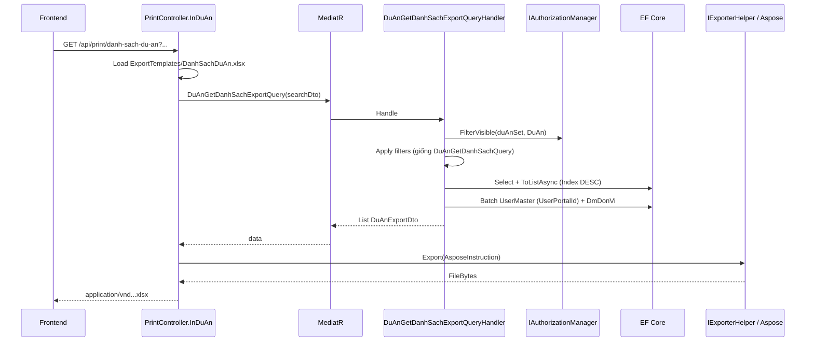

# Fix export Excel — Danh sách dự án

**Module:** QLDA / DuAn  
**Trạng thái:** ✅ **IMPLEMENTED**  
**Effort:** ~1–2 giờ (BE only, không migration)  
**Ngày:** 2026-07-08  
**Pattern:** `PrintController` + `DuAnGetDanhSachExportQuery` + Aspose + `QLDA.Gen`  
**Pattern tham chiếu:** `KeHoachTrienKhaiHangMucExportDescriptor` (layout `LetterheadExport`), `ToTrinhPheDuyetGetExportQuery` (lookup Lãnh đạo qua `UserPortalId`)

---

## 1. Tóm tắt

API `GET /api/print/danh-sach-du-an` export Excel danh sách dự án. Trước khi sửa, file tải về **mở được** nhưng lệch so với grid `GET /api/du-an/danh-sach` và format template cũ.

**Đã xử lý 4 nhóm vấn đề:**

| # | Vấn đề (trước) | Cách sửa (sau) |
|---|----------------|----------------|
| 1 | Có cột **Ngày bắt đầu** — UI không có | Xóa khỏi descriptor, DTO, query mapping; regen template |
| 2 | **Lãnh đạo phụ trách** sai tên | Lookup `UserMaster` theo `UserPortalId` (không phải `Id`) |
| 3 | Thứ tự dòng khác grid | Bỏ `OrderBy(TenDuAn)` — giữ sort `Index DESC` từ `GetQueryableSet()` |
| 4 | Template format cũ (`SimpleLetterheadExport`) | Chuyển sang `LetterheadExport` giống `KeHoachTrienKhaiHangMuc.xlsx` |

---

## 2. API & endpoint

### 2.1 Export Excel

| Thuộc tính | Giá trị |
|------------|---------|
| **Method** | `GET` |
| **URL** | `/api/print/danh-sach-du-an` |
| **Controller** | `PrintController.InDuAn` |
| **Query handler** | `DuAnGetDanhSachExportQuery` |
| **Export DTO** | `DuAnExportDto` |
| **Template** | `QLDA.WebApi/ExportTemplates/DanhSachDuAn.xlsx` |
| **Gen descriptor** | `QLDA.Gen/Descriptors/DanhSachDuAnExportDescriptor.cs` |
| **Gen slug** | `danh-sach-du-an` |
| **Layout** | `LetterheadExport` |
| **Engine** | `IExporterHelper` / Aspose |
| **Tên file tải** | `DanhSachDuAn_ddMMyyyy_HHmmss.xlsx` |

**Query params** (`DuAnPrintSearchDto` — cùng bộ filter với print tra cứu, không phân trang):

| Param | Kiểu | Ghi chú |
|-------|------|---------|
| `tenDuAn`, `maDuAn`, `globalFilter` | `string?` | Contains / search `TenDuAn` |
| `lanhDaoPhuTrachId` | `long?` | **UserPortalId** — `-1` = chưa gán |
| `donViPhuTrachChinhId` | `long?` | `-1` = null |
| `tuNgay` / `denNgay` / `namBatDau` | | Filter `NgayBatDau` — **chỉ lọc, không export cột** |
| `hiddenColumns` | `string[]?` | Ẩn cột động trên Excel |
| *(các filter khác)* | | Xem `DuAnPrintSearchDto.cs` |

> Export **toàn bộ** kết quả sau filter (không `pageIndex`/`pageSize`).

### 2.2 API grid (chuẩn so sánh)

| Method | URL |
|--------|-----|
| `GET` | `/api/du-an/danh-sach` |

Handler: `DuAnGetDanhSachQuery` → `PaginatedList<DuAnDto>`

---

## 3. Luồng xử lý (sau khi sửa)



---

## 4. Cột export (sau khi sửa)

### 4.1 Bảng cột — `DanhSachDuAnExportDescriptor`

Layout `LetterheadExport` — **10 cột**, không có Ngày bắt đầu:

| # | Field template | Header Excel | Align | Wrap | Format |
|---|----------------|--------------|-------|------|--------|
| 1 | `stt` | STT | Center | — | |
| 2 | `maDuAn` | Mã dự án | Center | — | |
| 3 | `tenDuAn` | Tên dự án | Left | ✅ | |
| 4 | `thoiGianKhoiCong` | Thời gian khởi công | Center | — | Năm KH |
| 5 | `lanhDaoPhuTrachId` | Lãnh đạo phụ trách | Left | ✅ | Tên `HoTen` |
| 6 | `donViPhuTrachChinhId` | Đơn vị phụ trách | Left | ✅ | `TenDonVi` |
| 7 | `donViPhoiHopIds` | Đơn vị phối hợp | Left | ✅ | Join `; ` |
| 8 | `hinhThucDauTuId` | Hình thức đầu tư | Left | ✅ | Nav `.Ten` |
| 9 | `hinhThucQuanLyDuAnId` | Hình thức quản lý | Left | ✅ | Nav `.Ten` |
| 10 | `tongMucDauTu` | Tổng mức đầu tư | Right | — | `#,##0` |

> Placeholder `lanhDaoPhuTrachId` trong template bind key camelCase; **giá trị** là tên lãnh đạo, không phải ID.

### 4.2 Cấu trúc template Excel (`LetterheadExport`)

Giống `KeHoachTrienKhaiHangMuc.xlsx`:

| Row | Nội dung |
|-----|----------|
| R1–R2 | Letterhead UBND / Cộng hòa (merge trái/phải) |
| R3 | Tiêu đề `DANH SÁCH DỰ ÁN` (merged, bold, 16pt) |
| R4 | Header bảng — nền xanh `#D9E1F2`, bold, border |
| R5 | Template row `$stt`, `$maDuAn`, … (Aspose bind tại đây) |

**Trước đây** dùng `SimpleLetterheadExport` (letterhead 1 dòng TT CĐS, header xám `#C8C8C8`).

---

## 5. Root cause (tham chiếu)

### 5.1 Lãnh đạo phụ trách sai

`DuAn.LanhDaoPhuTrachId` lưu **UserPortalId** (`DuAnSearchDto` XML). Code cũ join `UserMaster.Id` → tên trống hoặc sai.

**Đã sửa:**

```csharp
await userMasterSet
    .Where(u => u.UserPortalId.HasValue && lanhDaoIds.Contains(u.UserPortalId.Value))
    .Select(u => new { PortalId = u.UserPortalId!.Value, u.HoTen })
    .ToDictionaryAsync(u => u.PortalId, u => u.HoTen ?? string.Empty, cancellationToken);
```

Pattern tham chiếu: `ToTrinhPheDuyetGetExportQuery`.

### 5.2 Thứ tự dòng lệch

- Grid: `GetQueryableSet()` → `OrderByDescending(Index)` (mặc định repository)
- Export cũ: `.OrderBy(e => e.TenDuAn)` ghi đè → sort A→Z theo tên

**Đã sửa:** bỏ `OrderBy(TenDuAn)`, giữ thứ tự từ `GetQueryableSet()`.

### 5.3 Cột Ngày bắt đầu

Đã xóa ở descriptor, `DuAnExportDto`, projection/mapping trong query. Filter `tuNgay`/`denNgay`/`namBatDau` **vẫn giữ**.

---

## 6. Files đã sửa

| File | Thay đổi |
|------|----------|
| `QLDA.Gen/Descriptors/DanhSachDuAnExportDescriptor.cs` | Xóa `ngayBatDau`; `Layout = LetterheadExport`; thêm `ColumnAlign` + `wrapText` |
| `QLDA.Application/DuAns/DTOs/DuAnExportDto.cs` | Xóa `NgayBatDau` |
| `QLDA.Application/DuAns/Queries/DuAnGetDanhSachExportQuery.cs` | Bỏ `OrderBy(TenDuAn)`; fix `UserPortalId`; bỏ map `NgayBatDau` |
| `QLDA.WebApi/ExportTemplates/DanhSachDuAn.xlsx` | Regen qua `QLDA.Gen` |

**Không sửa:** `PrintController.cs`, migration, `PrintTemplates/DanhSachDuAnTraCuu.xlsx` (endpoint SP riêng).

---

## 7. Descriptor hiện tại (source of truth)

```csharp
public class DanhSachDuAnExportDescriptor : IExportDescriptor
{
    public string EntityName => "DanhSachDuAn";
    public string TemplateFileName => "DanhSachDuAn.xlsx";
    public string? Title => "DANH SÁCH DỰ ÁN";
    public TemplateLayoutType Layout => TemplateLayoutType.LetterheadExport;

    public List<ExportColumn> Columns { get; } =
    [
        new("stt",                   "STT",                   6, null, false, ColumnAlign.Center),
        new("maDuAn",                "Mã dự án",             12, null, false, ColumnAlign.Center),
        new("tenDuAn",               "Tên dự án",            42, null, true,  ColumnAlign.Left),
        new("thoiGianKhoiCong",      "Thời gian khởi công",  16, null, false, ColumnAlign.Center),
        new("lanhDaoPhuTrachId",     "Lãnh đạo phụ trách",   24, null, true,  ColumnAlign.Left),
        new("donViPhuTrachChinhId",  "Đơn vị phụ trách",     22, null, true,  ColumnAlign.Left),
        new("donViPhoiHopIds",       "Đơn vị phối hợp",      22, null, true,  ColumnAlign.Left),
        new("hinhThucDauTuId",       "Hình thức đầu tư",     20, null, true,  ColumnAlign.Left),
        new("hinhThucQuanLyDuAnId",  "Hình thức quản lý",    20, null, true,  ColumnAlign.Left),
        new("tongMucDauTu",          "Tổng mức đầu tư",      18, "#,##0", false, ColumnAlign.Right),
    ];
}
```

### Regen template

```bash
dotnet run --project QLDA.Gen -- danh-sach-du-an --force
```

- Output: `QLDA.WebApi/ExportTemplates/DanhSachDuAn.xlsx`
- **`--force`** bắt buộc nếu file đã tồn tại
- **Không sửa tay** `.xlsx` khi đã có descriptor

---

## 8. Chi tiết code đã implement

### 8.1 `DuAnExportDto.cs` (full)

```csharp
public class DuAnExportDto
{
    [JsonPropertyName("stt")] public int Stt { get; set; }
    [JsonPropertyName("maDuAn")] public string? MaDuAn { get; set; }
    [JsonPropertyName("tenDuAn")] public string? TenDuAn { get; set; }
    [JsonPropertyName("thoiGianKhoiCong")] public int? ThoiGianKhoiCong { get; set; }
    [JsonPropertyName("lanhDaoPhuTrachId")] public string? LanhDaoPhuTrach { get; set; }
    [JsonPropertyName("donViPhuTrachChinhId")] public string? DonViPhuTrachChinh { get; set; }
    [JsonPropertyName("donViPhoiHopIds")] public string? DonViPhoiHop { get; set; }
    [JsonPropertyName("hinhThucDauTuId")] public string? HinhThucDauTu { get; set; }
    [JsonPropertyName("hinhThucQuanLyDuAnId")] public string? HinhThucQuanLy { get; set; }
    [JsonPropertyName("tongMucDauTu")] public long? TongMucDauTu { get; set; }
}
```

### 8.2 `DuAnGetDanhSachExportQuery.cs` — các điểm chính

**Projection (không OrderBy, không NgayBatDau):**

```csharp
var rows = await queryable
    .Select(e => new
    {
        e.MaDuAn,
        e.TenDuAn,
        e.ThoiGianKhoiCong,
        e.TongMucDauTu,
        e.LanhDaoPhuTrachId,
        e.DonViPhuTrachChinhId,
        PhoiHopIds = e.DuAnChiuTrachNhiemXuLys!
            .Where(i => i.Loai == EChiuTrachNhiemXuLy.DonViPhoiHop)
            .Select(i => i.RightId)
            .ToList(),
        HinhThucDauTu = e.HinhThucDauTu != null ? e.HinhThucDauTu.Ten : null,
        HinhThucQuanLy = e.HinhThucQuanLy != null ? e.HinhThucQuanLy.Ten : null,
    })
    .ToListAsync(cancellationToken);
```

**Lookup Lãnh đạo:**

```csharp
var lanhDaoDict = lanhDaoIds.Count == 0
    ? new Dictionary<long, string>()
    : await userMasterSet
        .Where(u => u.UserPortalId.HasValue && lanhDaoIds.Contains(u.UserPortalId.Value))
        .Select(u => new { PortalId = u.UserPortalId!.Value, u.HoTen })
        .ToDictionaryAsync(u => u.PortalId, u => u.HoTen ?? string.Empty, cancellationToken);
```

### 8.3 `PrintController.InDuAn` — không đổi

```csharp
[HttpGet("api/print/danh-sach-du-an")]
public async Task<IActionResult> InDuAn([FromQuery] DuAnPrintSearchDto searchDto)
{
    var templatePath = Path.Combine(AppContext.BaseDirectory, "ExportTemplates", "DanhSachDuAn.xlsx");
    var data = await Mediator.Send(new DuAnGetDanhSachExportQuery(searchDto));
    var exportResult = _excelExporter.Export(new AsposeInstruction<DuAnExportDto>
    {
        TemplatePath = templatePath,
        Items = data,
        HiddenColumns = searchDto.HiddenColumns ?? [],
        AutoFitColumnsAndRows = false,
    });
    return new FileContentResult(exportResult.FileBytes, exportResult.ContentType)
    {
        FileDownloadName = GetDownloadFileName("DanhSachDuAn.xlsx")
    };
}
```

---

## 9. Build & deploy

```bash
# Regen template (khi đổi descriptor)
dotnet run --project QLDA.Gen -- danh-sach-du-an --force

# Build
dotnet build QLDA.WebApi/QLDA.WebApi.csproj
```

Template copy ra `bin/.../ExportTemplates/` khi build (`.csproj`: `<None Include="ExportTemplates\**\*.*">`).

> Nếu build báo file lock — stop process `QLDA.WebApi` đang chạy rồi build lại.

---

## 10. Test plan

### 10.1 Chuẩn bị

```http
GET /api/du-an/danh-sach?pageIndex=1&pageSize=50
GET /api/print/danh-sach-du-an
```

So sánh cùng bộ filter (export không có pagination).

### 10.2 Test cases

| ID | Kịch bản | Kỳ vọng |
|----|----------|---------|
| T1 | Export không filter | File mở OK; layout UBND + header xanh; **không** có cột Ngày bắt đầu |
| T2 | So sánh 10 dòng đầu grid vs Excel | Cùng thứ tự `maDuAn`/`tenDuAn` (Index DESC) |
| T3 | Dự án có `lanhDaoPhuTrachId` | Tên Excel = combobox UserMaster trên UI |
| T4 | `lanhDaoPhuTrachId` null | Cột Lãnh đạo trống |
| T5 | Filter `lanhDaoPhuTrachId={id}` | Subset khớp grid |
| T6 | Filter `tuNgay`/`denNgay` | Lọc đúng; không có cột Ngày bắt đầu trong file |
| T7 | Format so với KeHoachTrienKhaiHangMuc | Cùng letterhead UBND, header xanh, border |

### 10.3 Regression

- `GET /api/print/danh-sach-tra-cuu-du-an` — endpoint SP, không ảnh hưởng
- `GET /api/du-an/danh-sach` — behavior không đổi

---

## 11. Files map

```
QLDA.WebApi/
  Controllers/PrintController.cs
  ExportTemplates/DanhSachDuAn.xlsx          ← regen

QLDA.Application/DuAns/
  DTOs/DuAnExportDto.cs
  DTOs/DuAnPrintSearchDto.cs
  Queries/DuAnGetDanhSachExportQuery.cs      ← sửa chính
  Queries/DuAnGetDanhSachQuery.cs            ← sort chuẩn (tham chiếu)

QLDA.Gen/
  Descriptors/DanhSachDuAnExportDescriptor.cs ← layout + cột
  Program.cs                                  ← slug danh-sach-du-an
```

---

## 12. Acceptance criteria

- [x] Excel **không** còn cột **Ngày bắt đầu**
- [x] Cột **Lãnh đạo phụ trách** đúng tên (`UserPortalId` → `HoTen`)
- [x] Thứ tự dòng khớp grid (Index DESC)
- [x] Template format `LetterheadExport` giống `KeHoachTrienKhaiHangMuc.xlsx`
- [x] File Excel mở được, không lệch cột / placeholder
- [x] Build pass, không migration

---

## 13. Phương án mở rộng (chưa làm)

| Ý tưởng | Lý do hoãn |
|---------|------------|
| Tách `DuAnQueryableExtensions.ApplyDanhSachFilters` | Giảm duplicate filter giữa list + export |
| Sort động grid → export | Chưa có `sortField` trên `DuAnSearchDto` |
