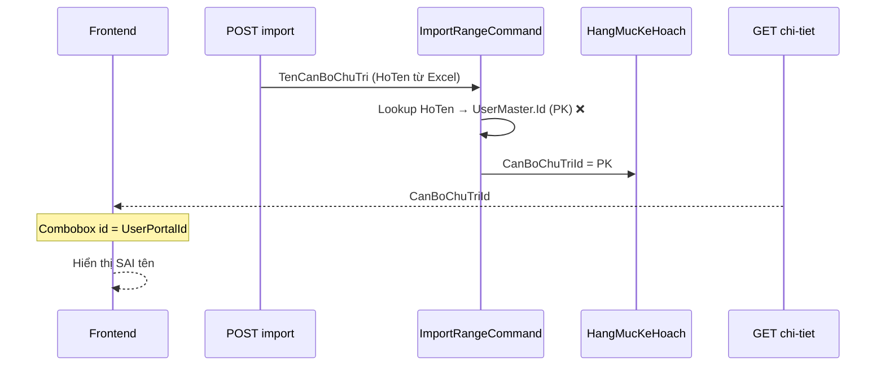
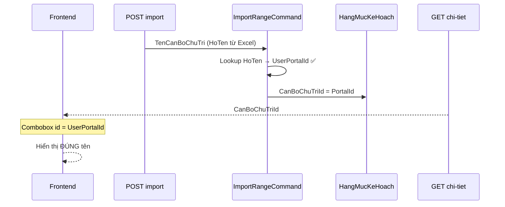

# Điều tra & fix — Import KH triển khai hạng mục map sai cán bộ

**Module:** QLDA  
**Trạng thái:** ✅ **IMPLEMENTED**  
**Effort thực tế:** ~1–2 giờ (BE + test, không migration)  
**Ngày:** 2026-07-08  
**API:** `POST /api/import/ke-hoach-trien-khai-hang-muc`

---

## Mục lục

1. [Triệu chứng & kỳ vọng](#1-triệu-chứng--kỳ-vọng)
2. [Luồng hệ thống](#2-luồng-hệ-thống)
3. [Checklist điều tra](#3-checklist-điều-tra)
4. [Root cause](#4-root-cause)
5. [Phát hiện phụ](#5-phát-hiện-phụ)
6. [Thay đổi đã implement](#6-thay-đổi-đã-implement)
7. [Test plan & kết quả](#7-test-plan--kết-quả)
8. [Checklist trước merge](#8-checklist-trước-merge)

---

## 1. Triệu chứng & kỳ vọng

### 1.1 Báo lỗi

Trong file Excel:

- Cán bộ chủ trì: `Đào Thị Bích Tuyền`
- Cán bộ phối hợp: `Đặng Trung Nghĩa`

Sau `POST /api/import/ke-hoach-trien-khai-hang-muc`, màn hình hiển thị:

- Cán bộ chủ trì: `Lê Trường Anh`
- Cán bộ phối hợp: `Võ Nguyễn Nhựt Minh`

### 1.2 Kỳ vọng

| Hành động | Kết quả |
|-----------|---------|
| Chọn `Đào Thị Bích Tuyền` trên Excel | UI hiển thị đúng `Đào Thị Bích Tuyền` |
| Chọn `Đặng Trung Nghĩa` trên Excel | UI hiển thị đúng `Đặng Trung Nghĩa` |
| Import lỗi (không tìm thấy tên) | Báo lỗi dòng — **không** fallback sang cán bộ khác |

### 1.3 Sau fix

Import mới lưu `UserPortalId` → UI combobox resolve đúng tên. Dữ liệu import **trước fix** vẫn có `UserMaster.Id` trong DB — cần **re-import** hoặc sửa tay.

---

## 2. Luồng hệ thống

### 2.1 Trước fix



### 2.2 Sau fix



**Điểm mấu chốt:** Import resolve đúng tên từ Excel, nhưng trước đây lưu **sai loại ID** so với convention UI.

---

## 3. Checklist điều tra

### 3.1 DTO import Excel — cột cán bộ

**File:** `QLDA.Application/KeHoachTrienKhaiHangMuc/DTOs/KeHoachTrienKhaiHangMucImportDto.cs`

| # | Header Excel | Property DTO | Index (0-based) | Khớp? |
|---|-------------|--------------|-----------------|-------|
| 6 | Cán bộ chủ trì | `TenCanBoChuTri` | 5 | ✅ |
| 7 | Cán bộ phối hợp | `TenCanBoPhoiHop` | 6 | ✅ |

→ Không lệch index cột — **không phải nguyên nhân chính**.

### 3.2 Cơ chế đọc Excel

`ExcelImporter.ReadDataFromExcel` map theo **thứ tự property** trong DTO, không theo header `[Description]`. Hiện tại 11 property khớp 11 cột → OK. Rủi ro tái phát nếu refactor DTO (long-term).

### 3.3 Logic map cán bộ

| Kiểm tra | Kết quả |
|----------|---------|
| Lấy theo index dropdown | ❌ Không — đọc text cell, lookup `HoTen` |
| Fallback item đầu tiên | ❌ Không — lỗi `"Không tìm thấy cán bộ"` |
| Trim + ignore case | ✅ |
| Trùng HoTen trong đơn vị | ✅ Lỗi `"trùng tên"` |

### 3.4 Nguồn danh sách cán bộ (sau fix)

| Nguồn | Filter | `Id` trả về |
|-------|--------|-------------|
| Template query | `LaDonViChinh`, `DonViId`, `UserPortalId != null` | `UserPortalId` ✅ |
| Import command | Cùng filter | Lưu `UserPortalId` ✅ |
| UI combobox | `DonViId` (optional) | `UserPortalId` ✅ |

---

## 4. Root cause

### 4.1 Mô tả

`HangMucKeHoach.CanBoChuTriId` / `CanBoPhoiHopIds` trên UI là **`UserPortalId`**, nhưng import cũ lưu **`UserMaster.Id`** (PK).

```text
UserMaster
├── Id            ← PK (import CŨ lưu cái này)
├── UserPortalId  ← ID portal / JWT (UI combobox dùng cái này)
└── HoTen         ← text trong Excel dropdown
```

### 4.2 Vì sao hiển thị sai tên?

1. User chọn `Đào Thị Bích Tuyền` → cell = `"Đào Thị Bích Tuyền"`.
2. Import lookup đúng user → lấy `UserMaster.Id = X` → lưu `CanBoChuTriId = X`.
3. FE combobox `items.find(i => i.id === X)` — `id` = **`UserPortalId`**.
4. Trùng khớp ngẫu nhiên với user khác → hiển thị `Lê Trường Anh`.

Cùng pattern đã fix ở export danh sách dự án (`docs/issues/danh-sach-du-an-export-excel/report.md`).

### 4.3 Code cũ (trước fix)

```csharp
// TRƯỚC
.Select(e => new UserImportLookup(e.Id, e.HoTen!, e.DonViId))
CanBoChuTriId = chuTriUser.Id;
```

**UI combobox chuẩn project:**

```16:22:BuildingBlocks/src/BuildingBlocks.Application/UserMasters/Handlers/UserMasterGetComboboxQueryHandler.cs
        .Select(e => new UserMasterDto
        {
            Id = e.UserPortalId ?? 0,
            Ten = e.HoTen,
```

### 4.4 Spec cũ ghi nhầm

`docs/feature/KeHoachTrienKhaiHangMuc/IMPLEMENTATION_GUIDE.md` ghi `CanBoChuTriId = UserMaster.Id` — convention thực tế là **`UserPortalId`**. Cần cập nhật (pending).

---

## 5. Phát hiện phụ

### 5.1 Export lệch với dữ liệu nhập tay — **đã fix**

Export cũ lookup `u.Id` → dữ liệu nhập tay (PortalId) không ra tên. Đã đồng bộ lookup `UserPortalId`.

### 5.2 Filter đơn vị — **đã đồng bộ**

Import bỏ điều kiện thừa `DonViCapChaId != null`, khớp template query:

```csharp
.WhereIf(donViId > 0, e => e.DonViCapChaId == donViId)
```

### 5.3 `ReadDataFromExcel` fragile

Map theo index property — long-term nên cân nhắc map theo `[Description]`. **Ngoài phạm vi fix này.**

### 5.4 Dữ liệu legacy

Bản ghi import **trước fix** vẫn chứa `UserMaster.Id` → UI vẫn sai cho đến khi re-import hoặc sửa DB.

---

## 6. Thay đổi đã implement

### 6.1 Import — lưu `UserPortalId`

**File:** `KeHoachTrienKhaiHangMucImportRangeCommand.cs`

```80:87:QLDA.Application/KeHoachTrienKhaiHangMuc/Commands/KeHoachTrienKhaiHangMucImportRangeCommand.cs
        var usersInDonVi = await _userRepo.GetQueryableSet()
            .AsNoTracking()
            .Where(e => e.LaDonViChinh == true)
            .WhereIf(donViId > 0, e => e.DonViId == donViId)
            .Where(e => e.HoTen != null && e.HoTen != "")
            .Where(e => e.UserPortalId != null)
            .Select(e => new UserImportLookup(e.UserPortalId!.Value, e.HoTen!, e.DonViId))
            .ToListAsync(cancellationToken);
```

```172:180:QLDA.Application/KeHoachTrienKhaiHangMuc/Commands/KeHoachTrienKhaiHangMucImportRangeCommand.cs
            validRows.Add(new ValidatedImportRow(
                item,
                duAnId,
                buocId,
                giaiDoanId,
                donViChuTriId,
                chuTriUser.PortalId,
                donViPhoiHopIds,
                canBoPhoiHopIds));
```

```376:376:QLDA.Application/KeHoachTrienKhaiHangMuc/Commands/KeHoachTrienKhaiHangMucImportRangeCommand.cs
    private sealed record UserImportLookup(long PortalId, string HoTen, long? DonViId);
```

- User không có `UserPortalId` → **loại khỏi danh sách lookup** (không fallback user khác).
- `TryResolveUsersMulti` resolve → `user.PortalId`.

### 6.2 Export — lookup `UserPortalId`

**File:** `KeHoachTrienKhaiHangMucExportMappings.cs`

```85:91:QLDA.Application/KeHoachTrienKhaiHangMuc/KeHoachTrienKhaiHangMucExportMappings.cs
        // CanBoChuTriId / CanBoPhoiHopIds store UserPortalId (same as UI combobox).
        var users = userIds.Count == 0
            ? []
            : await userRepo.GetQueryableSet(OnlyUsed: false, OnlyNotDeleted: false)
                .AsNoTracking()
                .Where(u => u.UserPortalId.HasValue && userIds.Contains(u.UserPortalId.Value))
                .Select(u => new { PortalId = u.UserPortalId!.Value, u.HoTen })
```

### 6.3 Template query — combo cán bộ

**File:** `KeHoachTrienKhaiHangMucGetImportTemplateQuery.cs`

```72:77:QLDA.Application/KeHoachTrienKhaiHangMuc/Queries/KeHoachTrienKhaiHangMucGetImportTemplateQuery.cs
            .Where(e => e.UserPortalId != null)
            .OrderBy(e => e.HoTen)
            .Select(e => new ComboData {
                Name = e.HoTen!,
                Id = e.UserPortalId!.Value.ToString(),
            })
```

> Dropdown Excel vẫn lưu **Name** (`HoTen`) vào cell khi user chọn — `ComboData.Id` chỉ để nhất quán convention.

### 6.4 Files đã thay đổi

| # | File | Thay đổi |
|---|------|----------|
| 1 | `KeHoachTrienKhaiHangMucImportRangeCommand.cs` | Lưu `UserPortalId`; filter user/đơn vị |
| 2 | `KeHoachTrienKhaiHangMucExportMappings.cs` | Lookup `UserPortalId` |
| 3 | `KeHoachTrienKhaiHangMucGetImportTemplateQuery.cs` | `ComboData.Id = UserPortalId` |
| 4 | `KeHoachTrienKhaiHangMucImportCommandTests.cs` | Integration test |
| 5 | `KeHoachTrienKhaiHangMucExportMappingsTests.cs` | Unit test `ToExportRows_ResolvesCanBoByUserPortalId` |

**Không cần:** migration, đổi entity, regen template xlsx.

### 6.5 Diff tóm tắt

```diff
// ImportRangeCommand.cs
- new UserImportLookup(e.Id, e.HoTen!, e.DonViId)
+ .Where(e => e.UserPortalId != null)
+ new UserImportLookup(e.UserPortalId!.Value, e.HoTen!, e.DonViId)
- chuTriUser.Id
+ chuTriUser.PortalId

// ExportMappings.cs
- .Where(u => userIds.Contains(u.Id))
+ .Where(u => u.UserPortalId.HasValue && userIds.Contains(u.UserPortalId.Value))

// GetImportTemplateQuery.cs
- Id = e.Id.ToString()
+ Id = e.UserPortalId!.Value.ToString()
```

---

## 7. Test plan & kết quả

| # | Case | Cách test | Kỳ vọng | Kết quả |
|---|------|-----------|---------|---------|
| T1 | Import chủ trì = Tuyền | Integration test | `CanBoChuTriId == PortalId` | ✅ |
| T2 | Import phối hợp = Nghĩa | Integration test | `CanBoPhoiHopIds[0] == PortalId` | ✅ |
| T3 | Không lưu PK | Assert `NotBe(chuTriMasterId)` | PortalId ≠ MasterId | ✅ |
| T4 | Export resolve PortalId | Unit test | Tên `Đào Thị Bích Tuyền` | ✅ |
| T5 | Tên không tồn tại | Manual | Lỗi dòng | ⏳ Manual |
| T6 | Nhập tay form + export | Regression | Tên đúng | ⏳ Manual |

### 7.1 Lệnh chạy test

```bash
dotnet build QLDA.Tests/QLDA.Tests.csproj -p:BuildProjectReferences=false
dotnet test QLDA.Tests/QLDA.Tests.csproj \
  --filter "FullyQualifiedName~KeHoachTrienKhaiHangMucImport|FullyQualifiedName~KeHoachTrienKhaiHangMucExportMappings" \
  --no-build
```

**Kết quả:** `Passed! — Failed: 0, Passed: 8`

| Test class | Tests |
|------------|-------|
| `KeHoachTrienKhaiHangMucImportCommandTests` | `Import_StoresCanBoIdsAsUserPortalId_NotUserMasterPk` |
| `KeHoachTrienKhaiHangMucExportMappingsTests` | `ToExportRows_ResolvesCanBoByUserPortalId` + 2 tests sort |

> Integration test dùng raw SQL tạo `DM_DONVI` / `USER_MASTER` (legacy tables, excluded from migrations).

### 7.2 SQL kiểm tra nhanh (dev)

```sql
SELECT h.CanBoChuTriId, u.Id AS UserMasterId, u.UserPortalId, u.HoTen
FROM HangMucKeHoach h
JOIN USER_MASTER u ON u.HoTen = N'Đào Thị Bích Tuyền'
WHERE h.CanBoChuTriId IS NOT NULL
ORDER BY h.CreatedAt DESC;
-- Sau fix: CanBoChuTriId = u.UserPortalId (≠ u.Id nếu hai cột khác nhau)
```

### 7.3 Manual test

1. Tải template `GET /api/import/ke-hoach-trien-khai-hang-muc/template`
2. Chọn cán bộ Tuyền / Nghĩa trên Excel
3. `POST /api/import/ke-hoach-trien-khai-hang-muc`
4. Mở màn hình chi tiết → tên khớp Excel

---

## 8. Checklist trước merge

- [x] Import lưu `UserPortalId` (không fallback user khác)
- [x] Export lookup `UserPortalId`
- [x] Template combo `UserPortalId`
- [x] Integration test assert đúng PortalId
- [x] Unit test export PortalId
- [x] `dotnet test` filter import/export pass (8/8)
- [ ] Manual: Excel chọn Tuyền / Nghĩa → UI hiển thị đúng
- [ ] Cập nhật `IMPLEMENTATION_GUIDE.md` — `CanBoChuTriId = UserPortalId`
- [ ] Re-import / sửa dữ liệu legacy (nếu có)

---

## Phụ lục — Bảng cột import (tham chiếu)

| # | Header Excel | Property DTO | Combo |
|---|-------------|--------------|-------|
| 1 | Dự án | `TenDuAn` | $cbo1 |
| 2 | Tên hạng mục | `TenHangMuc` | — |
| 3 | Giai đoạn | `TenGiaiDoan` | $cbo2 |
| 4 | Đơn vị chủ trì | `TenDonViChuTri` | $cbo3 |
| 5 | Đơn vị phối hợp | `TenDonViPhoiHop` | $cbo5 |
| 6 | Cán bộ chủ trì | `TenCanBoChuTri` | $cbo4 |
| 7 | Cán bộ phối hợp | `TenCanBoPhoiHop` | $cbo6 |
| 8 | Ngày bắt đầu | `NgayBatDau` | — |
| 9 | Ngày kết thúc | `NgayKetThuc` | — |
| 10 | Kinh phí | `KinhPhi` | — |
| 11 | Thời hạn hoàn thành | `ThoiHan` | — |

---

*Cập nhật sau implement — July 8, 2026.*
