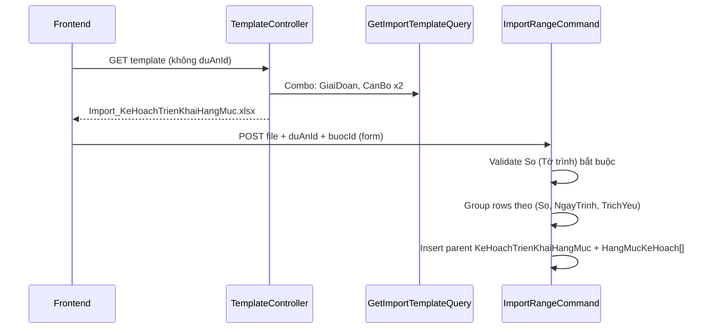

# Spec kỹ thuật — Template import KH hạng mục & filter dashboard theo giai đoạn

**Module:** QLDA  
**Trạng thái:** Điều tra xong — sẵn sàng implement  
**Effort ước lượng:** ~4–6 giờ (BE only, không migration)  
**Ngày:** 2026-06-30  
**Pattern tham chiếu:** `PhanKhaiKinhPhiImportDescriptor`, `KeHoachTrienKhaiHangMucExportDescriptor`, `DuAnGetDanhSachQuery`, `TheoDoiDuAnPhongPhanCongQuery`

---

## Mục lục

1. [Phần I — Template import](#phần-i--template-import-kế-hoạch-triển-khai-hạng-mục)
2. [Phần I — Bước code chi tiết (Bước 1–8)](#111-bước-code-chi-tiết--phần-i)
3. [Phần II — Filter API theo dõi theo giai đoạn](#phần-ii--bổ-sung-filter-api-theo-dõi-theo-giai-doan)
4. [Phần II — Bước code chi tiết (Bước 9–10)](#29-bước-code-chi-tiết--phần-ii)
5. [Test plan](#test-plan)
6. [Checklist trước merge](#checklist-trước-merge)
7. [Thứ tự commit đề xuất](#thứ-tự-commit-đề-xuất)

---


# Phần I — Template import Kế hoạch triển khai hạng mục


## 1.1 Tóm tắt nghiệp vụ

Màn **Quản lý hạng mục triển khai** cho phép tải file mẫu Excel và import danh sách hạng mục công việc (`HangMucKeHoach`).

**Thay đổi so với implement #9469 (26/06/2026):**

- Mỗi dòng Excel = **một hạng mục** — **không** còn nhập thông tin tờ trình trên Excel.
- Bổ sung cột **Dự án**, **Đơn vị chủ trì**, **Đơn vị phối hợp** (nhiều), nâng cấp **Cán bộ phối hợp** (nhiều).
- Cấu trúc cột import **đồng bộ** với export `KeHoachTrienKhaiHangMuc.xlsx` (trừ STT và nhóm giai đoạn).


## 1.2 API liên quan


| #     | Method | URL                                                 | Vai trò                                   |
| ----- | ------ | --------------------------------------------------- | ----------------------------------------- |
| API 1 | `GET`  | `/api/template/import-ke-hoach-trien-khai-hang-muc` | Tải mẫu + fill dropdown                   |
| —     | `POST` | `/api/import/ke-hoach-trien-khai-hang-muc`          | Upload Excel (`file`, `duAnId`, `buocId`) |


**URL kiểm tra (IIS):**

```http
GET /QuanLyDuAn/api/template/import-ke-hoach-trien-khai-hang-muc?duAnId=08ded5f5-3b4e-5676-687a-7b278006675e
```


## 1.3 So sánh cột — hiện tại vs mong muốn


### Template hiện tại (11 cột — SAI)


| #   | Header              | Combo   | Ghi chú                 |
| --- | ------------------- | ------- | ----------------------- |
| 1   | Tên hạng mục        | —       | ✅ Giữ                   |
| 2   | Giai đoạn           | `$cbo1` | ✅ Giữ (đổi index combo) |
| 3   | Cán bộ chủ trì      | `$cbo2` | ✅ Giữ                   |
| 4   | Cán bộ phối hợp     | `$cbo3` | ⚠️ Chỉ 1 người          |
| 5   | Ngày bắt đầu        | —       | ✅ Giữ                   |
| 6   | Ngày kết thúc       | —       | ✅ Giữ                   |
| 7   | Kinh phí            | —       | ✅ Giữ                   |
| 8   | Thời hạn hoàn thành | —       | ✅ Giữ                   |
| 9   | **Tờ trình**        | —       | ❌ **Bỏ**                |
| 10  | **Ngày trình**      | —       | ❌ **Bỏ**                |
| 11  | **Trích yếu**       | —       | ❌ **Bỏ**                |


**File:** `QLDA.Gen/Descriptors/KeHoachTrienKhaiHangMucImportDescriptor.cs`

### Template mới đề xuất (12 cột)


| #   | Header Excel        | Bắt buộc | Combo   | Map entity / field                                     |
| --- | ------------------- | -------- | ------- | ------------------------------------------------------ |
| 1   | **Dự án**           | ✅        | `$cbo1` | `KeHoachTrienKhaiHangMuc.DuAnId` — chọn `DuAn.TenDuAn` |
| 2   | Tên hạng mục        | ✅        | —       | `HangMucKeHoach.TenHangMuc`                            |
| 3   | Giai đoạn           | ✅        | `$cbo2` | `HangMucKeHoach.GiaiDoanId`                            |
| 4   | **Đơn vị chủ trì**  | ✅        | `$cbo3` | `HangMucKeHoach.DonViChuTriId` → `DmDonVi`             |
| 5   | **Đơn vị phối hợp** | ❌        | — *     | `HangMucKeHoach.DonViPhoiHopIds` (`List<long>`)        |
| 6   | Cán bộ chủ trì      | ✅        | `$cbo4` | `HangMucKeHoach.CanBoChuTriId`                         |
| 7   | Cán bộ phối hợp     | ❌        | — *     | `HangMucKeHoach.CanBoPhoiHopIds` (`List<long>`)        |
| 8   | Ngày bắt đầu        | ❌        | —       | `HangMucKeHoach.NgayBatDau`                            |
| 9   | Ngày kết thúc       | ❌        | —       | `HangMucKeHoach.NgayKetThuc`                           |
| 10  | Kinh phí            | ❌        | —       | `HangMucKeHoach.KinhPhi`                               |
| 11  | Thời hạn hoàn thành | ❌        | —       | `HangMucKeHoach.ThoiHan` (`DateOnly?`)                 |


 **Multi-value:** Excel Data Validation chỉ chọn **một** giá trị/lần. Cột phối hợp dùng **text tự do**, nhiều giá trị cách nhau `", "` (đồng bộ `KeHoachTrienKhaiHangMucExportMapper.JoinNames`). Description row ghi rõ: *"Nhập nhiều giá trị, cách nhau dấu phẩy"*.

> **Lưu ý:** Export hiển thị `ThoiHan` là **số ngày** tính từ ngày bắt đầu/kết thúc; import vẫn theo **entity** — nhập ngày `dd/MM/yyyy`.


### Đối chiếu export (chuẩn hiển thị)

`KeHoachTrienKhaiHangMucExportDescriptor` đã có: Giai đoạn, Hạng mục, **Đơn vị chủ trì**, **Đơn vị phối hợp**, Cán bộ chủ trì, **Cán bộ phối hợp**, ngày, kinh phí — **không** có Tờ trình / Ngày trình / Trích yếu ở cấp hạng mục.

## 1.4 Luồng xử lý hiện tại vs đề xuất


### Hiện tại




### Đề xuất

```mermaid
sequenceDiagram
    participant FE as Frontend
    participant TC as TemplateController
    participant Q as GetImportTemplateQuery
    participant IC as ImportRangeCommand

    FE->>TC: GET template?duAnId=...
    TC->>Q: Combo: DuAn, GiaiDoan, DonVi, CanBo
    TC-->>FE: xlsx 11 cột mới

    FE->>IC: POST file + buocId (form)
    Note over IC: duAnId: ưu tiên cột Excel; fallback form
    IC->>IC: Không validate So / TrichYeu
    IC->>IC: 1 parent / (DuAnId + buocId) hoặc 1 parent / import batch
    IC->>IC: Map DonViChuTriId, DonViPhoiHopIds[], CanBoPhoiHopIds[]
```


### Quyết định nghiệp vụ cần chốt khi implement


| Câu hỏi                                                        | Đề xuất kỹ thuật                                                      | Ghi chú                                       |
| -------------------------------------------------------------- | --------------------------------------------------------------------- | --------------------------------------------- |
| Parent `KeHoachTrienKhaiHangMuc.So` khi không có cột Tờ trình? | Để `null` hoặc auto `"Import {dd/MM/yyyy}"`                           | Entity `So` có thể nullable — **xác nhận BA** |
| Một file nhiều dự án (cột Dự án khác nhau)?                    | Group theo `DuAnId` từ Excel → **1 parent / dự án / lần import**      | Giống `PhanKhaiKinhPhi`                       |
| `duAnId` form POST vs cột Excel?                               | **Ưu tiên cột Excel**; nếu cột trống → dùng form; mismatch → lỗi dòng | FE vẫn gửi `buocId` qua form (tab tiến độ)    |
| `duAnId` trên GET template?                                    | Lọc danh sách `$cbo1`; nếu có 1 dự án → pre-fill combo                | Pattern `GetBaoCaoTienDo`                     |


## 1.5 Entity & mapping (đã có sẵn)

```text
KeHoachTrienKhaiHangMuc (parent)
├── DuAnId, BuocId
├── So, NgayToTrinh, TrichYeu     ← không còn từ Excel
├── TrangThaiId                   ← auto Dự thảo khi insert
└── DanhSachHangMuc[] → HangMucKeHoach
    ├── TenHangMuc, GiaiDoanId
    ├── DonViChuTriId             ← MỚI trên import
    ├── DonViPhoiHopIds           ← List<long>, multi
    ├── CanBoChuTriId
    ├── CanBoPhoiHopIds           ← List<long>, multi (hiện chỉ 1)
    ├── NgayBatDau, NgayKetThuc, ThoiHan, KinhPhi
```

**File tham chiếu:**


| Thành phần          | Vị trí                                                                  |
| ------------------- | ----------------------------------------------------------------------- |
| Entity child        | `QLDA.Domain/Entities/HangMucKeHoach.cs`                                |
| Import DTO          | `QLDA.Application/.../KeHoachTrienKhaiHangMucImportDto.cs`              |
| Import command      | `QLDA.Application/.../KeHoachTrienKhaiHangMucImportRangeCommand.cs`     |
| Template query      | `QLDA.Application/.../KeHoachTrienKhaiHangMucGetImportTemplateQuery.cs` |
| Gen descriptor      | `QLDA.Gen/Descriptors/KeHoachTrienKhaiHangMucImportDescriptor.cs`       |
| Controller template | `QLDA.WebApi/Controllers/TemplateController.cs` (~243)                  |
| Controller import   | `QLDA.WebApi/Controllers/ImportController.cs` (~124)                    |


## 1.6 Combo sheet — `KeHoachTrienKhaiHangMucGetImportTemplateQuery`


### Hiện tại

```csharp
return [danhSachGiaiDoan, danhSachCanBo, danhSachCanBo];
// $cbo1 = Giai đoạn, $cbo2/$cbo3 = Cán bộ (cùng list theo DonVi user)
```


### Đề xuất


| Combo   | Nguồn                                              | Ghi chú                                |
| ------- | -------------------------------------------------- | -------------------------------------- |
| `$cbo1` | `DuAn` visible (`FilterVisible` hoặc `!IsDeleted`) | `WhereIf(duAnId, e => e.Id == duAnId)` |
| `$cbo2` | `DanhMucGiaiDoan`                                  | Giữ nguyên                             |
| `$cbo3` | `DmDonVi`                                          | `TenDonVi`; scope theo quyền nếu cần   |
| `$cbo4` | `UserMaster` (`LaDonViChinh`, lọc `DonViId` user)  | Giữ rule Case 2 #9469                  |


**Signature mới:**

```csharp
public record KeHoachTrienKhaiHangMucGetImportTemplateQuery(Guid? DuAnId = null)
    : IRequest<List<List<ComboData>>>;
```

**Controller:**

```csharp
public async Task<FileContentResult> GetImportKeHoachTrienKhaiHangMuc(
    [FromQuery] Guid? duAnId = null,
    CancellationToken cancellationToken = default)
{
    var comboData = await Mediator.Send(
        new KeHoachTrienKhaiHangMucGetImportTemplateQuery(duAnId),
        cancellationToken);
    // ...
}
```


## 1.7 Import DTO — thay đổi

```csharp
public class KeHoachTrienKhaiHangMucImportDto
{
    [Required][Description("Dự án")]
    public string? TenDuAn { get; set; }

    [Required][Description("Tên hạng mục")]
    public string? TenHangMuc { get; set; }

    [Required][Description("Giai đoạn")]
    public string? TenGiaiDoan { get; set; }

    [Required][Description("Đơn vị chủ trì")]
    public string? TenDonViChuTri { get; set; }

    [Description("Đơn vị phối hợp")]
    public string? TenDonViPhoiHop { get; set; }   // "Đơn vị A, Đơn vị B"

    [Required][Description("Cán bộ chủ trì")]
    public string? TenCanBoChuTri { get; set; }

    [Description("Cán bộ phối hợp")]
    public string? TenCanBoPhoiHop { get; set; }   // "Nguyễn A, Trần B"

    // NgayBatDau, NgayKetThuc, KinhPhi, ThoiHan — giữ nguyên

    // ❌ XÓA: So, NgayTrinh, TrichYeu
}
```


## 1.8 Import command — logic mới


### Bỏ

- Validation `So` (Tờ trình) bắt buộc (dòng 115–118 hiện tại).
- `GroupBy(ParentKey(So, NgayTrinh, TrichYeu))`.
- Suy `DonViPhoiHopIds` từ đơn vị của cán bộ phối hợp (chỉ khi BA muốn độc lập cột Đơn vị phối hợp).


### Thêm

**Resolve Dự án:**

```csharp
// Lookup DuAn by TenDuAn (trim, ignore case)
// Error nếu không tìm thấy / trùng tên không phân biệt được
```

**Resolve Đơn vị chủ trì:**

```csharp
// Map TenDonViChuTri → DmDonVi.Id (trim, ignore case)
```

**Resolve multi Đơn vị / Cán bộ phối hợp:**

```csharp
private static List<string> SplitMulti(string? raw) =>
    string.IsNullOrWhiteSpace(raw)
        ? []
        : raw.Split(',', StringSplitOptions.RemoveEmptyEntries | StringSplitOptions.TrimEntries)
             .Where(s => s.Length > 0)
             .ToList();

// Với mỗi token:
// - DonVi: lookup DmDonVi; lỗi nếu không tìm thấy / trùng tên
// - CanBo: TryResolveUser từng token; lỗi nếu 1 token fail
// - Trùng tên cán bộ: giữ rule "Cán bộ không xác định (trùng tên)"
```

**Group parent:**

```csharp
// Đề xuất: group valid rows theo DuAnId (từ Excel)
// Mỗi group → 1 KeHoachTrienKhaiHangMuc:
//   DuAnId = group.Key
//   BuocId = request.BuocId
//   So = null (hoặc auto)
//   TrangThaiId = Dự thảo
//   DanhSachHangMuc = các dòng trong group
```

`IsEmptyRow`**:** cập nhật bỏ check `So`, `NgayTrinh`, `TrichYeu`; thêm field mới.

## 1.9 QLDA.Gen — regen template

```powershell
cd e:\SER\QLDA.Gen
dotnet run -- import-ke-hoach-trien-khai-hang-muc --force ../QLDA.WebApi/PrintTemplates
```

Commit file: `QLDA.WebApi/PrintTemplates/Import_KeHoachTrienKhaiHangMuc.xlsx`

## 1.10 Files cần sửa (Phần I)


| #   | File                                                              | Việc làm                             |
| --- | ----------------------------------------------------------------- | ------------------------------------ |
| 1   | `QLDA.Gen/Descriptors/KeHoachTrienKhaiHangMucImportDescriptor.cs` | 11 cột mới, bỏ Tờ trình              |
| 2   | `QLDA.WebApi/PrintTemplates/Import_KeHoachTrienKhaiHangMuc.xlsx`  | Regen                                |
| 3   | `KeHoachTrienKhaiHangMucGetImportTemplateQuery.cs`                | +DuAn, DmDonVi combos; nhận `DuAnId` |
| 4   | `TemplateController.cs`                                           | `[FromQuery] Guid? duAnId`           |
| 5   | `KeHoachTrienKhaiHangMucImportDto.cs`                             | Cột mới, xóa tờ trình                |
| 6   | `KeHoachTrienKhaiHangMucImportRangeCommand.cs`                    | Logic map + group mới                |
| 7   | `KeHoachTrienKhaiHangMucImportTests.cs`                           | Assert số cột / import hợp lệ        |
| 8   | `docs/feature/KeHoachTrienKhaiHangMuc/IMPLEMENTATION_GUIDE.md`    | Cập nhật spec cột (sau implement)    |


**Không cần:** migration, WebApi model mới (`CLAUDE.md`).

---


## 1.11 Bước code chi tiết — Phần I

> Thứ tự implement: **Descriptor → regen xlsx → DTO → Template Query → Controller → Import Command → Test → Build**.


### Bước 1 — Sửa `KeHoachTrienKhaiHangMucImportDescriptor`

**File:** `QLDA.Gen/Descriptors/KeHoachTrienKhaiHangMucImportDescriptor.cs`

**Thay toàn bộ** `HintText` + `Columns`:

```csharp
public string? HintText =>
    "Nhập dữ liệu vào bảng bên dưới. Dự án / Giai đoạn / Đơn vị / Cán bộ chọn từ danh sách. "
    + "Đơn vị phối hợp và Cán bộ phối hợp: nhập nhiều giá trị, cách nhau dấu phẩy. Ngày nhập dd/MM/yyyy.";

public List<ImportColumn> Columns { get; } =
[
    new() { Header = "Dự án", Description = "Chọn từ danh sách", Placeholder = "$cbo1", ComboIndex = 1, Width = 40,
        HorizontalAlign = ColumnAlign.Left, WrapText = true, Required = true },
    new() { Header = "Tên hạng mục", Description = "Bắt buộc", Width = 40,
        HorizontalAlign = ColumnAlign.Left, WrapText = true, Required = true },
    new() { Header = "Giai đoạn", Description = "Chọn từ danh mục", Placeholder = "$cbo2", ComboIndex = 2, Width = 22,
        HorizontalAlign = ColumnAlign.Left, Required = true },
    new() { Header = "Đơn vị chủ trì", Description = "Chọn từ danh sách", Placeholder = "$cbo3", ComboIndex = 3, Width = 28,
        HorizontalAlign = ColumnAlign.Left, WrapText = true, Required = true },
    new() { Header = "Đơn vị phối hợp", Description = "Tùy chọn — nhiều giá trị, cách nhau dấu phẩy", Width = 32,
        HorizontalAlign = ColumnAlign.Left, WrapText = true },
    new() { Header = "Cán bộ chủ trì", Description = "Chọn từ danh sách", Placeholder = "$cbo4", ComboIndex = 4, Width = 28,
        HorizontalAlign = ColumnAlign.Left, WrapText = true, Required = true },
    new() { Header = "Cán bộ phối hợp", Description = "Tùy chọn — nhiều giá trị, cách nhau dấu phẩy", Width = 32,
        HorizontalAlign = ColumnAlign.Left, WrapText = true },
    new() { Header = "Ngày bắt đầu", Description = "dd/MM/yyyy", NumberFormat = "dd/MM/yyyy", Width = 16,
        HorizontalAlign = ColumnAlign.Center },
    new() { Header = "Ngày kết thúc", Description = "dd/MM/yyyy", NumberFormat = "dd/MM/yyyy", Width = 16,
        HorizontalAlign = ColumnAlign.Center },
    new() { Header = "Kinh phí", Description = "Số ≥ 0 (đồng)", NumberFormat = "#,##0", Width = 18,
        HorizontalAlign = ColumnAlign.Right },
    new() { Header = "Thời hạn hoàn thành", Description = "dd/MM/yyyy", NumberFormat = "dd/MM/yyyy", Width = 16,
        HorizontalAlign = ColumnAlign.Center },
];
```

> **Lưu ý:** `$cbo1`–`$cbo4` phải khớp thứ tự list trả về từ `GetImportTemplateQuery` (Bước 4).

---


### Bước 2 — Regen file Excel template

```powershell
cd e:\SER\QLDA.Gen
dotnet run -- import-ke-hoach-trien-khai-hang-muc --force ../QLDA.WebApi/PrintTemplates
```

**Verify:** Mở `QLDA.WebApi/PrintTemplates/Import_KeHoachTrienKhaiHangMuc.xlsx` — sheet 1 có **11 cột**, không còn Tờ trình / Ngày trình / Trích yếu.

---


### Bước 3 — Sửa `KeHoachTrienKhaiHangMucImportDto`

**File:** `QLDA.Application/KeHoachTrienKhaiHangMuc/DTOs/KeHoachTrienKhaiHangMucImportDto.cs`

```csharp
public class KeHoachTrienKhaiHangMucImportDto
{
    [Required]
    [Description("Dự án")]
    public string? TenDuAn { get; set; }

    [Required]
    [Description("Tên hạng mục")]
    public string? TenHangMuc { get; set; }

    [Required]
    [Description("Giai đoạn")]
    public string? TenGiaiDoan { get; set; }

    [Required]
    [Description("Đơn vị chủ trì")]
    public string? TenDonViChuTri { get; set; }

    [Description("Đơn vị phối hợp")]
    public string? TenDonViPhoiHop { get; set; }

    [Required]
    [Description("Cán bộ chủ trì")]
    public string? TenCanBoChuTri { get; set; }

    [Description("Cán bộ phối hợp")]
    public string? TenCanBoPhoiHop { get; set; }

    [Description("Ngày bắt đầu")]
    public DateOnly? NgayBatDau { get; set; }

    [Description("Ngày kết thúc")]
    public DateOnly? NgayKetThuc { get; set; }

    [Description("Kinh phí")]
    public long? KinhPhi { get; set; }

    [Description("Thời hạn hoàn thành")]
    public DateOnly? ThoiHan { get; set; }

    public int ExcelRowNumber { get; set; }
    public string? ErrorMessage { get; set; }

    // ❌ XÓA: So, NgayTrinh, TrichYeu
}
```

`ReadDataFromExcel<T>` map theo `[Description]` = header Excel Table — header phải **khớp chính xác** descriptor.

---


### Bước 4 — Sửa `KeHoachTrienKhaiHangMucGetImportTemplateQuery`

**File:** `QLDA.Application/KeHoachTrienKhaiHangMuc/Queries/KeHoachTrienKhaiHangMucGetImportTemplateQuery.cs`

**Thêm using:**

```csharp
using QLDA.Application.Authorization;
using QLDA.Domain.Constants;
using QLDA.Domain.Entities;
```

**Đổi record + handler:**

```csharp
public record KeHoachTrienKhaiHangMucGetImportTemplateQuery(Guid? DuAnId = null)
    : IRequest<List<List<ComboData>>>;

internal class KeHoachTrienKhaiHangMucGetImportTemplateQueryHandler(IServiceProvider serviceProvider)
    : IRequestHandler<KeHoachTrienKhaiHangMucGetImportTemplateQuery, List<List<ComboData>>>
{
    private readonly IRepository<DuAn, Guid> _duAnRepo =
        serviceProvider.GetRequiredService<IRepository<DuAn, Guid>>();
    private readonly IRepository<DanhMucGiaiDoan, int> _giaiDoanRepo =
        serviceProvider.GetRequiredService<IRepository<DanhMucGiaiDoan, int>>();
    private readonly IRepository<DmDonVi, long> _donViRepo =
        serviceProvider.GetRequiredService<IRepository<DmDonVi, long>>();
    private readonly IRepository<UserMaster, long> _userRepo =
        serviceProvider.GetRequiredService<IRepository<UserMaster, long>>();
    private readonly IAuthorizationManager _authManager =
        serviceProvider.GetRequiredService<IAuthorizationManager>();
    private readonly IUserProvider _userProvider =
        serviceProvider.GetRequiredService<IUserProvider>();

    public async Task<List<List<ComboData>>> Handle(
        KeHoachTrienKhaiHangMucGetImportTemplateQuery request,
        CancellationToken cancellationToken = default)
    {
        var danhSachDuAn = await _authManager
            .FilterVisible(_duAnRepo.GetQueryableSet(), AuthorizationResourceKeys.DuAn)
            .AsNoTracking()
            .WhereIf(request.DuAnId.HasValue, e => e.Id == request.DuAnId!.Value)
            .OrderBy(e => e.TenDuAn)
            .Select(e => new ComboData
            {
                Name = e.TenDuAn ?? string.Empty,
                Id = e.Id.ToString(),
            })
            .ToListAsync(cancellationToken);

        var danhSachGiaiDoan = await _giaiDoanRepo.GetQueryableSet()
            .AsNoTracking()
            .Select(e => new ComboData
            {
                Name = e.Ten ?? string.Empty,
                Id = e.Id.ToString(),
            })
            .ToListAsync(cancellationToken);

        var danhSachDonVi = await _donViRepo.GetQueryableSet()
            .AsNoTracking()
            .Where(e => e.TenDonVi != null && e.TenDonVi != "")
            .OrderBy(e => e.TenDonVi)
            .Select(e => new ComboData
            {
                Name = e.TenDonVi!,
                Id = e.Id.ToString(),
            })
            .ToListAsync(cancellationToken);

        var donViId = KeHoachTrienKhaiHangMucImportUserScope.TryGetCurrentDonViId(_userProvider);
        var danhSachCanBo = await _userRepo.GetQueryableSet()
            .AsNoTracking()
            .Where(e => e.LaDonViChinh == true)
            .WhereIf(donViId > 0, e => e.DonViId == donViId)
            .Where(e => e.HoTen != null && e.HoTen != "")
            .OrderBy(e => e.HoTen)
            .Select(e => new ComboData
            {
                Name = e.HoTen!,
                Id = e.Id.ToString(),
            })
            .ToListAsync(cancellationToken);

        // Thứ tự = $cbo1 .. $cbo4
        return [danhSachDuAn, danhSachGiaiDoan, danhSachDonVi, danhSachCanBo];
    }
}
```

---


### Bước 5 — Sửa `TemplateController`

**File:** `QLDA.WebApi/Controllers/TemplateController.cs`

```csharp
[HttpGet("import-ke-hoach-trien-khai-hang-muc")]
[ProducesResponseType<FileContentResult>(StatusCodes.Status200OK)]
[ProducesResponseType<ResultApi>(StatusCodes.Status400BadRequest)]
public async Task<FileContentResult> GetImportKeHoachTrienKhaiHangMuc(
    [FromQuery] Guid? duAnId = null,
    CancellationToken cancellationToken = default)
{
    const string fileNameTemplate = "Import_KeHoachTrienKhaiHangMuc.xlsx";
    var templatePath = Path.Combine(
        AppContext.BaseDirectory,
        "PrintTemplates",
        fileNameTemplate);

    var comboData = await Mediator.Send(
        new KeHoachTrienKhaiHangMucGetImportTemplateQuery(duAnId),
        cancellationToken);

    var importResult = _excelImporter.GetTemplate(templatePath, comboData);

    return new FileContentResult(importResult.FileBytes, importResult.ContentType)
    {
        FileDownloadName = fileNameTemplate,
    };
}
```

---


### Bước 6 — Refactor `KeHoachTrienKhaiHangMucImportRangeCommand`

**File:** `QLDA.Application/KeHoachTrienKhaiHangMuc/Commands/KeHoachTrienKhaiHangMucImportRangeCommand.cs`

Đây là bước lớn nhất. Tóm tắt diff:


| Hạng mục          | Trước                       | Sau                                    |
| ----------------- | --------------------------- | -------------------------------------- |
| Repo inject       | GiaiDoan, User, Status      | + `DuAn`, `DmDonVi`                    |
| Validate tờ trình | `So` bắt buộc               | **Bỏ**                                 |
| Group parent      | `(So, NgayTrinh, TrichYeu)` | `DuAnId` từ Excel                      |
| `DonViChuTriId`   | Suy từ cán bộ chủ trì       | Map từ cột **Đơn vị chủ trì**          |
| `DonViPhoiHopIds` | Suy từ 1 cán bộ PH          | Map từ cột **Đơn vị phối hợp** (multi) |
| `CanBoPhoiHopIds` | 1 người                     | **Multi** từ cột Cán bộ phối hợp       |
| Parent `So`       | Từ Excel                    | `string.Empty` (entity default)        |


**6.1 — Thêm repository**

```csharp
private readonly IRepository<DuAn, Guid> _duAnRepo =
    serviceProvider.GetRequiredService<IRepository<DuAn, Guid>>();
private readonly IRepository<DmDonVi, long> _donViRepo =
    serviceProvider.GetRequiredService<IRepository<DmDonVi, long>>();
```

**6.2 — Load lookup dictionaries (đầu** `Handle`**, sau** `EnsureCanExecuteStepAsync`**)**

Pattern giống `PhanKhaiKinhPhiImportRangeCommand`:

```csharp
var tenDuAns = rows
    .Where(r => !string.IsNullOrWhiteSpace(r.TenDuAn))
    .Select(r => r.TenDuAn!.Trim())
    .Distinct(StringComparer.OrdinalIgnoreCase)
    .ToList();

var duAnByTen = (await _duAnRepo.GetQueryableSet()
    .AsNoTracking()
    .Where(e => e.TenDuAn != null && tenDuAns.Contains(e.TenDuAn))
    .Select(e => new { e.TenDuAn, e.Id })
    .ToListAsync(cancellationToken))
    .GroupBy(e => e.TenDuAn!.Trim(), StringComparer.OrdinalIgnoreCase)
    .ToDictionary(g => g.Key, g => g.First().Id, StringComparer.OrdinalIgnoreCase);

var donViRows = await _donViRepo.GetQueryableSet()
    .AsNoTracking()
    .Where(e => e.TenDonVi != null && e.TenDonVi != "")
    .Select(e => new DonViImportLookup(e.Id, e.TenDonVi!))
    .ToListAsync(cancellationToken);
```

**6.3 — Helper methods (cuối class,** `private static`**)**

```csharp
private static List<string> SplitMulti(string? raw) =>
    string.IsNullOrWhiteSpace(raw)
        ? []
        : raw.Split(',', StringSplitOptions.RemoveEmptyEntries | StringSplitOptions.TrimEntries)
            .Where(s => s.Length > 0)
            .ToList();

private static bool TryResolveDonVi(
    string tenDonVi,
    List<DonViImportLookup> donVis,
    out long donViId,
    out string? error)
{
    donViId = default;
    error = null;
    var trimmed = tenDonVi.Trim();
    var matches = donVis
        .Where(d => string.Equals(d.TenDonVi.Trim(), trimmed, StringComparison.OrdinalIgnoreCase))
        .ToList();

    if (matches.Count == 0) { error = "Không tìm thấy đơn vị"; return false; }
    if (matches.Count > 1) { error = "Đơn vị không xác định (trùng tên)"; return false; }

    donViId = matches[0].Id;
    return true;
}

private static bool TryResolveDonViMulti(
    string? raw,
    List<DonViImportLookup> donVis,
    out List<long>? ids,
    out string? error)
{
    ids = null;
    error = null;
    var tokens = SplitMulti(raw);
    if (tokens.Count == 0)
        return true;

    var resolved = new List<long>();
    foreach (var token in tokens)
    {
        if (!TryResolveDonVi(token, donVis, out var id, out error))
            return false;
        resolved.Add(id);
    }

    ids = resolved;
    return true;
}

private static bool TryResolveUsersMulti(
    string? raw,
    List<UserImportLookup> usersInDonVi,
    out List<long>? ids,
    out string? error)
{
    ids = null;
    error = null;
    var tokens = SplitMulti(raw);
    if (tokens.Count == 0)
        return true;

    var resolved = new List<long>();
    foreach (var token in tokens)
    {
        if (!TryResolveUser(token, usersInDonVi, out var user, out error))
            return false;
        resolved.Add(user.Id);
    }

    ids = resolved;
    return true;
}
```

**6.4 — Vòng lặp validate từng dòng (thay block cũ dòng 77–131)**

```csharp
foreach (var item in rows)
{
    var rowLabel = item.ExcelRowNumber > 0 ? $"Dòng {item.ExcelRowNumber}" : "Dòng";

    if (string.IsNullOrWhiteSpace(item.TenDuAn)) {
        AddError(result, item, rowLabel, "Dự án bắt buộc");
        continue;
    }

    if (!duAnByTen.TryGetValue(item.TenDuAn.Trim(), out var duAnId)) {
        AddError(result, item, rowLabel, "Không tìm thấy dự án");
        continue;
    }

    // Nếu form POST cũng gửi duAnId — kiểm tra khớp
    if (request.DuAnId != Guid.Empty && request.DuAnId != duAnId) {
        AddError(result, item, rowLabel, "Dự án trên Excel không khớp dự án đang import");
        continue;
    }

    if (string.IsNullOrWhiteSpace(item.TenHangMuc)) { ... }
    if (string.IsNullOrWhiteSpace(item.TenGiaiDoan)) { ... }
    if (!giaiDoanLookup.TryGetValue(...)) { ... }

    if (string.IsNullOrWhiteSpace(item.TenDonViChuTri)) {
        AddError(result, item, rowLabel, "Đơn vị chủ trì bắt buộc");
        continue;
    }
    if (!TryResolveDonVi(item.TenDonViChuTri, donViRows, out var donViChuTriId, out var dvError)) {
        AddError(result, item, rowLabel, dvError ?? "Không tìm thấy đơn vị chủ trì");
        continue;
    }

    if (!TryResolveDonViMulti(item.TenDonViPhoiHop, donViRows, out var donViPhoiHopIds, out var dvPhError)) {
        AddError(result, item, rowLabel, dvPhError ?? "Không tìm thấy đơn vị phối hợp");
        continue;
    }

    if (string.IsNullOrWhiteSpace(item.TenCanBoChuTri)) { ... }
    if (!TryResolveUser(item.TenCanBoChuTri, usersInDonVi, out var chuTriUser, out var chuTriError)) { ... }

    if (!TryResolveUsersMulti(item.TenCanBoPhoiHop, usersInDonVi, out var canBoPhoiHopIds, out var cbPhError)) {
        AddError(result, item, rowLabel, cbPhError ?? "Không tìm thấy cán bộ phối hợp");
        continue;
    }

    if (item.KinhPhi is < 0) { ... }

    validRows.Add(new ValidatedImportRow(
        item,
        duAnId,
        giaiDoanId,
        donViChuTriId,
        chuTriUser.Id,
        donViPhoiHopIds,
        canBoPhoiHopIds));
}
```

**6.5 — Group + insert (thay** `ParentKey` **cũ)**

```csharp
// Xóa: private sealed record ParentKey(string So, DateTimeOffset? NgayTrinh, string TrichYeu);

// ValidatedImportRow thêm Guid DuAnId ở đầu record

var groups = validRows.GroupBy(r => r.DuAnId);

foreach (var group in groups)
{
    var parent = new KeHoachTrienKhaiHangMuc
    {
        DuAnId = group.Key,
        BuocId = request.BuocId,
        So = string.Empty,
        NgayToTrinh = null,
        TrichYeu = null,
        TrangThaiId = trangThaiDuThao?.Id,
        DanhSachHangMuc = [],
    };

    foreach (var row in group)
    {
        parent.DanhSachHangMuc!.Add(new HangMucKeHoach
        {
            TenHangMuc = row.Source.TenHangMuc!.Trim(),
            GiaiDoanId = row.GiaiDoanId,
            DonViChuTriId = row.DonViChuTriId,
            DonViPhoiHopIds = row.DonViPhoiHopIds,
            CanBoChuTriId = row.CanBoChuTriId,
            CanBoPhoiHopIds = row.CanBoPhoiHopIds,
            NgayBatDau = row.Source.NgayBatDau,
            NgayKetThuc = row.Source.NgayKetThuc,
            ThoiHan = row.Source.ThoiHan,
            KinhPhi = row.Source.KinhPhi,
        });
    }

    await _repo.AddAsync(parent, cancellationToken);
}
```

**6.6 — Cập nhật** `IsEmptyRow`

```csharp
private static bool IsEmptyRow(KeHoachTrienKhaiHangMucImportDto row) =>
    string.IsNullOrWhiteSpace(row.TenDuAn)
    && string.IsNullOrWhiteSpace(row.TenHangMuc)
    && string.IsNullOrWhiteSpace(row.TenGiaiDoan)
    && string.IsNullOrWhiteSpace(row.TenDonViChuTri)
    && string.IsNullOrWhiteSpace(row.TenDonViPhoiHop)
    && string.IsNullOrWhiteSpace(row.TenCanBoChuTri)
    && string.IsNullOrWhiteSpace(row.TenCanBoPhoiHop)
    && !row.NgayBatDau.HasValue
    && !row.NgayKetThuc.HasValue
    && !row.KinhPhi.HasValue
    && !row.ThoiHan.HasValue;

private sealed record DonViImportLookup(long Id, string TenDonVi);
```


---


### Bước 7 — `ImportController` (không bắt buộc sửa)

**File:** `QLDA.WebApi/Controllers/ImportController.cs`

Giữ nguyên `POST` nhận `duAnId` + `buocId` từ form — command dùng `duAnId` form để **cross-check** với cột Excel (Bước 6.4).

Nếu BA chốt **chỉ** lấy `DuAnId` từ Excel: có thể nới validation:

```csharp
// Tùy chọn — chỉ bắt buộc buocId
if (buocId <= 0)
    return ResultApi.Fail("Thiếu buocId");
```

---


### Bước 8 — Cập nhật integration test

**File:** `QLDA.Tests/Integration/KeHoachTrienKhaiHangMucImportTests.cs`

```csharp
[Fact]
public async Task GetImportTemplate_WithDuAnId_ReturnsFileResult()
{
    var duAnId = "08ded5f5-3b4e-5676-687a-7b278006675e"; // hoặc seed từ fixture
    var response = await AuthedClient.GetAsync(
        $"/api/template/import-ke-hoach-trien-khai-hang-muc?duAnId={duAnId}");

    response.StatusCode.Should().Be(HttpStatusCode.OK);
    response.Content.Headers.ContentType!.MediaType.Should()
        .Be("application/vnd.openxmlformats-officedocument.spreadsheetml.sheet");
}
```

Test import end-to-end (tùy chọn): tạo file xlsx 1 dòng hợp lệ → `POST` → assert `SuccessCount == 1`.

---


# Phần II — Bổ sung filter API theo dõi theo giai đoạn


## 2.1 Tóm tắt

Màn **Thống kê theo dõi dự án/hạng mục theo từng giai đoạn** (#118) có filter trên dashboard giống **Danh sách dự án**, nhưng API `theo-doi-du-an-theo-giai-doan` chưa nhận đủ query param → **4 panel counter** và **danh sách** lệch so với UI.

## 2.2 Endpoint


| Thuộc tính | Giá trị                                                                |
| ---------- | ---------------------------------------------------------------------- |
| Method     | `GET`                                                                  |
| URL        | `/QuanLyDuAn/api/du-an/theo-doi-du-an-theo-giai-doan`                  |
| Controller | `DuAnController.GetTheoDoiDuAnTheoGiaiDoan`                            |
| Handler    | `TheoDoiDuAnTheoGiaiDoanQuery`                                         |
| Search DTO | `TheoDoiDuAnTheoGiaiDoanSearchDto`                                     |
| Response   | `TheoDoiDuAnTheoGiaiDoanResultDto` (4 counter + `danhSach` phân trang) |


## 2.3 Filter — hiện có vs cần thêm


### `TheoDoiDuAnTheoGiaiDoanSearchDto` hiện tại


| Param                                           | Có? |
| ----------------------------------------------- | --- |
| `giaiDoanId`                                    | ✅   |
| `namDuAn`                                       | ✅   |
| `tenDuAn`, `maDuAn`                             | ✅   |
| `globalFilter`, `pageIndex`, `pageSize`, `loai` | ✅   |
| `loaiDuAnId`                                    | ❌   |
| `donViPhuTrachChinhId`                          | ❌   |
| `thoiGianKhoiCong`                              | ❌   |
| `thoiGianHoanThanh`                             | ❌   |
| `trangThaiDuAnId`                               | ❌   |
| `linhVucId`                                     | ❌   |


### Tham chiếu `DuAnGetDanhSachQuery` (copy pattern)

```csharp
// LoaiDuAnId
.WhereIf(search.LoaiDuAnId > 0, e => e.LoaiDuAnId == search.LoaiDuAnId)

// DonViPhuTrachChinhId (+ sentinel -1)
.WhereFunc(search.DonViPhuTrachChinhId.HasValue, q => q
    .WhereIf(search.DonViPhuTrachChinhId > 0, e => e.DonViPhuTrachChinhId == search.DonViPhuTrachChinhId)
    .WhereIf(search.DonViPhuTrachChinhId == -1, e => e.DonViPhuTrachChinhId == null))

// ThoiGianKhoiCong / ThoiGianHoanThanh (năm)
.WhereIf(search.ThoiGianKhoiCong > 0, e => e.ThoiGianKhoiCong == search.ThoiGianKhoiCong)
.WhereIf(search.ThoiGianHoanThanh > 0, e => e.ThoiGianHoanThanh == search.ThoiGianHoanThanh)

// TrangThaiDuAnId
.WhereIf(search.TrangThaiDuAnId > 0, e => e.TrangThaiDuAnId == search.TrangThaiDuAnId)

// LinhVucId (+ sentinel -1)
.WhereFunc(search.LinhVucId.HasValue, q => q
    .WhereIf(search.LinhVucId > 0, e => e.LinhVucId == search.LinhVucId)
    .WhereIf(search.LinhVucId == -1, e => e.LinhVucId == null))
```


### Quy tắc áp dụng filter


| Quy tắc                                    | Chi tiết                                                                                    |
| ------------------------------------------ | ------------------------------------------------------------------------------------------- |
| Không truyền / `null` / `0` (trừ sentinel) | **Không** thêm điều kiện WHERE                                                              |
| Có truyền                                  | Lọc đúng field `DuAn`                                                                       |
| Counter 4 panel                            | Dùng **cùng** `BuildQuery` với `loai = TatCa` — counter phản ánh subset sau filter màn hình |
| List                                       | `BuildQuery` + filter `loai` panel                                                          |
| Auth                                       | Giữ `FilterVisible` ở đầu — **không đổi**                                                   |
| `namDuAn` vs `thoiGianKhoiCong`            | **Khác nhau** — giữ cả hai; `namDuAn` = logic #9121 (năm nằm trong khoảng KC–HT)            |


## 2.4 DTO — bổ sung property

**File:** `QLDA.Application/DuAns/DTOs/TheoDoiDuAnTheoGiaiDoanSearchDto.cs`

```csharp
/// <summary>Loại dự án — DanhMucLoaiDuAn</summary>
public int? LoaiDuAnId { get; set; }

/// <summary>Đơn vị phụ trách chính. -1 = chưa gán.</summary>
public long? DonViPhuTrachChinhId { get; set; }

/// <summary>Năm khởi công dự kiến</summary>
public int? ThoiGianKhoiCong { get; set; }

/// <summary>Năm hoàn thành dự kiến</summary>
public int? ThoiGianHoanThanh { get; set; }

/// <summary>Trạng thái dự án — DanhMucTrangThaiDuAn</summary>
public int? TrangThaiDuAnId { get; set; }

/// <summary>Lĩnh vực. -1 = chưa gán.</summary>
public int? LinhVucId { get; set; }
```


## 2.5 Handler — vị trí thêm filter

**File:** `QLDA.Application/DuAns/Queries/TheoDoiDuAnTheoGiaiDoanQuery.cs`  
**Method:** `BuildQuery` — thêm **sau** block `NamDuAn`, **trước** `WhereGlobalFilter`.

**Controller:** `DuAnController` — **không cần sửa** (bind DTO tự động).

## 2.6 Ví dụ request

```http
GET /QuanLyDuAn/api/du-an/theo-doi-du-an-theo-giai-doan
  ?giaiDoanId=2
  &loaiDuAnId=1
  &donViPhuTrachChinhId=218
  &thoiGianKhoiCong=2025
  &thoiGianHoanThanh=2027
  &trangThaiDuAnId=1
  &linhVucId=3
  &loai=ConHan
  &pageIndex=1
  &pageSize=10
```


## 2.7 Phụ lục — Nếu BA nhầm API


| API                              | Đã có filter                                                   | Còn thiếu (trong list BA)                                          |
| -------------------------------- | -------------------------------------------------------------- | ------------------------------------------------------------------ |
| `theo-doi-du-an-theo-giai-doan`  | `giaiDoanId`, `namDuAn`                                        | **Cả 6** filter                                                    |
| `theo-doi-du-an-phong-phan-cong` | `donViPhuTrachChinhId`, `trangThaiDuAnId`, `lanhDaoPhuTrachId` | `loaiDuAnId`, `thoiGianKhoiCong`, `thoiGianHoanThanh`, `linhVucId` |


Nếu ticket thực ra nhắm **phòng phân công**, áp dụng 4 filter còn lại vào `TheoDoiDuAnPhongPhanCongSearchDto` + `BuildQuery` — pattern giống hệt.

## 2.8 Files cần sửa (Phần II)


| #   | File                                                              |
| --- | ----------------------------------------------------------------- |
| 1   | `QLDA.Application/DuAns/DTOs/TheoDoiDuAnTheoGiaiDoanSearchDto.cs` |
| 2   | `QLDA.Application/DuAns/Queries/TheoDoiDuAnTheoGiaiDoanQuery.cs`  |


**Effort:** ~1 giờ.

---


## 2.9 Bước code chi tiết — Phần II


### Bước 9 — Mở rộng `TheoDoiDuAnTheoGiaiDoanSearchDto`

**File:** `QLDA.Application/DuAns/DTOs/TheoDoiDuAnTheoGiaiDoanSearchDto.cs`

**Thêm** sau `MaDuAn`, trước `Loai`:

```csharp
/// <summary>Loại dự án — DanhMucLoaiDuAn</summary>
public int? LoaiDuAnId { get; set; }

/// <summary>Đơn vị phụ trách chính. -1 = chưa gán.</summary>
public long? DonViPhuTrachChinhId { get; set; }

/// <summary>Năm khởi công dự kiến</summary>
public int? ThoiGianKhoiCong { get; set; }

/// <summary>Năm hoàn thành dự kiến</summary>
public int? ThoiGianHoanThanh { get; set; }

/// <summary>Trạng thái dự án — DanhMucTrangThaiDuAn</summary>
public int? TrangThaiDuAnId { get; set; }

/// <summary>Lĩnh vực. -1 = chưa gán.</summary>
public int? LinhVucId { get; set; }
```

**Controller** `DuAnController` **— không sửa** (ASP.NET bind tự động query string → DTO).

---


### Bước 10 — Sửa `BuildQuery` trong `TheoDoiDuAnTheoGiaiDoanQuery`

**File:** `QLDA.Application/DuAns/Queries/TheoDoiDuAnTheoGiaiDoanQuery.cs`  
**Method:** `BuildQuery` — chèn **sau** block `NamDuAn`, **trước** `.WhereGlobalFilter(...)`.

**Trước (rút gọn):**

```csharp
.WhereIf(search.NamDuAn > 0,
    e => search.NamDuAn >= e.ThoiGianKhoiCong
         && ((e.ThoiGianHoanThanh == null && e.ThoiGianKhoiCong == search.NamDuAn)
             || search.NamDuAn <= e.ThoiGianHoanThanh))
.WhereGlobalFilter(search, e => e.TenDuAn, e => e.MaDuAn);
```

**Sau — thêm 6 filter (copy từ** `DuAnGetDanhSachQuery`**):**

```csharp
.WhereIf(search.NamDuAn > 0,
    e => search.NamDuAn >= e.ThoiGianKhoiCong
         && ((e.ThoiGianHoanThanh == null && e.ThoiGianKhoiCong == search.NamDuAn)
             || search.NamDuAn <= e.ThoiGianHoanThanh))
.WhereIf(search.LoaiDuAnId > 0, e => e.LoaiDuAnId == search.LoaiDuAnId)
.WhereFunc(search.DonViPhuTrachChinhId.HasValue, q => q
    .WhereIf(search.DonViPhuTrachChinhId > 0, e => e.DonViPhuTrachChinhId == search.DonViPhuTrachChinhId)
    .WhereIf(search.DonViPhuTrachChinhId == -1, e => e.DonViPhuTrachChinhId == null))
.WhereIf(search.ThoiGianKhoiCong > 0, e => e.ThoiGianKhoiCong == search.ThoiGianKhoiCong)
.WhereIf(search.ThoiGianHoanThanh > 0, e => e.ThoiGianHoanThanh == search.ThoiGianHoanThanh)
.WhereIf(search.TrangThaiDuAnId > 0, e => e.TrangThaiDuAnId == search.TrangThaiDuAnId)
.WhereFunc(search.LinhVucId.HasValue, q => q
    .WhereIf(search.LinhVucId > 0, e => e.LinhVucId == search.LinhVucId)
    .WhereIf(search.LinhVucId == -1, e => e.LinhVucId == null))
.WhereGlobalFilter(search, e => e.TenDuAn, e => e.MaDuAn);
```

**Lưu ý khi code:**

- `BuildQuery` dùng chung cho **counter** (`loai = TatCa`) và **list** (`loai = search.Loai`) — filter mới áp dụng cho cả hai → panel đồng bộ dashboard.
- **Không** thêm `.Where(e => !e.IsDeleted)` — `FilterVisible` + `GetQueryableSet` đã xử lý.
- `WhereFunc` / `WhereIf` extension đã có trong project (cùng namespace với `DuAnGetDanhSachQuery`).
- **Không** đổi logic `loai switch` (ConHan / QuaHan / DaHoanThanh) — chỉ bổ sung filter màn hình phía trên.

**Diff tóm tắt:**

```diff
// TheoDoiDuAnTheoGiaiDoanSearchDto.cs
+ public int? LoaiDuAnId { get; set; }
+ public long? DonViPhuTrachChinhId { get; set; }
+ public int? ThoiGianKhoiCong { get; set; }
+ public int? ThoiGianHoanThanh { get; set; }
+ public int? TrangThaiDuAnId { get; set; }
+ public int? LinhVucId { get; set; }

// TheoDoiDuAnTheoGiaiDoanQuery.cs — BuildQuery
+ .WhereIf(search.LoaiDuAnId > 0, ...)
+ .WhereFunc(search.DonViPhuTrachChinhId.HasValue, ...)
+ .WhereIf(search.ThoiGianKhoiCong > 0, ...)
+ .WhereIf(search.ThoiGianHoanThanh > 0, ...)
+ .WhereIf(search.TrangThaiDuAnId > 0, ...)
+ .WhereFunc(search.LinhVucId.HasValue, ...)
```

**Tổng Phần II:** 2 file Application, ~20 dòng code.

---


### Bước 11 — Build & verify

```powershell
cd e:\SER
dotnet build QLDA.WebApi/QLDA.WebApi.csproj
dotnet test QLDA.Tests/QLDA.Tests.csproj --filter "FullyQualifiedName~KeHoachTrienKhaiHangMucImport"
```

Smoke manual:

1. `GET template?duAnId=...` → tải xlsx, kiểm tra 11 cột.
2. `GET theo-doi-du-an-theo-giai-doan?giaiDoanId=2&loaiDuAnId=1` → counter thay đổi so với không filter.
3. So sánh `tongSoDuAn` với `GET /api/du-an/danh-sach` cùng filter.

---


# Test plan


## Phần I — Template import


| #   | Case                          | Kỳ vọng                                                                  |
| --- | ----------------------------- | ------------------------------------------------------------------------ |
| T1  | `GET template` không `duAnId` | 200, xlsx, đủ **11** cột mới, **không** có Tờ trình/Ngày trình/Trích yếu |
| T2  | `GET template?duAnId={guid}`  | Combo Dự án chỉ/lọc đúng dự án                                           |
| T3  | Dropdown                      | `$cbo1` Dự án, `$cbo2` Giai đoạn, `$cbo3` Đơn vị, `$cbo4` Cán bộ         |
| T4  | Import 1 dòng hợp lệ          | Insert parent + 1 `HangMucKeHoach`, `DonViChuTriId` đúng                 |
| T5  | Đơn vị phối hợp `"A, B"`      | `DonViPhoiHopIds` = 2 id                                                 |
| T6  | Cán bộ phối hợp `"X, Y"`      | `CanBoPhoiHopIds` = 2 id                                                 |
| T7  | Thiếu Đơn vị chủ trì          | Dòng lỗi, không insert                                                   |
| T8  | File cũ (cột Tờ trình)        | Fail đọc / validation — chấp nhận breaking change                        |
| T9  | `POST` thiếu `buocId`         | 400 như hiện tại                                                         |


## Phần II — Filter dashboard


| #   | Case                                                                | Kỳ vọng                                     |
| --- | ------------------------------------------------------------------- | ------------------------------------------- |
| F1  | Không gửi 6 filter mới                                              | Kết quả **giống** trước fix                 |
| F2  | `loaiDuAnId=1`                                                      | Mọi item `loaiDuAnId == 1`; counter đồng bộ |
| F3  | `donViPhuTrachChinhId=218`                                          | Chỉ dự án đơn vị 218                        |
| F4  | `thoiGianKhoiCong=2025`                                             | `DuAn.ThoiGianKhoiCong == 2025`             |
| F5  | `trangThaiDuAnId=1` + `loai=DaHoanThanh`                            | List rỗng (AND)                             |
| F6  | So sánh với `GET /api/du-an/danh-sach` cùng 6 filter + `giaiDoanId` | Tập `DuAn.Id` khớp (trừ phân trang)         |
| F7  | `tongSoDuAn == conHan + quaHan + daHoanThanh`                       | Sau mọi combo filter                        |


### Curl mẫu (Phần II)

```bash
curl -G 'http://localhost:5000/api/du-an/theo-doi-du-an-theo-giai-doan' \
  --data-urlencode 'giaiDoanId=2' \
  --data-urlencode 'loaiDuAnId=1' \
  --data-urlencode 'donViPhuTrachChinhId=218' \
  --data-urlencode 'thoiGianKhoiCong=2025' \
  --data-urlencode 'trangThaiDuAnId=1' \
  --data-urlencode 'pageIndex=1' \
  --data-urlencode 'pageSize=10' \
  -H 'Authorization: Bearer <TOKEN>'
```

---


# Checklist trước merge


## Phần I

- [x] Descriptor + xlsx regen khớp bảng cột mục 1.3
- [x] `GET template` nhận `duAnId`
- [x] Import không còn phụ thuộc Tờ trình / group `ParentKey`
- [x] Multi đơn vị / cán bộ phối hợp parse `", "`
- [x] `EnsureCanExecuteStepAsync(buocId)` giữ nguyên
- [x] Integration test cập nhật
- [x] `dotnet build` pass


## Phần II

- [ ] 6 property trên `TheoDoiDuAnTheoGiaiDoanSearchDto`
- [ ] `BuildQuery` copy đúng `DuAnGetDanhSachQuery`
- [ ] Counter + list cùng subset filter
- [ ] Không migration / không WebApi model
- [ ] Manual: dashboard FE truyền filter → số liệu khớp

---


# Thứ tự commit đề xuất

**Commit 1 — Template import (QLDA.Gen + Application + WebApi + xlsx + test)**

```text
fix(ke-hoach-trien-khai): align import template with hang muc business columns

- Add DuAn, DonVi chu tri/phoi hop columns; remove to trinh columns
- Extend import command for multi-value phoi hop and DuAn from Excel
- Accept duAnId on template download endpoint
```

**Commit 2 — Dashboard filters (Application only)**

```text
feat(du-an): add project list filters to theo-doi-du-an-theo-giai-doan API

- Extend TheoDoiDuAnTheoGiaiDoanSearchDto with 6 DuAn filters
- Apply filters in BuildQuery using DuAnGetDanhSachQuery pattern
```

---

*Document generated from codebase survey — June 30, 2026.*