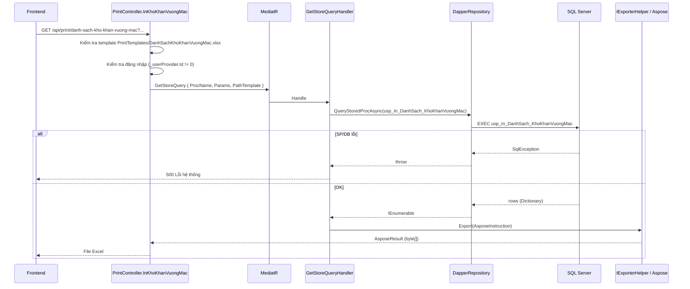

# Bug fix — Export Excel màn hình Khó khăn vướng mắc

**Module:** QLDA  
**Trạng thái:** Điều tra xong — có hướng sửa (Phương án B) — xem mục 14–16  
**Effort ước lượng:** ~2–3 giờ (BE only, không migration)  
**Ngày:** 2026-06-27  
**Pattern hiện tại:** `PrintController` + `GetStoreQuery` + Dapper SP + Aspose template  
**Pattern tham chiếu (đề xuất):** `InDanhSachPhanKhaiKinhPhi`, `InDeXuatChuTruongChuyenTiep` (LINQ + `IExporterHelper`)

---

## 1. Tóm tắt

Khi người dùng bấm **In / Xuất Excel** trên tab **Khó khăn vướng mắc**, FE gọi API print. BE hiện dùng stored procedure `usp_In_DanhSach_KhoKhanVuongMac` qua `GetStoreQuery`. Mọi exception trong handler đều bị re-throw → API trả **lỗi hệ thống (500)** thay vì file Excel.

**Phát hiện chính sau khi đọc source:**

| # | Phát hiện | Mức độ |
|---|-----------|--------|
| 1 | SP `usp_In_DanhSach_KhoKhanVuongMac` **không có trong repo** — chỉ được gọi từ `PrintController`, deploy phụ thuộc DBA/DB | Cao |
| 2 | Export qua SP **không dùng** `IAuthorizationManager.FilterVisible()` như grid `danh-sach-tien-do` | Cao (bảo mật + lệch dữ liệu) |
| 3 | `KhoKhanVuongMacPrintSearchModel` **thiếu** `DonViPhuTrachChinhId`, `DonViPhoiHopId` so với `KhoKhanVuongMacSearchModel` | Trung bình |
| 4 | Template `DanhSachKhoKhanVuongMac.xlsx` **có trong git** và copy ra `bin/.../PrintTemplates/` khi build | OK |
| 5 | Template map cột `$tinhTrangId`, `$mucDoKhoKhanId` (ID thô) — grid hiển thị tên danh mục | Thấp (sai hiển thị, không crash) |
| 6 | `GetStoreQueryHandler` không validate dữ liệu rỗng — export 0 dòng vẫn trả file Excel hợp lệ | OK |

---

## 2. API & endpoint

### 2.1 Export Excel (bị lỗi)

| Thuộc tính | Giá trị |
|------------|---------|
| **Method** | `GET` |
| **URL** | `/api/print/danh-sach-kho-khan-vuong-mac` |
| **Controller** | `PrintController.InKhoKhanVuongMac` |
| **Tag Swagger** | `In ấn` |
| **Response thành công** | `FileContentResult` — `application/vnd.openxmlformats-officedocument.spreadsheetml.sheet` |
| **Tên file tải** | `DanhSachKhoKhanVuongMac_ddMMyyyy_HHmmss.xlsx` |

**Query params** (`KhoKhanVuongMacPrintSearchModel`):

| Param | Kiểu | Ghi chú |
|-------|------|---------|
| `duAnId` | `Guid?` | |
| `buocId` | `int?` | |
| `globalFilter` | `string?` | |
| `hiddenColumns` | `string[]?` | Ẩn cột trên Excel |
| `noiDung` | `string?` | |
| `tinhTrangId` | `int?` | Trạng thái xử lý |
| `mucDoKhoKhanId` | `int?` | Mức độ khó khăn |
| `loaiDuAnId` | `int?` | |
| `loaiDuAnTheoNamId` | `int?` | PMIS #9609 |
| `lanhDaoPhuTrachId` | `long?` | |
| `tuNgay` | `DateOnly?` | BE convert `ToStartOfDayUtc()` |
| `denNgay` | `DateOnly?` | BE convert `ToEndOfDayUtc()` |

> **Thiếu so với grid:** `donViPhuTrachChinhId`, `donViPhoiHopId` — có trên `GET danh-sach-tien-do` nhưng không có trên print model.

### 2.2 API danh sách grid (hoạt động bình thường)

| Method | URL |
|--------|-----|
| `GET` | `/api/kho-khan-vuong-mac/danh-sach-tien-do` |

Handler: `KhoKhanVuongMacGetDanhSachQuery` — có `_authManager.FilterVisible()`, EF LINQ, phân trang.

---

## 3. Luồng xử lý (hiện tại)



### 3.1 Tham số truyền vào SP (từ controller)

```csharp
// PrintController.cs — InKhoKhanVuongMac
Params = new {
    searchModel.DuAnId,
    searchModel.BuocId,
    searchModel.NoiDung,
    searchModel.TinhTrangId,
    searchModel.MucDoKhoKhanId,
    searchModel.LoaiDuAnId,
    searchModel.LanhDaoPhuTrachId,
    TuNgay = searchModel.TuNgay?.ToStartOfDayUtc(),
    DenNgay = searchModel.DenNgay?.ToEndOfDayUtc(),
    searchModel.GlobalFilter,
    searchModel.LoaiDuAnTheoNamId,
    PageIndex = 0,
    PageSize = 0,
}
```

**So sánh với export báo cáo tiến độ (cùng nhóm BaoCao):**

| Param | `InBaoCaoTienDo` | `InKhoKhanVuongMac` |
|-------|------------------|---------------------|
| `NguoiBaoCaoId` | Có (`_userProvider.Id`) | **Không** |
| `LoaiDuAnTheoNamId` | Có | Có |
| Auth EF `FilterVisible` | Không (SP) | Không (SP) |

`DapperRepository` có cơ chế **retry** khi SP báo param không tồn tại (`is not a parameter for procedure`) — tự bỏ param thừa. Param thiếu hoặc lỗi SQL bên trong SP vẫn gây 500.

---

## 4. Bản đồ file liên quan

| Layer | File | Vai trò |
|-------|------|---------|
| WebApi | `QLDA.WebApi/Controllers/PrintController.cs` | Endpoint `InKhoKhanVuongMac` |
| WebApi | `QLDA.WebApi/Models/KhoKhanVuongMacs/KhoKhanVuongMacPrintSearchModel.cs` | Query params export |
| WebApi | `QLDA.WebApi/Models/KhoKhanVuongMacs/KhoKhanVuongMacSearchModel.cs` | Query params grid (đầy đủ hơn) |
| WebApi | `QLDA.WebApi/Controllers/KhoKhanVuongMacController.cs` | CRUD + `danh-sach-tien-do` |
| WebApi | `QLDA.WebApi/PrintTemplates/DanhSachKhoKhanVuongMac.xlsx` | Template Aspose |
| WebApi | `QLDA.WebApi/PrintTemplates/huong-dan.md` | Quy ước `$Placeholder` ↔ alias SP |
| Application | `QLDA.Application/Common/Queries/GetStoreQuery.cs` | Handler gọi Dapper + Export |
| Application | `QLDA.Application/KhoKhanVuongMacs/Queries/KhoKhanVuongMacGetDanhSachQuery.cs` | Logic grid + phân quyền |
| Application | `QLDA.Application/KhoKhanVuongMacs/DTOs/KhoKhanVuongMacDto.cs` | DTO grid |
| Domain | `QLDA.Domain/Entities/BaoCaoKhoKhanVuongMac.cs` | Entity |
| BuildingBlocks | `BuildingBlocks.Persistence/Repositories/DapperRepository.cs` | Gọi SP |
| BuildingBlocks | `BuildingBlocks.Infrastructure/Offices/ExcelHelper.cs` | Fill template |
| DB | `usp_In_DanhSach_KhoKhanVuongMac` | **Ngoài repo** — cần kiểm tra trên SQL Server |

---

## 5. Template Excel — cột bắt buộc

File: `QLDA.WebApi/PrintTemplates/DanhSachKhoKhanVuongMac.xlsx`  
Dòng marker (đọc từ `sharedStrings.xml`):

| Placeholder template | Alias SP / property cần trả về | Ghi chú |
|----------------------|----------------------------------|---------|
| `$STT` | `STT` (tùy chọn) | `ExporterHelper` tự gán 1,2,3… nếu thiếu |
| `$TenDuAn` | `TenDuAn` | JOIN `DuAn` |
| `$TenBuoc` | `TenBuoc` | JOIN `DuAnBuoc` / quy trình |
| `$ngay` | `ngay` | **chữ thường** — phải khớp chính xác alias |
| `$tinhTrangId` | `tinhTrangId` | Template đang bind **ID**, không phải tên |
| `$noiDung` | `noiDung` | **camelCase** |
| `$mucDoKhoKhanId` | `mucDoKhoKhanId` | Template đang bind **ID** |

> Quy ước: placeholder `$X` → SP `SELECT ... AS X`. Xem `PrintTemplates/huong-dan.md`.

**Đề xuất cải thiện template (sau khi fix crash):** đổi sang `$TenTinhTrang`, `$TenMucDoKhoKhan`, `$Ngay` (PascalCase) cho đồng bộ UI — cần sửa đồng bộ SP hoặc ExportDto.

---

## 6. Stored procedure (spec suy luận — cần xác nhận trên DB)

SP **không** nằm trong EF migration. Cần chạy trên DB môi trường lỗi:

```sql
-- Kiểm tra tồn tại
SELECT OBJECT_ID('dbo.usp_In_DanhSach_KhoKhanVuongMac');

-- Xem definition
EXEC sp_helptext 'usp_In_DanhSach_KhoKhanVuongMac';

-- Test thủ công
EXEC dbo.usp_In_DanhSach_KhoKhanVuongMac
    @DuAnId = NULL,
    @BuocId = NULL,
    @NoiDung = NULL,
    @TinhTrangId = NULL,
    @MucDoKhoKhanId = NULL,
    @LoaiDuAnId = NULL,
    @LanhDaoPhuTrachId = NULL,
    @TuNgay = NULL,
    @DenNgay = NULL,
    @GlobalFilter = NULL,
    @LoaiDuAnTheoNamId = NULL,
    @PageIndex = 0,
    @PageSize = 0;
```

### 6.1 SELECT tối thiểu (khớp template hiện tại)

```sql
SELECT
    da.Ten AS TenDuAn,
    buoc.Ten AS TenBuoc,          -- điều chỉnh theo schema thực tế
    kk.Ngay AS ngay,
    kk.TinhTrangId AS tinhTrangId,
    kk.NoiDung AS noiDung,
    kk.MucDoKhoKhanId AS mucDoKhoKhanId
FROM BaoCaoKhoKhanVuongMac kk
INNER JOIN BaoCao bc ON bc.Id = kk.Id AND bc.IsDeleted = 0
INNER JOIN DuAn da ON da.Id = kk.DuAnId AND da.IsDeleted = 0
-- LEFT JOIN ... TenBuoc, filter theo params
WHERE ...
ORDER BY kk.Ngay DESC;
```

### 6.2 Filter nên mirror `KhoKhanVuongMacGetDanhSachQuery`

- `DuAnId`, `BuocId`, `TinhTrangId`, `MucDoKhoKhanId`
- `LoaiDuAnId`, `LoaiDuAnTheoNamId` trên `DuAn`
- `NoiDung` LIKE
- `TuNgay` / `DenNgay` trên `kk.Ngay`
- `LanhDaoPhuTrachId` trên `DuAn`
- `DonViPhuTrachChinhId`, `DonViPhoiHopId` — **hiện chưa có trên print model**
- Phân quyền dự án — **SP phải implement hoặc bỏ SP, dùng EF**

---

## 7. Nguyên nhân có thể (xếp theo khả năng)

### 7.1 P0 — Lỗi khi gọi SP / DB

| Triệu chứng | Cách nhận biết |
|-------------|----------------|
| SP chưa deploy | `Could not find stored procedure 'usp_In_DanhSach_KhoKhanVuongMac'` |
| SP lỗi runtime | Message SQL trong log Serilog (`QLDA.WebApi/logs/service-*.log`) |
| Param bắt buộc NULL | Lỗi conversion / constraint trong SP |
| `@LoaiDuAnTheoNamId` chưa có trên SP cũ | Dapper tự bỏ param (retry) — **không crash**, chỉ không filter |

`GetStoreQueryHandler` bọc try/catch, log `Error`, **re-throw** → middleware trả lỗi hệ thống.

### 7.2 P1 — Template không deploy (môi trường publish)

| Triệu chứng | Message |
|-------------|---------|
| Thiếu file trong output | `Không tìm thấy file template` (`ManagedException` — **400**, không phải 500) |

Kiểm tra: `{AppContext.BaseDirectory}/PrintTemplates/DanhSachKhoKhanVuongMac.xlsx`  
`QLDA.WebApi.csproj` đã có `CopyToOutputDirectory` cho `PrintTemplates\**\*.*`.

### 7.3 P2 — Lệch dữ liệu (không gây 500)

- Export SP không `FilterVisible` → khác grid / lộ dữ liệu
- Template hiển thị ID thay vì tên danh mục
- Print model thiếu filter đơn vị

### 7.4 Log môi trường dev (2026-06-27)

Trong `QLDA.WebApi/logs/service-20260627.log`, lần gọi `GetStoreQuery` cho `usp_In_DanhSach_KhoKhanVuongMac` fail do **SQL connection timeout** (DB không reachable) — lỗi hạ tầng local, không phải bug logic application. Cần reproduce trên DB QLDA thật để thấy lỗi SP.

---

## 8. Hướng xử lý đề xuất

### Phương án A — Sửa nhanh (chỉ DB)

**Phù hợp khi:** SP đã có bản nháp, chỉ thiếu/sai trên server.

1. Deploy/fix `usp_In_DanhSach_KhoKhanVuongMac` với SELECT alias khớp template (mục 5).
2. Bổ sung filter `@LoaiDuAnTheoNamId`, `@DonViPhuTrachChinhId`, `@DonViPhoiHopId` nếu cần.
3. Implement phân quyền trong SP (phức tạp, dễ lệch với EF).

**Nhược điểm:** Duplicate logic với `KhoKhanVuongMacGetDanhSachQuery`, khó bảo trì.

### Phương án B — Khuyến nghị (LINQ export, giống PhanKhaiKinhPhi / DeXuatChuyenTiep)

**Phù hợp khi:** SP không tồn tại / không tin cậy / cần khớp grid + auth.

| Bước | Việc làm |
|------|----------|
| 1 | Tạo `KhoKhanVuongMacExportDto` (cột Excel: `TenDuAn`, `TenBuoc`, `Ngay`, `TenTinhTrang`, `NoiDung`, `TenMucDoKhoKhan`, …) |
| 2 | Tạo `KhoKhanVuongMacGetDanhSachExportQuery` — copy filter từ `KhoKhanVuongMacGetDanhSachQuery`, **không phân trang**, `FilterVisible` đầu query |
| 3 | Mapping trong Application (`KhoKhanVuongMacMappings.cs`) |
| 4 | Sửa `InKhoKhanVuongMac`: bỏ `GetStoreQuery`, gọi export query + `_excelExporter.Export` |
| 5 | Cập nhật template: placeholder khớp ExportDto (hoặc giữ alias cũ trong Select) |
| 6 | Bổ sung `DonViPhuTrachChinhId`, `DonViPhoiHopId` vào `KhoKhanVuongMacPrintSearchModel` |
| 7 | (Tùy chọn) `ManagedException.ThrowIf(data.Count == 0, "Không có dữ liệu để xuất")` — message rõ, không 500 |

**Ưu điểm:** Không phụ thuộc DBA, auth đồng nhất grid, dễ test unit/integration.

### Phương án C — Hybrid

Giữ SP nhưng thêm validate + message rõ trong `GetStoreQueryHandler` hoặc wrapper riêng — **không khuyến nghị** trừ khi bắt buộc dùng SP.

---

## 9. Cách reproduce

### 9.1 Swagger / Postman

```http
GET /api/print/danh-sach-kho-khan-vuong-mac?duAnId={guid}&buocId=123
Authorization: Bearer {token}
```

So sánh với:

```http
GET /api/kho-khan-vuong-mac/danh-sach-tien-do?duAnId={guid}&buocId=123&pageIndex=0&pageSize=20
```

### 9.2 Kiểm tra template local

```powershell
Test-Path "QLDA.WebApi\bin\Debug\net8.0\PrintTemplates\DanhSachKhoKhanVuongMac.xlsx"
```

### 9.3 Đọc log

```text
QLDA.WebApi/logs/service-YYYYMMDD.log
```

Tìm: `GetStoreQuery` + `usp_In_DanhSach_KhoKhanVuongMac` + stack `SqlException`.

### 9.4 Build

```bash
dotnet build QLDA.WebApi/QLDA.WebApi.csproj
```

---

## 10. Kế hoạch test sau fix

| # | Case | Kỳ vọng |
|---|------|---------|
| 1 | Có dữ liệu, filter `duAnId` + `buocId` | File `.xlsx` tải được, số dòng = grid (không phân trang) |
| 2 | Không có dữ liệu | Message rõ **hoặc** file Excel header-only (thống nhất với module khác) |
| 3 | User không có quyền xem dự án | Không lộ bản ghi (nếu dùng phương án B) |
| 4 | `hiddenColumns` | Cột bị ẩn trên Excel |
| 5 | `loaiDuAnTheoNamId=3` | Kết quả khác `=1` |
| 6 | Mở file Excel | Không corrupt, cột ngày/số hiển thị đúng |
| 7 | Build CI | 0 error, không warning mới |

---

## 11. Acceptance checklist

- [x] Xác định đúng endpoint: `GET /api/print/danh-sach-kho-khan-vuong-mac`
- [x] Trace luồng Controller → GetStoreQuery → Dapper → Aspose
- [x] Liệt kê template + placeholder
- [ ] Reproduce lỗi trên DB thật (chờ môi trường / xác nhận message SQL)
- [ ] Fix đúng nguyên nhân (chọn phương án A hoặc B)
- [ ] Test Swagger/Postman — file tải được
- [ ] Excel mở được, dữ liệu khớp grid
- [ ] Không phát sinh warning/error build mới

---

## 12. Tham chiếu nội bộ

- `docs/issues/9609/fe-endpoint-mapping.md` — mapping FE print endpoint
- `docs/issues/9609/report.md` — `LoaiDuAnTheoNamId` trên print
- `docs/feature/PhanKhaiKinhPhi/task-export-ket-qua-phan-khai-von-duoc-duyet.md` — pattern export LINQ
- `docs/feature/DeXuatChuyenTiep/task-export-danh-sach-de-xuat-chu-truong-chuyen-tiep.md` — export đã implement (Hướng B)
- `docs/issues/server-overload-503/CRITICAL-FINDINGS.md` — rủi ro `PageSize=0` trên print endpoints

---

## 13. Bước tiếp theo (implementation)

1. **Khuyến nghị:** triển khai **Phương án B** (mục 14) — không phụ thuộc SP/DBA.
2. Làm theo thứ tự file ở mục 15 → build → test mục 10.
3. (Tùy chọn Phase 2) Cập nhật template hiển thị tên danh mục thay vì ID (mục 16).
4. FE: truyền cùng query params như `danh-sach-tien-do` khi gọi print.

---

## 14. Có cách sửa không?

**Có.** Khuyến nghị **Phương án B — bỏ SP, export bằng LINQ + Aspose**, giống các endpoint đã ổn định:

| Endpoint đã dùng pattern này | File tham chiếu |
|------------------------------|-----------------|
| Phân khai kinh phí | `PhanKhaiKinhPhiGetDanhSachExportQuery` |
| Đề xuất chuyển tiếp | `DeXuatChuyenTiepGetDanhSachExportQuery` |
| Bàn giao hồ sơ | `BanGiaoHoSoGetDanhSachExportQuery` (+ validate rỗng) |

**Lý do chọn B thay vì sửa SP (Phương án A):**

| Tiêu chí | Phương án A (SP) | Phương án B (LINQ) |
|----------|------------------|---------------------|
| SP trong repo | Không | Không cần |
| Phân quyền `FilterVisible` | Phải viết lại trong SQL | Tái dùng từ grid |
| Filter khớp grid | Dễ lệch | Copy cùng handler |
| Deploy | Cần DBA | Chỉ deploy BE |
| Rủi ro 500 do SP | Cao | Thấp |

**Phương án A (chỉ khi bắt buộc giữ SP):** DBA deploy `usp_In_DanhSach_KhoKhanVuongMac` với SELECT alias khớp mục 5. BE không đổi code — nhanh nhưng không fix auth.

---

## 15. Các bước code (Phương án B — chi tiết)

### Tổng quan file cần sửa/tạo

| # | Hành động | File |
|---|-----------|------|
| 1 | **Tạo mới** | `QLDA.Application/KhoKhanVuongMacs/DTOs/KhoKhanVuongMacExportDto.cs` |
| 2 | **Tạo mới** | `QLDA.Application/KhoKhanVuongMacs/Queries/KhoKhanVuongMacGetDanhSachExportQuery.cs` |
| 3 | **Sửa** | `QLDA.WebApi/Models/KhoKhanVuongMacs/KhoKhanVuongMacPrintSearchModel.cs` |
| 4 | **Sửa** | `QLDA.WebApi/Controllers/PrintController.cs` — `InKhoKhanVuongMac` |
| 5 | **Không sửa** | `DanhSachKhoKhanVuongMac.xlsx` (Phase 1 — giữ placeholder cũ) |
| 6 | **Không cần** | Migration, EF config, snapshot |

MediatR tự đăng ký handler mới từ assembly Application — **không cần** sửa `DependencyInjection`.

---

### Bước 1 — Tạo `KhoKhanVuongMacExportDto`

Property khớp placeholder template hiện tại. Cột `$ngay`, `$noiDung`, … viết thường → dùng `[JsonPropertyName]` vì `ExcelHelper` đọc attribute này khi fill Aspose.

```csharp
// QLDA.Application/KhoKhanVuongMacs/DTOs/KhoKhanVuongMacExportDto.cs
using System.Text.Json.Serialization;

namespace QLDA.Application.KhoKhanVuongMacs.DTOs;

/// <summary>
/// Dòng export Excel khó khăn vướng mắc — property khớp placeholder template ($Field)
/// </summary>
public class KhoKhanVuongMacExportDto
{
    public int Stt { get; set; }
    public string? TenDuAn { get; set; }
    public string? TenBuoc { get; set; }

    [JsonPropertyName("ngay")]
    public DateTimeOffset? Ngay { get; set; }

    [JsonPropertyName("tinhTrangId")]
    public int? TinhTrangId { get; set; }

    [JsonPropertyName("noiDung")]
    public string? NoiDung { get; set; }

    [JsonPropertyName("mucDoKhoKhanId")]
    public int? MucDoKhoKhanId { get; set; }
}
```

> **Phase 2 (tùy chọn):** đổi template sang `$TenTinhTrang`, `$TenMucDoKhoKhan` và map `TinhTrang!.Ten`, `MucDo!.Ten` — UX tốt hơn grid.

---

### Bước 2 — Tạo `KhoKhanVuongMacGetDanhSachExportQuery`

Copy **toàn bộ filter** từ `KhoKhanVuongMacGetDanhSachQueryHandler`, bỏ phân trang và TepDinhKem (export không cần file đính kèm).

```csharp
// QLDA.Application/KhoKhanVuongMacs/Queries/KhoKhanVuongMacGetDanhSachExportQuery.cs
using Microsoft.EntityFrameworkCore;
using QLDA.Application.Authorization;
using QLDA.Application.Common.Interfaces;
using QLDA.Application.KhoKhanVuongMacs.DTOs;

namespace QLDA.Application.KhoKhanVuongMacs.Queries;

public record KhoKhanVuongMacGetDanhSachExportQuery
    : IMayHaveGlobalFilter, IFromDateToDate, IRequest<List<KhoKhanVuongMacExportDto>>
{
    public Guid? DuAnId { get; set; }
    public int? BuocId { get; set; }
    public string? GlobalFilter { get; set; }
    public string? NoiDung { get; set; }
    public int? TinhTrangId { get; set; }
    public int? MucDoKhoKhanId { get; set; }
    public int? LoaiDuAnId { get; set; }
    public int? LoaiDuAnTheoNamId { get; set; }
    public DateOnly? TuNgay { get; set; }
    public DateOnly? DenNgay { get; set; }
    public long? LanhDaoPhuTrachId { get; set; }
    public long? DonViPhuTrachChinhId { get; set; }
    public long? DonViPhoiHopId { get; set; }
}

internal class KhoKhanVuongMacGetDanhSachExportQueryHandler(IServiceProvider serviceProvider)
    : IRequestHandler<KhoKhanVuongMacGetDanhSachExportQuery, List<KhoKhanVuongMacExportDto>>
{
    private readonly IRepository<BaoCaoKhoKhanVuongMac, Guid> _repo =
        serviceProvider.GetRequiredService<IRepository<BaoCaoKhoKhanVuongMac, Guid>>();
    private readonly IAuthorizationManager _authManager =
        serviceProvider.GetRequiredService<IAuthorizationManager>();

    public async Task<List<KhoKhanVuongMacExportDto>> Handle(
        KhoKhanVuongMacGetDanhSachExportQuery request,
        CancellationToken cancellationToken = default)
    {
        var queryable = _authManager.FilterVisible(_repo.GetQueryableSet(), AuthorizationResourceKeys.DuAn)
            .AsNoTracking()
            .Where(e => !e.DuAn!.IsDeleted)
            .WhereIf(request.DuAnId != null, e => e.DuAnId == request.DuAnId)
            .WhereIf(request.BuocId > 0, e => e.BuocId == request.BuocId)
            .WhereIf(request.TinhTrangId > 0, e => e.TinhTrangId == request.TinhTrangId)
            .WhereIf(request.MucDoKhoKhanId > 0, e => e.MucDoKhoKhanId == request.MucDoKhoKhanId)
            .WhereIf(request.LoaiDuAnId > 0, e => e.DuAn!.LoaiDuAnId == request.LoaiDuAnId)
            .WhereIf(request.LoaiDuAnTheoNamId > 0, e => e.DuAn!.LoaiDuAnTheoNamId == request.LoaiDuAnTheoNamId)
            .WhereIf(request.NoiDung.IsNotNullOrWhitespace(),
                e => e.NoiDung!.ToLower().Contains(request.NoiDung!.ToLower()))
            .WhereIf(request.TuNgay.HasValue,
                e => e.Ngay.HasValue && e.Ngay.Value >= request.TuNgay!.Value.ToStartOfDayUtc())
            .WhereIf(request.DenNgay.HasValue,
                e => e.Ngay.HasValue && e.Ngay.Value <= request.DenNgay!.Value.ToEndOfDayUtc())
            .WhereGlobalFilter(request, e => e.NoiDung, e => e.TinhTrang!.Ten);

        var rows = await queryable
            .OrderByDescending(e => e.Ngay)
            .ThenByDescending(e => e.CreatedAt)
            .Select(e => new
            {
                e.Ngay,
                e.NoiDung,
                e.TinhTrangId,
                e.MucDoKhoKhanId,
                TenDuAn = e.DuAn!.TenDuAn,
                TenBuoc = e.DuAnBuoc!.TenBuoc ?? e.DuAnBuoc.Buoc!.Ten,
            })
            .ToListAsync(cancellationToken);

        ManagedException.ThrowIf(rows.Count == 0, "Không có dữ liệu để xuất");

        return rows.Select((row, index) => new KhoKhanVuongMacExportDto
        {
            Stt = index + 1,
            TenDuAn = row.TenDuAn,
            TenBuoc = row.TenBuoc,
            Ngay = row.Ngay,
            TinhTrangId = row.TinhTrangId,
            NoiDung = row.NoiDung,
            MucDoKhoKhanId = row.MucDoKhoKhanId,
        }).ToList();
    }
}
```

**Lưu ý khi code:**

- `FilterVisible` **bắt buộc** đặt đầu query (rule `AuthorizationManager` trong `CLAUDE.md`).
- **Không** thêm `.Where(e => !e.IsDeleted)` — `GetQueryableSet()` đã filter.
- Pattern validate rỗng: giống `BanGiaoHoSoGetDanhSachExportQuery` — trả message rõ, không 500.
- `LanhDaoPhuTrachId`, `DonViPhuTrachChinhId`, `DonViPhoiHopId`: grid hiện **chưa filter** trong handler — export giữ nguyên để khớp grid; bổ sung `WhereIf` sau nếu BA yêu cầu.

---

### Bước 3 — Bổ sung `KhoKhanVuongMacPrintSearchModel`

Thêm 2 field còn thiếu (đồng bộ với `KhoKhanVuongMacSearchModel`):

```csharp
// QLDA.WebApi/Models/KhoKhanVuongMacs/KhoKhanVuongMacPrintSearchModel.cs
public long? DonViPhuTrachChinhId { get; set; }
public long? DonViPhoiHopId { get; set; }
```

---

### Bước 4 — Sửa `PrintController.InKhoKhanVuongMac`

**Thay** block `GetStoreQuery` bằng LINQ export. Thêm `using`:

```csharp
using QLDA.Application.KhoKhanVuongMacs.DTOs;
using QLDA.Application.KhoKhanVuongMacs.Queries;
```

**Code endpoint sau khi sửa:**

```csharp
#region DanhSachKhoKhanVuongMac

/// <summary>
/// DanhSachKhoKhanVuongMac.xlsx — Export danh sách khó khăn vướng mắc (filter giống danh-sach-tien-do)
/// </summary>
[HttpGet("api/print/danh-sach-kho-khan-vuong-mac")]
[ProducesResponseType(StatusCodes.Status200OK)]
public async Task<IActionResult> InKhoKhanVuongMac(
    [FromQuery] KhoKhanVuongMacPrintSearchModel searchModel,
    CancellationToken cancellationToken = default)
{
    var fileNameTemplate = "DanhSachKhoKhanVuongMac.xlsx";
    var templatePath = Path.Combine(
        AppContext.BaseDirectory,
        "PrintTemplates",
        fileNameTemplate
    );

    ManagedException.ThrowIf(!System.IO.File.Exists(templatePath),
        "Không tìm thấy file template DanhSachKhoKhanVuongMac.xlsx");
    ManagedException.ThrowIf(_userProvider.Id == 0, "Vui lòng đăng nhập");

    var data = await Mediator.Send(new KhoKhanVuongMacGetDanhSachExportQuery
    {
        DuAnId = searchModel.DuAnId,
        BuocId = searchModel.BuocId,
        GlobalFilter = searchModel.GlobalFilter,
        NoiDung = searchModel.NoiDung,
        TinhTrangId = searchModel.TinhTrangId,
        MucDoKhoKhanId = searchModel.MucDoKhoKhanId,
        LoaiDuAnId = searchModel.LoaiDuAnId,
        LoaiDuAnTheoNamId = searchModel.LoaiDuAnTheoNamId,
        LanhDaoPhuTrachId = searchModel.LanhDaoPhuTrachId,
        DonViPhuTrachChinhId = searchModel.DonViPhuTrachChinhId,
        DonViPhoiHopId = searchModel.DonViPhoiHopId,
        TuNgay = searchModel.TuNgay,
        DenNgay = searchModel.DenNgay,
    }, cancellationToken);

    var exportResult = _excelExporter.Export(new AsposeInstruction<KhoKhanVuongMacExportDto>
    {
        TemplatePath = templatePath,
        Items = data,
        HiddenColumns = searchModel.HiddenColumns ?? [],
        AutoFitColumnsAndRows = false,
    });

    return new FileContentResult(exportResult.FileBytes, exportResult.ContentType)
    {
        FileDownloadName = GetDownloadFileName(fileNameTemplate)
    };
}

#endregion
```

**Xóa / không dùng nữa:** `procedureName = "usp_In_DanhSach_KhoKhanVuongMac"` và `GetStoreQuery`.

---

### Bước 5 — Build & smoke test

```bash
dotnet build QLDA.WebApi/QLDA.WebApi.csproj
```

Swagger:

```http
GET /api/print/danh-sach-kho-khan-vuong-mac?duAnId={guid}&buocId={id}
Authorization: Bearer {token}
```

Kỳ vọng: HTTP 200, `Content-Disposition: attachment`, file mở được trong Excel.

---

### Bước 6 — Checklist trước merge

- [ ] `dotnet build` — 0 errors
- [ ] Export có data → file `.xlsx` tải được
- [ ] Export không data → `"Không có dữ liệu để xuất"` (400), không 500
- [ ] Số dòng Excel = tổng item grid (cùng filter, bỏ phân trang)
- [ ] User không có quyền dự án → không thấy bản ghi lạ
- [ ] Không commit `bin/`, `obj/`, logs

---

## 16. Phase 2 — Cải thiện template (tùy chọn)

Template hiện tại export **ID** ở cột tình trạng / mức độ. Nếu BA muốn hiển thị **tên** như grid:

1. Sửa `DanhSachKhoKhanVuongMac.xlsx` — đổi dòng marker:
   - `$tinhTrangId` → `$TenTinhTrang`
   - `$mucDoKhoKhanId` → `$TenMucDoKhoKhan`
2. Cập nhật `KhoKhanVuongMacExportDto` + Select trong handler:

```csharp
TenTinhTrang = e.TinhTrang!.Ten,
TenMucDoKhoKhan = e.MucDo!.Ten,
```

3. Test lại export.

---

## 17. Phương án A — Sửa SP (backup, nếu không làm B)

Chỉ dùng khi team bắt buộc giữ `GetStoreQuery`:

1. DBA tạo/sửa `usp_In_DanhSach_KhoKhanVuongMac` trên SQL Server.
2. SELECT alias **đúng** mục 5 (`ngay`, `noiDung`, `tinhTrangId`, …).
3. Thêm param `@LoaiDuAnTheoNamId` nếu chưa có.
4. Test `EXEC` trực tiếp trên SSMS trước khi gọi API.
5. BE **giữ nguyên** `PrintController` — không fix được phân quyền EF.

---

## 18. Diff tóm tắt (ước lượng)

```
+ QLDA.Application/KhoKhanVuongMacs/DTOs/KhoKhanVuongMacExportDto.cs          (~25 dòng)
+ QLDA.Application/KhoKhanVuongMacs/Queries/KhoKhanVuongMacGetDanhSachExportQuery.cs (~90 dòng)
~ QLDA.WebApi/Models/KhoKhanVuongMacs/KhoKhanVuongMacPrintSearchModel.cs     (+2 props)
~ QLDA.WebApi/Controllers/PrintController.cs                                  (~40 dòng thay đổi)
```
