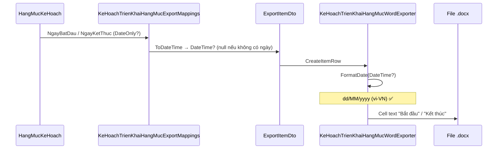

# Spec kỹ thuật — Fix format ngày phiếu trình KH triển khai hạng mục

**Module:** QLDA  
**Trạng thái:** ✅ **IMPLEMENTED**  
**Effort thực tế:** ~30 phút (BE only, không migration)  
**Ngày:** 2026-07-08  
**Pattern tham chiếu:** `KeHoachTrienKhaiHangMucExportDescriptor` (Excel `dd/MM/yyyy`), `FormatKinhPhi` (`vi-VN`)

---

## Mục lục

1. [Tóm tắt](#1-tóm-tắt)
2. [Luồng render ngày](#2-luồng-render-ngày)
3. [Root cause](#3-root-cause)
4. [Phạm vi fix](#4-phạm-vi-fix)
5. [Thay đổi đã implement](#5-thay-đổi-đã-implement)
6. [Test plan & kết quả](#6-test-plan--kết-quả)
7. [Checklist trước merge](#7-checklist-trước-merge)

---

## 1. Tóm tắt

### 1.1 API

| Thuộc tính | Giá trị |
|------------|---------|
| Method | `GET` |
| URL | `/api/print/phieu-trinh-ke-hoach-trien-khai-hang-muc` |
| Param | `id` — `Guid` kế hoạch triển khai |
| Controller | `PrintController.InPhieuTrinhKeHoachTrienKhaiHangMuc` |
| Output | Word `.docx` |

### 1.2 Yêu cầu BA

| Cột bảng | Trước fix | Sau fix |
|----------|-----------|---------|
| **Bắt đầu** | `2026-07-08` | `08/07/2026` |
| **Kết thúc** | `2026-07-08` | `08/07/2026` |

**Ràng buộc đã đáp ứng:**

- Chỉ format khi **render/in** — **không** đổi dữ liệu DB (`HangMucKeHoach.NgayBatDau`, `NgayKetThuc` vẫn `DateOnly?`).
- Ngày `null` → ô **trống**, không in `01/01/0001`.
- Cell Word là plain text — không bị Aspose/Word auto-convert về ISO.

---

## 2. Luồng render ngày



### 2.1 Files trong luồng

| Tầng | File | Vai trò với ngày |
|------|------|------------------|
| Domain | `HangMucKeHoach.cs` | `DateOnly? NgayBatDau`, `NgayKetThuc` — **không đổi** |
| Application | `KeHoachTrienKhaiHangMucExportMappings.cs` | `ToDateTime(DateOnly?)` — không format string |
| Application | `KeHoachTrienKhaiHangMucExportItemDto.cs` | `DateTime? NgayBatDau`, `NgayKetThuc` |
| Application | `KeHoachTrienKhaiHangMucGetPhieuTrinhPrintQuery.cs` | Gọi `ToExportRowsAsync` → truyền DTO sang Word |
| Infrastructure | `KeHoachTrienKhaiHangMucWordExporter.cs` | **`FormatDate`** — format hiển thị **đã sửa** |
| WebApi | `PrintTemplates/Word/PhieuTrinhKeHoachTrienKhaiHangMuc.docx` | Template — **không regen** |

---

## 3. Root cause

### 3.1 Code gây lỗi (trước fix)

**File:** `QLDA.Infrastructure/Offices/KeHoachTrienKhaiHangMucWordExporter.cs`

```csharp
// TRƯỚC — hard-code ISO
private static string FormatDate(DateTime? date) =>
    date?.ToString("yyyy-MM-dd") ?? string.Empty;
```

Được gọi tại `CreateItemRow` — cột **Bắt đầu** (index 5) và **Kết thúc** (index 6):

```295:296:QLDA.Infrastructure/Offices/KeHoachTrienKhaiHangMucWordExporter.cs
            FormatDate(data.NgayBatDau),
            FormatDate(data.NgayKetThuc),
```

→ Nguyên nhân trực tiếp hiển thị `2026-07-08`.

### 3.2 Không phải nguyên nhân

| Giả thuyết | Kết quả kiểm tra |
|------------|------------------|
| Word template có field DATE typed tự convert | ❌ Bảng fill bằng `Run` text thuần (`CreateDataCell`) |
| DB lưu sai format | ❌ `DateOnly` — format chỉ ở tầng Word |
| Mapping Application format ISO | ❌ `ToDateTime` chỉ convert type |
| Excel export cũng sai | ❌ Descriptor đã `dd/MM/yyyy` |

### 3.3 Đối chiếu Excel

**File:** `QLDA.Gen/Descriptors/KeHoachTrienKhaiHangMucExportDescriptor.cs`

```csharp
new("NgayBatDau", "Thời gian bắt đầu", 16, "dd/MM/yyyy", ...),
new("NgayKetThuc", "thời gian kết thúc", 16, "dd/MM/yyyy", ...),
```

→ Phiếu trình Word đã **đồng bộ** format với Excel.

### 3.4 Null / default date

```205:206:QLDA.Application/KeHoachTrienKhaiHangMuc/KeHoachTrienKhaiHangMucExportMappings.cs
    private static DateTime? ToDateTime(DateOnly? date) =>
        date?.ToDateTime(TimeOnly.MinValue);
```

- `NgayBatDau == null` → DTO `null` → `FormatDate` → `""` ✅
- Không có path gán `DateTime.MinValue` khi DB null → không in `01/01/0001` ✅

### 3.5 Spec #9469

`docs/issues/9469/phieu-trinh-word-spec.md` §2.2 trước đây ghi `yyyy-MM-dd` hoặc `dd/MM/yyyy` — **BA đã chốt `dd/MM/yyyy`**. Cần cập nhật spec #9469 (pending).

---

## 4. Phạm vi fix

### 4.1 Đã sửa

| Hạng mục | Chi tiết |
|----------|----------|
| Word phiếu trình | Cột **Bắt đầu**, **Kết thúc** |
| `FormatDate` | `dd/MM/yyyy` + `ViCulture` |
| Unit test | 2 test — format + null |
| `InternalsVisibleTo` | Cho phép test `internal` method |

### 4.2 Không sửa

| Hạng mục | Lý do |
|----------|-------|
| Migration / entity / DTO DB | DB không đổi |
| `NgayLap` header | Format chữ — đã đúng `FormatNgayLap` |
| Cột **Thời hạn** | Số ngày (`int?`) |
| Excel export | Đã `dd/MM/yyyy` |
| Template `.docx` | Bảng build động qua Aspose API |
| Import Excel | Không liên quan print |

---

## 5. Thay đổi đã implement

### 5.1 `FormatDate` — code sau fix

```382:383:QLDA.Infrastructure/Offices/KeHoachTrienKhaiHangMucWordExporter.cs
    internal static string FormatDate(DateTime? date) =>
        date?.ToString("dd/MM/yyyy", ViCulture) ?? string.Empty;
```

- `ViCulture` = `CultureInfo.GetCultureInfo("vi-VN")` — đồng bộ với `FormatKinhPhi`.
- Đổi `private` → `internal` để unit test gọi trực tiếp.

### 5.2 Diff tóm tắt

```diff
// KeHoachTrienKhaiHangMucWordExporter.cs
- private static string FormatDate(DateTime? date) =>
-     date?.ToString("yyyy-MM-dd") ?? string.Empty;
+ internal static string FormatDate(DateTime? date) =>
+     date?.ToString("dd/MM/yyyy", ViCulture) ?? string.Empty;
```

### 5.3 Files đã thay đổi

| # | File | Thay đổi |
|---|------|----------|
| 1 | `QLDA.Infrastructure/Offices/KeHoachTrienKhaiHangMucWordExporter.cs` | `FormatDate` → `dd/MM/yyyy` |
| 2 | `QLDA.Infrastructure/QLDA.Infrastructure.csproj` | `InternalsVisibleTo("QLDA.Tests")` |
| 3 | `QLDA.Tests/Unit/KeHoachTrienKhaiHangMucWordExporterTests.cs` | **Tạo mới** — 2 unit tests |
| 4 | `QLDA.Tests/QLDA.Tests.csproj` | ProjectReference `QLDA.Infrastructure` |

### 5.4 Unit test

```csharp
// QLDA.Tests/Unit/KeHoachTrienKhaiHangMucWordExporterTests.cs
[Fact] FormatDate_UsesVietnameseShortDate  → "08/07/2026"
[Fact] FormatDate_Null_ReturnsEmpty         → ""
```

---

## 6. Test plan & kết quả

| # | Case | Cách test | Kỳ vọng | Kết quả |
|---|------|-----------|---------|---------|
| T1 | Ngày có giá trị | In phiếu trình có `NgayBatDau` | `08/07/2026` | ⏳ Manual |
| T2 | Ngày kết thúc | Tương tự `NgayKetThuc` | `08/07/2026` | ⏳ Manual |
| T3 | Ngày null | Hạng mục không có ngày | Ô trống | ✅ Unit test |
| T4 | Header `NgayLap` | Không regression | `Tphcm, ngày dd tháng MM năm yyyy` | ⏳ Manual |
| T5 | Excel export | `GET /api/print/ke-hoach-trien-khai-hang-muc` | `dd/MM/yyyy` | ✅ Không đổi code |
| T6 | Unit `FormatDate` | `KeHoachTrienKhaiHangMucWordExporterTests` | `08/07/2026` / `""` | ✅ **2/2 passed** |

### 6.1 Lệnh chạy test

```bash
dotnet build QLDA.Infrastructure/QLDA.Infrastructure.csproj
dotnet build QLDA.Tests/QLDA.Tests.csproj -p:BuildProjectReferences=false
dotnet test QLDA.Tests/QLDA.Tests.csproj --filter "FullyQualifiedName~KeHoachTrienKhaiHangMucWordExporterTests" --no-build
```

**Kết quả:** `Passed! — Failed: 0, Passed: 2`

### 6.2 Manual test

```bash
curl --location \
  'http://localhost:5000/api/print/phieu-trinh-ke-hoach-trien-khai-hang-muc?id={KE_HOACH_ID}' \
  --header 'Authorization: Bearer {TOKEN}' \
  --output phieu-trinh-test.docx
```

> **Lưu ý:** Cần **restart WebApi** sau build để load DLL `QLDA.Infrastructure` mới.

Mở Word → bảng **Nội dung kế hoạch triển khai** → kiểm tra cột **Bắt đầu** / **Kết thúc**.

### 6.3 Word auto-format

Cell là **plain text** (`new Run(doc, text)`). Sau fix, literal `08/07/2026` — Word không re-interpret ISO date.

---

## 7. Checklist trước merge

- [x] `FormatDate` dùng `dd/MM/yyyy` (`vi-VN`)
- [x] Null → chuỗi rỗng
- [x] Không sửa entity / migration / DTO DB
- [x] Unit test pass (2/2)
- [x] `QLDA.Infrastructure` build pass
- [ ] Manual: mở `.docx` xác nhận format VN
- [ ] Cập nhật `docs/issues/9469/phieu-trinh-word-spec.md` §2.2

---

## Phụ lục — Cấu trúc bảng Word (11 cột)

| Index | Header | Field DTO | Format (sau fix) |
|-------|--------|-----------|------------------|
| 0 | STT | `Stt` | text |
| 1 | Giai đoạn | (group) / empty | text |
| 2 | Hạng mục công việc | `TenHangMuc` | text |
| 3 | Đơn vị chủ trì | `DonViChuTri` | text |
| 4 | Đơn vị phối hợp | `DonViPhoiHop` | text |
| 5 | **Bắt đầu** | `NgayBatDau` | **`dd/MM/yyyy`** ✅ |
| 6 | **Kết thúc** | `NgayKetThuc` | **`dd/MM/yyyy`** ✅ |
| 7 | Thời hạn | `ThoiHan` | số ngày |
| 8 | Cán bộ chủ trì | `CanBoChuTri` | text |
| 9 | Cán bộ phối hợp | `CanBoPhoiHop` | text |
| 10 | Kinh phí | `KinhPhi` | `#,##0` vi-VN |

---

*Cập nhật sau implement — July 8, 2026.*
