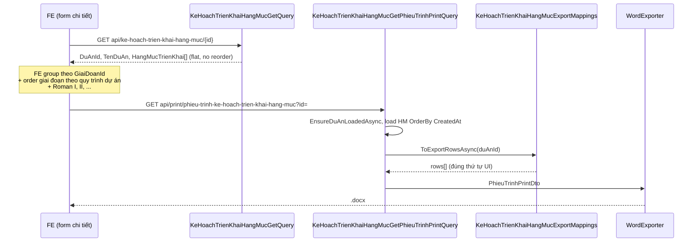
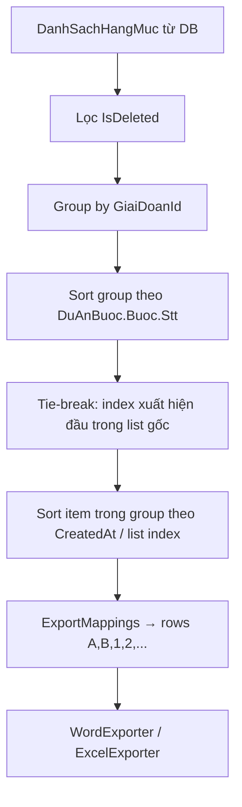

# Spec kỹ thuật — Fix in phiếu trình: Dự án trống & sai thứ tự giai đoạn/hạng mục

**Module:** QLDA — `KeHoachTrienKhaiHangMuc`  
**Ngày:** 2026-07-06  
**Trạng thái:** ✅ **IMPLEMENTED** (commit `af1fa46`, 06/07/2026)  
**Pattern tham chiếu:** [phieu-trinh-word-spec.md](../9469/phieu-trinh-word-spec.md), `KeHoachTrienKhaiHangMucImportGiaiDoanHelper`

---

## 0. Trạng thái implement

| Hạng mục | Trạng thái | Ghi chú |
|----------|------------|---------|
| `GetGiaiDoanSortByDuAnAsync` (ImportGiaiDoanHelper) | ✅ Done | Reuse sort theo `DuAnBuoc.Buoc.Stt` |
| `KeHoachTrienKhaiHangMucExportMappings.cs` | ✅ Done | Gộp mapper + loader — dùng chung Excel + Word |
| `KeHoachTrienKhaiHangMucGetPhieuTrinhPrintQuery` | ✅ Done | Word `.docx` — header + `ToExportRowsAsync` |
| `KeHoachTrienKhaiHangMucGetExportQuery` | ✅ Done | Excel — cùng `ToExportRowsAsync` + filter list |
| `KeHoachTrienKhaiHangMucExportMappingsTests` | ✅ Done | 2 unit tests (`ToExportRows`) |
| `KeHoachTrienKhaiHangMucPhieuTrinhPrintTests` | ✅ Partial | Smoke HTTP 200 + empty guid; chưa assert `DuAnDisplay`/thứ tự group |
| `GetQuery` trả `MaDuAn` (bước 9) | ⏳ Pending | Tuỳ chọn — print đã đủ `DuAnDisplay` |
| QA manual Word vs UI | ⏳ Pending | Cần mở file `.docx` trên môi trường có data |

---

## Mục lục

1. [Trạng thái implement](#0-trạng-thái-implement)
2. [Hiện trạng lỗi](#1-hiện-trạng-lỗi)
3. [Luồng code (sau fix)](#2-luồng-code-sau-fix)
4. [So sánh UI vs Print](#3-so-sánh-ui-vs-print)
5. [Root cause](#4-root-cause)
6. [Thiết kế fix (as-built)](#5-thiết-kế-fix-as-built)
7. [Files đã sửa](#6-files-đã-sửa)
8. [Bước code chi tiết](#7-bước-code-chi-tiết)
9. [Test plan](#8-test-plan)
10. [Checklist nghiệm thu](#9-checklist-nghiệm-thu)
11. [Refactor sau implement](#10-refactor-sau-implement)

---

## 1. Hiện trạng lỗi

### 1.1. Case báo cáo

| Khía cạnh | Chi tiết |
|-----------|----------|
| **Endpoint** | `GET /api/print/phieu-trinh-ke-hoach-trien-khai-hang-muc?id={id}` |
| **Form UI** | Đã chọn dự án `t01` |
| **UI giai đoạn** | `I. Xin chủ trương` → HM 1, 2 · `II. Chuẩn bị thực hiện đầu tư` → HM 3 |
| **Print giai đoạn** | `A. Giai đoạn chuẩn bị thực hiện đầu tư` · `B. Giai đoạn xin chủ trương đầu tư` (**đảo thứ tự**) |

### 1.2. Acceptance Criteria

| # | Tiêu chí | Pass khi |
|---|----------|----------|
| AC-1 | Dự án hiển thị | Dòng `Dự án:` không trống; khớp dự án user chọn trên form |
| AC-2 | Thứ tự giai đoạn | Group đầu tiên trên print = group đầu tiên trên UI |
| AC-3 | Thứ tự hạng mục | Trong mỗi giai đoạn, STT hạng mục khớp UI |
| AC-4 | Không reorder tùy tiện | Không sort theo `Id` / tên giai đoạn / `DanhMucGiaiDoan.Stt` global |
| AC-5 | Tương thích dữ liệu cũ | Phiếu đã duyệt / đã có trước fix vẫn in được, không lỗi |

---

## 2. Luồng code (sau fix)



### 2.1. Files liên quan

| File | Vai trò |
|------|---------|
| `QLDA.WebApi/Controllers/PrintController.cs` | Endpoint `InPhieuTrinhKeHoachTrienKhaiHangMuc` (~L1414) |
| `QLDA.Application/.../KeHoachTrienKhaiHangMucGetPhieuTrinhPrintQuery.cs` | Load header + hạng mục cho print |
| `QLDA.Application/.../KeHoachTrienKhaiHangMucGetQuery.cs` | Load dữ liệu form UI |
| `QLDA.Application/.../KeHoachTrienKhaiHangMucExportMappings.cs` | Map rows — `ToExportRowsAsync` / `ToExportRows` |
| `QLDA.Application/.../KeHoachTrienKhaiHangMucGetPhieuTrinhPrintQuery.cs` | Word — load header + gọi mappings |
| `QLDA.Application/.../KeHoachTrienKhaiHangMucGetExportQuery.cs` | Excel — filter list + gọi mappings |
| `QLDA.Application/.../KeHoachTrienKhaiHangMucImportGiaiDoanHelper.cs` | **Chuẩn thứ tự giai đoạn theo dự án** (đã có) |
| `QLDA.Infrastructure/Offices/KeHoachTrienKhaiHangMucWordExporter.cs` | Fill `<DuAn>`, bảng hạng mục |

---

## 3. So sánh UI vs Print

### 3.1. Dự án

| Khía cạnh | UI (GetQuery) | Print (PhieuTrinhPrintQuery) |
|-----------|---------------|------------------------------|
| Nguồn | `e.DuAn.TenDuAn` (projection) | `keHoach.DuAn?.MaDuAn`, `TenDuAn` → `DuAnDisplay` |
| DTO trả FE | `DuAnId`, `TenDuAn` — **không có `MaDuAn`** | `DuAnDisplay` = `{MaDuAn} — {TenDuAn}` hoặc fallback |
| UI hiển thị `t01` | Thường từ combobox `MaDuAn` theo `DuAnId` | Phụ thuộc navigation `DuAn` load được hay không |

**Format spec gốc (#9469):** `{MaDuAn} — {TenDuAn}`

**Code hiện tại — build display:**

```csharp
// KeHoachTrienKhaiHangMucGetPhieuTrinhPrintQuery.BuildDuAnDisplay
if (!string.IsNullOrWhiteSpace(maDuAn) && !string.IsNullOrWhiteSpace(tenDuAn))
    return $"{maDuAn} — {tenDuAn}";
return maDuAn ?? tenDuAn ?? string.Empty;
```

**Word exporter — fill template:**

```csharp
// KeHoachTrienKhaiHangMucWordExporter.FillHeaderFields
["<DuAn>"] = dto.DuAnDisplay ?? string.Empty,
```

→ Nếu `DuAnDisplay` rỗng thì dòng `Dự án:` trống dù placeholder replace thành công.

### 3.2. Thứ tự giai đoạn

| Khía cạnh | UI | Print / Export (trước fix) | Print / Export (sau fix) |
|-----------|-----|------------------------------|--------------------------|
| Group key | `HangMucTrienKhai.GiaiDoanId` | `HangMucKeHoach.GiaiDoanId` | Giữ nguyên |
| Sort giai đoạn | **Quy trình dự án** (`DuAnBuoc.Buoc.Stt`) | `DanhMucGiaiDoan.Stt` global | **`GetGiaiDoanSortByDuAnAsync`** |
| Label giai đoạn | `I.`, `II.` (Roman) + tên ngắn | `A.`, `B.` + tên danh mục | `A.`, `B.` + tên theo dự án (`GetGiaiDoanDisplayNameByDuAnAsync`) |
| Sort hạng mục trong group | Thứ tự API / user nhập | `NgayBatDau` → `TenHangMuc` | **Index trong list gốc** (`CreatedAt` asc khi load) |

**Ví dụ case báo cáo:**

| Giai đoạn | `DanhMucGiaiDoan.Stt` (global) | `DuAnBuoc.Buoc.Stt` (dự án t01) |
|-----------|-------------------------------|----------------------------------|
| Chuẩn bị thực hiện đầu tư | 2 (in trước) | 2 |
| Xin chủ trương | 1 | 1 |

→ UI: Xin chủ trương (I) trước. Print sort theo global `Stt` → Chuẩn bị (A) trước → **đảo thứ tự**.

### 3.3. Nguồn thứ tự đúng (đã có trong codebase)

`KeHoachTrienKhaiHangMucImportGiaiDoanHelper.LoadRootPhasesByDuAnAsync` đã implement thứ tự giai đoạn **theo từng dự án**:

```csharp
// DuAnBuoc → Buoc.GiaiDoanId, SortOrder = Buoc.Stt
.OrderBy(x => x.SortOrder)
.ThenBy(x => x.DisplayName, StringComparer.OrdinalIgnoreCase)
```

Đây là **single source of truth** cho thứ tự giai đoạn trên form import/combobox — print cần reuse logic tương tự.

---

## 4. Root cause

### 4.1. Bug #1 — Dự án trống

| # | Giả thuyết | Xác suất | Cách verify |
|---|-----------|----------|-------------|
| R1-A | `Include(e => e.DuAn)` trả `null` (dự án bị filter soft-delete / auth) | Cao | SQL: `SELECT DuAnId FROM KeHoachTrienKhaiHangMuc WHERE Id = @id`; join `DuAn` |
| R1-B | Dự án có `MaDuAn = 't01'` nhưng `TenDuAn` null — logic display OK, vấn đề là navigation null | Trung bình | Debug `keHoach.DuAn` trong print handler |
| R1-C | UI hiển thị `t01` từ combobox chưa lưu (`DuAnId` trên entity khác / chưa persist) | Thấp | So sánh `DuAnId` trên entity vs form |
| R1-D | Template Word placeholder không khớp `<DuAn>` | Thấp (các field khác điền được) | Mở template XML, tìm `<DuAn>` |

**Kết luận:** Fix cần **fallback load `DuAn` theo `DuAnId`** khi navigation null, và đảm bảo `DuAnDisplay` luôn có ít nhất `MaDuAn` hoặc `TenDuAn` nếu entity tồn tại.

### 4.2. Bug #2 — Sai thứ tự giai đoạn & hạng mục

**Nguyên nhân trực tiếp** — `KeHoachTrienKhaiHangMucExportMapper.ToExportRows`:

```csharp
// ExportRowLoader truyền sort từ danh mục GLOBAL:
giaiDoans.ToDictionary(g => g.Id, g => g.Stt ?? int.MaxValue - 1)

// ExportMapper sort group:
.OrderBy(g => g.SortOrder)      // ← DanhMucGiaiDoan.Stt
.ThenBy(g => g.TenGiaiDoan)

// Sort item trong group:
Items = g.OrderBy(x => x.NgayBatDau).ThenBy(x => x.TenHangMuc).ToList()
```

**UI không dùng logic này** — `KeHoachTrienKhaiHangMucGetQuery` trả flat list, không reorder:

```csharp
HangMucTrienKhai = e.DanhSachHangMuc
    .Where(x => !x.IsDeleted)
    .Select(h => new HangMucTrienKhaiDto { ... })
    .ToList()
```

FE tự group + sort theo quy trình dự án.

**Kết luận:** Print/Excel export dùng sort rule **khác UI** → cần thống nhất sort theo **quy trình dự án** + **thứ tự hạng mục gốc**.

---

## 5. Thiết kế fix (as-built)

### 5.1. Nhóm A — Dự án trên header phiếu trình

| Bước | Hành động |
|------|-----------|
| A1 | Trong `LoadKeHoachForPrintAsync`, nếu `keHoach.DuAn == null` && `DuAnId != Guid.Empty` → load `DuAn` riêng qua `_duAnRepo` (AsNoTracking) |
| A2 | `BuildDuAnDisplay`: ưu tiên `{MaDuAn} — {TenDuAn}`; fallback lần lượt `MaDuAn`, `TenDuAn`; trim whitespace |
| A3 | (Tuỳ chọn) Bổ sung `MaDuAn` vào `KeHoachTrienKhaiHangMucDto` / GetQuery để FE và print đồng bộ — **ngoài scope tối thiểu** nếu print đã đủ |

### 5.2. Nhóm B — Thứ tự giai đoạn & hạng mục

| Bước | Hành động |
|------|-----------|
| B1 | Mở rộng `ExportRowLoader.LoadAsync` nhận thêm `duAnId` + `duAnBuocRepo` |
| B2 | Load phase order qua logic reuse từ `ImportGiaiDoanHelper` (extract shared method nếu cần) |
| B3 | `ExportMapper.ToExportRows`: sort group theo **project phase order**; tie-break bằng thứ tự xuất hiện đầu tiên trong `hangMucs` |
| B4 | Sort item trong group: **`CreatedAt` asc** (hoặc index trong list gốc), **không** sort `NgayBatDau`/`TenHangMuc` khi in phiếu trình |
| B5 | Excel export: quyết định dùng chung sort mới (khuyến nghị **có** — đồng bộ với UI) |

### 5.3. Nhóm C — Label giai đoạn (tuỳ BA)

| Option | Mô tả | Khuyến nghị |
|--------|-------|-------------|
| C1 | Giữ `A.`, `B.` như spec #9469 | Chỉ fix thứ tự, không đổi format |
| C2 | Đổi sang Roman `I.`, `II.` giống UI | Cần xác nhận BA — **không bắt buộc** cho AC hiện tại |

> AC user yêu cầu **thứ tự giống UI**, không nhất thiết đổi `A/B` → `I/II`. Ưu tiên fix sort trước.

### 5.4. Nhóm D — Lọc hạng mục đã xóa

Print hiện lấy **tất cả** `DanhSachHangMuc` (kể cả `IsDeleted`):

```csharp
var hangMucs = keHoach.DanhSachHangMuc?.ToList() ?? [];
```

GetQuery lọc `!x.IsDeleted`. **Nên đồng bộ:**

```csharp
var hangMucs = keHoach.DanhSachHangMuc?
    .Where(x => !x.IsDeleted)
    .ToList() ?? [];
```

---

## 6. Files đã sửa

| File | Thay đổi | Trạng thái |
|------|----------|------------|
| `KeHoachTrienKhaiHangMucImportGiaiDoanHelper.cs` | `GetGiaiDoanSortByDuAnAsync` | ✅ |
| `KeHoachTrienKhaiHangMucExportMappings.cs` | Gộp mapper + loader; sort theo project + list index | ✅ |
| `KeHoachTrienKhaiHangMucGetPhieuTrinhPrintQuery.cs` | Word: `EnsureDuAnLoadedAsync` + `ToExportRowsAsync` | ✅ |
| `KeHoachTrienKhaiHangMucGetExportQuery.cs` | Excel: filter + `ToExportRowsAsync` | ✅ |
| `KeHoachTrienKhaiHangMucExportMappingsTests.cs` | 2 unit tests | ✅ |
| `KeHoachTrienKhaiHangMucPhieuTrinhPrintTests.cs` | Smoke docx + empty guid | ✅ Partial |
| `KeHoachTrienKhaiHangMucGetQuery.cs` / DTO | Bổ sung `MaDuAn` | ⏳ Pending |

**Không sửa:** migration, template Word, `PrintController`.

---

## 7. Bước code chi tiết

> ✅ **Đã implement** theo thứ tự dưới đây. Phần dưới giữ nguyên làm tài liệu tham chiếu; **source truth** là code trong §6.

### Tóm tắt as-built

**Print handler** (`KeHoachTrienKhaiHangMucGetPhieuTrinhPrintQuery`):

```csharp
var keHoach = await LoadKeHoachForPrintAsync(...);          // Include(DuAn)
await EnsureDuAnLoadedAsync(keHoach, ...);                  // fallback _duAnRepo
var hangMucs = await LoadHangMucsForKeHoachAsync(...);      // OrderBy CreatedAt, ThenBy Id
var rows = await KeHoachTrienKhaiHangMucExportMappings.ToExportRowsAsync(
    hangMucs, keHoach.DuAnId, _giaiDoanRepo, _duAnBuocRepo, _donViRepo, _userRepo, ct);
DuAnDisplay = BuildDuAnDisplay(maDuAn, tenDuAn);
```

**`KeHoachTrienKhaiHangMucExportMappings.ToExportRowsAsync`** — khi có `duAnId`:

```csharp
giaiDoanSortById = await ImportGiaiDoanHelper.GetGiaiDoanSortByDuAnAsync(...);
// + GetGiaiDoanDisplayNameByDuAnAsync
// → ToExportRows(...) — group SortOrder + itemIndexById
```

> **Lưu ý:** §7 các bước 2–3 bên dưới ghi tên file cũ (`ExportMapper` / `ExportRowLoader`) — đã **gộp** vào `ExportMappings.cs`. Logic không đổi.

> **Thứ tự implement (đã xong):** Helper sort giai đoạn → ExportMappings → PrintQuery → ExportQuery → Unit test → Integration test → Build & QA.

---

### Bước 1 — Extract `GetGiaiDoanSortByDuAnAsync` (shared helper)

**File:** `QLDA.Application/KeHoachTrienKhaiHangMuc/KeHoachTrienKhaiHangMucImportGiaiDoanHelper.cs`

Thêm method **public internal** để print/export reuse logic đã có trong `LoadRootPhasesByDuAnAsync`:

```csharp
/// <summary>
/// GiaiDoanId → SortOrder theo quy trình dự án (DuAnBuoc.Buoc.Stt).
/// Dùng chung import combo, Excel export, Word phiếu trình.
/// </summary>
internal static async Task<IReadOnlyDictionary<int, int>> GetGiaiDoanSortByDuAnAsync(
    Guid duAnId,
    IRepository<DuAnBuoc, int> duAnBuocRepo,
    IRepository<DanhMucGiaiDoan, int> giaiDoanRepo,
    CancellationToken cancellationToken = default)
{
    var phasesByDuAn = await LoadRootPhasesByDuAnAsync(
        duAnBuocRepo,
        giaiDoanRepo,
        [duAnId],
        cancellationToken);

    if (!phasesByDuAn.TryGetValue(duAnId, out var phases) || phases.Count == 0)
        return new Dictionary<int, int>();

    return phases.ToDictionary(p => p.GiaiDoanId, p => p.SortOrder);
}
```

> **Không tạo file mới** — giữ logic giai đoạn tập trung một chỗ, tránh drift với import template.

---

### Bước 2 — Sửa `KeHoachTrienKhaiHangMucExportMapper`

**File:** `QLDA.Application/KeHoachTrienKhaiHangMuc/KeHoachTrienKhaiHangMucExportMapper.cs`

**2a.** Build index map **một lần** từ list gốc (thứ tự UI = thứ tự `hangMucs` truyền vào):

```csharp
var items = hangMucs.ToList();
if (items.Count == 0)
    return [];

// Index trong list gốc — tie-break group + sort item trong group
var itemIndexById = items
    .Select((h, i) => (h.Id, i))
    .ToDictionary(x => x.Id, x => x.i);

var firstGroupIndexByGiaiDoanId = items
    .Select((h, i) => (h.GiaiDoanId, i))
    .GroupBy(x => x.GiaiDoanId)
    .ToDictionary(g => g.Key, g => g.Min(x => x.i));
```

**2b.** Thay sort item trong group — **xóa** `OrderBy(NgayBatDau).ThenBy(TenHangMuc)`:

```csharp
// ❌ TRƯỚC
Items = g.OrderBy(x => x.NgayBatDau).ThenBy(x => x.TenHangMuc).ToList(),

// ✅ SAU
Items = g.OrderBy(x => itemIndexById.GetValueOrDefault(x.Id, int.MaxValue)).ToList(),
```

**2c.** Thay sort group — dùng project order + tie-break index:

```csharp
var groups = items
    .GroupBy(h => h.GiaiDoanId)
    .Select(g => { /* ... giữ nguyên build KeHoachTrienKhaiGroupByGiaiDoanDto ... */ })
    .OrderBy(g => g.SortOrder)
    .ThenBy(g => firstGroupIndexByGiaiDoanId.GetValueOrDefault(g.GiaiDoanId, int.MaxValue))
    .ToList();
```

**2d.** **Xóa** `.ThenBy(g => g.TenGiaiDoan)` — tránh reorder theo tên khi `SortOrder` trùng.

**Toàn bộ method sau khi sửa:**

```csharp
public static List<KeHoachTrienKhaiHangMucExportItemDto> ToExportRows(
    IEnumerable<HangMucKeHoach> hangMucs,
    IReadOnlyDictionary<int, string> giaiDoanTenById,
    IReadOnlyDictionary<int, int> giaiDoanSortById,
    IReadOnlyDictionary<long, string> donViTenById,
    IReadOnlyDictionary<long, string> userTenById)
{
    var items = hangMucs.ToList();
    if (items.Count == 0)
        return [];

    var itemIndexById = items
        .Select((h, i) => (h.Id, i))
        .ToDictionary(x => x.Id, x => x.i);

    var firstGroupIndexByGiaiDoanId = items
        .Select((h, i) => (h.GiaiDoanId, i))
        .GroupBy(x => x.GiaiDoanId)
        .ToDictionary(g => g.Key, g => g.Min(x => x.i));

    var groups = items
        .GroupBy(h => h.GiaiDoanId)
        .Select(g =>
        {
            if (g.Key is int id && giaiDoanTenById.TryGetValue(id, out var ten))
            {
                return new KeHoachTrienKhaiGroupByGiaiDoanDto
                {
                    GiaiDoanId = id,
                    TenGiaiDoan = ten,
                    SortOrder = giaiDoanSortById.GetValueOrDefault(id, int.MaxValue - 1),
                    Items = g.OrderBy(x => itemIndexById.GetValueOrDefault(x.Id, int.MaxValue)).ToList(),
                };
            }

            return new KeHoachTrienKhaiGroupByGiaiDoanDto
            {
                GiaiDoanId = null,
                TenGiaiDoan = KhacGiaiDoanTen,
                SortOrder = int.MaxValue,
                Items = g.OrderBy(x => itemIndexById.GetValueOrDefault(x.Id, int.MaxValue)).ToList(),
            };
        })
        .OrderBy(g => g.SortOrder)
        .ThenBy(g => firstGroupIndexByGiaiDoanId.GetValueOrDefault(g.GiaiDoanId, int.MaxValue))
        .ToList();

    var rows = new List<KeHoachTrienKhaiHangMucExportItemDto>();
    for (var groupIndex = 0; groupIndex < groups.Count; groupIndex++)
    {
        var group = groups[groupIndex];
        rows.Add(new KeHoachTrienKhaiHangMucExportItemDto
        {
            Stt = ToGroupLetter(groupIndex),
            GiaiDoan = group.TenGiaiDoan,
            IsGroupHeader = true,
        });

        var itemStt = 1;
        foreach (var hangMuc in group.Items)
            rows.Add(MapItem(hangMuc, itemStt++, donViTenById, userTenById));
    }

    return rows;
}
```

---

### Bước 3 — Sửa `KeHoachTrienKhaiHangMucExportRowLoader`

**File:** `QLDA.Application/KeHoachTrienKhaiHangMuc/KeHoachTrienKhaiHangMucExportRowLoader.cs`

**3a.** Thêm parameter `duAnId` + `duAnBuocRepo`:

```csharp
public static async Task<List<KeHoachTrienKhaiHangMucExportItemDto>> LoadAsync(
    IReadOnlyList<HangMucKeHoach> hangMucs,
    Guid? duAnId,
    IRepository<DanhMucGiaiDoan, int> giaiDoanRepo,
    IRepository<DuAnBuoc, int> duAnBuocRepo,
    IRepository<DmDonVi, long> donViRepo,
    IRepository<UserMaster, long> userRepo,
    CancellationToken cancellationToken = default)
```

**3b.** Thay cách build `giaiDoanSortById`:

```csharp
Dictionary<int, int> giaiDoanSortById;

if (duAnId is Guid projectId && projectId != Guid.Empty)
{
    giaiDoanSortById = new Dictionary<int, int>(
        await KeHoachTrienKhaiHangMucImportGiaiDoanHelper.GetGiaiDoanSortByDuAnAsync(
            projectId, duAnBuocRepo, giaiDoanRepo, cancellationToken));

    // Giai đoạn có trong hạng mục nhưng không thuộc quy trình dự án → cuối list
    foreach (var id in giaiDoanIds.Where(id => !giaiDoanSortById.ContainsKey(id)))
        giaiDoanSortById[id] = int.MaxValue - 1;
}
else
{
    // Bulk export không có DuAnId — fallback danh mục global
    giaiDoanSortById = giaiDoans.ToDictionary(g => g.Id, g => g.Stt ?? int.MaxValue - 1);
}
```

**3c.** Giữ nguyên phần lookup `donVi` / `user`; gọi mapper:

```csharp
return KeHoachTrienKhaiHangMucExportMapper.ToExportRows(
    hangMucs,
    giaiDoans.ToDictionary(g => g.Id, g => g.Ten ?? string.Empty),
    giaiDoanSortById,
    donVis.ToDictionary(d => d.Id, d => d.TenDonVi ?? string.Empty),
    users.ToDictionary(u => u.Id, u => u.HoTen ?? string.Empty));
```

> **Lưu ý thứ tự list:** Caller phải truyền `hangMucs` đã sort theo thứ tự UI (`CreatedAt` asc hoặc thứ tự collection) **trước** khi gọi `LoadAsync`.

---

### Bước 4 — Sửa `KeHoachTrienKhaiHangMucGetPhieuTrinhPrintQuery`

**File:** `QLDA.Application/KeHoachTrienKhaiHangMuc/Queries/KeHoachTrienKhaiHangMucGetPhieuTrinhPrintQuery.cs`

**4a.** Inject thêm `_duAnRepo`:

```csharp
private readonly IRepository<DuAn, Guid> _duAnRepo =
    serviceProvider.GetRequiredService<IRepository<DuAn, Guid>>();
```

**4b.** Thêm helper resolve DuAn + sort hạng mục:

```csharp
private async Task EnsureDuAnLoadedAsync(
    KeHoachTrienKhaiHangMuc keHoach,
    CancellationToken cancellationToken)
{
    if (keHoach.DuAn != null || keHoach.DuAnId == Guid.Empty)
        return;

    keHoach.DuAn = await _duAnRepo.GetQueryableSet()
        .AsNoTracking()
        .FirstOrDefaultAsync(d => d.Id == keHoach.DuAnId, cancellationToken);
}

private static List<HangMucKeHoach> GetVisibleHangMucsInUiOrder(
    ICollection<HangMucKeHoach>? danhSachHangMuc) =>
    danhSachHangMuc?
        .Where(x => !x.IsDeleted)
        .OrderBy(x => x.CreatedAt)
        .ThenBy(x => x.Id)
        .ToList() ?? [];
```

**4c.** Sửa `Handle`:

```csharp
public async Task<KeHoachTrienKhaiHangMucPhieuTrinhPrintDto> Handle(
    KeHoachTrienKhaiHangMucGetPhieuTrinhPrintQuery request,
    CancellationToken cancellationToken = default)
{
    var keHoach = await LoadKeHoachForPrintAsync(request.Id, cancellationToken);

    ManagedException.ThrowIfNull(keHoach, "Không tìm thấy dữ liệu");

    await EnsureDuAnLoadedAsync(keHoach, cancellationToken);

    var hangMucs = GetVisibleHangMucsInUiOrder(keHoach.DanhSachHangMuc);

    var rows = hangMucs.Count == 0
        ? []
        : await KeHoachTrienKhaiHangMucExportRowLoader.LoadAsync(
            hangMucs,
            keHoach.DuAnId,
            _giaiDoanRepo,
            _duAnBuocRepo,
            _donViRepo,
            _userRepo,
            cancellationToken);

    var maDuAn = keHoach.DuAn?.MaDuAn?.Trim();
    var tenDuAn = keHoach.DuAn?.TenDuAn?.Trim();

    return new KeHoachTrienKhaiHangMucPhieuTrinhPrintDto
    {
        So = keHoach.So,
        NgayToTrinh = keHoach.NgayToTrinh,
        TrichYeu = keHoach.TrichYeu,
        MaDuAn = maDuAn,
        TenDuAn = tenDuAn,
        DuAnDisplay = BuildDuAnDisplay(maDuAn, tenDuAn),
        Rows = rows,
    };
}
```

**4d.** Cải thiện `BuildDuAnDisplay` (trim + fallback rõ ràng):

```csharp
private static string BuildDuAnDisplay(string? maDuAn, string? tenDuAn)
{
    var ma = maDuAn?.Trim();
    var ten = tenDuAn?.Trim();

    if (!string.IsNullOrEmpty(ma) && !string.IsNullOrEmpty(ten))
        return $"{ma} — {ten}";

    if (!string.IsNullOrEmpty(ma))
        return ma;

    return ten ?? string.Empty;
}
```

**Điểm quan trọng:**

| Trước | Sau |
|-------|-----|
| `Include(DuAn)` only — có thể null | Fallback query `DuAn` theo `DuAnId` |
| Lấy all `DanhSachHangMuc` kể cả deleted | Lọc `!IsDeleted` giống GetQuery |
| Không sort hạng mục trước export | `OrderBy(CreatedAt).ThenBy(Id)` giống thứ tự insert |
| Loader không biết `DuAnId` | Truyền `keHoach.DuAnId` → sort giai đoạn theo quy trình dự án |

---

### Bước 5 — Sửa `KeHoachTrienKhaiHangMucGetExportQuery`

**File:** `QLDA.Application/KeHoachTrienKhaiHangMuc/Queries/KeHoachTrienKhaiHangMucGetExportQuery.cs`

**5a.** Sửa `LoadHangMucsAsync` — khi export theo `Id`, lấy kèm `DuAnId` và sort hạng mục:

```csharp
if (hasId)
{
    var keHoach = await queryable.FirstOrDefaultAsync(cancellationToken);
    var hangMucs = keHoach?.DanhSachHangMuc?
        .Where(x => !x.IsDeleted)
        .OrderBy(x => x.CreatedAt)
        .ThenBy(x => x.Id)
        .ToList() ?? [];

    return (hangMucs, keHoach?.DuAnId);
}
```

Đổi return type method thành `(List<HangMucKeHoach> HangMucs, Guid? DuAnId)` hoặc tách riêng biến `duAnId` trong `Handle`.

**5b.** Sửa lời gọi loader trong `Handle`:

```csharp
var (hangMucs, duAnId) = await LoadHangMucsWithContextAsync(queryable, request, cancellationToken);

ManagedException.ThrowIf(hangMucs.Count == 0, "Không có dữ liệu để xuất");

return await KeHoachTrienKhaiHangMucExportRowLoader.LoadAsync(
    hangMucs,
    duAnId ?? request.DuAnId,
    _giaiDoanRepo,
    _duAnBuocRepo,
    _donViRepo,
    _userRepo,
    cancellationToken);
```

**5c.** Bulk export (không có `Id` / `DuAnId`):

- Giữ behavior cũ: `duAnId = null` → fallback `DanhMucGiaiDoan.Stt`.
- Sort hạng mục trong mỗi kế hoạch theo `CreatedAt` trước khi `SelectMany`.

---

### Bước 6 — Unit test `ExportMapper` (khuyến nghị)

**File mới:** `QLDA.Tests/Unit/KeHoachTrienKhaiHangMucExportMapperTests.cs`

```csharp
using FluentAssertions;
using QLDA.Application.KeHoachTrienKhaiHangMucs;
using QLDA.Domain.Entities;
using Xunit;

namespace QLDA.Tests.Unit;

public class KeHoachTrienKhaiHangMucExportMapperTests
{
    [Fact]
    public void ToExportRows_OrdersGroupsByProjectSort_NotGlobalName()
    {
        var giaiDoanXin = 1;
        var giaiDoanCb = 2;

        var hangMucs = new List<HangMucKeHoach>
        {
            CreateHangMuc("HM-3", giaiDoanCb, order: 3),
            CreateHangMuc("HM-1", giaiDoanXin, order: 1),
            CreateHangMuc("HM-2", giaiDoanXin, order: 2),
        };

        var sortById = new Dictionary<int, int>
        {
            [giaiDoanXin] = 1,  // Xin chủ trương trước
            [giaiDoanCb] = 2,   // Chuẩn bị sau
        };

        var tenById = new Dictionary<int, string>
        {
            [giaiDoanXin] = "Xin chủ trương",
            [giaiDoanCb] = "Chuẩn bị thực hiện đầu tư",
        };

        var rows = KeHoachTrienKhaiHangMucExportMapper.ToExportRows(
            hangMucs, tenById, sortById, [], []);

        var groupNames = rows
            .Where(r => r.IsGroupHeader)
            .Select(r => r.GiaiDoan)
            .ToList();

        groupNames.Should().ContainInOrder("Xin chủ trương", "Chuẩn bị thực hiện đầu tư");
    }

    [Fact]
    public void ToExportRows_PreservesItemOrderWithinGroup()
    {
        var giaiDoanId = 10;
        var hangMucs = new List<HangMucKeHoach>
        {
            CreateHangMuc("C", giaiDoanId, order: 1),
            CreateHangMuc("A", giaiDoanId, order: 2),
            CreateHangMuc("B", giaiDoanId, order: 3),
        };

        var rows = KeHoachTrienKhaiHangMucExportMapper.ToExportRows(
            hangMucs,
            new Dictionary<int, string> { [giaiDoanId] = "Giai đoạn A" },
            new Dictionary<int, int> { [giaiDoanId] = 1 },
            [], []);

        rows.Where(r => !r.IsGroupHeader)
            .Select(r => r.TenHangMuc)
            .Should()
            .ContainInOrder("C", "A", "B");
    }

    private static HangMucKeHoach CreateHangMuc(string ten, int giaiDoanId, int order)
    {
        var id = Guid.NewGuid();
        return new HangMucKeHoach
        {
            Id = id,
            TenHangMuc = ten,
            GiaiDoanId = giaiDoanId,
            CreatedAt = new DateTimeOffset(2025, 1, order, 0, 0, 0, TimeSpan.Zero),
        };
    }
}
```

> Nếu `ExportMapper` là `internal`, thêm vào `QLDA.Tests/AssemblyInfo.cs` hoặc `InternalsVisibleTo` (project Application thường đã cấu hình).

---

### Bước 7 — Bổ sung integration test

**File:** `QLDA.Tests/Integration/KeHoachTrienKhaiHangMucPhieuTrinhPrintTests.cs`

Thêm test parse docx (cần Aspose license trong test env) **hoặc** test MediatR trực tiếp:

```csharp
[Fact]
public async Task PrintQuery_DuAnDisplay_NotEmpty_ForKnownKeHoach()
{
    using var scope = fixture.Services.CreateScope();
    var mediator = scope.ServiceProvider.GetRequiredService<IMediator>();

    var dto = await mediator.Send(new KeHoachTrienKhaiHangMucGetPhieuTrinhPrintQuery
    {
        Id = Guid.Parse(TestKeHoachId),
    });

    dto.DuAnDisplay.Should().NotBeNullOrWhiteSpace(
        "phiếu trình phải hiển thị dự án khi KeHoach có DuAnId");
}

[Fact]
public async Task PrintQuery_FirstGroup_IsXinChuTruong_WhenProjectOrderSaysSo()
{
    using var scope = fixture.Services.CreateScope();
    var mediator = scope.ServiceProvider.GetRequiredService<IMediator>();

    var dto = await mediator.Send(new KeHoachTrienKhaiHangMucGetPhieuTrinhPrintQuery
    {
        Id = Guid.Parse(TestKeHoachId),
    });

    var firstGroup = dto.Rows.First(r => r.IsGroupHeader);
    firstGroup.GiaiDoan.Should().ContainEquivalentOf("xin chủ trương",
        opts => opts.Using<string>(ctx =>
            ctx.Subject.Contains(ctx.Expectation, StringComparison.OrdinalIgnoreCase)).WhenTypeIs<string>());
}
```

---

### Bước 8 — Build & verify

```powershell
cd e:\SER

# Build
dotnet build QLDA.sln -c Release

# Unit test mapper
dotnet test QLDA.Tests\QLDA.Tests.csproj --filter "FullyQualifiedName~KeHoachTrienKhaiHangMucExportMappings"

# Integration test print
dotnet test QLDA.Tests\QLDA.Tests.csproj --filter "FullyQualifiedName~KeHoachTrienKhaiHangMucPhieuTrinh"

# Manual QA
curl -s -D - ^
  "http://192.168.1.12:9051/QuanLyDuAn/api/print/phieu-trinh-ke-hoach-trien-khai-hang-muc?id={KE_HOACH_ID}" ^
  -H "Authorization: Bearer <JWT_TOKEN>" ^
  -o phieu-trinh-test.docx
```

**Kỳ vọng sau fix:**

| Check | Kỳ vọng |
|-------|---------|
| Dòng `Dự án:` | Có nội dung, chứa `t01` (hoặc `MaDuAn — TenDuAn`) |
| Group đầu tiên | Xin chủ trương (theo quy trình dự án) |
| Group thứ hai | Chuẩn bị thực hiện đầu tư |
| HM trong group 1 | 1, 2 theo thứ tự UI |
| HM trong group 2 | 3 |
| Excel export cùng `id` | Thứ tự group giống phiếu trình |

**SQL verify khi DuAn vẫn trống:**

```sql
SELECT kh.Id, kh.DuAnId, da.MaDuAn, da.TenDuAn, da.IsDeleted
FROM KeHoachTrienKhaiHangMuc kh
LEFT JOIN DuAn da ON da.Id = kh.DuAnId
WHERE kh.Id = '{KE_HOACH_ID}';
```

| Kết quả | Hành động |
|---------|-----------|
| `DuAnId` có, `MaDuAn`/`TenDuAn` có | Fix code path — debug `EnsureDuAnLoadedAsync` |
| `DuAnId` có, join `DuAn` null | Dự án bị xóa — hiển thị fallback `DuAnId` hoặc message |
| `DuAnId` empty | Lỗi dữ liệu — user chưa lưu dự án trên kế hoạch |

**SQL verify thứ tự giai đoạn:**

```sql
SELECT dab.DuAnId, b.GiaiDoanId, gd.Ten, b.Stt AS BuocStt, gd.Stt AS DanhMucStt
FROM DuAnBuoc dab
JOIN Buoc b ON b.Id = dab.BuocId
JOIN DanhMucGiaiDoan gd ON gd.Id = b.GiaiDoanId
WHERE dab.DuAnId = '{DU_AN_ID}'
  AND (b.ParentId IS NULL OR b.ParentId = 0)
ORDER BY b.Stt;
```

So sánh `BuocStt` với thứ tự group trên UI — print phải khớp `BuocStt`, **không** khớp `DanhMucStt` nếu hai cột khác nhau.

---

### Bước 9 (tùy chọn) — Đồng bộ GetQuery trả `MaDuAn`

**File:** `QLDA.Application/KeHoachTrienKhaiHangMuc/Queries/KeHoachTrienKhaiHangMucGetQuery.cs`

Ngoài scope tối thiểu, nhưng giúp FE và print nhất quán:

```csharp
// Trong Select projection:
MaDuAn = e.DuAn != null ? e.DuAn.MaDuAn : string.Empty,
TenDuAn = e.DuAn != null ? e.DuAn.TenDuAn : string.Empty,
```

**File:** `QLDA.Application/KeHoachTrienKhaiHangMuc/DTOs/KeHoachTrienKhaiHangMucDto.cs`

```csharp
public string? MaDuAn { get; set; }
```

---

## 8. Test plan

### 8.1. Manual — case báo cáo

1. Mở form kế hoạch có dự án `t01`, giai đoạn I → II như mô tả.
2. Gọi print API với `id` của kế hoach.
3. Mở file Word:
   - [ ] `Dự án:` có nội dung (chứa `t01`)
   - [ ] Group đầu: Xin chủ trương (hoặc tương đương)
   - [ ] Group sau: Chuẩn bị thực hiện đầu tư
   - [ ] HM 1, 2 under group 1; HM 3 under group 2

### 8.2. Integration test (bổ sung)

```csharp
[Fact]
public async Task Print_DuAnDisplay_NotEmpty_WhenKeHoachHasDuAn() { ... }

[Fact]
public async Task Print_GiaiDoanOrder_MatchesProjectWorkflow() { ... }
```

Parse `.docx` bằng Aspose hoặc assert qua unit test trực tiếp `ExportMapper` với fixture data (nhanh hơn).

### 8.3. Unit test ExportMappings

| Case | Input | Expected group order |
|------|-------|---------------------|
| TC-1 | 2 giai đoạn, Buoc.Stt: Xin=1, CB=2 | Xin trước CB |
| TC-2 | 3 HM cùng giai đoạn, CreatedAt A→B→C | A, B, C (không sort theo tên) |
| TC-3 | Giai đoạn không thuộc quy trình dự án | Cuối list (SortOrder = Max) |

### 8.4. Regression

- ID test cũ: `30e8aa4e-4c4f-4c3d-8e0f-c419e941e44d` — vẫn HTTP 200 + file mở được.
- Excel export `GET /api/print/ke-hoach-trien-khai-hang-muc?id=...` — thứ tự đồng bộ (smoke test).

### 8.5. curl

```bash
curl --location \
  'http://192.168.1.12:9051/QuanLyDuAn/api/print/phieu-trinh-ke-hoach-trien-khai-hang-muc?id={KE_HOACH_ID}' \
  --header 'Authorization: Bearer {JWT}' \
  --output phieu-trinh-test.docx
```

---

## 9. Checklist nghiệm thu

- [x] Code: `EnsureDuAnLoadedAsync` + `BuildDuAnDisplay` trên print handler
- [x] Code: sort giai đoạn theo `GetGiaiDoanSortByDuAnAsync` (không `DanhMucGiaiDoan.Stt` global)
- [x] Code: giữ thứ tự hạng mục theo list gốc / `CreatedAt`
- [x] Excel + Word dùng chung `KeHoachTrienKhaiHangMucExportMappings` + `DuAnId`
- [x] Unit test `KeHoachTrienKhaiHangMucExportMappingsTests` (2 tests) pass
- [x] `dotnet build` pass
- [ ] AC-1: QA manual — `Dự án:` không trống với dự án `t01`
- [ ] AC-2: QA manual — thứ tự giai đoạn khớp UI
- [ ] AC-3: QA manual — thứ tự hạng mục khớp UI
- [ ] AC-5: Phiếu cũ / đã duyệt — regression manual
- [ ] Integration test assert `DuAnDisplay` + thứ tự group (§7 bước 7 — chưa thêm)
- [ ] (Tuỳ chọn) `MaDuAn` trên GetQuery DTO

---

## 10. Refactor sau implement

### 10.1. Gộp `ExportMappings`

`ExportMapper` + `ExportRowLoader` (tên cũ trong §7) → **`KeHoachTrienKhaiHangMucExportMappings.cs`**:

| Method | Dùng khi |
|--------|----------|
| `ToExportRowsAsync(...)` | `GetExportQuery`, `GetPhieuTrinhPrintQuery` |
| `ToExportRows(...)` | Unit test — map với dictionary có sẵn |

### 10.2. Giữ 2 MediatR query

| Query | Output | Khác biệt |
|-------|--------|-----------|
| `GetExportQuery` | `List<ExportItemDto>` | Filter list, có thể merge nhiều KH |
| `GetPhieuTrinhPrintQuery` | `PhieuTrinhPrintDto` | 1 KH, header Word, auth fallback |

Phần chung rows → `ExportMappings`. Tách endpoint ở `PrintController` (`.xlsx` / `.docx`) — đúng CQRS.

### 10.3. `InternalsVisibleTo`

`QLDA.Application.csproj` → `InternalsVisibleTo: QLDA.Tests` cho test `ExportMappings` (internal).

---

## Phụ lục — Diagram sort logic (sau fix)


