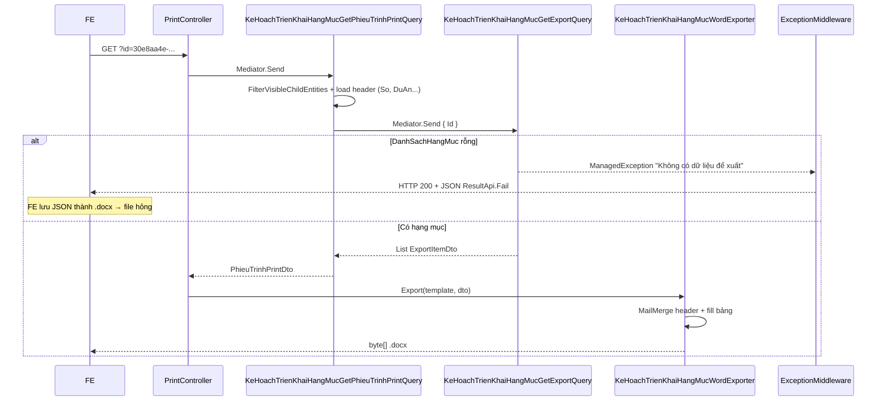

# Spec kỹ thuật — Fix print phiếu trình kế hoạch triển khai hạng mục

**Module:** QLDA  
**Ngày:** 2026-07-01  
**Trạng thái:** 📋 Phân tích xong — sẵn sàng implement  
**Pattern tham chiếu:** [phieu-trinh-word-spec.md](../9469/phieu-trinh-word-spec.md), `BanGiaoHoSoPrintQuery`, `WordHelper.ExportFromTemplate`

---

## Mục lục

1. [Tóm tắt vấn đề](#1-tóm-tắt-vấn-đề)
2. [Luồng code hiện tại](#2-luồng-code-hiện-tại)
3. [Phân tích root cause](#3-phân-tích-root-cause)
4. [Kế hoạch fix](#4-kế-hoạch-fix)
5. [Files cần sửa](#5-files-cần-sửa)
6. [Bước code chi tiết](#6-bước-code-chi-tiết)
7. [Test plan](#7-test-plan)
8. [Checklist trước merge](#8-checklist-trước-merge)

---

## 1. Tóm tắt vấn đề

### 1.1. Case test

| Thuộc tính | Giá trị |
|------------|---------|
| Endpoint | `GET /api/print/phieu-trinh-ke-hoach-trien-khai-hang-muc` |
| `id` | `30e8aa4e-4c4f-4c3d-8e0f-c419e941e44d` |
| Trạng thái | Đã duyệt |
| URL đầy đủ (IIS) | `http://192.168.1.12:9051/QuanLyDuAn/api/print/phieu-trinh-ke-hoach-trien-khai-hang-muc?id=...` |

### 1.2. Triệu chứng báo cáo

| # | Triệu chứng | Mức độ |
|---|-------------|--------|
| 1 | Message **"Không có dữ liệu để xuất"** | Blocker |
| 2 | File `.docx` tải về **không mở được** | Blocker |
| 3 | Placeholder `<So>`, `<NgayLap>`, `<DuAn>`, `<TrichYeu>` **không được điền** | Major |

### 1.3. Mapping placeholder yêu cầu

| Placeholder template | Nguồn entity | Format output |
|---------------------|--------------|---------------|
| `<So>` | `KeHoachTrienKhaiHangMuc.So` | Nguyên văn |
| `<NgayLap>` | `KeHoachTrienKhaiHangMuc.NgayToTrinh` | `Tphcm, ngày dd tháng MM năm yyyy` (UTC+7) |
| `<DuAn>` | `DuAn.MaDuAn` + `DuAn.TenDuAn` | `{MaDuAn} — {TenDuAn}` |
| `<TrichYeu>` | `KeHoachTrienKhaiHangMuc.TrichYeu` | Nguyên văn hoặc `""` |

---

## 2. Luồng code hiện tại



### 2.1. Files liên quan

| File | Vai trò |
|------|---------|
| `QLDA.WebApi/Controllers/PrintController.cs` | Endpoint `InPhieuTrinhKeHoachTrienKhaiHangMuc` (~L1414) |
| `QLDA.Application/.../KeHoachTrienKhaiHangMucGetPhieuTrinhPrintQuery.cs` | Load header + gọi export query |
| `QLDA.Application/.../KeHoachTrienKhaiHangMucGetExportQuery.cs` | Load `DanhSachHangMuc`, throw nếu rỗng |
| `QLDA.Infrastructure/Offices/KeHoachTrienKhaiHangMucWordExporter.cs` | Fill template Word |
| `QLDA.WebApi/PrintTemplates/Word/PhieuTrinhKeHoachTrienKhaiHangMuc.docx` | Template |
| `BuildingBlocks.Application/Middlewares/ExceptionMiddleware.cs` | `ManagedException` → HTTP 200 JSON |

### 2.2. Endpoint hiện tại

```csharp
[HttpGet("api/print/phieu-trinh-ke-hoach-trien-khai-hang-muc")]
[Authorize(Roles = RoleConstants.GroupKeHoachTrienKhaiHangMucExport)]
public async Task<IActionResult> InPhieuTrinhKeHoachTrienKhaiHangMuc([FromQuery] Guid id, ...)
{
    var dto = await Mediator.Send(new KeHoachTrienKhaiHangMucGetPhieuTrinhPrintQuery { Id = id }, ...);
    var bytes = _keHoachWordExporter.Export(templatePath, dto);
    return File(bytes, "application/vnd.openxmlformats-officedocument.wordprocessingml.document", ...);
}
```

**Khác biệt so với endpoint print khác:** `InPhieuTrinhPhanKhaiKinhPhi` có `try/catch` bọc ngoài; endpoint phiếu trình KH hạng mục **không có** — lỗi đi thẳng vào middleware.

---

## 3. Phân tích root cause

### 3.1. "Không có dữ liệu để xuất" + file không mở được

**Nguyên nhân trực tiếp (code):**

`KeHoachTrienKhaiHangMucGetExportQueryHandler` (L51):

```csharp
ManagedException.ThrowIf(hangMucs.Count == 0, "Không có dữ liệu để xuất");
```

`KeHoachTrienKhaiHangMucGetPhieuTrinhPrintQuery` gọi export query **sau khi** đã load được header → nghĩa là kế hoạch **tồn tại + pass auth**, nhưng `DanhSachHangMuc` trả về **rỗng**.

**Nguyên nhân file hỏng:**

`ExceptionMiddleware` (L26–28) bắt `ManagedException` và trả:

- `HTTP 200`
- `Content-Type: application/json`
- Body: `ResultApi.Fail("Không có dữ liệu để xuất")`

FE thường coi mọi `200` từ endpoint print là file binary → lưu JSON thành `.docx` → **Word không mở được**.

> Đây là coupling FE/BE: backend trả lỗi đúng convention project (ManagedException = 200 JSON), nhưng endpoint print cần xử lý riêng hoặc FE phải check `Content-Type`.

**Nguyên nhân có thể khiến `DanhSachHangMuc` rỗng (cần verify với ID test):**

| # | Giả thuyết | Cách kiểm tra |
|---|-----------|---------------|
| A | Bản ghi thật sự không có hạng mục trong DB | `SELECT COUNT(*) FROM HangMucKeHoach WHERE KeHoachId = '30e8aa4e-...' AND IsDeleted = 0` |
| B | Hạng mục bị soft-delete (`IsDeleted = 1`) | Query trên + so với màn chi tiết |
| C | Màn chi tiết dùng `KeHoachTrienKhaiHangMucGetQuery` **không filter auth** trong khi print dùng `FilterVisibleChildEntities` | So sánh 2 query với cùng user/token |
| D | `Include(DanhSachHangMuc)` trong export query bị global filter loại child | Kiểm tra EF query log |
| E | Import tạo kế hoạch không gắn hạng mục (chỉ header tờ trình) | Xem `KeHoachTrienKhaiHangMucImportRangeCommand` |

**Lưu ý:** Export **không** lọc theo `TrangThaiId` — trạng thái "đã duyệt" **không phải** nguyên nhân trực tiếp trong code. Vấn đề là **danh sách hạng mục rỗng** hoặc **response lỗi bị FE parse nhầm**.

### 3.2. Placeholder header không được điền

**Code hiện tại** — `KeHoachTrienKhaiHangMucWordExporter.FillHeaderFields`:

```csharp
doc.MailMerge.UseNonMergeFields = true;
var replacements = new Dictionary<string, string> {
    { "So", dto.So },
    { "NgayLap", FormatNgayLap(dto.NgayToTrinh) },
    { "DuAn", dto.DuAnDisplay },
    { "TrichYeu", dto.TrichYeu ?? string.Empty },
};
foreach (var (key, value) in replacements)
    doc.MailMerge.Execute([key], [value]);
```

**Vấn đề kỹ thuật:**

| # | Vấn đề | Giải thích |
|---|--------|------------|
| 1 | MailMerge vs placeholder `<So>` | `UseNonMergeFields = true` tìm field dạng `«So»` hoặc MERGEFIELD. Template dùng `<So>` — **có thể không khớp** tùy cách Word lưu XML (đặc biệt file convert từ `.doc` gốc). |
| 2 | Placeholder bị split runs | Khi BA chỉnh sửa template trong Word, chuỗi `<So>` có thể bị tách thành nhiều `<w:t>` run → MailMerge **bỏ qua im lặng**. |
| 3 | Không dùng `Range.Replace` | Cùng module đã có precedent trong `WriteTemplateFromReference` dùng `doc.Range.Replace(...)` — reliable hơn cho plain text placeholder. |

**DTO đã map đủ field** trong `KeHoachTrienKhaiHangMucGetPhieuTrinhPrintQuery` — vấn đề nằm ở **tầng Word exporter**, không phải Application query.

### 3.3. Tóm tắt 3 triệu chứng → 2 nhóm fix

```
Triệu chứng 1 + 2  →  Nhóm A: Validation + error response cho endpoint print
Triệu chứng 3      →  Nhóm B: Đổi cơ chế fill header từ MailMerge sang Range.Replace
```

---

## 4. Kế hoạch fix

### 4.1. Nhóm A — Dữ liệu & error handling

#### A1. Tối ưu load dữ liệu trong print query (khuyến nghị)

Thay vì gọi lại `KeHoachTrienKhaiHangMucGetExportQuery` (query DB lần 2), **load một lần** trong print handler:

```
1. FilterVisibleChildEntities + Include(DuAn) + Include(DanhSachHangMuc)
2. ThrowIfNull → "Không tìm thấy dữ liệu"
3. Map header → PhieuTrinhPrintDto
4. Map rows qua KeHoachTrienKhaiHangMucExportMapper (reuse logic từ export handler)
5. ThrowIf rows.Count == 0 → message rõ ràng theo ngữ cảnh phiếu trình
```

**Message đề xuất khi không có hạng mục:**

```
"Kế hoạch triển khai không có hạng mục công việc để xuất phiếu trình"
```

Phân biệt với Excel bulk export (`"Không có dữ liệu để xuất"`) — giúp BA/QA hiểu nguyên nhân.

#### A2. Validate trước khi gọi Word exporter

Trong `PrintController` hoặc print query handler — **không gọi** `_keHoachWordExporter.Export` nếu `dto.Rows` rỗng. Throw `ManagedException` với message ở A1.

#### A3. Tránh FE tải file lỗi (phối hợp BE + FE)

**Backend (tùy chọn, nếu team chấp nhận đổi convention cho print):**

- Bọc endpoint print trong filter/action trả `400` + JSON khi `ManagedException` (giống một số endpoint khác dùng `ProducesResponseType 400`).
- Hoặc giữ 200 JSON nhưng document rõ: **FE phải check `Content-Type`** trước khi `blob` download.

**Frontend (khuyến nghị song song):**

```typescript
// Pseudo-code
const res = await fetch(url, { headers: { Authorization: `Bearer ${token}` } });
const contentType = res.headers.get('Content-Type') ?? '';
if (contentType.includes('application/json')) {
  const err = await res.json();
  throw new Error(err.errorMessage ?? 'Xuất phiếu trình thất bại');
}
const blob = await res.blob();
// save as .docx
```

### 4.2. Nhóm B — Map placeholder header

Đổi `FillHeaderFields` sang **`doc.Range.Replace`** với placeholder đầy đủ bao gồm dấu `<>`:

```csharp
private static void FillHeaderFields(Document doc, KeHoachTrienKhaiHangMucPhieuTrinhPrintDto dto)
{
    var map = new Dictionary<string, string>
    {
        ["<So>"] = dto.So ?? string.Empty,
        ["<NgayLap>"] = FormatNgayLap(dto.NgayToTrinh),
        ["<DuAn>"] = dto.DuAnDisplay ?? string.Empty,
        ["<TrichYeu>"] = dto.TrichYeu ?? string.Empty,
    };

    foreach (var (placeholder, value) in map)
        doc.Range.Replace(placeholder, value, new FindReplaceOptions(FindReplaceDirection.Forward));
}
```

**Lý do chọn `Range.Replace`:**

- Khớp đúng chuỗi `<So>` trong template (`WriteDefaultTemplate` / `WriteTemplateFromReference` đều dùng format này).
- Aspose `Replace` xử lý split-run tốt hơn MailMerge cho plain text.
- Không ảnh hưởng bảng hạng mục (fill programmatic sau header).

**Fallback (nếu template cũ dùng key không có `<>`):** replace cả `"So"` không có bracket — chỉ khi QA xác nhận template production.

### 4.3. Không thay đổi

| Hạng mục | Lý do |
|----------|-------|
| Entity / migration | Field đã đủ |
| Template `.docx` layout | Chỉ cần placeholder đúng format; không đổi layout |
| Role auth | Giữ `GroupKeHoachTrienKhaiHangMucExport` |
| Logic bảng hạng mục | `FillHangMucTable` hoạt động độc lập header |

---

## 5. Files cần sửa

| # | File | Hành động |
|---|------|-----------|
| 1 | `QLDA.Application/KeHoachTrienKhaiHangMuc/KeHoachTrienKhaiHangMucExportRowLoader.cs` | **Tạo mới** — extract logic map hạng mục → export rows |
| 2 | `QLDA.Application/.../KeHoachTrienKhaiHangMucGetExportQuery.cs` | Refactor dùng `ExportRowLoader` |
| 3 | `QLDA.Application/.../KeHoachTrienKhaiHangMucGetPhieuTrinhPrintQuery.cs` | Load `DanhSachHangMuc` 1 lần + message lỗi riêng |
| 4 | `QLDA.Infrastructure/Offices/KeHoachTrienKhaiHangMucWordExporter.cs` | `Range.Replace` cho 4 placeholder header |
| 5 | `QLDA.Tests/Integration/KeHoachTrienKhaiHangMucPhieuTrinhPrintTests.cs` | **Tạo mới** — integration test |
| — | `PrintController.cs` | **Không bắt buộc** sửa (validation đã ở Application) |
| — | Entity / migration / template `.docx` | **Không sửa** |

---

## 6. Bước code chi tiết

> **Thứ tự implement:** `ExportRowLoader` → refactor ExportQuery → sửa PrintQuery → sửa WordExporter → Test → Build → curl QA.

### Bước 1 — Tạo `KeHoachTrienKhaiHangMucExportRowLoader`

**File mới:** `QLDA.Application/KeHoachTrienKhaiHangMuc/KeHoachTrienKhaiHangMucExportRowLoader.cs`

Extract `MapToExportRowsAsync` từ export handler để **print query và export query dùng chung**, tránh duplicate ~60 dòng lookup `DanhMucGiaiDoan` / `DmDonVi` / `UserMaster`.

```csharp
using BuildingBlocks.Domain.Entities;
using Microsoft.EntityFrameworkCore;
using QLDA.Application.KeHoachTrienKhaiHangMucs.DTOs;
using QLDA.Domain.Entities;
using QLDA.Domain.Entities.DanhMuc;

namespace QLDA.Application.KeHoachTrienKhaiHangMucs;

/// <summary>
/// Map danh sách HangMucKeHoach → export rows (group theo giai đoạn).
/// Dùng chung cho Excel export và Word phiếu trình.
/// </summary>
internal static class KeHoachTrienKhaiHangMucExportRowLoader
{
    public static async Task<List<KeHoachTrienKhaiHangMucExportItemDto>> LoadAsync(
        IReadOnlyList<HangMucKeHoach> hangMucs,
        IRepository<DanhMucGiaiDoan, int> giaiDoanRepo,
        IRepository<DmDonVi, long> donViRepo,
        IRepository<UserMaster, long> userRepo,
        CancellationToken cancellationToken = default)
    {
        if (hangMucs.Count == 0)
            return [];

        var giaiDoanIds = hangMucs
            .Where(h => h.GiaiDoanId.HasValue)
            .Select(h => h.GiaiDoanId!.Value)
            .Distinct()
            .ToList();

        var giaiDoans = giaiDoanIds.Count == 0
            ? []
            : await giaiDoanRepo.GetQueryableSet()
                .AsNoTracking()
                .Where(g => giaiDoanIds.Contains(g.Id))
                .ToListAsync(cancellationToken);

        var donViIds = hangMucs
            .SelectMany(h => Enumerable.Empty<long?>()
                .Append(h.DonViChuTriId)
                .Concat((h.DonViPhoiHopIds ?? []).Select(id => (long?)id)))
            .Where(id => id.HasValue)
            .Select(id => id!.Value)
            .Distinct()
            .ToList();

        var donVis = donViIds.Count == 0
            ? []
            : await donViRepo.GetQueryableSet()
                .AsNoTracking()
                .Where(d => donViIds.Contains(d.Id))
                .Select(d => new { d.Id, d.TenDonVi })
                .ToListAsync(cancellationToken);

        var userIds = hangMucs
            .SelectMany(h => Enumerable.Empty<long?>()
                .Append(h.CanBoChuTriId)
                .Concat((h.CanBoPhoiHopIds ?? []).Select(id => (long?)id)))
            .Where(id => id.HasValue)
            .Select(id => id!.Value)
            .Distinct()
            .ToList();

        var users = userIds.Count == 0
            ? []
            : await userRepo.GetQueryableSet()
                .AsNoTracking()
                .Where(u => userIds.Contains(u.Id))
                .Select(u => new { u.Id, u.HoTen })
                .ToListAsync(cancellationToken);

        return KeHoachTrienKhaiHangMucExportMapper.ToExportRows(
            hangMucs,
            giaiDoans.ToDictionary(g => g.Id, g => g.Ten ?? string.Empty),
            giaiDoans.ToDictionary(g => g.Id, g => g.Stt ?? int.MaxValue - 1),
            donVis.ToDictionary(d => d.Id, d => d.TenDonVi ?? string.Empty),
            users.ToDictionary(u => u.Id, u => u.HoTen ?? string.Empty));
    }
}
```

---

### Bước 2 — Refactor `KeHoachTrienKhaiHangMucGetExportQuery`

**File:** `QLDA.Application/KeHoachTrienKhaiHangMuc/Queries/KeHoachTrienKhaiHangMucGetExportQuery.cs`

**2a.** Thay `MapToExportRowsAsync` bằng gọi loader:

```csharp
// Trong Handle(), sau khi có hangMucs:
return await KeHoachTrienKhaiHangMucExportRowLoader.LoadAsync(
    hangMucs,
    _giaiDoanRepo,
    _donViRepo,
    _userRepo,
    cancellationToken);
```

**2b.** **Xóa** private method `MapToExportRowsAsync` (đã chuyển sang loader).

> Export Excel **giữ nguyên** message `"Không có dữ liệu để xuất"` — không đổi behavior bulk export.

---

### Bước 3 — Sửa `KeHoachTrienKhaiHangMucGetPhieuTrinhPrintQuery`

**File:** `QLDA.Application/KeHoachTrienKhaiHangMuc/Queries/KeHoachTrienKhaiHangMucGetPhieuTrinhPrintQuery.cs`

**Thay toàn bộ handler** — bỏ `IMediator`, load một lần, message lỗi theo ngữ cảnh phiếu trình:

```csharp
using Microsoft.EntityFrameworkCore;
using BuildingBlocks.Domain.Entities;
using QLDA.Application.Authorization;
using QLDA.Application.KeHoachTrienKhaiHangMucs;
using QLDA.Application.KeHoachTrienKhaiHangMucs.DTOs;
using QLDA.Domain.Entities;
using QLDA.Domain.Entities.DanhMuc;

namespace QLDA.Application.KeHoachTrienKhaiHangMucs.Queries;

public record KeHoachTrienKhaiHangMucGetPhieuTrinhPrintQuery : IRequest<KeHoachTrienKhaiHangMucPhieuTrinhPrintDto>
{
    public Guid Id { get; set; }
}

internal class KeHoachTrienKhaiHangMucGetPhieuTrinhPrintQueryHandler(IServiceProvider serviceProvider)
    : IRequestHandler<KeHoachTrienKhaiHangMucGetPhieuTrinhPrintQuery, KeHoachTrienKhaiHangMucPhieuTrinhPrintDto>
{
    private const string NoHangMucMessage =
        "Kế hoạch triển khai không có hạng mục công việc để xuất phiếu trình";

    private readonly IRepository<KeHoachTrienKhaiHangMuc, Guid> _keHoachRepo =
        serviceProvider.GetRequiredService<IRepository<KeHoachTrienKhaiHangMuc, Guid>>();
    private readonly IRepository<DuAnBuoc, int> _duAnBuocRepo =
        serviceProvider.GetRequiredService<IRepository<DuAnBuoc, int>>();
    private readonly IRepository<DanhMucGiaiDoan, int> _giaiDoanRepo =
        serviceProvider.GetRequiredService<IRepository<DanhMucGiaiDoan, int>>();
    private readonly IRepository<DmDonVi, long> _donViRepo =
        serviceProvider.GetRequiredService<IRepository<DmDonVi, long>>();
    private readonly IRepository<UserMaster, long> _userRepo =
        serviceProvider.GetRequiredService<IRepository<UserMaster, long>>();
    private readonly IBuocAuthorizationProvider _buocAuth =
        serviceProvider.GetRequiredService<IBuocAuthorizationProvider>();
    private readonly IAuthorizationContext _authContext =
        serviceProvider.GetRequiredService<IAuthorizationContext>();

    public async Task<KeHoachTrienKhaiHangMucPhieuTrinhPrintDto> Handle(
        KeHoachTrienKhaiHangMucGetPhieuTrinhPrintQuery request,
        CancellationToken cancellationToken = default)
    {
        var keHoach = await _buocAuth.FilterVisibleChildEntities(
                _keHoachRepo.GetQueryableSet(),
                _duAnBuocRepo,
                _authContext,
                e => e.BuocId)
            .AsNoTracking()
            .Include(e => e.DuAn)
            .Include(e => e.DanhSachHangMuc)
            .FirstOrDefaultAsync(e => e.Id == request.Id, cancellationToken);

        ManagedException.ThrowIfNull(keHoach, "Không tìm thấy dữ liệu");

        var hangMucs = keHoach.DanhSachHangMuc?.ToList() ?? [];
        ManagedException.ThrowIf(hangMucs.Count == 0, NoHangMucMessage);

        var rows = await KeHoachTrienKhaiHangMucExportRowLoader.LoadAsync(
            hangMucs,
            _giaiDoanRepo,
            _donViRepo,
            _userRepo,
            cancellationToken);

        ManagedException.ThrowIf(rows.Count == 0, NoHangMucMessage);

        return new KeHoachTrienKhaiHangMucPhieuTrinhPrintDto
        {
            So = keHoach.So,
            NgayToTrinh = keHoach.NgayToTrinh,
            TrichYeu = keHoach.TrichYeu,
            MaDuAn = keHoach.DuAn?.MaDuAn,
            TenDuAn = keHoach.DuAn?.TenDuAn,
            DuAnDisplay = BuildDuAnDisplay(keHoach.DuAn?.MaDuAn, keHoach.DuAn?.TenDuAn),
            Rows = rows,
        };
    }

    private static string BuildDuAnDisplay(string? maDuAn, string? tenDuAn)
    {
        if (!string.IsNullOrWhiteSpace(maDuAn) && !string.IsNullOrWhiteSpace(tenDuAn))
            return $"{maDuAn} — {tenDuAn}";

        return maDuAn ?? tenDuAn ?? string.Empty;
    }
}
```

**Điểm quan trọng:**

| Trước | Sau |
|-------|-----|
| Query DB 2 lần (header + export query) | Query DB 1 lần |
| Gọi `KeHoachTrienKhaiHangMucGetExportQuery` → message generic | Message riêng phiếu trình |
| Không `Include(DanhSachHangMuc)` ở print query | Include ngay từ đầu |

---

### Bước 4 — Sửa `KeHoachTrienKhaiHangMucWordExporter.FillHeaderFields`

**File:** `QLDA.Infrastructure/Offices/KeHoachTrienKhaiHangMucWordExporter.cs`

**4a.** Thêm `using` (nếu chưa có):

```csharp
using Aspose.Words.Replacing;
```

**4b.** Thay method `FillHeaderFields`:

```csharp
private static void FillHeaderFields(Document doc, KeHoachTrienKhaiHangMucPhieuTrinhPrintDto dto)
{
    var replacements = new Dictionary<string, string>
    {
        ["<So>"] = dto.So ?? string.Empty,
        ["<NgayLap>"] = FormatNgayLap(dto.NgayToTrinh),
        ["<DuAn>"] = dto.DuAnDisplay ?? string.Empty,
        ["<TrichYeu>"] = dto.TrichYeu ?? string.Empty,
    };

    var options = new FindReplaceOptions(FindReplaceDirection.Forward);

    foreach (var (placeholder, value) in replacements)
        doc.Range.Replace(placeholder, value, options);
}
```

**4c.** **Xóa** các dòng MailMerge trong method này:

```csharp
// ❌ XÓA — không dùng MailMerge cho header nữa
doc.MailMerge.UseNonMergeFields = true;
doc.MailMerge.Execute([key], [value]);
```

> `FillHangMucTable`, `FormatNgayLap`, `Export()` — **giữ nguyên**.

**Verify nhanh sau Bước 4** (unit smoke, không cần DB):

```csharp
// Trong test hoặc scratch — mở template, fill, save, search text
var exporter = new KeHoachTrienKhaiHangMucWordExporter(asposeHelper);
var bytes = exporter.Export(templatePath, new KeHoachTrienKhaiHangMucPhieuTrinhPrintDto
{
    So = "TTr-42/2025",
    NgayToTrinh = new DateTimeOffset(2025, 3, 10, 0, 0, 0, TimeSpan.FromHours(7)),
    DuAnDisplay = "DA-2025-01 — Nâng cấp hệ thống",
    TrichYeu = "Kế hoạch triển khai năm 2025",
    Rows = [/* ít nhất 1 item row để không lỗi bảng */],
});
// Mở file → không còn literal "<So>", "<NgayLap>", ...
```

---

### Bước 5 — `PrintController` (không bắt buộc)

**File:** `QLDA.WebApi/Controllers/PrintController.cs`

Endpoint hiện tại **đủ dùng** nếu validation đã ở print query (Bước 3). Không cần `try/catch` thêm trừ khi muốn log riêng.

Giữ nguyên:

```csharp
var dto = await Mediator.Send(
    new KeHoachTrienKhaiHangMucGetPhieuTrinhPrintQuery { Id = id },
    cancellationToken);

var bytes = _keHoachWordExporter.Export(templatePath, dto);

return File(bytes,
    "application/vnd.openxmlformats-officedocument.wordprocessingml.document",
    GetDownloadFileName(fileNameTemplate));
```

---

### Bước 6 — Integration test

**File mới:** `QLDA.Tests/Integration/KeHoachTrienKhaiHangMucPhieuTrinhPrintTests.cs`

```csharp
using System.Net;
using System.Net.Http.Json;
using BuildingBlocks.Application.Common.DTOs;
using FluentAssertions;
using QLDA.Tests.Fixtures;
using Xunit;

namespace QLDA.Tests.Integration;

[Collection("WebApi")]
public class KeHoachTrienKhaiHangMucPhieuTrinhPrintTests(WebApiFixture fixture)
{
    private const string TestKeHoachId = "30e8aa4e-4c4f-4c3d-8e0f-c419e941e44d";
    private HttpClient AuthedClient => fixture.CreateAuthenticatedClient();

    [Fact]
    public async Task Print_WithValidId_ReturnsDocxOrManagedError()
    {
        var response = await AuthedClient.GetAsync(
            $"/api/print/phieu-trinh-ke-hoach-trien-khai-hang-muc?id={TestKeHoachId}");

        response.StatusCode.Should().Be(HttpStatusCode.OK);

        var contentType = response.Content.Headers.ContentType?.MediaType ?? string.Empty;

        if (contentType.Contains("json", StringComparison.OrdinalIgnoreCase))
        {
            var body = await response.Content.ReadFromJsonAsync<ResultApi>();
            body.Should().NotBeNull();
            body!.IsSuccess.Should().BeFalse();
            body.ErrorMessage.Should().NotBeNullOrWhiteSpace();
            return;
        }

        contentType.Should()
            .Be("application/vnd.openxmlformats-officedocument.wordprocessingml.document");

        var bytes = await response.Content.ReadAsByteArrayAsync();
        bytes.Should().NotBeEmpty();
        bytes[0].Should().Be(0x50); // 'P' — ZIP/docx magic
        bytes[1].Should().Be(0x4B); // 'K'
    }

    [Fact]
    public async Task Print_WithEmptyGuid_ReturnsError()
    {
        var response = await AuthedClient.GetAsync(
            "/api/print/phieu-trinh-ke-hoach-trien-khai-hang-muc?id=00000000-0000-0000-0000-000000000000");

        response.StatusCode.Should().Be(HttpStatusCode.OK);
        var body = await response.Content.ReadFromJsonAsync<ResultApi>();
        body!.IsSuccess.Should().BeFalse();
    }
}
```

> Test chấp nhận cả docx lẫn JSON lỗi — phù hợp môi trường CI có/không có seed data ID test.

---

### Bước 7 — Build & verify

```powershell
# Build
cd e:\SER
dotnet build QLDA.sln -c Release

# Unit + integration (nếu có DB test)
dotnet test QLDA.Tests\QLDA.Tests.csproj --filter "FullyQualifiedName~KeHoachTrienKhaiHangMucPhieuTrinh"

# Manual QA — ID test
curl -s -D - ^
  "http://192.168.1.12:9051/QuanLyDuAn/api/print/phieu-trinh-ke-hoach-trien-khai-hang-muc?id=30e8aa4e-4c4f-4c3d-8e0f-c419e941e44d" ^
  -H "Authorization: Bearer <JWT_TOKEN>" ^
  -o phieu-trinh-test.docx
```

**Kỳ vọng sau fix:**

| Check | Kỳ vọng |
|-------|---------|
| Response header | `Content-Type: application/vnd.openxmlformats-officedocument.wordprocessingml.document` |
| File magic | `PK` (bytes 0x50 0x4B) |
| Word mở được | Có |
| Không còn `<So>`, `<NgayLap>`, `<DuAn>`, `<TrichYeu>` literal | Có |
| Bảng hạng mục | Group A/B/C + dòng chi tiết |
| Không có hạng mục | JSON `ResultApi` fail, message `Kế hoạch triển khai không có hạng mục...` |

**Nếu vẫn lỗi sau Bước 3–4** — chạy SQL verify (mục 7.2):

```sql
SELECT COUNT(*) AS HangMucCount
FROM HangMucKeHoach
WHERE KeHoachId = '30e8aa4e-4c4f-4c3d-8e0f-c419e941e44d'
  AND IsDeleted = 0;
```

| `HangMucCount` | Hành động |
|----------------|-----------|
| `0` | Lỗi dữ liệu — import/backfill hạng mục; API message đúng |
| `> 0` | Review lại auth / Include — không phải bug trạng thái duyệt |

---

### Bước 8 (tùy chọn) — FE: tránh tải file lỗi

Nếu BE vẫn trả `ManagedException` = HTTP 200 JSON (convention project), FE **bắt buộc** check `Content-Type` trước khi save blob:

```typescript
async function downloadPhieuTrinhKeHoach(keHoachId: string, token: string) {
  const res = await fetch(
    `/QuanLyDuAn/api/print/phieu-trinh-ke-hoach-trien-khai-hang-muc?id=${keHoachId}`,
    { headers: { Authorization: `Bearer ${token}` } },
  );

  const contentType = res.headers.get('Content-Type') ?? '';

  if (contentType.includes('application/json')) {
    const err = await res.json();
    throw new Error(err.errorMessage ?? 'Xuất phiếu trình thất bại');
  }

  const blob = await res.blob();
  // trigger download .docx
}
```

---

## 7. Test plan

### 7.1. Case chính — ID đã cung cấp

```bash
# 1. Export thành công
curl -s -D - \
  'http://192.168.1.12:9051/QuanLyDuAn/api/print/phieu-trinh-ke-hoach-trien-khai-hang-muc?id=30e8aa4e-4c4f-4c3d-8e0f-c419e941e44d' \
  -H 'Authorization: Bearer <JWT_TOKEN>' \
  -o phieu-trinh-test.docx

# Kiểm tra header response
# Expect: Content-Type: application/vnd.openxmlformats-officedocument.wordprocessingml.document

# Kiểm tra file
# Expect: file magic PK (zip/docx), mở được Word
# Expect: không còn chuỗi literal <So>, <NgayLap>, <DuAn>, <TrichYeu>
```

### 7.2. Verify dữ liệu DB (nếu case chính vẫn lỗi sau fix placeholder)

```sql
-- Kế hoạch
SELECT Id, So, NgayToTrinh, TrichYeu, TrangThaiId, BuocId, DuAnId, IsDeleted
FROM KeHoachTrienKhaiHangMuc
WHERE Id = '30e8aa4e-4c4f-4c3d-8e0f-c419e941e44d';

-- Hạng mục
SELECT Id, TenHangMuc, GiaiDoanId, IsDeleted
FROM HangMucKeHoach
WHERE KeHoachId = '30e8aa4e-4c4f-4c3d-8e0f-c419e941e44d';
```

| Kết quả SQL | Hành động |
|-------------|-----------|
| `HangMucKeHoach` count = 0 | Lỗi dữ liệu — cần backfill hoặc import lại hạng mục; API trả message A1 |
| `HangMucKeHoach` count > 0 | Fix code load/mapping; không phải lỗi nghiệp vụ trạng thái duyệt |

### 7.3. Matrix test bổ sung

| # | Scenario | Kỳ vọng |
|---|----------|---------|
| 1 | Kế hoạch đã duyệt, có hạng mục | 200 + docx hợp lệ, header + bảng đầy đủ |
| 2 | Kế hoạch dự thảo, có hạng mục | Giống #1 (không lọc trạng thái) |
| 3 | Kế hoạch không có hạng mục | JSON lỗi rõ, **không** có file docx |
| 4 | `id` không tồn tại / không có quyền | `"Không tìm thấy dữ liệu"` |
| 5 | User không đủ role export | 401/403 |
| 6 | So sánh với Excel cùng `id` | `GET /api/print/ke-hoach-trien-khai-hang-muc?id=...` cũng có dữ liệu |

### 7.4. Visual QA (Word)

Mở file output, kiểm tra:

- [ ] Số phiếu trình hiển thị đúng (không còn `<So>`)
- [ ] Ngày lập format `Tphcm, ngày dd tháng MM năm yyyy`
- [ ] Dự án format `MA — Tên dự án`
- [ ] Trích yếu đúng nội dung
- [ ] Bảng hạng mục có group A/B/C + dòng chi tiết
- [ ] Group row in đậm STT + Giai đoạn

---

## 8. Checklist trước merge

### Application
- [ ] `KeHoachTrienKhaiHangMucGetPhieuTrinhPrintQuery` load `DanhSachHangMuc` một lần
- [ ] Message lỗi riêng khi không có hạng mục (phiếu trình)
- [ ] Không duplicate logic mapper — reuse `KeHoachTrienKhaiHangMucExportMapper`

### Infrastructure
- [ ] `FillHeaderFields` dùng `Range.Replace` cho `<So>`, `<NgayLap>`, `<DuAn>`, `<TrichYeu>`
- [ ] Không regression bảng hạng mục

### WebApi
- [ ] Endpoint vẫn trả docx khi thành công
- [ ] (Tùy chọn) Document FE check Content-Type

### QA
- [ ] Test ID `30e8aa4e-4c4f-4c3d-8e0f-c419e941e44d` pass
- [ ] File lỗi không còn xảy ra khi không có dữ liệu
- [ ] Excel export cùng ID vẫn hoạt động (regression)

### Không làm
- [ ] Sửa migration / entity
- [ ] Đổi template layout Word (trừ khi placeholder sai format)
- [ ] Tạo Model WebApi mới

---

## Phụ lục — So sánh với spec #9469

| Khía cạnh | Spec #9469 | Thực tế / fix |
|-----------|------------|---------------|
| Placeholder | `<So>`, `<NgayLap>`, `<DuAn>`, `<TrichYeu>` | Code dùng MailMerge key không có `<>` → **fix Range.Replace** |
| Lỗi không data | HTTP 400 | Project convention ManagedException = 200 JSON → **cần FE check Content-Type** |
| Trạng thái duyệt | Mọi trạng thái | Code không filter trạng thái — đúng spec |
| Throw empty rows | Trong print query | Hiện throw ở export query — **chuyển về print query + message rõ** |
