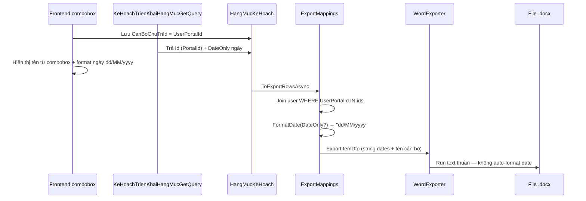

# Spec kỹ thuật — Fix triệt để phiếu trình KH triển khai hạng mục

**Module:** QLDA  
**Trạng thái:** ✅ **IMPLEMENTED**  
**Effort:** ~1h (BE only, không migration)  
**Ngày:** 2026-07-08

---

## Mục lục

1. [Tóm tắt](#1-tóm-tắt)
2. [Luồng dữ liệu UI vs Print](#2-luồng-dữ-liệu-ui-vs-print)
3. [Root cause](#3-root-cause)
4. [Các bước code](#4-các-bước-code)
5. [Thay đổi đã implement](#5-thay-đổi-đã-implement)
6. [Test plan & kết quả](#6-test-plan--kết-quả)
7. [Checklist trước merge](#7-checklist-trước-merge)

---

## 1. Tóm tắt

### 1.1 API

| Thuộc tính | Giá trị |
| ---------- | ------- |
| Method | `GET` |
| URL | `/api/print/phieu-trinh-ke-hoach-trien-khai-hang-muc` |
| Param | `id` — `Guid` kế hoạch triển khai |
| Controller | `PrintController.InPhieuTrinhKeHoachTrienKhaiHangMuc` |
| Output | Word `.docx` |

### 1.2 Yêu cầu BA

| Cột | Trước fix | Sau fix |
| --- | --------- | ------- |
| **Bắt đầu** | `2026-07-08` | `08/07/2026` |
| **Kết thúc** | `2026-07-28` | `28/07/2026` |
| **Cán bộ chủ trì** | Sai người (join `UserMaster.Id`) | Khớp UI |
| **Cán bộ phối hợp** | Sai người | Khớp UI |

**Ràng buộc:**

- Format ngày khi **map** dữ liệu in — không truyền `DateTime`/`DateOnly` vào template.
- `null` → chuỗi rỗng; không in `01/01/0001`.
- Print phải dùng **cùng logic ID** với UI combobox (`UserPortalId`).

---

## 2. Luồng dữ liệu UI vs Print



### 2.1 Đối chiếu ID cán bộ

| Tầng | Field lưu | Join / lookup |
| ---- | --------- | ------------- |
| **UI combobox** | `UserMasterDto.Id = UserPortalId` | `UserMasterGetComboboxQueryHandler` |
| **Form save** | `HangMucKeHoach.CanBoChuTriId` | Giá trị từ combobox = PortalId |
| **Import Excel** | `CanBoChuTriId = chuTriUser.PortalId` | `ImportRangeCommand` (sau fix #import-can-bo-map) |
| **Print (sai cũ)** | `userIds.Contains(u.Id)` | Map nhầm sang user khác có cùng số PK |
| **Print (đúng)** | `userIds.Contains(u.UserPortalId.Value)` | Khớp UI |

**Ví dụ bug:**

```csharp
// ❌ Sai — nếu CanBoChuTriId đang là UserPortalId
.Where(u => userIds.Contains(u.Id))

// ✅ Đúng
.Where(u => u.UserPortalId.HasValue && userIds.Contains(u.UserPortalId.Value))
```

### 2.2 Files trong luồng

| Tầng | File | Vai trò |
| ---- | ---- | ------- |
| Domain | `HangMucKeHoach.cs` | `DateOnly?`, `CanBoChuTriId` — không đổi |
| Application | `KeHoachTrienKhaiHangMucExportMappings.cs` | Format ngày + lookup PortalId |
| Application | `KeHoachTrienKhaiHangMucExportItemDto.cs` | `NgayBatDau`/`NgayKetThuc` = `string?` |
| Application | `KeHoachTrienKhaiHangMucGetPhieuTrinhPrintQuery.cs` | Load + gọi `ToExportRowsAsync` |
| Infrastructure | `KeHoachTrienKhaiHangMucWordExporter.cs` | Bind string vào cell |
| BuildingBlocks | `UserMasterGetComboboxQueryHandler.cs` | UI: `Id = UserPortalId` |

---

## 3. Root cause

### 3.1 Ngày sai format

**Hai lớp nguyên nhân (fix theo thứ tự):**

1. **WordExporter** (fix lần 1): `FormatDate` hard-code `"yyyy-MM-dd"`.
2. **Export DTO** (fix triệt để): vẫn truyền `DateTime?` — Aspose/serialization có thể render ISO trước khi Word format.

**Giải pháp triệt để:** format tại `ExportMappings`, DTO chỉ chứa `string`.

```csharp
internal static string FormatDate(DateOnly? value) =>
    value.HasValue ? value.Value.ToString("dd/MM/yyyy") : string.Empty;
```

### 3.2 Cán bộ sai người

| Giả thuyết | Kết quả |
| ---------- | ------- |
| Thứ tự hạng mục in sai | ❌ Không phải — tên sai người khác hẳn |
| Join theo `UserMaster.Id` | ✅ **Root cause** — PortalId ≠ MasterId |
| DB lưu sai ID | ⚠️ Dữ liệu cũ (pre-import-fix) có thể vẫn là MasterId |

### 3.3 Không phải nguyên nhân

| Giả thuyết | Kết quả |
| ---------- | ------- |
| Template Word có DATE field | ❌ Bảng fill bằng `Run` text thuần |
| `GetQuery` trả tên cán bộ | ❌ Chỉ trả ID — FE resolve từ combobox |
| Excel export sai | ❌ Cùng `ExportMappings` — đồng bộ sau fix |

---

## 4. Các bước code

Thứ tự sửa **bắt buộc** theo dependency: DTO → Mapping → WordExporter → Unit test.

| Bước | File | Mục tiêu |
| ---- | ---- | -------- |
| 1 | `KeHoachTrienKhaiHangMucExportItemDto.cs` | Ngày = `string?`, không còn date object |
| 2 | `KeHoachTrienKhaiHangMucExportMappings.cs` | `FormatDate` + lookup `UserPortalId` |
| 3 | `KeHoachTrienKhaiHangMucWordExporter.cs` | Bind plain string; xóa `FormatDate(DateTime?)` |
| 4 | `KeHoachTrienKhaiHangMucExportMappingsTests.cs` | Cover ngày + cán bộ |
| 5 | (tuỳ chọn) `KeHoachTrienKhaiHangMucWordExporterTests.cs` | Xóa nếu chỉ test `FormatDate` cũ |

**Không sửa:** entity `HangMucKeHoach`, migration, template `.docx`, `GetPhieuTrinhPrintQuery` (đã gọi `ToExportRowsAsync`).

---

### Bước 1 — Đổi kiểu ngày trên DTO export

**File:** `QLDA.Application/KeHoachTrienKhaiHangMuc/DTOs/KeHoachTrienKhaiHangMucExportItemDto.cs`

**Trước:**

```csharp
public DateTime? NgayBatDau { get; set; }
public DateTime? NgayKetThuc { get; set; }
```

**Sau:**

```csharp
public string? NgayBatDau { get; set; }
public string? NgayKetThuc { get; set; }
```

> Lý do: không truyền `DateTime`/`DateOnly` vào Word/Aspose — format sẵn tại Application layer.

---

### Bước 2 — Format ngày + lookup cán bộ theo `UserPortalId`

**File:** `QLDA.Application/KeHoachTrienKhaiHangMuc/KeHoachTrienKhaiHangMucExportMappings.cs`

#### 2a. Lookup user (trong `ToExportRowsAsync`)

**Trước (sai nếu ID lưu là PortalId):**

```csharp
var users = userIds.Count == 0
    ? []
    : await userRepo.GetQueryableSet(OnlyUsed: false, OnlyNotDeleted: false)
        .AsNoTracking()
        .Where(u => userIds.Contains(u.Id))
        .Select(u => new { u.Id, u.HoTen })
        .ToListAsync(cancellationToken);

// ...
users.ToDictionary(u => u.Id, u => u.HoTen ?? string.Empty)
```

**Sau (khớp UI combobox):**

```csharp
// CanBoChuTriId / CanBoPhoiHopIds store UserPortalId (same as UI combobox).
var users = userIds.Count == 0
    ? []
    : await userRepo.GetQueryableSet(OnlyUsed: false, OnlyNotDeleted: false)
        .AsNoTracking()
        .Where(u => u.UserPortalId.HasValue && userIds.Contains(u.UserPortalId.Value))
        .Select(u => new { PortalId = u.UserPortalId!.Value, u.HoTen })
        .ToListAsync(cancellationToken);

// ...
users.ToDictionary(u => u.PortalId, u => u.HoTen ?? string.Empty)
```

#### 2b. `MapItem` — format ngày thành string trước khi đưa vào DTO

**Trước:**

```csharp
NgayBatDau = ToDateTime(hangMuc.NgayBatDau),
NgayKetThuc = ToDateTime(hangMuc.NgayKetThuc),
```

**Sau:**

```csharp
NgayBatDau = FormatDate(hangMuc.NgayBatDau),
NgayKetThuc = FormatDate(hangMuc.NgayKetThuc),
CanBoChuTri = ResolveName(hangMuc.CanBoChuTriId, userTenById),
CanBoPhoiHop = JoinNames(hangMuc.CanBoPhoiHopIds, userTenById),
```

#### 2c. Thay `ToDateTime` bằng `FormatDate`

**Xóa:**

```csharp
private static DateTime? ToDateTime(DateOnly? date) =>
    date?.ToDateTime(TimeOnly.MinValue);
```

**Thêm:**

```csharp
internal static string FormatDate(DateOnly? value) =>
    value.HasValue ? value.Value.ToString("dd/MM/yyyy") : string.Empty;
```

- `null` → `""` (ô trống).
- Không bao giờ tạo `DateTime.MinValue` / `01/01/0001`.

**Diff tóm tắt:**

```diff
// KeHoachTrienKhaiHangMucExportMappings.cs
- .Where(u => userIds.Contains(u.Id))
- .Select(u => new { u.Id, u.HoTen })
+ .Where(u => u.UserPortalId.HasValue && userIds.Contains(u.UserPortalId.Value))
+ .Select(u => new { PortalId = u.UserPortalId!.Value, u.HoTen })

- users.ToDictionary(u => u.Id, u => u.HoTen ?? string.Empty)
+ users.ToDictionary(u => u.PortalId, u => u.HoTen ?? string.Empty)

- NgayBatDau = ToDateTime(hangMuc.NgayBatDau),
- NgayKetThuc = ToDateTime(hangMuc.NgayKetThuc),
+ NgayBatDau = FormatDate(hangMuc.NgayBatDau),
+ NgayKetThuc = FormatDate(hangMuc.NgayKetThuc),

- private static DateTime? ToDateTime(DateOnly? date) =>
-     date?.ToDateTime(TimeOnly.MinValue);
+ internal static string FormatDate(DateOnly? value) =>
+     value.HasValue ? value.Value.ToString("dd/MM/yyyy") : string.Empty;
```

---

### Bước 3 — WordExporter bind plain string

**File:** `QLDA.Infrastructure/Offices/KeHoachTrienKhaiHangMucWordExporter.cs`

#### 3a. `CreateItemRow` — không gọi `FormatDate` trên date object

**Trước:**

```csharp
FormatDate(data.NgayBatDau),
FormatDate(data.NgayKetThuc),
```

**Sau:**

```csharp
data.NgayBatDau ?? string.Empty,
data.NgayKetThuc ?? string.Empty,
```

Cột cán bộ **giữ nguyên** (đã là string từ mapping):

```csharp
data.CanBoChuTri ?? string.Empty,
data.CanBoPhoiHop ?? string.Empty,
```

#### 3b. Xóa `FormatDate(DateTime?)` ở Infrastructure

**Xóa đoạn này** (tránh double-format / nhầm ISO):

```csharp
internal static string FormatDate(DateTime? date) =>
    date?.ToString("dd/MM/yyyy", ViCulture) ?? string.Empty;
```

> Format ngày chỉ còn ở `ExportMappings.FormatDate` — một nơi duy nhất.

**Diff tóm tắt:**

```diff
// KeHoachTrienKhaiHangMucWordExporter.cs — CreateItemRow
- FormatDate(data.NgayBatDau),
- FormatDate(data.NgayKetThuc),
+ data.NgayBatDau ?? string.Empty,
+ data.NgayKetThuc ?? string.Empty,

- internal static string FormatDate(DateTime? date) =>
-     date?.ToString("dd/MM/yyyy", ViCulture) ?? string.Empty;
```

---

### Bước 4 — Unit test

**File:** `QLDA.Tests/Unit/KeHoachTrienKhaiHangMucExportMappingsTests.cs`

Thêm / giữ các test sau:

#### 4a. Cán bộ chủ trì theo PortalId

```csharp
[Fact]
public void ToExportRows_ResolvesCanBoByUserPortalId()
{
    const int giaiDoanId = 1;
    const long portalId = 50_001;

    var hangMucs = new List<HangMucKeHoach>
    {
        new()
        {
            Id = Guid.NewGuid(),
            TenHangMuc = "HM export",
            GiaiDoanId = giaiDoanId,
            CanBoChuTriId = portalId,
            CreatedAt = DateTimeOffset.UtcNow,
        },
    };

    var rows = KeHoachTrienKhaiHangMucExportMappings.ToExportRows(
        hangMucs,
        new Dictionary<int, string> { [giaiDoanId] = "Giai đoạn A" },
        new Dictionary<int, int> { [giaiDoanId] = 1 },
        new Dictionary<long, string>(),
        new Dictionary<long, string> { [portalId] = "Đào Thị Bích Tuyền" });

    rows.Single(r => !r.IsGroupHeader).CanBoChuTri.Should().Be("Đào Thị Bích Tuyền");
}
```

#### 4b. Cán bộ phối hợp theo PortalId

```csharp
[Fact]
public void ToExportRows_ResolvesCanBoPhoiHopByUserPortalId()
{
    const int giaiDoanId = 1;
    const long portalId = 50_002;

    var hangMucs = new List<HangMucKeHoach>
    {
        new()
        {
            Id = Guid.NewGuid(),
            TenHangMuc = "HM export",
            GiaiDoanId = giaiDoanId,
            CanBoPhoiHopIds = [portalId],
            CreatedAt = DateTimeOffset.UtcNow,
        },
    };

    var rows = KeHoachTrienKhaiHangMucExportMappings.ToExportRows(
        hangMucs,
        new Dictionary<int, string> { [giaiDoanId] = "Giai đoạn A" },
        new Dictionary<int, int> { [giaiDoanId] = 1 },
        new Dictionary<long, string>(),
        new Dictionary<long, string> { [portalId] = "Đặng Trung Nghĩa" });

    rows.Single(r => !r.IsGroupHeader).CanBoPhoiHop.Should().Be("Đặng Trung Nghĩa");
}
```

#### 4c. Format ngày `dd/MM/yyyy`

```csharp
[Fact]
public void ToExportRows_FormatsDatesAsVietnameseShortDate()
{
    const int giaiDoanId = 1;

    var hangMucs = new List<HangMucKeHoach>
    {
        new()
        {
            Id = Guid.NewGuid(),
            TenHangMuc = "HM có ngày",
            GiaiDoanId = giaiDoanId,
            NgayBatDau = new DateOnly(2026, 7, 8),
            NgayKetThuc = new DateOnly(2026, 7, 28),
            CreatedAt = DateTimeOffset.UtcNow,
        },
    };

    var rows = KeHoachTrienKhaiHangMucExportMappings.ToExportRows(
        hangMucs,
        new Dictionary<int, string> { [giaiDoanId] = "Giai đoạn A" },
        new Dictionary<int, int> { [giaiDoanId] = 1 },
        new Dictionary<long, string>(),
        new Dictionary<long, string>());

    var item = rows.Single(r => !r.IsGroupHeader);
    item.NgayBatDau.Should().Be("08/07/2026");
    item.NgayKetThuc.Should().Be("28/07/2026");
}
```

#### 4d. Ngày null → chuỗi rỗng

```csharp
[Fact]
public void ToExportRows_NullDates_ReturnEmptyStrings()
{
    const int giaiDoanId = 1;

    var hangMucs = new List<HangMucKeHoach>
    {
        new()
        {
            Id = Guid.NewGuid(),
            TenHangMuc = "HM không ngày",
            GiaiDoanId = giaiDoanId,
            CreatedAt = DateTimeOffset.UtcNow,
        },
    };

    var rows = KeHoachTrienKhaiHangMucExportMappings.ToExportRows(
        hangMucs,
        new Dictionary<int, string> { [giaiDoanId] = "Giai đoạn A" },
        new Dictionary<int, int> { [giaiDoanId] = 1 },
        new Dictionary<long, string>(),
        new Dictionary<long, string>());

    var item = rows.Single(r => !r.IsGroupHeader);
    item.NgayBatDau.Should().BeEmpty();
    item.NgayKetThuc.Should().BeEmpty();
}
```

#### 4e. Dọn test Word cũ (nếu còn)

Nếu vẫn còn `QLDA.Tests/Unit/KeHoachTrienKhaiHangMucWordExporterTests.cs` chỉ assert `WordExporter.FormatDate` → **xóa file** (logic đã chuyển sang `ExportMappings`).

---

### Bước 5 — Verify build + test

```bash
dotnet build QLDA.Application/QLDA.Application.csproj
dotnet build QLDA.Infrastructure/QLDA.Infrastructure.csproj
dotnet build QLDA.Tests/QLDA.Tests.csproj
dotnet test QLDA.Tests/QLDA.Tests.csproj \
  --filter "FullyQualifiedName~KeHoachTrienKhaiHangMucExportMappings"
```

Kỳ vọng: `Passed! — Failed: 0, Passed: 6` (hoặc ≥ 6 nếu thêm test khác).

> **Restart WebApi** sau deploy để load DLL mới trước khi in thủ công.

---

## 5. Thay đổi đã implement

### 5.1 Files đã thay đổi

| # | File | Thay đổi |
| - | ---- | -------- |
| 1 | `KeHoachTrienKhaiHangMucExportItemDto.cs` | `NgayBatDau`/`NgayKetThuc`: `DateTime?` → `string?` |
| 2 | `KeHoachTrienKhaiHangMucExportMappings.cs` | `FormatDate(DateOnly?)`; lookup `UserPortalId` |
| 3 | `KeHoachTrienKhaiHangMucWordExporter.cs` | Bind string; xóa `FormatDate(DateTime?)` |
| 4 | `KeHoachTrienKhaiHangMucExportMappingsTests.cs` | + tests ngày + cán bộ PortalId |
| 5 | `KeHoachTrienKhaiHangMucWordExporterTests.cs` | Xóa (chuyển sang ExportMappings) |

### 5.2 Excel export

Excel (`GET /api/print/ke-hoach-trien-khai-hang-muc`) dùng chung `ExportItemDto` / `ExportMappings`.  
Descriptor vẫn ghi `dd/MM/yyyy` — với `string` đã format, cell nhận literal `08/07/2026` (không regression).

---

## 6. Test plan & kết quả

| # | Case | Test | Kỳ vọng |
| - | ---- | ---- | ------- |
| T1 | Ngày có giá trị | `ToExportRows_FormatsDatesAsVietnameseShortDate` | `08/07/2026` |
| T2 | Ngày null | `ToExportRows_NullDates_ReturnEmptyStrings` | `""` |
| T3 | Chủ trì PortalId | `ToExportRows_ResolvesCanBoByUserPortalId` | Tên đúng |
| T4 | Phối hợp PortalId | `ToExportRows_ResolvesCanBoPhoiHopByUserPortalId` | Tên đúng |
| T5 | In Word manual | curl + mở docx | Khớp UI |
| T6 | Dữ liệu cũ MasterId | Manual | Cần re-import |

### 6.1 Lệnh chạy test

```bash
dotnet build QLDA.Tests/QLDA.Tests.csproj
dotnet test QLDA.Tests/QLDA.Tests.csproj \
  --filter "FullyQualifiedName~KeHoachTrienKhaiHangMucExportMappings"
```

### 6.2 Manual test

```bash
curl --location \
  'http://localhost:5000/api/print/phieu-trinh-ke-hoach-trien-khai-hang-muc?id={KE_HOACH_ID}' \
  --header 'Authorization: Bearer {TOKEN}' \
  --output phieu-trinh-test.docx
```

Kiểm tra bảng **Nội dung kế hoạch triển khai**:

- Cột **Bắt đầu** / **Kết thúc** → `dd/MM/yyyy`
- Cột **Cán bộ chủ trì** / **Cán bộ phối hợp** → khớp màn hình chi tiết KH

---

## 7. Checklist trước merge

- [x] `ExportMappings.FormatDate` → `dd/MM/yyyy` string
- [x] DTO không còn `DateTime?` cho ngày hạng mục
- [x] Lookup cán bộ theo `UserPortalId`
- [x] Word bind plain string
- [x] Unit tests pass
- [x] Manual: mở `.docx` xác nhận ngày + tên cán bộ
- [x] Restart WebApi sau deploy

---

## Phụ lục — Cấu trúc bảng Word (11 cột)

| Index | Header | Field DTO | Format |
| ----- | ------ | --------- | ------ |
| 5 | **Bắt đầu** | `NgayBatDau` | `string` `dd/MM/yyyy` |
| 6 | **Kết thúc** | `NgayKetThuc` | `string` `dd/MM/yyyy` |
| 8 | Cán bộ chủ trì | `CanBoChuTri` | `HoTen` via PortalId |
| 9 | Cán bộ phối hợp | `CanBoPhoiHop` | `HoTen` via PortalId |

---

*Cập nhật sau implement — July 8, 2026.*
