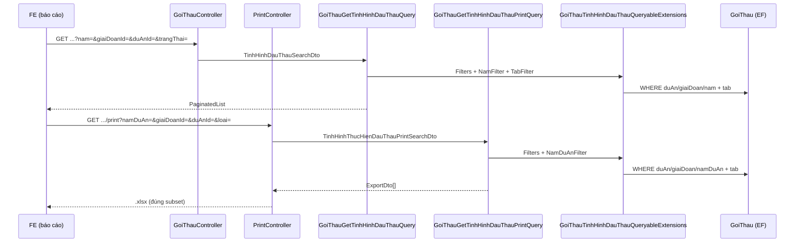

# Spec kỹ thuật — Bổ sung filter cho API print Tình hình thực hiện đấu thầu

**Module:** QLDA — `GoiThau` / báo cáo tình hình thực hiện đấu thầu  
**Ngày:** 2026-07-06  
**Trạng thái:** ✅ **IMPLEMENTED** (06/07/2026)  
**Pattern tham chiếu:** `GoiThauGetTinhHinhDauThauQuery` (list), `DuAnGetDanhSachQuery` (#9121 `namDuAn`)

---

## 0. Trạng thái implement

| Hạng mục | Trạng thái | Ghi chú |
|----------|------------|---------|
| `GoiThauTinhHinhDauThauQueryableExtensions.cs` | ✅ Done | Helper filter dùng chung |
| `TinhHinhThucHienDauThauPrintSearchDto` | ✅ Done | `NamDuAn`, `GiaiDoanId`, `DuAnId` |
| `GoiThauGetTinhHinhDauThauPrintQuery` | ✅ Done | Filter trước tab, multi-sheet |
| `GoiThauGetTinhHinhDauThauQuery` | ✅ Done | Refactor dùng helper |
| `GoiThauTinhHinhDauThauQueryableExtensionsTests` | ✅ Done | 6 unit tests |
| `TinhHinhThucHienDauThauExportTests` | ✅ Done | +3 integration test filter |
| `PrintController.cs` | ✅ Không sửa | Bind DTO đủ |
| Migration | ✅ Không cần | Chỉ query/filter |
| `task-export-tinh-hinh-thuc-hien-dau-thau.md` | ⏳ Pending | Cập nhật as-built feature |
| QA manual / so sánh Excel vs grid | ⏳ Pending | Sau restart WebApi |

---

## Mục lục

1. [Trạng thái implement](#0-trạng-thái-implement)
2. [Hiện trạng lỗi](#1-hiện-trạng-lỗi)
3. [Luồng code (sau fix)](#2-luồng-code-sau-fix)
4. [So sánh List vs Print](#3-so-sánh-list-vs-print)
5. [Root cause](#4-root-cause)
6. [Thiết kế fix (as-built)](#5-thiết-kế-fix-as-built)
7. [Files đã sửa](#6-files-đã-sửa)
8. [Tóm tắt code as-built](#7-tóm-tắt-code-as-built)
9. [Test plan](#8-test-plan)
10. [Checklist nghiệm thu](#9-checklist-nghiệm-thu)
11. [Ghi chú / rủi ro](#10-ghi-chú--rủi-ro)

---
## 1. Hiện trạng lỗi

### 1.1. Case báo cáo (trước fix)

| Khía cạnh | Chi tiết |
|-----------|----------|
| **Màn hình** | Báo cáo tình hình thực hiện đấu thầu (`/quan-ly-du-an/bao-cao/tinh-hinh-lua-thau`) |
| **API list** | `GET /api/goi-thau/tinh-hinh-thuc-hien-dau-thau` — grid có filter, phân trang |
| **API print** | `GET /api/print/tinh-hinh-thuc-hien-dau-thau` — export Excel |
| **Filter UI truyền** | `namDuAn=2026`, `giaiDoanId=22`, `duAnId=08dec1fd-...`, `loai=1` |
| **Kết quả trước fix** | Excel chứa gói thầu **ngoài** subset grid (chỉ lọc tab `loai`) |

### 1.2. Acceptance Criteria

| # | Tiêu chí | Pass khi |
|---|----------|----------|
| AC-1 | Lọc năm (print) | `namDuAn` > 0 → logic **#9121** (`ThoiGianKhoiCong` / `ThoiGianHoanThanh`); null hoặc ≤ 0 → không lọc |
| AC-1b | Lọc năm (list) | `nam` có giá trị → `DuAn.NgayBatDau` trong khoảng năm (giữ behavior cũ) |
| AC-2 | Lọc giai đoạn | `giaiDoanId` > 0 → `DuAn.GiaiDoanHienTaiId == giaiDoanId` |
| AC-3 | Bỏ lọc giai đoạn | `giaiDoanId = -1` hoặc null → không WHERE giai đoạn |
| AC-4 | Lọc dự án | `duAnId` có giá trị → `GoiThau.DuAnId == duAnId` |
| AC-5 | Giữ tab | `loai` 1/2/3 giữ logic KetQuaTrungThau/HopDong |
| AC-6 | Multi-sheet | `loai` null/0 → 3 sheet, mỗi sheet cùng bộ filter |
| AC-7 | Không regression | Không truyền filter → export toàn bộ theo tab |
| AC-8 | Khớp subset | Excel chỉ chứa gói thầu thỏa filter (không phân trang) |

---

## 2. Luồng code (sau fix)



### 2.1. Files liên quan

| File | Vai trò |
|------|---------|
| `QLDA.WebApi/Controllers/PrintController.cs` | `InTinhHinhThucHienDauThau` — bind `TinhHinhThucHienDauThauPrintSearchDto` |
| `QLDA.WebApi/Controllers/GoiThauController.cs` | `GetTinhHinhThucHienDauThau` — bind `TinhHinhDauThauSearchDto` |
| `QLDA.Application/GoiThaus/GoiThauTinhHinhDauThauQueryableExtensions.cs` | Helper filter — dùng chung list + print |
| `QLDA.Application/GoiThaus/DTOs/TinhHinhThucHienDauThauPrintSearchDto.cs` | DTO print |
| `QLDA.Domain/DTOs/TinhHinhDauThauSearchDto.cs` | DTO list |
| `QLDA.Application/GoiThaus/Queries/GoiThauGetTinhHinhDauThauQuery.cs` | Handler list |
| `QLDA.Application/GoiThaus/Queries/GoiThauGetTinhHinhDauThauPrintQuery.cs` | Handler print |
| `QLDA.Tests/Unit/GoiThauTinhHinhDauThauQueryableExtensionsTests.cs` | Unit test helper |
| `QLDA.Tests/Integration/TinhHinhThucHienDauThauExportTests.cs` | Integration test export |

---
## 3. So sánh List vs Print

### 3.1. Query params

| Query param (FE print) | Query param (FE list) | Property list | Property print | Extension / WHERE |
|------------------------|----------------------|---------------|----------------|-------------------|
| `namDuAn` | `nam` | `Nam` | `NamDuAn` | Print: `ApplyTinhHinhDauThauNamDuAnFilter` (#9121). List: `ApplyTinhHinhDauThauNamFilter` (`NgayBatDau`) |
| `giaiDoanId` | `giaiDoanId` | `GiaiDoanId` | `GiaiDoanId` | `ApplyTinhHinhDauThauFilters` — chỉ khi `> 0`; `-1` bỏ qua |
| `duAnId` | `duAnId` | `DuAnId` | `DuAnId` | `GoiThau.DuAnId` (bỏ `Guid.Empty`) |
| `loai` | `trangThai` | `TrangThai` | `Loai` | Print: switch enum; List: `ApplyTinhHinhDauThauTabFilter` |
| `hiddenColumns` | — | — | `HiddenColumns` | Chỉ Aspose, không query |

> **Quan trọng:** `nam` (list) và `namDuAn` (print) **không dùng cùng logic năm**. Nhiều dự án có `NgayBatDau = null` nhưng `ThoiGianKhoiCong = 2026` — nếu print lọc theo `NgayBatDau` sẽ ra Excel trống.

### 3.2. Helper as-built

```csharp
// Chung list + print
ApplyTinhHinhDauThauFilters(duAnId, giaiDoanId)

// Chỉ list — param nam
ApplyTinhHinhDauThauNamFilter(nam)
// → DuAn.NgayBatDau ∈ [01/01/Y, 01/01/Y+1)

// Chỉ print — param namDuAn (#9121)
ApplyTinhHinhDauThauNamDuAnFilter(namDuAn)
// → namDuAn >= ThoiGianKhoiCong
//   AND ((ThoiGianHoanThanh IS NULL AND ThoiGianKhoiCong = namDuAn) OR namDuAn <= ThoiGianHoanThanh)

// Chỉ list — param trangThai
ApplyTinhHinhDauThauTabFilter(trangThai)
```

### 3.3. Print handler as-built

```csharp
var queryable = _goiThau.GetOrderedSet()
    .Include(e => e.KetQuaTrungThau)
    .Include(e => e.HopDong)
    .AsQueryable()
    .ApplyTinhHinhDauThauFilters(searchDto.DuAnId, searchDto.GiaiDoanId)
    .ApplyTinhHinhDauThauNamDuAnFilter(searchDto.NamDuAn);

queryable = loai switch { /* tab 1/2/3 */ };
```

### 3.4. List handler as-built

```csharp
var queryable = GoiThau.GetOrderedSet()
    .Include(e => e.KetQuaTrungThau)
    .Include(e => e.HopDong)
    .AsQueryable()
    .ApplyTinhHinhDauThauFilters(request.SearchDto.DuAnId, request.SearchDto.GiaiDoanId)
    .ApplyTinhHinhDauThauNamFilter(request.SearchDto.Nam)
    .ApplyTinhHinhDauThauTabFilter(request.SearchDto.TrangThai);
```

---

## 4. Root cause

| # | Nguyên nhân | Bằng chứng |
|---|-------------|------------|
| RC-1 | Print SearchDto không khai báo filter fields | `TinhHinhThucHienDauThauPrintSearchDto` chỉ 2 property |
| RC-2 | Handler không đọc filter từ request | `GetExportItemsAsync(loai)` không nhận `SearchDto` |
| RC-3 | Thiết kế #103 cố ý bỏ filter | `task-export-tinh-hinh-thuc-hien-dau-thau.md` |
| RC-4 | Chỉ sửa DTO sẽ không đủ | Phải áp dụng vào `IQueryable` trước `.Select()` |
| RC-5 | Lần implement đầu copy `NgayBatDau` cho `namDuAn` | Excel trống — đã sửa sang #9121 |

**Không phải lỗi:** Controller, Aspose template, multi-sheet.

### 4.1. Bug phụ đã gặp khi QA

| Triệu chứng | Nguyên nhân | Fix |
|-------------|-------------|-----|
| Excel chỉ có header, 0 dòng | `namDuAn` lọc `NgayBatDau` nhưng dự án `NgayBatDau = null` | Tách `ApplyTinhHinhDauThauNamDuAnFilter` (#9121) |
| SQL verify lỗi `Invalid column name 'false'` | Doc dùng cú pháp PostgreSQL trên SQL Server | Sửa §8.2 — `IsDeleted = 0` |

---
## 5. Thiết kế fix (as-built)

### 5.1. Nguyên tắc đã áp dụng

1. **Helper dùng chung** — `GoiThauTinhHinhDauThauQueryableExtensions`.
2. **Tách logic năm** — `nam` (list) ≠ `namDuAn` (print).
3. **Chỉ WHERE khi param có giá trị** — `namDuAn` null hoặc ≤ 0 → không lọc năm.
4. **`giaiDoanId = -1`** → bỏ qua (list + print qua helper).
5. **Filter trước tab** — `duAnId` → `giaiDoanId` → năm → `loai`/`trangThai`.
6. **Multi-sheet** — mỗi tab gọi `GetExportItemsAsync(tab, searchDto)` với cùng `searchDto`.

### 5.2. API print — query params

| Query param | Kiểu | Bắt buộc | Mô tả |
|-------------|------|----------|-------|
| `loai` | `int?` | Không | `1`/`2`/`3` = 1 sheet; null/0 = 3 sheet |
| `namDuAn` | `int?` | Không | Năm dự án (#9121); null/≤0 = không lọc |
| `giaiDoanId` | `int?` | Không | Giai đoạn hiện tại; null hoặc `-1` = không lọc |
| `duAnId` | `Guid?` | Không | Dự án; null = không lọc |
| `hiddenColumns` | `string[]` | Không | Ẩn cột Excel |

```http
GET /api/print/tinh-hinh-thuc-hien-dau-thau?loai=1&namDuAn=2026&giaiDoanId=22&duAnId=08dec1fd-220c-da70-687a-7b47980360c9

# Không lọc năm — bỏ namDuAn
GET /api/print/tinh-hinh-thuc-hien-dau-thau?loai=1&giaiDoanId=22&duAnId=08dec1fd-220c-da70-687a-7b47980360c9
```

---

## 6. Files đã sửa

| File | Thay đổi | Trạng thái |
|------|----------|------------|
| `GoiThauTinhHinhDauThauQueryableExtensions.cs` | Tạo mới — 4 extension methods | ✅ |
| `TinhHinhThucHienDauThauPrintSearchDto.cs` | Thêm `NamDuAn`, `GiaiDoanId`, `DuAnId` | ✅ |
| `GoiThauGetTinhHinhDauThauPrintQuery.cs` | `GetExportItemsAsync(loai, searchDto)` + filter | ✅ |
| `GoiThauGetTinhHinhDauThauQuery.cs` | Gọi helper thay inline `if` | ✅ |
| `GoiThauTinhHinhDauThauQueryableExtensionsTests.cs` | Tạo mới — 6 tests | ✅ |
| `TinhHinhThucHienDauThauExportTests.cs` | +3 test có filter | ✅ |
| `task-export-tinh-hinh-thuc-hien-dau-thau.md` | Cập nhật as-built | ⏳ |

### Không sửa

| File | Lý do |
|------|-------|
| `PrintController.cs` | Đã bind DTO — thêm property là đủ |
| `GoiThauController.cs` | List giữ param `nam` |
| Migration / DB | Không đổi schema |
| Template Excel | Không đổi cột |

---

## 7. Tóm tắt code as-built

> Source truth: các file trong §6. Chi tiết logic: §3.2–3.4.

### Bước 0 — Helper

| Method | Dùng cho | Logic |
|--------|----------|-------|
| `ApplyTinhHinhDauThauFilters` | List + Print | `duAnId` (≠ Empty), `giaiDoanId` (> 0) |
| `ApplyTinhHinhDauThauNamFilter` | List (`nam`) | `NgayBatDau` trong khoảng năm |
| `ApplyTinhHinhDauThauNamDuAnFilter` | Print (`namDuAn`) | #9121 `ThoiGianKhoiCong` / `ThoiGianHoanThanh` |
| `ApplyTinhHinhDauThauTabFilter` | List (`trangThai`) | Tab 1/2/3 KetQuaTrungThau/HopDong |

### Bước 1 — Print DTO

`TinhHinhThucHienDauThauPrintSearchDto`: `Loai`, `NamDuAn`, `GiaiDoanId`, `DuAnId`, `HiddenColumns`.

### Bước 2 — Print handler

- `Handle`: truyền `request.SearchDto` vào mỗi `GetExportItemsAsync(tab.Loai, request.SearchDto, ct)`.
- `GetExportItemsAsync`: `.ApplyTinhHinhDauThauFilters` → `.ApplyTinhHinhDauThauNamDuAnFilter` → `switch loai`.

### Bước 3 — List handler

Thay block `if` inline bằng chuỗi extension (§3.4).

### Bước 4–5 — Tests

- Unit: `GoiThauTinhHinhDauThauQueryableExtensionsTests` (6 tests, gồm case `NgayBatDau = null` + `namDuAn`).
- Integration: `ExportTinhHinhThucHienDauThau_WithFilters_*` (3 tests).

### Bước 6 — Build

```bash
dotnet build QLDA.Application/QLDA.Application.csproj
# Restart WebApi nếu process đang lock DLL
dotnet build QLDA.WebApi/QLDA.WebApi.csproj
dotnet test QLDA.Tests/QLDA.Tests.csproj --filter "FullyQualifiedName~TinhHinhThucHienDauThau|FullyQualifiedName~GoiThauTinhHinhDauThauQueryableExtensions"
```

---
## 8. Test plan

### 8.1. Smoke test manual

| # | Request | Kỳ vọng |
|---|---------|---------|
| T1 | Chỉ `loai=1` (không filter) | 200, số dòng ≥ T2 |
| T2 | `loai=1&namDuAn=2026&giaiDoanId=22&duAnId={guid}` | 200, số dòng ≤ T1, khớp grid |
| T3 | `giaiDoanId=-1&loai=1&namDuAn=2026&duAnId={guid}` | 200, không lọc giai đoạn |
| T4 | Không `loai` + filter đầy đủ | 200, 3 sheet, mỗi sheet đã lọc |
| T5 | `loai=4` | 400 |
| T6 | `loai=1&giaiDoanId=22&duAnId={guid}` (không `namDuAn`) | 200, không lọc năm |

### 8.2. SQL verify (SQL Server)

> Dùng `0`/`1` cho `bit`, không dùng `false`/`true` hay dấu `"` kiểu PostgreSQL.

**Tab "Chưa có KQ" + filter print (`namDuAn` = logic #9121):**

```sql
SELECT
    gt.Id,
    gt.Ten,
    da.TenDuAn,
    da.ThoiGianKhoiCong,
    da.ThoiGianHoanThanh,
    da.NgayBatDau,
    da.GiaiDoanHienTaiId
FROM GoiThau gt
INNER JOIN DuAn da ON da.Id = gt.DuAnId AND da.IsDeleted = 0
LEFT JOIN KetQuaTrungThau kq
    ON kq.GoiThauId = gt.Id AND kq.IsDeleted = 0
LEFT JOIN HopDong hd
    ON hd.GoiThauId = gt.Id AND hd.IsDeleted = 0
WHERE gt.IsDeleted = 0
  AND gt.DuAnId = '08DEC1FD-220C-DA70-687A-7B47980360C9'
  AND da.GiaiDoanHienTaiId = 22
  AND 2026 >= da.ThoiGianKhoiCong
  AND (
        (da.ThoiGianHoanThanh IS NULL AND da.ThoiGianKhoiCong = 2026)
        OR 2026 <= da.ThoiGianHoanThanh
      )
  AND kq.Id IS NULL
  AND hd.Id IS NULL;
```

**Không lọc năm** — bỏ 2 dòng `ThoiGianKhoiCong` / `ThoiGianHoanThanh`.

**So với API list (param `nam` — theo `NgayBatDau`):**

```sql
  AND da.NgayBatDau >= '2026-01-01'
  AND da.NgayBatDau <  '2027-01-01'
```

### 8.3. Regression

| Hạng mục | Kiểm tra |
|----------|----------|
| `hiddenColumns` | Vẫn ẩn cột đúng |
| STT | Vẫn đánh từ 1 mỗi sheet |
| Tên sheet multi-export | Không đổi |
| Phân quyền role | Vẫn `GroupTinhHinhThucHienDauThauExport` |

---

## 9. Checklist nghiệm thu

- [x] `TinhHinhThucHienDauThauPrintSearchDto` có đủ 3 field filter
- [x] `GetExportItemsAsync` áp dụng WHERE trên `IQueryable`
- [x] `giaiDoanId=-1` không gây WHERE giai đoạn (list + print)
- [x] Export 3 sheet: filter áp dụng cho cả 3
- [x] `namDuAn` dùng #9121 (không `NgayBatDau`)
- [x] Không truyền filter: hành vi như trước fix
- [x] Unit + integration test pass
- [ ] QA manual: Excel khớp grid
- [ ] Doc feature as-built cập nhật

---

## 10. Ghi chú / rủi ro

### 10.1. `nam` vs `namDuAn`

- List: query param `nam` → `NgayBatDau`
- Print: query param `namDuAn` → #9121
- Không alias chéo trừ khi BA yêu cầu đồng bộ tuyệt đối list/print

### 10.2. `giaiDoanId = -1`

Sau fix, **cả list và print** bỏ qua qua helper (`giaiDoanId is > 0`).

### 10.3. Phân quyền

Cả list và print **không** gọi `_authManager.FilterVisible()` (theo thiết kế #103). Fix filter không thay đổi phạm vi quyền.

### 10.4. Thay đổi so với thiết kế #103

Doc `task-export-tinh-hinh-thuc-hien-dau-thau.md` ghi export cố ý full data. Ticket này đảo quyết định đó theo yêu cầu BA mới — cần cập nhật doc sau merge.

### 10.5. `pageSize` trên URL print

Query param `pageSize` không có trên PrintSearchDto → ASP.NET bỏ qua. Không ảnh hưởng bug.

### 10.6. Encoding file doc

Lưu file `.md` tiếng Việt bằng **UTF-8**. Tránh PowerShell `Set-Content` không chỉ định encoding (gây mojibake như `kỹ thuật` thay vì `kỹ thuật`).
