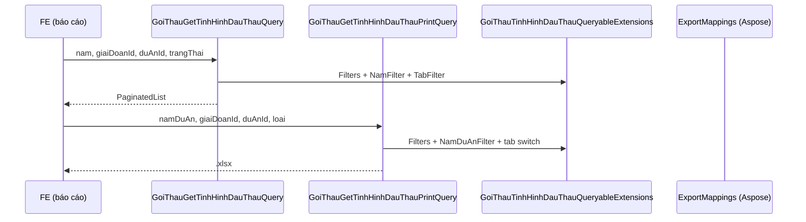

# Spec kỹ thuật — Bổ sung filter cho API print Tình hình thực hiện đấu thầu

**Module:** QLDA — `GoiThau` / báo cáo tình hình thực hiện đấu thầu  
**Ngày:** 2026-07-06  
**Trạng thái:** ✅ **IMPLEMENTED** (commit `af1fa46`, 06/07/2026)  
**Pattern tham chiếu:** `GoiThauGetTinhHinhDauThauQuery` (list), `DuAnGetDanhSachQuery` (#9121 `namDuAn`)

---

## 0. Trạng thái implement

| Hạng mục | Trạng thái | Ghi chú |
|----------|------------|---------|
| `GoiThauTinhHinhDauThauQueryableExtensions.cs` | ✅ Done | 4 extension — filter dùng chung list + print |
| `TinhHinhThucHienDauThauPrintSearchDto` | ✅ Done | `NamDuAn`, `GiaiDoanId`, `DuAnId` |
| `GoiThauGetTinhHinhDauThauPrintQuery` | ✅ Done | Filter trước tab, multi-sheet |
| `GoiThauGetTinhHinhDauThauQuery` | ✅ Done | Refactor dùng helper |
| `GoiThauTinhHinhDauThauQueryableExtensionsTests` | ✅ Done | 6 unit tests |
| `TinhHinhThucHienDauThauExportTests` | ✅ Done | 9 integration cases (gồm 3 filter mới) |
| `PrintController.cs` | ✅ Không sửa | Bind `TinhHinhThucHienDauThauPrintSearchDto` |
| Migration | ✅ Không cần | Chỉ query/filter |
| `task-export-tinh-hinh-thuc-hien-dau-thau.md` | ⏳ Pending | Cập nhật as-built feature |
| QA manual / so sánh Excel vs grid | ⏳ Pending | Restart WebApi sau deploy |

---

## Mục lục

1. [Trạng thái implement](#0-trạng-thái-implement)
2. [Hiện trạng lỗi](#1-hiện-trạng-lỗi)
3. [Luồng code (sau fix)](#2-luồng-code-sau-fix)
4. [So sánh List vs Print](#3-so-sánh-list-vs-print)
5. [Root cause](#4-root-cause)
6. [Thiết kế fix (as-built)](#5-thiết-kế-fix-as-built)
7. [Files đã sửa](#6-files-đã-sửa)
8. [Tóm tắt code as-built](#7-tóm-tắt-code-as-built)
9. [Test plan](#8-test-plan)
10. [Checklist nghiệm thu](#9-checklist-nghiệm-thu)
11. [Ghi chú / rủi ro](#10-ghi-chú--rủi-ro)

---

## 1. Hiện trạng lỗi

### 1.1. Case báo cáo (trước fix)

| Khía cạnh | Chi tiết |
|-----------|----------|
| **Màn hình** | Báo cáo tình hình thực hiện đấu thầu (`/quan-ly-du-an/bao-cao/tinh-hinh-lua-thau`) |
| **API list** | `GET /api/goi-thau/tinh-hinh-thuc-hien-dau-thau` — grid có filter, phân trang |
| **API print** | `GET /api/print/tinh-hinh-thuc-hien-dau-thau` — export Excel |
| **Filter UI truyền** | `namDuAn=2026`, `giaiDoanId=22`, `duAnId=08dec1fd-...`, `loai=1` |
| **Kết quả trước fix** | Excel chứa gói thầu **ngoài** subset grid (chỉ lọc tab `loai`) |

### 1.2. Acceptance Criteria

| # | Tiêu chí | Pass khi |
|---|----------|----------|
| AC-1 | Lọc năm (print) | `namDuAn` > 0 → logic **#9121**; null hoặc ≤ 0 → không lọc |
| AC-1b | Lọc năm (list) | `nam` → `DuAn.NgayBatDau` trong khoảng năm (giữ cũ) |
| AC-2 | Lọc giai đoạn | `giaiDoanId` > 0 → `DuAn.GiaiDoanHienTaiId` |
| AC-3 | Bỏ lọc giai đoạn | `giaiDoanId = -1` hoặc null → không WHERE |
| AC-4 | Lọc dự án | `duAnId` → `GoiThau.DuAnId` |
| AC-5 | Giữ tab | `loai` 1/2/3 giữ logic KetQuaTrungThau/HopDong |
| AC-6 | Multi-sheet | `loai` null/0 → 3 sheet, cùng bộ filter |
| AC-7 | Không regression | Không filter → export toàn bộ theo tab |
| AC-8 | Khớp subset | Excel ⊆ grid (cùng filter + tab, bỏ phân trang) |

---
## 2. Luồng code (sau fix)



### 2.1. Files liên quan

| File | Vai trò |
|------|---------|
| `PrintController.cs` | `InTinhHinhThucHienDauThau` — bind DTO |
| `GoiThauTinhHinhDauThauQueryableExtensions.cs` | Helper filter |
| `TinhHinhThucHienDauThauPrintSearchDto.cs` | DTO print |
| `TinhHinhDauThauSearchDto.cs` | DTO list |
| `GoiThauGetTinhHinhDauThauPrintQuery.cs` | Handler print |
| `GoiThauGetTinhHinhDauThauQuery.cs` | Handler list |

---

## 3. So sánh List vs Print

### 3.1. Query params

| Param print | Param list | Logic |
|-------------|------------|-------|
| `namDuAn` | `nam` | Print: #9121 `ThoiGianKhoiCong`/`ThoiGianHoanThanh`. List: `NgayBatDau` |
| `giaiDoanId` | `giaiDoanId` | `GiaiDoanHienTaiId` khi `> 0`; `-1` bỏ qua |
| `duAnId` | `duAnId` | `GoiThau.DuAnId` |
| `loai` | `trangThai` | Tab KetQuaTrungThau/HopDong |

> **Quan trọng:** `nam` ≠ `namDuAn`. Nhiều dự án `NgayBatDau = null` nhưng `ThoiGianKhoiCong = 2026` — lọc print theo `NgayBatDau` sẽ ra Excel trống.

### 3.2. Helper as-built

```csharp
ApplyTinhHinhDauThauFilters(duAnId, giaiDoanId)       // chung
ApplyTinhHinhDauThauNamFilter(nam)                    // list
ApplyTinhHinhDauThauNamDuAnFilter(namDuAn)            // print (#9121)
ApplyTinhHinhDauThauTabFilter(trangThai)              // list
```

### 3.3. Print handler

```csharp
.ApplyTinhHinhDauThauFilters(searchDto.DuAnId, searchDto.GiaiDoanId)
.ApplyTinhHinhDauThauNamDuAnFilter(searchDto.NamDuAn);
// rồi switch loai (tab 1/2/3)
```

### 3.4. List handler

```csharp
.ApplyTinhHinhDauThauFilters(...)
.ApplyTinhHinhDauThauNamFilter(request.SearchDto.Nam)
.ApplyTinhHinhDauThauTabFilter(request.SearchDto.TrangThai);
```

---

## 4. Root cause

| # | Nguyên nhân |
|---|-------------|
| RC-1 | Print DTO thiếu `NamDuAn`, `GiaiDoanId`, `DuAnId` |
| RC-2 | `GetExportItemsAsync` không nhận/không áp dụng `SearchDto` |
| RC-3 | Thiết kế #103 cố ý export full data (chỉ `loai`) |
| RC-5 | Implement đầu dùng `NgayBatDau` cho `namDuAn` → Excel trống → đã sửa #9121 |

### 4.1. Bug phụ khi QA

| Triệu chứng | Fix |
|-------------|-----|
| Excel 0 dòng | `ApplyTinhHinhDauThauNamDuAnFilter` (#9121) |
| SQL `Invalid column name 'false'` | SQL Server: `IsDeleted = 0` |

---
## 5. Thiết kế fix (as-built)

### 5.1. API print — query params

| Param | Kiểu | Mô tả |
|-------|------|-------|
| `loai` | `int?` | 1/2/3 = 1 sheet; null/0 = 3 sheet |
| `namDuAn` | `int?` | #9121; null/≤0 = không lọc năm |
| `giaiDoanId` | `int?` | null hoặc `-1` = không lọc |
| `duAnId` | `Guid?` | null = không lọc |
| `hiddenColumns` | `string[]` | Ẩn cột Excel |

```http
GET /api/print/tinh-hinh-thuc-hien-dau-thau?loai=1&namDuAn=2026&giaiDoanId=22&duAnId=08dec1fd-220c-da70-687a-7b47980360c9

# Không lọc năm — bỏ namDuAn
GET /api/print/tinh-hinh-thuc-hien-dau-thau?loai=1&giaiDoanId=22&duAnId=08dec1fd-220c-da70-687a-7b47980360c9
```

---

## 6. Files đã sửa

| File | Thay đổi |
|------|----------|
| `GoiThauTinhHinhDauThauQueryableExtensions.cs` | Tạo mới |
| `TinhHinhThucHienDauThauPrintSearchDto.cs` | +3 filter fields |
| `GoiThauGetTinhHinhDauThauPrintQuery.cs` | `GetExportItemsAsync(loai, searchDto)` |
| `GoiThauGetTinhHinhDauThauQuery.cs` | Gọi helper |
| `GoiThauTinhHinhDauThauQueryableExtensionsTests.cs` | 6 unit tests |
| `TinhHinhThucHienDauThauExportTests.cs` | +3 filter tests |

---

## 7. Tóm tắt code as-built

**Print** — `GetExportItemsAsync`:

```csharp
var queryable = _goiThau.GetOrderedSet()
    .Include(e => e.KetQuaTrungThau)
    .Include(e => e.HopDong)
    .ApplyTinhHinhDauThauFilters(searchDto.DuAnId, searchDto.GiaiDoanId)
    .ApplyTinhHinhDauThauNamDuAnFilter(searchDto.NamDuAn);
// switch loai → projection Excel
```

**Unit test** — gồm case `NgayBatDau = null` + `namDuAn` vẫn match (#9121).

**Build / test:**

```bash
dotnet build QLDA.Application/QLDA.Application.csproj
dotnet test QLDA.Tests/QLDA.Tests.csproj --filter "FullyQualifiedName~TinhHinhThucHienDauThau|FullyQualifiedName~GoiThauTinhHinhDauThauQueryableExtensions"
```

---
## 8. Test plan

### 8.1. Smoke test manual

| # | Request | Kỳ vọng |
|---|---------|---------|
| T1 | Chỉ `loai=1` | 200, số dòng ≥ T2 |
| T2 | `loai=1&namDuAn=2026&giaiDoanId=22&duAnId={guid}` | 200, ≤ T1, khớp grid |
| T3 | `giaiDoanId=-1&loai=1&namDuAn=2026&duAnId={guid}` | 200, không lọc giai đoạn |
| T4 | Không `loai` + filter đầy đủ | 200, 3 sheet đã lọc |
| T5 | `loai=4` | 400 |
| T6 | Không `namDuAn` | 200, không lọc năm |

### 8.2. SQL verify (SQL Server)

Dùng `IsDeleted = 0` — không `false`, không dấu `"` PostgreSQL.

**Print `namDuAn=2026` (#9121), tab chưa có KQ:**

```sql
SELECT gt.Id, gt.Ten, da.TenDuAn
FROM GoiThau gt
INNER JOIN DuAn da ON da.Id = gt.DuAnId AND da.IsDeleted = 0
LEFT JOIN KetQuaTrungThau kq ON kq.GoiThauId = gt.Id AND kq.IsDeleted = 0
LEFT JOIN HopDong hd ON hd.GoiThauId = gt.Id AND hd.IsDeleted = 0
WHERE gt.IsDeleted = 0
  AND gt.DuAnId = '08DEC1FD-220C-DA70-687A-7B47980360C9'
  AND da.GiaiDoanHienTaiId = 22
  AND 2026 >= da.ThoiGianKhoiCong
  AND ((da.ThoiGianHoanThanh IS NULL AND da.ThoiGianKhoiCong = 2026)
       OR 2026 <= da.ThoiGianHoanThanh)
  AND kq.Id IS NULL AND hd.Id IS NULL;
```

**List `nam`:** `NgayBatDau >= '2026-01-01' AND < '2027-01-01'`

### 8.3. Integration tests (as-built)

| Test | Mô tả |
|------|-------|
| `ValidLoai_ReturnsExcel` | loai 1,2,3 |
| `NoLoai_ReturnsExcel` | 3 sheet |
| `InvalidLoai_ReturnsBadRequest` | loai 4, -1 |
| `WithFilters_ReturnsExcel` | filter đầy đủ |
| `GiaiDoanIdMinusOne_...` | giaiDoanId=-1 |
| `MultiSheet_WithFilters_...` | không loai + filter |

---

## 9. Checklist nghiệm thu

- [x] Print DTO đủ 3 field filter
- [x] `GetExportItemsAsync` áp dụng WHERE trên `IQueryable`
- [x] `giaiDoanId=-1` bỏ qua (list + print)
- [x] Multi-sheet: filter chung 3 tab
- [x] `namDuAn` dùng #9121
- [x] Unit + integration test
- [ ] QA manual: Excel khớp grid
- [ ] Doc feature #103 cập nhật

---

## 10. Ghi chú / rủi ro

### 10.1. `nam` vs `namDuAn`

Không alias chéo trừ khi BA yêu cầu đồng bộ tuyệt đối list/print.

### 10.2. Phân quyền

Không gọi `FilterVisible()` — giữ thiết kế #103.

### 10.3. Restart WebApi

Sau build phải restart process WebApi (tránh DLL lock + chạy code cũ).

### 10.4. `loai=-1` trên integration test

`loai=-1` có thể bind thành enum hợp lệ (`TatCa=0` path) — test `InvalidLoai` có thể cần điều chỉnh nếu BA muốn 400.

### 10.5. Encoding file doc

Lưu `.md` tiếng Việt bằng **UTF-8**. File lớn ghi một lần dễ hỏi encoding trên Windows — nên dùng editor hoặc `python` merge từng phần.
