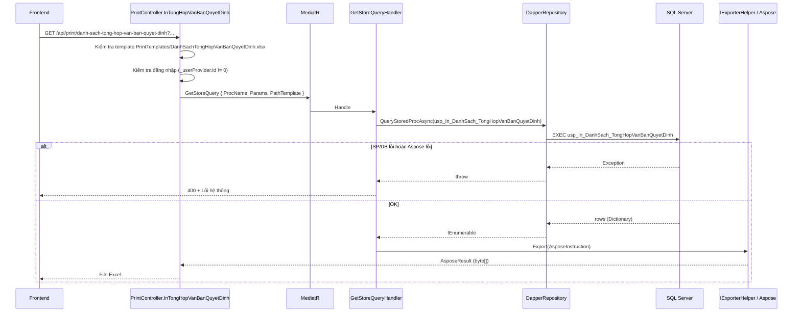

# Bug fix — Export Excel Tổng hợp văn bản quyết định

**Module:** QLDA  
**Trạng thái:** Điều tra xong — có hướng sửa (Phương án B)  
**Effort ước lượng:** ~2–3 giờ (BE only, không migration)  
**Ngày:** 2026-06-30  
**Pattern hiện tại:** `PrintController` + `GetStoreQuery` + Dapper SP + Aspose template  
**Pattern tham chiếu (đề xuất):** `InKhoKhanVuongMac`, `InDanhSachPhanKhaiKinhPhi` (LINQ + `IExporterHelper`)

---

## 1. Tóm tắt

Khi người dùng bấm **In / Xuất Excel** trên màn **Tổng hợp văn bản quyết định**, FE gọi API print. BE hiện dùng stored procedure `usp_In_DanhSach_TongHopVanBanQuyetDinh` qua `GetStoreQuery`. Mọi exception trong handler đều bị re-throw → `ExceptionMiddleware` trả **400 Bad Request** với message chung `"Lỗi hệ thống, vui lòng thử lại sau"` thay vì file Excel.

**Triệu chứng quan sát được (Postman / curl):**

```json
{
  "result": false,
  "errorMessage": "Lỗi hệ thống, vui lòng thử lại sau",
  "dataResult": null,
  "statusCode": 400
}
```

**Phát hiện chính sau khi đọc source:**


| #   | Phát hiện                                                                                                                                             | Mức độ     |
| --- | ----------------------------------------------------------------------------------------------------------------------------------------------------- | ---------- |
| 1   | SP `usp_In_DanhSach_TongHopVanBanQuyetDinh` **không có trong repo** — chỉ được gọi từ `PrintController`, deploy phụ thuộc DBA/DB                      | Cao        |
| 2   | Export qua SP **không dùng** `IAuthorizationManager.FilterVisible()` như các module đã migrate sang LINQ                                              | Cao        |
| 3   | `TongHopVanBanQuyetDinhPrintSearchModel` **thiếu** `CoQuanQuyetDinh` so với search model grid                                                         | Trung bình |
| 4   | `pageIndex`/`pageSize` từ FE **không được bind** (print model không kế thừa `CommonSearchModel`); controller hardcode `PageIndex = 0`, `PageSize = 0` | Trung bình |
| 5   | Template `DanhSachTongHopVanBanQuyetDinh.xlsx` **có trong git** và copy ra `bin/.../PrintTemplates/` khi build                                        | OK         |
| 6   | `GetStoreQueryHandler` không validate dữ liệu rỗng — export 0 dòng vẫn trả file Excel hợp lệ (nếu SP chạy OK)                                         | OK         |


---


## 2. API & endpoint


### 2.1 Export Excel (bị lỗi)


| Thuộc tính              | Giá trị                                                                                   |
| ----------------------- | ----------------------------------------------------------------------------------------- |
| **Method**              | `GET`                                                                                     |
| **URL (base path IIS)** | `/QuanLyDuAn/api/print/danh-sach-tong-hop-van-ban-quyet-dinh`                             |
| **URL (dev Kestrel)**   | `/api/print/danh-sach-tong-hop-van-ban-quyet-dinh`                                        |
| **Controller**          | `PrintController.InTongHopVanBanQuyetDinh`                                                |
| **Tag Swagger**         | `In ấn`                                                                                   |
| **Response thành công** | `FileContentResult` — `application/vnd.openxmlformats-officedocument.spreadsheetml.sheet` |
| **Tên file tải**        | `DanhSachTongHopVanBanQuyetDinh_ddMMyyyy_HHmmss.xlsx`                                     |


**Query params** (`TongHopVanBanQuyetDinhPrintSearchModel`):


| Param               | Kiểu                       | Ghi chú                                   |
| ------------------- | -------------------------- | ----------------------------------------- |
| `duAnId`            | `Guid?`                    |                                           |
| `buocId`            | `int?`                     |                                           |
| `globalFilter`      | `string?`                  |                                           |
| `hiddenColumns`     | `string[]?`                | Ẩn cột trên Excel                         |
| `loai`              | `EnumLoaiVanBanQuyetDinh?` | Truyền vào SP as `MaELoaiVanBanQuyetDinh` |
| `trichYeu`          | `string?`                  |                                           |
| `tuNgay`            | `DateOnly?`                | BE convert `ToStartOfDayUtc()`            |
| `denNgay`           | `DateOnly?`                | BE convert `ToEndOfDayUtc()`              |
| `loaiDuAnTheoNamId` | `int?`                     | PMIS #9609                                |


**Params FE đang gửi nhưng BE chưa nhận:**


| Param             | Trạng thái                                                 |
| ----------------- | ---------------------------------------------------------- |
| `pageIndex`       | ❌ Không có trên print model — bị bỏ qua khi bind           |
| `pageSize`        | ❌ Không có trên print model — bị bỏ qua khi bind           |
| `coQuanQuyetDinh` | ❌ Có trên grid search model, **không** có trên print model |


> **Quy ước export trong codebase:** Hầu hết endpoint print hardcode `PageIndex = 0`, `PageSize = 0` → export **toàn bộ** kết quả sau filter, không theo trang grid. Nếu PM yêu cầu export đúng trang hiện tại, cần bổ sung rõ trong spec và implement riêng.


### 2.2 API danh sách grid (tham chiếu — cần xác nhận hoạt động)


| Method | URL                                                 |
| ------ | --------------------------------------------------- |
| `GET`  | `/api/tong-hop-van-ban-quyet-dinh/danh-sach-day-du` |


Handler: `TongHopVanBanQuyetDinhGetListQuery` — EF LINQ, phân trang qua `CommonSearchModel`.

---


## 3. Luồng xử lý (hiện tại)




### 3.1 Code controller (tham chiếu)

```574:615:QLDA.WebApi/Controllers/PrintController.cs
    [HttpGet("api/print/danh-sach-tong-hop-van-ban-quyet-dinh")]
    public async Task<IActionResult>
        InTongHopVanBanQuyetDinh([FromQuery] TongHopVanBanQuyetDinhPrintSearchModel searchModel)
    {
        var fileNameTemplate = "DanhSachTongHopVanBanQuyetDinh.xlsx";
        var procedureName = "usp_In_DanhSach_TongHopVanBanQuyetDinh";
        // ...
        var query = new GetStoreQuery()
        {
            PathTemplate = templatePath,
            ProcName = procedureName,
            Params = new
            {
                searchModel.DuAnId,
                searchModel.BuocId,
                MaELoaiVanBanQuyetDinh = searchModel.Loai?.ToString(),
                searchModel.TrichYeu,
                TuNgay = searchModel.TuNgay?.ToStartOfDayUtc(),
                DenNgay = searchModel.DenNgay?.ToEndOfDayUtc(),
                searchModel.GlobalFilter,
                searchModel.LoaiDuAnTheoNamId,
                PageIndex = 0,
                PageSize = 0,
            },
            HiddenColumns = searchModel.HiddenColumns
        };
        var exportResult = await Mediator.Send(query);
        return new FileContentResult(exportResult.FileBytes, exportResult.ContentType) { ... };
    }
```


### 3.2 Tại sao response là 400 (không phải 500)?

`ExceptionMiddleware` map:


| Exception                                                     | HTTP status | Message client                                       |
| ------------------------------------------------------------- | ----------- | ---------------------------------------------------- |
| `ManagedException` (vd: thiếu template, chưa login)           | **200**     | Message cụ thể (`"Không tìm thấy file template"`, …) |
| `SqlException` một số mã (245, 547, …)                        | **200**     | Message SQL đã parse                                 |
| **Mọi exception khác** (SP không tồn tại, Aspose, timeout, …) | **400**     | `"Lỗi hệ thống, vui lòng thử lại sau"`               |


→ Response 400 + message chung **không** có nghĩa lỗi validation — thường là exception runtime bị che. **Phải đọc log Serilog** để thấy exception thật.

---


## 4. Bản đồ file liên quan


| Layer          | File                                                                                     | Vai trò                                          |
| -------------- | ---------------------------------------------------------------------------------------- | ------------------------------------------------ |
| WebApi         | `QLDA.WebApi/Controllers/PrintController.cs`                                             | Endpoint `InTongHopVanBanQuyetDinh`              |
| WebApi         | `QLDA.WebApi/Models/TongHopVanBanQuyetDinhs/TongHopVanBanQuyetDinhPrintSearchModel.cs`   | Query params export                              |
| WebApi         | `QLDA.WebApi/Models/TongHopVanBanQuyetDinhs/TongHopVanBanQuyetDinhSearchModel.cs`        | Query params grid (đầy đủ hơn)                   |
| WebApi         | `QLDA.WebApi/Controllers/TongHopVanBanQuyetDinhController.cs`                            | API `danh-sach-day-du`                           |
| WebApi         | `QLDA.WebApi/PrintTemplates/DanhSachTongHopVanBanQuyetDinh.xlsx`                         | Template Aspose (runtime)                        |
| WebApi         | `QLDA.WebApi/ExportTemplates/DanhSachTongHopVanBanQuyetDinh.xlsx`                        | Bản generate từ `QLDA.Gen` (tham chiếu cấu trúc) |
| Application    | `QLDA.Application/Common/Queries/GetStoreQuery.cs`                                       | Handler gọi Dapper + Export                      |
| Application    | `QLDA.Application/TongHopVanBanQuyetDinhs/Queries/TongHopVanBanQuyetDinhGetListQuery.cs` | Logic grid                                       |
| Application    | `QLDA.Application/TongHopVanBanQuyetDinhs/DTOs/TongHopVanBanQuyetDinhDto.cs`             | DTO grid                                         |
| Gen            | `QLDA.Gen/Descriptors/DanhSachTongHopVanBanQuyetDinhExportDescriptor.cs`                 | Metadata cột template                            |
| Domain         | `QLDA.Domain/Entities/VanBanQuyetDinh.cs`                                                | Entity nguồn                                     |
| BuildingBlocks | `BuildingBlocks.Application/Middlewares/ExceptionMiddleware.cs`                          | Map exception → HTTP                             |
| DB             | `usp_In_DanhSach_TongHopVanBanQuyetDinh`                                                 | **Ngoài repo** — cần kiểm tra trên SQL Server    |


---


## 5. Template Excel — cột bắt buộc

File runtime: `QLDA.WebApi/PrintTemplates/DanhSachTongHopVanBanQuyetDinh.xlsx`

Metadata từ `DanhSachTongHopVanBanQuyetDinhExportDescriptor`:


| Placeholder template | Property ExportDto đề xuất | Header hiển thị |
| -------------------- | -------------------------- | --------------- |
| `$stt`               | `Stt`                      | STT             |
| `$tenDuAn`           | `TenDuAn`                  | Dự án           |
| `$so`                | `So`                       | Số văn bản      |
| `$ngay`              | `Ngay`                     | Ngay            |
| `$loai`              | `Loai`                     | Loại văn bản    |
| `$trichYeu`          | `TrichYeu`                 | Trích yếu       |


Layout: `Standard6RowWithLetterhead` — letterhead + title `"VĂN BẢN - QUYẾT ĐỊNH"` + header row + template row.

> Quy ước: placeholder `$X` → property/DTO field `X` (camelCase khi bind từ dictionary SP). Xem `PrintTemplates/huong-dan.md`.

**Kiểm tra sau deploy:**

```powershell
Test-Path "{AppContext.BaseDirectory}/PrintTemplates/DanhSachTongHopVanBanQuyetDinh.xlsx"
# Local build:
Test-Path "QLDA.WebApi/bin/Debug/net8.0/PrintTemplates/DanhSachTongHopVanBanQuyetDinh.xlsx"
```

`QLDA.WebApi.csproj` đã có `CopyToOutputDirectory` cho `PrintTemplates\**\*.*`.

---


## 6. Stored procedure (spec suy luận — cần xác nhận trên DB)

SP **không** nằm trong EF migration / repo SQL. Cần chạy trên DB môi trường lỗi:

```sql
-- Kiểm tra tồn tại
SELECT OBJECT_ID('dbo.usp_In_DanhSach_TongHopVanBanQuyetDinh');

-- Xem definition
EXEC sp_helptext 'usp_In_DanhSach_TongHopVanBanQuyetDinh';

-- Test thủ công (params mirror PrintController)
EXEC dbo.usp_In_DanhSach_TongHopVanBanQuyetDinh
    @DuAnId = NULL,
    @BuocId = NULL,
    @MaELoaiVanBanQuyetDinh = NULL,
    @TrichYeu = NULL,
    @TuNgay = NULL,
    @DenNgay = NULL,
    @GlobalFilter = NULL,
    @LoaiDuAnTheoNamId = NULL,
    @PageIndex = 0,
    @PageSize = 0;
```


### 6.1 SELECT tối thiểu (khớp template)

```sql
SELECT
    da.TenDuAn AS tenDuAn,
    vb.So AS so,
    COALESCE(vb.Ngay, vb.NgayKy) AS ngay,
    vb.Loai AS loai,              -- hoặc map sang mô tả enum
    vb.TrichYeu AS trichYeu
FROM VanBanQuyetDinh vb
INNER JOIN DuAn da ON da.Id = vb.DuAnId AND da.IsDeleted = 0
WHERE vb.IsDeleted = 0
  -- filter theo params @DuAnId, @BuocId, @TrichYeu, @TuNgay, @DenNgay, ...
ORDER BY ngay DESC;
```


### 6.2 Filter nên mirror `TongHopVanBanQuyetDinhGetListQuery`

- `DuAnId`, `BuocId`, `Loai` (so sánh `e.Loai == request.Loai.ToString()`)
- `LoaiDuAnTheoNamId` trên `DuAn`
- `TrichYeu` LIKE (case-insensitive)
- `CoQuanQuyetDinh` LIKE — **hiện chưa có trên print model**
- `TuNgay` / `DenNgay` trên `Ngay` / `NgayKy`
- `GlobalFilter` trên `So`, `TrichYeu`, `DuAn.TenDuAn`
- Phân quyền dự án — **SP phải implement hoặc bỏ SP, dùng EF + FilterVisible**

---


## 7. Nguyên nhân có thể (xếp theo khả năng)


### 7.1 P0 — Lỗi khi gọi SP / DB


| Triệu chứng                             | Cách nhận biết                                                                  |
| --------------------------------------- | ------------------------------------------------------------------------------- |
| SP chưa deploy                          | Log: `Could not find stored procedure 'usp_In_DanhSach_TongHopVanBanQuyetDinh'` |
| SP lỗi runtime                          | Message SQL trong log Serilog                                                   |
| Param sai tên/kiểu                      | `MaELoaiVanBanQuyetDinh` vs `@Loai`, conversion error                           |
| `@LoaiDuAnTheoNamId` chưa có trên SP cũ | Dapper có retry bỏ param thừa — **không crash**, chỉ không filter               |


`GetStoreQueryHandler` bọc try/catch, log `Error`, **re-throw** → middleware trả 400 generic.

### 7.2 P1 — Template không deploy (môi trường publish)


| Triệu chứng             | Message                                                                              |
| ----------------------- | ------------------------------------------------------------------------------------ |
| Thiếu file trong output | `"Không tìm thấy file template"` (`ManagedException` — **HTTP 200**, không phải 400) |


→ Nếu user thấy **400 + Lỗi hệ thống**, khả năng cao **không phải** thiếu template (đã pass check file.Exists).

### 7.3 P2 — Lỗi fill Aspose (alias lệch)

SP trả cột không khớp placeholder (`$tenDuAn` vs `TenDuAn` vs `tenDuAn`) → có thể throw trong `IExporterHelper.Export`. Cần log stack trace.

### 7.4 P3 — Lệch dữ liệu / spec (không gây crash)

- Export SP không `FilterVisible` → khác grid / lộ dữ liệu
- Print model thiếu `CoQuanQuyetDinh`
- `pageIndex`/`pageSize` từ FE không có tác dụng

---


## 8. Checklist điều tra (trước khi sửa code)


### 8.1 Đọc log backend

```text
QLDA.WebApi/logs/service-YYYYMMDD.log
```

Tìm theo thứ tự:

1. `GetStoreQuery` + `usp_In_DanhSach_TongHopVanBanQuyetDinh`
2. `SqlException` / `Invalid object name` / `Could not find stored procedure`
3. Stack trace Aspose / `IExporterHelper`


### 8.2 Kiểm tra DB

- [ ] SP tồn tại: `OBJECT_ID('dbo.usp_In_DanhSach_TongHopVanBanQuyetDinh')`
- [ ] `EXEC` thủ công với params NULL → có trả rows không
- [ ] Alias cột output khớp template (mục 5)


### 8.3 Kiểm tra template deploy

- [ ] File tồn tại trên server publish path
- [ ] Kích thước file ~14KB (bản `PrintTemplates/`), không phải bản Gen 6KB rỗng


### 8.4 So sánh với grid

```http
GET /api/tong-hop-van-ban-quyet-dinh/danh-sach-day-du?pageIndex=1&pageSize=10
Authorization: Bearer {token}
```

- Grid OK + Print fail → nghiêng về **SP/Aspose**, không phải auth token
- Cả hai fail → kiểm tra DB connection / entity


### 8.5 Curl tối giản (không cần Content-Type)

```bash
curl -G 'http://localhost:5183/api/print/danh-sach-tong-hop-van-ban-quyet-dinh' \
  --data-urlencode 'pageIndex=1' \
  --data-urlencode 'pageSize=10' \
  -H 'Authorization: Bearer {TOKEN}' \
  -H 'Accept: application/vnd.openxmlformats-officedocument.spreadsheetml.sheet' \
  -o export.xlsx -w '\nHTTP %{http_code}\n'
```

---


## 9. So sánh phương án


| Tiêu chí                   | Phương án A (SP)        | Phương án B (LINQ) — khuyến nghị |
| -------------------------- | ----------------------- | -------------------------------- |
| SP trong repo              | Không                   | Không cần                        |
| Phân quyền `FilterVisible` | Phải viết lại trong SQL | Tái dùng từ grid                 |
| Filter khớp grid           | Dễ lệch                 | Copy cùng handler                |
| Deploy                     | Cần DBA                 | Chỉ deploy BE                    |
| Rủi ro 400 do SP           | Cao                     | Thấp                             |


**Phương án A (chỉ khi bắt buộc giữ SP):** DBA deploy `usp_In_DanhSach_TongHopVanBanQuyetDinh` với SELECT alias khớp mục 5. BE không đổi code — nhanh nhưng không fix auth.

**Phương án C (Hybrid):** Giữ SP + bọc message rõ — không khuyến nghị.

---


## 10. Các bước code (Phương án B — chi tiết)


### Tổng quan file cần sửa/tạo


| #   | Hành động             | File                                                                                                                     |
| --- | --------------------- | ------------------------------------------------------------------------------------------------------------------------ |
| 1   | **Tạo mới**           | `QLDA.Application/TongHopVanBanQuyetDinhs/DTOs/TongHopVanBanQuyetDinhExportDto.cs`                                       |
| 2   | **Tạo mới**           | `QLDA.Application/TongHopVanBanQuyetDinhs/Queries/TongHopVanBanQuyetDinhGetListExportQuery.cs`                           |
| 3   | **Sửa**               | `QLDA.WebApi/Models/TongHopVanBanQuyetDinhs/TongHopVanBanQuyetDinhPrintSearchModel.cs`                                   |
| 4   | **Sửa**               | `QLDA.WebApi/Controllers/PrintController.cs` — `InTongHopVanBanQuyetDinh`                                                |
| 5   | **Sửa (khuyến nghị)** | `QLDA.Application/TongHopVanBanQuyetDinhs/Queries/TongHopVanBanQuyetDinhGetListQuery.cs` — thêm `FilterVisible` cho grid |
| 6   | **Không sửa**         | `DanhSachTongHopVanBanQuyetDinh.xlsx` (giữ placeholder `$stt`, `$tenDuAn`, …)                                            |
| 7   | **Không cần**         | Migration, EF config, snapshot                                                                                           |


MediatR tự đăng ký handler mới từ assembly Application — **không cần** sửa `DependencyInjection`.

---


### Bước 1 — Tạo `TongHopVanBanQuyetDinhExportDto`

Property khớp `DanhSachTongHopVanBanQuyetDinhExportDescriptor`. Placeholder template dùng camelCase (`$tenDuAn`, `$ngay`, …) → dùng `[JsonPropertyName]` vì `ExcelHelper` đọc attribute khi fill Aspose.

```csharp
// QLDA.Application/TongHopVanBanQuyetDinhs/DTOs/TongHopVanBanQuyetDinhExportDto.cs
using System.Text.Json.Serialization;

namespace QLDA.Application.TongHopVanBanQuyetDinhs.DTOs;

/// <summary>
/// Dòng export Excel tổng hợp văn bản quyết định — property khớp placeholder template ($Field)
/// </summary>
public class TongHopVanBanQuyetDinhExportDto
{
    [JsonPropertyName("stt")]
    public int Stt { get; set; }

    [JsonPropertyName("tenDuAn")]
    public string? TenDuAn { get; set; }

    [JsonPropertyName("so")]
    public string? So { get; set; }

    [JsonPropertyName("ngay")]
    public DateTimeOffset? Ngay { get; set; }

    [JsonPropertyName("loai")]
    public string? Loai { get; set; }

    [JsonPropertyName("trichYeu")]
    public string? TrichYeu { get; set; }
}
```

---


### Bước 2 — Tạo `TongHopVanBanQuyetDinhGetListExportQuery`

Copy **toàn bộ filter** từ `TongHopVanBanQuyetDinhGetListQueryHandler`, bỏ `TepDinhKem` / `PartialView` (export không cần). Thêm `FilterVisible` đầu query.

**Phân trang export:** Nếu FE gửi `pageSize > 0` → export đúng trang; nếu `pageSize = 0` (hoặc không gửi) → export toàn bộ kết quả filter.

```csharp
// QLDA.Application/TongHopVanBanQuyetDinhs/Queries/TongHopVanBanQuyetDinhGetListExportQuery.cs
using Microsoft.EntityFrameworkCore;
using QLDA.Application.Authorization;
using QLDA.Application.Common.Interfaces;
using QLDA.Application.Common.Mapping;
using QLDA.Application.TongHopVanBanQuyetDinhs.DTOs;
using QLDA.Domain.Enums;

namespace QLDA.Application.TongHopVanBanQuyetDinhs.Queries;

public record TongHopVanBanQuyetDinhGetListExportQuery
    : AggregateRootPagination, IMayHaveGlobalFilter, IFromDateToDate,
      IRequest<List<TongHopVanBanQuyetDinhExportDto>>
{
    public Guid? DuAnId { get; set; }
    public int? BuocId { get; set; }
    public string? GlobalFilter { get; set; }
    public EnumLoaiVanBanQuyetDinh? Loai { get; set; }
    public string? TrichYeu { get; set; }
    public DateOnly? TuNgay { get; set; }
    public DateOnly? DenNgay { get; set; }
    public int? LoaiDuAnTheoNamId { get; set; }
    public string? CoQuanQuyetDinh { get; set; }
}

internal class TongHopVanBanQuyetDinhGetListExportQueryHandler(IServiceProvider serviceProvider)
    : IRequestHandler<TongHopVanBanQuyetDinhGetListExportQuery, List<TongHopVanBanQuyetDinhExportDto>>
{
    private readonly IRepository<VanBanQuyetDinh, Guid> _repo =
        serviceProvider.GetRequiredService<IRepository<VanBanQuyetDinh, Guid>>();
    private readonly IAuthorizationManager _authManager =
        serviceProvider.GetRequiredService<IAuthorizationManager>();

    public async Task<List<TongHopVanBanQuyetDinhExportDto>> Handle(
        TongHopVanBanQuyetDinhGetListExportQuery request,
        CancellationToken cancellationToken = default)
    {
        var queryable = _authManager.FilterVisible(_repo.GetQueryableSet(), AuthorizationResourceKeys.DuAn)
            .AsNoTracking()
            .WhereIf(request.Loai.HasValue, e => e.Loai == request.Loai.ToString())
            .WhereIf(request.DuAnId.HasValue, e => e.DuAnId == request.DuAnId)
            .WhereIf(request.LoaiDuAnTheoNamId > 0, e => e.DuAn!.LoaiDuAnTheoNamId == request.LoaiDuAnTheoNamId)
            .WhereIf(request.BuocId > 0, e => e.BuocId == request.BuocId)
            .WhereIf(!string.IsNullOrEmpty(request.CoQuanQuyetDinh),
                e => e.CoQuanQuyetDinh!.Contains(request.CoQuanQuyetDinh))
            .WhereIf(request.TrichYeu.IsNotNullOrWhitespace(),
                e => e.TrichYeu!.ToLower().Contains(request.TrichYeu!.ToLower()))
            .WhereIf(request.TuNgay.HasValue,
                e => e.Ngay.HasValue && e.Ngay.Value >= request.TuNgay!.Value.ToStartOfDayUtc())
            .WhereIf(request.DenNgay.HasValue,
                e => e.Ngay.HasValue && e.Ngay.Value <= request.DenNgay!.Value.ToEndOfDayUtc())
            .WhereGlobalFilter(request, e => e.So, e => e.TrichYeu, e => e.DuAn!.TenDuAn);

        var ordered = queryable
            .OrderByDescending(e => e.Ngay ?? e.NgayKy)
            .ThenByDescending(e => e.CreatedAt);

        // pageSize > 0 → export theo trang FE đang xem; pageSize = 0 → export full
        var paged = request.PageSize > 0
            ? ordered.Skip(request.Skip()).Take(request.Take())
            : ordered;

        var rows = await paged
            .Select(e => new
            {
                TenDuAn = e.DuAn!.TenDuAn,
                e.So,
                Ngay = e.Ngay ?? e.NgayKy,
                LoaiRaw = e.Loai,
                e.TrichYeu,
            })
            .ToListAsync(cancellationToken);

        ManagedException.ThrowIf(rows.Count == 0, "Không có dữ liệu để xuất");

        return rows.Select((row, index) => new TongHopVanBanQuyetDinhExportDto
        {
            Stt = index + 1,
            TenDuAn = row.TenDuAn,
            So = row.So,
            Ngay = row.Ngay,
            Loai = row.LoaiRaw!.GetDescriptionFromName<EnumLoaiVanBanQuyetDinh>(),
            TrichYeu = row.TrichYeu,
        }).ToList();
    }
}
```

**Lưu ý khi code:**

- `FilterVisible` **bắt buộc** đặt đầu query (rule `AuthorizationManager` trong `CLAUDE.md`).
- **Không** thêm `.Where(e => !e.IsDeleted)` — `GetQueryableSet()` đã filter.
- **Không** union `VanBanPhapLy` — grid hiện cũng comment block union; export follow cùng phạm vi.
- Map `Loai` sang mô tả **trong memory** (sau `ToListAsync`) để tránh lỗi EF translate `GetDescriptionFromName`.
- `PageIndex` mặc định `0` trên `AggregateRootPagination` — FE thường gửi `1` → `Skip()` = `(1-1)*pageSize` = 0 (đúng trang đầu).

---


### Bước 3 — Sửa `TongHopVanBanQuyetDinhPrintSearchModel`

Kế thừa `CommonSearchModel` để nhận `pageIndex`, `pageSize`, `duAnId`, `buocId`, `globalFilter`, `hiddenColumns` — đồng bộ với grid search model.

```csharp
// QLDA.WebApi/Models/TongHopVanBanQuyetDinhs/TongHopVanBanQuyetDinhPrintSearchModel.cs
using QLDA.Domain.Enums;

namespace QLDA.WebApi.Models.TongHopVanBanQuyetDinhs;

/// <summary>
/// Search model cho print/export tổng hợp văn bản quyết định
/// </summary>
public record TongHopVanBanQuyetDinhPrintSearchModel : CommonSearchModel, IFromDateToDate
{
    public EnumLoaiVanBanQuyetDinh? Loai { get; set; }
    public string? TrichYeu { get; set; }
    public DateOnly? TuNgay { get; set; }
    public DateOnly? DenNgay { get; set; }
    public int? LoaiDuAnTheoNamId { get; set; }
    public string? CoQuanQuyetDinh { get; set; }
}
```

> So với bản cũ: bỏ duplicate `DuAnId`, `BuocId`, `GlobalFilter`, `HiddenColumns` (đã có trên `CommonSearchModel`); thêm `CoQuanQuyetDinh` + phân trang.

---


### Bước 4 — Sửa `PrintController.InTongHopVanBanQuyetDinh`

**Thay** block `GetStoreQuery` bằng LINQ export. Thêm `using`:

```csharp
using QLDA.Application.TongHopVanBanQuyetDinhs.DTOs;
using QLDA.Application.TongHopVanBanQuyetDinhs.Queries;
```

**Code endpoint sau khi sửa:**

```csharp
#region DanhSachTongHopVanBanQuyetDinh

/// <summary>
/// DanhSachTongHopVanBanQuyetDinh.xlsx — Export tổng hợp văn bản quyết định (filter giống danh-sach-day-du)
/// </summary>
[HttpGet("api/print/danh-sach-tong-hop-van-ban-quyet-dinh")]
[ProducesResponseType(StatusCodes.Status200OK)]
public async Task<IActionResult> InTongHopVanBanQuyetDinh(
    [FromQuery] TongHopVanBanQuyetDinhPrintSearchModel searchModel,
    CancellationToken cancellationToken = default)
{
    var fileNameTemplate = "DanhSachTongHopVanBanQuyetDinh.xlsx";
    var templatePath = Path.Combine(
        AppContext.BaseDirectory,
        "PrintTemplates",
        fileNameTemplate
    );

    ManagedException.ThrowIf(!System.IO.File.Exists(templatePath),
        "Không tìm thấy file template DanhSachTongHopVanBanQuyetDinh.xlsx");
    ManagedException.ThrowIf(_userProvider.Id == 0, "Vui lòng đăng nhập");

    var data = await Mediator.Send(new TongHopVanBanQuyetDinhGetListExportQuery
    {
        DuAnId = searchModel.DuAnId,
        BuocId = searchModel.BuocId,
        PageIndex = searchModel.PageIndex,
        PageSize = searchModel.PageSize,
        GlobalFilter = searchModel.GlobalFilter,
        Loai = searchModel.Loai,
        TrichYeu = searchModel.TrichYeu,
        TuNgay = searchModel.TuNgay,
        DenNgay = searchModel.DenNgay,
        LoaiDuAnTheoNamId = searchModel.LoaiDuAnTheoNamId,
        CoQuanQuyetDinh = searchModel.CoQuanQuyetDinh,
    }, cancellationToken);

    var exportResult = _excelExporter.Export(new AsposeInstruction<TongHopVanBanQuyetDinhExportDto>
    {
        TemplatePath = templatePath,
        Items = data,
        HiddenColumns = searchModel.HiddenColumns ?? [],
        AutoFitColumnsAndRows = false,
    });

    return new FileContentResult(exportResult.FileBytes, exportResult.ContentType)
    {
        FileDownloadName = GetDownloadFileName(fileNameTemplate)
    };
}

#endregion
```

**Xóa / không dùng nữa:**

```csharp
var procedureName = "usp_In_DanhSach_TongHopVanBanQuyetDinh";
// ...
var query = new GetStoreQuery() { ... };
var exportResult = await Mediator.Send(query);
```

---


### Bước 5 (khuyến nghị) — Thêm `FilterVisible` cho grid

Grid `TongHopVanBanQuyetDinhGetListQuery` hiện **chưa** có phân quyền. Nên sửa đồng bộ khi làm export:

```csharp
// TongHopVanBanQuyetDinhGetListQueryHandler — đầu Handle()
private readonly IAuthorizationManager _authManager =
    ServiceProvider.GetRequiredService<IAuthorizationManager>();

var query = _authManager.FilterVisible(
        VanBanQuyetDinh.GetQueryableSet(), AuthorizationResourceKeys.DuAn)
    .WhereIf(request.Loai.HasValue, e => e.Loai == request.Loai.ToString())
    // ... giữ nguyên các WhereIf còn lại
```

---


### Bước 6 — Build & smoke test

```bash
dotnet build QLDA.WebApi/QLDA.WebApi.csproj
```

Swagger / curl:

```http
GET /api/print/danh-sach-tong-hop-van-ban-quyet-dinh?pageIndex=1&pageSize=10
Authorization: Bearer {token}
```

So sánh với grid:

```http
GET /api/tong-hop-van-ban-quyet-dinh/danh-sach-day-du?pageIndex=1&pageSize=10
Authorization: Bearer {token}
```

Kỳ vọng: HTTP 200, `Content-Disposition: attachment`, file mở được trong Excel, số dòng Excel = số item trên grid (cùng filter + cùng trang).

---


### Bước 7 — Checklist trước merge

- [x] `dotnet build` — 0 errors
- [x] Export có data → file `.xlsx` tải được
- [x] Export không data → `"Không có dữ liệu để xuất"` (ManagedException), không 400 generic
- [x] `pageIndex=1&pageSize=10` → Excel có tối đa 10 dòng, khớp grid
- [x] Không gửi `pageSize` hoặc `pageSize=0` → export full (nếu BA chấp nhận)
- [x] User không có quyền dự án → không thấy bản ghi lạ
- [x] `hiddenColumns` hoạt động
- [ ] Không commit `bin/`, `obj/`, logs

---


## 11. Phase 2 — Cải thiện template (tùy chọn)

Nếu BA muốn thêm cột **Cơ quan quyết định** trên Excel:

1. Sửa `DanhSachTongHopVanBanQuyetDinh.xlsx` — thêm cột `$coQuanQuyetDinh` sau `$so`.
2. Cập nhật `DanhSachTongHopVanBanQuyetDinhExportDescriptor` + `TongHopVanBanQuyetDinhExportDto` + Select handler.
3. Chạy lại `QLDA.Gen` nếu team dùng generator tạo template mới.

---


## 12. Phương án A — Sửa SP (backup, nếu không làm B)

Chỉ dùng khi team bắt buộc giữ `GetStoreQuery`:

1. DBA tạo/sửa `usp_In_DanhSach_TongHopVanBanQuyetDinh` trên SQL Server.
2. SELECT alias **đúng** mục 5 (`tenDuAn`, `so`, `ngay`, `loai`, `trichYeu`).
3. Thêm param `@LoaiDuAnTheoNamId`, `@CoQuanQuyetDinh` nếu chưa có.
4. Test `EXEC` trực tiếp trên SSMS trước khi gọi API.
5. BE **giữ nguyên** `PrintController` — không fix được phân quyền EF.

---


## 13. Diff tóm tắt (ước lượng)

```
+ QLDA.Application/TongHopVanBanQuyetDinhs/DTOs/TongHopVanBanQuyetDinhExportDto.cs           (~30 dòng)
+ QLDA.Application/TongHopVanBanQuyetDinhs/Queries/TongHopVanBanQuyetDinhGetListExportQuery.cs (~85 dòng)
~ QLDA.WebApi/Models/TongHopVanBanQuyetDinhs/TongHopVanBanQuyetDinhPrintSearchModel.cs       (kế thừa CommonSearchModel)
~ QLDA.WebApi/Controllers/PrintController.cs                                                    (~45 dòng thay đổi)
~ QLDA.Application/.../TongHopVanBanQuyetDinhGetListQuery.cs                                   (+3 dòng FilterVisible, tùy chọn)
```

---


## 14. Kế hoạch test sau fix


| #   | Case                                                    | Kỳ vọng                                                                        |
| --- | ------------------------------------------------------- | ------------------------------------------------------------------------------ |
| 1   | Có dữ liệu, không filter                                | File `.xlsx` tải được, có header + dòng dữ liệu                                |
| 2   | Filter `duAnId`, `loai`, `trichYeu`, `tuNgay`/`denNgay` | Số dòng khớp grid (cùng filter)                                                |
| 3   | `loaiDuAnTheoNamId=3`                                   | Kết quả khác `=1` (#9609)                                                      |
| 4   | Không có dữ liệu                                        | Message `"Không có dữ liệu để xuất"` hoặc file header-only (thống nhất module) |
| 5   | User không có quyền xem dự án                           | Không lộ bản ghi (FilterVisible)                                               |
| 6   | `hiddenColumns`                                         | Cột bị ẩn trên Excel                                                           |
| 7   | Chỉ gửi `Authorization` + `Accept` (GET)                | Vẫn 200, không cần `Content-Type: application/json`                            |


---


## 15. Risk & follow-up


| #   | Item                                       | Hành động                                                                            |
| --- | ------------------------------------------ | ------------------------------------------------------------------------------------ |
| 1   | SP cũ trên DB không dùng nữa (phương án B) | DBA có thể deprecate SP — không bắt buộc xóa ngay                                    |
| 2   | Grid chưa có `FilterVisible`               | Nên fix đồng bộ khi làm export — tránh lệch quyền giữa xem list và export            |
| 3   | Export theo trang vs export full           | Xác nhận PM/FE: hiện codebase ưu tiên export full filtered set                       |
| 4   | `VanBanPhapLy` union                       | Code union đang comment trong `GetListQuery` — export cần follow cùng phạm vi entity |


---


## 16. Câu hỏi mở (cần PM/FE xác nhận)

1. Export **toàn bộ** kết quả filter hay **chỉ trang** `pageIndex`/`pageSize` đang xem?
2. Có cần cột **Cơ quan quyết định** trên Excel không? (grid có filter `coQuanQuyetDinh`)
3. Màn hình FE đang gọi đúng slug `danh-sach-tong-hop-van-ban-quyet-dinh` (không typo `quy-et-dinh`)?

